# 专业代理

<cite>
**本文引用的文件**
- [agents-orchestrator.md](file://specialized/agents-orchestrator.md)
- [accounts-payable-agent.md](file://specialized/accounts-payable-agent.md)
- [automation-governance-architect.md](file://specialized/automation-governance-architect.md)
- [blockchain-security-auditor.md](file://specialized/blockchain-security-auditor.md)
- [compliance-auditor.md](file://specialized/compliance-auditor.md)
- [corporate-training-designer.md](file://specialized/corporate-training-designer.md)
- [data-consolidation-agent.md](file://specialized/data-consolidation-agent.md)
- [specialized-workflow-architect.md](file://specialized/specialized-workflow-architect.md)
- [specialized-civil-engineer.md](file://specialized/specialized-civil-engineer.md)
- [specialized-cultural-intelligence-strategist.md](file://specialized/specialized-cultural-intelligence-strategist.md)
- [specialized-developer-advocate.md](file://specialized/specialized-developer-advocate.md)
- [specialized-document-generator.md](file://specialized/specialized-document-generator.md)
- [specialized-french-consulting-market.md](file://specialized/specialized-french-consulting-market.md)
- [specialized-korean-business-navigator.md](file://specialized/specialized-korean-business-navigator.md)
- [specialized-model-qa.md](file://specialized/specialized-model-qa.md)
- [specialized-salesforce-architect.md](file://specialized/specialized-salesforce-architect.md)
</cite>

## 目录
1. [引言](#引言)
2. [项目结构](#项目结构)
3. [核心组件](#核心组件)
4. [架构总览](#架构总览)
5. [详细组件分析](#详细组件分析)
6. [依赖关系分析](#依赖关系分析)
7. [性能考量](#性能考量)
8. [故障排查指南](#故障排查指南)
9. [结论](#结论)
10. [附录](#附录)

## 引言
本文件面向“专业代理”，系统梳理并阐述 27 个专业领域的特殊化代理，覆盖代理协调器、会计应付代理、自动化治理架构师、区块链安全审计员、合规审计员、企业培训设计师、数据整合代理等。文档从能力模型、行业知识、服务范围与应用领域出发，解释专业代理如何在特定行业或专业领域提供深度价值；并通过协作模式、认证与质量保证机制、垂直行业创新应用等方面，帮助读者理解如何以专业代理构建可复用、可扩展、可治理的智能工作流。

## 项目结构
该仓库采用按“职能域”划分的专业代理组织方式，每个专业代理以独立 Markdown 文件呈现其角色、职责、规则、交付物与工作流。核心模块包括：
- 协调与编排：agents-orchestrator（代理协调器）
- 工程与平台：specialized-workflow-architect（工作流架构师）、automation-governance-architect（自动化治理架构师）、blockchain-security-auditor（区块链安全审计员）、specialized-salesforce-architect（Salesforce 架构师）
- 数据与运营：accounts-payable-agent（会计应付代理）、data-consolidation-agent（数据整合代理）、specialized-model-qa（模型 QA 专家）
- 合规与治理：compliance-auditor（合规审计员）
- 人员与组织：corporate-training-designer（企业培训设计师）、specialized-developer-advocate（开发者倡导者）
- 文化与市场：specialized-cultural-intelligence-strategist（文化智能策略师）、specialized-french-consulting-market（法国咨询市场导航）、specialized-korean-business-navigator（韩国商务导航）
- 工程与设计：specialized-civil-engineer（土木工程师）、specialized-document-generator（文档生成器）

```mermaid
graph TB
subgraph "协调与编排"
AO["代理协调器<br/>agents-orchestrator"]
end
subgraph "工程与平台"
WA["工作流架构师<br/>specialized-workflow-architect"]
AG["自动化治理架构师<br/>automation-governance-architect"]
BSA["区块链安全审计员<br/>blockchain-security-auditor"]
SFA["Salesforce 架构师<br/>specialized-salesforce-architect"]
end
subgraph "数据与运营"
APA["会计应付代理<br/>accounts-payable-agent"]
DCA["数据整合代理<br/>data-consolidation-agent"]
MQA["模型 QA 专家<br/>specialized-model-qa"]
end
subgraph "合规与治理"
CA["合规审计员<br/>compliance-auditor"]
end
subgraph "人员与组织"
CT["企业培训设计师<br/>corporate-training-designer"]
DA["开发者倡导者<br/>specialized-developer-advocate"]
end
subgraph "文化与市场"
CIS["文化智能策略师<br/>specialized-cultural-intelligence-strategist"]
FCM["法国咨询市场导航<br/>specialized-french-consulting-market"]
KBN["韩国商务导航<br/>specialized-korean-business-navigator"]
end
subgraph "工程与设计"
CE["土木工程师<br/>specialized-civil-engineer"]
DG["文档生成器<br/>specialized-document-generator"]
end
AO --> WA
AO --> AG
AO --> BSA
AO --> SFA
AO --> APA
AO --> DCA
AO --> MQA
AO --> CA
AO --> CT
AO --> DA
AO --> CIS
AO --> FCM
AO --> KBN
AO --> CE
AO --> DG
```

图表来源
- [agents-orchestrator.md](file://specialized/agents-orchestrator.md)
- [specialized-workflow-architect.md](file://specialized/specialized-workflow-architect.md)
- [automation-governance-architect.md](file://specialized/automation-governance-architect.md)
- [blockchain-security-auditor.md](file://specialized/blockchain-security-auditor.md)
- [specialized-salesforce-architect.md](file://specialized/specialized-salesforce-architect.md)
- [accounts-payable-agent.md](file://specialized/accounts-payable-agent.md)
- [data-consolidation-agent.md](file://specialized/data-consolidation-agent.md)
- [specialized-model-qa.md](file://specialized/specialized-model-qa.md)
- [compliance-auditor.md](file://specialized/compliance-auditor.md)
- [corporate-training-designer.md](file://specialized/corporate-training-designer.md)
- [specialized-developer-advocate.md](file://specialized/specialized-developer-advocate.md)
- [specialized-cultural-intelligence-strategist.md](file://specialized/specialized-cultural-intelligence-strategist.md)
- [specialized-french-consulting-market.md](file://specialized/specialized-french-consulting-market.md)
- [specialized-korean-business-navigator.md](file://specialized/specialized-korean-business-navigator.md)
- [specialized-civil-engineer.md](file://specialized/specialized-civil-engineer.md)
- [specialized-document-generator.md](file://specialized/specialized-document-generator.md)

章节来源
- [agents-orchestrator.md](file://specialized/agents-orchestrator.md)
- [specialized-workflow-architect.md](file://specialized/specialized-workflow-architect.md)
- [automation-governance-architect.md](file://specialized/automation-governance-architect.md)
- [blockchain-security-auditor.md](file://specialized/blockchain-security-auditor.md)
- [specialized-salesforce-architect.md](file://specialized/specialized-salesforce-architect.md)
- [accounts-payable-agent.md](file://specialized/accounts-payable-agent.md)
- [data-consolidation-agent.md](file://specialized/data-consolidation-agent.md)
- [specialized-model-qa.md](file://specialized/specialized-model-qa.md)
- [compliance-auditor.md](file://specialized/compliance-auditor.md)
- [corporate-training-designer.md](file://specialized/corporate-training-designer.md)
- [specialized-developer-advocate.md](file://specialized/specialized-developer-advocate.md)
- [specialized-cultural-intelligence-strategist.md](file://specialized/specialized-cultural-intelligence-strategist.md)
- [specialized-french-consulting-market.md](file://specialized/specialized-french-consulting-market.md)
- [specialized-korean-business-navigator.md](file://specialized/specialized-korean-business-navigator.md)
- [specialized-civil-engineer.md](file://specialized/specialized-civil-engineer.md)
- [specialized-document-generator.md](file://specialized/specialized-document-generator.md)

## 核心组件
本节对 27 个专业代理进行分层概述，突出其专业技能、行业知识、服务范围与典型应用场景，并给出协作与集成建议。

- 代理协调器（agents-orchestrator）
  - 能力：全生命周期工作流编排、任务级 QA 循环、错误恢复与状态管理、报告与度量
  - 行业知识：软件开发生命周期、测试驱动交付、Dev/QA 双循环
  - 服务范围：从需求到交付的端到端流水线，支持多类开发与测试代理协同
  - 应用场景：MVP 快速交付、持续集成与验收、跨团队协作编排
  - 章节来源
    - [agents-orchestrator.md](file://specialized/agents-orchestrator.md)

- 会计应付代理（accounts-payable-agent）
  - 能力：支付执行、重复性防护、多支付渠道路由、审计日志与汇总
  - 行业知识：财务流程、支付合规、供应商管理
  - 服务范围：供应商发票、承包商里程碑付款、周期性账单处理
  - 应用场景：企业财务自动化、外部协作支付结算
  - 章节来源
    - [accounts-payable-agent.md](file://specialized/accounts-payable-agent.md)

- 自动化治理架构师（automation-governance-architect）
  - 能力：自动化价值评估、风险与可维护性审查、n8n 工作流标准、命名与版本治理
  - 行业知识：业务流程、系统集成、运维可靠性
  - 服务范围：自动化提案评审、标准化工作流设计、再审计触发
  - 应用场景：企业流程自动化规划、低效自动化阻断、生产级自动化落地
  - 章节来源
    - [automation-governance-architect.md](file://specialized/automation-governance-architect.md)

- 区块链安全审计员（blockchain-security-auditor）
  - 能力：漏洞检测、形式化验证、攻击面分析、报告撰写与修复跟踪
  - 行业知识：DeFi、智能合约、密码学、EVM、链上治理
  - 服务范围：安全审计、PoC 编写、报告模板、工具链集成
  - 应用场景：协议上线前安全把关、漏洞修复验证、应急响应
  - 章节来源
    - [blockchain-security-auditor.md](file://specialized/blockchain-security-auditor.md)

- 合规审计员（compliance-auditor）
  - 能力：SOC2/ISO27001/HIPAA/PCI-DSS 准备与执行、差距评估、证据收集矩阵
  - 行业知识：信息安全框架、控制目标、审计流程
  - 服务范围：合规准备、内审支持、审计问题整改与持续合规
  - 应用场景：初创合规起步、成熟企业持续合规、多框架整合
  - 章节来源
    - [compliance-auditor.md](file://specialized/compliance-auditor.md)

- 企业培训设计师（corporate-training-designer）
  - 能力：学习需求分析、课程体系设计、混合式学习、训后评估与优化
  - 行业知识：成人学习理论、组织学习、中国本土化学习平台生态
  - 服务范围：新员工入职、领导力发展、内部讲师培养、合规培训
  - 应用场景：组织能力建设、人才梯队培养、学习型组织转型
  - 章节来源
    - [corporate-training-designer.md](file://specialized/corporate-training-designer.md)

- 数据整合代理（data-consolidation-agent）
  - 能力：销售指标聚合、实时仪表盘、多维度视图、自动刷新
  - 行业知识：销售运营、KPI 指标、数据仓库/OLAP 基础
  - 服务范围：区域/代表绩效、管道快照、趋势分析、Top 表现者
  - 应用场景：销售看板、区域管理、业绩追踪与汇报
  - 章节来源
    - [data-consolidation-agent.md](file://specialized/data-consolidation-agent.md)

- 工作流架构师（specialized-workflow-architect）
  - 能力：完整工作流树谱系、失败分支与恢复路径、可观测状态、手过户契约
  - 行业知识：系统设计、API 设计、事件驱动、基础设施即代码
  - 服务范围：用户旅程、系统间交互、组件映射、状态机与注册表
  - 应用场景：产品/平台设计、测试用例生成、故障根因定位
  - 章节来源
    - [specialized-workflow-architect.md](file://specialized/specialized-workflow-architect.md)

- 土木工程师（specialized-civil-engineer）
  - 能力：多标准结构分析、地基与稳定性、构造图与技术规范、多标准冲突解决
  - 行业知识：Eurocode、ACI、AISC、AS/NZS、GB、IS、AIJ 等
  - 服务范围：结构设计、承载力与沉降分析、BIM 协调、合规矩阵
  - 应用场景：国际项目设计、多规范并行、施工图与合规审查
  - 章节来源
    - [specialized-civil-engineer.md](file://specialized/specialized-civil-engineer.md)

- 文化智能策略师（specialized-cultural-intelligence-strategist）
  - 能力：隐性排斥审计、全局国际化架构、语义与本地化、反偏见约束
  - 行业知识：跨文化 UX、颜色与符号学、多元性别与无障碍
  - 服务范围：表单与命名、色彩与图标、营销文案微侵犯审计
  - 应用场景：全球化产品、多文化市场进入、品牌一致性与包容性
  - 章节来源
    - [specialized-cultural-intelligence-strategist.md](file://specialized/specialized-cultural-intelligence-strategist.md)

- 开发者倡导者（specialized-developer-advocate）
  - 能力：开发者体验工程、技术内容创作、社区建设、产品反馈闭环
  - 行业知识：SDK 设计、文档与教程、开源社区、会议演讲
  - 服务范围：首次成功时间、错误消息审计、教程与视频、社区健康度
  - 应用场景：平台推广、开发者生态建设、产品 DX 改进
  - 章节来源
    - [specialized-developer-advocate.md](file://specialized/specialized-developer-advocate.md)

- 文档生成器（specialized-document-generator）
  - 能力：PDF/PPTX/XLSX/DOCX 自动生成、格式与品牌一致性、可访问性
  - 行业知识：模板化、样式系统、图表与数据可视化
  - 服务范围：演示文稿、报告、电子表格、Word 文档
  - 应用场景：投资路演、合规报告、数据分析报表
  - 章节来源
    - [specialized-document-generator.md](file://specialized/specialized-document-generator.md)

- 法国咨询市场导航（specialized-french-consulting-market）
  - 能力：ESN/SI 生态、费率模型、平台机制、端到端谈判策略
  - 行业知识：Portage salarial、微型企业、Malt/collective.work 平台
  - 服务范围：费率基准、平台选择、合同条款、支付周期与风险
  - 应用场景：法语区自由职业者入局、跨境交付、薪酬优化
  - 章节来源
    - [specialized-french-consulting-market.md](file://specialized/specialized-french-consulting-market.md)

- 韩国商务导航（specialized-korean-business-navigator）
  - 能力：품의（审批）流程、nunchi（读心术）、KakaoTalk 礼仪、层级与关系
  - 行业知识：商务礼仪、公司文化、决策节奏、会食（酒席）
  - 服务范围：关系生命周期、沟通脚本、谈判节奏、季节性窗口
  - 应用场景：韩企合作、跨境交易、长期关系建设
  - 章节来源
    - [specialized-korean-business-navigator.md](file://specialized/specialized-korean-business-navigator.md)

- 模型 QA 专家（specialized-model-qa）
  - 能力：模型全生命周期 QA、数据重建、校准测试、可解释性分析、公平性审计
  - 行业知识：统计建模、机器学习、A/B 测试、监控告警
  - 服务范围：文档与治理审查、特征稳定性、鉴别力与校准、业务影响量化
  - 应用场景：风控模型、推荐系统、预测建模、MLOps 质量保障
  - 章节来源
    - [specialized-model-qa.md](file://specialized/specialized-model-qa.md)

- Salesforce 架构师（specialized-salesforce-architect）
  - 能力：多云架构、集成模式、限额意识设计、数据模型治理、CI/CD
  - 行业知识：Sales Cloud、Service Cloud、Marketing Cloud、Data Cloud、Agentforce
  - 服务范围：架构决策记录、集成蓝图、数据模型检查清单、限额预算
  - 应用场景：企业 CRM 数字化、多云统一数据、平台事件与 CDC、ISV 架构
  - 章节来源
    - [specialized-salesforce-architect.md](file://specialized/specialized-salesforce-architect.md)

## 架构总览
专业代理通过“代理协调器”进行统一编排，形成“发现—设计—实施—验证—发布”的闭环。各专业代理在各自领域提供深度能力，同时遵循统一的协作契约（上下文传递、证据要求、失败恢复、度量报告）。

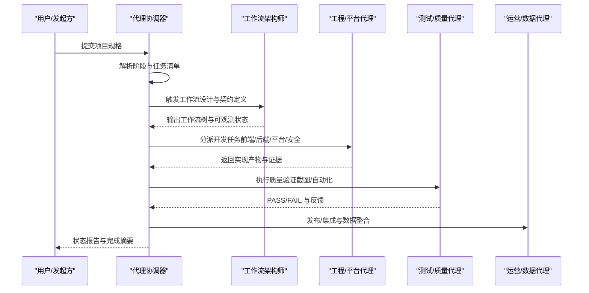

图表来源
- [agents-orchestrator.md](file://specialized/agents-orchestrator.md)
- [specialized-workflow-architect.md](file://specialized/specialized-workflow-architect.md)

## 详细组件分析

### 代理协调器（Agents Orchestrator）
- 职责边界：全生命周期编排、任务级 QA 循环、错误恢复、状态与度量
- 关键流程：项目分析与规划、技术架构、开发-QA 连续循环、最终集成验证
- 决策逻辑：基于证据的 PASS/FAIL、最大重试次数、严格质量门禁
- 产出模板：状态报告、完成摘要、质量度量、Agent 绩效
- 章节来源
  - [agents-orchestrator.md](file://specialized/agents-orchestrator.md)

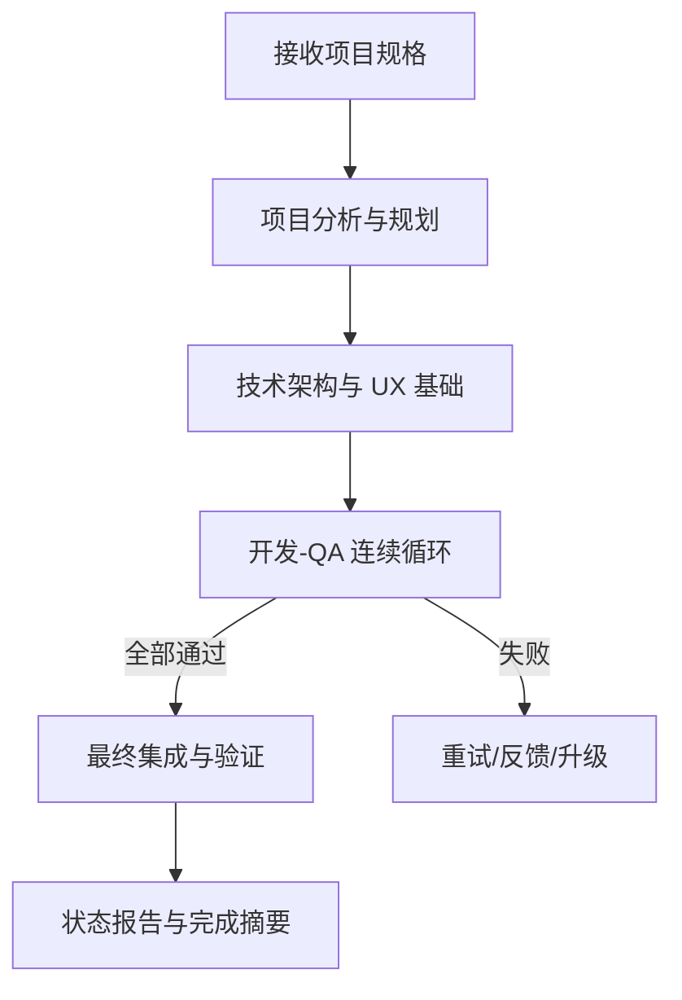

图表来源
- [agents-orchestrator.md](file://specialized/agents-orchestrator.md)

### 会计应付代理（Accounts Payable Agent）
- 能力要点：幂等性支付、多渠道路由、支出上限与授权、审计日志与汇总
- 工作流：发票去重→供应商核验→最佳通道选择→执行与通知→失败重试/升级
- 交付物：支付历史与汇总、异常与差异标记、供应商注册与偏好地址
- 章节来源
  - [accounts-payable-agent.md](file://specialized/accounts-payable-agent.md)

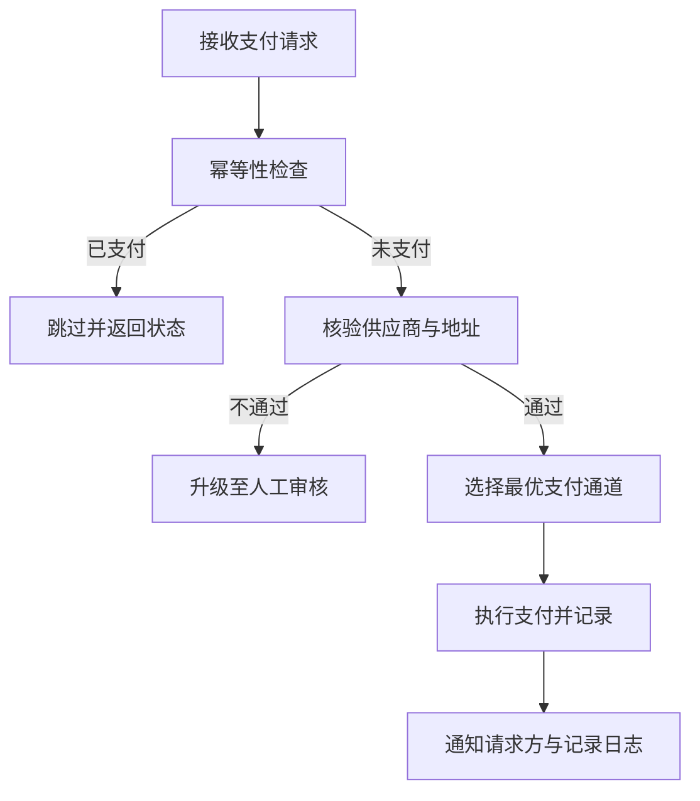

图表来源
- [accounts-payable-agent.md](file://specialized/accounts-payable-agent.md)

### 自动化治理架构师（Automation Governance Architect）
- 评估框架：月节省时间、数据敏感度、外部依赖风险、可扩展性
- 决策结论：批准/试点/部分自动化/延期/拒绝
- 标准：n8n 工作流结构、命名与版本、可靠性基线、日志与测试基线、集成治理、再审计触发
- 章节来源
  - [automation-governance-architect.md](file://specialized/automation-governance-architect.md)

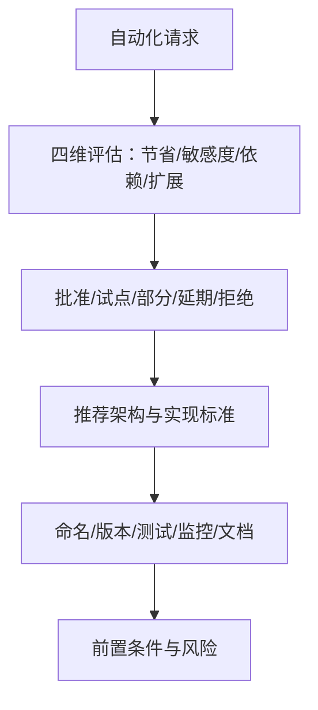

图表来源
- [automation-governance-architect.md](file://specialized/automation-governance-architect.md)

### 区块链安全审计员（Blockchain Security Auditor）
- 方法论：范围与侦察→自动化分析→手动逐行审查→经济与博弈分析→报告与修复
- 交付物：漏洞分类（致命/高/中/低/信息）、修复 PoC、报告模板、工具链集成
- 章节来源
  - [blockchain-security-auditor.md](file://specialized/blockchain-security-auditor.md)

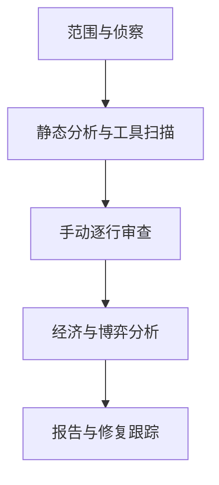

图表来源
- [blockchain-security-auditor.md](file://specialized/blockchain-security-auditor.md)

### 合规审计员（Compliance Auditor）
- 能力：差距评估、控制实施、审计支持、持续合规
- 交付物：差距评估报告、证据收集矩阵、政策模板
- 章节来源
  - [compliance-auditor.md](file://specialized/compliance-auditor.md)

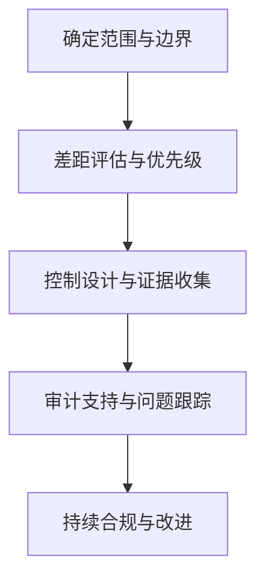

图表来源
- [compliance-auditor.md](file://specialized/compliance-auditor.md)

### 企业培训设计师（Corporate Training Designer）
- 能力：需求分析、课程体系、教学法、平台适配、训后评估
- 交付物：学习路径、课程包、内部讲师培养、评估报告
- 章节来源
  - [corporate-training-designer.md](file://specialized/corporate-training-designer.md)

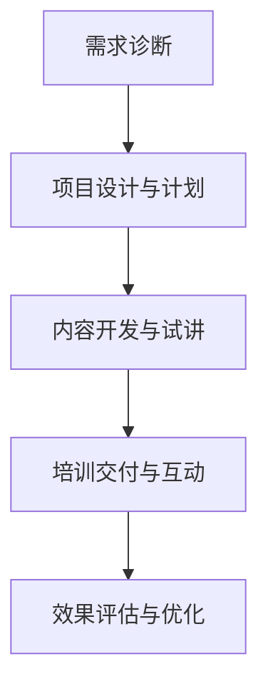

图表来源
- [corporate-training-designer.md](file://specialized/corporate-training-designer.md)

### 数据整合代理（Data Consolidation Agent）
- 能力：销售指标聚合、仪表盘视图、多时间维度、自动刷新
- 交付物：区域/代表/管道快照、趋势与 Top 表现者
- 章节来源
  - [data-consolidation-agent.md](file://specialized/data-consolidation-agent.md)

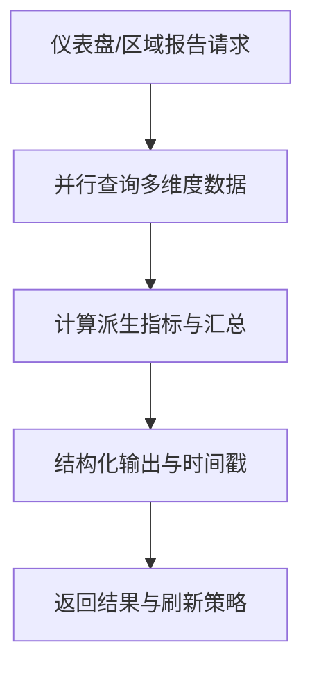

图表来源
- [data-consolidation-agent.md](file://specialized/data-consolidation-agent.md)

### 工作流架构师（Specialized Workflow Architect）
- 能力：工作流树谱系、失败分支与恢复、可观测状态、手过户契约
- 交付物：工作流树规范、测试用例、清理清单、现实校验发现
- 章节来源
  - [specialized-workflow-architect.md](file://specialized/specialized-workflow-architect.md)

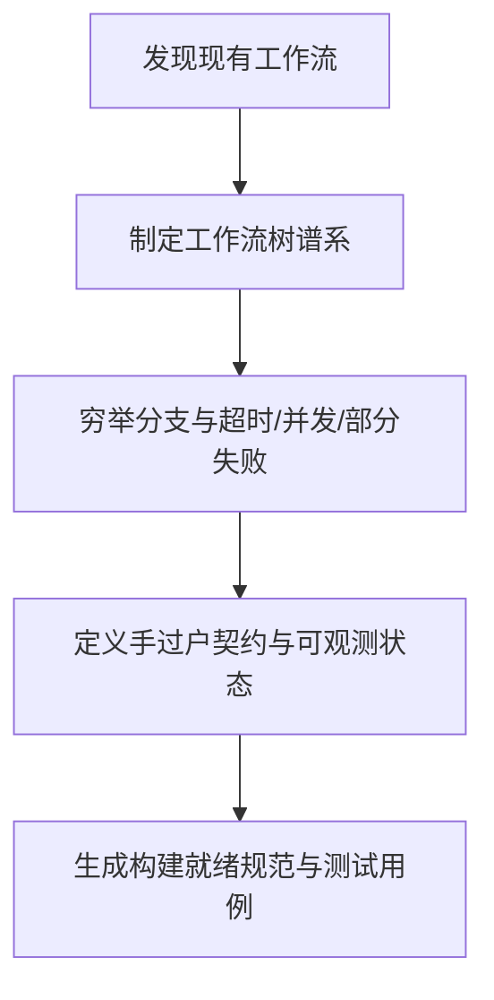

图表来源
- [specialized-workflow-architect.md](file://specialized/specialized-workflow-architect.md)

### 土木工程师（Specialized Civil Engineer）
- 能力：多标准结构分析、地基承载与沉降、构造图与合规矩阵
- 交付物：结构计算示例、地基承载计算、BIM 协调清单
- 章节来源
  - [specialized-civil-engineer.md](file://specialized/specialized-civil-engineer.md)

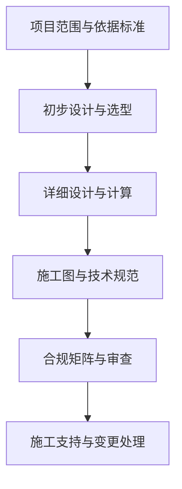

图表来源
- [specialized-civil-engineer.md](file://specialized/specialized-civil-engineer.md)

### 文化智能策略师（Specialized Cultural Intelligence Strategist）
- 能力：隐性排斥审计、全局国际化架构、语义与本地化、反偏见约束
- 交付物：UI/UX 包容性检查清单、图像生成反偏见库、文化背景简报
- 章节来源
  - [specialized-cultural-intelligence-strategist.md](file://specialized/specialized-cultural-intelligence-strategist.md)

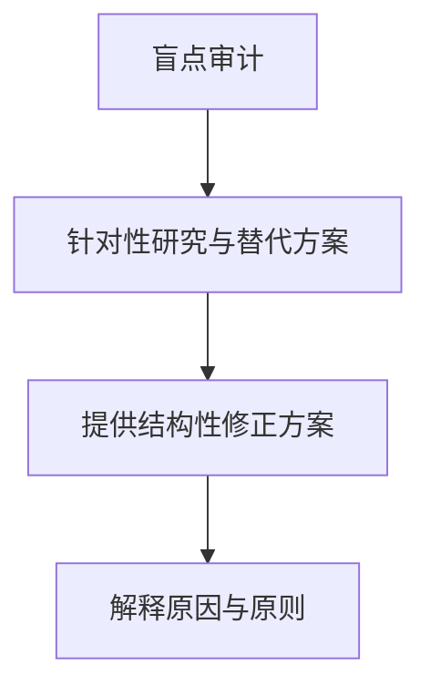

图表来源
- [specialized-cultural-intelligence-strategist.md](file://specialized/specialized-cultural-intelligence-strategist.md)

### 开发者倡导者（Specialized Developer Advocate）
- 能力：DX 工程、技术内容、社区建设、产品反馈闭环
- 交付物：DX 审计框架、病毒式教程、会议提案、调查与指标
- 章节来源
  - [specialized-developer-advocate.md](file://specialized/specialized-developer-advocate.md)

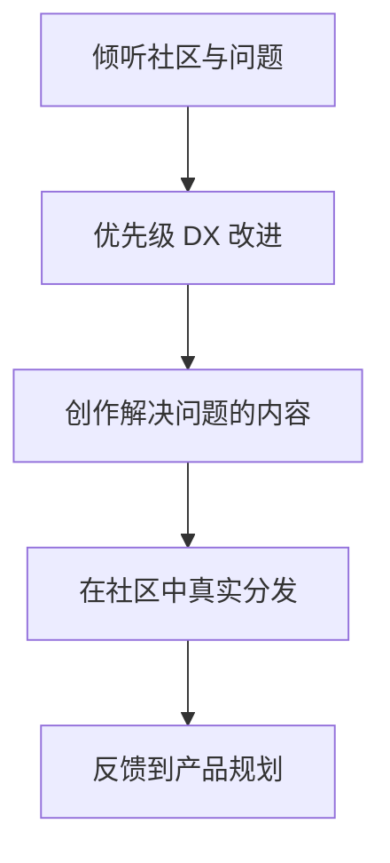

图表来源
- [specialized-developer-advocate.md](file://specialized/specialized-developer-advocate.md)

### 文档生成器（Specialized Document Generator）
- 能力：PDF/PPTX/XLSX/DOCX 自动生成、样式与品牌一致、可访问性
- 章节来源
  - [specialized-document-generator.md](file://specialized/specialized-document-generator.md)

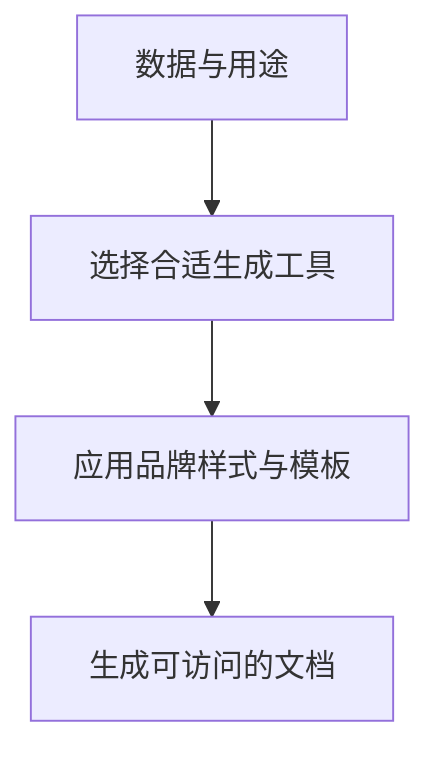

图表来源
- [specialized-document-generator.md](file://specialized/specialized-document-generator.md)

### 法国咨询市场导航（Specialized French Consulting Market）
- 能力：ESN/SI 边际模型、平台机制、费率定位、支付周期与风险
- 交付物：ESN 边际结构、平台对比矩阵、费率谈判策略、端到端合同审查
- 章节来源
  - [specialized-french-consulting-market.md](file://specialized/specialized-french-consulting-market.md)

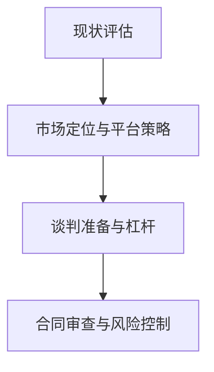

图表来源
- [specialized-french-consulting-market.md](file://specialized/specialized-french-consulting-market.md)

### 韩国商务导航（Specialized Korean Business Navigator）
- 能力：품의（审批）流程、nunchi（读心术）、KakaoTalk 礼仪、层级与关系
- 交付物：품의时间线、Nunchi 解码、KakaoTalk 沟通脚本、公司层级表
- 章节来源
  - [specialized-korean-business-navigator.md](file://specialized/specialized-korean-business-navigator.md)

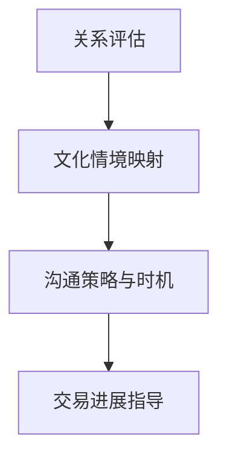

图表来源
- [specialized-korean-business-navigator.md](file://specialized/specialized-korean-business-navigator.md)

### 模型 QA 专家（Specialized Model QA）
- 能力：全生命周期 QA、数据重建、校准测试、可解释性与公平性审计
- 交付物：QA 报告模板、PSI/鉴别力/校准图表、SHAP/PDP 分析
- 章节来源
  - [specialized-model-qa.md](file://specialized/specialized-model-qa.md)

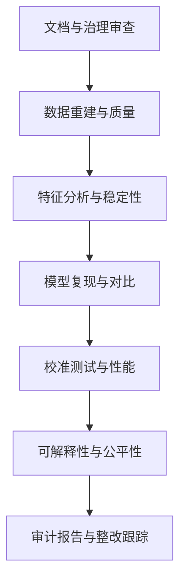

图表来源
- [specialized-model-qa.md](file://specialized/specialized-model-qa.md)

### Salesforce 架构师（Specialized Salesforce Architect）
- 能力：多云架构、集成模式、限额意识设计、数据模型治理、CI/CD
- 交付物：ADR、集成蓝图、数据模型检查清单、限额预算
- 章节来源
  - [specialized-salesforce-architect.md](file://specialized/specialized-salesforce-architect.md)

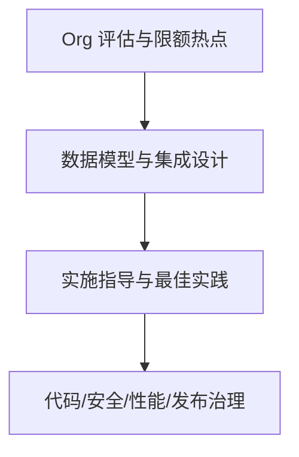

图表来源
- [specialized-salesforce-architect.md](file://specialized/specialized-salesforce-architect.md)

## 依赖关系分析
- 协调器与各专业代理之间通过“上下文传递、证据要求、失败恢复、度量报告”建立契约式依赖
- 工作流架构师为其他工程/平台代理提供“构建就绪规范”，降低实现歧义
- 自动化治理架构师为自动化提案提供“价值-风险-可维护性”三向评估，避免盲目自动化
- 区块链安全审计员与模型 QA 专家分别在“智能合约安全”和“机器学习质量”两个高风险领域提供深度把关
- 合规审计员与会计应付代理在“财务与合规”领域形成闭环，确保流程可审计、可追溯
- 企业培训设计师与开发者倡导者在“人因与组织”层面提升整体交付质量与团队能力
- 文化智能策略师、法国/韩国商务导航在“跨文化与跨境”场景下降低隐性摩擦
- 土木工程师与文档生成器在“工程设计与交付物”层面提供标准化与可访问性保障

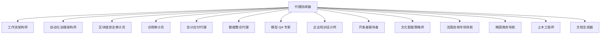

图表来源
- [agents-orchestrator.md](file://specialized/agents-orchestrator.md)
- [specialized-workflow-architect.md](file://specialized/specialized-workflow-architect.md)
- [automation-governance-architect.md](file://specialized/automation-governance-architect.md)
- [blockchain-security-auditor.md](file://specialized/blockchain-security-auditor.md)
- [compliance-auditor.md](file://specialized/compliance-auditor.md)
- [accounts-payable-agent.md](file://specialized/accounts-payable-agent.md)
- [data-consolidation-agent.md](file://specialized/data-consolidation-agent.md)
- [specialized-model-qa.md](file://specialized/specialized-model-qa.md)
- [corporate-training-designer.md](file://specialized/corporate-training-designer.md)
- [specialized-developer-advocate.md](file://specialized/specialized-developer-advocate.md)
- [specialized-cultural-intelligence-strategist.md](file://specialized/specialized-cultural-intelligence-strategist.md)
- [specialized-french-consulting-market.md](file://specialized/specialized-french-consulting-market.md)
- [specialized-korean-business-navigator.md](file://specialized/specialized-korean-business-navigator.md)
- [specialized-civil-engineer.md](file://specialized/specialized-civil-engineer.md)
- [specialized-document-generator.md](file://specialized/specialized-document-generator.md)

## 性能考量
- 编排与测试：任务级 QA 循环与严格质量门禁可显著降低返工成本，但需平衡重试次数与吞吐
- 数据与指标：数据整合代理应采用并行查询与增量更新策略，减少仪表盘延迟
- 自动化治理：标准化工作流与再审计触发可降低技术债累积，提高系统可维护性
- 合规与安全：合规审计与安全审计前置，可减少后期补救成本与风险暴露
- 跨文化与跨境：文化智能与市场导航减少隐性摩擦，提升转化率与客户满意度
- 模型与平台：模型 QA 与限额意识设计可降低生产事故与资源浪费

## 故障排查指南
- 编排与测试
  - 现象：任务多次失败且无进展
  - 排查：检查重试上限、失败反馈是否明确、证据是否可复现
  - 处置：升级至人工介入、调整任务粒度、补充上下文
  - 章节来源
    - [agents-orchestrator.md](file://specialized/agents-orchestrator.md)

- 会计应付
  - 现象：重复支付或支付失败
  - 排查：幂等性检查、供应商核验、通道可用性、审计日志
  - 处置：重试/切换通道/人工审核
  - 章节来源
    - [accounts-payable-agent.md](file://specialized/accounts-payable-agent.md)

- 自动化治理
  - 现象：自动化未达预期或引入新风险
  - 排查：价值评估、依赖链、可扩展性、文档与测试
  - 处置：拒绝/试点/部分自动化
  - 章节来源
    - [automation-governance-architect.md](file://specialized/automation-governance-architect.md)

- 区块链安全
  - 现象：漏洞被利用或修复无效
  - 排查：PoC 复现、修复验证、报告与监控
  - 处置：紧急救援与修复、War Room 协同
  - 章节来源
    - [blockchain-security-auditor.md](file://specialized/blockchain-security-auditor.md)

- 合规审计
  - 现象：审计发现问题或证据不足
  - 排查：差距评估、证据收集矩阵、控制有效性
  - 处置：补强控制、再测试、持续合规
  - 章节来源
    - [compliance-auditor.md](file://specialized/compliance-auditor.md)

- 数据整合
  - 现象：仪表盘延迟或数据不一致
  - 排查：查询并行度、缓存与刷新策略、汇总口径
  - 处置：优化查询、增加索引、统一口径
  - 章节来源
    - [data-consolidation-agent.md](file://specialized/data-consolidation-agent.md)

- 工作流架构
  - 现象：实现与 spec 不符或失败路径缺失
  - 排查：现实校验、清理清单、可观测状态
  - 处置：修订 spec、补充测试用例、完善契约
  - 章节来源
    - [specialized-workflow-architect.md](file://specialized/specialized-workflow-architect.md)

- 模型 QA
  - 现象：模型漂移或校不准
  - 排查：PSI/鉴别力/校准测试、SHAP/PDP 分析、公平性审计
  - 处置：重新训练/阈值调整/特征治理
  - 章节来源
    - [specialized-model-qa.md](file://specialized/specialized-model-qa.md)

- Salesforce 架构
  - 现象：限额超限或集成失败
  - 排查：限额预算、批量处理、异步与 DLQ
  - 处置：限额意识设计、异步化、重试与熔断
  - 章节来源
    - [specialized-salesforce-architect.md](file://specialized/specialized-salesforce-architect.md)

## 结论
专业代理通过“深度能力 + 严谨流程 + 可观测契约 + 持续改进”的方法论，在各自专业领域提供可复用、可扩展、可治理的服务。以代理协调器为核心，串联工程、数据、合规、组织、文化与平台等多维代理，形成“从需求到交付”的闭环。通过质量门禁、证据要求、失败恢复与度量报告，确保专业服务的可靠性与可追溯性。在垂直行业应用中，专业代理能够以标准化流程与定制化能力，实现创新价值与规模化交付。

## 附录
- 认证与质量保证机制建议
  - 建立“专业代理能力画像”与“交付物清单”，作为认证与复评依据
  - 引入“证据驱动的 PASS/FAIL 决策”与“失败升级流程”
  - 设立“质量度量基线”（如重复支付率、仪表盘刷新时间、合规覆盖率）
  - 推行“持续改进与再审计”机制，确保代理能力与行业演进同步
- 协作模式最佳实践
  - 明确“手过户契约”：输入/输出、超时/失败/恢复、可观测状态
  - 使用“构建就绪规范”（如工作流树）降低实现歧义
  - 在高风险领域（安全/合规/模型）前置专业代理，减少后期补救
  - 以“代理协调器”为中心，统一上下文传递与状态管理