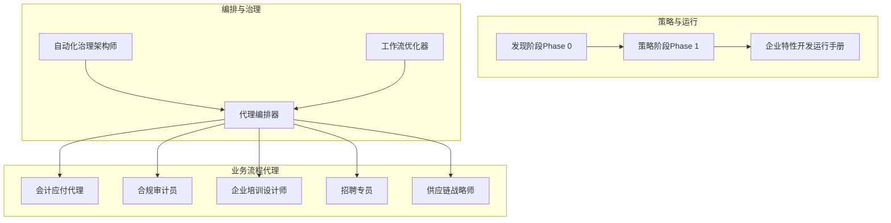
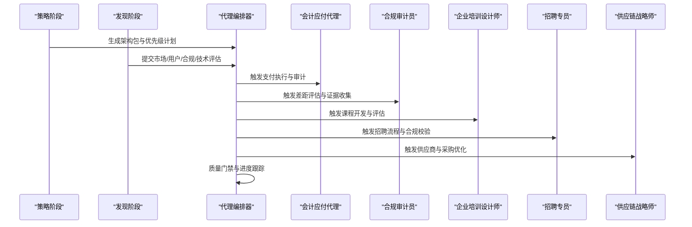
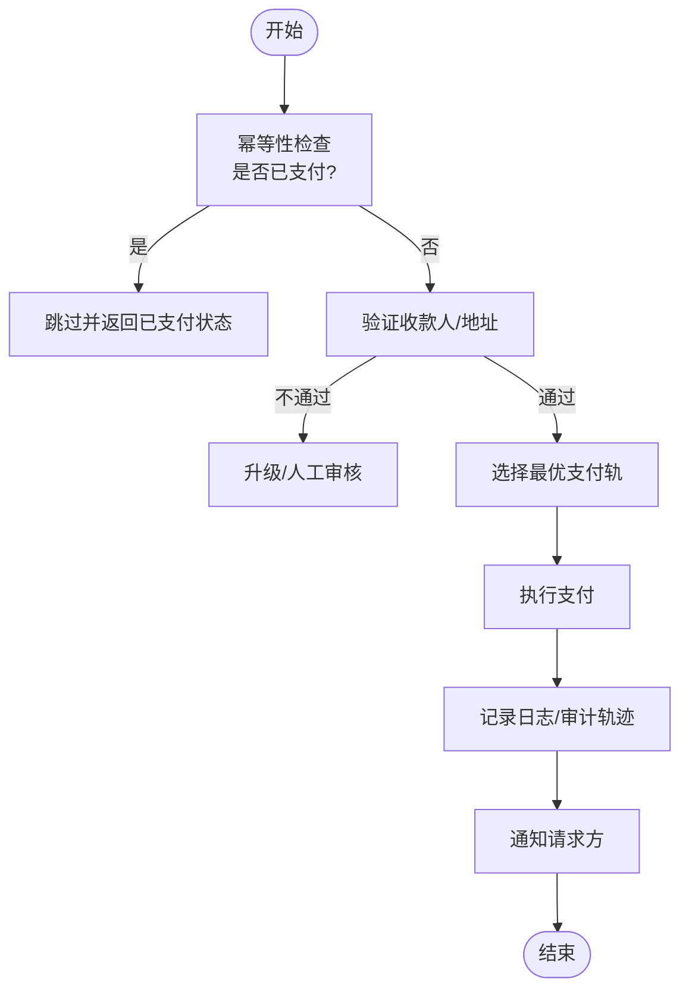
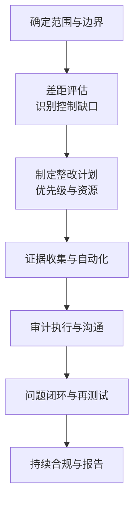
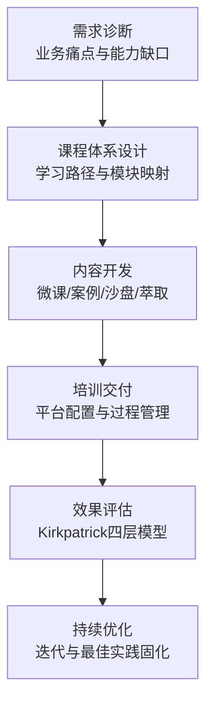
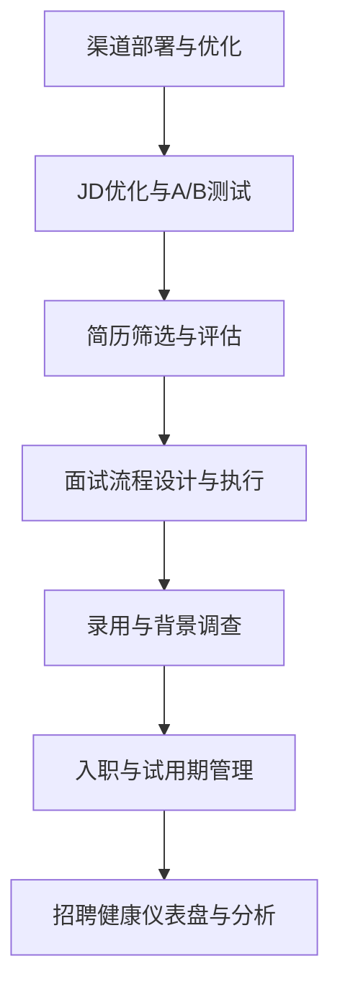
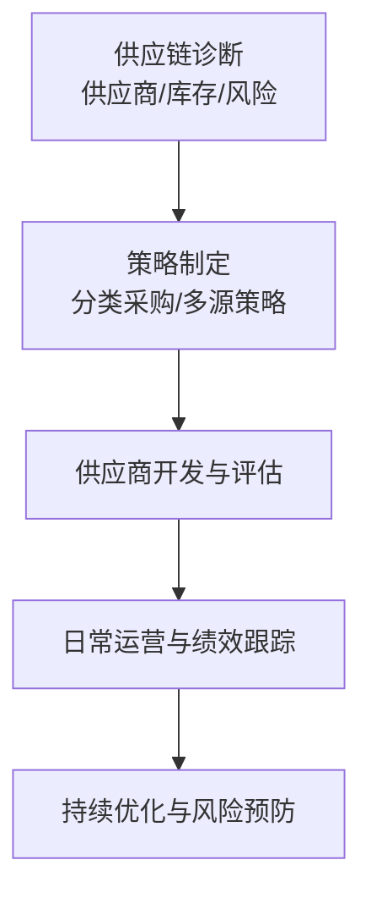
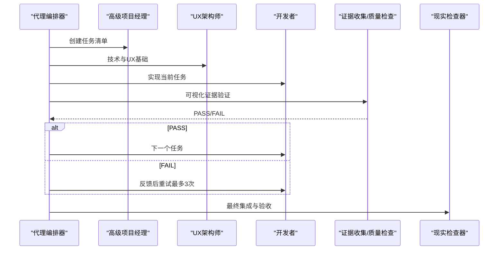
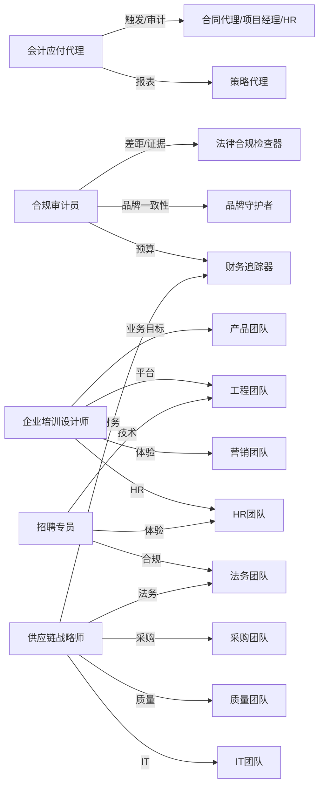

# 业务流程代理

<cite>
**本文档引用的文件**
- [accounts-payable-agent.md](file://specialized/accounts-payable-agent.md)
- [compliance-auditor.md](file://specialized/compliance-auditor.md)
- [corporate-training-designer.md](file://specialized/corporate-training-designer.md)
- [recruitment-specialist.md](file://specialized/recruitment-specialist.md)
- [supply-chain-strategist.md](file://specialized/supply-chain-strategist.md)
- [agents-orchestrator.md](file://specialized/agents-orchestrator.md)
- [phase-0-discovery.md](file://strategy/playbooks/phase-0-discovery.md)
- [phase-1-strategy.md](file://strategy/playbooks/phase-1-strategy.md)
- [scenario-enterprise-feature.md](file://strategy/runbooks/scenario-enterprise-feature.md)
- [README.md](file://README.md)
- [workflow-book-chapter.md](file://examples/workflow-book-chapter.md)
</cite>

## 目录
1. [简介](#简介)
2. [项目结构](#项目结构)
3. [核心组件](#核心组件)
4. [架构总览](#架构总览)
5. [详细组件分析](#详细组件分析)
6. [依赖关系分析](#依赖关系分析)
7. [性能考量](#性能考量)
8. [故障排查指南](#故障排查指南)
9. [结论](#结论)
10. [附录](#附录)

## 简介
本文件为企业业务流程代理的系统化文档，聚焦以下专业代理：会计应付代理、合规审计员、企业培训设计师、招聘专员与供应链战略师。文档从架构设计、组件职责、数据流与处理逻辑、协作模式、错误处理与性能特征等方面进行深入剖析，并结合策略与运行手册，展示这些代理如何优化企业内部流程、提升运营效率与合规性，以及如何通过多代理协作实现复杂业务目标。同时提供跨行业应用案例与最佳实践，帮助组织实现数字化转型与流程自动化。

## 项目结构
该仓库采用“按职能分部”的组织方式，业务流程代理位于“specialized”目录下，配套有策略与运行手册（strategy）、示例工作流（examples）以及通用的README概览。业务流程代理与其协作机制的关系如下图所示：

图表来源
- [phase-0-discovery.md:1-179](file://strategy/playbooks/phase-0-discovery.md#L1-L179)
- [phase-1-strategy.md:1-239](file://strategy/playbooks/phase-1-strategy.md#L1-L239)
- [scenario-enterprise-feature.md:1-158](file://strategy/runbooks/scenario-enterprise-feature.md#L1-L158)
- [agents-orchestrator.md:1-367](file://specialized/agents-orchestrator.md#L1-L367)

章节来源
- [README.md:1-800](file://README.md#L1-L800)

## 核心组件
本节概述五个业务流程代理的核心职责与交付物，为后续详细分析奠定基础。

- 会计应付代理
  - 职责：自主执行供应商与承包商付款、维护审计轨迹、集成到代理工作流、处理失败与重试。
  - 关键能力：支付路由选择、幂等性控制、支出限额与升级、AP汇总报告生成。
  - 协作：与合同代理、项目经理、HR、策略代理对接。

- 合规审计员
  - 职责：SOC 2、ISO 27001、HIPAA、PCI-DSS等合规审计的准备、差距评估、证据收集、认证支持。
  - 关键能力：控制实施、证据自动化、审计执行、持续合规。
  - 协作：与法律合规检查器、品牌守护者、财务追踪器等对齐。

- 企业培训设计师
  - 职责：企业培训体系设计、课程开发、学习路径规划、内部讲师培养、培训效果评估。
  - 关键能力：ADDIE/SAM模型、成人学习原理、混合式学习、平台适配（钉钉、企业微信、飞书等）。
  - 协作：与产品、工程、营销、HR等跨部门联动。

- 招聘专员
  - 职责：中国主流招聘平台运营、简历筛选与人才评估、面试流程设计、校园招聘、头猎管理、劳动法合规。
  - 关键能力：渠道ROI分析、JD优化、背景调查、入职与试用期管理。
  - 协作：与HR、法务、技术团队协作，确保合规与效率。

- 供应链战略师
  - 职责：供应商管理、战略采购、质量与交付控制、库存与物流优化、供应链数字化与风险管控。
  - 关键能力：分类采购策略、成本分析（TCO）、安全库存与补货策略、数字供应链成熟度评估。
  - 协作：与采购、质量、IT、财务、法务协同。

章节来源
- [accounts-payable-agent.md:1-186](file://specialized/accounts-payable-agent.md#L1-L186)
- [compliance-auditor.md:1-159](file://specialized/compliance-auditor.md#L1-L159)
- [corporate-training-designer.md:1-193](file://specialized/corporate-training-designer.md#L1-L193)
- [recruitment-specialist.md:1-510](file://specialized/recruitment-specialist.md#L1-L510)
- [supply-chain-strategist.md:1-583](file://specialized/supply-chain-strategist.md#L1-L583)

## 架构总览
业务流程代理的运行遵循“发现—策略—执行—验收—运营”的完整生命周期，代理编排器贯穿其中，确保任务按质量门禁推进，跨代理协作有序进行。

图表来源
- [phase-1-strategy.md:1-239](file://strategy/playbooks/phase-1-strategy.md#L1-L239)
- [phase-0-discovery.md:1-179](file://strategy/playbooks/phase-0-discovery.md#L1-L179)
- [scenario-enterprise-feature.md:1-158](file://strategy/runbooks/scenario-enterprise-feature.md#L1-L158)
- [agents-orchestrator.md:1-367](file://specialized/agents-orchestrator.md#L1-L367)

## 详细组件分析

### 会计应付代理
- 业务流程专长
  - 支付路由优化：基于金额、收款人与成本自动选择ACH、电汇、加密货币或稳定币。
  - 幂等性与审计：重复支付防护、发票匹配、日志与AP摘要生成。
  - 失败处理：多轨重试、升级与人工介入。
- 行业知识
  - 跨支付基础设施（crypto/fiat/stablecoin），与银行/第三方支付API集成。
- 服务范围与应用场景
  - 承包商里程碑付款、周期性账单、项目型付款触发、跨系统工具调用。
- 协作模式
  - 与合同代理、项目经理、HR、策略代理协作，接收请求、反馈状态、生成报表。
- 错误处理与性能
  - 幂等性检查前置、验证阈值、支出限额、审计覆盖100%、SLA内升级。

图表来源
- [accounts-payable-agent.md:63-146](file://specialized/accounts-payable-agent.md#L63-L146)

章节来源
- [accounts-payable-agent.md:1-186](file://specialized/accounts-payable-agent.md#L1-L186)

### 合规审计员
- 业务流程专长
  - 合规框架差距评估、控制设计与证据收集、审计执行支持、持续合规监控。
- 行业知识
  - SOC 2、ISO 27001、HIPAA、PCI-DSS等；技术控制优先、证据自动化、风险导向。
- 服务范围与应用场景
  - 从准备到认证全流程支持，证据矩阵、政策模板、控制测试与整改闭环。
- 协作模式
  - 与法律合规检查器、品牌守护者、财务追踪器协作，纳入架构与预算。
- 错误处理与性能
  - 控制有效性测试、证据可追溯、问题闭环与再测试、持续改进。

图表来源
- [compliance-auditor.md:131-159](file://specialized/compliance-auditor.md#L131-L159)

章节来源
- [compliance-auditor.md:1-159](file://specialized/compliance-auditor.md#L1-L159)

### 企业培训设计师
- 业务流程专长
  - 需求诊断、课程体系设计、教学法应用、平台适配、内部讲师培养、评估与优化。
- 行业知识
  - ADDIE/SAM模型、成人学习理论、混合式学习（OMO）、中国主流学习平台生态。
- 服务范围与应用场景
  - 新员工入职、领导力发展、合规培训、关键岗位能力提升、培训效果追踪。
- 协作模式
  - 与产品、工程、营销、HR协作，确保业务目标驱动与数据支撑。
- 错误处理与性能
  - 拒绝“为培训而培训”，以业务结果为导向，数据驱动优化。

图表来源
- [corporate-training-designer.md:144-193](file://specialized/corporate-training-designer.md#L144-L193)

章节来源
- [corporate-training-designer.md:1-193](file://specialized/corporate-training-designer.md#L1-L193)

### 招聘专员
- 业务流程专长
  - 渠道运营与ROI分析、JD优化、简历筛选与人才评估、面试流程设计、校园招聘、头猎管理、劳动法合规。
- 行业知识
  - BOSS直聘、拉勾、猎聘、智联、前程无忧、脉脉、LinkedIn中国等平台；劳动法、五险一金、竞业限制、N+1补偿。
- 服务范围与应用场景
  - 全渠道招聘、雇主品牌建设、入职与试用期管理、招聘健康仪表盘与预测分析。
- 协作模式
  - 与HR、法务、技术团队协作，确保合规与体验。
- 错误处理与性能
  - 零劳动法合规事件、候选人体验NPS达标、平均到岗周期与留用率优化。

图表来源
- [recruitment-specialist.md:428-510](file://specialized/recruitment-specialist.md#L428-L510)

章节来源
- [recruitment-specialist.md:1-510](file://specialized/recruitment-specialist.md#L1-L510)

### 供应链战略师
- 业务流程专长
  - 供应商开发与分级、战略采购、质量与交付控制、库存与物流优化、供应链数字化与风险管控。
- 行业知识
  - 1688/阿里巴巴、Made-in-China、Global Sources、广交会、工业集群与直接工厂；库存模型（EOQ/安全库存/ROP）、TCO、ESG与合规。
- 服务范围与应用场景
  - 采购成本降低、供应韧性提升、库存周转优化、数字供应链成熟度评估与路线图。
- 协作模式
  - 与采购、质量、IT、财务、法务协同，建立端到端可见性与闭环。
- 错误处理与性能
  - 供应商风险扫描与响应、死料处置、成本目标达成、零重大断供事件。

图表来源
- [supply-chain-strategist.md:457-583](file://specialized/supply-chain-strategist.md#L457-L583)

章节来源
- [supply-chain-strategist.md:1-583](file://specialized/supply-chain-strategist.md#L1-L583)

### 代理编排器与协作模式
- 代理编排器负责全生命周期的流水线管理，确保任务按质量门禁推进，跨代理协作有序进行。
- 关键能力：任务级质量循环、失败恢复、状态跟踪、报告与总结。
- 在企业特性开发场景中，编排器协调PM、架构师、开发者与QA，形成Dev-QA闭环，最终由质量检查器进行验收。

图表来源
- [agents-orchestrator.md:53-207](file://specialized/agents-orchestrator.md#L53-L207)
- [scenario-enterprise-feature.md:47-126](file://strategy/runbooks/scenario-enterprise-feature.md#L47-L126)

章节来源
- [agents-orchestrator.md:1-367](file://specialized/agents-orchestrator.md#L1-L367)
- [scenario-enterprise-feature.md:1-158](file://strategy/runbooks/scenario-enterprise-feature.md#L1-L158)

## 依赖关系分析
- 代理间耦合与协作
  - 会计应付代理依赖合同代理/项目经理/HR触发与审计日志；与策略代理共享AP报表。
  - 合规审计员与法律合规检查器、品牌守护者、财务追踪器在策略阶段对齐。
  - 企业培训设计师与产品、工程、营销、HR协作，确保业务目标与平台能力匹配。
  - 招聘专员与HR、法务、技术团队协作，保障合规与体验。
  - 供应链战略师与采购、质量、IT、财务、法务协作，构建端到端可见性。
- 外部依赖与集成点
  - 支付轨（ACH/电汇/加密货币/稳定币）、招聘平台、ERP/SRM系统、学习平台、供应链可视化工具。
- 潜在循环依赖
  - 通过编排器与明确的输入输出契约避免循环依赖；质量门禁确保上游产出满足下游要求。

图表来源
- [phase-1-strategy.md:19-239](file://strategy/playbooks/phase-1-strategy.md#L19-L239)
- [scenario-enterprise-feature.md:13-158](file://strategy/runbooks/scenario-enterprise-feature.md#L13-L158)
- [accounts-payable-agent.md:180-186](file://specialized/accounts-payable-agent.md#L180-L186)
- [compliance-auditor.md:131-159](file://specialized/compliance-auditor.md#L131-L159)
- [corporate-training-designer.md:144-193](file://specialized/corporate-training-designer.md#L144-L193)
- [recruitment-specialist.md:428-510](file://specialized/recruitment-specialist.md#L428-L510)
- [supply-chain-strategist.md:457-583](file://specialized/supply-chain-strategist.md#L457-L583)

## 性能考量
- 会计应付代理
  - 幂等性检查前置、验证阈值与支出限额、审计覆盖率与SLA内的升级响应。
- 合规审计员
  - 控制测试与证据自动化、风险导向的差距评估、持续合规监控。
- 企业培训设计师
  - 数据驱动的评估（Kirkpatrick Level 3/4）、平台适配与学习数据分析、内部讲师池建设。
- 招聘专员
  - 渠道ROI分析、招聘漏斗转化率、平均到岗周期与留用率、候选人体验NPS。
- 供应链战略师
  - 库存模型优化（EOQ/安全库存/ROP）、TCO分析、供应商风险扫描与响应、数字供应链成熟度评估。

## 故障排查指南
- 会计应付代理
  - 支付失败：检查支付轨可用性与重试策略；若全部失败则保留并告警。
  - 金额不一致：与采购订单比对，保持暂停直至人工复核。
  - 供应商未在白名单：升级至合规/采购审批。
- 合规审计员
  - 控制未测试：要求测试证据；证据不可靠时拒绝关闭。
  - 框架差异：对照具体控制参考，明确现状与目标状态。
- 企业培训设计师
  - 学习效果不达预期：回溯评估层级与数据，调整课程与交付方式。
  - 平台适配问题：确认平台能力与内容格式匹配。
- 招聘专员
  - 渠道ROI异常：重新分析流量与转化，优化关键词与定向。
  - 合规风险：严格审查背景调查与PIPL授权。
- 供应链战略师
  - 供应商断供：启动替代方案与安全库存；更新风险等级与应对措施。
  - 库存积压：死料处置建议与处置优先级。

章节来源
- [accounts-payable-agent.md:46-49](file://specialized/accounts-payable-agent.md#L46-L49)
- [compliance-auditor.md:40-59](file://specialized/compliance-auditor.md#L40-L59)
- [corporate-training-designer.md:112-143](file://specialized/corporate-training-designer.md#L112-L143)
- [recruitment-specialist.md:396-427](file://specialized/recruitment-specialist.md#L396-L427)
- [supply-chain-strategist.md:434-456](file://specialized/supply-chain-strategist.md#L434-L456)

## 结论
业务流程代理通过专业化能力与标准化工作流，显著提升企业内部流程的自动化水平与合规性。在统一的策略与编排框架下，各代理能够高效协作，实现从发现到执行再到验收的闭环。通过数据驱动的评估与持续优化，企业可在不同行业中快速落地数字化转型，实现降本增效与风险可控。

## 附录
- 适用行业与场景
  - 会计应付代理：制造业、软件服务、外包与项目型公司。
  - 合规审计员：金融、医疗、教育、互联网等强监管行业。
  - 企业培训设计师：制造业、零售、地产、快消等需要大规模组织学习的企业。
  - 招聘专员：互联网、金融、制造业、教育等对人才需求旺盛的行业。
  - 供应链战略师：制造业、零售、电商、汽车零部件等供应链复杂型企业。
- 最佳实践
  - 以业务结果为导向的设计与评估（Kirkpatrick四层模型）。
  - 以数据驱动的招聘漏斗与渠道ROI优化。
  - 以TCO为核心的采购成本降低与风险管控。
  - 以质量门禁与证据自动化的合规与培训交付。
  - 以编排器为核心的跨代理协作与质量闭环。