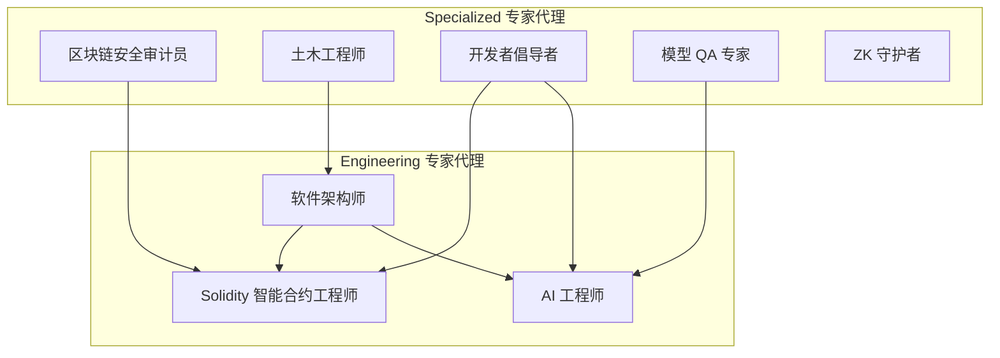
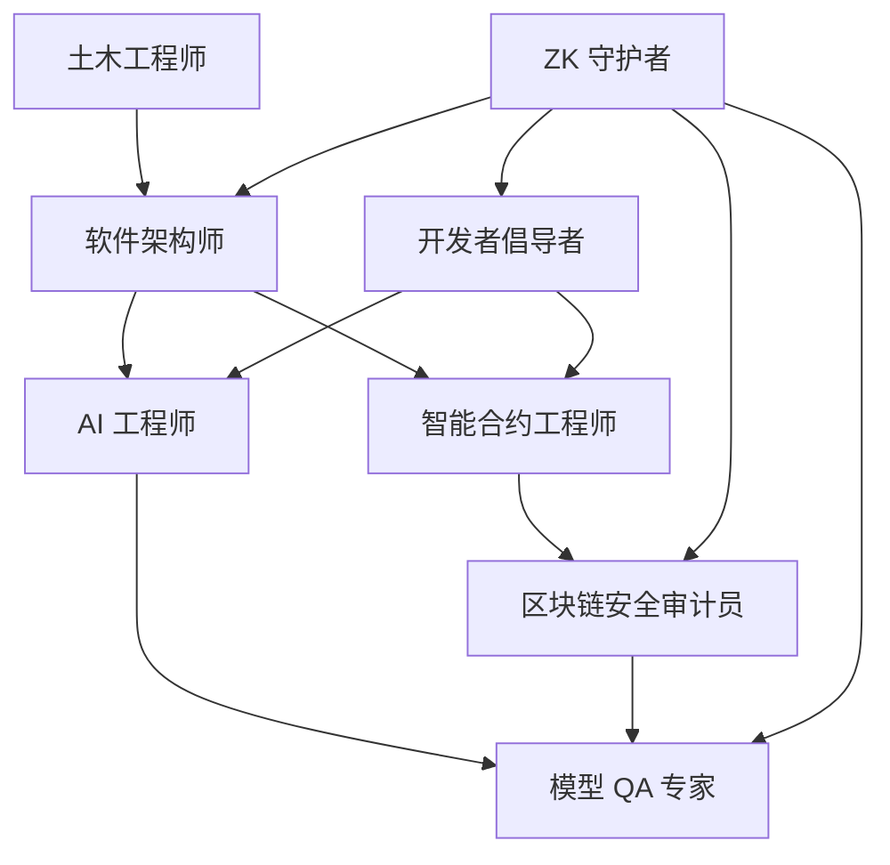
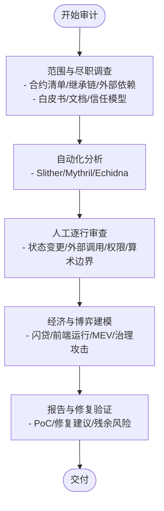
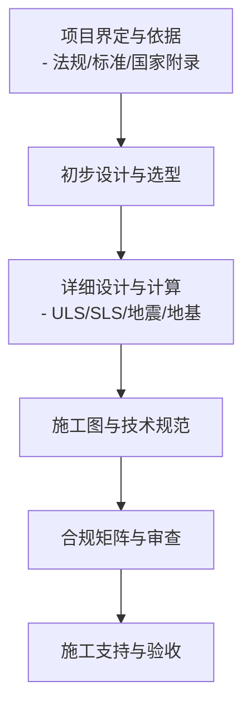
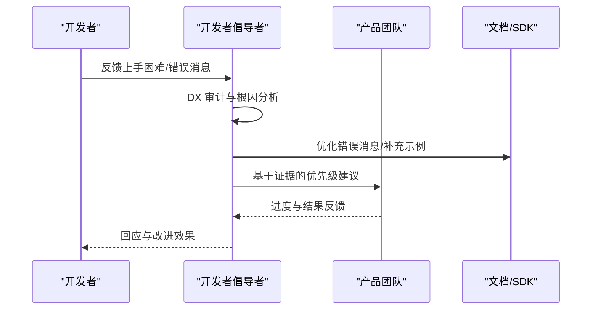
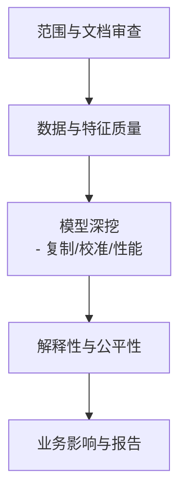
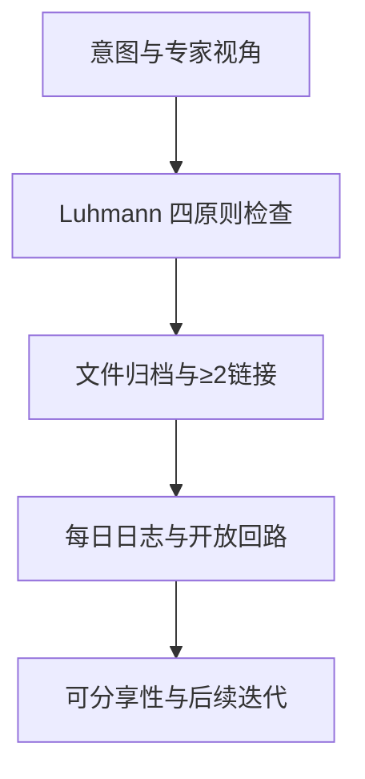
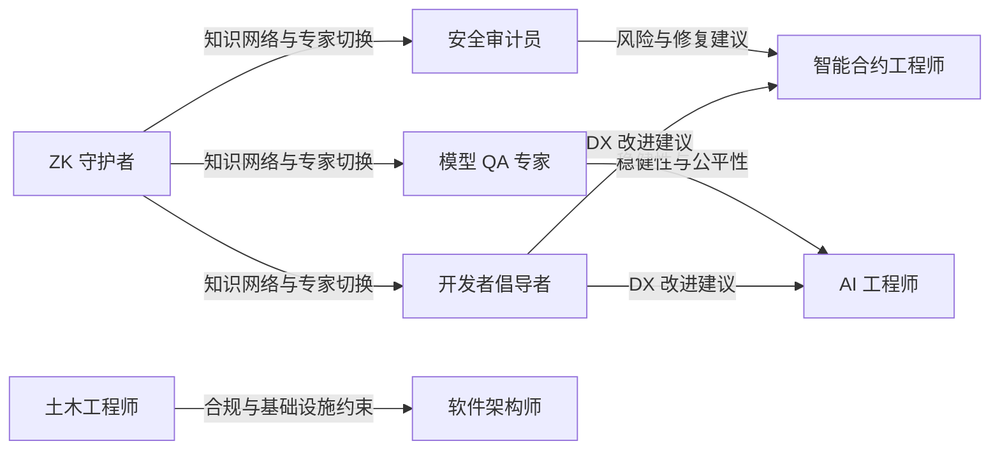

# 技术专家代理

<cite>
**本文引用的文件**
- [README.md](file://README.md)
- [blockchain-security-auditor.md](file://specialized/blockchain-security-auditor.md)
- [specialized-civil-engineer.md](file://specialized/specialized-civil-engineer.md)
- [specialized-developer-advocate.md](file://specialized/specialized-developer-advocate.md)
- [specialized-model-qa.md](file://specialized/specialized-model-qa.md)
- [zk-steward.md](file://specialized/zk-steward.md)
- [engineering-solidity-smart-contract-engineer.md](file://engineering/engineering-solidity-smart-contract-engineer.md)
- [engineering-ai-engineer.md](file://engineering/engineering-ai-engineer.md)
- [engineering-software-architect.md](file://engineering/engineering-software-architect.md)
</cite>

## 目录
1. [简介](#简介)
2. [项目结构](#项目结构)
3. [核心组件](#核心组件)
4. [架构总览](#架构总览)
5. [详细组件分析](#详细组件分析)
6. [依赖关系分析](#依赖关系分析)
7. [性能考量](#性能考量)
8. [故障排查指南](#故障排查指南)
9. [结论](#结论)
10. [附录](#附录)

## 简介
本文件面向技术专家代理，系统化梳理并呈现以下五类专家角色：区块链安全审计员、土木工程师、开发者倡导者、专业模型质量保证（QA）专家、零知识证明守护者（ZK Steward）。我们将从身份与使命、技术专长与深度、工具链与方法论、协作模式与交付物、成功度量与质量保障等方面进行深入解析，并结合真实工作流与可视化图示，帮助读者在复杂技术项目中高效组织与协同这些专家代理，以获得可验证、可复现、可持续的专业洞察与咨询服务。

## 项目结构
The Agency 提供了覆盖工程、设计、营销、销售、产品、项目管理、测试、支持、空间计算、学术、游戏开发等多领域的专业化代理集合。本文聚焦“specialized”与“engineering”两大分组中的技术专家代理，它们均具备明确的身份设定、核心任务、关键规则、交付清单、工作流程与成功指标，形成可复用的“专家代理模板”。

图表来源
- [README.md](file://README.md)
- [blockchain-security-auditor.md](file://specialized/blockchain-security-auditor.md)
- [specialized-civil-engineer.md](file://specialized/specialized-civil-engineer.md)
- [specialized-developer-advocate.md](file://specialized/specialized-developer-advocate.md)
- [specialized-model-qa.md](file://specialized/specialized-model-qa.md)
- [zk-steward.md](file://specialized/zk-steward.md)
- [engineering-solidity-smart-contract-engineer.md](file://engineering/engineering-solidity-smart-contract-engineer.md)
- [engineering-ai-engineer.md](file://engineering/engineering-ai-engineer.md)
- [engineering-software-architect.md](file://engineering/engineering-software-architect.md)

章节来源
- [README.md](file://README.md)

## 核心组件
本节对五大技术专家代理进行要点提炼，便于快速建立“角色—能力—交付”的认知框架。

- 区块链安全审计员
  - 专业领域：智能合约安全、漏洞检测、形式化验证、DeFi 协议风险建模、审计报告撰写
  - 专业知识深度：精通以太坊虚拟机（EVM）、Solidity、常见攻击向量（重入、闪贷、前端运行、权限滥用）、静态分析与符号执行工具链
  - 技术栈：Slither、Mythril、Echidna、Foundry、Certora、Halmos、KEVM
  - 应用场景：DeFi 协议上线前审计、升级路径安全评估、跨协议组合攻击面分析、应急响应与后门调查
  - 关键交付：漏洞分类与影响评估、可复现实验（PoC）、修复建议清单、审计报告模板

- 土木工程师
  - 专业领域：结构分析与设计、地基与边坡稳定性、多标准国际规范（Eurocode、ACI、AISC、AS/NZS、GB、IS、AIJ 等）
  - 专业知识深度：掌握极限状态设计（ULS/SLS）、地震设计、承载力与沉降分析、国家附录差异与冲突处理
  - 技术栈：结构计算、材料与荷载参数、基础设计、BIM 协调与碰撞检查
  - 应用场景：超高层建筑、桥梁隧道、工业厂房、既有结构加固、多标准冲突项目
  - 关键交付：结构计算书、承载力与沉降分析、BIM 协调清单、合规矩阵

- 开发者倡导者
  - 专业领域：开发者体验（DX）工程、社区建设、技术内容创作、产品反馈闭环
  - 专业知识深度：理解开发者心智模型、痛点与学习曲线、平台可用性与错误消息设计
  - 技术栈：开发者调查、时间到首次成功（TTS）审计、教程结构与视频策略、社区运营与影响力指标
  - 应用场景：SDK 优化、开发者上手流程改进、技术博客与视频内容、开源生态与大使计划
  - 关键交付：DX 审计报告、病毒式教程模板、会议提案、社区健康仪表盘

- 专业模型 QA 专家
  - 专业领域：机器学习与统计模型全生命周期审计：文档治理、数据重建、目标标签分析、特征工程、可解释性、校准与公平性、业务影响评估
  - 专业知识深度：PSI、Gini、KS、Hosmer-Lemeshow、SHAP、PDP、挑战者-冠军对比、漂移监控
  - 技术栈：Python 生态（pandas、numpy、scikit-learn、SHAP、sklearn-inspection）、统计检验与可视化
  - 应用场景：风控模型、推荐系统、预测建模、监管合规与审计
  - 关键交付：QA 报告模板、PSI/鉴别指标脚本、SHAP/PDP 可视化、稳定性监控报表

- 零知识证明守护者（ZK Steward）
  - 专业领域：基于 Luhmann 的 Zettelkasten 知识网络构建与维护，强调原子笔记、连接性、验证闭环与跨域专家切换
  - 专业知识深度：知识组织原则、索引与主题映射、任务分解与执行、每日日志与开放回路管理
  - 技术栈：结构化笔记、链接提案、分享性判断、轻量编排与工作流审计
  - 应用场景：个人知识体系、跨学科决策支持、复杂任务拆解与追踪
  - 关键交付：四原则验证清单、文件命名与归档、每日日志模板、结构化阅读笔记

章节来源
- [blockchain-security-auditor.md](file://specialized/blockchain-security-auditor.md)
- [specialized-civil-engineer.md](file://specialized/specialized-civil-engineer.md)
- [specialized-developer-advocate.md](file://specialized/specialized-developer-advocate.md)
- [specialized-model-qa.md](file://specialized/specialized-model-qa.md)
- [zk-steward.md](file://specialized/zk-steward.md)

## 架构总览
下图展示了技术专家代理在复杂项目中的协作关系与信息流：软件架构师统筹系统设计与权衡；智能合约工程师负责底层协议实现；AI 工程师提供智能化能力；安全审计员贯穿开发与部署全周期；模型 QA 专家确保 ML 模型稳健性；开发者倡导者推动 DX 改进与社区反馈；土木工程师在基础设施与结构层面提供跨标准合规；ZK 守护者支撑知识网络与决策过程。

图表来源
- [engineering-software-architect.md](file://engineering/engineering-software-architect.md)
- [engineering-solidity-smart-contract-engineer.md](file://engineering/engineering-solidity-smart-contract-engineer.md)
- [engineering-ai-engineer.md](file://engineering/engineering-ai-engineer.md)
- [blockchain-security-auditor.md](file://specialized/blockchain-security-auditor.md)
- [specialized-model-qa.md](file://specialized/specialized-model-qa.md)
- [specialized-developer-advocate.md](file://specialized/specialized-developer-advocate.md)
- [specialized-civil-engineer.md](file://specialized/specialized-civil-engineer.md)
- [zk-steward.md](file://specialized/zk-steward.md)

## 详细组件分析

### 区块链安全审计员
- 专业定位：以“先于攻击者发现漏洞”的姿态，对智能合约进行全面的安全审计与风险建模
- 方法论：手动审查 + 自动化工具 + 形式化验证 + 经济博弈分析
- 关键交付：
  - 漏洞分类与影响评估（Critical/High/Medium/Low/Info）
  - 可复现实验（Foundry 测试或 Solidity PoC）
  - 访问控制与升级路径检查清单
  - 审计报告模板与自动化分析脚本集成

图表来源
- [blockchain-security-auditor.md](file://specialized/blockchain-security-auditor.md)

章节来源
- [blockchain-security-auditor.md](file://specialized/blockchain-security-auditor.md)

### 土木工程师
- 专业定位：全球多标准结构工程师，兼顾强度与使用极限状态，确保合规与可建造性
- 方法论：基于规范的结构分析与设计，地基与边坡专项评估，BIM 协同与冲突检查
- 关键交付：
  - 结构计算书（钢梁、RC 梁、承载力等）
  - 地基承载力与沉降分析
  - BIM 协调清单与冲突检查
  - 多标准冲突处理与设计依据报告

图表来源
- [specialized-civil-engineer.md](file://specialized/specialized-civil-engineer.md)

章节来源
- [specialized-civil-engineer.md](file://specialized/specialized-civil-engineer.md)

### 开发者倡导者
- 专业定位：以开发者为中心的 DX 工程师，通过真实问题驱动的产品改进与社区建设
- 方法论：开发者调查、TTS 审计、内容创作与传播、社区健康度量
- 关键交付：
  - DX 审计框架与报告
  - 病毒式教程模板与会议提案
  - 社区健康仪表盘与指标
  - 产品反馈闭环与路线图沟通

图表来源
- [specialized-developer-advocate.md](file://specialized/specialized-developer-advocate.md)

章节来源
- [specialized-developer-advocate.md](file://specialized/specialized-developer-advocate.md)

### 专业模型 QA 专家
- 专业定位：端到端模型审计专家，从数据重建到校准测试、可解释性与公平性评估
- 方法论：文档与治理审查、数据与特征质量、模型复制与校准、性能与监控、解释性与公平性、业务影响量化
- 关键交付：
  - PSI/鉴别指标/校准测试脚本
  - SHAP/PDP 可视化与交互分析
  - QA 报告模板与稳定性监控报表

图表来源
- [specialized-model-qa.md](file://specialized/specialized-model-qa.md)

章节来源
- [specialized-model-qa.md](file://specialized/specialized-model-qa.md)

### 零知识证明守护者（ZK Steward）
- 专业定位：以 Luhmann Zettelkasten 为方法论的知识网络守护者，强调原子笔记、连接性与验证闭环
- 方法论：四原则验证（原子性/连接性/有机增长/持续对话）、专家视角切换、任务分解与执行、每日日志与开放回路
- 关键交付：
  - 四原则验证清单与文件归档
  - 链接提案与索引建议
  - 结构化阅读笔记与执行计划

图表来源
- [zk-steward.md](file://specialized/zk-steward.md)

章节来源
- [zk-steward.md](file://specialized/zk-steward.md)

## 依赖关系分析
- 专家间耦合与协作
  - 安全审计员与智能合约工程师：前者提供风险识别与修复建议，后者负责实现与验证
  - 模型 QA 专家与 AI 工程师：前者提供模型稳健性与公平性审计，后者负责生产部署与监控
  - 开发者倡导者与工程师：前者推动 DX 改进，后者提供技术实现与工具链支持
  - 土木工程师与软件架构师：前者提供基础设施与合规约束，后者进行系统设计与权衡
  - ZK 守护者贯穿所有专家，提供知识组织与决策支持

图表来源
- [blockchain-security-auditor.md](file://specialized/blockchain-security-auditor.md)
- [specialized-model-qa.md](file://specialized/specialized-model-qa.md)
- [specialized-developer-advocate.md](file://specialized/specialized-developer-advocate.md)
- [specialized-civil-engineer.md](file://specialized/specialized-civil-engineer.md)
- [engineering-solidity-smart-contract-engineer.md](file://engineering/engineering-solidity-smart-contract-engineer.md)
- [engineering-ai-engineer.md](file://engineering/engineering-ai-engineer.md)
- [engineering-software-architect.md](file://engineering/engineering-software-architect.md)
- [zk-steward.md](file://specialized/zk-steward.md)

章节来源
- [README.md](file://README.md)

## 性能考量
- 安全审计员
  - 自动化工具与人工审查的平衡：优先高置信度检测器，再进行深度人工审查
  - 形式化验证与符号执行的成本与收益：针对关键函数与路径进行深入分析
  - PoC 复现效率：使用 Foundry 快速构造可复现实验，降低沟通成本

- 土木工程师
  - 规范差异与国家附录：提前识别冲突并制定解决策略，避免返工
  - BIM 协同：在设计早期进行碰撞检查，减少施工阶段变更

- 开发者倡导者
  - DX 指标与反馈循环：以 TTS、NPS、首日激活率等指标衡量改进效果
  - 内容传播与互动：通过视频、教程与社区活动提升开发者参与度

- 模型 QA 专家
  - 稳定性监控与阈值设置：PSI、KS、Gini 等指标的阈值需结合业务场景设定
  - 解释性工具的可解释性：SHAP/PDP 用于揭示模型行为，辅助文档与治理

- ZK 守护者
  - 知识网络的可导航性：通过索引与链接提案提高检索效率
  - 执行与验证闭环：每日日志与开放回路确保任务完成与持续改进

## 故障排查指南
- 安全审计员
  - 常见问题：忽略外部调用顺序导致重入、未验证返回值、访问控制绕过
  - 排查步骤：确认 checks-effects-interactions、外部调用前置/后置顺序、权限修饰符与初始化保护
  - 工具链：Slither 高置信度检测器、Mythril 符号执行、Echidna 不变式测试

- 土木工程师
  - 常见问题：国家附录差异导致设计不一致、地基承载力估算偏差
  - 排查步骤：明确适用标准与版本、复核地质报告与参数、进行承载力与沉降复算
  - 协同：BIM 模型与各专业模型的碰撞检测与协调

- 开发者倡导者
  - 常见问题：错误消息不清晰、SDK 类型缺失、上手流程过长
  - 排查步骤：TTS 审计、错误消息与类型定义补全、简化首次调用路径
  - 指标：首日激活率、问题解决率、社区活跃度

- 模型 QA 专家
  - 常见问题：标签噪声、特征漂移、校准偏差、公平性偏误
  - 排查步骤：PSI 分析、Hosmer-Lemeshow 校准检验、SHAP/PDP 可解释性分析
  - 监控：漂移检测与自动再训练触发

- ZK 守护者
  - 常见问题：笔记孤立、缺乏连接、索引混乱
  - 排查步骤：四原则检查、链接提案与索引更新、每日日志与开放回路清理

章节来源
- [blockchain-security-auditor.md](file://specialized/blockchain-security-auditor.md)
- [specialized-civil-engineer.md](file://specialized/specialized-civil-engineer.md)
- [specialized-developer-advocate.md](file://specialized/specialized-developer-advocate.md)
- [specialized-model-qa.md](file://specialized/specialized-model-qa.md)
- [zk-steward.md](file://specialized/zk-steward.md)

## 结论
技术专家代理通过“强个性、明交付、可度量”的设计，为复杂技术项目提供了可复用的专业能力模块。在实际应用中，建议：
- 明确项目边界与专家职责，按领域选择合适的专家代理
- 建立跨专家的协作流程与知识共享机制（如 ZK 守护者）
- 将专家代理的工作成果纳入质量与交付度量体系
- 在安全、合规、可解释性与 DX 等关键维度持续优化

## 附录
- 成功指标参考
  - 安全审计员：零漏报、PoC 可复现率、修复闭环率、报告质量
  - 土木工程师：ULS/SLS 双通过、合规无争议、BIM 无硬冲突、施工无重大 RFIs
  - 开发者倡导者：TTS ≤15 分钟、NPS≥8、首应时≤24 小时、教程完成率≥50%
  - 模型 QA 专家：发现准确率≥95%、覆盖 100% 审计域、报告按时交付、零上线后事故
  - ZK 守护者：四原则通过率、正确归档与≥2链接、每日日志与开放回路管理