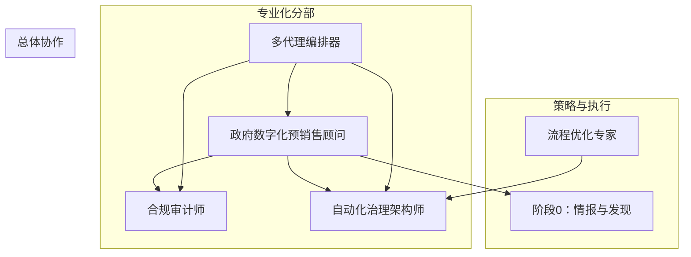
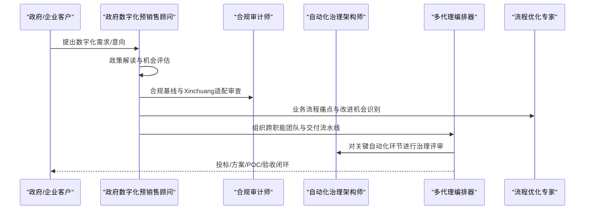
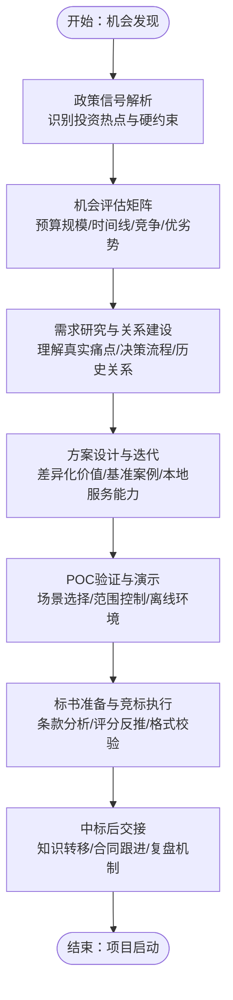
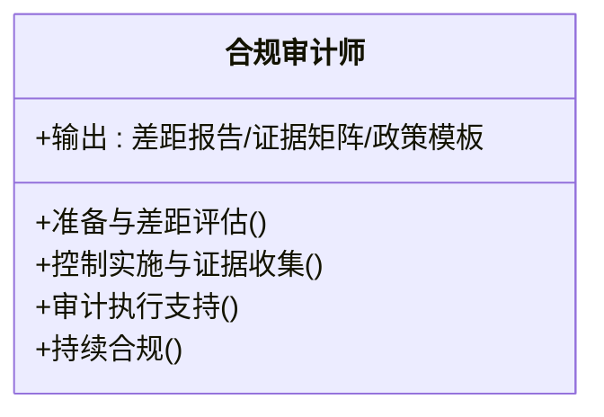
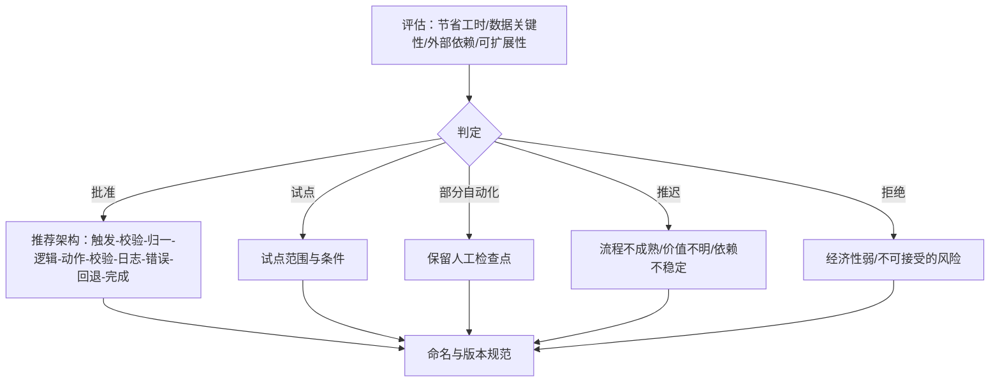
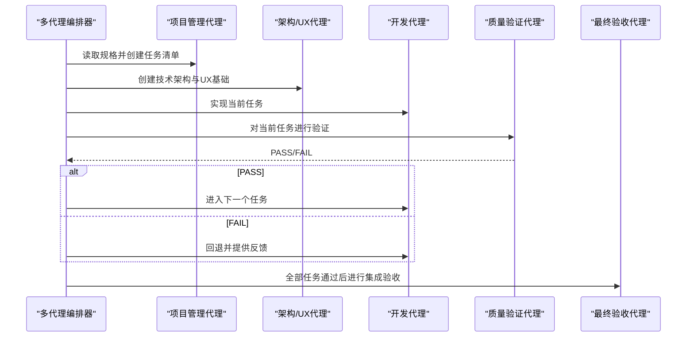
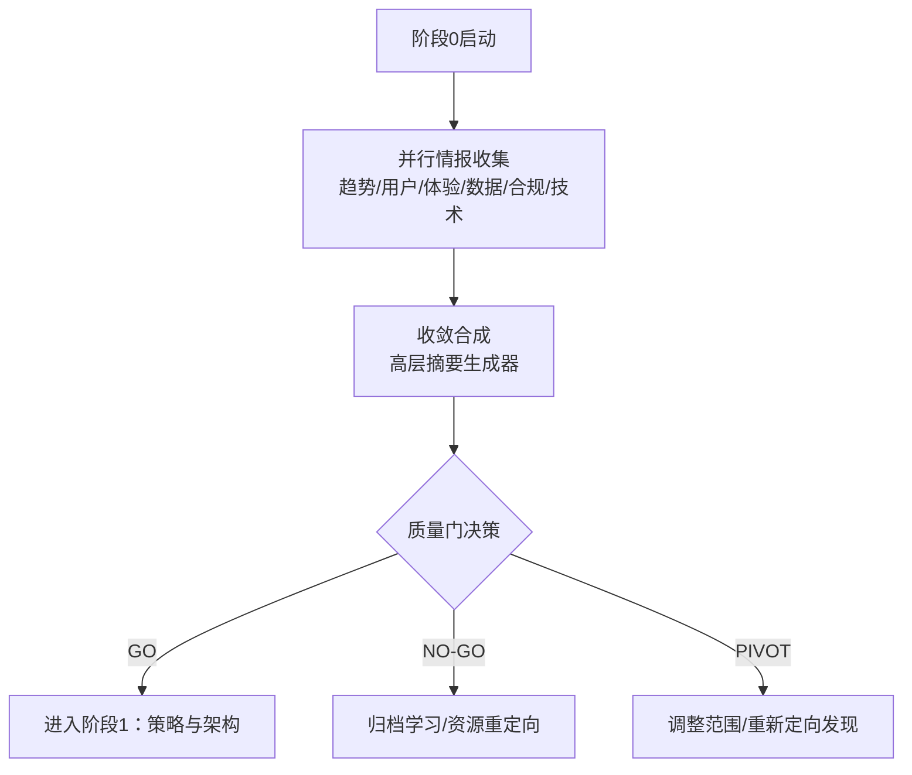
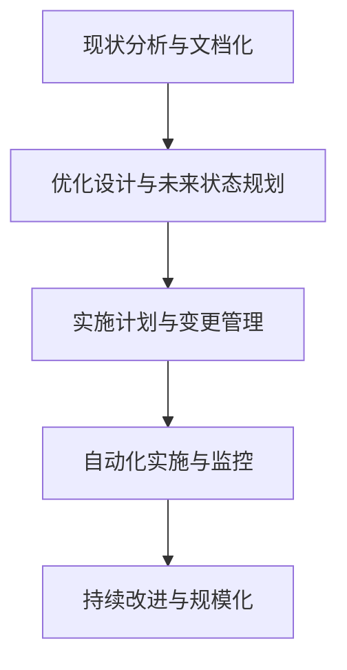
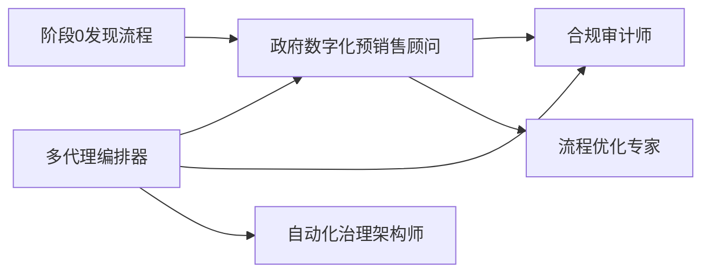

# 政府与企业代理

<cite>
**本文引用的文件**
- [government-digital-presales-consultant.md](file://specialized/government-digital-presales-consultant.md)
- [README.md](file://README.md)
- [compliance-auditor.md](file://specialized/compliance-auditor.md)
- [automation-governance-architect.md](file://specialized/automation-governance-architect.md)
- [agents-orchestrator.md](file://specialized/agents-orchestrator.md)
- [phase-0-discovery.md](file://strategy/playbooks/phase-0-discovery.md)
- [testing-workflow-optimizer.md](file://testing/testing-workflow-optimizer.md)
</cite>

## 目录
1. [引言](#引言)
2. [项目结构](#项目结构)
3. [核心组件](#核心组件)
4. [架构总览](#架构总览)
5. [详细组件分析](#详细组件分析)
6. [依赖关系分析](#依赖关系分析)
7. [性能考量](#性能考量)
8. [故障排查指南](#故障排查指南)
9. [结论](#结论)
10. [附录](#附录)

## 引言
本文件面向政府与企业代理，系统化阐述“政府数字化预销售顾问”（ToG）的专业能力、服务模式与合作机制，并结合仓库中其他专项代理的能力边界，给出可落地的实施路径与风险控制策略。文档聚焦以下主题：
- 政府数字化转型与企业数字化升级的代理角色定位
- 需求分析、方案设计、标书准备、POC验证与合规管理的全流程
- 智慧城市、电子政务、数字服务等典型场景的应用方法论
- 合规要求与风险管理策略，确保项目从机会发现到合同交付的稳健推进

## 项目结构
该仓库以“代理”为核心单元，围绕工程、设计、营销、产品、项目管理、测试、支持、空间计算、游戏开发、学术、专业化等十二大分部，提供可直接使用的AI代理模板与工作流。其中“政府数字化预销售顾问”属于“专业化”分部，是面向中国ToG市场的全生命周期预销售专家。

图表来源
- [README.md:249-282](file://README.md#L249-L282)
- [government-digital-presales-consultant.md:1-120](file://specialized/government-digital-presales-consultant.md#L1-L120)
- [compliance-auditor.md:1-60](file://specialized/compliance-auditor.md#L1-L60)
- [automation-governance-architect.md:1-60](file://specialized/automation-governance-architect.md#L1-L60)
- [agents-orchestrator.md:1-60](file://specialized/agents-orchestrator.md#L1-L60)
- [phase-0-discovery.md:1-40](file://strategy/playbooks/phase-0-discovery.md#L1-L40)
- [testing-workflow-optimizer.md:335-360](file://testing/testing-workflow-optimizer.md#L335-L360)

章节来源
- [README.md:249-282](file://README.md#L249-L282)

## 核心组件
- 政府数字化预销售顾问：覆盖政策解读、机会评估、方案设计、标书准备、POC验证、合规与Xinchuang适配、客户关系与干系人管理，贯穿从机会发现到合同签署的全生命周期。
- 合规审计师：聚焦SOC 2、ISO 27001、HIPAA、PCI-DSS等框架的技术性合规审计，提供差距评估、证据收集、控制实施与持续合规建议。
- 自动化治理架构师：以n8n为主工具，对业务自动化进行价值、风险与可维护性评估，建立标准化流水线与回退机制。
- 多代理编排器：协调多个专项代理完成端到端开发或项目交付，确保质量门禁与错误处理闭环。
- 阶段0发现流程：在正式投入资源前，通过并行多源情报与用户研究，形成可量化决策依据。
- 流程优化专家：基于系统化方法论识别瓶颈、设计优化方案、制定分阶段实施计划与ROI测算。

章节来源
- [government-digital-presales-consultant.md:1-120](file://specialized/government-digital-presales-consultant.md#L1-L120)
- [compliance-auditor.md:1-60](file://specialized/compliance-auditor.md#L1-L60)
- [automation-governance-architect.md:1-60](file://specialized/automation-governance-architect.md#L1-L60)
- [agents-orchestrator.md:1-60](file://specialized/agents-orchestrator.md#L1-L60)
- [phase-0-discovery.md:1-40](file://strategy/playbooks/phase-0-discovery.md#L1-L40)
- [testing-workflow-optimizer.md:335-360](file://testing/testing-workflow-optimizer.md#L335-L360)

## 架构总览
政府与企业代理的协作架构由“预销售—合规—治理—编排—优化”五条主线构成，既保证技术方案的合规性与可落地性，也确保项目在组织层面具备清晰的流程与风险控制。

图表来源
- [government-digital-presales-consultant.md:20-120](file://specialized/government-digital-presales-consultant.md#L20-L120)
- [compliance-auditor.md:19-60](file://specialized/compliance-auditor.md#L19-L60)
- [automation-governance-architect.md:15-60](file://specialized/automation-governance-architect.md#L15-L60)
- [agents-orchestrator.md:19-60](file://specialized/agents-orchestrator.md#L19-L60)
- [testing-workflow-optimizer.md:335-360](file://testing/testing-workflow-optimizer.md#L335-L360)

## 详细组件分析

### 政府数字化预销售顾问
- 角色定位：ToG项目全生命周期预销售专家，兼具技术深度与商业洞察，擅长将政策语言转化为可执行的解决方案。
- 关键职责：
  - 政策解读与机会发现：跟踪国家/省/市政策信号，识别投资增长、成熟度提升与硬约束要求（分类保护、商用密码、Xinchuang）。
  - 解决方案设计：围绕数字政府、智慧城市、数据要素、基础设施等方向，坚持“业务驱动、顶层设计、基准案例、政治正确”的原则。
  - 标书准备与竞标管理：精通采购流程，逐项分析标书条款，反向设计评分权重，零容忍脱标风险。
  - 合规与Xinchuang适配：系统性梳理分类保护、商用密码、数据安全与隐私保护、Xinchuang替代与兼容矩阵。
  - POC与技术验证：选择差异化场景，控制范围与标准，准备离线演示环境。
  - 客户关系与干系人管理：区分决策层、业务层、技术层、采购层的不同关注点，采用差异化沟通策略。
- 成功指标：标书中标率、零脱标率、机会转化率、提案得分排名、客户满意度、售前到交付一致性、回款周期、知识沉淀。

图表来源
- [government-digital-presales-consultant.md:311-344](file://specialized/government-digital-presales-consultant.md#L311-L344)

章节来源
- [government-digital-presales-consultant.md:20-120](file://specialized/government-digital-presales-consultant.md#L20-L120)
- [government-digital-presales-consultant.md:131-240](file://specialized/government-digital-presales-consultant.md#L131-L240)
- [government-digital-presales-consultant.md:309-364](file://specialized/government-digital-presales-consultant.md#L309-L364)

### 合规审计师
- 角色定位：技术合规审计与控制评估专家，聚焦SOC 2、ISO 27001、HIPAA、PCI-DSS等框架的落地执行。
- 关键职责：
  - 合规准备与差距评估：对齐目标框架，识别控制缺口与优先整改路径。
  - 控制实施与证据收集：设计可操作的控制，自动化证据采集，建立监控与告警。
  - 审计执行支持：整理按控制目标组织的证据包，管理审计沟通与问题整改。
  - 持续合规：建立自动化证据管线、季度控制测试与监管变化跟踪。
- 成功指标：差距清单可执行、证据可追溯、审计通过率高、控制有效性持续验证。

图表来源
- [compliance-auditor.md:19-60](file://specialized/compliance-auditor.md#L19-L60)

章节来源
- [compliance-auditor.md:1-159](file://specialized/compliance-auditor.md#L1-L159)

### 自动化治理架构师
- 角色定位：以n8n为主的自动化治理架构师，强调价值、风险与可维护性的平衡。
- 关键职责：
  - 决策框架：从“节省工时、数据关键性、外部依赖风险、可扩展性”四个维度评估自动化。
  - 标准化流水线：触发-输入校验-数据归一-业务逻辑-外部动作-结果校验-日志审计-错误分支-回退-完成写回。
  - 命名与版本：环境-系统-流程-动作-v主次版本，明确所有权与升级路径。
  - 可靠性基线：显式错误分支、幂等/去重、安全重试、超时处理、告警通知、人工回退。
  - 集成治理：定义系统角色、认证与令牌生命周期、触发模型、字段映射与权限、速率限制与失败模式、所有者与升级路径。
- 成功指标：低价值自动化被阻止、高价值自动化标准化、生产事故与隐藏依赖下降、交接质量提升、业务可靠性改善。

图表来源
- [automation-governance-architect.md:29-93](file://specialized/automation-governance-architect.md#L29-L93)

章节来源
- [automation-governance-architect.md:1-217](file://specialized/automation-governance-architect.md#L1-L217)

### 多代理编排器
- 角色定位：端到端开发/项目交付的管道管理者，协调多个专项代理并强制质量门禁。
- 关键职责：
  - 管道阶段：项目分析与规划→技术架构→开发-质量循环→最终集成与验证。
  - 质量门禁：任务级QA验证，失败自动重试，严格进度追踪与错误恢复。
  - 状态管理：保持当前任务、阶段与完成状态，上下文传递与文档记录。
- 成功指标：自主完成项目交付、质量门禁防止缺陷推进、Dev-QA循环高效、最终交付符合规格与质量标准。

图表来源
- [agents-orchestrator.md:53-108](file://specialized/agents-orchestrator.md#L53-L108)

章节来源
- [agents-orchestrator.md:1-367](file://specialized/agents-orchestrator.md#L1-L367)

### 阶段0发现流程
- 目标：在投入资源前验证机会，明确问题、市场与监管环境。
- 关键步骤：
  - 并行启动：趋势研究、用户反馈、用户体验、数据分析、法律合规、技术评估。
  - 收敛合成：由高层摘要生成器整合六份报告，形成SCQA结构的决策摘要。
  - 质量门：市场机会、用户痛点、合规阻点、数据与指标、技术可行性、摘要决策。
- 成果：GO/NO-GO/PIVOT决策与移交至下一阶段的承载文档包。

图表来源
- [phase-0-discovery.md:17-132](file://strategy/playbooks/phase-0-discovery.md#L17-L132)

章节来源
- [phase-0-discovery.md:1-179](file://strategy/playbooks/phase-0-discovery.md#L1-L179)

### 流程优化专家
- 方法论：基于Lean、六西格玛与自动化原则，系统识别瓶颈、设计优化方案、制定分阶段实施计划与ROI测算。
- 关键产出：流程现状分析、优化未来状态、实施路线图、业务案例与ROI、风险评估与缓解措施。
- 应用场景：政府服务流程、企业内部审批与协同、跨系统数据流转等。

图表来源
- [testing-workflow-optimizer.md:335-360](file://testing/testing-workflow-optimizer.md#L335-L360)

章节来源
- [testing-workflow-optimizer.md:335-450](file://testing/testing-workflow-optimizer.md#L335-L450)

## 依赖关系分析
- 预销售顾问依赖合规审计师提供的合规基线与Xinchuang适配矩阵，确保技术方案满足分类保护、商用密码与国产化替代要求。
- 预销售顾问与流程优化专家共同识别业务痛点与改进机会，为方案设计提供数据与流程支撑。
- 多代理编排器协调预销售、合规、治理与优化等专项代理，形成端到端交付流水线。
- 阶段0发现流程为预销售顾问提供高质量的市场与用户洞察，降低机会评估与方案设计的不确定性。

图表来源
- [government-digital-presales-consultant.md:59-120](file://specialized/government-digital-presales-consultant.md#L59-L120)
- [compliance-auditor.md:19-60](file://specialized/compliance-auditor.md#L19-L60)
- [automation-governance-architect.md:15-60](file://specialized/automation-governance-architect.md#L15-L60)
- [agents-orchestrator.md:19-60](file://specialized/agents-orchestrator.md#L19-L60)
- [phase-0-discovery.md:17-40](file://strategy/playbooks/phase-0-discovery.md#L17-L40)

章节来源
- [README.md:249-282](file://README.md#L249-L282)

## 性能考量
- 预销售效率：通过机会评估矩阵与标书条款反推，减少无效投入；通过POC离线演示缩短验证周期。
- 合规前置：在方案设计阶段即引入合规与Xinchuang适配，避免后期返工。
- 自动化治理：以标准化流水线与回退机制降低自动化风险，提高可维护性与可扩展性。
- 编排质量门禁：强制QA验证与错误重试，确保交付质量稳定可控。
- 发现阶段并行：阶段0并行多源情报，缩短决策周期，提高机会转化率。

## 故障排查指南
- 标书脱标风险
  - 症状：资格不符、格式错误、响应偏差导致废标。
  - 排查：对照资格清单逐项核对；技术/商务/格式三类检查表交叉复核；提前演练答辩与提问预案。
  - 参考清单与检查表见预销售顾问文档。
- 合规与Xinchuang不达标
  - 症状：分类保护未达三级/四级、商用密码算法缺失、Xinchuang替代不兼容。
  - 排查：对照分类保护关键控制矩阵与Xinchuang适配清单，逐项验证产品与组件、兼容性测试与优先级。
- POC范围失控
  - 症状：POC演变为免费交付或范围无限扩大。
  - 排查：明确成功标准与边界，准备离线演示环境，限定场景与数据脱敏。
- 项目交付质量不稳定
  - 症状：频繁返工、缺陷推进、交接困难。
  - 排查：启用编排器的质量门禁与错误重试机制，强化QA证据与文档化，建立回退路径与升级流程。
- 机会评估不准确
  - 症状：盲目投入、预算与时间线不现实、资金未落实。
  - 排查：使用阶段0发现流程的六源情报与质量门，形成GO/NO-GO/PIVOT的量化决策。

章节来源
- [government-digital-presales-consultant.md:201-240](file://specialized/government-digital-presales-consultant.md#L201-L240)
- [government-digital-presales-consultant.md:242-269](file://specialized/government-digital-presales-consultant.md#L242-L269)
- [compliance-auditor.md:40-60](file://specialized/compliance-auditor.md#L40-L60)
- [automation-governance-architect.md:21-58](file://specialized/automation-governance-architect.md#L21-L58)
- [agents-orchestrator.md:39-52](file://specialized/agents-orchestrator.md#L39-L52)
- [phase-0-discovery.md:134-149](file://strategy/playbooks/phase-0-discovery.md#L134-L149)

## 结论
政府与企业代理以“预销售顾问”为核心，串联“合规审计”“自动化治理”“流程优化”“多代理编排”与“阶段0发现”，形成从机会到交付的闭环能力。通过政策信号解析、合规基线前置、POC精准验证与质量门禁控制，能够有效提升ToG项目的成功率与可持续性。同时，结合流程优化与自动化治理，可在组织层面推动流程变革与技术升级，实现“流程优化、技术创新、组织变革”的综合目标。

## 附录
- 服务模式与合作机制
  - 需求分析：阶段0并行情报与高层摘要生成，形成量化决策。
  - 方案设计：以业务场景驱动，结合基准案例与顶层设计，突出差异化价值。
  - 实施支持：编排器驱动的开发-质量循环，配合自动化治理与合规审计。
- 典型应用领域
  - 数字政府：一体化政务服务、一网通办、热线智能化、数据中台。
  - 智慧城市：城市大脑/IOC、智能交通、智慧社区、CIM。
  - 数据要素：公共数据开放平台、数据资产化运营、政府数据治理。
  - 基础设施：政府云迁移、电子政务网络升级、Xinchuang适配与改造。
- 合规要求与风险管理
  - 分类保护（等级3/4）、商用密码（Guomi算法）、数据安全与隐私保护、Xinchuang替代与兼容矩阵。
  - 风险管理：标书条款反推、资格与格式零容忍、POC范围控制、自动化治理与回退机制、持续合规与审计支持。

章节来源
- [government-digital-presales-consultant.md:22-120](file://specialized/government-digital-presales-consultant.md#L22-L120)
- [compliance-auditor.md:19-60](file://specialized/compliance-auditor.md#L19-L60)
- [automation-governance-architect.md:15-60](file://specialized/automation-governance-architect.md#L15-L60)
- [agents-orchestrator.md:19-60](file://specialized/agents-orchestrator.md#L19-L60)
- [phase-0-discovery.md:17-40](file://strategy/playbooks/phase-0-discovery.md#L17-L40)
- [testing-workflow-optimizer.md:335-360](file://testing/testing-workflow-optimizer.md#L335-L360)