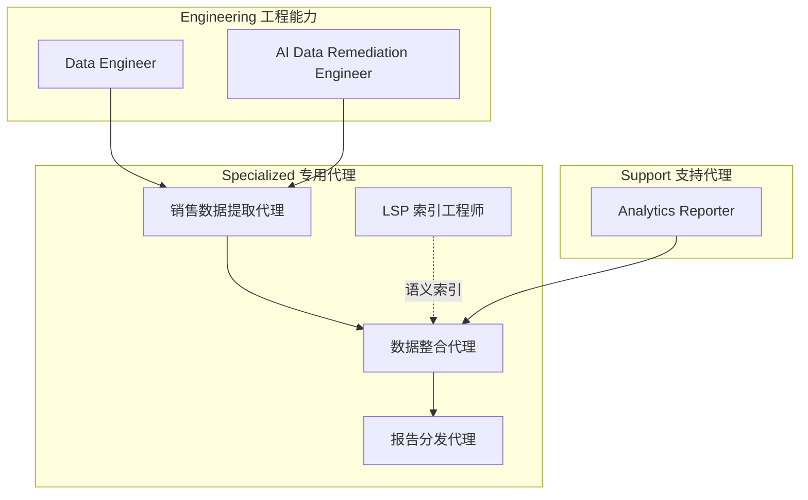
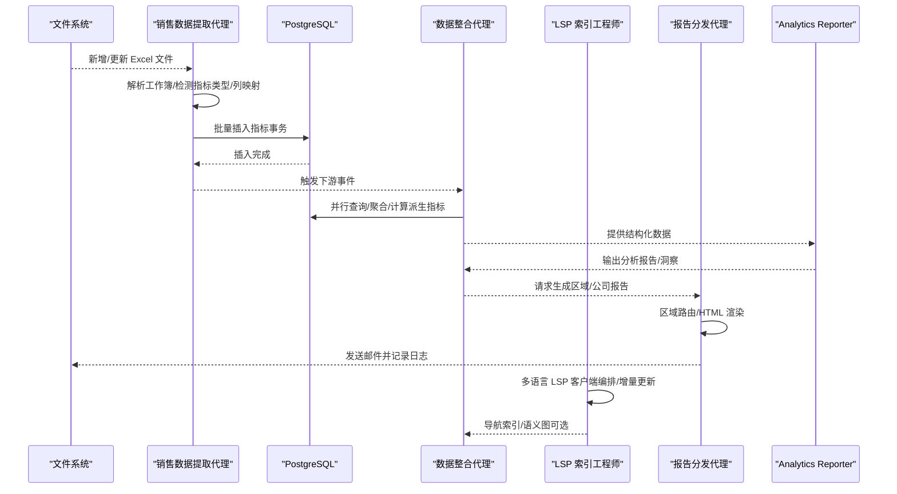
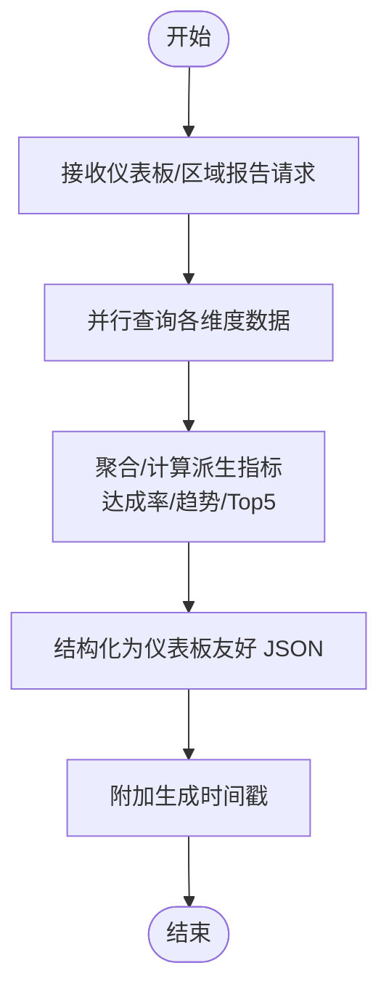
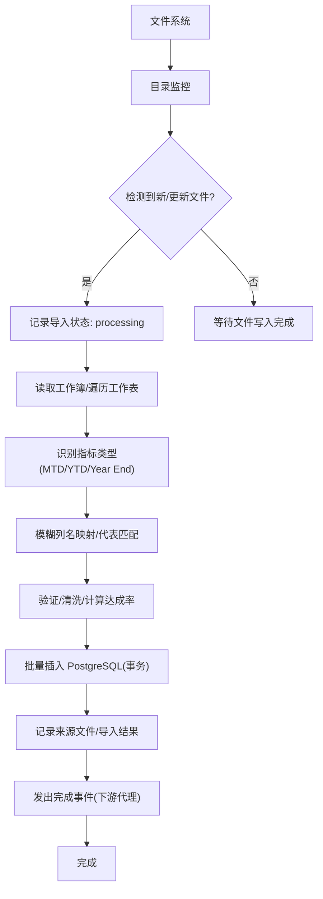
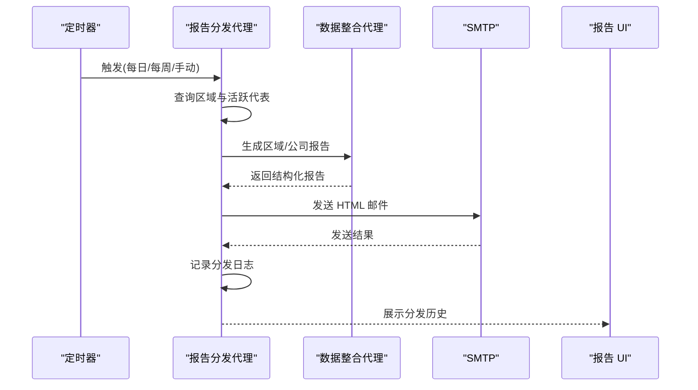
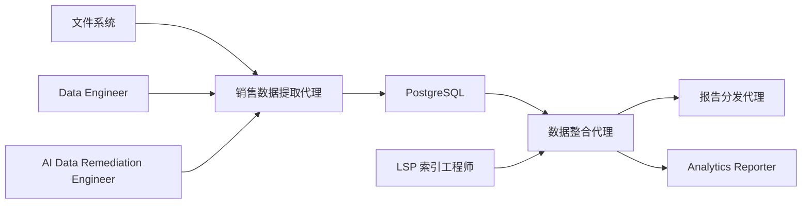

# 数据分析代理

<cite>
**本文引用的文件**
- [README.md](file://README.md)
- [data-consolidation-agent.md](file://specialized/data-consolidation-agent.md)
- [sales-data-extraction-agent.md](file://specialized/sales-data-extraction-agent.md)
- [lsp-index-engineer.md](file://specialized/lsp-index-engineer.md)
- [report-distribution-agent.md](file://specialized/report-distribution-agent.md)
- [support-analytics-reporter.md](file://support/support-analytics-reporter.md)
- [agents-orchestrator.md](file://specialized/agents-orchestrator.md)
- [engineering-data-engineer.md](file://engineering/engineering-data-engineer.md)
- [engineering-ai-data-remediation-engineer.md](file://engineering/engineering-ai-data-remediation-engineer.md)
</cite>

## 目录
1. [简介](#简介)
2. [项目结构](#项目结构)
3. [核心组件](#核心组件)
4. [架构总览](#架构总览)
5. [详细组件分析](#详细组件分析)
6. [依赖关系分析](#依赖关系分析)
7. [性能考量](#性能考量)
8. [故障排查指南](#故障排查指南)
9. [结论](#结论)
10. [附录](#附录)

## 简介
本文件围绕“数据分析代理”体系，系统阐述数据整合代理、销售数据提取代理、LSP 索引工程师与报告分发代理的职责边界、技术实现与协作方式。文档覆盖从数据采集、清洗、整合到分析与可视化全流程，并解释语言服务器协议（LSP）与语义索引技术在代码智能中的应用；同时给出数据一致性与质量控制方法、跨代理协作模式、自动化报告生成、业务场景应用与性能优化建议，以及数据安全与隐私保护最佳实践。

## 项目结构
该仓库采用按职能划分的模块化组织方式，数据分析代理位于“specialized”与“support”两大领域：
- specialized：面向业务闭环的专用代理，如销售数据提取、数据整合、LSP 索引、报告分发等
- support：面向通用分析与运营支持的代理，如 Analytics Reporter 提供统计分析与可视化能力
- engineering：面向数据工程与数据修复的工程能力，支撑上游数据质量与可靠性



图表来源
- [sales-data-extraction-agent.md:1-68](file://specialized/sales-data-extraction-agent.md#L1-L68)
- [data-consolidation-agent.md:1-61](file://specialized/data-consolidation-agent.md#L1-L61)
- [lsp-index-engineer.md:1-314](file://specialized/lsp-index-engineer.md#L1-L314)
- [report-distribution-agent.md:1-66](file://specialized/report-distribution-agent.md#L1-L66)
- [support-analytics-reporter.md:1-365](file://support/support-analytics-reporter.md#L1-L365)
- [engineering-data-engineer.md:1-252](file://engineering/engineering-data-engineer.md#L1-L252)
- [engineering-ai-data-remediation-engineer.md:1-212](file://engineering/engineering-ai-data-remediation-engineer.md#L1-L212)

章节来源
- [README.md:250-283](file://README.md#L250-L283)

## 核心组件
- 销售数据提取代理：监控 Excel 文件目录，解析多工作表，灵活映射列名，识别指标类型（MTD/YTD/Year End），校验并持久化到 PostgreSQL，记录审计日志，触发下游事件
- 数据整合代理：聚合各维度指标，计算达成率、趋势等派生指标，输出仪表板与区域报告，支持多视图（MTD/YTD/Year End）
- LSP 索引工程师：编排多语言 LSP 客户端，构建统一语义图（节点/边），维护增量更新与一致性，提供导航索引与实时流式更新
- 报告分发代理：基于区域路由向代表发送 HTML 邮件报告，支持定时与手动触发，记录分发日志与失败重试
- Analytics Reporter：提供统计分析框架、客户分群、营销归因与 ROI 分析模板，强调数据质量与可重复性
- Data Engineer/AI Data Remediation Engineer：提供湖仓架构、Medallion 模型、CDC/增量管道、数据质量监控与自愈修复能力

章节来源
- [sales-data-extraction-agent.md:1-68](file://specialized/sales-data-extraction-agent.md#L1-L68)
- [data-consolidation-agent.md:1-61](file://specialized/data-consolidation-agent.md#L1-L61)
- [lsp-index-engineer.md:1-314](file://specialized/lsp-index-engineer.md#L1-L314)
- [report-distribution-agent.md:1-66](file://specialized/report-distribution-agent.md#L1-L66)
- [support-analytics-reporter.md:1-365](file://support/support-analytics-reporter.md#L1-L365)
- [engineering-data-engineer.md:1-252](file://engineering/engineering-data-engineer.md#L1-L252)
- [engineering-ai-data-remediation-engineer.md:1-212](file://engineering/engineering-ai-data-remediation-engineer.md#L1-L212)

## 架构总览
数据分析代理的端到端流程如下：
- 数据采集：Excel 文件监控与解析，按指标类型与列映射提取关键指标
- 数据清洗与标准化：列名模糊匹配、货币格式处理、缺失值策略、代表匹配与警告
- 数据整合：并行查询聚合、派生指标计算、时间窗口汇总（MTD/YTD/Year End）
- 语义增强（可选）：通过 LSP 索引构建代码语义图，为研发类数据提供上下文增强
- 报告生成与分发：HTML 报告、区域路由、定时调度、审计日志
- 统计分析与洞察：使用 Analytics Reporter 的分析模板与方法论，输出可执行建议



图表来源
- [sales-data-extraction-agent.md:51-61](file://specialized/sales-data-extraction-agent.md#L51-L61)
- [data-consolidation-agent.md:47-54](file://specialized/data-consolidation-agent.md#L47-L54)
- [lsp-index-engineer.md:227-289](file://specialized/lsp-index-engineer.md#L227-L289)
- [report-distribution-agent.md:50-59](file://specialized/report-distribution-agent.md#L50-L59)
- [support-analytics-reporter.md:222-248](file://support/support-analytics-reporter.md#L222-L248)

## 详细组件分析

### 数据整合代理（Data Consolidation Agent）
- 职责与目标：将来自各区域、代表与时间周期的销售指标整合为结构化报表与仪表板视图，提供区域汇总、代表表现、管道快照、趋势与前五高绩效者
- 关键规则：
  - 始终使用最新数据（按指标日期）
  - 准确计算达成率（收入/配额×100），处理除零
  - 按区域聚合，合并线索管道与销售指标
  - 支持 MTD/YTD/Year End 多视图
- 技术交付：
  - 仪表板报告：区域 YTD/MTD 收入、达成率、代表数；代表最新指标；管道阶段（数量、价值、加权价值）；近六个月趋势；YTD 前五
  - 区域报告：区域深度剖析、区域内所有代表及其指标、最近 50 条历史
- 流程：接收请求 → 并行查询 → 聚合与派生指标 → 结构化 JSON → 带生成时间戳
- 成功指标：仪表板 <1 秒加载、每 60 秒自动刷新、区域与代表全覆盖、明细与汇总无数据不一致



图表来源
- [data-consolidation-agent.md:47-54](file://specialized/data-consolidation-agent.md#L47-L54)

章节来源
- [data-consolidation-agent.md:1-61](file://specialized/data-consolidation-agent.md#L1-L61)

### 销售数据提取代理（Sales Data Extraction Agent）
- 职责与目标：监控指定目录的 Excel 文件，提取 MTD/YTD/Year End 指标，规范化并持久化至数据库，提供审计追踪
- 关键规则：
  - 不覆盖已有指标（除非有明确更新信号）
  - 记录每次导入：文件名、处理行数、失败行数、时间戳
  - 代表匹配（邮箱或全名），未匹配行发出警告
  - 灵活模式：模糊列名匹配（收入/销量/配额等）
  - 从工作表名称识别指标类型（默认合理）
- 技术交付：
  - 文件监控：目录监听、忽略临时锁文件、等待写入完成
  - 指标提取：遍历工作簿、映射列、自动计算达成率、处理货币格式
  - 数据持久化：批量插入 PostgreSQL、事务原子性、记录来源文件
- 流程：检测文件 → 记录处理中 → 读取工作簿/迭代工作表 → 识别指标类型 → 映射行到代表记录 → 插入数据库 → 更新导入日志 → 向下游代理发出完成事件
- 成功指标：100% 自动处理有效 Excel 文件、良好报表 <2% 行级失败、单文件 <5 秒、完整审计追踪



图表来源
- [sales-data-extraction-agent.md:51-61](file://specialized/sales-data-extraction-agent.md#L51-L61)

章节来源
- [sales-data-extraction-agent.md:1-68](file://specialized/sales-data-extraction-agent.md#L1-L68)

### LSP 索引工程师（LSP/Index Engineer）
- 职责与目标：编排多语言 LSP 客户端，构建统一语义图，提供实时增量更新与导航索引，保障响应时间与一致性
- 关键规则：
  - 严格遵循 LSP 3.17 规范，正确生命周期管理与能力协商
  - 图一致性：每个符号唯一定义节点、边引用有效节点 ID、文件节点先于符号节点存在、导入边指向实际文件/模块节点、引用边指向定义节点
  - 性能契约：小数据集下 /graph <100ms、导航查找缓存 <20ms/未缓存 <60ms、WebSocket 事件延迟 <50ms、典型项目内存 <500MB
- 技术交付：
  - graphd 核心架构：LSP 客户端管理、图状态、HTTP/WS 接口、文件监视器
  - 图构建管线：收集文件 → 创建文件节点 → LSP 提取符号 → 添加包含边 → 解析引用/调用
  - 导航索引格式：nav.index.jsonl（定义、引用、悬停文档）
- 流程：安装语言服务器 → 初始化 graphd → 并行初始化 LSP 客户端 → 构建/增量更新图 → 实时流式 diff → 导航查询
- 成功指标：跨语言统一代码智能、跳转/悬停 <150ms、图更新传播 <500ms、百万级符号无性能退化、图状态与文件系统零不一致

```mermaid
classDiagram
class GraphDaemon {
+lspClients : Map
+graph : {nodes, edges, index}
+httpServer : "/graph,/nav/ : symId,/stats"
+wsServer : "onConnection,emitDiff"
+watcher : "onFileChange,onGitCommit"
}
class LSPOrchestrator {
-clients : Map
-capabilities : Map
+initialize(projectRoot)
+getDefinition(uri, position)
}
class GraphBuilder {
+buildFromProject(root)
}
GraphDaemon --> LSPOrchestrator : "编排"
GraphDaemon --> GraphBuilder : "增量构建"
LSPOrchestrator --> GraphBuilder : "符号提取"
```

图表来源
- [lsp-index-engineer.md:65-115](file://specialized/lsp-index-engineer.md#L65-L115)
- [lsp-index-engineer.md:117-160](file://specialized/lsp-index-engineer.md#L117-L160)
- [lsp-index-engineer.md:162-210](file://specialized/lsp-index-engineer.md#L162-L210)

章节来源
- [lsp-index-engineer.md:1-314](file://specialized/lsp-index-engineer.md#L1-L314)

### 报告分发代理（Report Distribution Agent）
- 职责与目标：按区域路由向代表发送 HTML 报告，支持每日/每周定时与手动触发，记录审计日志
- 关键规则：
  - 区域路由：代表仅接收其所属区域的数据
  - 管理员汇总：管理员与经理接收公司级汇总
  - 日志记录：每次分发尝试记录状态（已发送/失败）
  - 时间约束：工作日每日 8:00、每周一 7:00；手动触发
  - 失败容错：逐个记录错误，继续向其他收件人发送
- 技术交付：
  - 邮件报告：HTML 格式、区域表格、公司对比表、品牌风格
  - 分发计划：每日/每周/手动
  - 审计追踪：收件人、区域、状态、时间戳、错误信息
- 流程：定时任务或手动请求 → 查询区域与活跃代表 → 通过数据整合代理生成报告 → HTML 邮件 → SMTP 发送 → 记录日志 → UI 展示历史
- 成功指标：99%+ 定时投递成功率、全部分发尝试记录、失败在 5 分钟内可见、零错误区域投递



图表来源
- [report-distribution-agent.md:50-59](file://specialized/report-distribution-agent.md#L50-L59)

章节来源
- [report-distribution-agent.md:1-66](file://specialized/report-distribution-agent.md#L1-L66)

### Analytics Reporter（支持分析）
- 职责与目标：将原始数据转化为可执行业务洞察，创建仪表板、进行统计分析、跟踪 KPI、提供战略决策支持
- 关键规则：数据质量优先、连接业务结果、建立可复现分析工作流、版本控制与文档
- 技术交付：
  - 执行仪表板模板（月度指标、增长计算、趋势分类）
  - 客户分群分析（RFM、聚类、段落分布与建议）
  - 营销归因与 ROI（多触点归因、ROI 计算、成本/转化）
- 流程：数据发现与验证 → 分析框架设计 → 洞察生成与可视化 → 业务影响测量
- 成功指标：分析准确度 >95%、建议实施率 >70%、看板采用率 >95%、业务指标改善 >20%

章节来源
- [support-analytics-reporter.md:1-365](file://support/support-analytics-reporter.md#L1-L365)

### 数据工程与数据修复（Data Engineer / AI Data Remediation Engineer）
- Data Engineer：Medallion 湖仓架构（Bronze/Silver/Gold）、CDC/增量管道、数据质量监控、行级质量评分、软删除与审计字段
- AI Data Remediation Engineer：异常行语义压缩、向量化执行修复、数学零数据损失对账、审计日志与置信度阈值、PII 零外泄

章节来源
- [engineering-data-engineer.md:1-252](file://engineering/engineering-data-engineer.md#L1-L252)
- [engineering-ai-data-remediation-engineer.md:1-212](file://engineering/engineering-ai-data-remediation-engineer.md#L1-L212)

## 依赖关系分析
- 数据采集层依赖：文件系统监控、Excel 解析库、数据库（PostgreSQL）
- 数据整合层依赖：数据库查询、并行计算、JSON 序列化
- 语义索引层依赖：多语言 LSP 客户端、文件系统/版本控制事件、WebSocket 实时流
- 报告分发层依赖：邮件传输（SMTP）、区域/代表元数据、审计日志
- 分析支持层依赖：SQL/Python/R、可视化工具、数据仓库/BI 平台
- 工程能力层依赖：云平台数据湖/仓库、CDC/流处理、数据质量工具



图表来源
- [sales-data-extraction-agent.md:46-49](file://specialized/sales-data-extraction-agent.md#L46-L49)
- [data-consolidation-agent.md:47-54](file://specialized/data-consolidation-agent.md#L47-L54)
- [lsp-index-engineer.md:242-259](file://specialized/lsp-index-engineer.md#L242-L259)
- [report-distribution-agent.md:50-59](file://specialized/report-distribution-agent.md#L50-L59)
- [support-analytics-reporter.md:222-248](file://support/support-analytics-reporter.md#L222-L248)
- [engineering-data-engineer.md:21-60](file://engineering/engineering-data-engineer.md#L21-L60)
- [engineering-ai-data-remediation-engineer.md:94-185](file://engineering/engineering-ai-data-remediation-engineer.md#L94-L185)

## 性能考量
- 数据采集与清洗
  - 并行解析与列映射，避免阻塞；批量插入数据库，启用事务与索引优化
  - 对大文件设置超时与分块处理，防止长时间占用
- 数据整合
  - 使用并行查询与派生指标缓存；时间窗口聚合预计算；仪表板 JSON 结构化输出减少序列化开销
- 语义索引
  - 并行初始化 LSP 客户端；增量 diff 与最小化更新；内存映射与零拷贝网络；WebSocket 低延迟事件流
- 报告分发
  - 定时任务批处理，失败重试与队列化；HTML 渲染模板缓存；SMTP 连接池与并发发送
- 分析支持
  - SQL 查询优化与物化视图；Python/R 执行环境隔离；可视化组件懒加载与分页

[本节为通用性能指导，无需特定文件引用]

## 故障排查指南
- 数据采集与清洗
  - 症状：导入失败/行级失败率高
  - 排查：检查文件是否为临时锁文件、列名模糊匹配是否命中、代表匹配是否缺失、货币格式是否被正确解析
  - 处理：增加日志记录与失败行回放；调整列映射规则；补充代表元数据
- 数据整合
  - 症状：仪表板加载慢/汇总与明细不一致
  - 排查：确认并行查询是否完成、派生指标计算逻辑、时间窗口边界
  - 处理：优化查询索引与分区；引入缓存；校验聚合一致性
- 语义索引
  - 症状：跳转/悬停延迟高/图状态不一致
  - 排查：LSP 客户端能力协商、文件变更事件、增量更新是否成功
  - 处理：限制并发请求数、精确缓存失效、WebSocket 心跳与重连
- 报告分发
  - 症状：定时投递失败/错误未上报
  - 排查：SMTP 配置、收件人区域路由、失败日志
  - 处理：失败重试与告警；记录错误详情；核对区域与代表映射
- 分析支持
  - 症状：分析结果不可复现/洞察不准确
  - 排查：数据源完整性、统计显著性、假设检验
  - 处理：建立分析模板与版本控制；增加置信区间与效果量评估

章节来源
- [sales-data-extraction-agent.md:25-31](file://specialized/sales-data-extraction-agent.md#L25-L31)
- [data-consolidation-agent.md:25-31](file://specialized/data-consolidation-agent.md#L25-L31)
- [lsp-index-engineer.md:42-62](file://specialized/lsp-index-engineer.md#L42-L62)
- [report-distribution-agent.md:25-31](file://specialized/report-distribution-agent.md#L25-L31)
- [support-analytics-reporter.md:40-52](file://support/support-analytics-reporter.md#L40-L52)

## 结论
数据分析代理通过“采集—清洗—整合—分析—分发”的闭环，实现了销售数据的实时可视化与自动化报告。LSP 索引工程师为研发类数据提供语义增强，Analytics Reporter 提供统计洞察与可执行建议。工程能力（Data Engineer/AI Data Remediation Engineer）确保数据质量与可靠性。通过严格的规则、可观测性与性能优化，系统在准确性、一致性与可用性上达到生产级标准。

[本节为总结性内容，无需特定文件引用]

## 附录

### 数据一致性与质量控制
- 一致性
  - 数据整合代理要求明细与汇总无不一致；LSP 图一致性规则确保节点与边有效
  - 审计日志贯穿采集与分发，便于追溯
- 质量控制
  - 数据工程采用 Medallion 模型与数据契约；AI 数据修复零数据损失对账
  - 分析报告模板包含统计显著性与置信区间

章节来源
- [data-consolidation-agent.md:25-31](file://specialized/data-consolidation-agent.md#L25-L31)
- [lsp-index-engineer.md:50-56](file://specialized/lsp-index-engineer.md#L50-L56)
- [engineering-data-engineer.md:45-60](file://engineering/engineering-data-engineer.md#L45-L60)
- [engineering-ai-data-remediation-engineer.md:170-185](file://engineering/engineering-ai-data-remediation-engineer.md#L170-L185)
- [support-analytics-reporter.md:40-52](file://support/support-analytics-reporter.md#L40-L52)

### 跨代理协作与自动化报告生成
- 协作模式
  - 销售数据提取代理完成后触发下游事件，数据整合代理并行查询与聚合，报告分发代理按区域路由生成与发送
  - Analytics Reporter 作为分析支持，为整合代理提供洞察与建议
- 自动化报告
  - 定时任务与手动触发结合；HTML 报告模板与品牌风格；审计日志与历史查询

章节来源
- [sales-data-extraction-agent.md:60-61](file://specialized/sales-data-extraction-agent.md#L60-L61)
- [data-consolidation-agent.md:47-54](file://specialized/data-consolidation-agent.md#L47-L54)
- [report-distribution-agent.md:50-59](file://specialized/report-distribution-agent.md#L50-L59)
- [support-analytics-reporter.md:222-248](file://support/support-analytics-reporter.md#L222-L248)

### 业务场景应用与性能优化技巧
- 业务场景
  - 销售看板：区域/代表/管道多维分析与趋势预测
  - 研发知识图谱：统一代码智能与导航索引，提升研发效率
  - 营销归因：多触点归因与 ROI 分析，优化广告投放
- 性能优化
  - 并行化与缓存；增量更新与最小化 diff；懒加载与分页；连接池与批处理

[本节为通用指导，无需特定文件引用]

### 数据安全与隐私保护最佳实践
- 数据分类与最小必要原则：个人数据收集遵循最小必要；跨部门共享使用官方平台
- 加密与合规：涉及身份认证、数据传输与存储使用国密算法；系统上线前完成等级保护与商用密码评估
- 审计与日志：完整审计追踪与合规日志；PII 零外泄；异常与失败及时告警

章节来源
- [government-digital-presales-consultant.md:73-76](file://specialized/government-digital-presales-consultant.md#L73-L76)