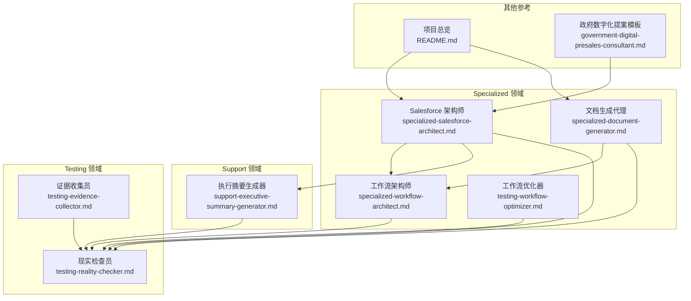
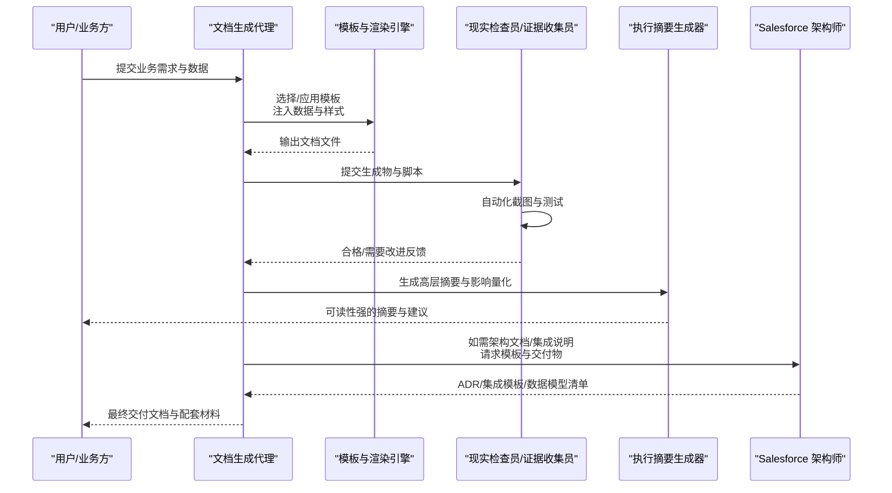
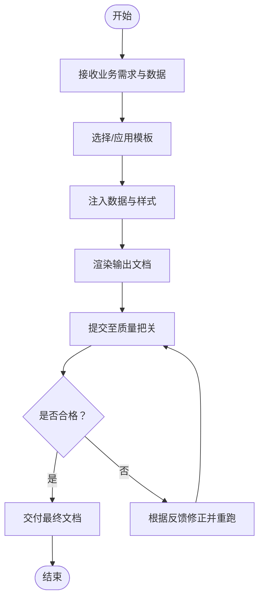
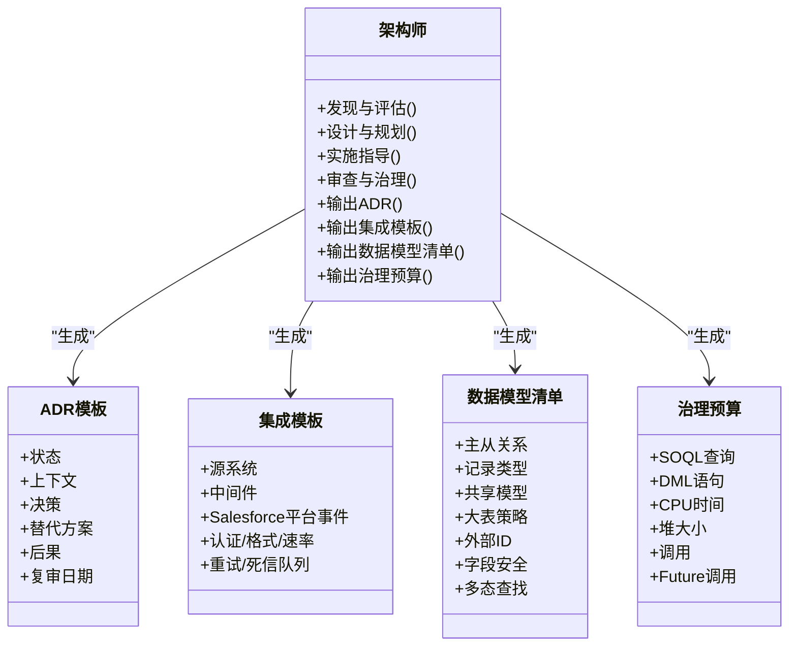
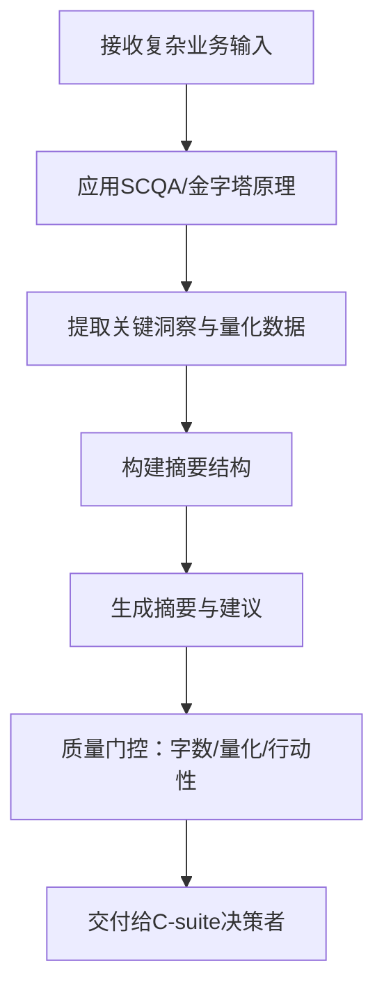
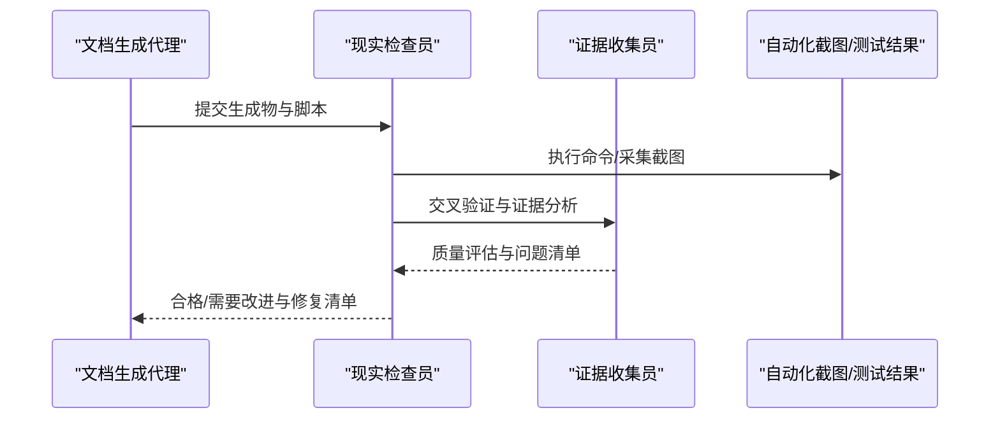
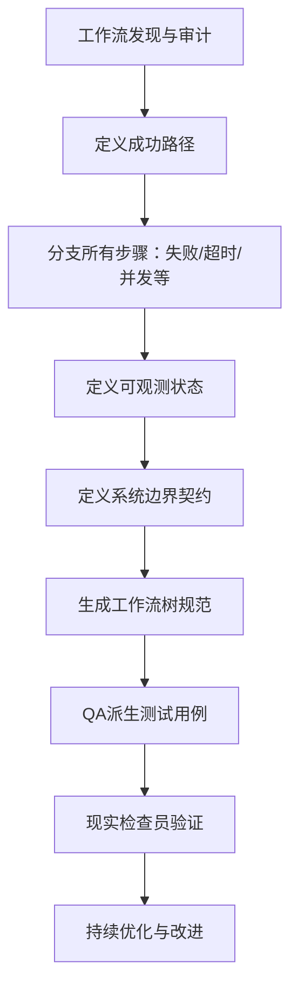
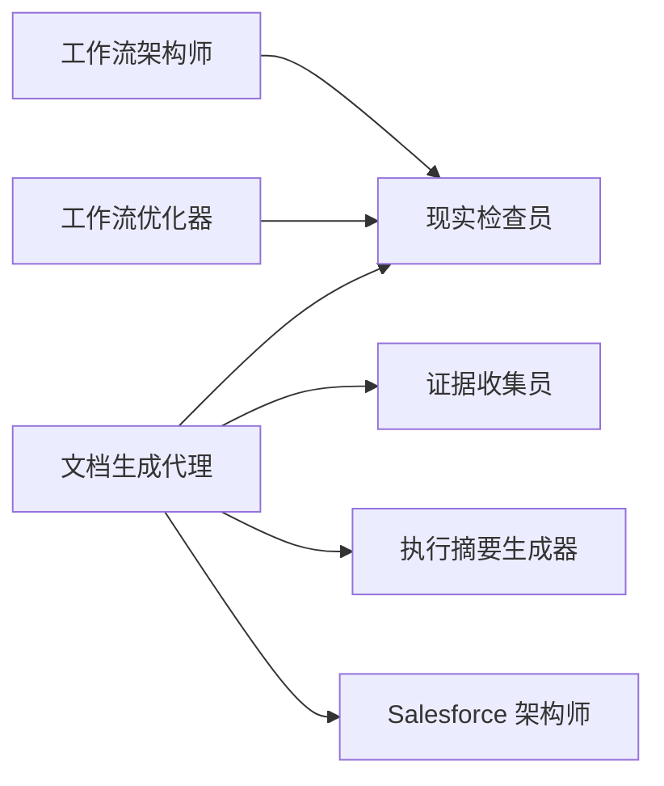

# 文档生成代理

<cite>
**本文引用的文件**
- [specialized-document-generator.md](file://specialized/specialized-document-generator.md)
- [specialized-salesforce-architect.md](file://specialized/specialized-salesforce-architect.md)
- [README.md](file://README.md)
- [support-executive-summary-generator.md](file://support/support-executive-summary-generator.md)
- [testing-reality-checker.md](file://testing/testing-reality-checker.md)
- [testing-evidence-collector.md](file://testing/testing-evidence-collector.md)
- [testing-workflow-optimizer.md](file://testing/testing-workflow-optimizer.md)
- [specialized-workflow-architect.md](file://specialized/specialized-workflow-architect.md)
- [government-digital-presales-consultant.md](file://specialized/government-digital-presales-consultant.md)
</cite>

## 目录
1. [简介](#简介)
2. [项目结构](#项目结构)
3. [核心组件](#核心组件)
4. [架构总览](#架构总览)
5. [详细组件分析](#详细组件分析)
6. [依赖关系分析](#依赖关系分析)
7. [性能考量](#性能考量)
8. [故障排查指南](#故障排查指南)
9. [结论](#结论)
10. [附录](#附录)

## 简介
本文件面向“文档生成代理”，聚焦两类关键角色：
- 专业文档生成器：以代码驱动的方式批量生成 PDF、PPTX、DOCX、XLSX 等专业文档，强调格式规范、可复用模板、数据可视化与可访问性。
- Salesforce 架构师：面向企业级多云平台的解决方案架构设计，覆盖集成模式、治理限制（Governor Limits）、部署策略与数据模型治理，输出可执行的架构决策记录（ADR）与交付物模板。

文档生成代理在企业文档自动化、模板设计与内容管理方面具备以下能力：
- 按业务需求自动生成报告、合同、说明书与架构文档；
- 基于模板系统与内容渲染管线，实现可复用、可定制、可审计的文档生成；
- 通过与其他代理协作（如工作流架构师、质量把关者、执行摘要生成器），确保文档一致性与准确性；
- 提供质量保证与审核机制，保障交付文档的合规性、可访问性与可维护性。

## 项目结构
该仓库采用按职能域划分的组织方式，文档生成代理位于“specialized”领域，并与测试、支持、工程等多个领域协同工作，形成端到端的文档与交付流程。

图表来源
- [README.md](file://README.md)
- [specialized-document-generator.md](file://specialized/specialized-document-generator.md)
- [specialized-salesforce-architect.md](file://specialized/specialized-salesforce-architect.md)
- [specialized-workflow-architect.md](file://specialized/specialized-workflow-architect.md)
- [testing-reality-checker.md](file://testing/testing-reality-checker.md)
- [testing-evidence-collector.md](file://testing/testing-evidence-collector.md)
- [testing-workflow-optimizer.md](file://testing/testing-workflow-optimizer.md)
- [support-executive-summary-generator.md](file://support/support-executive-summary-generator.md)
- [government-digital-presales-consultant.md](file://specialized/government-digital-presales-consultant.md)

章节来源
- [README.md](file://README.md)
- [specialized-document-generator.md](file://specialized/specialized-document-generator.md)
- [specialized-salesforce-architect.md](file://specialized/specialized-salesforce-architect.md)

## 核心组件
- 文档生成代理（专业文档生成器）
  - 角色定位：程序化文档创建专家，使用代码工具生成 PDF、PPTX、DOCX、XLSX。
  - 关键规则：使用样式主题、品牌一致、数据驱动、可访问性、可复用模板。
  - 输出形态：脚本 + 文件；建议格式选择；解释格式化决策。
- Salesforce 架构师
  - 角色定位：企业级多云平台架构设计专家，关注集成模式、治理限制、部署策略与数据模型治理。
  - 关键交付：架构决策记录（ADR）、集成模式模板、数据模型审查清单、治理预算表。
  - 成功指标：生产零治理限制异常、数据模型支持10倍扩容、集成失败优雅处理、文档可让新开发者一周上手。
- 执行摘要生成器（支持域）
  - 角色定位：面向C-suite的咨询式摘要生成，遵循SCQA、金字塔原理等框架。
  - 关键规则：字数约束、量化影响、行动导向、无假设超出数据范围。
- 质量把关代理（Testing 领域）
  - 现实检查员：默认“需要改进”，要求压倒性证据才批准上线，基于自动化截图与测试结果进行端到端验证。
  - 证据收集员：以截图为依据的质量保证，要求每项声明都有视觉证据支撑。

章节来源
- [specialized-document-generator.md](file://specialized/specialized-document-generator.md)
- [specialized-salesforce-architect.md](file://specialized/specialized-salesforce-architect.md)
- [support-executive-summary-generator.md](file://support/support-executive-summary-generator.md)
- [testing-reality-checker.md](file://testing/testing-reality-checker.md)
- [testing-evidence-collector.md](file://testing/testing-evidence-collector.md)

## 架构总览
文档生成代理的端到端流程由“需求输入”“模板与渲染”“质量把关”“交付与归档”构成，贯穿多个代理的协作。

图表来源
- [specialized-document-generator.md](file://specialized/specialized-document-generator.md)
- [testing-reality-checker.md](file://testing/testing-reality-checker.md)
- [testing-evidence-collector.md](file://testing/testing-evidence-collector.md)
- [support-executive-summary-generator.md](file://support/support-executive-summary-generator.md)
- [specialized-salesforce-architect.md](file://specialized/specialized-salesforce-architect.md)

## 详细组件分析

### 组件一：文档生成代理（专业文档生成器）
- 职责边界
  - 专注于“文档生成”的技术实现，不参与业务决策与架构设计。
  - 以“数据驱动”为核心，输出可复用模板与脚本，确保格式一致性与可访问性。
- 模板与渲染
  - PDF：HTML+CSS→PDF 或直接数据报表生成。
  - PPTX：模板化幻灯片，保持品牌一致性与数据驱动布局。
  - XLSX：结构化数据、格式化、公式、图表与透视准备。
  - DOCX：模板化样式、页眉目录与一致格式。
- 设计原则
  - 使用样式主题而非硬编码字体/字号；
  - 品牌色彩、字体与徽标符合品牌指南；
  - 数据输入→文档输出，可扩展为流水线；
  - 可访问性：添加替代文本、标题层级、PDF标签。
- 输出与沟通
  - 同时提供生成脚本与最终文件；
  - 解释格式化选择与定制方法；
  - 建议最适合的文档格式。

图表来源
- [specialized-document-generator.md](file://specialized/specialized-document-generator.md)
- [testing-reality-checker.md](file://testing/testing-reality-checker.md)

章节来源
- [specialized-document-generator.md](file://specialized/specialized-document-generator.md)

### 组件二：Salesforce 架构师（企业架构文档）
- 职责边界
  - 专注于企业级多云平台（Sales/Service/Marketing/Commerce/Data Cloud/Agentforce）的架构设计与治理。
  - 输出可执行的架构决策记录（ADR）、集成模式模板、数据模型审查清单与治理预算。
- 关键交付物
  - ADR 模板：上下文、决策、替代方案、后果、复审日期。
  - 集成模式模板：源系统→中间件→Salesforce 平台事件链路，含认证、转换、重试、死信队列。
  - 数据模型审查清单：主从关系、记录类型、共享模型、大表策略、外部ID、字段安全、多态查找等。
  - 治理预算表：同步事务预算下的 SOQL、DML、CPU、堆内存、调用、Future 调用限额。
- 工作流过程
  - 发现与评估：现状映射、治理热点识别、数据体量与增长预测、自动化审计。
  - 架构设计：数据模型（ERD）、集成模式选择、自动化策略、部署流水线、ADR。
  - 实施指导：Apex/LWC/Flow 模式与最佳实践。
  - 审查与治理：代码审查、安全审查、性能审查、发布管理。
- 成功度量
  - 生产零治理限制异常；
  - 数据模型支持10倍扩容；
  - 集成失败优雅处理；
  - 文档使新开发者一周内上手；
  - 支持每日发布；
  - 技术债量化并有整改时间表。

图表来源
- [specialized-salesforce-architect.md](file://specialized/specialized-salesforce-architect.md)

章节来源
- [specialized-salesforce-architect.md](file://specialized/specialized-salesforce-architect.md)

### 组件三：执行摘要生成器（支持域）
- 职责边界
  - 面向C-suite的咨询式摘要生成，遵循SCQA、金字塔原理、行动导向推荐模型。
  - 强调量化影响、明确行动主体与时间表、避免超出数据范围的假设。
- 输出规范
  - 字数控制在325–475词（≤500）；
  - 关键发现≥1个量化或对比数据点；
  - 建议包含负责人、时间表与预期结果；
  - 结构化模板：情境概览、关键发现、业务影响、建议、下一步。

图表来源
- [support-executive-summary-generator.md](file://support/support-executive-summary-generator.md)

章节来源
- [support-executive-summary-generator.md](file://support/support-executive-summary-generator.md)

### 组件四：质量把关代理（Testing 领域）
- 现实检查员
  - 默认“需要改进”，要求压倒性证据才批准上线；
  - 基于自动化截图与测试结果进行端到端验证；
  - 对比规格与实现，验证跨设备一致性、性能与合规性。
- 证据收集员
  - 截图为王：每项声明必须有视觉证据；
  - 默认发现3–5问题，拒绝“零问题”与完美评分的幻想；
  - 明确修复建议与重测要求。

图表来源
- [testing-reality-checker.md](file://testing/testing-reality-checker.md)
- [testing-evidence-collector.md](file://testing/testing-evidence-collector.md)

章节来源
- [testing-reality-checker.md](file://testing/testing-reality-checker.md)
- [testing-evidence-collector.md](file://testing/testing-evidence-collector.md)

### 组件五：工作流架构师与工作流优化器（Specialized/Testing）
- 工作流架构师
  - 在代码落地前，穷尽所有路径：成功路径、输入校验失败、超时、瞬时失败、永久失败、部分失败、并发冲突。
  - 明确每个可观测状态：客户看到什么、运营者看到什么、数据库/日志中状态如何。
  - 在每个系统边界定义显式契约：负载、成功响应、失败响应、超时、失败恢复动作。
  - 产出可构建的工作流树规范，QA可据此生成测试用例。
- 工作流优化器
  - 基于流程步骤的持续优化：识别瓶颈、错误率、自动化潜力、用户体验满意度；
  - 量化改进影响（周期时间减少、成本降低、质量提升、吞吐增加、满意度改善）；
  - 制定分阶段实施计划（快速胜利、中期目标、战略规划）。

图表来源
- [specialized-workflow-architect.md](file://specialized/specialized-workflow-architect.md)
- [testing-workflow-optimizer.md](file://testing/testing-workflow-optimizer.md)
- [testing-reality-checker.md](file://testing/testing-reality-checker.md)

章节来源
- [specialized-workflow-architect.md](file://specialized/specialized-workflow-architect.md)
- [testing-workflow-optimizer.md](file://testing/testing-workflow-optimizer.md)

### 组件六：参考模板与交付物（政府数字化提案）
- 政府数字化_presales 顾问提供技术提案大纲模板，涵盖：
  - 项目概述、范围、建设原则；
  - 总体设计（技术/业务/数据架构图）；
  - 详细设计（子系统功能、流程、接口、数据模型）；
  - 安全保障（安全架构、等级保护、密码应用、数据隐私）；
  - 实施计划（方法论、组织人员、里程碑、风险、培训、验收标准）；
  - 运维与维护（运维框架、SLA、应急响应）；
  - 参考案例（基准案例背景、范围、成果）。
- 价值
  - 为企业级数字化项目提供标准化交付物模板，确保文档完整性与合规性。

章节来源
- [government-digital-presales-consultant.md](file://specialized/government-digital-presales-consultant.md)

## 依赖关系分析
- 文档生成代理依赖
  - 模板系统与渲染引擎（PDF/PPTX/XLSX/DOCX）；
  - 质量把关代理（现实检查员/证据收集员）；
  - 执行摘要生成器（高层摘要与影响量化）；
  - Salesforce 架构师（架构文档与集成说明）。
- 协作关系
  - 文档生成代理与质量把关代理形成“生成—验证—修正”的闭环；
  - 执行摘要生成器为高层决策提供可读性强的摘要；
  - Salesforce 架构师为复杂文档（如技术提案、集成蓝图）提供权威模板与交付物。

图表来源
- [specialized-document-generator.md](file://specialized/specialized-document-generator.md)
- [testing-reality-checker.md](file://testing/testing-reality-checker.md)
- [testing-evidence-collector.md](file://testing/testing-evidence-collector.md)
- [support-executive-summary-generator.md](file://support/support-executive-summary-generator.md)
- [specialized-salesforce-architect.md](file://specialized/specialized-salesforce-architect.md)
- [specialized-workflow-architect.md](file://specialized/specialized-workflow-architect.md)
- [testing-workflow-optimizer.md](file://testing/testing-workflow-optimizer.md)

章节来源
- [specialized-document-generator.md](file://specialized/specialized-document-generator.md)
- [specialized-salesforce-architect.md](file://specialized/specialized-salesforce-architect.md)
- [specialized-workflow-architect.md](file://specialized/specialized-workflow-architect.md)
- [testing-reality-checker.md](file://testing/testing-reality-checker.md)
- [testing-evidence-collector.md](file://testing/testing-evidence-collector.md)
- [testing-workflow-optimizer.md](file://testing/testing-workflow-optimizer.md)
- [support-executive-summary-generator.md](file://support/support-executive-summary-generator.md)

## 性能考量
- 文档生成性能
  - 模板复用与缓存：可复用模板函数，避免一次性脚本重复计算；
  - 渲染优化：HTML+CSS→PDF 的复杂布局应尽量减少重排与重绘；
  - 数据驱动：批量数据渲染时注意分页与分段，避免单次渲染过大导致内存压力。
- 质量把关性能
  - 自动化截图与测试应并行执行，缩短端到端验证时间；
  - 证据收集与现实检查应优先识别高风险路径（移动端、交互序列、性能阈值）。
- 工作流优化
  - 通过瓶颈识别与自动化潜力评估，量化改进收益；
  - 分阶段实施降低变更风险与资源占用。

## 故障排查指南
- 常见问题
  - 文档格式不一致：检查样式主题与品牌指南是否统一应用；
  - 可访问性缺失：确认替代文本、标题层级与PDF标签；
  - 生成物未通过质量把关：核对截图证据与规格一致性，修复后重测。
- 处理流程
  - 证据收集员：要求每项声明提供截图证据；
  - 现实检查员：默认“需要改进”，要求压倒性证据；
  - 工作流架构师：补充缺失路径与可观测状态；
  - 工作流优化器：识别瓶颈与自动化机会，制定改进计划。

章节来源
- [testing-evidence-collector.md](file://testing/testing-evidence-collector.md)
- [testing-reality-checker.md](file://testing/testing-reality-checker.md)
- [specialized-workflow-architect.md](file://specialized/specialized-workflow-architect.md)
- [testing-workflow-optimizer.md](file://testing/testing-workflow-optimizer.md)

## 结论
文档生成代理通过“模板系统+内容渲染+质量把关+高层摘要+架构文档”的组合，实现了从数据到可执行文档的自动化闭环。配合工作流架构师与工作流优化器，确保文档生成过程的可追溯、可审计与可持续优化。Salesforce 架构师提供的交付物模板与治理框架，进一步提升了企业级文档的专业性与合规性。通过与其他代理的紧密协作，文档生成代理能够稳定地支撑企业文档管理、客户沟通与知识传承。

## 附录
- 应用场景示例
  - 报告：数据驱动的季度/月度报告，自动插入图表与趋势分析；
  - 合同：模板化合同条款与附件清单，支持版本与修订追踪；
  - 说明书：产品使用手册与API参考，统一格式与可访问性；
  - 架构文档：技术提案、集成蓝图、数据模型与治理预算，支撑评审与发布。
- 最佳实践
  - 模板系统：模块化、版本化、可复用；
  - 内容渲染：数据与样式分离、可配置主题；
  - 版本管理：文档版本与脚本版本绑定，变更可追溯；
  - 质量保证：自动化截图+人工复核，建立质量门禁；
  - 协作机制：明确代理职责边界与协作契约，形成闭环。