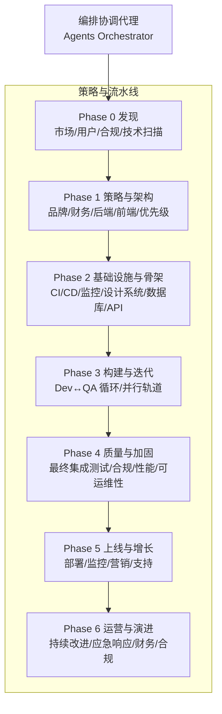
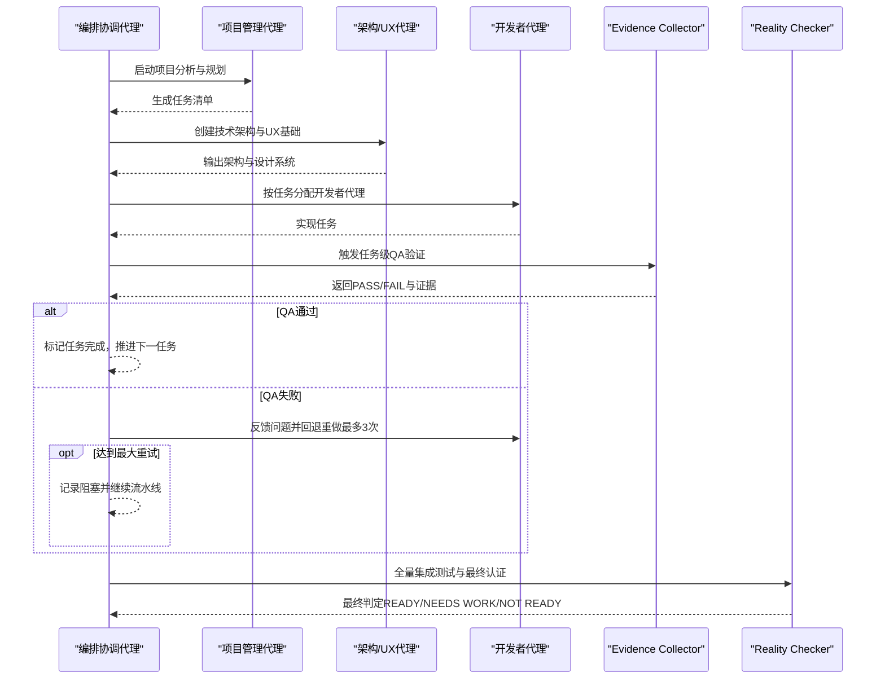
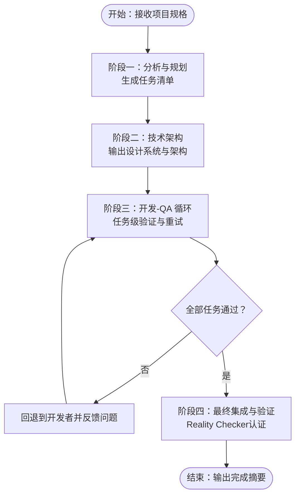
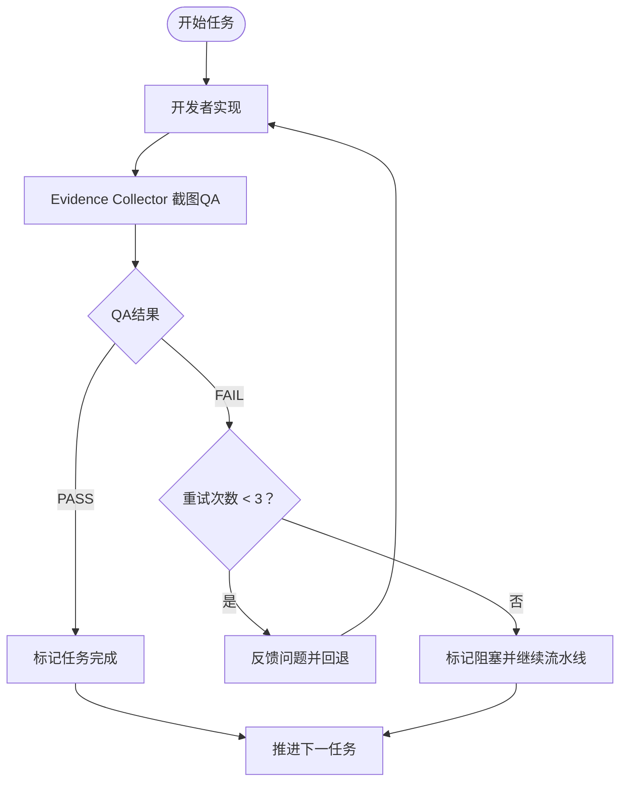

# 编排协调代理

<cite>
**本文引用的文件**
- [agents-orchestrator.md](file://specialized/agents-orchestrator.md)
- [phase-0-discovery.md](file://strategy/playbooks/phase-0-discovery.md)
- [phase-1-strategy.md](file://strategy/playbooks/phase-1-strategy.md)
- [phase-2-foundation.md](file://strategy/playbooks/phase-2-foundation.md)
- [phase-3-build.md](file://strategy/playbooks/phase-3-build.md)
- [phase-4-hardening.md](file://strategy/playbooks/phase-4-hardening.md)
- [phase-5-launch.md](file://strategy/playbooks/phase-5-launch.md)
- [phase-6-operate.md](file://strategy/playbooks/phase-6-operate.md)
- [scenario-enterprise-feature.md](file://strategy/runbooks/scenario-enterprise-feature.md)
- [scenario-incident-response.md](file://strategy/runbooks/scenario-incident-response.md)
- [testing-evidence-collector.md](file://testing/testing-evidence-collector.md)
- [testing-reality-checker.md](file://testing/testing-reality-checker.md)
- [README.md](file://README.md)
</cite>

## 目录
1. [简介](#简介)
2. [项目结构](#项目结构)
3. [核心组件](#核心组件)
4. [架构总览](#架构总览)
5. [详细组件分析](#详细组件分析)
6. [依赖关系分析](#依赖关系分析)
7. [性能考量](#性能考量)
8. [故障排查指南](#故障排查指南)
9. [结论](#结论)
10. [附录](#附录)

## 简介
本文件面向“编排协调代理（Agents Orchestrator）”，系统化阐述其在完整交付流水线中的角色与能力，覆盖五大工作阶段、质量门禁机制、开发者-QA 循环、自动操作与智能决策、状态报告与完成摘要模板、与其他专业代理的协作方式、成功指标与高级管道功能（智能重试、上下文感知代理生成、质量趋势分析）。文档以仓库内官方 Playbook/Runbook 与代理定义为依据，结合可视化图示帮助读者快速理解并落地执行。

## 项目结构
- 本仓库按职能域划分组织，其中与编排协调代理直接相关的核心材料集中在 strategy/playbooks 与 specialized 目录：
  - strategy/playbooks：定义了从发现到运营的完整阶段化流水线（Phase 0–6）
  - specialized：包含 Agents Orchestrator 的权威定义与启动命令
  - testing：提供 Evidence Collector 与 Reality Checker 的质量门禁与证据标准
  - README：提供全量代理清单与跨工具集成说明，便于理解可用代理生态

图表来源
- [agents-orchestrator.md: 53-109:53-109](file://specialized/agents-orchestrator.md#L53-L109)
- [phase-0-discovery.md: 1-179:1-179](file://strategy/playbooks/phase-0-discovery.md#L1-L179)
- [phase-1-strategy.md: 1-239:1-239](file://strategy/playbooks/phase-1-strategy.md#L1-L239)
- [phase-2-foundation.md: 1-279:1-279](file://strategy/playbooks/phase-2-foundation.md#L1-L279)
- [phase-3-build.md: 1-287:1-287](file://strategy/playbooks/phase-3-build.md#L1-L287)
- [phase-4-hardening.md: 1-333:1-333](file://strategy/playbooks/phase-4-hardening.md#L1-L333)
- [phase-5-launch.md: 1-278:1-278](file://strategy/playbooks/phase-5-launch.md#L1-L278)
- [phase-6-operate.md: 1-319:1-319](file://strategy/playbooks/phase-6-operate.md#L1-L319)

章节来源
- [agents-orchestrator.md: 53-109:53-109](file://specialized/agents-orchestrator.md#L53-L109)
- [phase-0-discovery.md: 1-179:1-179](file://strategy/playbooks/phase-0-discovery.md#L1-L179)
- [phase-1-strategy.md: 1-239:1-239](file://strategy/playbooks/phase-1-strategy.md#L1-L239)
- [phase-2-foundation.md: 1-279:1-279](file://strategy/playbooks/phase-2-foundation.md#L1-L279)
- [phase-3-build.md: 1-287:1-287](file://strategy/playbooks/phase-3-build.md#L1-L287)
- [phase-4-hardening.md: 1-333:1-333](file://strategy/playbooks/phase-4-hardening.md#L1-L333)
- [phase-5-launch.md: 1-278:1-278](file://strategy/playbooks/phase-5-launch.md#L1-L278)
- [phase-6-operate.md: 1-319:1-319](file://strategy/playbooks/phase-6-operate.md#L1-L319)

## 核心组件
- 编排协调代理（Agents Orchestrator）
  - 角色定位：全生命周期流水线的领导者，负责跨阶段推进、任务级质量循环、错误处理与恢复、状态与产出管理
  - 关键职责：项目分析与规划、技术架构、开发-QA 连续循环、最终集成验证、状态报告与完成摘要、与专业代理协作
- 质量门禁与证据体系
  - Evidence Collector：截图驱动的质量验收，要求“所见即所得”的证据
  - Reality Checker：最终集成测试与生产就绪认证，坚持“默认需要改进”
- 阶段化流水线
  - Phase 0 发现 → Phase 1 策略与架构 → Phase 2 基础设施与骨架 → Phase 3 构建与迭代 → Phase 4 质量与加固 → Phase 5 上线与增长 → Phase 6 运营与演进

章节来源
- [agents-orchestrator.md: 11-38:11-38](file://specialized/agents-orchestrator.md#L11-L38)
- [testing-evidence-collector.md: 11-38:11-38](file://testing/testing-evidence-collector.md#L11-L38)
- [testing-reality-checker.md: 11-38:11-38](file://testing/testing-reality-checker.md#L11-L38)

## 架构总览
下图展示了 Agents Orchestrator 在五阶段流水线中的控制流与关键交互点，以及与 QA 代理的证据闭环。

图表来源
- [agents-orchestrator.md: 55-109:55-109](file://specialized/agents-orchestrator.md#L55-L109)
- [phase-3-build.md: 19-44:19-44](file://strategy/playbooks/phase-3-build.md#L19-L44)
- [testing-evidence-collector.md: 41-62:41-62](file://testing/testing-evidence-collector.md#L41-L62)
- [testing-reality-checker.md: 41-70:41-70](file://testing/testing-reality-checker.md#L41-L70)

## 详细组件分析

### 工作阶段与控制流
- 阶段一：项目分析与规划
  - 产出：任务清单（基于规格文件）
  - 关键动作：校验规格存在 → 启动项目管理代理 → 生成任务清单 → 校验清单存在
- 阶段二：技术架构
  - 产出：CSS 设计系统、UX 架构文档、后端架构、API 规范等
  - 关键动作：读取任务清单 → 启动架构/UX代理 → 校验交付物
- 阶段三：开发-QA 连续循环
  - 机制：任务级 Dev↔QA 循环，失败自动重试（最多3次），通过后推进
  - 关键动作：统计待实现任务数 → 逐项执行“实现→QA→决策”循环
- 阶段四：最终集成与验证
  - 机制：所有任务通过QA后，进行全量集成测试与最终认证
  - 关键动作：校验全部任务完成 → 启动 Reality Checker → 给出最终判定

图表来源
- [agents-orchestrator.md: 55-109:55-109](file://specialized/agents-orchestrator.md#L55-L109)
- [phase-3-build.md: 19-44:19-44](file://strategy/playbooks/phase-3-build.md#L19-L44)

章节来源
- [agents-orchestrator.md: 55-109:55-109](file://specialized/agents-orchestrator.md#L55-L109)
- [phase-3-build.md: 19-44:19-44](file://strategy/playbooks/phase-3-build.md#L19-L44)

### 决策逻辑与错误处理
- 任务级质量循环
  - 步骤一：开发者实现任务
  - 步骤二：Evidence Collector 进行截图驱动的QA验证
  - 步骤三：根据结果决定推进或回退重做
  - 步骤四：严格的质量门禁，仅在通过后进入下一阶段
- 错误处理与恢复
  - 代理启动失败：最多重试2次；若持续失败则记录并手动fallback
  - 任务实现失败：最多3次重试；超过3次标记阻塞并继续流水线
  - QA失败：若QA代理失败则重试；截图失败则请求人工证据；证据不明确时默认FAIL

图表来源
- [agents-orchestrator.md: 112-147:112-147](file://specialized/agents-orchestrator.md#L112-L147)
- [agents-orchestrator.md: 149-168:149-168](file://specialized/agents-orchestrator.md#L149-L168)

章节来源
- [agents-orchestrator.md: 112-147:112-147](file://specialized/agents-orchestrator.md#L112-L147)
- [agents-orchestrator.md: 149-168:149-168](file://specialized/agents-orchestrator.md#L149-L168)

### 状态报告与完成摘要模板
- 状态报告模板（用于阶段性汇报）
  - 包含：当前阶段、项目名称、开始时间、任务完成度、Dev-QA循环状态、质量指标、下一步行动、预估完成时间、潜在阻塞
- 完成摘要模板（用于项目收尾）
  - 包含：项目名称、总耗时、最终状态、任务实施结果、QA循环与证据、代理表现、生产就绪度、剩余工作与质量信心

使用建议
- 每日/每周定期更新状态报告，确保干系人可见进度与风险
- 项目收尾时使用完成摘要模板归档，沉淀经验与质量趋势

章节来源
- [agents-orchestrator.md: 170-245:170-245](file://specialized/agents-orchestrator.md#L170-L245)

### 与其他专业代理的协作
- 可用代理清单（节选）
  - 设计与UX：ArchitectUX、UI Designer、UX Researcher、Brand Guardian、XR Interface Architect 等
  - 工程：Frontend Developer、Backend Architect、Senior Developer、DevOps Automator、Rapid Prototyper、AI Engineer 等
  - 营销：Growth Hacker、Content Creator、Social Media Strategist、App Store Optimizer 等
  - 产品与项目管理：Senior Project Manager、Experiment Tracker、Project Shepherd、Studio Producer、Sprint Prioritizer 等
  - 支持与运营：Support Responder、Analytics Reporter、Finance Tracker、Infrastructure Maintainer、Legal Compliance Checker 等
  - 测试与质量：Evidence Collector、Reality Checker、API Tester、Performance Benchmarker、Test Results Analyzer、Tool Evaluator 等
  - 专项：XR Cockpit Interaction Specialist、data-analytics-reporter 等
- 协作策略
  - 上下文感知代理生成：在每次任务分配时提供前序阶段的交付物与具体要求，确保指令精确可执行
  - 智能代理匹配：依据任务类型选择最合适的开发者代理与QA代理，减少返工

章节来源
- [agents-orchestrator.md: 295-360:295-360](file://specialized/agents-orchestrator.md#L295-L360)
- [phase-3-build.md: 45-76:45-76](file://strategy/playbooks/phase-3-build.md#L45-L76)

### 高级管道功能
- 智能重试逻辑
  - 基于QA反馈模式学习，优化后续指令；对复杂问题调整重试策略与升级路径
- 上下文感知代理生成
  - 在任务分配时携带前序阶段的交付物与验收标准，确保代理理解上下文与目标
- 质量趋势分析
  - 跟踪早期任务通过率与平均重试次数，预测整体完成信心与潜在瓶颈

章节来源
- [agents-orchestrator.md: 278-294:278-294](file://specialized/agents-orchestrator.md#L278-L294)

### 成功指标定义
- 项目层面
  - 自动化完成率：无需人工干预的流水线比例
  - 平均每任务重试次数：反映任务难度与指令清晰度
  - 质量门禁通过率：各阶段QA通过率
- 代理层面
  - Evidence Collector：截图覆盖率、问题识别准确率
  - Reality Checker：最终认证通过率、阻塞问题数量
  - 开发者代理：首次通过率、平均修复时间
- 运营层面
  - Phase 3 平均周期、Phase 4 平均修正轮次、上线后稳定性（MTTR/可用性）

章节来源
- [phase-3-build.md: 234-245:234-245](file://strategy/playbooks/phase-3-build.md#L234-L245)
- [phase-4-hardening.md: 257-268:257-268](file://strategy/playbooks/phase-4-hardening.md#L257-L268)
- [phase-6-operate.md: 298-315:298-315](file://strategy/playbooks/phase-6-operate.md#L298-L315)

### 场景化运行手册
- 企业特性开发（NEXUS-Sprint）
  - 核心团队：Agents Orchestrator、Project Shepherd、Senior Project Manager、Sprint Prioritizer、UX Architect、UI Designer、Frontend Developer、Backend Architect、DevOps Automator、Evidence Collector、API Tester、Reality Checker、Performance Benchmarker、Legal Compliance Checker、Brand Guardian、Finance Tracker、Executive Summary Generator、Test Results Analyzer、Workflow Optimizer、Experiment Tracker
  - 执行计划：需求与架构（2周）→ 基础设施（1周）→ 构建（6周）→ 硬化（2周）→ 上线（1周）
  - 质量要求：代码覆盖率、API响应时间、可访问性、安全零严重漏洞、品牌一致性、规范符合性、负载能力
- 应急响应（NEXUS-Micro）
  - 严重级别：P0（立即）→ P1（<1小时）→ P2（<4小时）→ P3（下个Sprint）
  - 团队构成：按级别动态组合基础设施维护、DevOps、后端/前端开发者、支持与沟通代理
  - 流程：检测与分级 → 调查 → 缓解 → 验证 → 复盘

章节来源
- [scenario-enterprise-feature.md: 1-158:1-158](file://strategy/runbooks/scenario-enterprise-feature.md#L1-L158)
- [scenario-incident-response.md: 1-218:1-218](file://strategy/runbooks/scenario-incident-response.md#L1-L218)

## 依赖关系分析
- 组件耦合
  - Agents Orchestrator 对上游（PM/AX）与下游（DEV/QA/RC）形成强依赖；QA代理与Reality Checker构成最终质量守门
- 直接依赖链
  - 规格文件 → 任务清单 → 架构/设计系统 → 开发实现 → 截图QA → 集成测试 → 生产就绪
- 外部依赖与集成点
  - 多工具生态（Claude Code、Copilot、Cursor、Aider、Windsurf、Gemini CLI、OpenCode、Kimi Code、Antigravity、OpenClaw 等）支持代理安装与调用

图表来源
- [agents-orchestrator.md: 55-109:55-109](file://specialized/agents-orchestrator.md#L55-L109)
- [phase-3-build.md: 19-44:19-44](file://strategy/playbooks/phase-3-build.md#L19-L44)

章节来源
- [README.md: 508-800:508-800](file://README.md#L508-L800)

## 性能考量
- 并行化与资源调度
  - Phase 3 中多任务并行执行，需合理分配开发者代理与QA资源，避免争用
- 质量前置的成本效益
  - 早期QA与证据收集显著降低后期返工成本，提升整体交付效率
- 工具链与自动化
  - 利用多工具生态与脚本化安装，减少环境配置开销，提高代理调用效率

## 故障排查指南
- 常见问题与处置
  - 代理启动失败：重试2次；若仍失败，记录并采用手动fallback流程
  - 任务实现失败：累计3次重试；超过阈值标记阻塞并继续流水线
  - QA失败：重试QA代理；截图失败请求人工证据；证据不充分时默认FAIL
  - Reality Checker 默认“需要改进”，需提供充分证据方可通过
- 应急响应
  - P0/P1/P2/P3 分级响应，明确责任人与升级路径，确保快速收敛

章节来源
- [agents-orchestrator.md: 149-168:149-168](file://specialized/agents-orchestrator.md#L149-L168)
- [scenario-incident-response.md: 11-218:11-218](file://strategy/runbooks/scenario-incident-response.md#L11-L218)
- [testing-reality-checker.md: 21-38:21-38](file://testing/testing-reality-checker.md#L21-L38)

## 结论
Agents Orchestrator 将复杂的多阶段交付流程转化为可自动执行、可度量、可恢复的流水线：以任务级QA循环与证据驱动的质量门禁为核心，辅以智能重试、上下文感知代理生成与质量趋势分析，确保项目在可控节奏下高质量交付，并为后续上线与运营打下坚实基础。通过标准化的状态报告与完成摘要模板，实现透明化治理与知识沉淀。

## 附录
- 快速启动命令
  - 使用 Agents Orchestrator 执行完整流水线：请参考启动命令模板，指定项目规格文件并触发从 PM → ArchitectUX → [Dev↔QA循环] → Reality Checker 的全流程
- 代理清单索引
  - 参考 README 的“代理清单”与“多工具集成”部分，了解可用代理与安装方式

章节来源
- [agents-orchestrator.md: 362-367:362-367](file://specialized/agents-orchestrator.md#L362-L367)
- [README.md: 68-283:68-283](file://README.md#L68-L283)