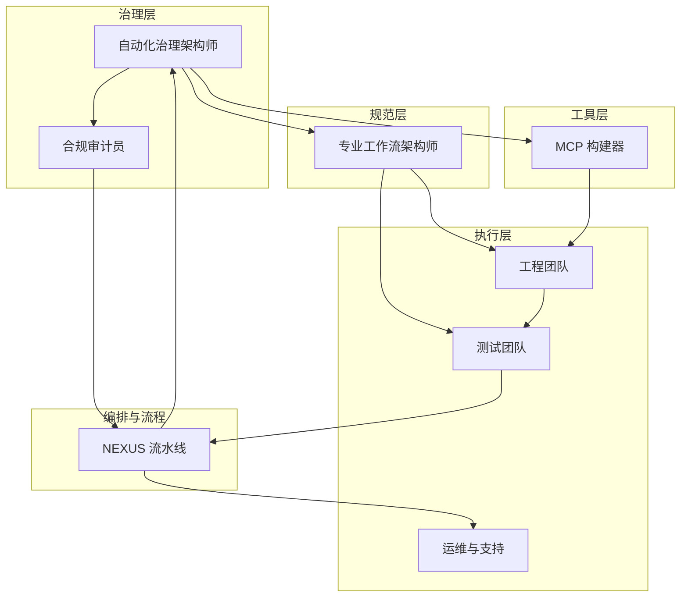
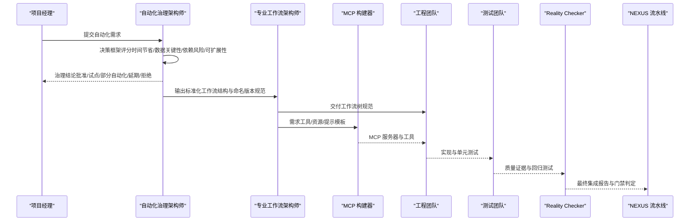
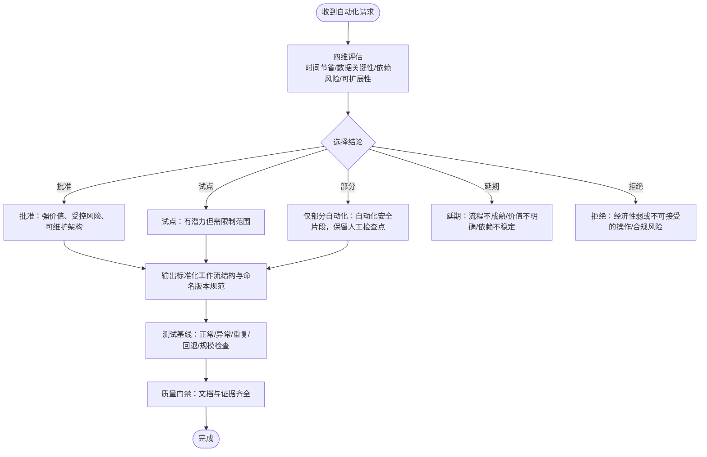
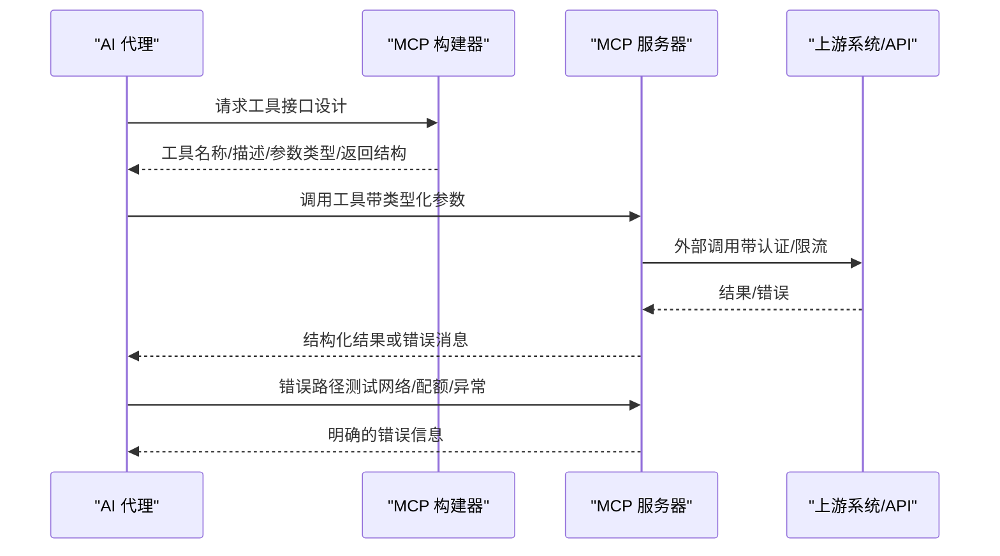
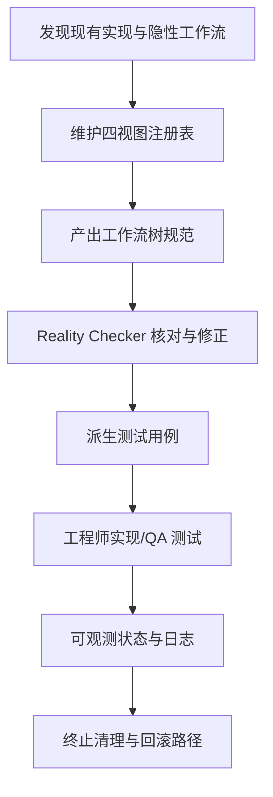
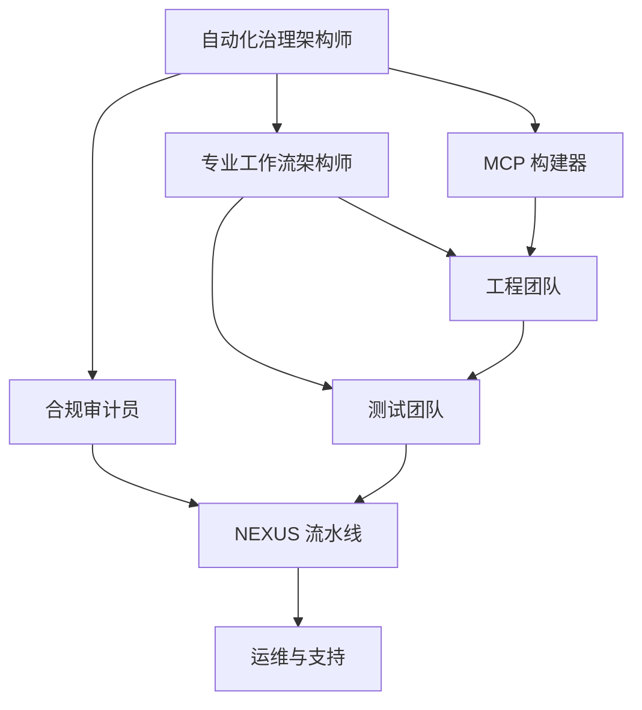

# 自动化治理代理

<cite>
**本文档引用的文件**
- [README.md](file://README.md)
- [automation-governance-architect.md](file://specialized/automation-governance-architect.md)
- [specialized-mcp-builder.md](file://specialized/specialized-mcp-builder.md)
- [specialized-workflow-architect.md](file://specialized/specialized-workflow-architect.md)
- [nexus-strategy.md](file://strategy/nexus-strategy.md)
- [phase-4-hardening.md](file://strategy/playbooks/phase-4-hardening.md)
- [scenario-enterprise-feature.md](file://strategy/runbooks/scenario-enterprise-feature.md)
- [workflow-with-memory.md](file://examples/workflow-with-memory.md)
- [compliance-auditor.md](file://specialized/compliance-auditor.md)
- [CONTRIBUTING.md](file://CONTRIBUTING.md)
</cite>

## 目录
1. [简介](#简介)
2. [项目结构](#项目结构)
3. [核心组件](#核心组件)
4. [架构总览](#架构总览)
5. [详细组件分析](#详细组件分析)
6. [依赖关系分析](#依赖关系分析)
7. [性能考量](#性能考量)
8. [故障排查指南](#故障排查指南)
9. [结论](#结论)
10. [附录](#附录)

## 简介
本文件面向“自动化治理代理”的设计与实践，系统阐述三类关键代理：自动化治理架构师、MCP 构建器、专业工作流架构师。它们分别负责：
- 自动化治理架构师：以 n8n 为主导的业务自动化治理，从价值、风险、可维护性三个维度评估自动化提案，制定标准化工作流与命名版本规范，确保生产级可靠性与审计可追溯性。
- MCP 构建器：基于模型上下文协议（MCP）构建可被 AI 代理使用的工具服务器，强调开发者体验、类型参数校验、错误处理与资源暴露，支撑真实世界集成。
- 专业工作流架构师：在实现前穷尽映射系统所有路径，覆盖正常路径、输入验证失败、超时、瞬时失败、永久失败、部分失败与并发冲突，定义明确的可观测状态与手递手契约，产出可实施、可测试的工作流树规范。

上述代理共同构成 The Agency 的“治理—工具—规范”三位一体能力体系，服务于企业级自动化系统设计、治理框架建立与工作流架构落地，确保安全、可靠与可维护。

## 项目结构
The Agency 是一个由多领域专业化代理组成的集合体，围绕“多代理编排与质量门禁”的运营模型展开。自动化治理代理位于“治理—工具—规范”的关键节点，与工程、测试、支持、空间计算等多部门协同，通过 NEXUS 流水线串联各阶段的质量门禁与协作协议。

图示来源
- [nexus-strategy.md:75-93](file://strategy/nexus-strategy.md#L75-L93)
- [automation-governance-architect.md:15-27](file://specialized/automation-governance-architect.md#L15-L27)
- [specialized-workflow-architect.md:22-42](file://specialized/specialized-workflow-architect.md#L22-L42)
- [specialized-mcp-builder.md:20-43](file://specialized/specialized-mcp-builder.md#L20-L43)

章节来源
- [README.md:68-283](file://README.md#L68-L283)
- [nexus-strategy.md:73-116](file://strategy/nexus-strategy.md#L73-L116)

## 核心组件
- 自动化治理架构师：以 n8n 为默认编排工具，建立自动化决策框架（时间节省、数据关键性、外部依赖风险、可扩展性），输出治理结论与标准化工作流结构；制定命名版本规范、可靠性基线、日志基线、测试基线与集成治理清单；要求每个建议包含回退与所有权，并以文档与测试证据作为完成前提。
- MCP 构建器：专注于 MCP 服务器设计与实现，强调工具命名清晰、参数类型化、结构化输出、优雅错误处理、无状态调用、环境变量密钥管理、资源与提示模板暴露；提供 TypeScript 与 Python 示例，支持多传输（stdio/SSE/streamable HTTP）、OAuth 与速率限制、动态工具注册与可组合架构。
- 专业工作流架构师：以“树形思维”穷举系统路径，覆盖正常、异常、超时、重试、回滚、并发冲突等分支；定义可观测状态（用户可见、操作者可见、数据库状态、日志状态）与系统边界手递手契约；产出可由工程师实现、QA 可测试、运营可理解的完整工作流树规范；与现实核对（Reality Checker）闭环验证。

章节来源
- [automation-governance-architect.md:29-153](file://specialized/automation-governance-architect.md#L29-L153)
- [specialized-mcp-builder.md:20-245](file://specialized/specialized-mcp-builder.md#L20-L245)
- [specialized-workflow-architect.md:226-598](file://specialized/specialized-workflow-architect.md#L226-L598)

## 架构总览
自动化治理代理的运行架构遵循 NEXUS 模型，分为 Discovery、Strategy、Scaffold、Build、Hardening、Launch、Operate 共七个阶段。自动化治理架构师在 Phase 0-1 提供价值与风险评估，在 Phase 2-3 与工作流架构师协同形成可实施的自动化蓝图，在 Phase 4 进入硬化的最终质量门禁，确保生产就绪。

图示来源
- [nexus-strategy.md:181-232](file://strategy/nexus-strategy.md#L181-L232)
- [automation-governance-architect.md:29-153](file://specialized/automation-governance-architect.md#L29-L153)
- [specialized-workflow-architect.md:438-598](file://specialized/specialized-workflow-architect.md#L438-L598)
- [phase-4-hardening.md:216-256](file://strategy/playbooks/phase-4-hardening.md#L216-L256)

章节来源
- [nexus-strategy.md:181-232](file://strategy/nexus-strategy.md#L181-L232)
- [phase-4-hardening.md:216-256](file://strategy/playbooks/phase-4-hardening.md#L216-L256)

## 详细组件分析

### 自动化治理架构师（以 n8n 为主）
- 决策框架四维评估：时间节省（是否持续且显著）、数据关键性（错/延迟/重复/缺失的影响）、外部依赖风险（链路稳定性与可观测性）、可扩展性（在负载下的重试/去重/限流与异常处理仍可控）。
- 治理结论五类：批准、试点批准、仅部分自动化、延期、拒绝；每条结论需给出业务影响、关键风险与理由。
- n8n 工作流标准：触发→输入校验→数据归一化→业务逻辑→外部动作→结果校验→日志/审计→错误分支→回退/人工恢复→完成/状态写回。
- 命名与版本：推荐格式为 [ENV]-[SYSTEM]-[PROCESS]-[ACTION]-v[MAJOR.MINOR]，包含环境与版本，重大变更主版本，兼容改进小版本，避免模糊名称。
- 可靠性基线：显式错误分支、相关场景幂等或去重保护、安全重试（含停止条件）、超时处理、告警/通知行为、人工回退路径。
- 日志基线：工作流名称与版本、执行时间戳、源系统、受影响实体 ID、成功/失败状态、错误类别与简要原因。
- 测试基线：正常路径、无效输入、外部依赖失败、重复事件、回退/恢复、规模/重复性合理性检查。
- 集成治理：明确系统角色与权威来源、认证方式与令牌生命周期、触发模型、字段映射与转换、写回权限与只读字段、速率限制与失败模式、所有者与升级路径。
- 复审触发：API 或模式变更、错误率上升、体量显著增长、合规要求变化、重复手动修复出现。
- 输出格式：过程摘要、审计评估、结论、理由、推荐架构、实施标准、前置条件与风险。

图示来源
- [automation-governance-architect.md:29-153](file://specialized/automation-governance-architect.md#L29-L153)

章节来源
- [automation-governance-architect.md:15-209](file://specialized/automation-governance-architect.md#L15-L209)

### MCP 构建器（模型上下文协议）
- 设计目标：让 AI 代理能像使用 UI 组件一样直观地使用工具；工具命名清晰、描述明确、参数类型化、返回结构化数据；服务器具备健壮错误处理、边界输入校验、安全认证、无状态调用。
- 技术交付：提供 TypeScript 与 Python 示例，展示工具注册、资源暴露、提示模板、客户端配置；支持多传输（stdio/SSE/streamable HTTP）；实现 OAuth 2.0、API 密钥轮换、速率限制、输入净化；支持动态工具注册与可组合架构。
- 成功指标：代理按名称与描述正确选择工具的比例>90%、生产零未处理异常、新开发者可在15分钟内添加工具、参数校验拦截恶意输入、服务器启动<2秒、工具调用响应<500ms（不含外部 API 延迟）、一次迭代即可通过代理测试循环。

图示来源
- [specialized-mcp-builder.md:20-245](file://specialized/specialized-mcp-builder.md#L20-L245)

章节来源
- [specialized-mcp-builder.md:20-245](file://specialized/specialized-mcp-builder.md#L20-L245)

### 专业工作流架构师（工作流树规范）
- 发现与登记：从路由文件、后台作业、数据库迁移、服务编排、基础设施即代码、配置与环境变量、架构决策记录与设计文档中发现隐性工作流；将缺失工作流标记为红灯。
- 注册与交叉引用：按工作流、组件、用户旅程、状态四种视角维护权威参考；更新即刻生效，缺失即警示，状态及时跟踪。
- 规范产出：工作流树规范包含概述、参与者、前置条件、触发、步骤树（含超时、输入/输出、可观测状态）、终止清理、状态变迁、手递手契约、清理清单、现实核对发现、测试用例、假设与开放问题、规范与现实审计日志。
- 关键规则：不只关注正常路径；不跳过可观测状态；不遗漏手递手契约；不打包无关工作流；不进行实现决策；以实际代码为准；明确每个时序假设；显式追踪每个假设。
- 协作协议：与 Reality Checker、后端架构师、安全工程师、API 测试员、DevOps 自动化工程师协作；Curiosity 驱动的缺陷发现；规模化注册表组织。

图示来源
- [specialized-workflow-architect.md:397-598](file://specialized/specialized-workflow-architect.md#L397-L598)

章节来源
- [specialized-workflow-architect.md:226-598](file://specialized/specialized-workflow-architect.md#L226-L598)

### 与其他代理的协作
- 与工程团队：依据工作流树规范实现功能，后端架构师负责系统架构与 API 规范，前端开发负责 UI 组件，移动开发负责跨平台应用，AI 工程师负责机器学习模块。
- 与测试团队：证据收集员提供视觉证据包，API 测试员进行端点回归，性能基准员进行负载测试，测试结果分析员汇总质量指标，工作流优化员提出流程改进建议。
- 与支持团队：基础设施维护员负责生产环境验证，法律合规检查员进行最终合规审计，财务跟踪员负责预算与成本控制，执行摘要生成器负责高层汇报。
- 与空间计算团队：XR 接口架构师、macOS/Metal 工程师、WebXR 开发者、cockpit 交互专家、visionOS 工程师、终端集成专家负责沉浸式体验与空间计算。
- 与专业化团队：代理编排器负责多代理协调，数据分析与报告分发、身份图操作员、区块链安全审计员、合规审计员、ZK 管理员等提供跨领域支撑。

章节来源
- [nexus-strategy.md:554-594](file://strategy/nexus-strategy.md#L554-L594)
- [scenario-enterprise-feature.md:11-46](file://strategy/runbooks/scenario-enterprise-feature.md#L11-L46)

## 依赖关系分析
自动化治理代理之间的耦合与协作体现在以下方面：
- 自动化治理架构师与专业工作流架构师：前者负责“是否做、如何做”，后者负责“怎么做”。前者输出标准化工作流与命名版本规范，后者产出可实施、可测试的工作流树规范。
- MCP 构建器与工程团队：MCP 构建器提供工具/资源/提示模板，工程团队将其集成到 n8n 或其他编排平台，实现真实世界的自动化。
- 合规审计员与自动化治理架构师：合规审计员在治理过程中提供技术合规视角，确保自动化满足 SOC 2、ISO 27001、HIPAA、PCI-DSS 等要求。
- NEXUS 流水线与各代理：流水线的每个阶段都有明确的质量门禁与协作协议，确保跨团队、跨领域的无缝衔接。

图示来源
- [nexus-strategy.md:75-93](file://strategy/nexus-strategy.md#L75-L93)
- [automation-governance-architect.md:15-27](file://specialized/automation-governance-architect.md#L15-L27)
- [specialized-workflow-architect.md:22-42](file://specialized/specialized-workflow-architect.md#L22-L42)
- [specialized-mcp-builder.md:20-43](file://specialized/specialized-mcp-builder.md#L20-L43)
- [compliance-auditor.md:19-59](file://specialized/compliance-auditor.md#L19-L59)

章节来源
- [nexus-strategy.md:75-93](file://strategy/nexus-strategy.md#L75-L93)
- [compliance-auditor.md:19-59](file://specialized/compliance-auditor.md#L19-L59)

## 性能考量
- 自动化治理架构师：通过 n8n 工作流标准与可靠性基线（显式错误分支、幂等/去重、安全重试、超时处理、告警/通知、人工回退）保障自动化在高负载下的稳定运行。
- MCP 构建器：多传输选择（stdio/SSE/streamable HTTP）适配不同部署场景；OAuth 与速率限制保护上游服务；动态工具注册与可组合架构提升可扩展性。
- 专业工作流架构师：通过穷举路径与可观测状态定义，提前发现潜在瓶颈与竞态条件，减少生产期性能回归风险。
- NEXUS 流水线：通过 Dev↔QA 循环与质量门禁，降低返工成本，提高整体交付效率。

## 故障排查指南
- 自动化治理架构师
  - 当自动化被拒绝或需要试点时，检查四维评估是否充分，确认命名版本规范与可靠性基线是否满足。
  - 若出现外部依赖失败，优先启用错误分支与回退路径，确保人工接管通道可用。
- MCP 构建器
  - 工具混淆：检查工具命名是否清晰、描述是否明确、参数是否类型化；必要时简化工具职责，拆分为单一职责。
  - 错误处理：确保返回结构化错误信息而非堆栈；验证边界输入校验与上游服务异常路径。
  - 认证与安全：确认密钥来自环境变量、OAuth 刷新流程、速率限制与输入净化。
- 专业工作流架构师
  - 现实核对：Reality Checker 默认“需要改进”，需提供端到端用户旅程证据、跨设备一致性、性能数据、安全与合规证明、规范符合性。
  - 清理清单：确保每个创建的资源都有对应销毁动作，避免孤儿资源。
  - 手递手契约：明确每个系统边界的载荷、成功/失败响应、超时与失败后的恢复动作。

章节来源
- [phase-4-hardening.md:216-256](file://strategy/playbooks/phase-4-hardening.md#L216-L256)
- [specialized-workflow-architect.md:508-537](file://specialized/specialized-workflow-architect.md#L508-L537)

## 结论
自动化治理代理通过“治理—工具—规范”的协同，为企业自动化系统提供了从价值评估、工具集成到工作流规范的全生命周期治理能力。自动化治理架构师确保自动化决策的科学性与可维护性；MCP 构建器提供真实世界集成的工具与资源；专业工作流架构师保证实现前的路径穷举与可观测性。结合 NEXUS 流水线与质量门禁，自动化治理代理能够有效提升系统的安全性、可靠性与可维护性，支撑企业数字化转型的稳健推进。

## 附录
- 应用案例与成功经验
  - 启动 MVP 场景：通过记忆增强的多代理工作流，实现跨代理上下文连续与回滚恢复，显著降低手递手成本与上下文丢失风险。
  - 企业特性开发：在严格合规与质量门禁下，通过 NEXUS-Sprint 模式快速交付复杂特性，确保生产就绪与持续演进。
- 认证标准与持续改进机制
  - 自动化治理：以 n8n 工作流标准、命名版本规范、可靠性基线、日志基线、测试基线与集成治理清单为认证依据。
  - MCP 构建：以工具命名与描述清晰度、参数类型化、结构化输出、错误处理、无状态调用、安全认证与多传输适配为认证依据。
  - 工作流规范：以工作流树规范完整性、现实核对发现、测试用例覆盖率、可观测状态与手递手契约为认证依据。
  - 持续改进：通过 NEXUS 流水线的阶段性质量门禁与风险响应矩阵，推动流程优化与知识沉淀。

章节来源
- [workflow-with-memory.md:1-239](file://examples/workflow-with-memory.md#L1-L239)
- [scenario-enterprise-feature.md:1-158](file://strategy/runbooks/scenario-enterprise-feature.md#L1-L158)
- [CONTRIBUTING.md:81-151](file://CONTRIBUTING.md#L81-L151)