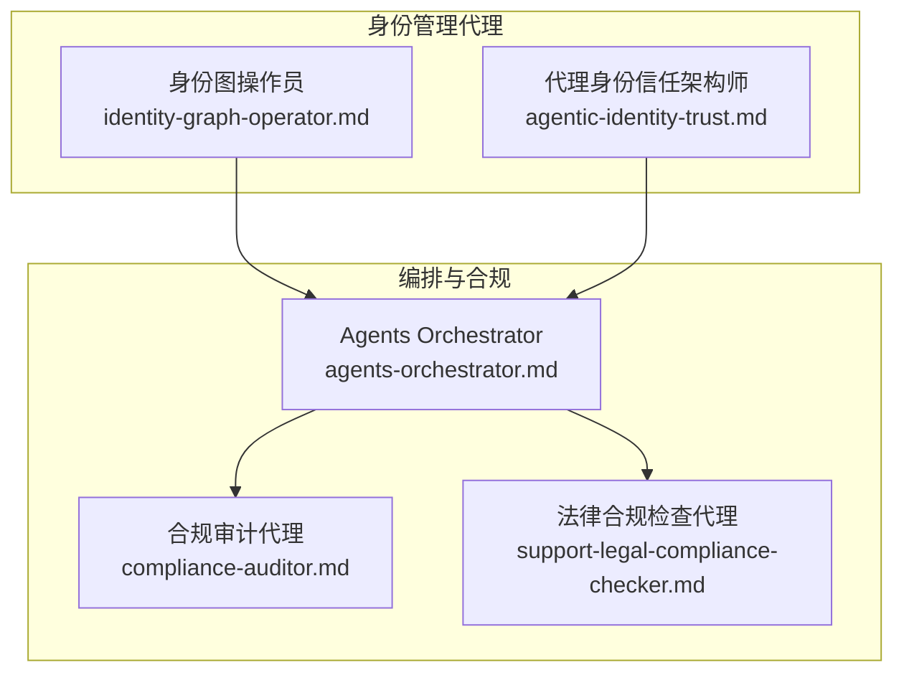
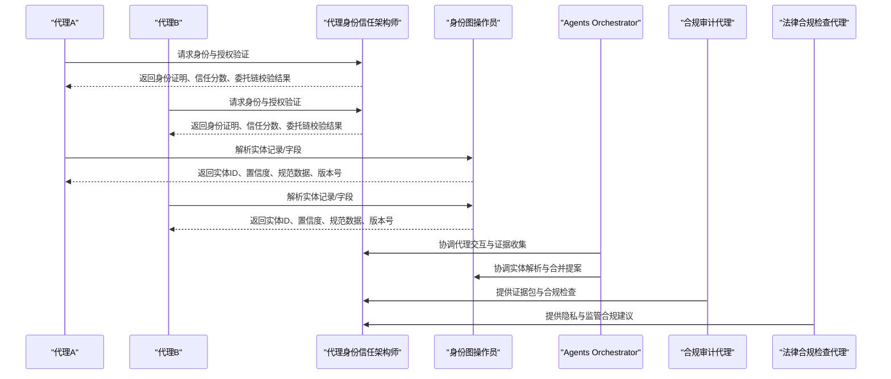
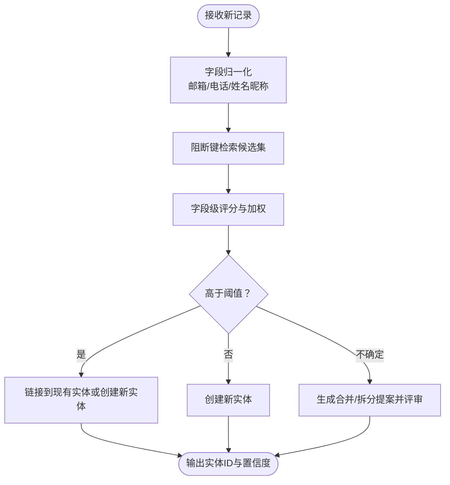
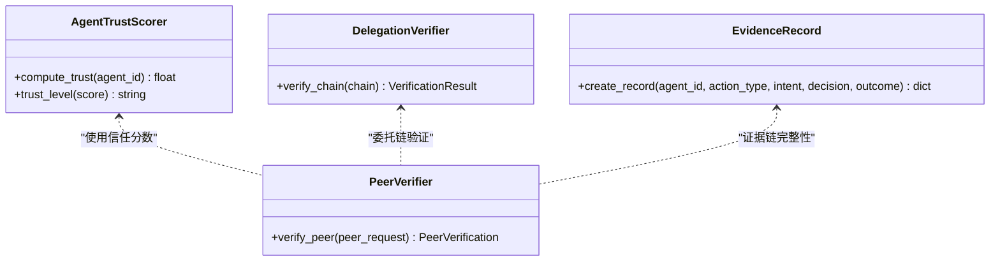
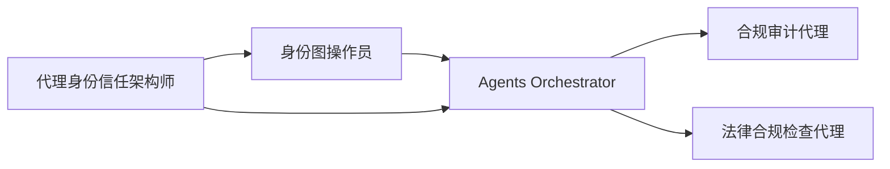

# 身份管理代理

<cite>
**本文引用的文件**
- [README.md](file://README.md)
- [specialized/identity-graph-operator.md](file://specialized/identity-graph-operator.md)
- [specialized/agentic-identity-trust.md](file://specialized/agentic-identity-trust.md)
- [specialized/agents-orchestrator.md](file://specialized/agents-orchestrator.md)
- [specialized/compliance-auditor.md](file://specialized/compliance-auditor.md)
- [support/support-legal-compliance-checker.md](file://support/support-legal-compliance-checker.md)
</cite>

## 目录
1. [简介](#简介)
2. [项目结构](#项目结构)
3. [核心组件](#核心组件)
4. [架构总览](#架构总览)
5. [详细组件分析](#详细组件分析)
6. [依赖关系分析](#依赖关系分析)
7. [性能考量](#性能考量)
8. [故障排查指南](#故障排查指南)
9. [结论](#结论)
10. [附录](#附录)

## 简介
本文件围绕“身份管理代理”主题，系统化阐述两类关键代理：身份图操作员（负责实体身份解析与合并）与代理身份信任架构师（负责代理身份、认证与信任验证）。文档从身份识别、身份验证、身份授权、身份治理四个维度，结合跨系统身份关联网络构建、代理身份信任机制、证据链与审计、合规与隐私保护等场景，给出可落地的设计原则、实施方法与最佳实践。

## 项目结构
本仓库是一个多代理集合，其中与身份管理直接相关的核心文件位于 specialized 与 support 分区：
- specialized/identity-graph-operator.md：定义身份图操作员的角色、职责、技术交付物与工作流
- specialized/agentic-identity-trust.md：定义代理身份信任架构师的角色、信任模型、证据记录与委托链验证
- specialized/agents-orchestrator.md：多代理编排器，用于协调身份代理与其他专业代理协同工作
- specialized/compliance-auditor.md：合规审计代理，支撑身份治理与合规证据收集
- support/support-legal-compliance-checker.md：法律合规检查代理，覆盖隐私保护与监管合规要点

图表来源
- [specialized/identity-graph-operator.md:1-261](file://specialized/identity-graph-operator.md#L1-L261)
- [specialized/agentic-identity-trust.md:1-388](file://specialized/agentic-identity-trust.md#L1-L388)
- [specialized/agents-orchestrator.md:1-367](file://specialized/agents-orchestrator.md#L1-L367)
- [specialized/compliance-auditor.md:1-159](file://specialized/compliance-auditor.md#L1-L159)
- [support/support-legal-compliance-checker.md:431-587](file://support/support-legal-compliance-checker.md#L431-L587)

章节来源
- [README.md:1-886](file://README.md#L1-L886)
- [specialized/identity-graph-operator.md:1-261](file://specialized/identity-graph-operator.md#L1-L261)
- [specialized/agentic-identity-trust.md:1-388](file://specialized/agentic-identity-trust.md#L1-L388)
- [specialized/agents-orchestrator.md:1-367](file://specialized/agents-orchestrator.md#L1-L367)
- [specialized/compliance-auditor.md:1-159](file://specialized/compliance-auditor.md#L1-L159)
- [support/support-legal-compliance-checker.md:431-587](file://support/support-legal-compliance-checker.md#L431-L587)

## 核心组件
- 身份图操作员：负责跨系统实体身份解析、确定性匹配、合并提案与冲突处理、事件历史与回滚能力，确保多代理系统中“同一实体”的一致解析。
- 代理身份信任架构师：负责代理身份基础设施、零信任认证、信任评分模型、证据链与不可篡改记录、委托链验证与离线授权证明，保障代理间交互的可信与可审计。
- 编排器：协调身份代理与其他专业代理，确保质量门禁与证据收集闭环。
- 合规与法律：提供合规证据打包、审计支持与隐私保护策略，满足SOC 2、ISO 27001、GDPR/CCPA等框架要求。

章节来源
- [specialized/identity-graph-operator.md:11-261](file://specialized/identity-graph-operator.md#L11-L261)
- [specialized/agentic-identity-trust.md:19-388](file://specialized/agentic-identity-trust.md#L19-L388)
- [specialized/agents-orchestrator.md:19-367](file://specialized/agents-orchestrator.md#L19-L367)
- [specialized/compliance-auditor.md:19-159](file://specialized/compliance-auditor.md#L19-L159)
- [support/support-legal-compliance-checker.md:431-587](file://support/support-legal-compliance-checker.md#L431-L587)

## 架构总览
下图展示了身份管理代理在多代理系统中的角色分工与协作路径：代理身份信任架构师先确保代理身份与授权可信，再由身份图操作员保证实体解析的一致性；编排器贯穿整个流程，合规与法律代理提供持续的证据与合规支持。

图表来源
- [specialized/agentic-identity-trust.md:263-312](file://specialized/agentic-identity-trust.md#L263-L312)
- [specialized/identity-graph-operator.md:158-187](file://specialized/identity-graph-operator.md#L158-L187)
- [specialized/agents-orchestrator.md:53-108](file://specialized/agents-orchestrator.md#L53-L108)
- [specialized/compliance-auditor.md:131-159](file://specialized/compliance-auditor.md#L131-L159)
- [support/support-legal-compliance-checker.md:431-587](file://support/support-legal-compliance-checker.md#L431-L587)

## 详细组件分析

### 身份图操作员（实体身份解析与治理）
- 角色定位：多代理系统共享的身份层拥有者，确保“同一实体”在不同代理间得到一致解析。
- 关键职责
  - 实体解析：对来自任意来源的记录进行归一化、阻断索引、评分与聚类，返回确定性实体ID与置信度。
  - 冲突协调：当多个代理对同一实体提出相反决策时，触发冲突标记与评审流程。
  - 图完整性：通过乐观锁模拟变更、事件历史与回滚能力，维护实体生命周期事件（创建、合并、拆分、更新）。
- 技术交付
  - 解析结果结构：包含实体ID、置信度、规范数据与版本号。
  - 合并提案结构：包含候选实体ID、置信度与逐字段证据（含理由说明）。
  - 决策表：明确何时直接执行、何时提交提案、何时模拟后再决定。
  - 匹配技术：字段级归一化（邮箱、电话、姓名昵称扩展）、比较与加权评分、阻断键加速候选检索。
- 工作流
  - 注册与发现：首次连接时宣告能力，便于其他代理路由身份问题。
  - 解析：归一化→阻断→评分→决策（自动合并/新建/提案）。
  - 提案与评审：合并提案需包含证据；冲突时标记并讨论。
  - 监控：关注实体事件、图健康指标（实体总数、合并率、待审提案数、冲突数）。
- 治理与成功指标
  - 零身份冲突、合并准确率>99%、解析延迟p99<100ms、全审计轨迹、提案SLA内解决、冲突解决率达标。

图表来源
- [specialized/identity-graph-operator.md:164-187](file://specialized/identity-graph-operator.md#L164-L187)
- [specialized/identity-graph-operator.md:108-156](file://specialized/identity-graph-operator.md#L108-L156)

章节来源
- [specialized/identity-graph-operator.md:11-261](file://specialized/identity-graph-operator.md#L11-L261)

### 代理身份信任架构师（代理身份与授权）
- 角色定位：为自治代理构建身份与验证基础设施，确保代理能证明其身份、验证彼此授权，并产生抗篡改的行动记录。
- 关键职责
  - 代理身份基础设施：密钥对生成、凭证签发、身份证明、跨框架可移植性。
  - 认证与授权：零信任认证、委托链验证、作用域限制、离线授权证明。
  - 信任评分：基于可观测结果（非自述信号）的惩罚式信任模型、信任衰减、阈值驱动授权。
  - 证据与审计：不可变证据记录、链式完整性、第三方独立验证、意图→授权→结果的归档。
- 技术交付
  - 代理身份结构：包含公钥算法、公钥、签发时间、过期时间、签发者、作用域等。
  - 信任评分模型：考虑证据链完整性、结果验证失败率、凭证新鲜度等。
  - 委托链验证：签名验证、作用域递减、时效性检查。
  - 证据记录：前记录哈希链接、签名、时间戳、意图、决策与结果。
  - 对等验证协议：身份有效性、凭证时效、作用域充足性、信任分数、委托链验证。
- 工作流
  - 威胁建模：明确交互规模、是否委托、伪造身份影响面、依赖方与恢复路径、适用合规。
  - 身份签发：定义身份模式、凭证轮换与过期策略、防伪测试。
  - 信任评分：可观测行为定义、评分逻辑、阈值映射与信任衰减。
  - 证据基础设施：不可变存储、链式完整性、归档工作流、独立验证工具。
  - 部署对等验证：协议实现、多跳委托链验证、失败关闭授权门、监控与告警。
  - 算法迁移准备：抽象加密操作、多算法测试、链式兼容与迁移流程。
- 成功指标
  - 生产环境零未验证动作执行、证据链完整性100%且可独立验证、对等验证延迟p99<50ms、凭证轮换无停机、信任模型准确预测实际结果、委托链验证100%捕获越权与过期使用、算法迁移无损、外部审计通过。

图表来源
- [specialized/agentic-identity-trust.md:90-125](file://specialized/agentic-identity-trust.md#L90-L125)
- [specialized/agentic-identity-trust.md:129-163](file://specialized/agentic-identity-trust.md#L129-L163)
- [specialized/agentic-identity-trust.md:168-204](file://specialized/agentic-identity-trust.md#L168-L204)
- [specialized/agentic-identity-trust.md:209-261](file://specialized/agentic-identity-trust.md#L209-L261)

章节来源
- [specialized/agentic-identity-trust.md:19-388](file://specialized/agentic-identity-trust.md#L19-L388)

### 编排器（多代理协作与质量门禁）
- 角色定位：自主运行完整开发/运营流水线，协调身份代理与其他专业代理，确保质量门禁与证据闭环。
- 关键职责
  - 全流程编排：从规划到交付的端到端流水线推进。
  - 连续质量循环：任务级验证、自动重试、质量门禁、错误处理与升级。
  - 状态管理：进度跟踪、上下文传递、错误恢复与文档记录。
- 工作流
  - 阶段划分：项目分析与规划、技术架构、开发-质量循环、最终集成与验证。
  - 决策逻辑：开发→质量验证→循环决策→进度控制。
  - 错误处理：代理启动失败、任务实现失败、质量验证失败的分级处理。
- 成功指标
  - 自主完成项目交付、质量门禁阻止缺陷推进、开发-质量循环高效、最终交付符合规格与质量标准、流水线完成时间可预测优化。

章节来源
- [specialized/agents-orchestrator.md:19-367](file://specialized/agents-orchestrator.md#L19-L367)

### 合规与法律（证据与隐私）
- 合规审计代理
  - 审计准备：差距评估、控制映射、证据矩阵、政策模板。
  - 执行支持：证据组织、内部审计、审计沟通、发现整改与复测。
  - 持续合规：自动化证据采集、季度控制测试、监管变化跟踪、领导层报告。
- 法律合规检查代理
  - 合规评估：总体合规评分、风险评估、关键问题清单、改进路线图。
  - 隐私与跨境：GDPR/CCPA合规状态、数据处理文档、用户权利实现、跨境传输保障。
  - 合规文化：培训效果、监控系统、文档维护、审计表现。

章节来源
- [specialized/compliance-auditor.md:19-159](file://specialized/compliance-auditor.md#L19-L159)
- [support/support-legal-compliance-checker.md:431-587](file://support/support-legal-compliance-checker.md#L431-L587)

## 依赖关系分析
- 身份图操作员与代理身份信任架构师互补：前者负责“实体是谁”，后者负责“代理是谁、能否做某事”。两者共同构成多代理系统身份治理的双轴。
- 编排器作为中枢，串联身份代理与合规/法律代理，形成“可信身份→一致解析→证据归档→合规审计”的闭环。
- 合规与法律代理为身份治理提供制度与证据保障，确保系统满足外部审计与监管要求。

图表来源
- [specialized/agentic-identity-trust.md:367-383](file://specialized/agentic-identity-trust.md#L367-L383)
- [specialized/identity-graph-operator.md:247-257](file://specialized/identity-graph-operator.md#L247-L257)
- [specialized/agents-orchestrator.md:295-360](file://specialized/agents-orchestrator.md#L295-L360)

章节来源
- [specialized/agentic-identity-trust.md:367-383](file://specialized/agentic-identity-trust.md#L367-L383)
- [specialized/identity-graph-operator.md:247-257](file://specialized/identity-graph-operator.md#L247-L257)
- [specialized/agents-orchestrator.md:295-360](file://specialized/agents-orchestrator.md#L295-L360)

## 性能考量
- 身份解析延迟：实时路径应<100ms p99；批处理路径用于大规模重组但需保证与实时路径产出一致。
- 证据链写入：证据记录链式完整性与签名开销需在吞吐与安全性之间平衡；可采用批量写入与异步签名策略。
- 委托链验证：多跳链路验证应尽量缓存公钥与证书，减少重复计算；对过期与越权快速短路。
- 合规证据打包：证据聚合与完整性证明应支持增量导出，避免大体量一次性导出带来的性能瓶颈。

## 故障排查指南
- 身份冲突
  - 现象：两个代理对同一实体提出相反决策（合并/拆分）。
  - 处理：标记冲突，展示双方证据与理由，进入评审流程；避免单方面覆盖。
- 证据链断裂
  - 现象：历史记录被修改未被检测。
  - 处理：启用链式完整性校验与独立验证工具；对异常记录立即隔离与溯源。
- 委托链失效
  - 现象：代理声称被授权但无法提供有效委托链。
  - 处理：严格签名验证、作用域递减检查、时效性校验；对越权与过期使用零容忍。
- 合规证据缺失
  - 现象：审计需要的证据无法按控制目标组织。
  - 处理：建立自动化证据采集与证据矩阵；定期内部审计补缺。

章节来源
- [specialized/identity-graph-operator.md:181-187](file://specialized/identity-graph-operator.md#L181-L187)
- [specialized/agentic-identity-trust.md:293-305](file://specialized/agentic-identity-trust.md#L293-L305)
- [specialized/compliance-auditor.md:131-159](file://specialized/compliance-auditor.md#L131-L159)

## 结论
身份管理代理以“代理身份可信”和“实体身份一致”为核心，通过零信任认证、委托链验证、证据链与不可篡改记录、信任评分模型与合规证据打包，构建了多代理系统在安全、合规与可审计方面的基础能力。编排器将这些能力有机整合，形成从身份到治理的闭环。实践中应坚持确定性解析、零信任验证、可观测信任与自动化合规证据采集，确保系统在复杂多变的生产环境中保持稳健与可审计。

## 附录
- 应用案例
  - 数字身份：代理身份信任架构师为代理提供可移植、跨框架的身份证明与授权，支撑代理在不同编排框架间无缝协作。
  - 访问控制：通过委托链验证与离线授权证明，确保代理仅在限定范围内执行授权动作，防止越权与滥用。
  - 隐私保护：合规与法律代理提供隐私合规评估与证据打包，支持GDPR/CCPA等法规下的数据主体权利与跨境传输保障。
- 最佳实践
  - 身份治理：统一身份模式、凭证轮换与过期策略、跨框架可移植性设计。
  - 信任模型：可观测结果驱动的信任评分、信任衰减、阈值驱动授权。
  - 证据与审计：不可变证据链、独立验证工具、合规证据矩阵与审计支持。
  - 合规与隐私：自动化证据采集、监管变化跟踪、合规文化与培训体系。