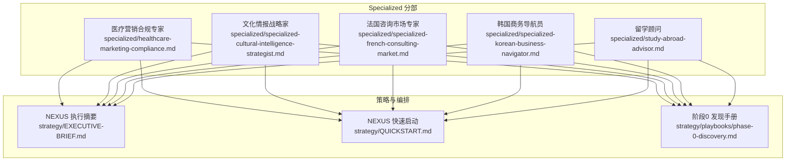
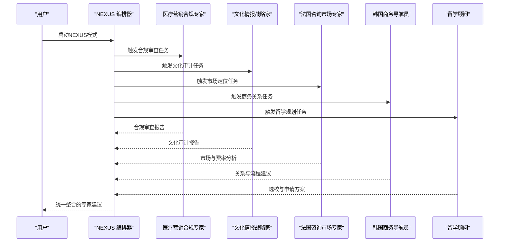
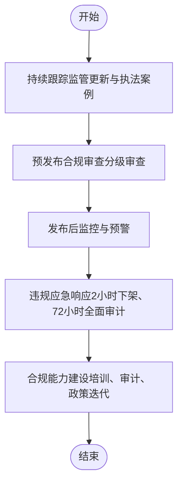
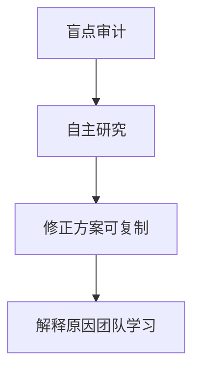
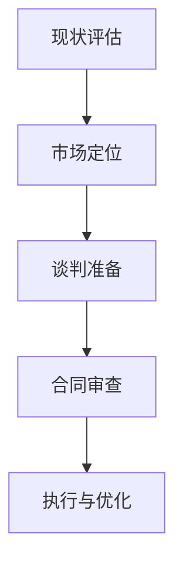
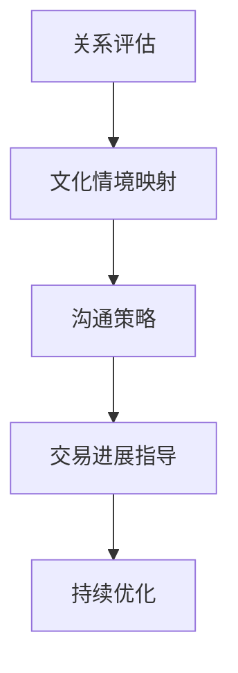
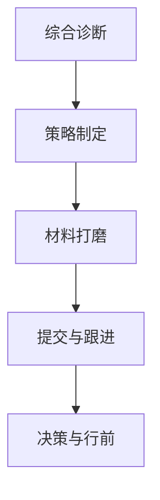
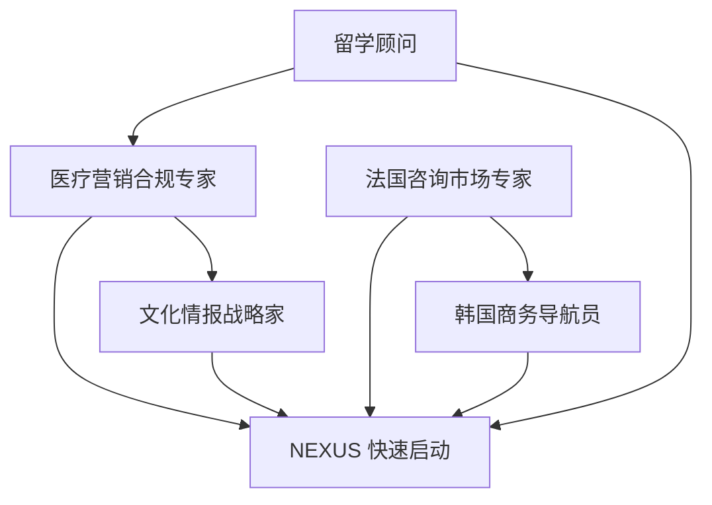

# 领域专家代理

<cite>
**本文引用的文件**
- [specialized/healthcare-marketing-compliance.md](file://specialized/healthcare-marketing-compliance.md)
- [specialized/specialized-cultural-intelligence-strategist.md](file://specialized/specialized-cultural-intelligence-strategist.md)
- [specialized/specialized-french-consulting-market.md](file://specialized/specialized-french-consulting-market.md)
- [specialized/specialized-korean-business-navigator.md](file://specialized/specialized-korean-business-navigator.md)
- [specialized/study-abroad-advisor.md](file://specialized/study-abroad-advisor.md)
- [README.md](file://README.md)
- [CONTRIBUTING.md](file://CONTRIBUTING.md)
- [strategy/EXECUTIVE-BRIEF.md](file://strategy/EXECUTIVE-BRIEF.md)
- [strategy/QUICKSTART.md](file://strategy/QUICKSTART.md)
- [strategy/playbooks/phase-0-discovery.md](file://strategy/playbooks/phase-0-discovery.md)
</cite>

## 目录
1. [简介](#简介)
2. [项目结构](#项目结构)
3. [核心组件](#核心组件)
4. [架构总览](#架构总览)
5. [详细组件分析](#详细组件分析)
6. [依赖关系分析](#依赖关系分析)
7. [性能考量](#性能考量)
8. [故障排查指南](#故障排查指南)
9. [结论](#结论)
10. [附录](#附录)

## 简介
本文件面向“领域专家代理”，系统化梳理并呈现以下专业代理的能力与协作方式：
- 医疗营销合规专家：深耕中国医疗广告与互联网医疗合规，覆盖药械、医美、健康产品、平台规则与数据隐私，提供内容审查清单、风险矩阵与全流程合规流程。
- 文化情报战略家：检测软件中的“隐形排斥”，确保产品在多文化语境下真实共鸣，提供UI/UX包容性检查清单、负提示库、文化语义审计与可复制的结构性改进建议。
- 法国咨询市场专家：解码法国ESN/SI自由职业生态，涵盖边际模型、平台机制、薪酬定位、支付周期与合同谈判要点，帮助独立IT顾问最大化有效日薪、降低付款风险。
- 韩国商务导航员：解构韩式关系型交易范式，涵盖“품의”（审批）流程、nunchi（察言观色）、KakaoTalk商务礼仪、层级与头衔体系、业务聚餐文化与时序节奏，指导外方专业人士在韩国建立可持续的商业关系。
- 留学顾问：覆盖美国、英国、加拿大、澳大利亚、欧洲、香港与新加坡的本科、硕士、博士申请策略，提供选校报告模板、多国申请时间线、文书诊断框架与决策矩阵，帮助中国学生制定端到端的留学计划。

上述代理均采用统一的“代理模板”设计，具备强个性、可交付物、可衡量的成功指标与经验证的工作流，并支持在多工具链中使用。

章节来源
- [README.md:25-46](file://README.md#L25-L46)
- [CONTRIBUTING.md:81-151](file://CONTRIBUTING.md#L81-L151)

## 项目结构
该仓库以“专业化代理”为核心组织方式，按职能分为工程、设计、游戏开发、营销、付费媒体、产品、项目管理、测试、支持、空间计算与“specialized”等12个主要分部。每个代理文件遵循统一的结构：身份与记忆、核心使命、关键规则、技术交付物、工作流、沟通风格、学习与记忆、成功指标与高级能力。

图表来源
- [README.md:249-282](file://README.md#L249-L282)
- [strategy/EXECUTIVE-BRIEF.md:68-96](file://strategy/EXECUTIVE-BRIEF.md#L68-L96)
- [strategy/QUICKSTART.md:123-141](file://strategy/QUICKSTART.md#L123-L141)
- [strategy/playbooks/phase-0-discovery.md:1-179](file://strategy/playbooks/phase-0-discovery.md#L1-L179)

章节来源
- [README.md:68-282](file://README.md#L68-L282)
- [strategy/EXECUTIVE-BRIEF.md:1-96](file://strategy/EXECUTIVE-BRIEF.md#L1-L96)
- [strategy/QUICKSTART.md:1-195](file://strategy/QUICKSTART.md#L1-L195)
- [strategy/playbooks/phase-0-discovery.md:1-179](file://strategy/playbooks/phase-0-discovery.md#L1-L179)

## 核心组件
- 医疗营销合规专家：聚焦中国医疗广告与互联网医疗监管，提供法规基线、内容审查清单、违规对照表、风险评级矩阵与五步合规流程（环境扫描、预发布审查、发布后监控、应急响应、能力建设）。
- 文化情报战略家：以“架构性共情”为目标，识别UI/UX中的“隐形排斥”，提供命名约定、颜色语义、图标与隐喻的文化审计方法，强调绝对的文化谦逊与结构化解决方案。
- 法国咨询市场专家：系统解析ESN/SI边际模型、平台费用结构、费率基准、合同条款与支付周期，提供成本对比、谈判策略与季节性节奏建议。
- 韩国商务导航员：解码韩式“품의”流程、nunchi解读、KakaoTalk沟通规范、公司层级与头衔体系、商务聚餐礼仪与时序节奏，给出关系生命周期管理与证明项目策略。
- 留学顾问：覆盖多国家/地区申请系统差异、选校策略、文书策略、标准化考试规划、签证与行前准备，提供选校报告模板、多国申请时间线、文书诊断框架与决策矩阵。

章节来源
- [specialized/healthcare-marketing-compliance.md:9-396](file://specialized/healthcare-marketing-compliance.md#L9-L396)
- [specialized/specialized-cultural-intelligence-strategist.md:9-89](file://specialized/specialized-cultural-intelligence-strategist.md#L9-L89)
- [specialized/specialized-french-consulting-market.md:9-193](file://specialized/specialized-french-consulting-market.md#L9-L193)
- [specialized/specialized-korean-business-navigator.md:9-217](file://specialized/specialized-korean-business-navigator.md#L9-L217)
- [specialized/study-abroad-advisor.md:9-283](file://specialized/study-abroad-advisor.md#L9-L283)

## 架构总览
领域专家代理遵循统一的“代理模板”与“NEXUS编排”理念：
- 模板一致性：每个代理文件包含身份与记忆、核心使命、关键规则、技术交付物、工作流、沟通风格、学习与记忆、成功指标与高级能力。
- 编排协同：通过NEXUS的阶段化工作流（发现、策略、基础、构建、硬化、上线、运营），实现跨代理的高质量协作与证据驱动的质量门禁。
- 工具集成：支持Claude Code、GitHub Copilot、Cursor、Aider、Windsurf、Gemini CLI、OpenCode、Kimi Code等多种工具链，便于在不同平台激活与复用。

图表来源
- [strategy/QUICKSTART.md:21-67](file://strategy/QUICKSTART.md#L21-L67)
- [strategy/EXECUTIVE-BRIEF.md:29-40](file://strategy/EXECUTIVE-BRIEF.md#L29-L40)

章节来源
- [CONTRIBUTING.md:81-151](file://CONTRIBUTING.md#L81-L151)
- [strategy/QUICKSTART.md:144-151](file://strategy/QUICKSTART.md#L144-L151)
- [strategy/EXECUTIVE-BRIEF.md:11-28](file://strategy/EXECUTIVE-BRIEF.md#L11-L28)

## 详细组件分析

### 医疗营销合规专家
- 知识深度与行业经验
  - 深入掌握《广告法》《医疗广告管理办法》《互联网广告管理办法》《药品管理法》等法规；熟悉药械、医美、健康产品与互联网医疗平台的内容审查与隐私保护要求。
  - 具备处理百万级罚款案例与危机处置的经验，擅长在合规边界内寻找创意空间。
- 应用专长
  - 医疗广告合规：禁止术语、审查流程、三审机制。
  - 药品营销标准：处方药与OTC差异、标签合规、NMPA规则。
  - 医疗器械推广：分类与监管层级、注册证书合规、临床数据引用标准。
  - 互联网医疗合规：诊疗红线、平台合规要点、线上咨询与处方管理。
  - 健康内容营销：健康教育边界、医师个人品牌、患者教育内容、平台合规。
  - 医美合规：广告审查、前后对比禁令、资质展示、高发违规类型。
  - 健康产品合规：保健食品法律边界、蓝帽子标识、功能声称限制、直销合规。
  - 数据与隐私：PIPL、数据安全法、网络安全法、电子病历与个人信息保护。
  - 学术推广：会议赞助、医学代表管理、礼品与差旅合规。
  - 平台审查机制：抖音、小红书、微信平台规则与准入。
- 成功指标
  - 外部发布内容100%合规审查覆盖率；年度零监管处罚；平台违规率低于3次/年；审查效率：常规内容24小时内出意见，紧急内容4小时内出意见；年度合规培训覆盖率达100%。

图表来源
- [specialized/healthcare-marketing-compliance.md:342-378](file://specialized/healthcare-marketing-compliance.md#L342-L378)

章节来源
- [specialized/healthcare-marketing-compliance.md:20-396](file://specialized/healthcare-marketing-compliance.md#L20-L396)

### 文化情报战略家
- 知识深度与行业经验
  - 专注于“文化智力（CQ）”与“架构性共情”，识别UI/UX中的“隐形排斥”，避免表演式多样性与刻板印象。
  - 精通全球语言与界面惯例、右到左阅读、文本长度变化、日期/时间格式差异与色彩语义。
- 应用专长
  - 无形排除审计：表单字段、命名约定、颜色语义、图标与隐喻。
  - 全球优先架构：国际化作为架构前提，而非后期补丁。
  - 文化语义与本地化：超越翻译，关注UX色彩选择、图标与隐喻。
  - 技术交付物：UI/UX包容性检查清单、图像生成负提示库、文化背景简报、自动化邮件语气与微歧视审计。
- 成功指标
  - 非核心群体参与度提升；品牌信任度提高；AI生成资产尊重与被认可。

图表来源
- [specialized/specialized-cultural-intelligence-strategist.md:64-69](file://specialized/specialized-cultural-intelligence-strategist.md#L64-L69)

章节来源
- [specialized/specialized-cultural-intelligence-strategist.md:11-89](file://specialized/specialized-cultural-intelligence-strategist.md#L11-L89)

### 法国咨询市场专家
- 知识深度与行业经验
  - 深谙法国ESN/SI生态系统，理解边际结构、平台机制、计费与薪酬现实，以及新手常踩的坑。
  - 熟悉Portage salarial与Micro-entreprise的财务影响与风险。
- 应用专长
  - ESN边际架构：客户端售价、ESN边际、不同计费结构下的净收入对比。
  - 平台比较矩阵：Malt、collective.work、Comet、Crème de la Crème、Free-Work的费用模型与适用场景。
  - 费率谈判策略：地板价设定、卖价倒推、锚定高位与让步交换。
  - 计费结构成本对比：Portage vs Micro-entreprise vs SASU/EURL的月度净收入与有效日薪。
  - 季节性节奏：各月份市场动态与策略建议。
  - 国际自由职业者定位：时区重构、法律结构、地点披露与客户会面建议。
- 成功指标
  - 有效日薪（扣除所有费用后的净收入）6个月递增；按时回款；单一客户收入占比控制；平台评分维持在4.5以上；计费结构与当前生活阶段匹配；无意外费用。

图表来源
- [specialized/specialized-french-consulting-market.md:135-161](file://specialized/specialized-french-consulting-market.md#L135-L161)

章节来源
- [specialized/specialized-french-consulting-market.md:38-193](file://specialized/specialized-french-consulting-market.md#L38-L193)

### 韩国商务导航员
- 知识深度与行业经验
  - 深入理解韩式“품의”（审批）流程、nunchi（察言观色）、KakaoTalk商务礼仪、公司层级与头衔体系、商务聚餐文化与时序节奏。
  - 熟知“第一次会议不谈期限”“越过上级是关系终结行为”“初次讨论价格是交易导向”等隐形规则。
- 应用专长
  “품의”流程时间线与影响点：介绍→会议→内部评审→审批文稿→审批链→预算确认→合同。
  - nunchi解码：对“但…”“会考虑”“积极考虑”“困难”“需要向上汇报”等话语的实际含义与应对。
  - KakaoTalk沟通规范：消息结构、响应预期、语音消息、群聊礼仪、商务时段。
  - 公司层级与称谓：从董事长到课长的决策权与称谓使用。
  - 商务聚餐礼仪：座次、斟酒、敬酒、饮酒节奏、买单与食物礼仪。
  - 季节性商务日历：农历新年、三一节、夏季休假、秋夕、年末派对等。
  - 证明项目策略：限定范围、互评式合作、超额交付、文档化与内部传播。
- 成功指标
  - 关系按阶段推进且无文化摩擦；KakaoTalk响应率>80%；交易时间符合真实“품의”预期；零关系终结性文化失误；跨淡季保持温暖；外方逐步具备独立nunchi能力。

图表来源
- [specialized/specialized-korean-business-navigator.md:144-170](file://specialized/specialized-korean-business-navigator.md#L144-L170)

章节来源
- [specialized/specialized-korean-business-navigator.md:38-217](file://specialized/specialized-korean-business-navigator.md#L38-L217)

### 留学顾问
- 知识深度与行业经验
  - 精通美国、英国、加拿大、澳大利亚、欧洲、香港与新加坡的申请系统差异、趋势与关键决策。
  - 具备从3.2 GPA逆袭Top 30与3.9 GPA被拒的实战经验，擅长精准定位与文书包装。
- 应用专长
  - 方向规划：基于学术背景、职业目标、预算与偏好推荐合适国家/地区组合。
  - 选校策略：三档学校列表（冲刺/目标/保底）、项目偏好分析、跨专业申请评估。
  - 文书策略：PS/SOP、动机信、UCAS个人陈述、研究提案的差异化策略与推荐信策略。
  - 能力提升：科研、实习、项目、竞赛与论文的最优组合与价值评估。
  - 标准化考试：托福/雅思、Duolingo、GRE/GMAT趋势与分数ROI分析。
  - 签证与行前：各类学生签证类型、材料准备、面试准备、财务证明与行前清单。
- 成功指标
  - 选校命中率>60%；文书质量自评与同行评审通过；100%按时提交；最终入读学校在学生Top 3内；零错漏与延迟；关键数据准确。

图表来源
- [specialized/study-abroad-advisor.md:240-266](file://specialized/study-abroad-advisor.md#L240-L266)

章节来源
- [specialized/study-abroad-advisor.md:20-283](file://specialized/study-abroad-advisor.md#L20-L283)

## 依赖关系分析
- 代理间耦合与协作
  - 医疗营销合规专家与文化情报战略家在“平台规则与文化语义”上存在交叉：前者关注法规与平台审核，后者关注文化共情与语义冲突，二者共同保障内容在多文化平台上的可接受性与合规性。
  - 法国咨询市场专家与韩国商务导航员在“关系型交易范式”上互补：前者关注ESN边际与平台机制，后者专注韩式“품의”与nunchi，二者共同帮助外方专业人士在不同文化生态中建立可持续关系。
  - 留学顾问与医疗营销合规专家在“信息准确性与透明度”上共享原则：两者均强调数据来源透明、拒绝承诺结果、强调事实与估计的区分。
- 外部依赖与集成点
  - 工具链集成：通过convert.sh与install.sh脚本，将代理文件转换为Claude Code、GitHub Copilot、Cursor、Aider、Windsurf、Gemini CLI、OpenCode、Kimi Code等工具所需的格式，实现跨平台激活与复用。
  - 策略编排：NEXUS的阶段化工作流为多代理协作提供统一框架，确保证据驱动的质量门禁与标准化交接。

图表来源
- [README.md:508-590](file://README.md#L508-L590)
- [strategy/QUICKSTART.md:123-141](file://strategy/QUICKSTART.md#L123-L141)

章节来源
- [README.md:508-590](file://README.md#L508-L590)
- [strategy/QUICKSTART.md:123-141](file://strategy/QUICKSTART.md#L123-L141)

## 性能考量
- 合规审查效率：常规内容24小时内出具合规意见，紧急内容4小时内出具意见，显著缩短决策周期。
- 平台违规率控制：通过预发布审查与发布后监控，将平台违规次数控制在每年3次以内。
- 培训覆盖与文化共情：年度合规培训覆盖率达到100%，减少因文化误解导致的摩擦与返工。
- 市场定位与费率优化：通过ESN边际模型与平台比较矩阵，帮助自由职业者在不同计费结构间做出最优选择，提升有效日薪与现金流稳定性。
- 关系推进节奏：依据“품의”时间线与nunchi解读，避免过早催促与文化误判，提升成交概率与长期关系质量。
- 申请成功率与时间管理：通过选校报告模板、多国申请时间线与决策矩阵，提升录取成功率并严格把控关键节点。

## 故障排查指南
- 医疗营销合规
  - 症状：内容被平台下架或收到监管通知。
  - 排查：检查是否完成预发布审查、是否使用违禁术语、是否超出批准范围、是否获得必要的审批号。
  - 处理：立即执行应急响应流程（2小时内下架、72小时内全面审计），修复后重新提交审查。
- 文化情报
  - 症状：非核心用户群体流失或反馈负面。
  - 排查：进行UI/UX包容性检查，识别命名约定、颜色语义与图标隐喻问题。
  - 处理：根据审计报告提供结构化修正方案，避免表演式多样性与刻板印象。
- 法国咨询市场
  - 症状：收款延迟或合同条款不利。
  - 排查：核对ESN边际、平台费用、计费结构与合同条款，评估支付周期与风险。
  - 处理：优化计费结构与谈判策略，明确合同关键条款，必要时更换平台或计费方式。
- 韩国商务
  - 症状：关系停滞或沟通误解。
  - 排查：评估nunchi解读、KakaoTalk沟通规范与层级尊重情况。
  - 处理：调整沟通节奏与礼仪，尊重“품의”流程与时序，避免越级与过早谈价。
- 留学申请
  - 症状：申请材料错误或错过截止日期。
  - 排查：核对选校报告、申请时间线与关键数据来源。
  - 处理：使用模板与决策矩阵重新梳理，确保100%按时提交并修正错误。

章节来源
- [specialized/healthcare-marketing-compliance.md:365-370](file://specialized/healthcare-marketing-compliance.md#L365-L370)
- [specialized/specialized-cultural-intelligence-strategist.md:23-28](file://specialized/specialized-cultural-intelligence-strategist.md#L23-L28)
- [specialized/specialized-french-consulting-market.md:29-37](file://specialized/specialized-french-consulting-market.md#L29-L37)
- [specialized/specialized-korean-business-navigator.md:29-37](file://specialized/specialized-korean-business-navigator.md#L29-L37)
- [specialized/study-abroad-advisor.md:77-97](file://specialized/study-abroad-advisor.md#L77-L97)

## 结论
领域专家代理以“强个性、可交付物、可衡量指标、经验证流程”为核心特征，覆盖医疗合规、文化共情、法国咨询市场、韩国商务与留学规划五大专业领域。通过统一的代理模板与NEXUS编排体系，这些代理能够在跨文化、跨行业环境中高效协作，提供深度行业洞察与专业咨询服务，助力企业进入新市场、应对复杂商业环境并实现可衡量的增长与风险控制。

## 附录
- 认证标准与质量保证
  - 代理模板一致性：身份与记忆、核心使命、关键规则、技术交付物、工作流、沟通风格、学习与记忆、成功指标与高级能力。
  - 工具链兼容：支持多工具链安装与激活，便于在不同平台使用。
  - 策略编排：NEXUS阶段化工作流提供证据驱动的质量门禁与标准化交接。
- 成功案例与最佳实践
  - 医疗营销合规：通过预发布审查与应急响应，实现零监管处罚与低平台违规率。
  - 文化情报：通过包容性检查与负提示库，消除隐形排斥，提升非核心群体参与度。
  - 法国咨询市场：通过ESN边际模型与平台比较矩阵，优化计费结构与谈判策略，提升有效日薪。
  - 韩国商务：通过nunchi解读与“품의”流程，建立可持续的商业关系，避免文化误判。
  - 留学顾问：通过选校报告模板与决策矩阵，提升录取成功率并严格把控关键节点。

章节来源
- [CONTRIBUTING.md:81-151](file://CONTRIBUTING.md#L81-L151)
- [README.md:508-590](file://README.md#L508-L590)
- [strategy/QUICKSTART.md:144-151](file://strategy/QUICKSTART.md#L144-L151)