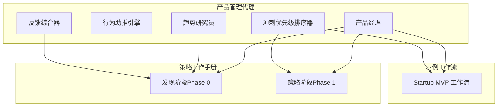
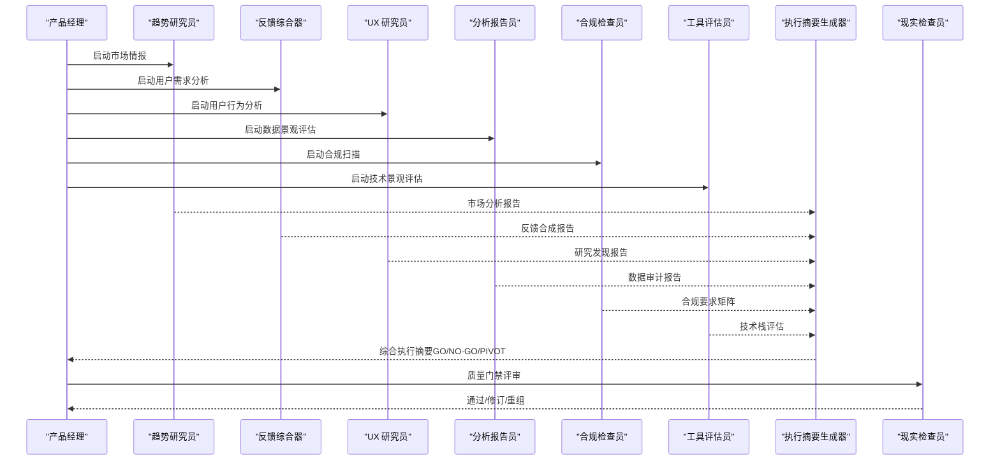
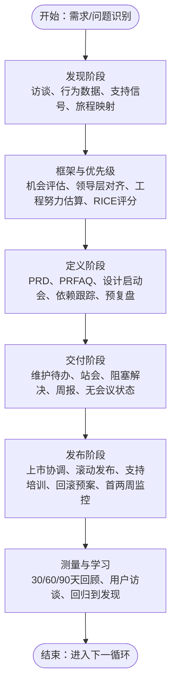
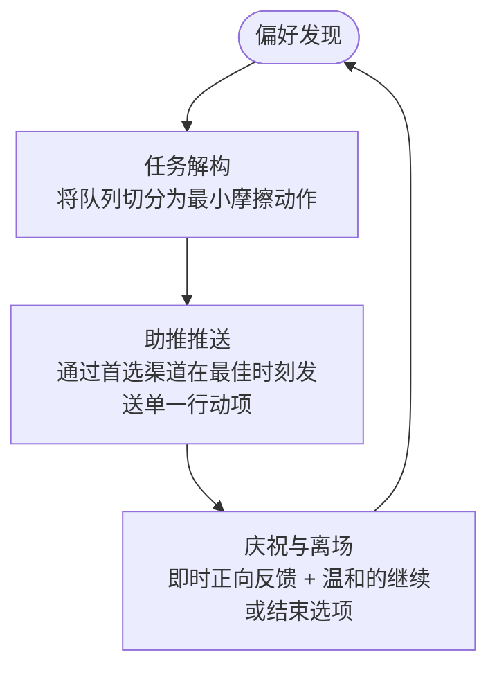
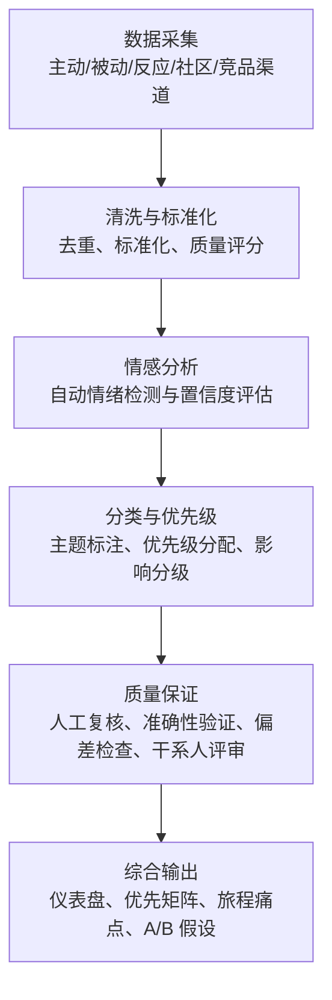
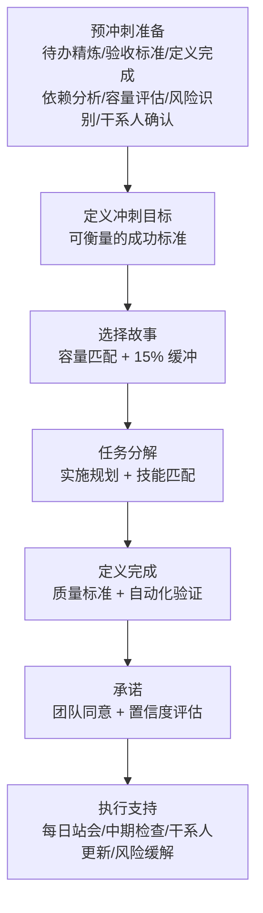
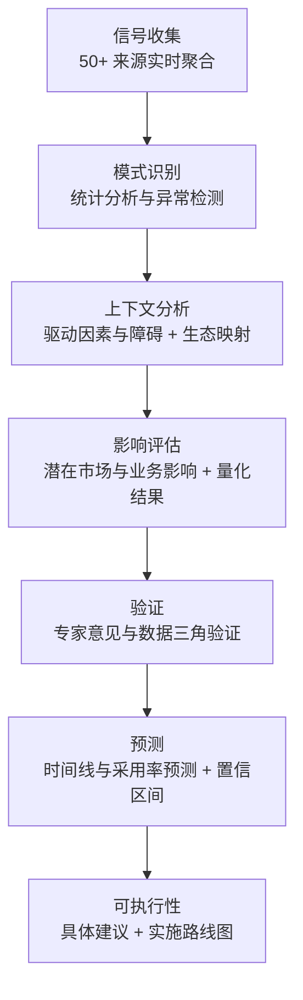
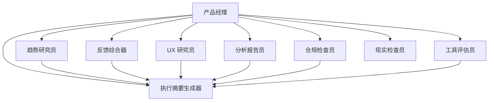

# 产品管理代理

<cite>
**本文档引用的文件**
- [product-manager.md](file://product/product-manager.md)
- [product-behavioral-nudge-engine.md](file://product/product-behavioral-nudge-engine.md)
- [product-feedback-synthesizer.md](file://product/product-feedback-synthesizer.md)
- [product-sprint-prioritizer.md](file://product/product-sprint-prioritizer.md)
- [product-trend-researcher.md](file://product/product-trend-researcher.md)
- [phase-0-discovery.md](file://strategy/playbooks/phase-0-discovery.md)
- [phase-1-strategy.md](file://strategy/playbooks/phase-1-strategy.md)
- [workflow-startup-mvp.md](file://examples/workflow-startup-mvp.md)
- [README.md](file://README.md)
</cite>

## 目录
1. [简介](#简介)
2. [项目结构](#项目结构)
3. [核心组件](#核心组件)
4. [架构总览](#架构总览)
5. [详细组件分析](#详细组件分析)
6. [依赖关系分析](#依赖关系分析)
7. [性能考量](#性能考量)
8. [故障排除指南](#故障排除指南)
9. [结论](#结论)
10. [附录](#附录)

## 简介
本文件系统化梳理产品管理代理体系，聚焦五大专业化代理：产品经理、行为助推引擎、反馈综合器、冲刺优先级排序器、趋势研究员。文档从架构设计、数据流与处理逻辑、集成点与协作机制、错误处理与性能特征等方面进行深入分析，并结合实际工作流（如发现阶段、策略阶段）与示例（MVP 工作流），帮助读者理解产品代理如何在真实业务中平衡用户需求、商业目标与技术可行性，实现从需求到交付的闭环管理。

## 项目结构
产品管理代理位于仓库的 product 目录下，配套有策略工作手册（strategy/playbooks）与示例工作流（examples）。整体组织采用“按领域分层 + 按职能分工”的方式：
- 产品领域代理：负责产品全生命周期的决策、研究与执行
- 策略工作手册：定义跨阶段的门禁与产出物，确保质量与一致性
- 示例工作流：演示多代理协同的端到端实践

图表来源
- [product-manager.md:1-470](file://product/product-manager.md#L1-L470)
- [phase-0-discovery.md:1-179](file://strategy/playbooks/phase-0-discovery.md#L1-L179)
- [phase-1-strategy.md:1-239](file://strategy/playbooks/phase-1-strategy.md#L1-L239)
- [workflow-startup-mvp.md:1-156](file://examples/workflow-startup-mvp.md#L1-L156)

章节来源
- [README.md:183-194](file://README.md#L183-L194)

## 核心组件
本节概述五大产品管理代理的核心职责、关键规则与成功度量指标，帮助快速建立对各代理能力边界与协作关系的理解。

- 产品经理（PM）
  - 专长：产品全生命周期所有权、PRD 编写、路线图规划、上市策略、结果度量
  - 决策流程：问题导向、先写新闻稿再写 PRD、明确所有路线图条目拥有者与成功指标
  - 用户研究方法：结构化问题访谈、行为数据分析、支持信号与竞争情报
  - 产品优化策略：验证驱动开发、消除模糊与范围蔓延、保护团队焦点
  - 成功度量：路线图可预测性、零意外、发现严谨性、发布准备度、周期时间、团队清晰度、健康待办项

- 行为助推引擎
  - 专长：基于行为心理学的交互设计与动机工程，降低认知负荷、提升完成率
  - 决策流程：偏好发现 → 任务解构 → 推送 → 庆祝与离场
  - 用户研究方法：个性化沟通渠道与时序偏好、默认偏见与时间盒（如番茄钟）、ADHD 友好动量构建
  - 产品优化策略：微冲刺、单一可操作下一步、即时正向反馈、可选退出路径
  - 成功度量：行动完成率、用户留存、推送点击率与价值感

- 反馈综合器
  - 专长：多渠道收集与分析用户反馈，转化为可执行的产品洞察与优先级
  - 决策流程：数据采集 → 清洗标准化 → 情感分析 → 主题归类 → 质量保证
  - 用户研究方法：主题分析、统计相关性、旅程映射、KANO、RICE 等框架
  - 产品优化策略：语音客户整合、流失预警、体验优化建议、A/B 假设生成
  - 成功度量：处理速度、主题准确率、可执行洞察比例、满意度提升、特征预测准确率

- 冲刺优先级排序器
  - 专长：敏捷冲刺规划、特性优先级与资源分配，最大化团队速度与业务价值
  - 决策流程：预冲刺准备 → 定义冲刺目标 → 选择故事 → 定义完成标准 → 执行支持
  - 用户研究方法：RICE、MoSCoW、KANO、价值-成本矩阵、风险评估
  - 产品优化策略：容量规划、依赖识别、瓶颈定位、变更管理、风险管理
  - 成功度量：冲刺完成率、团队速度稳定性、交付可预测性、技术债控制、依赖解决率

- 趋势研究员
  - 专长：新兴趋势识别、竞争分析与机会评估，提供可执行的战略洞察
  - 决策流程：信号收集 → 模式识别 → 影响评估 → 验证 → 预测 → 可执行建议
  - 用户研究方法：搜索量分析、社交媒体指标、财务数据、专利分析、专家访谈、内容分析
  - 产品优化策略：市场时机、差异化策略、技术追踪、监管情报、投资趋势
  - 成功度量：趋势预测准确率、情报新鲜度、机会量化精度、洞察交付时效、早期检测能力

章节来源
- [product-manager.md:28-470](file://product/product-manager.md#L28-L470)
- [product-behavioral-nudge-engine.md:11-81](file://product/product-behavioral-nudge-engine.md#L11-L81)
- [product-feedback-synthesizer.md:12-119](file://product/product-feedback-synthesizer.md#L12-L119)
- [product-sprint-prioritizer.md:12-154](file://product/product-sprint-prioritizer.md#L12-L154)
- [product-trend-researcher.md:12-159](file://product/product-trend-researcher.md#L12-L159)

## 架构总览
产品管理代理通过“发现 → 策略 → 架构 → 交付 → 测量”五阶段工作流串联，形成闭环。产品经理作为总协调者，贯穿各阶段；其他代理在各自专业域内提供输入与产出，最终由质量门禁（Executive Summary Generator、Reality Checker）把关。

图表来源
- [phase-0-discovery.md:17-132](file://strategy/playbooks/phase-0-discovery.md#L17-L132)
- [phase-1-strategy.md:17-202](file://strategy/playbooks/phase-1-strategy.md#L17-L202)

章节来源
- [phase-0-discovery.md:1-179](file://strategy/playbooks/phase-0-discovery.md#L1-L179)
- [phase-1-strategy.md:1-239](file://strategy/playbooks/phase-1-strategy.md#L1-L239)

## 详细组件分析

### 产品经理（PM）
- 角色定位：产品全生命周期负责人，连接业务目标、用户需求与技术现实
- 关键规则
  - 以问题为导向而非解决方案
  - 先写新闻稿再写 PRD
  - 路线图条目必须有所有者、成功指标与时间窗
  - 明确“不做什么”，并给出理由
  - 验证后再构建，发布后测量
  - 对齐不等于共识；清晰比一致更重要
  - 意外是失败；提前充分沟通
  - 范围蔓延杀死产品；记录变更请求并评估
- 技术交付物：PRD、机会评估、路线图（Now/Next/Later）、上市计划、冲刺健康快照
- 成功度量：结果交付、路线图可预测性、信任度、发现严谨性、发布准备度、范围纪律、周期时间、团队清晰度、健康待办项

图表来源
- [product-manager.md:389-436](file://product/product-manager.md#L389-L436)

章节来源
- [product-manager.md:34-470](file://product/product-manager.md#L34-L470)

### 行为助推引擎
- 角色定位：将被动仪表板转化为主动、个性化的生产力伙伴
- 关键规则
  - 不要一次性堆砌大量任务；只显示最关键的一步
  - 尊重用户的专注时段与偏好的沟通渠道
  - 总是提供“可选退出”的完成路径
  - 利用默认偏见（如“草拟了感谢回复，是否发送？”）
- 技术交付物：用户偏好模式、助推序列逻辑、微冲刺提示、庆祝/激励文案
- 成功度量：行动完成率、用户留存、推送点击率与价值感

图表来源
- [product-behavioral-nudge-engine.md:57-66](file://product/product-behavioral-nudge-engine.md#L57-L66)

章节来源
- [product-behavioral-nudge-engine.md:11-81](file://product/product-behavioral-nudge-engine.md#L11-L81)

### 反馈综合器
- 角色定位：将千言万语的用户声音提炼为前五项需要构建的要点
- 关键规则
  - 多渠道收集：调查、访谈、支持工单、评论、社交监听
  - 情感分析与主题识别，结合业务影响与努力估算
  - 输出可视化仪表盘、优先矩阵、用户旅程痛点、A/B 假设
- 技术交付物：实时反馈情感与体量趋势、Top 优先主题、客户满意度 KPI、ROI 追踪、产品团队报告、客户成功手册
- 成功度量：处理速度、主题准确率、可执行洞察比例、满意度提升、特征预测准确率、干系人参与度、趋势预警精度

图表来源
- [product-feedback-synthesizer.md:56-119](file://product/product-feedback-synthesizer.md#L56-L119)

章节来源
- [product-feedback-synthesizer.md:12-119](file://product/product-feedback-synthesizer.md#L12-L119)

### 冲刺优先级排序器
- 角色定位：通过数据驱动的优先级框架最大化团队速度与业务价值
- 关键规则
  - 使用 RICE、MoSCoW、KANO、价值-成本矩阵等框架
  - 预冲刺准备：待办精炼、依赖分析、容量评估、风险识别、干系人确认
  - 冲刺目标明确、承诺可衡量、定义完成标准
  - 执行支持：每日站会、中期检查、干系人更新、风险缓解
- 技术交付物：RICE 评分的待办清单、基于速度的冲刺分配、依赖图与关键路径、MoSCoW 分类、里程碑映射
- 成功度量：冲刺完成率、团队速度稳定性、交付可预测性、技术债控制、依赖解决率

图表来源
- [product-sprint-prioritizer.md:78-98](file://product/product-sprint-prioritizer.md#L78-L98)

章节来源
- [product-sprint-prioritizer.md:12-154](file://product/product-sprint-prioritizer.md#L12-L154)

### 趋势研究员
- 角色定位：在主流风潮之前捕捉新兴趋势，提供可执行的战略洞察
- 关键规则
  - 弱信号检测与早期趋势识别，统计验证
  - 跨行业模式分析与机会映射，竞争情报
  - 消费者行为预测与人物画像，差异化策略
  - 市场进入时机与上市策略，风险评估
  - 技术追踪与创新监测，监管情报
- 技术交付物：趋势简报、市场地图、机会评估、趋势仪表盘、深度报告、演示材料、可视化信息图、视频简报、交互仪表盘
- 成功度量：趋势预测准确率、情报新鲜度、机会量化精度、洞察交付时效、早期检测能力、来源多样性、干系人价值

图表来源
- [product-trend-researcher.md:79-88](file://product/product-trend-researcher.md#L79-L88)

章节来源
- [product-trend-researcher.md:12-159](file://product/product-trend-researcher.md#L12-L159)

## 依赖关系分析
产品管理代理之间的协作遵循“并行启动、顺序收敛”的模式。在发现阶段，产品经理协调多个代理并行工作，随后由执行摘要生成器汇总形成 GO/NO-GO 决策；在策略阶段，产品经理再次协调架构与规划，最终由现实检查员进行技术门禁。

图表来源
- [phase-0-discovery.md:17-132](file://strategy/playbooks/phase-0-discovery.md#L17-L132)
- [phase-1-strategy.md:17-202](file://strategy/playbooks/phase-1-strategy.md#L17-L202)

章节来源
- [phase-0-discovery.md:1-179](file://strategy/playbooks/phase-0-discovery.md#L1-L179)
- [phase-1-strategy.md:1-239](file://strategy/playbooks/phase-1-strategy.md#L1-L239)

## 性能考量
- 发现阶段效率
  - 并行代理启动：缩短从概念到验证的时间
  - 质量门禁：避免资源浪费在无效方向
- 策略与架构阶段
  - 严格的需求与规范转换，减少返工
  - 依赖与瓶颈的提前识别与缓解
- 交付阶段
  - 冲刺健康快照与持续反馈，保持团队节奏稳定
  - 回滚预案与监控阈值，降低发布风险
- 数据与洞察
  - 反馈综合器的自动化处理流水线，缩短洞察到行动的周期
  - 趋势研究员的早期预警系统，提前规避市场风险

## 故障排除指南
- 常见问题
  - “没有明确的‘不做什么’导致范围蔓延”
    - 解决：使用路线图“不可做”清单，公开说明原因与重新审视条件
  - “缺乏用户证据导致决策主观”
    - 解决：强制进行结构化问题访谈与行为数据分析，输出证据清单
  - “冲刺目标不明确导致交付不确定性”
    - 解决：定义可衡量的成功标准，使用速度与缓冲管理
  - “助推推送过于频繁或打扰用户”
    - 解决：个性化偏好设置、默认偏见与时间盒策略，提供可选退出
  - “趋势预测与实际脱节”
    - 解决：交叉验证、专家意见、信号强度评估与定期回顾

- 建议流程
  - 发现阶段：若证据不足，返回访谈与数据分析
  - 策略阶段：若架构不完整，补充安全与合规设计
  - 交付阶段：若阻塞未及时解决，触发升级路径与风险缓解

章节来源
- [product-manager.md:34-44](file://product/product-manager.md#L34-L44)
- [product-behavioral-nudge-engine.md:23-28](file://product/product-behavioral-nudge-engine.md#L23-L28)
- [product-sprint-prioritizer.md:128-140](file://product/product-sprint-prioritizer.md#L128-L140)
- [product-trend-researcher.md:145-159](file://product/product-trend-researcher.md#L145-L159)

## 结论
产品管理代理通过专业化分工与标准化工作流，实现了从“发现 → 策略 → 架构 → 交付 → 测量”的闭环管理。产品经理作为总协调者，确保跨职能对齐与结果导向；行为助推引擎、反馈综合器、冲刺优先级排序器与趋势研究员分别在动机工程、用户洞察、敏捷执行与市场前瞻方面提供关键支撑。配合策略工作手册与示例工作流，产品代理能够有效平衡用户需求、商业目标与技术可行性，持续优化产品决策与交付质量。

## 附录
- 产品开发生命周期管理方法
  - 需求分析：结构化问题访谈、行为数据分析、支持信号与竞争情报
  - 功能规划：机会评估、RICE 评分、MoSCoW 分类、依赖与关键路径
  - 迭代优化：冲刺健康快照、回顾与学习、回滚预案与监控
- 产品数据分析与用户行为洞察技巧
  - 多源数据融合：调查、访谈、支持工单、评论、社交监听、行为日志
  - 主题与情感分析：自动情绪检测、主题标注、统计显著性检验
  - 旅程映射与痛点识别：反馈整合、情境分析、情感强度评分
- 跨部门协作协调作用
  - 干系人对齐：明确决策、理由与角色，避免“事后惊喜”
  - 质量门禁：执行摘要与现实检查，确保交付质量与可预测性
  - 协同机制：并行启动、顺序收敛、上下文传递与证据共享

章节来源
- [workflow-startup-mvp.md:21-156](file://examples/workflow-startup-mvp.md#L21-L156)
- [phase-0-discovery.md:114-179](file://strategy/playbooks/phase-0-discovery.md#L114-L179)
- [phase-1-strategy.md:159-239](file://strategy/playbooks/phase-1-strategy.md#L159-L239)