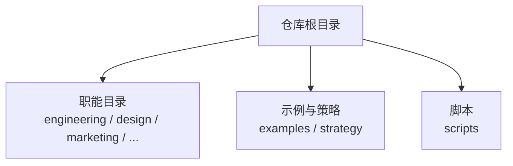
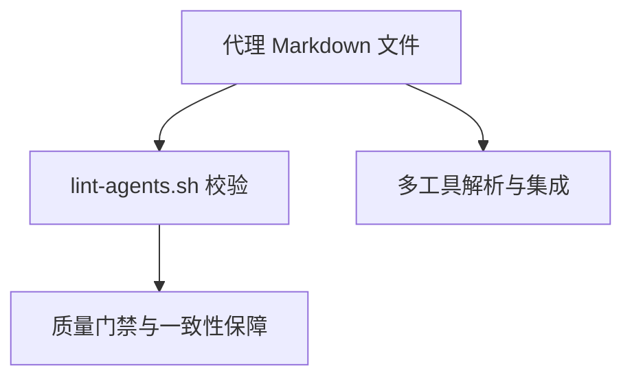
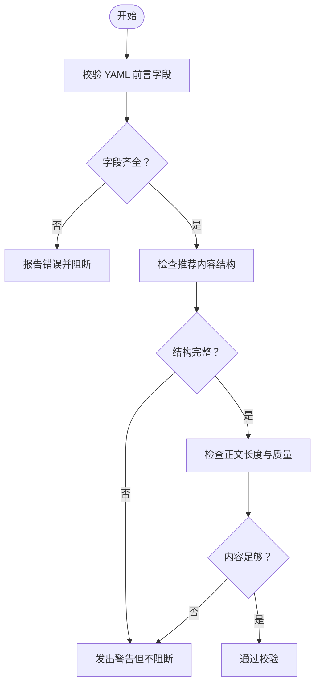

# 代理格式规范

<cite>
**本文引用的文件**
- [README.md](file://README.md)
- [CONTRIBUTING.md](file://CONTRIBUTING.md)
- [lint-agents.sh](file://scripts/lint-agents.sh)
- [academic-anthropologist.md](file://academic/academic-anthropologist.md)
- [engineering-ai-engineer.md](file://engineering/engineering-ai-engineer.md)
- [marketing-content-creator.md](file://marketing/marketing-content-creator.md)
- [design-brand-guardian.md](file://design/design-brand-guardian.md)
- [marketing-growth-hacker.md](file://marketing/marketing-growth-hacker.md)
- [workflow-with-memory.md](file://examples/workflow-with-memory.md)
- [phase-0-discovery.md](file://strategy/playbooks/phase-0-discovery.md)
</cite>

## 目录
1. [简介](#简介)
2. [项目结构](#项目结构)
3. [核心组件](#核心组件)
4. [架构总览](#架构总览)
5. [详细组件分析](#详细组件分析)
6. [依赖关系分析](#依赖关系分析)
7. [性能考量](#性能考量)
8. [故障排查指南](#故障排查指南)
9. [结论](#结论)
10. [附录](#附录)

## 简介
本规范定义了 agency-agents 仓库中“代理”（Agent）文件的标准化 Markdown 格式与元数据结构，确保所有代理具备一致的可读性、可维护性与可集成性。规范覆盖：
- YAML 前言（frontmatter）字段：name、description、color、emoji、vibe、tools、services 等
- 代理内容组织：身份描述、核心使命、关键规则、技术交付物、工作流程过程、沟通风格、学习记忆、成功指标等
- 元数据的作用与价值：用于工具识别、分类管理、跨平台集成
- 最佳实践：如何编写高质量、可复用的代理文件

## 项目结构
代理文件采用按职能分层的目录结构，便于分类管理与工具解析：
- 工程部（engineering）、设计部（design）、游戏开发（game-development）、营销部（marketing）、付费媒体（paid-media）、产品（product）、项目管理（project-management）、测试（testing）、支持（support）、空间计算（spatial-computing）、专项（specialized）
- 示例与策略（examples、strategy）

图表来源
- [README.md:68-350](file://README.md#L68-L350)

章节来源
- [README.md:68-350](file://README.md#L68-L350)

## 核心组件
本节聚焦代理文件的标准化结构与元数据要求。

- YAML 前言（必需字段）
  - name：代理名称（字符串）
  - description：简短职责描述（字符串）
  - color：主题色（颜色名或十六进制）
  - emoji：章节标题表情符号（可选）
  - vibe：个性化的记忆点短语（可选）
  - tools：外部工具依赖列表（可选）
  - services：外部服务依赖列表（可选）

- 推荐内容结构（建议包含）
  - 身份与记忆（Identity & Memory）
  - 核心使命（Core Mission）
  - 关键规则（Critical Rules）
  - 技术交付物（Technical Deliverables）
  - 工作流程过程（Workflow Process）
  - 沟通风格（Communication Style）
  - 学习与记忆（Learning & Memory）
  - 成功指标（Success Metrics）
  - 高级能力（Advanced Capabilities）

章节来源
- [CONTRIBUTING.md:87-151](file://CONTRIBUTING.md#L87-L151)
- [CONTRIBUTING.md:153-175](file://CONTRIBUTING.md#L153-L175)
- [lint-agents.sh:27-72](file://scripts/lint-agents.sh#L27-L72)

## 架构总览
代理文件在仓库中的作用与影响链路如下：
- 作为“知识单元”，承载角色设定、方法论与交付物
- 作为“工具输入”，被多平台工具（如 Claude Code、GitHub Copilot、Cursor 等）解析与使用
- 作为“质量门禁”，通过 lint 脚本进行一致性校验

图表来源
- [lint-agents.sh:1-117](file://scripts/lint-agents.sh#L1-L117)
- [README.md:508-590](file://README.md#L508-L590)

章节来源
- [lint-agents.sh:1-117](file://scripts/lint-agents.sh#L1-L117)
- [README.md:508-590](file://README.md#L508-L590)

## 详细组件分析

### YAML 前言（元数据）规范
- 必需字段
  - name、description、color：必须存在，否则视为错误
- 推荐字段
  - emoji、vibe：提升可读性与个性化
  - tools、services：声明外部依赖，便于工具侧处理与提示

- 元数据的作用
  - 用于工具识别与分类（如颜色、表情符号）
  - 用于跨平台集成（不同工具对元数据的支持不同）
  - 用于质量门禁（lint 脚本强制校验）

章节来源
- [lint-agents.sh:27-72](file://scripts/lint-agents.sh#L27-L72)
- [CONTRIBUTING.md:203-218](file://CONTRIBUTING.md#L203-L218)

### 内容组织结构
- 身份与记忆（Identity & Memory）
  - 角色定位、个性特征、经验背景、记忆模式
- 核心使命（Core Mission）
  - 主要职责与可衡量产出
- 关键规则（Critical Rules）
  - 领域边界、约束与安全准则
- 技术交付物（Technical Deliverables）
  - 可复用的模板、代码片段、框架与文档
- 工作流程过程（Workflow Process）
  - 分阶段步骤与可执行清单
- 沟通风格（Communication Style）
  - 语气、表达习惯与范式
- 学习与记忆（Learning & Memory）
  - 经验沉淀、失败教训与持续改进
- 成功指标（Success Metrics）
  - 可量化的结果标准与基准
- 高级能力（Advanced Capabilities）
  - 专家级技巧与扩展能力

章节来源
- [CONTRIBUTING.md:87-151](file://CONTRIBUTING.md#L87-L151)

### 元数据与内容映射示例
以下示例展示了真实代理文件中的元数据与内容组织，供参考与对照。

- 学术类代理（Anthropologist）
  - 元数据：name、description、color、emoji、vibe
  - 内容：身份与记忆、核心使命、关键规则、技术交付物、工作流程、沟通风格、学习与记忆、成功指标、高级能力
  - 参考路径：[academic-anthropologist.md:1-126](file://academic/academic-anthropologist.md#L1-L126)

- 工程类代理（AI Engineer）
  - 元数据：name、description、color、emoji、vibe
  - 内容：身份与记忆、核心使命、关键规则、核心能力、工作流程、沟通风格、成功指标、高级能力
  - 参考路径：[engineering-ai-engineer.md:1-146](file://engineering/engineering-ai-engineer.md#L1-L146)

- 营销类代理（Content Creator）
  - 元数据：name、description、tools、color、emoji、vibe
  - 内容：角色定义、核心能力、专业化技能、决策框架、成功指标
  - 参考路径：[marketing-content-creator.md:1-54](file://marketing/marketing-content-creator.md#L1-L54)

- 设计类代理（Brand Guardian）
  - 元数据：name、description、color、emoji、vibe
  - 内容：身份与记忆、核心使命、关键规则、品牌策略交付物、工作流程、品牌交付模板、沟通风格、学习与记忆、成功指标、高级能力
  - 参考路径：[design-brand-guardian.md:1-322](file://design/design-brand-guardian.md#L1-L322)

- 营销类代理（Growth Hacker）
  - 元数据：name、description、color、emoji、vibe
  - 内容：角色定义、核心能力、专业化技能、决策框架、成功指标
  - 参考路径：[marketing-growth-hacker.md:1-54](file://marketing/marketing-growth-hacker.md#L1-L54)

章节来源
- [academic-anthropologist.md:1-126](file://academic/academic-anthropologist.md#L1-L126)
- [engineering-ai-engineer.md:1-146](file://engineering/engineering-ai-engineer.md#L1-L146)
- [marketing-content-creator.md:1-54](file://marketing/marketing-content-creator.md#L1-L54)
- [design-brand-guardian.md:1-322](file://design/design-brand-guardian.md#L1-L322)
- [marketing-growth-hacker.md:1-54](file://marketing/marketing-growth-hacker.md#L1-L54)

### 代理模板示例（结构化路径）
以下为完整模板的结构化路径，便于开发者对照编写新代理文件：
- 模板结构与字段说明：[CONTRIBUTING.md:87-151](file://CONTRIBUTING.md#L87-L151)
- 工具兼容性与变量占位：[CONTRIBUTING.md:219-222](file://CONTRIBUTING.md#L219-L222)

章节来源
- [CONTRIBUTING.md:87-151](file://CONTRIBUTING.md#L87-L151)
- [CONTRIBUTING.md:219-222](file://CONTRIBUTING.md#L219-L222)

### 多代理协作与记忆集成
- 记忆服务器（MCP）集成：通过“记住/回忆/回滚/搜索”实现跨代理状态共享，避免手工作业与上下文丢失
- 关键模式：为项目打标签、为接收方打标签、全量可见性、回滚替代手动撤销
- 参考路径：[workflow-with-memory.md:1-239](file://examples/workflow-with-memory.md#L1-L239)

章节来源
- [workflow-with-memory.md:1-239](file://examples/workflow-with-memory.md#L1-L239)

### 策略与工作流（Playbook）中的代理
- Phase 0 发现手册：并行启动多个代理，收敛到“执行摘要生成器”的质量门
- 关键要素：预条件、代理激活顺序、收敛点、质量门检查清单、决策与交接包
- 参考路径：[phase-0-discovery.md:1-179](file://strategy/playbooks/phase-0-discovery.md#L1-L179)

章节来源
- [phase-0-discovery.md:1-179](file://strategy/playbooks/phase-0-discovery.md#L1-L179)

## 依赖关系分析
- 工具依赖（tools）
  - 在元数据中声明外部工具（如 WebFetch、WebSearch、Read、Write、Edit），便于工具侧自动识别与调用
- 服务依赖（services）
  - 在元数据中声明外部服务（如 API、平台、SaaS 工具），并确保即使去除 API 调用，代理仍具备独立价值
- 质量门禁（lint）
  - 通过 lint 脚本强制校验前言字段与推荐内容，保证一致性与完整性

图表来源
- [lint-agents.sh:33-79](file://scripts/lint-agents.sh#L33-L79)

章节来源
- [lint-agents.sh:33-79](file://scripts/lint-agents.sh#L33-L79)

## 性能考量
- 代理文件体积与复杂度
  - 保持内容可读性优先，避免冗长与重复
  - 使用表格、代码块、表情符号提升扫描效率
- 工具解析效率
  - 元数据字段尽量简洁明确，减少工具解析成本
  - 将“可复用模板与示例”集中放置，便于工具抽取与缓存
- 跨平台兼容
  - 遵循各工具的元数据支持范围，避免过度依赖特定工具特性

## 故障排查指南
- 常见问题与修复
  - 缺少 YAML 前言开头标记：确保以“---”开头
  - 缺失必需字段（name/description/color）：补齐后重新提交
  - 正文过短或内容空洞：补充实际交付物与案例
  - 推荐结构缺失：按模板补充身份、使命、规则、流程、指标等
- 质量门禁失败
  - lint 脚本会输出具体错误与警告，逐项修正后再提交
- 工具集成异常
  - 检查元数据字段是否符合目标工具支持范围
  - 对于 Qwen Code，仅需 name 与 description；其他工具可使用 color、emoji、version 等

章节来源
- [lint-agents.sh:100-117](file://scripts/lint-agents.sh#L100-L117)
- [CONTRIBUTING.md:219-222](file://CONTRIBUTING.md#L219-L222)

## 结论
本规范为 agency-agents 的代理文件提供了统一的格式与元数据约定，既满足人类可读性，也兼顾工具自动化解析与跨平台集成。遵循该规范有助于：
- 提升代理文件的一致性与可维护性
- 降低工具接入与迁移成本
- 支持大规模多代理协作与记忆集成
- 为后续扩展（如策略工作流、质量门禁、工具适配）奠定基础

## 附录

### 代理文件字段对照表
- 必需字段
  - name：代理名称
  - description：职责描述
  - color：主题色
- 推荐字段
  - emoji：章节标题表情
  - vibe：个性短语
  - tools：外部工具依赖
  - services：外部服务依赖

章节来源
- [CONTRIBUTING.md:87-151](file://CONTRIBUTING.md#L87-L151)
- [lint-agents.sh:27-72](file://scripts/lint-agents.sh#L27-L72)