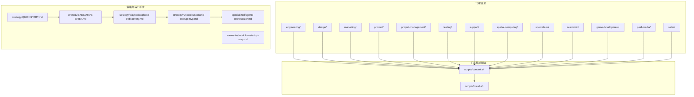
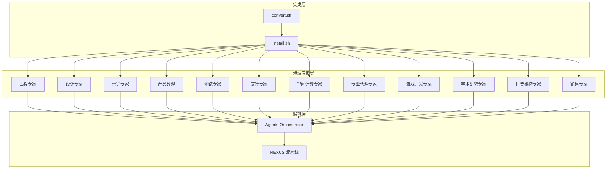
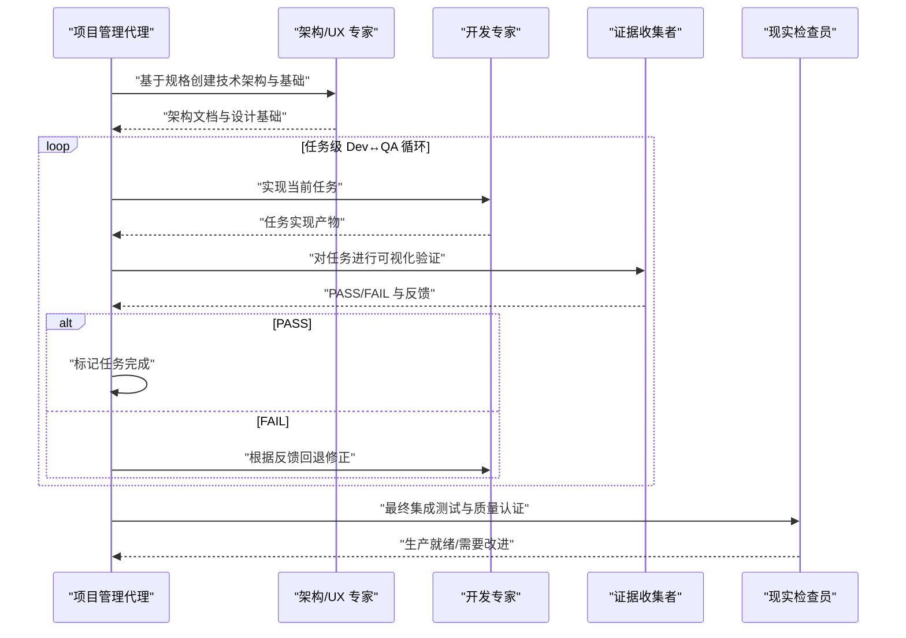
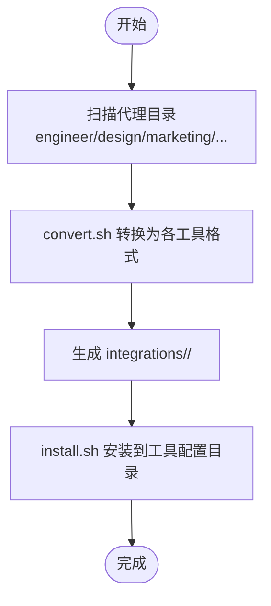

# 代理系统

<cite>
**本文引用的文件**
- [README.md](file://README.md)
- [CONTRIBUTING.md](file://CONTRIBUTING.md)
- [QUICKSTART.md](file://strategy/QUICKSTART.md)
- [EXECUTIVE-BRIEF.md](file://strategy/EXECUTIVE-BRIEF.md)
- [phase-0-discovery.md](file://strategy/playbooks/phase-0-discovery.md)
- [scenario-startup-mvp.md](file://strategy/runbooks/scenario-startup-mvp.md)
- [agents-orchestrator.md](file://specialized/agents-orchestrator.md)
- [workflow-startup-mvp.md](file://examples/workflow-startup-mvp.md)
- [install.sh](file://scripts/install.sh)
- [convert.sh](file://scripts/convert.sh)
- [engineering-frontend-developer.md](file://engineering/engineering-frontend-developer.md)
- [design-ui-designer.md](file://design/design-ui-designer.md)
- [marketing-content-creator.md](file://marketing/marketing-content-creator.md)
- [product-manager.md](file://product/product-manager.md)
- [testing-evidence-collector.md](file://testing/testing-evidence-collector.md)
</cite>

## 目录
1. [简介](#简介)
2. [项目结构](#项目结构)
3. [核心组件](#核心组件)
4. [架构总览](#架构总览)
5. [详细组件分析](#详细组件分析)
6. [依赖关系分析](#依赖关系分析)
7. [性能考量](#性能考量)
8. [故障排查指南](#故障排查指南)
9. [结论](#结论)
10. [附录](#附录)

## 简介
本文件系统化阐述 agency-agents 的代理系统：从代理的定义与分类、标准化格式规范，到跨领域的协作机制与生命周期管理。该系统以“强个性、可交付、可度量、可复用”的代理为核心，围绕 12 个专业领域构建专家级能力，并通过 NEXUS 协调框架实现多代理流水线的自动化编排与质量门禁。

## 项目结构
- 代理文件按领域分目录存放，每个代理为一个标准 Markdown 文件，包含 YAML 前言（name/description/color/emoji/vibe/services）与若干章节（身份与记忆、使命、规则、技术交付物、工作流、沟通风格、学习与记忆、成功指标、高级能力等）。
- 策略与运行手册位于 strategy 目录，提供 NEXUS 模式、阶段手册、场景化运行书与快速上手指南。
- scripts 提供工具转换与安装脚本，支持多工具生态（Claude Code、GitHub Copilot、Antigravity、Gemini CLI、OpenCode、Cursor、Aider、Windsurf、OpenClaw、Qwen Code、Kimi Code）。

图表来源
- [README.md:68-416](file://README.md#L68-L416)
- [QUICKSTART.md:1-195](file://strategy/QUICKSTART.md#L1-L195)
- [EXECUTIVE-BRIEF.md:68-96](file://strategy/EXECUTIVE-BRIEF.md#L68-L96)
- [convert.sh:64-67](file://scripts/convert.sh#L64-L67)
- [install.sh:104-104](file://scripts/install.sh#L104-L104)

章节来源
- [README.md:68-416](file://README.md#L68-L416)
- [QUICKSTART.md:1-195](file://strategy/QUICKSTART.md#L1-L195)
- [EXECUTIVE-BRIEF.md:68-96](file://strategy/EXECUTIVE-BRIEF.md#L68-L96)
- [convert.sh:64-67](file://scripts/convert.sh#L64-L67)
- [install.sh:104-104](file://scripts/install.sh#L104-L104)

## 核心组件
- 代理文件结构（标准化 Markdown）
  - 前言字段：name、description、color、emoji、vibe、services（可选）
  - 结构化章节：身份与记忆、核心使命、关键规则、技术交付物、工作流过程、沟通风格、学习与记忆、成功指标、高级能力
- 工具集成与安装
  - convert.sh 将标准代理转换为各工具所需的格式（如 SKILL.md、.mdc、.yaml 等）
  - install.sh 将转换后的文件安装到各工具的本地配置目录
- 协调与编排
  - Agents Orchestrator：自动化的流水线编排器，执行 PM→架构→[开发↔测试循环]→集成验证，严格的质量门禁与重试机制
  - NEXUS：统一的多阶段、多模式（Full/Sprint/Micro）流水线，明确阶段边界、证据要求与决策点

章节来源
- [CONTRIBUTING.md:81-175](file://CONTRIBUTING.md#L81-L175)
- [CONTRIBUTING.md:176-240](file://CONTRIBUTING.md#L176-L240)
- [agents-orchestrator.md:19-53](file://specialized/agents-orchestrator.md#L19-L53)
- [QUICKSTART.md:21-121](file://strategy/QUICKSTART.md#L21-L121)

## 架构总览
代理系统采用“领域专家 + 统一编排 + 多工具集成”的三层架构：
- 领域专家层：12 个专业领域（工程、设计、营销、产品、项目管理、销售、测试、支持、空间计算、专业代理、游戏开发、学术研究）各自拥有资深代理，覆盖从创意到落地的全链路能力
- 编排层：NEXUS 与 Agents Orchestrator 提供跨代理的上下文传递、质量门禁、重试与升级机制
- 集成层：convert.sh/install.sh 将标准代理无缝适配到多工具生态

图表来源
- [README.md:68-416](file://README.md#L68-L416)
- [agents-orchestrator.md:19-53](file://specialized/agents-orchestrator.md#L19-L53)
- [QUICKSTART.md:21-121](file://strategy/QUICKSTART.md#L21-L121)
- [convert.sh:10-25](file://scripts/convert.sh#L10-L25)
- [install.sh:9-31](file://scripts/install.sh#L9-L31)

## 详细组件分析

### 代理格式规范与最佳实践
- 标准化 Markdown 结构
  - 前言字段：name、description、color、emoji、vibe、services（可选）
  - 结构化章节：身份与记忆、核心使命、关键规则、技术交付物、工作流过程、沟通风格、学习与记忆、成功指标、高级能力
- 设计原则
  - 强个性：避免通用模板，强调独特声音与风格
  - 可交付：提供具体代码示例、模板与框架
  - 可度量：设定量化指标与基准
  - 可复用：步骤化流程与可迭代的“学习与记忆”
- 外部服务声明
  - 若代理依赖外部服务，需在前言中声明 services 字段；同时保证无服务时仍具备可用性与指导价值

章节来源
- [CONTRIBUTING.md:81-175](file://CONTRIBUTING.md#L81-L175)
- [CONTRIBUTING.md:176-240](file://CONTRIBUTING.md#L176-L240)
- [CONTRIBUTING.md:203-218](file://CONTRIBUTING.md#L203-L218)

### 12 个专业领域与代理能力矩阵
- 工程（软件开发、架构、运维、安全、AI 数据管线、嵌入式、威胁检测、移动开发、数据库优化、Git 工作流、软件架构、SRE、AI 数据修复、CMS 开发、飞书集成、微信小程序、代码评审、DevOps 自动化）
- 设计（UI 设计、UX 研究、品牌守护者、视觉故事、奇思注入、图像提示工程、包容性视觉）
- 营销（增长黑客、内容创作、社交媒体策略、短视频编辑、SEO、视频优化、私域运营、直播电商、播客、AI 引用策略、中国本土化、跨境电商、微博、抖音、小红书、知乎、B 站、百度 SEO、跨平台社交、LinkedIn 内容、微博、WeChat 公众号、Reddit 社区建设、TikTok、Instagram、Twitter、Douyin、Kuaishou、Xiaohongshu、Zhihu、Bilibili、WeChat Official Account、Weibo、SEO、视频优化）
- 产品（产品管理、趋势研究、反馈合成、行为助推引擎、冲刺优先级）
- 项目管理（项目牧羊人、工作室制作人、工作室运营、实验追踪、高级项目经理、Jira 工作流守护者）
- 销售（销售教练、销售工程师、出站策略师、发现教练、交易策略师、销售管道分析师、提案策略师、账户策略师）
- 测试（证据收集者、现实检查员、测试结果分析、性能基准、API 测试、工具评估、工作流优化、无障碍审计）
- 支持（支持响应者、分析报告员、财务跟踪员、基础设施维护者、法律合规检查员、高管摘要生成器）
- 空间计算（XR 接口架构、macOS 空间/Metal 工程、XR 沉浸式开发者、XR 鸱鸮交互专家、visionOS 空间工程师、终端集成专家）
- 专业代理（代理编排器、LSP/索引工程师、销售数据提取、数据整合、报告分发、代理身份与信任、身份图操作、应付账款、区块链安全审计、合规审计、文化智能战略、开发者倡导者、模型 QA、知识管理、MCP 构建、文档生成、自动化治理、企业培训、政府数字化预售顾问、医疗营销合规、招聘专员、留学顾问、供应链策略、工作流架构、Salesforce 架构、法国咨询市场导航、韩国商务导航、土木工程师）
- 游戏开发（跨引擎通用：游戏设计师、关卡设计师、技术美术、游戏音频工程师、叙事设计师；Unity：架构师、着色器艺术家、多人工程师、编辑器工具开发者；Unreal：系统工程师、技术美术、多人架构师、世界构建者；Godot：玩法脚本、多人工程师、着色器开发者；Blender：插件工程师；Roblox：系统脚本、体验设计师、角色创作者）
- 学术研究（人类学、地理学、历史学、叙事学、心理学）

章节来源
- [README.md:70-350](file://README.md#L70-L350)

### 代理协作模式与质量门禁
- 并行与串行结合：Discovery 阶段多代理并行收集情报，收敛后由 Executive Summary Generator 输出 GO/NO-GO 决策
- Dev↔QA 循环：每个任务完成即进入 QA 验证，失败最多重试 3 次，随后升级处理
- 证据驱动：Reality Checker 默认“需要改进”，必须提供截图、测试结果等实证材料
- 手工交接：代理之间不共享记忆，每次交接必须附带前序输出作为上下文

章节来源
- [phase-0-discovery.md:17-144](file://strategy/playbooks/phase-0-discovery.md#L17-L144)
- [agents-orchestrator.md:110-168](file://specialized/agents-orchestrator.md#L110-L168)
- [testing-evidence-collector.md:19-118](file://testing/testing-evidence-collector.md#L19-L118)

### 生命周期管理（从创建到部署与维护）
- 创建
  - 使用模板结构编写代理，确保有明确的身份、使命、规则、交付物、流程、指标与高级能力
  - 在对应领域目录下提交 PR，遵循贡献指南与风格要求
- 测试
  - 在真实场景中使用代理，记录问题与改进建议，补充示例与指标
- 部署
  - 运行 convert.sh 生成各工具所需格式，再用 install.sh 安装到本地工具目录
- 维护
  - 基于用户反馈与新实践持续迭代，保持流程与指标更新

章节来源
- [CONTRIBUTING.md:27-78](file://CONTRIBUTING.md#L27-L78)
- [CONTRIBUTING.md:242-294](file://CONTRIBUTING.md#L242-L294)
- [convert.sh:9-25](file://scripts/convert.sh#L9-L25)
- [install.sh:9-31](file://scripts/install.sh#L9-L31)

### API/服务组件：代理编排与工具集成

#### 代理编排序列图

图表来源
- [agents-orchestrator.md:53-109](file://specialized/agents-orchestrator.md#L53-L109)
- [agents-orchestrator.md:110-168](file://specialized/agents-orchestrator.md#L110-L168)
- [testing-evidence-collector.md:19-118](file://testing/testing-evidence-collector.md#L19-L118)

#### 工具转换与安装流程图

图表来源
- [convert.sh:480-517](file://scripts/convert.sh#L480-L517)
- [install.sh:515-637](file://scripts/install.sh#L515-L637)

### 领域代理示例与能力剖析

#### 工程：前端专家
- 专业技能：现代 Web 技术栈、React/Vue/Angular 实现、性能优化（Core Web Vitals）、可访问性（WCAG AA）、PWA、测试与 CI/CD
- 适用场景：现代 Web 应用、像素级 UI 实现、性能与可访问性优先的项目
- 协作模式：与 UX Architect/Brand Guardian 协作完成设计到实现的端到端交付

章节来源
- [engineering-frontend-developer.md:13-225](file://engineering/engineering-frontend-developer.md#L13-L225)

#### 设计：UI 设计专家
- 专业技能：设计系统、组件库、响应式设计、可访问性、开发者交稿与 QA 流程
- 适用场景：需要一致、可扩展、可维护的设计体系
- 协作模式：与前端专家对接，确保设计到代码的高保真落地

章节来源
- [design-ui-designer.md:13-383](file://design/design-ui-designer.md#L13-L383)

#### 营销：内容创作者
- 专业技能：多平台内容策略、品牌叙事、SEO、视频脚本、播客策划、内容分发与分析
- 适用场景：品牌影响力提升、用户增长与社区建设
- 协作模式：与社交媒体策略师、增长黑客协同，形成跨渠道内容矩阵

章节来源
- [marketing-content-creator.md:12-54](file://marketing/marketing-content-creator.md#L12-L54)

#### 产品：产品经理
- 专业技能：PRD/机会评估/路线图/发布计划/健康快照/用户旅程/数据驱动决策
- 适用场景：从发现到发布的全生命周期管理
- 协作模式：与工程、设计、市场、销售、支持紧密协作，确保目标一致与交付质量

章节来源
- [product-manager.md:12-470](file://product/product-manager.md#L12-L470)

#### 测试：证据收集者
- 专业技能：截图驱动 QA、交互元素验证、移动端响应式测试、规范匹配、自动失败触发
- 适用场景：任何需要实证验证与质量门禁的交付环节
- 协作模式：贯穿 Dev↔QA 循环，作为最终质量权威

章节来源
- [testing-evidence-collector.md:13-211](file://testing/testing-evidence-collector.md#L13-L211)

### NEXUS 场景化运行（Startup MVP）
- 团队构成：代理编排器、高级项目经理、冲刺优先级、UX 架构师、前端/后端/DevOps、证据收集者、现实检查员、增长黑客、内容创作者等
- 执行路径：压缩发现→架构→核心功能构建→打磨与上线→启动与优化
- 关键决策点：概念走查、架构审批、功能范围、生产就绪、启动时机
- 成功指标：按时交付、核心功能完成、首用户上线、系统可用性、早期反馈收集

章节来源
- [scenario-startup-mvp.md:7-155](file://strategy/runbooks/scenario-startup-mvp.md#L7-L155)
- [workflow-startup-mvp.md:21-156](file://examples/workflow-startup-mvp.md#L21-L156)

## 依赖关系分析
- 代理文件依赖工具转换脚本生成的中间格式，再由安装脚本写入工具配置目录
- 编排器依赖各领域代理的明确交付物与上下文传递，确保任务级 QA 循环稳定运行
- 策略手册与运行书为实际项目提供可复制的模板与检查清单

图表来源
- [convert.sh:480-517](file://scripts/convert.sh#L480-L517)
- [install.sh:515-637](file://scripts/install.sh#L515-L637)
- [agents-orchestrator.md:53-109](file://specialized/agents-orchestrator.md#L53-L109)
- [phase-0-discovery.md:17-144](file://strategy/playbooks/phase-0-discovery.md#L17-L144)
- [scenario-startup-mvp.md:7-155](file://strategy/runbooks/scenario-startup-mvp.md#L7-L155)

章节来源
- [convert.sh:480-517](file://scripts/convert.sh#L480-L517)
- [install.sh:515-637](file://scripts/install.sh#L515-L637)
- [agents-orchestrator.md:53-109](file://specialized/agents-orchestrator.md#L53-L109)
- [phase-0-discovery.md:17-144](file://strategy/playbooks/phase-0-discovery.md#L17-L144)
- [scenario-startup-mvp.md:7-155](file://strategy/runbooks/scenario-startup-mvp.md#L7-L155)

## 性能考量
- 质量门禁前置：在任务级引入 QA，减少后期返工与缺陷逃逸
- 并行采集与并行构建：Discovery 阶段多代理并行，缩短信息收集周期
- 自动化重试与升级：最大 3 次重试，超限后升级处理，避免阻塞
- 工具链自动化：convert.sh/install.sh 减少手工配置成本，提升一致性与可重复性

## 故障排查指南
- 证据不足导致 QA 失败
  - 现象：证据收集者判定“需要改进”或“未提供截图/证据”
  - 处理：提供截图、测试结果、对比规范与实现差异
- 规范与实现不一致
  - 现象：证据收集者指出“规格未实现/声称与截图不符”
  - 处理：对照原始规格逐项核验，修正实现并重新提交
- 代理安装失败或找不到工具
  - 现象：install.sh 无法识别工具或安装失败
  - 处理：确认工具已安装且路径存在；使用 --tool 指定工具；必要时 --no-interactive 非交互安装
- 转换产物缺失
  - 现象：integrations/ 下缺少某工具文件
  - 处理：先运行 convert.sh，再运行 install.sh；检查代理是否包含 YAML 前言

章节来源
- [testing-evidence-collector.md:100-118](file://testing/testing-evidence-collector.md#L100-L118)
- [install.sh:125-131](file://scripts/install.sh#L125-L131)
- [install.sh:534-535](file://scripts/install.sh#L534-L535)
- [convert.sh:538-544](file://scripts/convert.sh#L538-L544)

## 结论
agency-agents 通过标准化的代理格式、严谨的工作流与质量门禁、以及 NEXUS 编排框架，实现了从创意到交付的一体化专家系统。12 个专业领域覆盖了现代产品开发与运营的关键环节，配合多工具生态的无缝集成，既保证了可扩展性，也确保了可维护性与可复用性。建议在团队内推广 NEXUS 模式，以证据驱动的质量门禁与 Dev↔QA 循环加速交付并降低风险。

## 附录
- 快速开始
  - 使用工具：直接复制代理到工具目录（Claude Code、GitHub Copilot），或通过 convert.sh/install.sh 安装到多工具生态
  - 启动 NEXUS：参考 QUICKSTART 选择 Full/Sprint/Micro 模式，按阶段手册与运行书执行
- 贡献指南
  - 新增代理：遵循模板结构，提供具体示例与指标，提交 PR
  - 改进现有代理：补充真实案例、增强示例、更新指标与流程

章节来源
- [README.md:25-80](file://README.md#L25-L80)
- [QUICKSTART.md:11-121](file://strategy/QUICKSTART.md#L11-L121)
- [CONTRIBUTING.md:27-78](file://CONTRIBUTING.md#L27-L78)