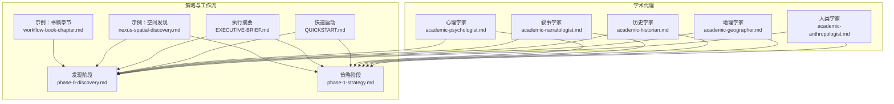
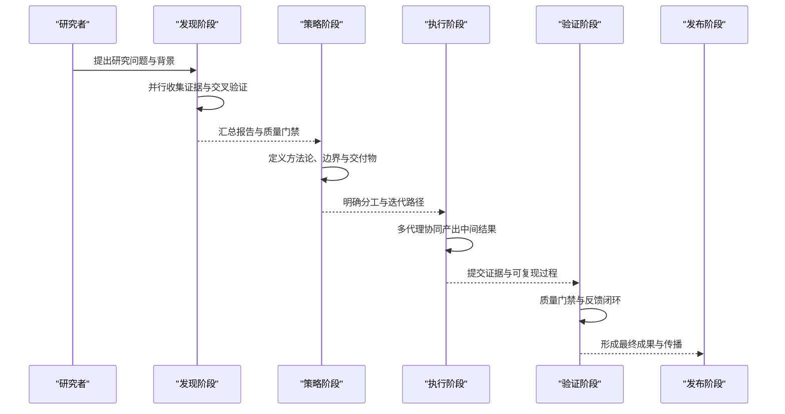
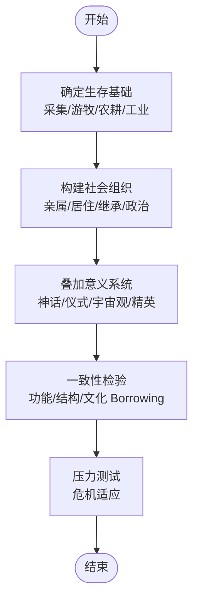
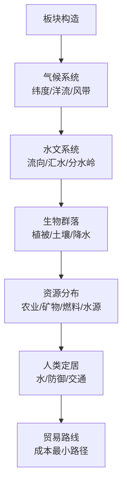
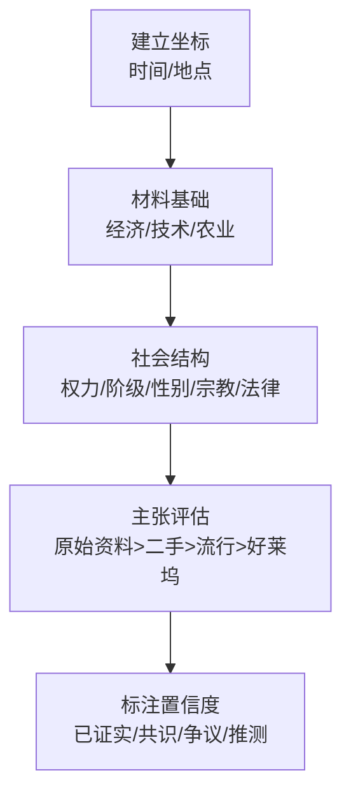
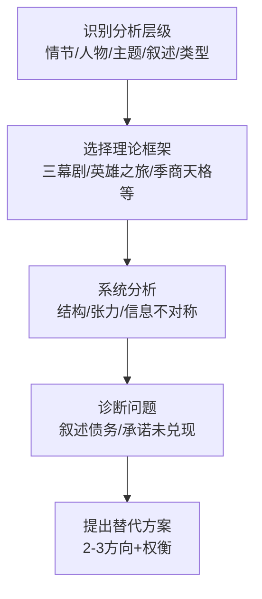
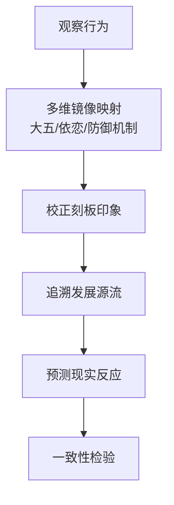
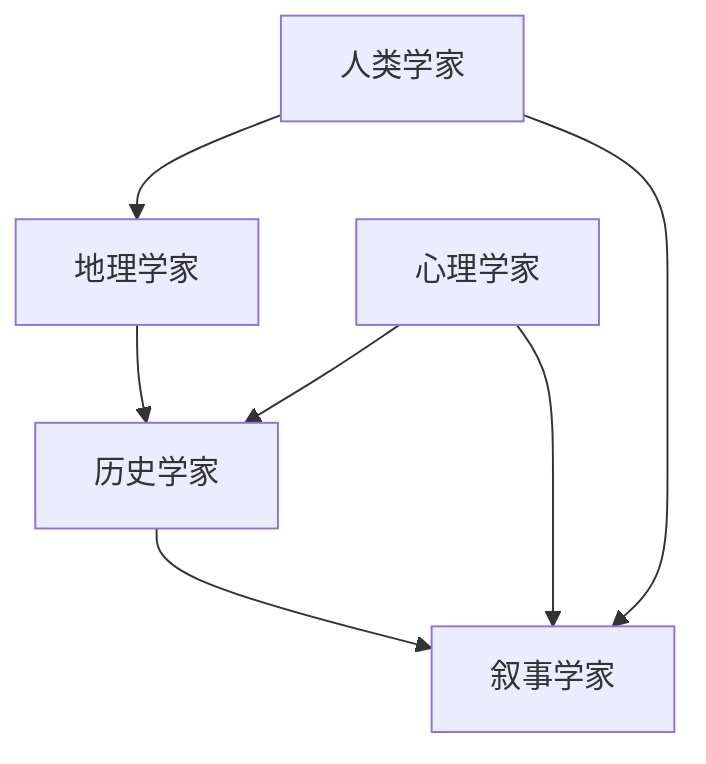

# 学术研究代理

<cite>
**本文档引用的文件**
- [academic-anthropologist.md](file://academic/academic-anthropologist.md)
- [academic-geographer.md](file://academic/academic-geographer.md)
- [academic-historian.md](file://academic/academic-historian.md)
- [academic-narratologist.md](file://academic/academic-narratologist.md)
- [academic-psychologist.md](file://academic/academic-psychologist.md)
- [phase-0-discovery.md](file://strategy/playbooks/phase-0-discovery.md)
- [phase-1-strategy.md](file://strategy/playbooks/phase-1-strategy.md)
- [QUICKSTART.md](file://strategy/QUICKSTART.md)
- [EXECUTIVE-BRIEF.md](file://strategy/EXECUTIVE-BRIEF.md)
- [nexus-spatial-discovery.md](file://examples/nexus-spatial-discovery.md)
- [workflow-book-chapter.md](file://examples/workflow-book-chapter.md)
- [README.md](file://README.md)
</cite>

## 目录
1. [简介](#简介)
2. [项目结构](#项目结构)
3. [核心组件](#核心组件)
4. [架构总览](#架构总览)
5. [详细组件分析](#详细组件分析)
6. [依赖关系分析](#依赖关系分析)
7. [性能考量](#性能考量)
8. [故障排除指南](#故障排除指南)
9. [结论](#结论)
10. [附录](#附录)

## 简介
本文件系统化梳理“学术研究代理”体系，围绕五个专业化学术代理（人类学家、地理学家、历史学家、叙事学家、心理学家）展开，阐述其研究专长、方法论与理论框架，以及在各自学科领域提供的深度洞察与专业分析能力。同时，结合该仓库中成熟的多代理协作策略与工作流，给出学术研究的标准流程（文献综述、理论构建、实证分析、成果发表），并展示跨学科研究的方法与工具，以促进不同学术领域的融合与创新。最后，强调学术代理在知识创造与社会发展中的作用。

## 项目结构
学术研究代理位于仓库的“学术”（academic）目录下，每个代理均以独立的 Markdown 文件呈现，包含身份设定、使命目标、关键规则、技术交付物、工作流程、沟通风格、学习记忆机制与成功度量指标等模块。这些文件共同构成一个可复用、可组合的“学术智能体”集合，既可单独使用，也可与其他代理协同完成复杂研究任务。

图表来源
- [academic-anthropologist.md:1-126](file://academic/academic-anthropologist.md#L1-L126)
- [academic-geographer.md:1-128](file://academic/academic-geographer.md#L1-L128)
- [academic-historian.md:1-124](file://academic/academic-historian.md#L1-L124)
- [academic-narratologist.md:1-119](file://academic/academic-narratologist.md#L1-L119)
- [academic-psychologist.md:1-119](file://academic/academic-psychologist.md#L1-L119)
- [phase-0-discovery.md:1-179](file://strategy/playbooks/phase-0-discovery.md#L1-L179)
- [phase-1-strategy.md:1-239](file://strategy/playbooks/phase-1-strategy.md#L1-L239)
- [QUICKSTART.md:1-195](file://strategy/QUICKSTART.md#L1-L195)
- [EXECUTIVE-BRIEF.md:1-96](file://strategy/EXECUTIVE-BRIEF.md#L1-L96)
- [nexus-spatial-discovery.md:1-853](file://examples/nexus-spatial-discovery.md#L1-L853)
- [workflow-book-chapter.md:1-56](file://examples/workflow-book-chapter.md#L1-L56)

章节来源
- [README.md:338-349](file://README.md#L338-L349)

## 核心组件
本节对五个学术代理进行深入剖析，涵盖其身份设定、核心使命、关键规则、技术交付物、工作流程与成功度量。

- 人类学家（Anthropologist）
  - 专长：文化系统、亲属关系、仪式、信仰体系；通过田野调查思维构建“活的文化”
  - 方法论：结构主义、功能主义、象征人类学、实践理论、亲属制度、仪式分析、经济人类学
  - 分析工具：功能分析、厚描述、礼物经济设计、阈限与共同体、文化生态学
  - 成功度量：文化元素具备社会功能、亲属与社会组织内部一致、有真实民族志平行参照、避免乌托邦式文化

- 地理学家（Geographer）
  - 专长：自然地理、人文地理、气候系统、制图与空间分析；构建“地理上自洽”的世界
  - 方法论：柯本气候分类、板块构造、水文学、中心地理论、心脏地带理论、世界体系理论
  - 分析工具：地貌成因、水系逻辑、山川定位、海岸线与洋流、环境决定论批判
  - 成功度量：气候—地形—生物群落—资源—定居点—贸易的物理一致性

- 历史学家（Historian）
  - 专长：历史分析、分期、物质文化与史料学；验证历史自洽性并以实证细节充实情境
  - 方法论：年鉴学派、微观史、长时段、后殖民史、档案研究方法、比较史
  - 分析工具：材料文化重建、日常生活的质感、反欧洲中心主义、避免历史倒置
  - 成功度量：声明具备置信度与来源类型、无时代错置、物质文化基于考古与史料证据、非西方历史纳入主动态

- 叙事学家（Narratologist）
  - 专长：叙事理论、故事结构、人物弧线、文学分析；以经典框架指导创作与改进
  - 方法论：俄语形式主义、法国结构主义、认知叙事学、类型学、剧本结构、互动叙事
  - 分析工具：控制思想/前提、三幕剧/五幕剧/季商天格、张力曲线、信息不对称、叙述债务
  - 成功度量：每条建议均有理论依据、人物弧线清晰、节奏张力明确、主题与控制思想一致

- 心理学家（Psychologist）
  - 专长：人格理论、动机、认知模式；以临床与研究框架构建心理可信的角色与互动
  - 方法论：大五、依恋理论、CBT认知扭曲、精神分析防御机制、社会心理学
  - 分析工具：心理画像、关系动力学、创伤反应谱、群体心理、跨文化心理
  - 成功度量：观察—诊断—映射的顺序、避免标签化、考虑文化背景、承认不确定性

章节来源
- [academic-anthropologist.md:9-126](file://academic/academic-anthropologist.md#L9-L126)
- [academic-geographer.md:9-128](file://academic/academic-geographer.md#L9-L128)
- [academic-historian.md:9-124](file://academic/academic-historian.md#L9-L124)
- [academic-narratologist.md:9-119](file://academic/academic-narratologist.md#L9-L119)
- [academic-psychologist.md:9-119](file://academic/academic-psychologist.md#L9-L119)

## 架构总览
学术研究代理遵循“发现—策略—执行—验证—发布”的完整生命周期，与多代理协作体系相契合。下图展示了学术代理在整体策略中的位置与交互方式。

图表来源
- [phase-0-discovery.md:1-179](file://strategy/playbooks/phase-0-discovery.md#L1-L179)
- [phase-1-strategy.md:1-239](file://strategy/playbooks/phase-1-strategy.md#L1-L239)
- [QUICKSTART.md:21-42](file://strategy/QUICKSTART.md#L21-L42)
- [EXECUTIVE-BRIEF.md:1-96](file://strategy/EXECUTIVE-BRIEF.md#L1-L96)

## 详细组件分析

### 人类学家代理分析
- 角色定位：文化人类学专家，以“问题解决”视角审视文化实践，强调功能与意义的统一
- 关键规则：
  - 文化拼盘不可取；需理解元素原生语境与交互
  - 功能优先于美学；先问“做什么”，再问“看起来如何”
  - 亲属是基础设施；不可跳过
  - 反对“高贵野蛮人”；前工业社会并非更“纯真”
  - 以族内视角（emic）优先
- 技术交付物：
  - 文化系统分析模板
  - 文化一致性检查模板
- 工作流程：从生存基础出发，构建社会组织，叠加意义系统，检验一致性与张力
- 成功度量：功能明确、亲属一致、有真实民族志平行参照、避免乌托邦

图表来源
- [academic-anthropologist.md:93-99](file://academic/academic-anthropologist.md#L93-L99)

章节来源
- [academic-anthropologist.md:13-126](file://academic/academic-anthropologist.md#L13-L126)

### 地理学家代理分析
- 角色定位：自然与人文地理专家，关注景观如何塑造文明
- 关键规则：
  - 河流不“分叉”；例外需特殊说明
  - 气候是系统；雨影、季风、纬度决定季节
  - 地理非装饰；每处山川都有人地后果
  - 反对地理决定论；承认能动性
  - 尺度重要；小王国与大帝国需求不同
- 技术交付物：
  - 地理一致性报告
  - 气候系统设计模板
- 工作流程：从板块构造出发，按第一性原理构建气候—水文—生物群落—资源—定居—贸易的链条
- 成功度量：气候遵循大气环流逻辑、水系符合水文学、定居点有地理依据、资源分布符合地质学

图表来源
- [academic-geographer.md:95-101](file://academic/academic-geographer.md#L95-L101)

章节来源
- [academic-geographer.md:13-128](file://academic/academic-geographer.md#L13-L128)

### 历史学家代理分析
- 角色定位：研究型历史学家，系统思维与严谨方法
- 关键规则：
  - 名列来源与局限；“中世纪”需具体到何时何地
  - 反对欧洲中心主义；主动纳入非西方历史
  - 材料条件优先；先经济再政治
  - 避免历史倒置；以当代理解构现代标准
- 技术交付物：
  - 时期真实性报告
  - 历史一致性检查模板
- 工作流程：建立坐标（时间/地点），先材料基础，再社会结构，然后以史料核验主张，标注置信度
- 成功度量：声明具备置信度与来源类型、无时代错置、材料文化基于证据、非西方历史纳入主动态

图表来源
- [academic-historian.md:91-97](file://academic/academic-historian.md#L91-L97)

章节来源
- [academic-historian.md:13-124](file://academic/academic-historian.md#L13-L124)

### 叙事学家代理分析
- 角色定位：叙事理论专家，以框架精确分析与改进故事结构
- 关键规则：
  - 不给空泛建议；必须引用至少一个理论框架
  - 结构问题在“讲述”层面（情节与叙述），而非“故事”层面
  - 先尊重惯例再进行有据的颠覆
- 技术交付物：
  - 故事结构分析
  - 人物弧评估
- 工作流程：识别分析层级→选择合适框架→系统分析→诊断后再建议→提出2-3方向及权衡
- 成功度量：每条建议引用框架、人物弧线清晰、节奏张力明确、主题与控制思想一致

图表来源
- [academic-narratologist.md:87-93](file://academic/academic-narratologist.md#L87-L93)

章节来源
- [academic-narratologist.md:13-119](file://academic/academic-narratologist.md#L13-L119)

### 心理学家代理分析
- 角色定位：临床与研究心理学家，关注行为背后的动机与认知
- 关键规则：
  - 不以诊断简化人物；避免“贴标签”
  - 区分流行心理学与实证心理学
  - 考虑文化背景；依恋理论源于特定文化
  - 创伤反应多样；避免刻板印象
- 技术交付物：
  - 心理画像
  - 关系动力学分析
- 工作流程：先观察行为→用多维镜像映射→校正刻板印象→追溯发展源流→预测现实反应
- 成功度量：以理论为依据的观察、画像包含适应与病态模式、关系动力明确触发点、文化与局限被诚实说明

图表来源
- [academic-psychologist.md:87-93](file://academic/academic-psychologist.md#L87-L93)

章节来源
- [academic-psychologist.md:13-119](file://academic/academic-psychologist.md#L13-L119)

## 依赖关系分析
学术代理之间存在互补与依赖关系，典型表现为：
- 人类学与地理学：前者提供文化—社会结构，后者提供地形—气候—资源—定居的物理约束，二者共同决定文明形态
- 历史学与叙事学：历史学提供事实与背景，叙事学提供结构与张力，二者共同提升作品的历史厚度与可读性
- 心理学与叙事学：心理学提供角色动机与关系动力，叙事学提供结构与节奏，二者共同增强人物可信度与情感共鸣
- 地理学与历史学：地理学提供“可能性边界”，历史学提供“实际路径”，二者共同决定历史事件的可发生性与影响

图表来源
- [academic-anthropologist.md:21-38](file://academic/academic-anthropologist.md#L21-L38)
- [academic-geographer.md:21-38](file://academic/academic-geographer.md#L21-L38)
- [academic-historian.md:21-38](file://academic/academic-historian.md#L21-L38)
- [academic-narratologist.md:21-40](file://academic/academic-narratologist.md#L21-L40)
- [academic-psychologist.md:21-38](file://academic/academic-psychologist.md#L21-L38)

## 性能考量
- 多代理并行：在发现阶段，多个学术代理可并行输出，缩短周期并提高覆盖面
- 质量门禁：在策略与验证阶段设置证据要求与质量门禁，减少返工与缺陷进入生产
- 迭代闭环：采用“构建—测试—通过/失败—重试（最多3次）”的Dev↔QA循环，持续优化产出质量
- 标准化交接：通过标准化交接模板确保上下文连续性，降低手边边界冲突

章节来源
- [QUICKSTART.md:144-152](file://strategy/QUICKSTART.md#L144-L152)
- [EXECUTIVE-BRIEF.md:11-28](file://strategy/EXECUTIVE-BRIEF.md#L11-L28)

## 故障排除指南
- 文化拼盘问题（人类学）：若出现“日式荣誉+非洲鼓+凯尔特神秘主义”等表面拼贴，应退回上游，要求深入理解各元素原生语境与交互
- 地理错误（地理学）：若出现“河流分叉/气候异常/沙漠出现在高纬度”，应退回地理一致性报告，修正地形与气候模型
- 时代错置（历史学）：若出现“中世纪欧洲有土豆/罗马军团穿牛仔裤”，应退回历史一致性检查，明确具体时期与地区
- 结构松散（叙事学）：若出现“人物动机不清/节奏断裂/主题漂移”，应退回结构分析与人物弧评估，重新对齐控制思想
- 人物扁平（心理学）：若出现“角色行为与心理画像矛盾”，应退回心理画像与关系动力学分析，修正动机与触发点

章节来源
- [academic-anthropologist.md:39-46](file://academic/academic-anthropologist.md#L39-L46)
- [academic-geographer.md:39-46](file://academic/academic-geographer.md#L39-L46)
- [academic-historian.md:39-46](file://academic/academic-historian.md#L39-L46)
- [academic-narratologist.md:41-47](file://academic/academic-narratologist.md#L41-L47)
- [academic-psychologist.md:39-45](file://academic/academic-psychologist.md#L39-L45)

## 结论
学术研究代理通过专业化、理论化与可操作化的流程，为跨学科研究提供了系统性的方法论与工具集。人类学、地理学、历史学、叙事学与心理学五大代理分别从文化—地理—历史—结构—心理五个维度，形成互补的知识体系。结合发现—策略—执行—验证—发布的多代理协作范式，学术代理不仅能够产出高质量的研究成果，还能在知识创造与社会发展过程中发挥桥梁作用，推动不同学科间的对话与融合。

## 附录

### 学术研究标准流程
- 文献综述：系统检索与筛选，建立理论与实证基础，标注来源与置信度
- 理论构建：选择适配框架（如结构主义/功能主义/年鉴学派/叙事理论/心理模型），明确边界与假设
- 实证分析：以证据驱动，进行一致性检验与压力测试，记录偏差与修正
- 成果发表：形成可复现的中间产物与最终成果，配套质量门禁与传播策略

章节来源
- [phase-0-discovery.md:1-179](file://strategy/playbooks/phase-0-discovery.md#L1-L179)
- [phase-1-strategy.md:1-239](file://strategy/playbooks/phase-1-strategy.md#L1-L239)
- [workflow-book-chapter.md:1-56](file://examples/workflow-book-chapter.md#L1-L56)

### 跨学科研究方法与工具
- 比较研究：以不同文化/传统/理论对比同一问题，识别共性与差异
- 叙事互文：识别既有作品的引用、改写与超越，构建新的叙述层
- 心理建模：以依恋、认知扭曲、防御机制等工具刻画人物动机与关系张力
- 地理—历史—文化联动：以地理约束、历史脉络与文化逻辑共同解释现象

章节来源
- [academic-narratologist.md:114-119](file://academic/academic-narratologist.md#L114-L119)
- [academic-psychologist.md:113-119](file://academic/academic-psychologist.md#L113-L119)
- [academic-anthropologist.md:120-126](file://academic/academic-anthropologist.md#L120-L126)
- [academic-geographer.md:122-128](file://academic/academic-geographer.md#L122-L128)
- [academic-historian.md:118-124](file://academic/academic-historian.md#L118-L124)

### 示例参考
- 空间发现演练：展示多代理并行评估、跨职能蓝图与执行计划
- 书稿章节工作流：单代理聚焦产出，强调作者声音、定位与修订闭环

章节来源
- [nexus-spatial-discovery.md:1-853](file://examples/nexus-spatial-discovery.md#L1-L853)
- [workflow-book-chapter.md:1-56](file://examples/workflow-book-chapter.md#L1-L56)