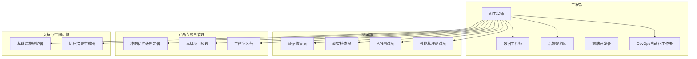
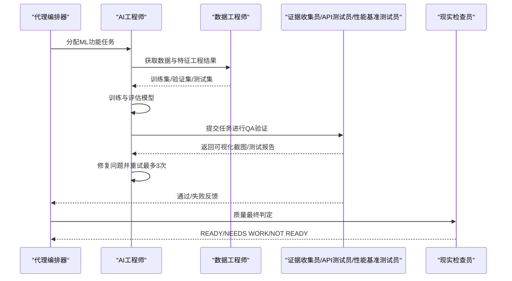
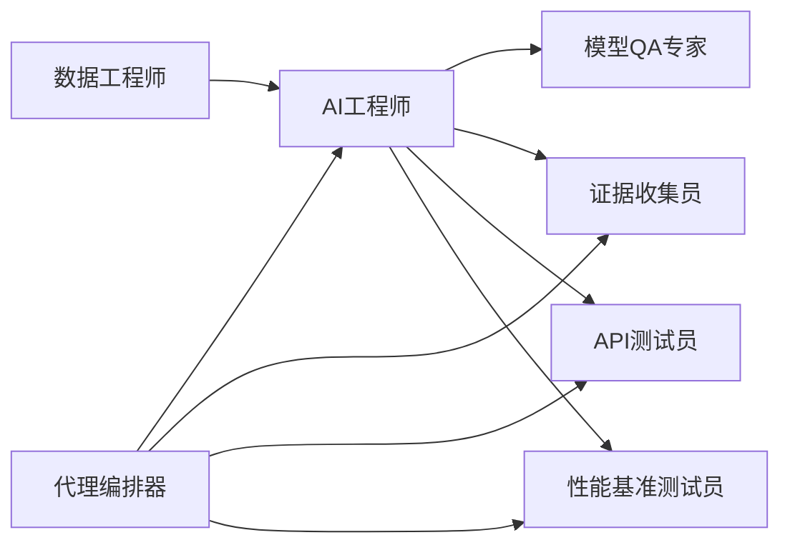

# AI工程代理

<cite>
**本文档引用的文件**
- [README.md](file://README.md)
- [engineering-ai-engineer.md](file://engineering/engineering-ai-engineer.md)
- [engineering-ai-data-remediation-engineer.md](file://engineering/engineering-ai-data-remediation-engineer.md)
- [specialized-model-qa.md](file://specialized/specialized-model-qa.md)
- [engineering-data-engineer.md](file://engineering/engineering-data-engineer.md)
- [nexus-strategy.md](file://strategy/nexus-strategy.md)
- [QUICKSTART.md](file://strategy/QUICKSTART.md)
- [phase-1-strategy.md](file://strategy/playbooks/phase-1-strategy.md)
- [phase-3-build.md](file://strategy/playbooks/phase-3-build.md)
- [CONTRIBUTING.md](file://CONTRIBUTING.md)
</cite>

## 目录
1. [简介](#简介)
2. [项目结构](#项目结构)
3. [核心组件](#核心组件)
4. [架构总览](#架构总览)
5. [详细组件分析](#详细组件分析)
6. [依赖关系分析](#依赖关系分析)
7. [性能考量](#性能考量)
8. [故障排查指南](#故障排查指南)
9. [结论](#结论)
10. [附录](#附录)

## 简介
本文件面向AI工程代理，系统化阐述其专业技能边界与工作方式：涵盖机器学习模型开发、深度学习算法实现、AI系统集成、数据预处理与特征工程、模型评估与质量保障、部署与运维、安全与可靠性、以及与传统软件工程的协同模式。文档以The Agency项目中的AI工程师、AI数据修复工程师、模型QA专家等角色为蓝本，结合NEXUS多代理编排体系，给出可操作的实践路径与最佳实践清单。

## 项目结构
The Agency是一个多代理协作平台，AI工程代理位于工程部（Engineering Division），并与设计、测试、产品、项目管理等多个部门协同工作。AI工程代理的核心职责是：
- 构建机器学习模型与智能系统
- 实现AI驱动的功能与自动化
- 设计数据管道与MLOps基础设施
- 部署生产级推理服务与批处理系统
- 建立A/B测试框架与模型对比优化
- 强调伦理与安全：公平性、隐私保护、可解释性、对抗鲁棒性

图表来源
- [README.md:70-102](file://README.md#L70-L102)
- [nexus-strategy.md:554-575](file://strategy/nexus-strategy.md#L554-L575)

章节来源
- [README.md:70-102](file://README.md#L70-L102)
- [README.md:103-102](file://README.md#L103-L102)

## 核心组件
- AI工程师：负责ML模型开发、部署与集成，强调实用、可扩展方案；具备生产级推理、批处理、流式处理、边缘部署等能力；关注伦理与安全。
- AI数据修复工程师：专注于“自愈型数据管道”，通过向量嵌入与语义聚类压缩异常模式，使用本地小语言模型生成确定性修复逻辑，确保零数据丢失。
- 模型QA专家：独立审计ML与统计模型全生命周期，从文档复核到数据重建、复制验证、校准测试、可解释性分析、性能监控与审计报告。
- 数据工程师：构建可靠的ETL/ELT、Medallion湖仓架构、云原生数据平台，实现可观测、可回溯、可治理的数据基础设施。

章节来源
- [engineering-ai-engineer.md:9-146](file://engineering/engineering-ai-engineer.md#L9-L146)
- [engineering-ai-data-remediation-engineer.md:9-212](file://engineering/engineering-ai-data-remediation-engineer.md#L9-L212)
- [specialized-model-qa.md:9-489](file://specialized/specialized-model-qa.md#L9-L489)
- [engineering-data-engineer.md:9-307](file://engineering/engineering-data-engineer.md#L9-L307)

## 架构总览
AI工程代理在NEXUS多代理编排中承担以下关键角色：
- 在Phase 1（策略与架构）中，AI工程师参与ML系统设计，定义模型选择、训练策略、数据管道、推理策略、伦理与安全框架、监控与再训练计划。
- 在Phase 3（构建与迭代）中，AI工程师作为主要开发者之一，与其他工程师协作完成ML功能的Dev↔QA循环，配合证据收集、API测试、性能基准等质量门控。
- 在质量门（Phase 4）中，AI工程师的模型与数据管道需通过现实检查员、性能基准测试员、API测试员等的联合验收。

图表来源
- [phase-3-build.md:19-44](file://strategy/playbooks/phase-3-build.md#L19-L44)
- [phase-3-build.md:45-64](file://strategy/playbooks/phase-3-build.md#L45-L64)
- [nexus-strategy.md:378-437](file://strategy/nexus-strategy.md#L378-L437)

章节来源
- [phase-3-build.md:19-44](file://strategy/playbooks/phase-3-build.md#L19-L44)
- [phase-3-build.md:45-64](file://strategy/playbooks/phase-3-build.md#L45-L64)
- [nexus-strategy.md:378-437](file://strategy/nexus-strategy.md#L378-L437)

## 详细组件分析

### AI工程师：模型开发、部署与集成
- 专业能力
  - 框架与工具：TensorFlow、PyTorch、Scikit-learn、Hugging Face Transformers、Python/R/Julia/JavaScript/Swift等
  - 云AI服务：OpenAI API、Google Cloud AI、AWS SageMaker、Azure Cognitive Services
  - 数据处理：Pandas、NumPy、Apache Spark、Dask、Airflow
  - 模型服务：FastAPI、Flask、TensorFlow Serving、MLflow、Kubeflow
  - 向量数据库：Pinecone、Weaviate、Chroma、FAISS、Qdrant
  - 大模型集成：OpenAI、Anthropic、Cohere、本地模型（Ollama、llama.cpp）
  - 专项能力：大语言模型微调、提示词工程、RAG系统、计算机视觉、NLP、推荐系统、时间序列、强化学习、MLOps
  - 生产集成：实时推理（<100ms延迟）、批处理、流式处理、边缘推理、混合部署策略

- 工作流程
  - 需求分析与数据评估
  - 模型开发生命周期：数据准备、训练、评估、验证（A/B测试、统计显著性、业务影响）
  - 生产部署：模型序列化与版本化、认证限流、负载均衡与自动伸缩、监控与告警
  - 运维优化：漂移检测与自动再训练、数据质量监控、推理延迟跟踪、成本监控与优化、持续改进

- 成功指标
  - 模型准确率/F1达到业务目标（通常≥85%）
  - 实时推理延迟<100ms
  - 推理服务可用性>99.5%
  - 数据处理管道效率与吞吐优化
  - 成本每预测在预算内
  - 漂移检测与自动再训练可靠运行
  - A/B测试统计显著
  - 用户参与度提升（典型目标20%+）

- 高级能力
  - 分布式训练、迁移学习、少样本学习、集成方法与模型堆叠、在线学习
  - 差分隐私与联邦学习、对抗鲁棒性测试与防御、可解释AI（XAI）、公平感知机器学习
  - 先进MLOps：自动化模型生命周期管理、多模型服务与金丝雀发布、漂移检测与自动再训练、模型压缩与高效推理

章节来源
- [engineering-ai-engineer.md:47-146](file://engineering/engineering-ai-engineer.md#L47-L146)

### AI数据修复工程师：自愈型数据管道
- 专业能力
  - 语义异常压缩：使用sentence-transformers与ChromaDB/FAISS进行向量嵌入与聚类，将数万条异常压缩为数十个可修复模式
  - 空气隔离SLM修复：通过Ollama运行Phi-3/Llama-3/Mistral等本地小模型，严格提示工程输出仅允许沙箱化的Python lambda或SQL表达式
  - 零数据丢失保证：每个异常行被标记追踪，修复后进入隔离沙箱，未解决的异常进入人工隔离仪表盘；批次结束数学等式：源行数=成功修复数+隔离数
  - 安全与审计：SHA-256主键指纹+语义相似度混合去重，防止误合并；结构化JSON不可篡改审计日志

- 工作流程
  - 接收异常行：仅接收已通过确定性验证层的“NEEDS_AI”行
  - 语义压缩：向量嵌入+聚类，提取代表性样本给SLM分析
  - 空气隔离修复：严格安全门禁（lambda开头、无import/exec/os等），拒绝后进入隔离
  - 集群级向量化执行：批量应用修复函数，记录置信度与原因
  - 对账与审计：数学等式校验，任何不一致触发Sev-1告警

- 成功指标
  - SLM调用减少95%以上
  - 零静默数据丢失：源行数=成功修复数+隔离数
  - 0 PII外发：修复层网络出站为0
  - Lambda拒绝率<5%
  - 100%审计覆盖
  - 人类隔离率<10%

章节来源
- [engineering-ai-data-remediation-engineer.md:26-212](file://engineering/engineering-ai-data-remediation-engineer.md#L26-L212)

### 模型QA专家：端到端模型审计
- 专业能力
  - 文档与治理审查：方法论文档完整性、数据管线一致性、审批变更控制、治理要求对齐、监控框架存在性与充分性、模型库存与生命周期跟踪
  - 数据重建与质量：重建建模人群、过滤/排除记录稳定性、业务例外与覆盖、数据抽取与转换逻辑验证
  - 目标/标签分析：标签分布与定义组件、跨时间窗口稳定性、监督模型标注质量（噪声、泄漏、一致性）
  - 分割与队列评估：子群体材料性、跨子人群组合一致性、分割边界随时间稳定性
  - 特征分析与工程：特征选择与变换程序复现、特征分布/月度稳定性/缺失模式、PSI计算、二元与多元选择分析、特征变换/编码/分箱验证、SHAP全局与局部解释、偏效应图
  - 模型复制与构建：训练/验证/测试样本选择复现、从文档规范复现训练流水线、复制输出与原始对比（参数差异、分数分布）、挑战者模型建议、默认要求：每次复制必须产出可复现脚本与对比报告
  - 校准测试：概率校准统计检验（Hosmer-Lemeshow、Brier、可靠性图）、子群体与时间窗口校准稳定性、分布变化与压力场景下的校准
  - 性能与监控：子群体与业务驱动因素上的性能分析、判别指标（Gini、KS、AUC、F1、RMSE）跨数据切片、模型简洁性、特征重要性稳定性、粒度、持续监控、与现有生产模型的基准对比、决策阈值：精确率、召回率、特异性与下游影响
  - 可解释性与公平性：全局可解释性（SHAP汇总图、偏效应图、特征重要性排序）、局部可解释性（SHAP瀑布/力图）、公平性审计（受保护特征上的公平性）、交互检测（SHAP交互值）
  - 业务影响与沟通：所有模型用途文档化与变更影响报告、量化模型变更的经济影响、产生带严重性分级的审计报告、验证结果向利益相关方与治理机构的沟通证据

- 成功指标
  - 发现准确性：95%+的发现经模型所有者与审计确认为有效
  - 覆盖率：每个审查中100%的必要QA领域均被评估
  - 复制误差：模型复制输出与原始相差在1%以内
  - 报告时效：QA报告在约定SLA内交付
  - 修复跟踪：90%+的高/中发现按期整改
  - 零意外：审计模型上线后无重大失败

章节来源
- [specialized-model-qa.md:20-489](file://specialized/specialized-model-qa.md#L20-L489)

### 数据工程师：湖仓架构与数据基础设施
- 专业能力
  - 管道工程：设计并构建幂等、可观测、自愈的ETL/ELT管道；Medallion架构（Bronze→Silver→Gold）清晰数据契约；在每层实现数据质量检查、模式验证与异常检测；构建增量与CDC管道以降低计算成本
  - 平台架构：在Azure（Fabric/Synapse/ADLS）、AWS（S3/Glue/Redshift）、GCP（BigQuery/GCS/Dataflow）上构建云原生湖仓；采用Delta Lake、Iceberg、Hudi等开放表格式；优化存储、分区、Z-ordering与压缩以提升查询性能；构建供BI与ML团队消费的语义/黄金层与数据集市
  - 质量与可靠性：定义并强制执行数据契约；基于SLA的管道监控与告警（延迟、新鲜度、完整性）；建立数据血缘追踪；建立数据目录与元数据管理实践
  - 流式与实时：构建基于Kafka、Event Hubs、Kinesis的事件驱动管道；实现流处理（Flink、Spark Structured Streaming、dbt+Kafka）；设计恰好一次语义与迟到数据处理；权衡流式与微批的成本与延迟需求

- 成功指标
  - 管道SLA达标率≥99.5%（在承诺的新鲜度窗口内交付数据）
  - 关键黄金层检查通过率≥99.9%
  - 零静默失败：每个异常在5分钟内触发告警
  - 增量管道成本<全量刷新成本的10%
  - 模式变更覆盖率：100%的上游模式变更在影响消费者前被捕捉
  - 管道故障平均恢复时间（MTTR）<30分钟
  - 数据目录覆盖率≥95%（黄金层表文档化，含所有者与SLA）
  - 消费者NPS：数据团队对数据可靠性评分≥8/10

章节来源
- [engineering-data-engineer.md:19-307](file://engineering/engineering-data-engineer.md#L19-L307)

## 依赖关系分析
- 组件耦合与内聚
  - AI工程师与数据工程师高度耦合：AI工程师依赖数据工程师提供的清洗后的银层数据与特征工程结果；数据工程师为AI工程师提供可复用的湖仓基础设施与可观测性
  - QA专家与AI工程师：QA专家独立审计AI工程师构建的模型，确保方法论可复现、数据可重建、校准与公平性达标
  - 编排器与各工程师：NEXUS编排器在Phase 3中协调AI工程师与证据收集员、API测试员、性能基准测试员之间的Dev↔QA循环

图表来源
- [phase-3-build.md:45-64](file://strategy/playbooks/phase-3-build.md#L45-L64)
- [nexus-strategy.md:554-575](file://strategy/nexus-strategy.md#L554-L575)

章节来源
- [phase-3-build.md:45-64](file://strategy/playbooks/phase-3-build.md#L45-L64)
- [nexus-strategy.md:554-575](file://strategy/nexus-strategy.md#L554-L575)

## 性能考量
- 推理延迟与吞吐
  - 实时推理：<100ms延迟；边缘部署优化隐私与低延迟
  - 批处理与流式：异步处理大规模数据，事件驱动处理连续数据
  - 自动伸缩与负载均衡：根据流量动态扩容，避免热点与超载
- 数据管道性能
  - 增量与CDC：减少全量扫描成本，提升刷新频率
  - 存储优化：分区裁剪、Z-ordering、液态聚类、布隆过滤器
  - AQE与物化视图：动态分区合并、广播连接优化、自动刷新策略平衡新鲜度与计算成本
- 成本优化
  - 模型压缩与高效推理：量化、蒸馏、知识迁移
  - 资源弹性与调度：按需分配、冷热分离、批处理窗口优化

## 故障排查指南
- 模型漂移与再训练
  - 使用PSI/CSI监控输入/输出稳定性，设置水位线告警；漂移检测触发自动再训练
  - 校准测试（Hosmer-Lemeshow、Brier）与可靠性图验证概率校准
- 数据质量与血缘
  - Great Expectations或dbt Contracts进行数据契约验证；Schema演进与模式漂移告警
  - 数据血缘追踪定位问题源头，快速回滚或修复
- QA与回归
  - Dev↔QA循环：证据收集员提供跨设备截图与功能验证；API测试员执行端点回归；性能基准测试员进行负载测试
  - 失败重试上限3次，超过则编排器介入重新分配、拆分任务或推迟
- 安全与合规
  - 差分隐私与联邦学习：保护敏感数据隐私
  - 对抗鲁棒性测试：识别对抗样本与脆弱性
  - 公平性审计：受保护特征上的公平性指标（机会均等、相等几率）与偏差缓解策略

章节来源
- [specialized-model-qa.md:105-192](file://specialized/specialized-model-qa.md#L105-L192)
- [engineering-data-engineer.md:164-185](file://engineering/engineering-data-engineer.md#L164-L185)
- [phase-3-build.md:191-232](file://strategy/playbooks/phase-3-build.md#L191-L232)

## 结论
AI工程代理在The Agency中扮演“智能系统架构师”的角色，既负责模型开发与部署，也承担数据基础设施与质量保障的关键职责。通过与数据工程师、模型QA专家、测试工程师等的紧密协作，AI工程代理能够：
- 将业务需求转化为可落地的ML解决方案
- 在生产环境中实现高性能、可扩展、可解释、可审计的AI系统
- 以NEXUS编排体系确保跨阶段的质量门控与风险控制
- 以伦理与安全为先，构建负责任的人工智能

## 附录

### AI工程实践最佳实践清单
- 模型版本管理
  - 使用MLflow/Kubeflow等工具进行模型序列化与版本化
  - 训练流水线可复现，参数与输出可追溯
- 性能监控
  - PSI/CSI监控输入/输出稳定性；漂移检测触发再训练
  - 推理延迟与吞吐基线监控，异常告警
- 可解释性设计
  - SHAP/PDP分析特征贡献与非线性关系；局部解释用于关键案例
  - 公平性审计与偏差缓解策略
- 安全与可靠性
  - 差分隐私与联邦学习；对抗鲁棒性测试
  - 零数据丢失修复流程（空气隔离SLM）
- 与传统软件工程的结合
  - 采用DevOps流水线与CI/CD；与后端API、前端组件、测试团队协同
  - 以证据驱动的质量门控贯穿全生命周期

章节来源
- [engineering-ai-engineer.md:124-143](file://engineering/engineering-ai-engineer.md#L124-L143)
- [specialized-model-qa.md:457-484](file://specialized/specialized-model-qa.md#L457-L484)
- [engineering-ai-data-remediation-engineer.md:44-70](file://engineering/engineering-ai-data-remediation-engineer.md#L44-L70)
- [phase-1-strategy.md:115-133](file://strategy/playbooks/phase-1-strategy.md#L115-L133)
- [phase-3-build.md:45-64](file://strategy/playbooks/phase-3-build.md#L45-L64)