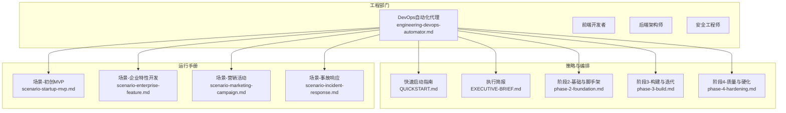
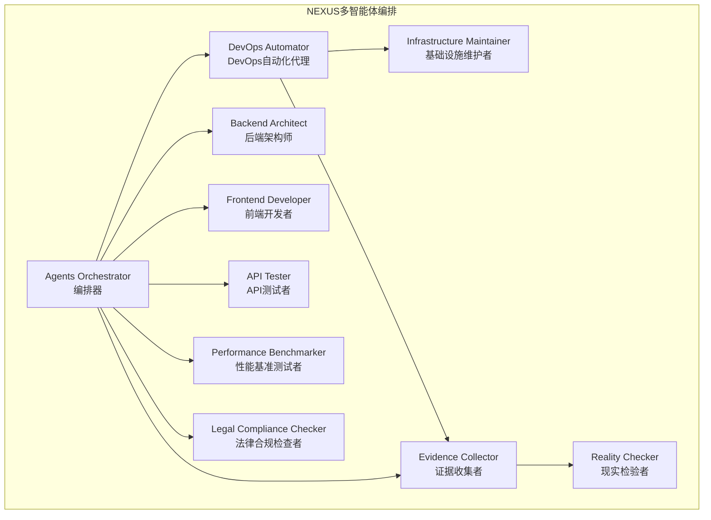
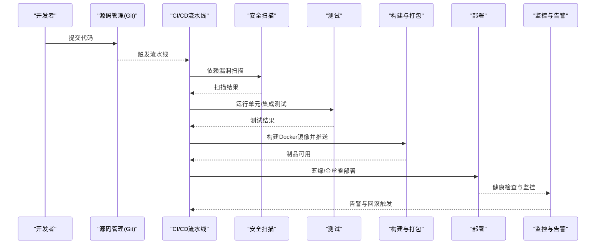
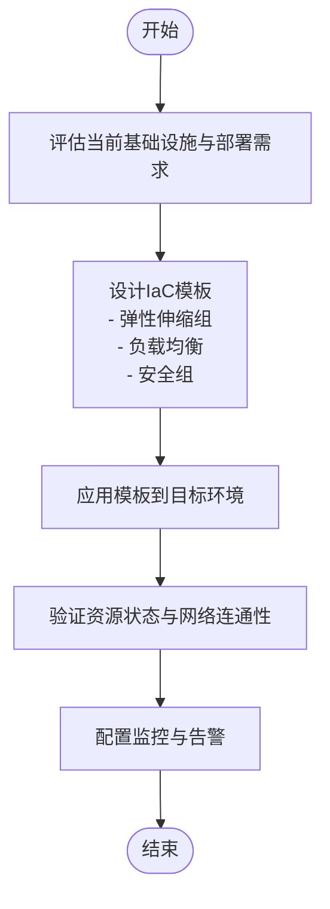
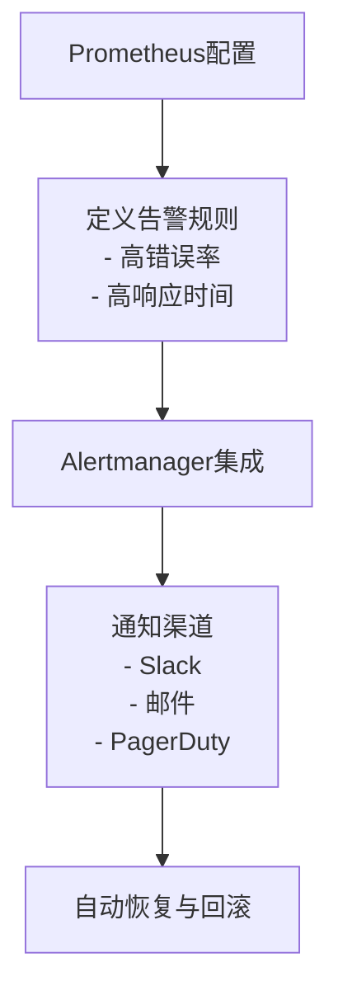
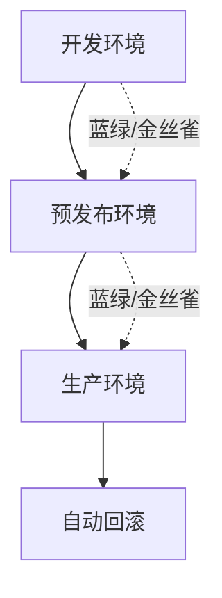
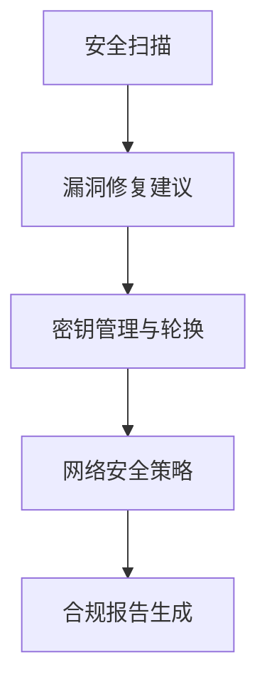
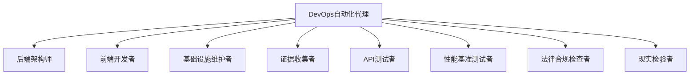
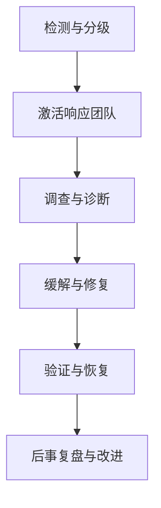

# DevOps自动化代理

<cite>
**本文档引用的文件**
- [工程-DevOps自动化代理.md](file://engineering/engineering-devops-automator.md)
- [README.md](file://README.md)
- [快速启动指南.md](file://strategy/QUICKSTART.md)
- [执行简报.md](file://strategy/EXECUTIVE-BRIEF.md)
- [阶段2-基础与脚手架.md](file://strategy/playbooks/phase-2-foundation.md)
- [阶段3-构建与迭代.md](file://strategy/playbooks/phase-3-build.md)
- [阶段4-质量与硬化.md](file://strategy/playbooks/phase-4-hardening.md)
- [场景-初创MVP.md](file://strategy/runbooks/scenario-startup-mvp.md)
- [场景-企业特性开发.md](file://strategy/runbooks/scenario-enterprise-feature.md)
- [场景-营销活动.md](file://strategy/runbooks/scenario-marketing-campaign.md)
- [场景-事故响应.md](file://strategy/runbooks/scenario-incident-response.md)
- [工作流-初创MVP.md](file://examples/workflow-startup-mvp.md)
- [转换脚本.sh](file://scripts/convert.sh)
- [安装脚本.sh](file://scripts/install.sh)
</cite>

## 目录
1. [简介](#简介)
2. [项目结构](#项目结构)
3. [核心组件](#核心组件)
4. [架构总览](#架构总览)
5. [详细组件分析](#详细组件分析)
6. [依赖关系分析](#依赖关系分析)
7. [性能考虑](#性能考虑)
8. [故障排除指南](#故障排除指南)
9. [结论](#结论)
10. [附录](#附录)

## 简介
DevOps自动化代理是The Agency中专门负责基础设施自动化、CI/CD流水线设计与云运维的专家型智能体。该代理以系统化、自动化优先为核心理念，专注于消除手工流程、降低运维开销，确保系统可靠性与可扩展性。其职责涵盖基础设施即代码(IaC)、容器编排、零停机部署策略、监控告警与自动回滚、成本优化与多环境管理等关键领域。

在软件交付流程中，DevOps自动化代理承担以下关键角色：
- 设计并实现基础设施即代码（Terraform、CloudFormation或CDK）
- 构建安全扫描集成的CI/CD流水线（GitHub Actions、GitLab CI或Jenkins）
- 设置容器编排（Docker、Kubernetes和服务网格）
- 实施蓝绿、金丝雀与滚动发布等零停机部署策略
- 建立监控、告警与自动回滚能力
- 创建多环境管理自动化（开发、预发布、生产）
- 集成安全扫描与合规报告自动化

## 项目结构
该项目采用模块化组织方式，围绕“智能体”（Agent）进行分类管理，DevOps自动化代理位于工程部门下的专用智能体目录中。同时，项目提供了完整的NEXUS多智能体编排体系，支持从发现、策略、基础建设、构建、硬化到运营的全生命周期协作。

**图表来源**
- [工程-DevOps自动化代理.md](file://engineering/engineering-devops-automator.md)
- [快速启动指南.md](file://strategy/QUICKSTART.md)
- [执行简报.md](file://strategy/EXECUTIVE-BRIEF.md)
- [阶段2-基础与脚手架.md](file://strategy/playbooks/phase-2-foundation.md)
- [阶段3-构建与迭代.md](file://strategy/playbooks/phase-3-build.md)
- [阶段4-质量与硬化.md](file://strategy/playbooks/phase-4-hardening.md)
- [场景-初创MVP.md](file://strategy/runbooks/scenario-startup-mvp.md)
- [场景-企业特性开发.md](file://strategy/runbooks/scenario-enterprise-feature.md)
- [场景-营销活动.md](file://strategy/runbooks/scenario-marketing-campaign.md)
- [场景-事故响应.md](file://strategy/runbooks/scenario-incident-response.md)

**章节来源**
- [README.md](file://README.md)
- [工程-DevOps自动化代理.md](file://engineering/engineering-devops-automator.md)

## 核心组件
DevOps自动化代理的核心能力由以下五大支柱构成：

### 1. 基础设施即代码（IaC）
- 支持多云平台（AWS、GCP、Azure），根据业务需求选择最优区域与成本策略
- 使用Terraform模板实现弹性伸缩、负载均衡与安全组配置
- 自动化环境准备（开发、预发布、生产），确保多环境一致性

### 2. CI/CD流水线架构
- 安全扫描集成：依赖漏洞扫描与静态安全分析
- 自动化测试：单元测试、集成测试与端到端测试
- 容器构建与制品管理：Docker镜像构建与推送
- 零停机部署：蓝绿、金丝雀与滚动发布策略
- 自动回滚机制：基于健康检查与告警触发

### 3. 监控与可观测性
- 应用指标与基础设施指标采集
- 结构化日志聚合与搜索
- 告警规则与通知渠道（Slack、邮件、PagerDuty）
- 演绎式告警与合规审计自动化

### 4. 安全与合规
- 容器与依赖漏洞扫描
- 密钥管理与轮换自动化
- 网络安全与访问控制
- 合规报告与策略强制执行

### 5. 成本优化与多环境管理
- 资源右置与成本优化策略
- 多环境自动化（开发、预发布、生产）
- 性能监控与优化流程

**章节来源**
- [工程-DevOps自动化代理.md](file://engineering/engineering-devops-automator.md)

## 架构总览
DevOps自动化代理在NEXUS多智能体编排体系中的定位与交互如下：

**图表来源**
- [快速启动指南.md](file://strategy/QUICKSTART.md)
- [阶段2-基础与脚手架.md](file://strategy/playbooks/phase-2-foundation.md)
- [阶段3-构建与迭代.md](file://strategy/playbooks/phase-3-build.md)
- [阶段4-质量与硬化.md](file://strategy/playbooks/phase-4-hardening.md)

**章节来源**
- [快速启动指南.md](file://strategy/QUICKSTART.md)
- [执行简报.md](file://strategy/EXECUTIVE-BRIEF.md)

## 详细组件分析

### 组件A：CI/CD流水线设计与实现
DevOps自动化代理负责设计并实现安全集成的CI/CD流水线，确保从代码提交到生产的每个环节都具备自动化保障。

**图表来源**
- [工程-DevOps自动化代理.md](file://engineering/engineering-devops-automator.md)
- [阶段2-基础与脚手架.md](file://strategy/playbooks/phase-2-foundation.md)
- [阶段3-构建与迭代.md](file://strategy/playbooks/phase-3-build.md)

**章节来源**
- [工程-DevOps自动化代理.md](file://engineering/engineering-devops-automator.md)
- [阶段2-基础与脚手架.md](file://strategy/playbooks/phase-2-foundation.md)
- [阶段3-构建与迭代.md](file://strategy/playbooks/phase-3-build.md)

### 组件B：基础设施即代码（IaC）模板
DevOps自动化代理提供可复用的基础设施模板，确保环境的一致性与可重复性。

**图表来源**
- [工程-DevOps自动化代理.md](file://engineering/engineering-devops-automator.md)
- [阶段2-基础与脚手架.md](file://strategy/playbooks/phase-2-foundation.md)

**章节来源**
- [工程-DevOps自动化代理.md](file://engineering/engineering-devops-automator.md)
- [阶段2-基础与脚手架.md](file://strategy/playbooks/phase-2-foundation.md)

### 组件C：监控与告警配置
DevOps自动化代理负责建立全面的监控与告警体系，确保问题在影响用户前被发现与处理。

**图表来源**
- [工程-DevOps自动化代理.md](file://engineering/engineering-devops-automator.md)

**章节来源**
- [工程-DevOps自动化代理.md](file://engineering/engineering-devops-automator.md)

### 组件D：多环境管理与部署策略
DevOps自动化代理通过标准化的部署策略与多环境管理，确保开发、预发布与生产环境的一致性与安全性。

**图表来源**
- [工程-DevOps自动化代理.md](file://engineering/engineering-devops-automator.md)
- [阶段3-构建与迭代.md](file://strategy/playbooks/phase-3-build.md)
- [阶段4-质量与硬化.md](file://strategy/playbooks/phase-4-hardening.md)

**章节来源**
- [工程-DevOps自动化代理.md](file://engineering/engineering-devops-automator.md)
- [阶段3-构建与迭代.md](file://strategy/playbooks/phase-3-build.md)
- [阶段4-质量与硬化.md](file://strategy/playbooks/phase-4-hardening.md)

### 组件E：安全与合规自动化
DevOps自动化代理将安全与合规嵌入到流水线的每个环节，确保系统在满足安全标准的同时保持高效交付。

**图表来源**
- [工程-DevOps自动化代理.md](file://engineering/engineering-devops-automator.md)
- [阶段4-质量与硬化.md](file://strategy/playbooks/phase-4-hardening.md)

**章节来源**
- [工程-DevOps自动化代理.md](file://engineering/engineering-devops-automator.md)
- [阶段4-质量与硬化.md](file://strategy/playbooks/phase-4-hardening.md)

## 依赖关系分析
DevOps自动化代理在NEXUS编排体系中与其他智能体存在紧密的协作关系，形成完整的交付闭环。

**图表来源**
- [阶段2-基础与脚手架.md](file://strategy/playbooks/phase-2-foundation.md)
- [阶段3-构建与迭代.md](file://strategy/playbooks/phase-3-build.md)
- [阶段4-质量与硬化.md](file://strategy/playbooks/phase-4-hardening.md)

**章节来源**
- [阶段2-基础与脚手架.md](file://strategy/playbooks/phase-2-foundation.md)
- [阶段3-构建与迭代.md](file://strategy/playbooks/phase-3-build.md)
- [阶段4-质量与硬化.md](file://strategy/playbooks/phase-4-hardening.md)

## 性能考虑
- 部署频率：每日多次部署，提升交付效率
- 平均恢复时间(MTTR)：低于30分钟，快速从故障中恢复
- 系统可用性：超过99.9%的正常运行时间
- 安全扫描通过率：关键问题100%通过
- 成本优化：年节省20%以上

这些指标体现了DevOps自动化代理在自动化、可靠性与成本控制方面的卓越表现。

**章节来源**
- [工程-DevOps自动化代理.md](file://engineering/engineering-devops-automator.md)

## 故障排除指南
当系统出现异常时，DevOps自动化代理通过标准化的事故响应流程进行处理：

**图表来源**
- [场景-事故响应.md](file://strategy/runbooks/scenario-incident-response.md)

**章节来源**
- [场景-事故响应.md](file://strategy/runbooks/scenario-incident-response.md)

## 结论
DevOps自动化代理通过系统化的基础设施自动化、安全集成的CI/CD流水线、全面的监控告警与自动回滚机制，显著提升了软件交付的效率与可靠性。结合NEXUS多智能体编排体系，该代理能够实现从代码提交到生产部署的全流程自动化，确保系统在满足安全与合规要求的同时，保持高性能与低成本的运营状态。

## 附录

### 实际案例：初创MVP自动化解决方案
- 团队组成：项目经理、UX研究者、后端架构师、前端开发者、快速原型师、增长黑客、现实检验者
- 执行周期：4周
- 关键里程碑：发现与架构、核心功能构建、打磨与上线、发布与增长
- 成功指标：按时交付、首用户注册、系统高可用、早期用户反馈收集

**章节来源**
- [场景-初创MVP.md](file://strategy/runbooks/scenario-startup-mvp.md)
- [工作流-初创MVP.md](file://examples/workflow-startup-mvp.md)

### 实际案例：企业特性开发自动化方案
- 团队组成：项目协调员、高级项目经理、冲刺优先级制定者、UX架构师、UI设计师、后端架构师、高级开发者、DevOps自动化代理、证据收集者、API测试者、现实检验者、性能基准测试者、法律合规检查者
- 执行周期：6-12周
- 关键里程碑：需求与架构、基础建设、构建与迭代、硬化与验收、发布与运营
- 成功指标：符合规范、零关键缺陷、性能达标、合规认证、发布成功率

**章节来源**
- [场景-企业特性开发.md](file://strategy/runbooks/scenario-enterprise-feature.md)

### 工具集成与安装
项目提供多工具集成脚本，支持在不同AI编码工具中使用DevOps自动化代理：
- 转换脚本：将智能体文件转换为各工具所需的格式
- 安装脚本：自动检测并安装到对应工具的配置目录

**章节来源**
- [转换脚本.sh](file://scripts/convert.sh)
- [安装脚本.sh](file://scripts/install.sh)