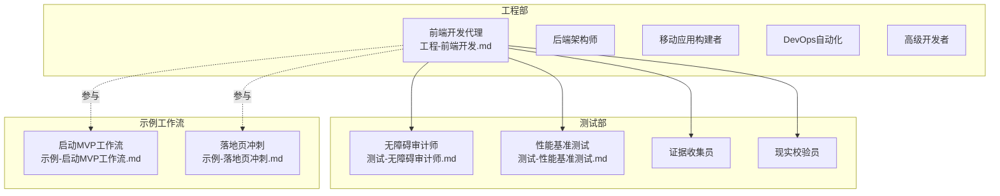
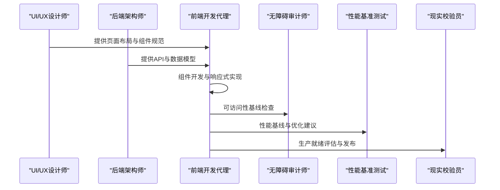
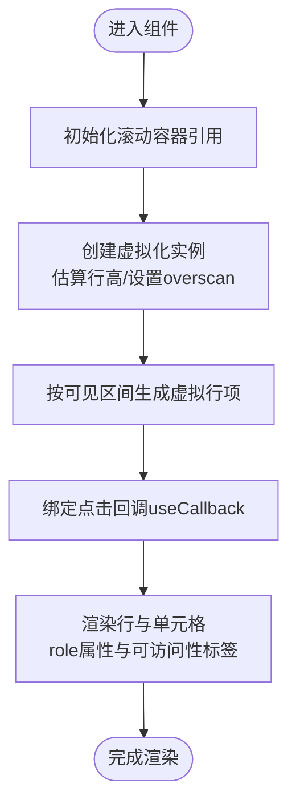
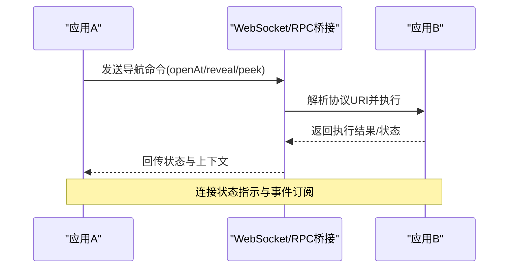
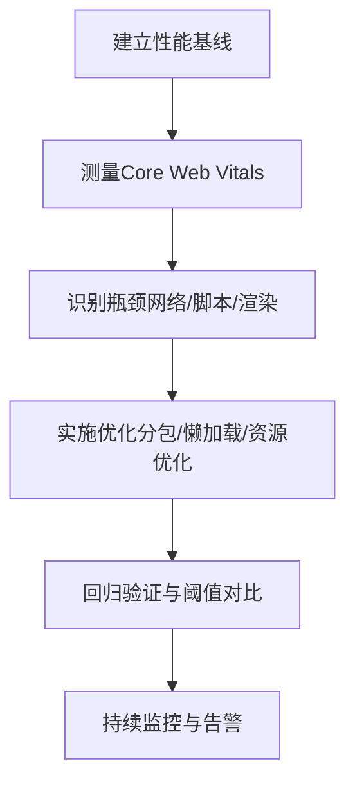
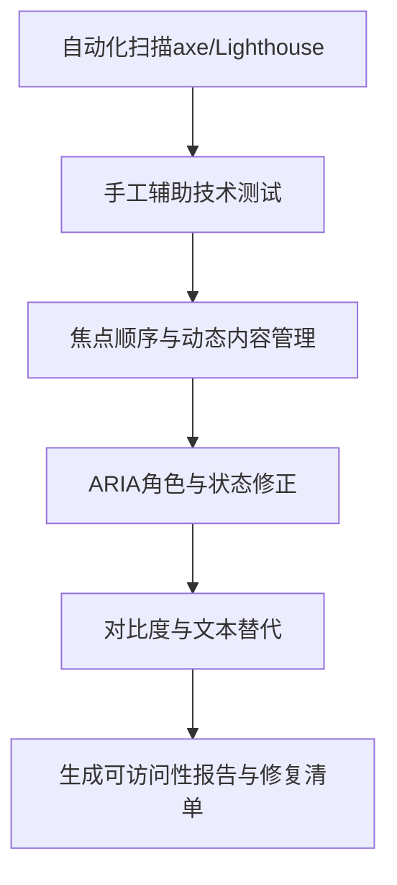
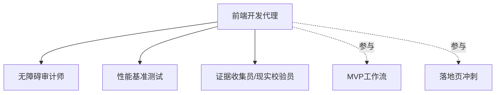

# 前端开发代理

<cite>
**本文引用的文件**
- [工程-前端开发.md](file://engineering/engineering-frontend-developer.md)
- [测试-无障碍审计师.md](file://testing/testing-accessibility-auditor.md)
- [测试-性能基准测试.md](file://testing/testing-performance-benchmarker.md)
- [示例-启动MVP工作流.md](file://examples/workflow-startup-mvp.md)
- [示例-落地页冲刺.md](file://examples/workflow-landing-page.md)
- [自述文件.md](file://README.md)
</cite>

## 目录
1. [简介](#简介)
2. [项目结构](#项目结构)
3. [核心组件](#核心组件)
4. [架构总览](#架构总览)
5. [详细组件分析](#详细组件分析)
6. [依赖关系分析](#依赖关系分析)
7. [性能考量](#性能考量)
8. [故障排查指南](#故障排查指南)
9. [结论](#结论)
10. [附录](#附录)

## 简介
本文件面向“前端开发代理”，系统性阐述其专业能力与工程实践，覆盖现代Web技术栈（React/Vue/Angular）、UI实现、性能优化、可访问性（WCAG 2.1 AA）、编辑器集成工程、现代Web应用构建、以及从项目设置到组件开发、性能优化再到测试质量保证的完整工作流程。文档同时给出可视化图示与路径级示例定位，帮助非技术读者也能理解关键流程与最佳实践。

## 项目结构
该仓库以“多智能体”为主题，每个领域由专门的Agent定义文件承载其身份、使命、工作流与交付物。前端开发代理位于工程部（Engineering Division），并与测试部（Testing Division）中的“无障碍审计师”“性能基准测试”形成紧密协作闭环；同时在示例工作流中，前端开发代理常作为核心角色参与从MVP到落地页的快速交付。

**图表来源**
- [工程-前端开发.md:1-225](file://engineering/engineering-frontend-developer.md#L1-L225)
- [测试-无障碍审计师.md:1-317](file://testing/testing-accessibility-auditor.md#L1-L317)
- [测试-性能基准测试.md:1-268](file://testing/testing-performance-benchmarker.md#L1-L268)
- [示例-启动MVP工作流.md:1-156](file://examples/workflow-startup-mvp.md#L1-L156)
- [示例-落地页冲刺.md:1-120](file://examples/workflow-landing-page.md#L1-L120)

**章节来源**
- [自述文件.md:68-102](file://README.md#L68-L102)
- [工程-前端开发.md:1-225](file://engineering/engineering-frontend-developer.md#L1-L225)

## 核心组件
- 现代Web技术栈与UI实现：React/Vue/Angular生态、组件库与设计系统、状态管理、响应式与移动端优先策略。
- 性能优化：Core Web Vitals优化、代码分割、懒加载、缓存与CDN、RUM监控、性能预算与回归测试。
- 可访问性：WCAG 2.1 AA合规、语义化HTML、ARIA模式、键盘导航、屏幕阅读器兼容、减少动态内容对可访问性的冲击。
- 编辑器集成工程：导航命令（openAt/reveal/peek）、WebSocket/RPC桥接、URI协议处理、双向事件流、连接状态指示、亚150ms往返延迟目标。
- 质量与可维护性：单元/集成测试、TypeScript、错误处理与用户反馈、可复用组件架构、自动化测试与CI/CD集成。

**章节来源**
- [工程-前端开发.md:19-63](file://engineering/engineering-frontend-developer.md#L19-L63)
- [工程-前端开发.md:122-147](file://engineering/engineering-frontend-developer.md#L122-L147)

## 架构总览
前端开发代理在多智能体协作中的定位是“UI实现与性能优化专家”，负责：
- 与“无障碍审计师”协作，确保组件从设计阶段即具备可访问性基线；
- 与“性能基准测试”协作，建立性能基线、识别瓶颈并持续优化；
- 在示例工作流中承担“前端实现”的角色，承接后端API规范与UI设计规格，输出可部署的前端产物。

**图表来源**
- [工程-前端开发.md:122-147](file://engineering/engineering-frontend-developer.md#L122-L147)
- [测试-无障碍审计师.md:217-251](file://testing/testing-accessibility-auditor.md#L217-L251)
- [测试-性能基准测试.md:153-178](file://testing/testing-performance-benchmarker.md#L153-L178)

## 详细组件分析

### 组件一：虚拟化表格（高性能数据展示）
- 技术要点：使用虚拟化库进行行级渲染控制，估算尺寸、设置overscan，结合memo与useCallback避免不必要重渲染；表格容器具备可访问性角色与键盘可达性。
- 性能收益：在大数据集下显著降低DOM节点数量与重排开销，提升滚动流畅度与首屏渲染时间。
- 可访问性：表格容器role="table"，行role="row"，单元格role="cell"，支持键盘激活与焦点管理。

**图表来源**
- [工程-前端开发.md:66-120](file://engineering/engineering-frontend-developer.md#L66-L120)

**章节来源**
- [工程-前端开发.md:66-120](file://engineering/engineering-frontend-developer.md#L66-L120)

### 组件二：编辑器集成工程（跨应用通信）
- 导航命令：openAt、reveal、peek，用于在外部编辑器中打开/聚焦指定位置。
- 通信桥接：WebSocket或RPC桥接，实现跨应用事件与状态同步。
- 协议与URI：处理编辑器协议URI，实现无感跳转与上下文感知。
- 状态指示：连接状态、忙碌/空闲、上下文变化提示。
- 事件流：双向事件流，确保应用间一致性与低延迟（目标亚150ms往返）。

**图表来源**
- [工程-前端开发.md:21-28](file://engineering/engineering-frontend-developer.md#L21-L28)

**章节来源**
- [工程-前端开发.md:21-28](file://engineering/engineering-frontend-developer.md#L21-L28)

### 组件三：现代Web应用构建（框架选择与架构）
- 框架选择：根据项目复杂度与团队经验选择React/Vue/Angular，强调移动端优先与响应式设计。
- 组件库与设计系统：统一Tokens、主题与交互基线，提高复用率与一致性。
- 状态管理：根据场景选择Context/Zustand/Redux等，确保可维护性与性能平衡。
- API集成：类型安全的HTTP客户端、错误边界与用户反馈机制。

**图表来源**
- [工程-前端开发.md:29-34](file://engineering/engineering-frontend-developer.md#L29-L34)

**章节来源**
- [工程-前端开发.md:29-34](file://engineering/engineering-frontend-developer.md#L29-L34)

### 组件四：性能优化（Core Web Vitals与工程实践）
- 目标：LCP < 2.5s、FID < 100ms、CLS < 0.1，移动端优先。
- 技术手段：代码分割、懒加载、图片格式与响应式尺寸、Service Worker与CDN、RUM监控。
- 质量门：性能预算、阈值与回归测试，CI中强制通过。

**图表来源**
- [测试-性能基准测试.md:153-178](file://testing/testing-performance-benchmarker.md#L153-L178)

**章节来源**
- [测试-性能基准测试.md:28-41](file://testing/testing-performance-benchmarker.md#L28-L41)
- [测试-性能基准测试.md:153-178](file://testing/testing-performance-benchmarker.md#L153-L178)

### 组件五：可访问性（WCAG 2.1 AA与实操）
- 标准：WCAG 2.2 AA（含AAA场景），POUR原则（感知、操作、理解、健壮）。
- 手工测试：屏幕阅读器（VoiceOver/NVDA/JAWS）、键盘导航、缩放与高对比度、减少动态效果。
- 自动化：axe-core、Lighthouse辅助扫描，但需人工验证动态内容与焦点顺序。
- 修复闭环：问题清单、严重等级、修复建议与验证方法。

**图表来源**
- [测试-无障碍审计师.md:217-251](file://testing/testing-accessibility-auditor.md#L217-L251)

**章节来源**
- [测试-无障碍审计师.md:21-68](file://testing/testing-accessibility-auditor.md#L21-L68)
- [测试-无障碍审计师.md:217-251](file://testing/testing-accessibility-auditor.md#L217-L251)

## 依赖关系分析
- 前端开发代理与测试部协作：
  - 与“无障碍审计师”：在组件开发早期即纳入可访问性基线，避免后期大规模重构。
  - 与“性能基准测试”：建立性能基线与阈值，CI中强制通过，保障上线质量。
- 工作流依赖：
  - 示例工作流中，前端开发代理承接后端API与UI设计，产出可部署前端资产，并通过“现实校验员”进行生产就绪评估。

**图表来源**
- [工程-前端开发.md:122-147](file://engineering/engineering-frontend-developer.md#L122-L147)
- [示例-启动MVP工作流.md:72-107](file://examples/workflow-startup-mvp.md#L72-L107)
- [示例-落地页冲刺.md:60-81](file://examples/workflow-landing-page.md#L60-L81)

**章节来源**
- [工程-前端开发.md:122-147](file://engineering/engineering-frontend-developer.md#L122-L147)
- [示例-启动MVP工作流.md:72-107](file://examples/workflow-startup-mvp.md#L72-L107)
- [示例-落地页冲刺.md:60-81](file://examples/workflow-landing-page.md#L60-L81)

## 性能考量
- 性能优先开发：从需求评审开始即考虑性能影响，设定明确的Core Web Vitals目标与阈值。
- 优化策略：代码分割、懒加载、图片格式与响应式尺寸、Service Worker离线与缓存、CDN加速、RUM实时监控。
- 质量门：CI中加入性能回归检测，未达标禁止合并与发布。
- 用户体验：关注真实网络与设备条件下的表现，确保移动端优先与渐进增强。

[本节为通用指导，无需特定文件引用]

## 故障排查指南
- 可访问性问题
  - 现象：屏幕阅读器无法正确朗读、键盘无法到达某些元素、动态内容未被及时告知。
  - 排查：使用axe-core与Lighthouse进行自动化扫描，再以VoiceOver/NVDA/JAWS进行手工验证；检查ARIA角色、label与动态live区域。
  - 修复：补充语义化HTML、正确使用ARIA、确保焦点管理与键盘可达性。
- 性能问题
  - 现象：首屏慢、交互延迟高、滚动卡顿、CLSI值偏高。
  - 排查：使用k6等工具模拟真实负载，定位瓶颈（网络、脚本、渲染）。
  - 修复：实施代码分割、懒加载、图片优化、Service Worker缓存与CDN加速。
- 编辑器集成问题
  - 现象：导航命令无响应、URI解析失败、往返延迟高。
  - 排查：确认桥接层（WebSocket/RPC）连通性、协议URI格式与事件订阅。
  - 修复：完善状态指示、事件去抖与超时处理，确保亚150ms往返目标。

**章节来源**
- [测试-无障碍审计师.md:48-68](file://testing/testing-accessibility-auditor.md#L48-L68)
- [测试-性能基准测试.md:42-56](file://testing/testing-performance-benchmarker.md#L42-L56)
- [工程-前端开发.md:50-63](file://engineering/engineering-frontend-developer.md#L50-L63)

## 结论
前端开发代理以“性能优先、可访问性内建、工程化交付”为核心，通过与测试部的深度协作与示例工作流的实践沉淀，形成从需求到上线的稳定交付路径。依托虚拟化表格、编辑器集成、性能监控与可访问性基线，代理能够在复杂项目中保持高质量与高效率，同时为产品长期演进奠定坚实基础。

[本节为总结性内容，无需特定文件引用]

## 附录
- 实际交付模板与沟通风格
  - 交付模板：包含UI实现、性能优化、可访问性实现等模块，便于跨团队交接与评审。
  - 沟通风格：强调性能指标、用户体验与可访问性细节，确保技术决策可量化、可追踪。
- 成功度量
  - 页面加载时间在3G网络下低于3秒；Lighthouse性能与可访问性得分稳定高于90；跨浏览器兼容无重大缺陷；组件复用率超80%；生产环境零控制台错误。

**章节来源**
- [工程-前端开发.md:148-202](file://engineering/engineering-frontend-developer.md#L148-L202)