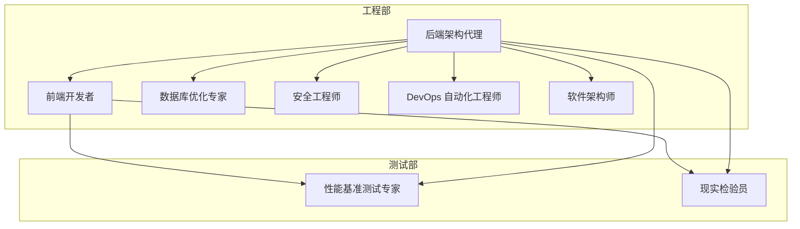
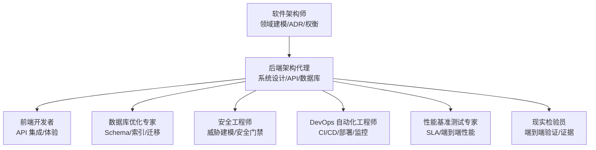
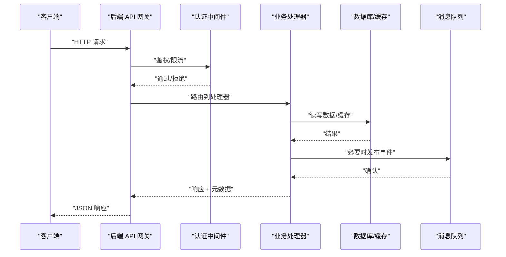
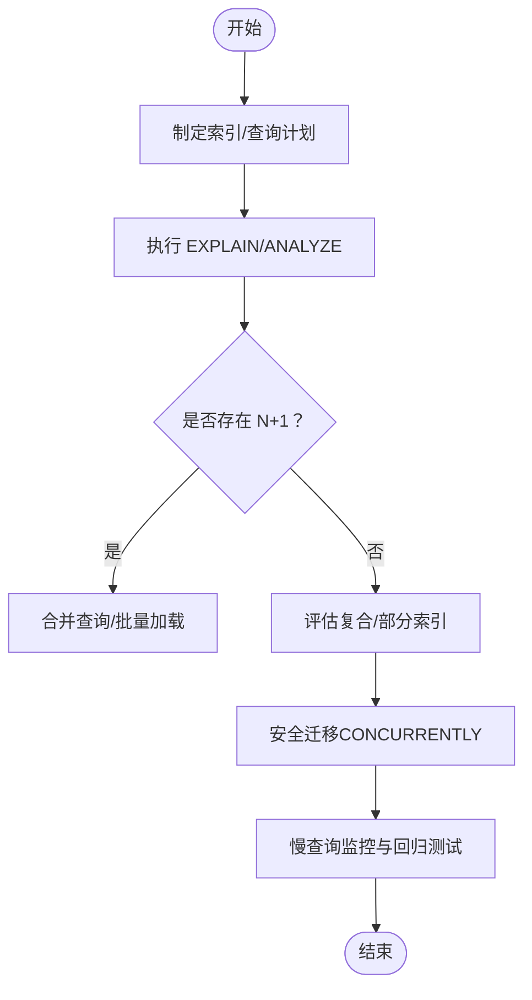
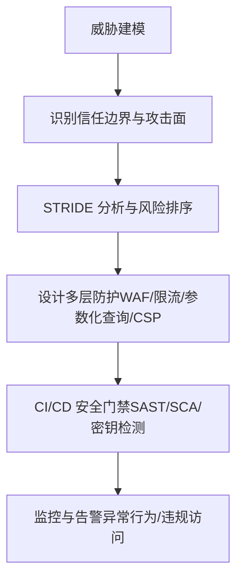
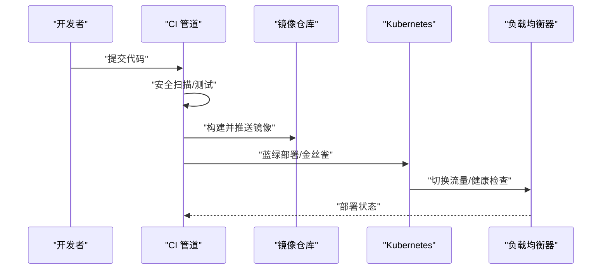
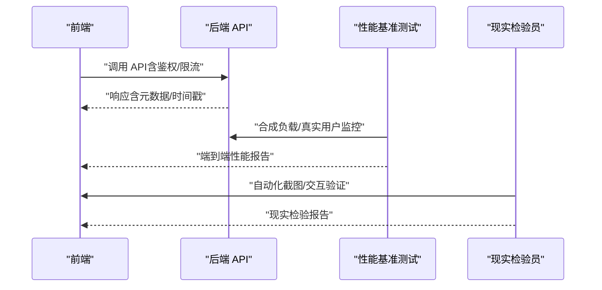
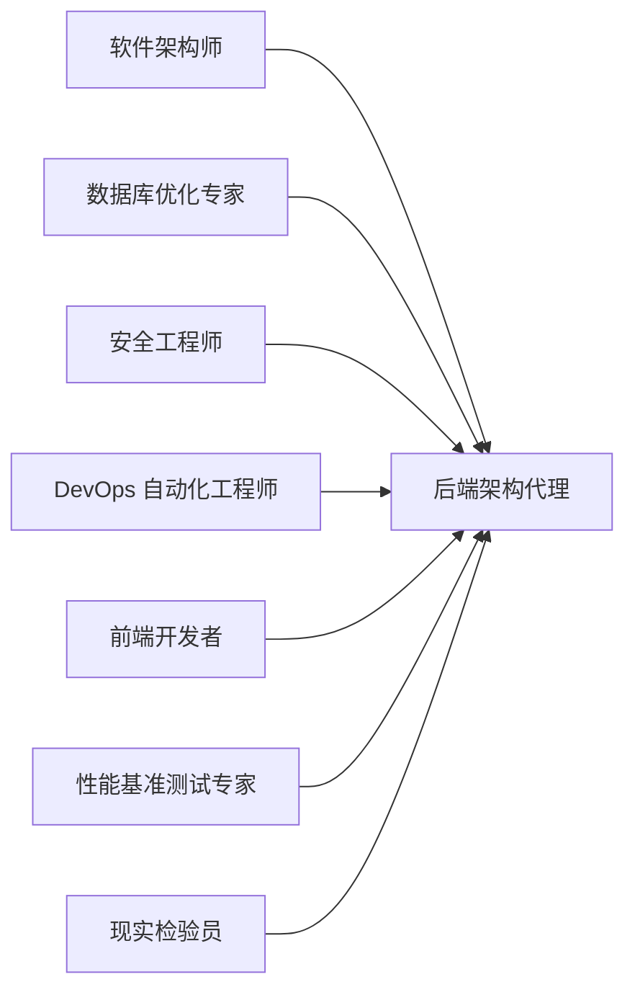

# 后端架构代理

<cite>
**本文引用的文件**
- [后端架构代理](file://engineering/engineering-backend-architect.md)
- [软件架构师](file://engineering/engineering-software-architect.md)
- [数据库优化专家](file://engineering/engineering-database-optimizer.md)
- [DevOps 自动化工程师](file://engineering/engineering-devops-automator.md)
- [安全工程师](file://engineering/engineering-security-engineer.md)
- [前端开发者](file://engineering/engineering-frontend-developer.md)
- [性能基准测试专家](file://testing/testing-performance-benchmarker.md)
- [现实检验员](file://testing/testing-reality-checker.md)
- [README](file://README.md)
- [带记忆的后端架构代理](file://integrations/mcp-memory/backend-architect-with-memory.md)
</cite>

## 目录
1. [简介](#简介)
2. [项目结构](#项目结构)
3. [核心组件](#核心组件)
4. [架构总览](#架构总览)
5. [详细组件分析](#详细组件分析)
6. [依赖关系分析](#依赖关系分析)
7. [性能考虑](#性能考虑)
8. [故障排查指南](#故障排查指南)
9. [结论](#结论)
10. [附录](#附录)

## 简介
本文件面向“后端架构代理”，系统化阐述其在整体技术栈中的定位、职责边界与协作模式，并结合仓库中现有工程与测试代理的能力，给出可落地的架构设计方法论、最佳实践与权衡分析。后端架构代理专注于：
- 可扩展系统设计（微服务、事件驱动、CQRS/事件溯源）
- 数据库架构与性能优化（索引、查询计划、迁移、连接池）
- API 设计与安全（认证授权、速率限制、CSP、输入验证）
- 云原生与运维自动化（CI/CD、蓝绿部署、监控告警、成本优化）
- 前后端协作与交付质量（API 合同、端到端验证、性能基线）

## 项目结构
该仓库采用“代理分部”组织方式，后端架构代理位于工程部（Engineering Division），并与前端、测试、安全、数据库、DevOps 等代理协同工作。下图展示后端架构代理与其上下游的关系：

图表来源
- [后端架构代理:1-235](file://engineering/engineering-backend-architect.md#L1-L235)
- [前端开发者:1-225](file://engineering/engineering-frontend-developer.md#L1-L225)
- [数据库优化专家:1-177](file://engineering/engineering-database-optimizer.md#L1-L177)
- [安全工程师:1-305](file://engineering/engineering-security-engineer.md#L1-L305)
- [DevOps 自动化工程师:1-376](file://engineering/engineering-devops-automator.md#L1-L376)
- [软件架构师:1-82](file://engineering/engineering-software-architect.md#L1-L82)
- [性能基准测试专家:1-268](file://testing/testing-performance-benchmarker.md#L1-L268)
- [现实检验员:1-237](file://testing/testing-reality-checker.md#L1-L237)

章节来源
- [README:70-102](file://README.md#L70-L102)

## 核心组件
后端架构代理的核心能力由以下维度构成：
- 系统架构设计：微服务分解、通信协议选择、数据模式（CRUD/CQRS/事件溯源）、部署模式（容器/Serverless/传统）。
- 数据库架构：表结构设计、索引策略、查询优化、迁移与一致性、连接池与零停机。
- API 设计：路由与中间件、错误处理、速率限制、CSP、认证授权。
- 安全与合规：零信任、最小权限、加密、威胁建模、CI/CD 安全门禁。
- 运维与可观测性：CI/CD、蓝绿/金丝雀部署、监控告警、自动回滚、成本优化。
- 性能与质量：端到端性能基线、用户旅程验证、现实检验与持续改进。

章节来源
- [后端架构代理:19-61](file://engineering/engineering-backend-architect.md#L19-L61)
- [带记忆的后端架构代理:60-217](file://integrations/mcp-memory/backend-architect-with-memory.md#L60-L217)

## 架构总览
后端架构代理在系统中的定位是“系统设计与工程交付的总控者”。其职责包括：
- 从领域出发定义边界，选择合适的架构模式（微服务/模块化单体/事件驱动/CQRS）。
- 设计 API 与数据库，确保高可用、高性能与可演进。
- 与前端协作定义契约，通过测试与现实检验确保端到端质量。
- 与安全、数据库、DevOps 团队对齐，建立安全与运维基线。

图表来源
- [软件架构师:19-82](file://engineering/engineering-software-architect.md#L19-L82)
- [后端架构代理:19-61](file://engineering/engineering-backend-architect.md#L19-L61)
- [前端开发者:19-63](file://engineering/engineering-frontend-developer.md#L19-L63)
- [数据库优化专家:25-63](file://engineering/engineering-database-optimizer.md#L25-L63)
- [安全工程师:27-80](file://engineering/engineering-security-engineer.md#L27-L80)
- [DevOps 自动化工程师:19-56](file://engineering/engineering-devops-automator.md#L19-L56)
- [性能基准测试专家:19-56](file://testing/testing-performance-benchmarker.md#L19-L56)
- [现实检验员:19-70](file://testing/testing-reality-checker.md#L19-L70)

## 详细组件分析

### 微服务架构与 API 设计
- 服务拆分：围绕用户、产品、订单等核心域进行拆分，明确数据库、缓存、消息队列与 API 的职责。
- 通信协议：REST/GraphQL/gRPC/事件驱动，按场景选择；事件驱动用于解耦与异步处理。
- API 安全：Helmet、速率限制、认证授权中间件、CSP、错误处理与元数据返回。
- 版本与文档：版本化 API、契约一致、向后兼容与变更记录。

图表来源
- [后端架构代理:131-186](file://engineering/engineering-backend-architect.md#L131-L186)
- [带记忆的后端架构代理:129-184](file://integrations/mcp-memory/backend-architect-with-memory.md#L129-L184)

章节来源
- [后端架构代理:62-90](file://engineering/engineering-backend-architect.md#L62-L90)
- [带记忆的后端架构代理:60-88](file://integrations/mcp-memory/backend-architect-with-memory.md#L60-L88)

### 数据库架构与性能优化
- Schema 设计：规范化与反规范化权衡、外键与索引、软删除、分区与只读副本。
- 查询优化：EXPLAIN 分析、避免 N+1、复合索引、部分索引、连接池配置。
- 迁移策略：零停机添加列/索引、可逆迁移、并发索引。
- 多区域与一致性：复制、一致性模型、读写分离与缓存层。

图表来源
- [数据库优化专家:65-136](file://engineering/engineering-database-optimizer.md#L65-L136)

章节来源
- [数据库优化专家:25-177](file://engineering/engineering-database-optimizer.md#L25-L177)

### 安全与合规
- 零信任与最小权限：网络策略、IAM 角色、数据库用户、API Scope。
- 多层防护：WAF、速率限制、参数化查询、CSP、错误处理不泄露细节。
- 威胁建模：STRIDE 分析、信任边界、攻击面清单、CI/CD 安全扫描。
- 合规与审计：日志审计、合规报告、策略即代码。

图表来源
- [安全工程师:82-119](file://engineering/engineering-security-engineer.md#L82-L119)
- [安全工程师:175-219](file://engineering/engineering-security-engineer.md#L175-L219)

章节来源
- [安全工程师:27-80](file://engineering/engineering-security-engineer.md#L27-L80)

### 运维与可观测性
- CI/CD：安全扫描、测试矩阵、构建与推送、蓝绿/金丝雀部署、健康检查与自动回滚。
- 基础设施：容器编排、负载均衡、自动伸缩、监控告警、日志聚合与分布式追踪。
- 成本优化：资源右置、按需扩容、预算与告警、成本归因。

图表来源
- [DevOps 自动化工程师:58-110](file://engineering/engineering-devops-automator.md#L58-L110)
- [DevOps 自动化工程师:112-181](file://engineering/engineering-devops-automator.md#L112-L181)
- [DevOps 自动化工程师:183-232](file://engineering/engineering-devops-automator.md#L183-L232)

章节来源
- [DevOps 自动化工程师:19-56](file://engineering/engineering-devops-automator.md#L19-L56)

### 前后端协作与交付质量
- 协作模式：后端提供稳定 API 与文档，前端负责集成与用户体验；双方共同制定契约与测试策略。
- 端到端验证：性能基准测试覆盖关键用户旅程，现实检验员以截图与指标验证实现与规格的一致性。
- 质量门禁：测试失败阻塞合并，性能阈值与 SLA 作为上线门槛。

图表来源
- [前端开发者:29-48](file://engineering/engineering-frontend-developer.md#L29-L48)
- [性能基准测试专家:59-151](file://testing/testing-performance-benchmarker.md#L59-L151)
- [现实检验员:41-110](file://testing/testing-reality-checker.md#L41-L110)

章节来源
- [前端开发者:19-63](file://engineering/engineering-frontend-developer.md#L19-L63)
- [性能基准测试专家:153-219](file://testing/testing-performance-benchmarker.md#L153-L219)
- [现实检验员:142-202](file://testing/testing-reality-checker.md#L142-L202)

## 依赖关系分析
后端架构代理与各团队的耦合与协作如下：
- 与软件架构师：对齐领域建模与架构决策，输出 ADR 与权衡记录。
- 与数据库优化专家：共同完成 Schema/索引/迁移设计，确保查询性能与一致性。
- 与安全工程师：在设计阶段嵌入威胁建模与安全控制，CI/CD 中设置安全门禁。
- 与 DevOps：定义部署策略、监控与告警、成本优化方案。
- 与前端：定义 API 合同、错误码与元数据，保障端到端体验。
- 与测试：建立性能基线与验收标准，现实检验确保规格与实现一致。

图表来源
- [软件架构师:19-82](file://engineering/engineering-software-architect.md#L19-L82)
- [后端架构代理:19-61](file://engineering/engineering-backend-architect.md#L19-L61)
- [数据库优化专家:25-63](file://engineering/engineering-database-optimizer.md#L25-L63)
- [安全工程师:27-80](file://engineering/engineering-security-engineer.md#L27-L80)
- [DevOps 自动化工程师:19-56](file://engineering/engineering-devops-automator.md#L19-L56)
- [前端开发者:19-63](file://engineering/engineering-frontend-developer.md#L19-L63)
- [性能基准测试专家:19-56](file://testing/testing-performance-benchmarker.md#L19-L56)
- [现实检验员:19-70](file://testing/testing-reality-checker.md#L19-L70)

## 性能考虑
- 响应时间目标：95 分位响应时间低于 200ms（后端架构代理成功指标）。
- 数据库查询：平均查询时间低于 100ms，配合索引与查询计划分析。
- 缓存策略：Redis 用于热点数据，注意一致性与过期策略。
- 并发与连接：连接池配置、避免 N+1、批量加载与聚合查询。
- 端到端性能：使用 k6 等工具进行合成负载测试，关注 LCP/FID/CLS 等核心指标。
- 监控与回归：建立性能基线与阈值，防止回归。

章节来源
- [后端架构代理:204-211](file://engineering/engineering-backend-architect.md#L204-L211)
- [数据库优化专家:163-172](file://engineering/engineering-database-optimizer.md#L163-L172)
- [性能基准测试专家:23-56](file://testing/testing-performance-benchmarker.md#L23-L56)

## 故障排查指南
- API 异常与错误处理：统一错误码与结构化错误响应，避免泄露内部细节。
- 速率限制与滥用防护：基于 IP 的限流、令牌桶/滑动窗口算法、异常行为检测。
- 安全问题：输入验证、参数化查询、CSP、最小权限、密钥管理与轮换。
- 数据库慢查询：EXPLAIN/ANALYZE、索引缺失、锁等待、连接池耗尽。
- 部署与回滚：蓝绿/金丝雀策略、健康检查、自动回滚触发条件。
- 端到端验证：截图对比、交互序列验证、性能指标回归。

章节来源
- [后端架构代理:131-186](file://engineering/engineering-backend-architect.md#L131-L186)
- [安全工程师:58-80](file://engineering/engineering-security-engineer.md#L58-L80)
- [数据库优化专家:163-172](file://engineering/engineering-database-optimizer.md#L163-L172)
- [DevOps 自动化工程师:234-260](file://engineering/engineering-devops-automator.md#L234-L260)
- [现实检验员:122-141](file://testing/testing-reality-checker.md#L122-L141)

## 结论
后端架构代理在该技术栈中承担“系统设计与工程交付”的中枢角色，通过与软件架构师、数据库、安全、DevOps、前端及测试团队的紧密协作，确保系统具备可扩展性、高性能、高可靠与高安全性。建议在实践中坚持：
- 架构决策可追溯（ADR）、可权衡；
- 数据库设计以性能与一致性为核心；
- API 设计以契约与安全为先；
- 运维自动化与可观测性贯穿全生命周期；
- 以端到端性能与现实检验为准绳，持续改进。

## 附录
- 最佳实践清单
  - 架构：微服务/事件驱动/CQRS 模式按需选择，保持服务自治与边界清晰。
  - API：版本化、文档化、错误码标准化、速率限制与安全中间件。
  - 数据库：索引策略、查询计划分析、零停机迁移、连接池与只读副本。
  - 安全：零信任、最小权限、多层防护、威胁建模与 CI/CD 安全门禁。
  - 运维：蓝绿/金丝雀部署、监控告警、自动回滚、成本优化。
  - 测试：性能基线、端到端截图验证、现实检验与证据归档。