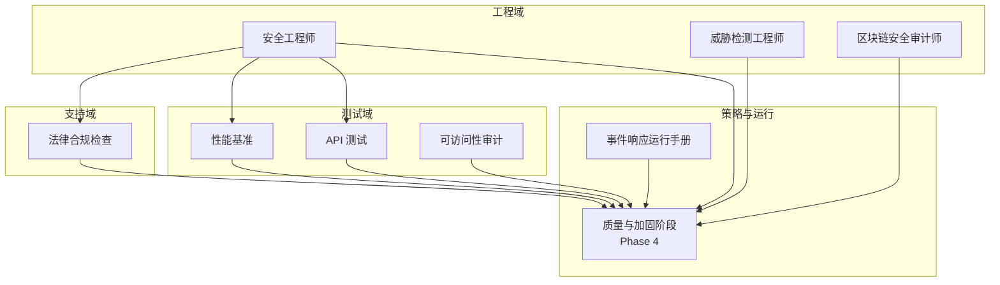
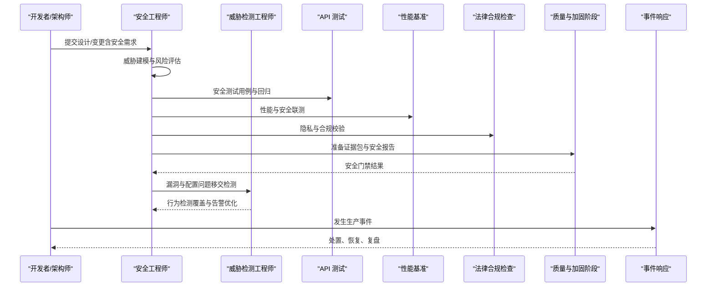
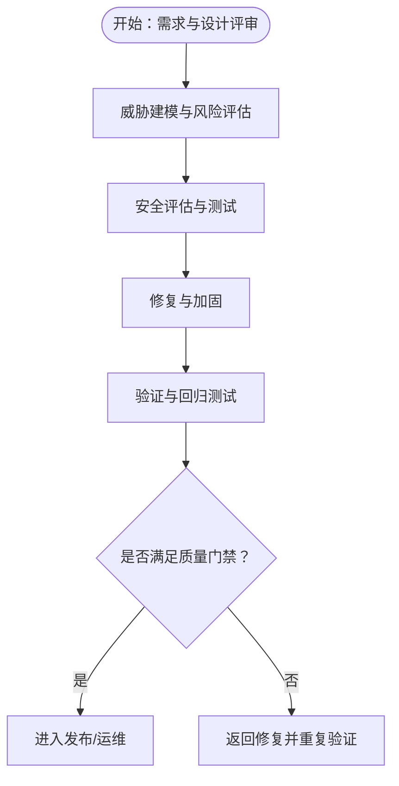
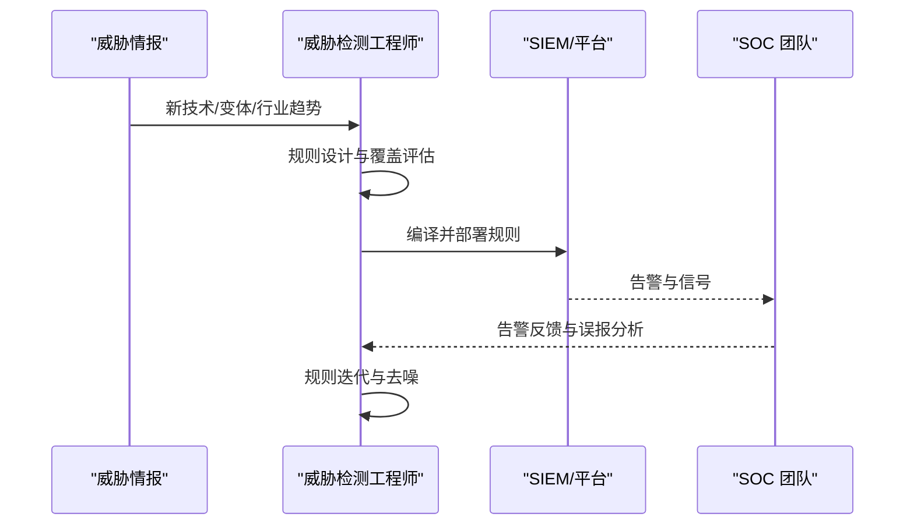
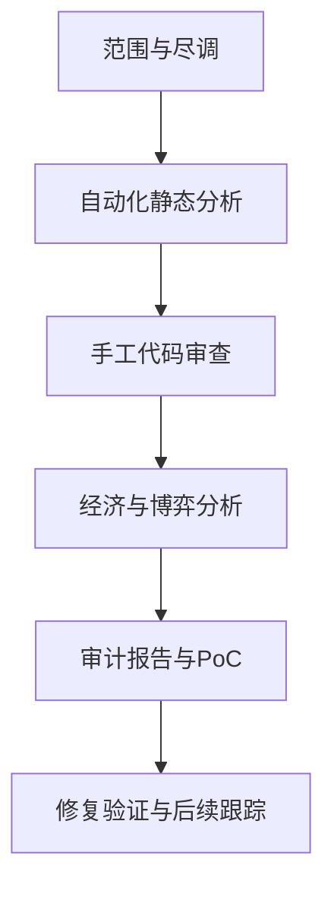
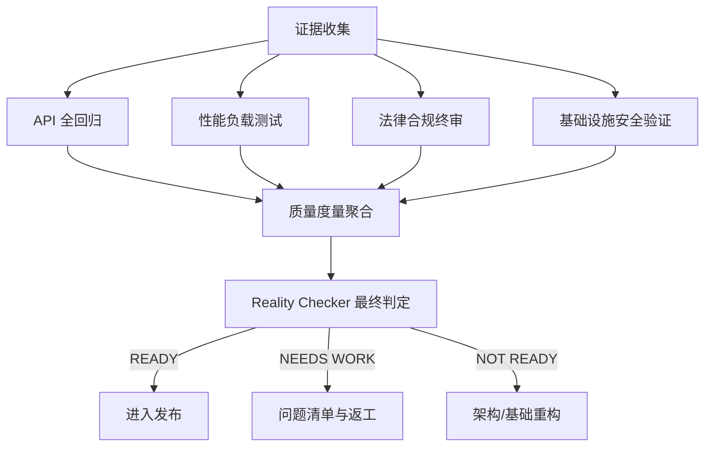
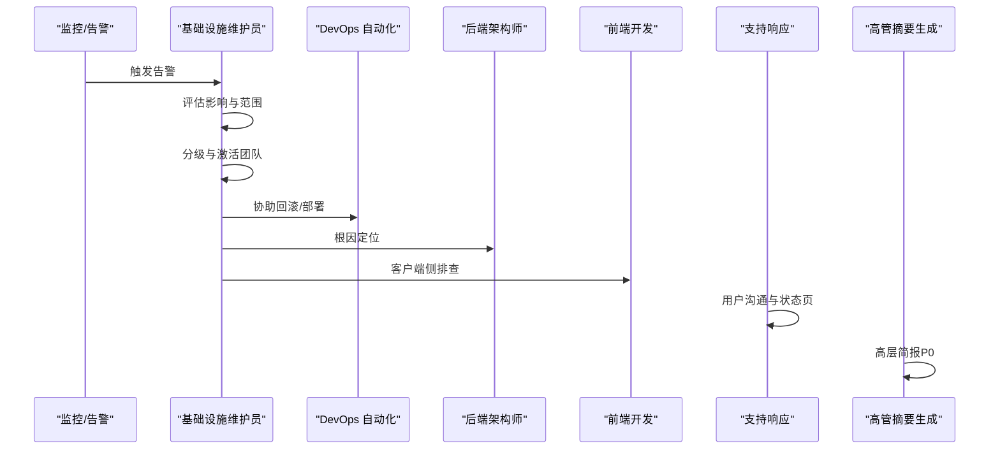
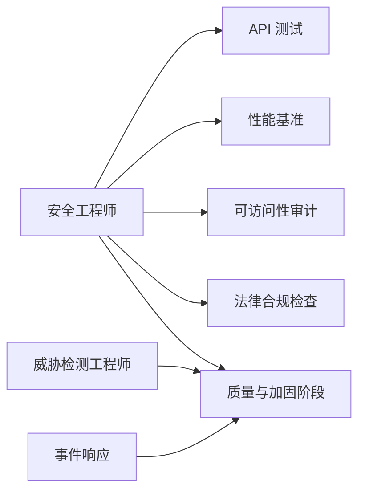

# 安全工程代理

<cite>
**本文引用的文件**
- [security-engineer.md](file://engineering/engineering-security-engineer.md)
- [threat-detection-engineer.md](file://engineering/engineering-threat-detection-engineer.md)
- [blockchain-security-auditor.md](file://specialized/blockchain-security-auditor.md)
- [phase-4-hardening.md](file://strategy/playbooks/phase-4-hardening.md)
- [scenario-incident-response.md](file://strategy/runbooks/scenario-incident-response.md)
- [testing-api-tester.md](file://testing/testing-api-tester.md)
- [support-legal-compliance-checker.md](file://support/support-legal-compliance-checker.md)
- [testing-accessibility-auditor.md](file://testing/testing-accessibility-auditor.md)
- [testing-performance-benchmarker.md](file://testing/testing-performance-benchmarker.md)
</cite>

## 目录
1. [简介](#简介)
2. [项目结构](#项目结构)
3. [核心组件](#核心组件)
4. [架构总览](#架构总览)
5. [详细组件分析](#详细组件分析)
6. [依赖关系分析](#依赖关系分析)
7. [性能与韧性考量](#性能与韧性考量)
8. [故障排查指南](#故障排查指南)
9. [结论](#结论)
10. [附录](#附录)

## 简介
本文件面向“安全工程代理”，系统化阐述其在现代软件与平台生命周期中的专业职责与方法论，覆盖网络安全、应用安全、数据保护、漏洞评估、威胁建模、安全测试、供应链与依赖安全、云与基础设施安全、AI/LLM应用安全、以及事件响应与合规保障等关键领域。文档同时给出从安全需求分析、威胁评估到安全措施部署的完整流程，并通过实战案例帮助读者理解不同攻击类型的防护策略与应急响应方案。

## 项目结构
该仓库以“代理（Agent）”为核心组织单元，按职能域划分：工程、设计、营销、产品、支持、测试、策略与运行手册等。安全工程代理相关的能力主要分布在以下模块：
- 工程域：安全工程师、威胁检测工程师、区块链安全审计师
- 策略与运行：质量与加固阶段（Phase 4）、事件响应运行手册
- 测试域：API 测试、性能基准、可访问性审计
- 支持域：法律与合规检查

图表来源
- [security-engineer.md:1-305](file://engineering/engineering-security-engineer.md#L1-L305)
- [threat-detection-engineer.md:1-535](file://engineering/engineering-threat-detection-engineer.md#L1-L535)
- [blockchain-security-auditor.md:1-464](file://specialized/blockchain-security-auditor.md#L1-L464)
- [phase-4-hardening.md:1-333](file://strategy/playbooks/phase-4-hardening.md#L1-L333)
- [scenario-incident-response.md:1-218](file://strategy/runbooks/scenario-incident-response.md#L1-L218)
- [testing-api-tester.md:1-306](file://testing/testing-api-tester.md#L1-L306)
- [testing-performance-benchmarker.md:1-268](file://testing/testing-performance-benchmarker.md#L1-L268)
- [testing-accessibility-auditor.md:1-317](file://testing/testing-accessibility-auditor.md#L1-L317)
- [support-legal-compliance-checker.md:1-588](file://support/support-legal-compliance-checker.md#L1-L588)

章节来源
- [security-engineer.md:1-305](file://engineering/engineering-security-engineer.md#L1-L305)
- [threat-detection-engineer.md:1-535](file://engineering/engineering-threat-detection-engineer.md#L1-L535)
- [blockchain-security-auditor.md:1-464](file://specialized/blockchain-security-auditor.md#L1-L464)
- [phase-4-hardening.md:1-333](file://strategy/playbooks/phase-4-hardening.md#L1-L333)
- [scenario-incident-response.md:1-218](file://strategy/runbooks/scenario-incident-response.md#L1-L218)
- [testing-api-tester.md:1-306](file://testing/testing-api-tester.md#L1-L306)
- [testing-performance-benchmarker.md:1-268](file://testing/testing-performance-benchmarker.md#L1-L268)
- [testing-accessibility-auditor.md:1-317](file://testing/testing-accessibility-auditor.md#L1-L317)
- [support-legal-compliance-checker.md:1-588](file://support/support-legal-compliance-checker.md#L1-L588)

## 核心组件
- 安全工程师：负责威胁建模、漏洞评估、安全代码审查、安全架构设计、CI/CD 安全门禁、API/应用安全测试、云与基础设施安全、AI/LLM 应用安全、事件响应等。
- 威胁检测工程师：负责 SIEM 规则开发、MITRE ATT&CK 覆盖映射、威胁狩猎、告警调优、检测即代码流水线、检测成熟度与度量。
- 区块链安全审计师：负责智能合约漏洞检测、形式化验证、静态分析、经济博弈与游戏理论分析、审计报告与应急响应。
- 质量与加固阶段（Phase 4）：在发布前进行证据收集、API 全回归、性能负载测试、法律合规终审、基础设施安全验证与最终判定。
- 事件响应运行手册：定义严重级别、响应团队、处置流程、恢复验证与复盘闭环。
- API 测试、性能基准、可访问性审计：作为安全质量门禁的重要支撑，确保功能、性能与安全三者协同达标。
- 法律合规检查：覆盖隐私与数据保护、合同与法律条款、跨境数据传输与多司法管辖区合规。

章节来源
- [security-engineer.md:1-305](file://engineering/engineering-security-engineer.md#L1-L305)
- [threat-detection-engineer.md:1-535](file://engineering/engineering-threat-detection-engineer.md#L1-L535)
- [blockchain-security-auditor.md:1-464](file://specialized/blockchain-security-auditor.md#L1-L464)
- [phase-4-hardening.md:1-333](file://strategy/playbooks/phase-4-hardening.md#L1-L333)
- [scenario-incident-response.md:1-218](file://strategy/runbooks/scenario-incident-response.md#L1-L218)
- [testing-api-tester.md:1-306](file://testing/testing-api-tester.md#L1-L306)
- [testing-performance-benchmarker.md:1-268](file://testing/testing-performance-benchmarker.md#L1-L268)
- [testing-accessibility-auditor.md:1-317](file://testing/testing-accessibility-auditor.md#L1-L317)
- [support-legal-compliance-checker.md:1-588](file://support/support-legal-compliance-checker.md#L1-L588)

## 架构总览
安全工程代理贯穿 SDLC 的每个阶段，形成“预防—检测—响应—加固”的闭环。下图展示了各代理之间的协作关系与数据流。

图表来源
- [security-engineer.md:221-262](file://engineering/engineering-security-engineer.md#L221-L262)
- [threat-detection-engineer.md:444-469](file://engineering/engineering-threat-detection-engineer.md#L444-L469)
- [phase-4-hardening.md:32-255](file://strategy/playbooks/phase-4-hardening.md#L32-L255)
- [scenario-incident-response.md:51-184](file://strategy/runbooks/scenario-incident-response.md#L51-L184)

## 详细组件分析

### 安全工程师（应用安全与架构）
- 职责边界
  - 将安全集成到 SDLC：设计、实现、测试、部署、运营全周期嵌入安全门禁与控制。
  - 威胁建模与风险优先级：STRIDE 分析、信任边界、攻击面清单。
  - 漏洞评估与安全测试：注入类、XSS、CSRF、SSRF、认证/授权缺陷、业务逻辑缺陷、API 安全、云安全。
  - 安全架构与加固：零信任、最小权限、纵深防御、认证体系、授权模型、密钥与凭据管理、加密策略。
  - 供应链与依赖安全：CVE 审计、SBOM、完整性校验、依赖混淆与仿冒攻击防护。
- 关键交付物
  - 威胁模型文档、安全代码审查模式、CI/CD 安全流水线（SAST/DAST/SCA/秘密检测）。
- 实施流程
  - 阶段一：侦察与威胁建模；阶段二：安全评估；阶段三：修复与加固；阶段四：验证与回归测试。
- 通信风格
  - 明确风险、量化影响、解释“为什么”、提供可复制的修复方案。

图表来源
- [security-engineer.md:221-262](file://engineering/engineering-security-engineer.md#L221-L262)

章节来源
- [security-engineer.md:27-305](file://engineering/engineering-security-engineer.md#L27-L305)

### 威胁检测工程师（检测与告警优化）
- 职责边界
  - 检测规则工程：Sigma 可移植规则，编译到 Splunk/KQL/Elastic 等目标平台。
  - MITRE ATT&CK 覆盖映射与路线图：基于威胁情报与真实攻击场景优先填补高风险缺口。
  - 威胁狩猎：基于情报与异常分析的结构化狩猎，将发现固化为自动化规则。
  - 告警优化：降低误报率、提升信号信噪比、日志源完整性与可用性保障。
- 关键交付物
  - Sigma 规则、编译后的查询、MITRE 覆盖评估报告、检测目录元数据、检测流水线（CI/CD）。
- 实施流程
  - 智能驱动优先级 → 检测开发 → 日志源验证 → 测试与验证 → 部署与监控 → 持续改进。

图表来源
- [threat-detection-engineer.md:444-469](file://engineering/engineering-threat-detection-engineer.md#L444-L469)

章节来源
- [threat-detection-engineer.md:19-535](file://engineering/engineering-threat-detection-engineer.md#L19-L535)

### 区块链安全审计师（DeFi/智能合约）
- 职责边界
  - 漏洞检测：重入、访问控制、整数溢出/下溢、预言机操纵、闪兑攻击、前端跑、阻断服务等。
  - 形式化验证与静态分析：工具初筛 + 手工深度审查 + 属性测试 + 经济博弈建模。
  - 报告与应急：可复现 PoC、修复建议、事后复盘与救援。
- 关键交付物
  - 漏洞分析与 PoC、Slither/Mythril/Echidna 等工具报告、审计报告模板、Foundry PoC。
- 实施流程
  - 范围与尽调 → 自动化分析 → 手工代码审查 → 经济与博弈分析 → 报告与修复验证。

图表来源
- [blockchain-security-auditor.md:366-401](file://specialized/blockchain-security-auditor.md#L366-L401)

章节来源
- [blockchain-security-auditor.md:20-464](file://specialized/blockchain-security-auditor.md#L20-L464)

### 质量与加固阶段（Phase 4）
- 目标：在发布前进行“现实检验”，确保端到端用户旅程、跨设备一致性、性能、安全与合规均达标。
- 关键活动
  - 证据收集：视觉截图、交互证据、主题与错误状态证据。
  - API 全回归：端点覆盖、鉴权/授权、输入验证、错误响应、集成与并发处理。
  - 性能负载测试：10× 预期流量、响应时间分布、核心 Web 指标、数据库与资源利用。
  - 法律合规终审：隐私政策、数据主体权利、加密、OWASP Top 10、监管合规、可访问性。
  - 基础设施安全验证：健康状态、自动伸缩、负载均衡、证书、监控与告警、灾备与密管。
  - 最终判定：Reality Checker 的“READY/NEEDS WORK/NOT READY”三档决策与返工路径。
- 质量门禁清单：用户旅程完成、跨设备一致、性能达标、安全无危、合规齐全、规格符合、基础设施就绪。

图表来源
- [phase-4-hardening.md:32-255](file://strategy/playbooks/phase-4-hardening.md#L32-L255)

章节来源
- [phase-4-hardening.md:7-333](file://strategy/playbooks/phase-4-hardening.md#L7-L333)

### 事件响应运行手册
- 严重级别：P0（服务完全中断/数据泄露）、P1（重大功能故障/显著性能退化）、P2（次要功能/可绕过）、P3（外观问题）。
- 响应团队：按级别分配，明确指挥官、回滚/部署、根因调查、UI/客户端诊断、用户沟通、高层简报。
- 处置流程：检测与分诊 → 并行调查 → 决策树（回滚/扩容/热修复/外部依赖降级）→ 验证与恢复 → 复盘与改进。
- 沟通模板：状态页更新、高层简报、升级矩阵（数据泄露、收入影响、监管通知）。

图表来源
- [scenario-incident-response.md:51-184](file://strategy/runbooks/scenario-incident-response.md#L51-L184)

章节来源
- [scenario-incident-response.md:7-218](file://strategy/runbooks/scenario-incident-response.md#L7-L218)

### API 测试（安全与性能）
- 能力要点：功能、性能、安全三合一测试框架；自动化套件覆盖；契约测试；CI/CD 集成；生产监控与告警。
- 关注重点：鉴权/授权、输入净化、SQL 注入防护、速率限制、并发与超载表现、错误处理与可观测性。
- 报告模板：覆盖率、性能指标、安全评估、问题与建议、发布建议。

章节来源
- [testing-api-tester.md:19-306](file://testing/testing-api-tester.md#L19-L306)

### 性能基准（Web 性能与容量规划）
- 能力要点：负载/压力/耐久/扩展性测试；Core Web Vitals 优化；容量规划与自动伸缩；RUM 与预测告警。
- 关注重点：响应时间、吞吐量、错误率、资源利用率、数据库性能、CDN 与缓存策略。
- 报告模板：测试结果、瓶颈分析、ROI 与成本节省、优化建议与持续监控。

章节来源
- [testing-performance-benchmarker.md:19-268](file://testing/testing-performance-benchmarker.md#L19-L268)

### 可访问性审计（WCAG 与辅助技术）
- 能力要点：WCAG 2.2 AA/AAA 评估；屏幕阅读器、键盘导航、缩放与对比度测试；认知无障碍；人工与自动化结合。
- 关注重点：焦点顺序、语义标记、ARIA 正确使用、动态内容公告、表单与表格可访问性。
- 报告模板：问题清单、WCAG 条款、严重性分级、修复建议与再审计计划。

章节来源
- [testing-accessibility-auditor.md:19-317](file://testing/testing-accessibility-auditor.md#L19-L317)

### 法律合规检查（隐私与数据保护）
- 能力要点：GDPR/CCPA/HIPAA/PCI-DSS 等合规框架；隐私政策生成与校验；合同审查与风险评估；多司法管辖区合规；跨境数据传输。
- 关注重点：数据分类与处理目的、用户权利实现、数据泄露响应、供应商合规、培训与文化。
- 报告模板：合规状态概览、风险评估、行动项、路线图与成功度量。

章节来源
- [support-legal-compliance-checker.md:19-588](file://support/support-legal-compliance-checker.md#L19-L588)

## 依赖关系分析
- 安全工程师对 API 测试、性能基准、可访问性审计、法律合规检查形成“质量门禁依赖”，并在 Phase 4 中统一验收。
- 威胁检测工程师与安全工程师形成“预防—检测”闭环：前者通过 MITRE 覆盖与狩猎弥补后者未覆盖的行为特征。
- 事件响应运行手册为所有组件提供统一的应急处置与复盘机制，确保问题可追踪、可沉淀、可改进。

图表来源
- [security-engineer.md:221-262](file://engineering/engineering-security-engineer.md#L221-L262)
- [threat-detection-engineer.md:444-469](file://engineering/engineering-threat-detection-engineer.md#L444-L469)
- [phase-4-hardening.md:32-255](file://strategy/playbooks/phase-4-hardening.md#L32-L255)
- [scenario-incident-response.md:51-184](file://strategy/runbooks/scenario-incident-response.md#L51-L184)

章节来源
- [security-engineer.md:221-262](file://engineering/engineering-security-engineer.md#L221-L262)
- [threat-detection-engineer.md:444-469](file://engineering/engineering-threat-detection-engineer.md#L444-L469)
- [phase-4-hardening.md:32-255](file://strategy/playbooks/phase-4-hardening.md#L32-L255)
- [scenario-incident-response.md:51-184](file://strategy/runbooks/scenario-incident-response.md#L51-L184)

## 性能与韧性考量
- 安全测试与性能测试需协同：在高负载下暴露隐藏的认证绕过、速率限制绕过、错误信息泄漏等问题。
- 检测成熟度与告警噪音：通过误报率、MTTD、TP/FP 比例等指标衡量检测体系有效性，避免“静默的 SIEM”。
- 合规与安全的耦合：隐私与数据保护要求直接影响安全控制的设计与部署，如最小化原则、加密与可追溯性。
- 可访问性与安全：可访问性测试中发现的焦点陷阱、动态内容未公告等问题，可能成为可被利用的 UXSS 或会话劫持入口。

[本节为通用指导，无需特定文件来源]

## 故障排查指南
- 常见问题定位
  - 认证绕过：检查令牌验证、会话管理、MFA 强制、速率限制与账户锁定策略。
  - 输入验证缺失：确认边界值、特殊字符、超长载荷、意外字段的处理与日志记录。
  - 错误信息泄漏：统一错误响应、脱敏堆栈与内部细节、审计日志与最小披露。
  - 供应链风险：依赖版本与 CVE、SBOM 与完整性校验、依赖混淆与仿冒检测。
- 快速验证清单
  - 是否有 SAST/DAST/SCA/秘密检测的 CI 门禁？
  - 是否针对 OWASP API Security Top 10 进行了安全回归？
  - 是否在 10× 预期流量下验证了性能与安全阈值？
  - 是否具备可执行的应急响应流程与演练记录？

章节来源
- [security-engineer.md:36-50](file://engineering/engineering-security-engineer.md#L36-L50)
- [testing-api-tester.md:42-57](file://testing/testing-api-tester.md#L42-L57)
- [testing-performance-benchmarker.md:42-56](file://testing/testing-performance-benchmarker.md#L42-L56)

## 结论
安全工程代理通过“预防—检测—响应—加固”的闭环，将安全能力嵌入到产品全生命周期。它不仅关注技术层面的漏洞与配置风险，更强调与法律合规、性能与可访问性的协同，确保系统在真实世界中既安全又可用、既高效又可治理。借助标准化的威胁建模、检测工程化、质量门禁与事件响应流程，团队可以持续降低风险、提升韧性，并在发布前与发布后都保持对安全态势的掌控。

[本节为总结性内容，无需特定文件来源]

## 附录

### 安全实施流程（从需求到部署）
- 安全需求分析：识别数据分类、威胁场景、合规要求与业务影响。
- 威胁建模：STRIDE/ATT&CK 映射、信任边界、攻击面清单与风险排序。
- 安全评估：代码审查、依赖审计、配置审查、认证/授权测试、基础设施安全审查。
- 修复与加固：优先级修复、安全头与 CSP、输入验证层、CI/CD 安全门禁、监控与告警。
- 验证与回归：安全测试先行、回归测试、指标跟踪与度量。
- 质量门禁：证据收集、API 全回归、性能负载测试、法律合规终审、基础设施安全验证、Reality Checker 判定。
- 发布与运营：灰度/蓝绿部署、回滚预案、监控告警、事件响应与复盘。

章节来源
- [security-engineer.md:221-262](file://engineering/engineering-security-engineer.md#L221-L262)
- [phase-4-hardening.md:32-255](file://strategy/playbooks/phase-4-hardening.md#L32-L255)

### 实战案例与防护策略
- 注入类攻击（SQLi/NoSQLi/CMDi/模板注入）
  - 防护：参数化查询/ORM、输入白名单、输出编码、最小权限与只读访问。
  - 应急：快速隔离受影响端点、速率限制、临时关闭或降级。
- XSS（反射/存储/DOM）
  - 防护：CSP、严格的输出编码、HttpOnly/SameSite/Secure Cookie、DOMSanitizer。
  - 应急：临时移除可疑脚本、回滚到已知安全版本。
- CSRF
  - 防护：SameSite Cookie、CSRF Token、Origin/Referer 校验、双提交 Cookie。
  - 应急：强制重新认证、撤销受影响会话。
- SSRF
  - 防护：白名单域名、禁止内网直连、反向代理与网络隔离。
  - 应急：临时关闭相关接口、网络策略收紧。
- 认证/授权缺陷（IDOR/越权/角色提升）
  - 防护：最小权限、服务端强制授权、RBAC/ABAC、会话隔离、审计日志。
  - 应急：强制重新认证、撤销权限、临时封禁可疑账户。
- API 安全（BOLA/BFLA/过度暴露/GraphQL 攻击）
  - 防护：细粒度权限、速率限制、查询复杂度限制、输入验证与白名单。
  - 应急：临时限流、禁用高风险端点、回滚变更。
- 云安全（IAM 过特权/公开存储/网络分割/密钥泄露）
  - 防护：最小权限、加密、网络隔离、密钥轮换与密管。
  - 应急：回收密钥、收紧 IAM 策略、网络策略回滚。
- 供应链与依赖（CVE/依赖混淆/仿冒）
  - 防护：SBOM、完整性校验、Pin 依赖、镜像签名与锁文件。
  - 应急：替换受影响依赖、回滚到受支持版本。
- 事件响应（P0-P3 分级）
  - 防护：分级响应团队、回滚/扩容/热修复/外部依赖降级、状态页与高层简报。
  - 应急：快速定位、最小化影响面、恢复验证与复盘。

章节来源
- [security-engineer.md:36-50](file://engineering/engineering-security-engineer.md#L36-L50)
- [scenario-incident-response.md:11-50](file://strategy/runbooks/scenario-incident-response.md#L11-L50)