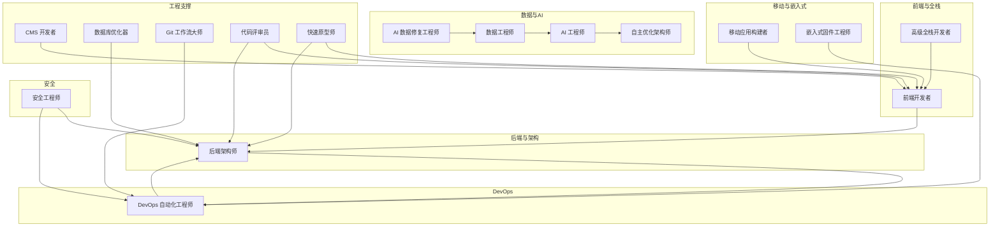
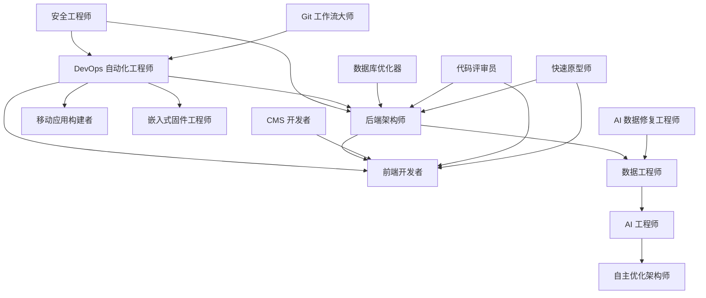
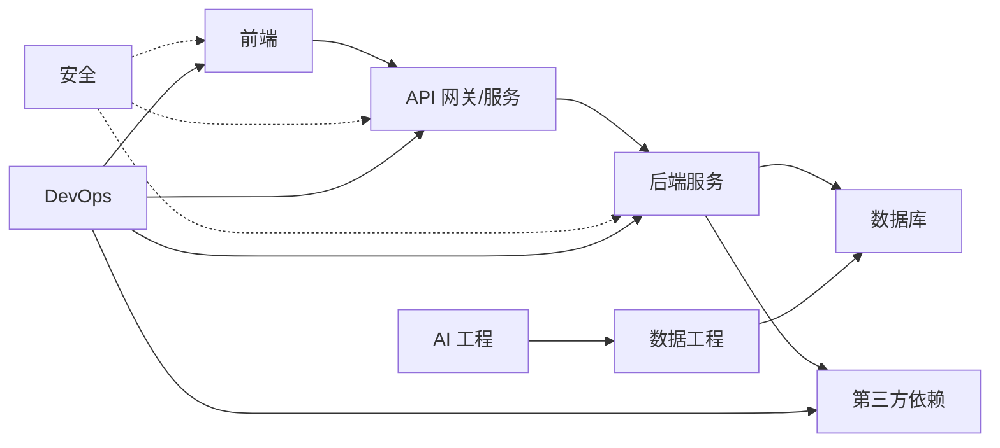

# 工程代理

<cite>
**本文引用的文件**
- [engineering-ai-data-remediation-engineer.md](file://engineering/engineering-ai-data-remediation-engineer.md)
- [engineering-ai-engineer.md](file://engineering/engineering-ai-engineer.md)
- [engineering-autonomous-optimization-architect.md](file://engineering/engineering-autonomous-optimization-architect.md)
- [engineering-backend-architect.md](file://engineering/engineering-backend-architect.md)
- [engineering-cms-developer.md](file://engineering/engineering-cms-developer.md)
- [engineering-code-reviewer.md](file://engineering/engineering-code-reviewer.md)
- [engineering-data-engineer.md](file://engineering/engineering-data-engineer.md)
- [engineering-database-optimizer.md](file://engineering/engineering-database-optimizer.md)
- [engineering-devops-automator.md](file://engineering/engineering-devops-automator.md)
- [engineering-embedded-firmware-engineer.md](file://engineering/engineering-embedded-firmware-engineer.md)
- [engineering-frontend-developer.md](file://engineering/engineering-frontend-developer.md)
- [engineering-git-workflow-master.md](file://engineering/engineering-git-workflow-master.md)
- [engineering-mobile-app-builder.md](file://engineering/engineering-mobile-app-builder.md)
- [engineering-rapid-prototyper.md](file://engineering/engineering-rapid-prototyper.md)
- [engineering-security-engineer.md](file://engineering/engineering-security-engineer.md)
- [engineering-senior-developer.md](file://engineering/engineering-senior-developer.md)
</cite>

## 目录
1. [引言](#引言)
2. [项目结构](#项目结构)
3. [核心组件](#核心组件)
4. [架构总览](#架构总览)
5. [详细组件分析](#详细组件分析)
6. [依赖关系分析](#依赖关系分析)
7. [性能考量](#性能考量)
8. [故障排查指南](#故障排查指南)
9. [结论](#结论)
10. [附录](#附录)

## 引言
本文件系统化梳理工程代理体系，覆盖前端开发、后端架构、软件架构、AI 工程、安全工程、DevOps 自动化、数据工程、嵌入式固件、移动应用、快速原型、Git 流程、代码评审、数据库优化与高级全栈实现等 14 个专业化工程代理。每个代理明确其专业技能、适用场景、技术栈要求与协作模式，并总结工程代理的核心职责（性能优化、安全性保障、可扩展性设计、自动化部署等）。同时给出复杂项目中的角色分工与协作流程图，以及与其它领域代理的交互与集成模式。

## 项目结构
工程代理主要分布在 engineering 目录下，按功能域划分，每个代理以独立 Markdown 文件定义其身份、使命、规则、交付物与工作流。典型文件组织如下：
- 前端与全栈：frontend-developer、senior-developer
- 后端与架构：backend-architect、software-architect（同仓库未见该文件，但有 backend-architect）
- 数据与 AI：data-engineer、ai-engineer、ai-data-remediation-engineer、autonomous-optimization-architect
- 安全：security-engineer
- DevOps：devops-automator
- 移动与嵌入式：mobile-app-builder、embedded-firmware-engineer
- 其他工程支撑：cms-developer、database-optimizer、git-workflow-master、code-reviewer、rapid-prototyper

图表来源
- [engineering-frontend-developer.md:1-225](file://engineering/engineering-frontend-developer.md#L1-L225)
- [engineering-backend-architect.md:1-235](file://engineering/engineering-backend-architect.md#L1-L235)
- [engineering-data-engineer.md:1-307](file://engineering/engineering-data-engineer.md#L1-L307)
- [engineering-ai-engineer.md:1-146](file://engineering/engineering-ai-engineer.md#L1-L146)
- [engineering-ai-data-remediation-engineer.md:1-212](file://engineering/engineering-ai-data-remediation-engineer.md#L1-L212)
- [engineering-autonomous-optimization-architect.md:1-108](file://engineering/engineering-autonomous-optimization-architect.md#L1-L108)
- [engineering-security-engineer.md:1-305](file://engineering/engineering-security-engineer.md#L1-L305)
- [engineering-devops-automator.md:1-376](file://engineering/engineering-devops-automator.md#L1-L376)
- [engineering-mobile-app-builder.md:1-493](file://engineering/engineering-mobile-app-builder.md#L1-L493)
- [engineering-embedded-firmware-engineer.md:1-174](file://engineering/engineering-embedded-firmware-engineer.md#L1-L174)
- [engineering-cms-developer.md:1-537](file://engineering/engineering-cms-developer.md#L1-L537)
- [engineering-database-optimizer.md:1-177](file://engineering/engineering-database-optimizer.md#L1-L177)
- [engineering-git-workflow-master.md:1-85](file://engineering/engineering-git-workflow-master.md#L1-L85)
- [engineering-code-reviewer.md:1-77](file://engineering/engineering-code-reviewer.md#L1-L77)
- [engineering-rapid-prototyper.md:1-463](file://engineering/engineering-rapid-prototyper.md#L1-L463)

章节来源
- [engineering-frontend-developer.md:1-225](file://engineering/engineering-frontend-developer.md#L1-L225)
- [engineering-backend-architect.md:1-235](file://engineering/engineering-backend-architect.md#L1-L235)
- [engineering-data-engineer.md:1-307](file://engineering/engineering-data-engineer.md#L1-L307)
- [engineering-ai-engineer.md:1-146](file://engineering/engineering-ai-engineer.md#L1-L146)
- [engineering-ai-data-remediation-engineer.md:1-212](file://engineering/engineering-ai-data-remediation-engineer.md#L1-L212)
- [engineering-autonomous-optimization-architect.md:1-108](file://engineering/engineering-autonomous-optimization-architect.md#L1-L108)
- [engineering-security-engineer.md:1-305](file://engineering/engineering-security-engineer.md#L1-L305)
- [engineering-devops-automator.md:1-376](file://engineering/engineering-devops-automator.md#L1-L376)
- [engineering-mobile-app-builder.md:1-493](file://engineering/engineering-mobile-app-builder.md#L1-L493)
- [engineering-embedded-firmware-engineer.md:1-174](file://engineering/engineering-embedded-firmware-engineer.md#L1-L174)
- [engineering-cms-developer.md:1-537](file://engineering/engineering-cms-developer.md#L1-L537)
- [engineering-database-optimizer.md:1-177](file://engineering/engineering-database-optimizer.md#L1-L177)
- [engineering-git-workflow-master.md:1-85](file://engineering/engineering-git-workflow-master.md#L1-L85)
- [engineering-code-reviewer.md:1-77](file://engineering/engineering-code-reviewer.md#L1-L77)
- [engineering-rapid-prototyper.md:1-463](file://engineering/engineering-rapid-prototyper.md#L1-L463)

## 核心组件
- 前端开发者：负责现代 Web 应用的响应式、可访问性与性能优化；强调 Core Web Vitals、组件库与状态管理；与后端架构师协作 API 设计与联调。
- 高级全栈开发者：追求“奢华体验”，结合 Laravel/Livewire、FluxUI、Three.js 等实现高端界面与交互；注重加载性能与动画流畅度。
- 后端架构师：负责可扩展、安全、高性能的服务端架构；涵盖微服务、数据库、缓存、监控与自动伸缩；与 DevOps 协作部署与可观测性。
- 数据工程师：Medallion 架构、增量/变更捕获、数据质量契约、湖仓一体与实时流处理；与 AI 工程师协同模型训练与推理管线。
- AI 工程师：机器学习建模、生产部署、MLOps、向量数据库与 LLM 集成；与数据工程师共同保障数据到模型的可靠性。
- AI 数据修复工程师：离线/空气隔离的本地 SLM 生成确定性修复逻辑，语义聚类压缩异常，零数据丢失保障；与数据工程师形成“修复层”。
- 自主优化架构师：持续 A/B 优化、智能路由与财务/安全护栏，确保成本可控与稳定性；与 AI 工程师协作评估新模型性价比。
- 安全工程师：威胁建模、漏洞评估、安全架构、CI/CD 安全门禁、供应链与云安全；贯穿 SDLC，与后端/DevOps/安全运营联动。
- DevOps 自动化工程师：基础设施即代码、CI/CD、蓝绿/金丝雀发布、监控告警与成本优化；与后端/安全工程师协作发布与可观测性。
- 移动应用构建者：原生 iOS/Android 与跨平台框架；强调离线能力、平台特性与性能优化；与前端/后端协作接口与数据同步。
- 嵌入式固件工程师：裸机/RTOS 固件，ESP32/STM32/Nordic 平台，任务调度、通信协议与内存安全；与 DevOps 联动 OTA 与调试。
- CMS 开发者：Drupal/WordPress 主题与插件开发、内容模型、编辑器体验与审计；与前端/后端协作主题与 API。
- 数据库优化器：索引策略、查询计划、N+1 检测、迁移与连接池；与后端架构师协作数据库设计与性能。
- Git 工作流大师：分支策略、合参与重放、CI 友好分支管理；与 DevOps/代码评审员协作流水线与质量门禁。
- 代码评审员：正确性、安全性、可维护性、性能与测试；与各开发代理协作质量门禁与知识传承。
- 快速原型师：以最短时间验证核心假设，使用 BaaS/组件库/模板；与前端/后端协作快速交付与用户反馈收集。

章节来源
- [engineering-frontend-developer.md:1-225](file://engineering/engineering-frontend-developer.md#L1-L225)
- [engineering-senior-developer.md:1-177](file://engineering/engineering-senior-developer.md#L1-L177)
- [engineering-backend-architect.md:1-235](file://engineering/engineering-backend-architect.md#L1-L235)
- [engineering-data-engineer.md:1-307](file://engineering/engineering-data-engineer.md#L1-L307)
- [engineering-ai-engineer.md:1-146](file://engineering/engineering-ai-engineer.md#L1-L146)
- [engineering-ai-data-remediation-engineer.md:1-212](file://engineering/engineering-ai-data-remediation-engineer.md#L1-L212)
- [engineering-autonomous-optimization-architect.md:1-108](file://engineering/engineering-autonomous-optimization-architect.md#L1-L108)
- [engineering-security-engineer.md:1-305](file://engineering/engineering-security-engineer.md#L1-L305)
- [engineering-devops-automator.md:1-376](file://engineering/engineering-devops-automator.md#L1-L376)
- [engineering-mobile-app-builder.md:1-493](file://engineering/engineering-mobile-app-builder.md#L1-L493)
- [engineering-embedded-firmware-engineer.md:1-174](file://engineering/engineering-embedded-firmware-engineer.md#L1-L174)
- [engineering-cms-developer.md:1-537](file://engineering/engineering-cms-developer.md#L1-L537)
- [engineering-database-optimizer.md:1-177](file://engineering/engineering-database-optimizer.md#L1-L177)
- [engineering-git-workflow-master.md:1-85](file://engineering/engineering-git-workflow-master.md#L1-L85)
- [engineering-code-reviewer.md:1-77](file://engineering/engineering-code-reviewer.md#L1-L77)
- [engineering-rapid-prototyper.md:1-463](file://engineering/engineering-rapid-prototyper.md#L1-L463)

## 架构总览
工程代理在复杂项目中扮演“专业化执行者”角色，围绕以下核心职责协同：
- 性能优化：前端性能、数据库查询、AI 推理与路由优化、移动性能与电池效率。
- 安全性保障：威胁建模、输入验证、认证授权、密钥管理、供应链与云安全。
- 可扩展性设计：微服务拆分、事件驱动、水平扩展、弹性与韧性。
- 自动化部署：基础设施即代码、CI/CD、蓝绿/金丝雀、监控告警与自动回滚。

图表来源
- [engineering-security-engineer.md:1-305](file://engineering/engineering-security-engineer.md#L1-L305)
- [engineering-backend-architect.md:1-235](file://engineering/engineering-backend-architect.md#L1-L235)
- [engineering-devops-automator.md:1-376](file://engineering/engineering-devops-automator.md#L1-L376)
- [engineering-frontend-developer.md:1-225](file://engineering/engineering-frontend-developer.md#L1-L225)
- [engineering-mobile-app-builder.md:1-493](file://engineering/engineering-mobile-app-builder.md#L1-L493)
- [engineering-embedded-firmware-engineer.md:1-174](file://engineering/engineering-embedded-firmware-engineer.md#L1-L174)
- [engineering-data-engineer.md:1-307](file://engineering/engineering-data-engineer.md#L1-L307)
- [engineering-ai-engineer.md:1-146](file://engineering/engineering-ai-engineer.md#L1-L146)
- [engineering-autonomous-optimization-architect.md:1-108](file://engineering/engineering-autonomous-optimization-architect.md#L1-L108)
- [engineering-ai-data-remediation-engineer.md:1-212](file://engineering/engineering-ai-data-remediation-engineer.md#L1-L212)
- [engineering-database-optimizer.md:1-177](file://engineering/engineering-database-optimizer.md#L1-L177)
- [engineering-cms-developer.md:1-537](file://engineering/engineering-cms-developer.md#L1-L537)
- [engineering-git-workflow-master.md:1-85](file://engineering/engineering-git-workflow-master.md#L1-L85)
- [engineering-code-reviewer.md:1-77](file://engineering/engineering-code-reviewer.md#L1-L77)
- [engineering-rapid-prototyper.md:1-463](file://engineering/engineering-rapid-prototyper.md#L1-L463)

## 详细组件分析

### 前端开发者（Frontend Developer）
- 专业技能：React/Vue/Angular、组件库、性能优化（Core Web Vitals）、可访问性（WCAG 2.1 AA）、PWA。
- 适用场景：现代 Web 应用、编辑器集成、跨浏览器兼容与移动端优先。
- 技术栈：Next.js/React、TypeScript、TailwindCSS、组件虚拟化、服务端渲染。
- 协作模式：与后端架构师对接 API；与高级全栈开发者共享设计系统；与移动应用构建者对齐跨端体验。
- 关键职责：性能预算、可访问性、测试与 CI/CD 集成。

章节来源
- [engineering-frontend-developer.md:1-225](file://engineering/engineering-frontend-developer.md#L1-L225)

### 高级全栈开发者（Senior Developer）
- 专业技能：Laravel/Livewire、FluxUI、Three.js、玻璃拟态与磁吸动效、性能优化。
- 适用场景：高端网站与产品页面，强调视觉与交互质感。
- 技术栈：Laravel、Livewire、FluxUI 组件库、Three.js、性能监控。
- 协作模式：与前端开发者共享样式与交互规范；与后端架构师对齐数据与接口。
- 关键职责：用户体验与性能平衡、动画与加载优化、主题一致性。

章节来源
- [engineering-senior-developer.md:1-177](file://engineering/engineering-senior-developer.md#L1-L177)

### 后端架构师（Backend Architect）
- 专业技能：微服务、数据库架构、API 设计、事件驱动、缓存与监控。
- 适用场景：高并发、可扩展的企业级服务端系统。
- 技术栈：Express/Koa、数据库索引与查询优化、消息队列、容器编排。
- 协作模式：与 DevOps 自动化工程师协作部署与可观测性；与前端/移动/安全工程师协作接口与安全。
- 关键职责：可靠性、安全性、性能与可扩展性设计。

章节来源
- [engineering-backend-architect.md:1-235](file://engineering/engineering-backend-architect.md#L1-L235)

### 数据工程师（Data Engineer）
- 专业技能：Medallion 架构、增量/变更捕获、数据质量契约、湖仓一体、实时流处理。
- 适用场景：企业数据平台、BI 与 AI 训练数据准备。
- 技术栈：Spark/Delta、dbt、Great Expectations、Kafka、云数据平台。
- 协作模式：与 AI 工程师协作特征工程与模型数据；与数据库优化器协作查询性能。
- 关键职责：数据可信度、SLA 与可观测性。

章节来源
- [engineering-data-engineer.md:1-307](file://engineering/engineering-data-engineer.md#L1-L307)

### AI 工程师（AI Engineer）
- 专业技能：模型训练、部署、MLOps、向量数据库、LLM 集成。
- 适用场景：推荐系统、NLP、计算机视觉、实时推理。
- 技术栈：PyTorch/TensorFlow、FastAPI、MLflow、向量数据库、云 AI 服务。
- 协作模式：与数据工程师协作数据管线；与自主优化架构师协作成本与性能权衡。
- 关键职责：模型精度、延迟、可解释性与伦理安全。

章节来源
- [engineering-ai-engineer.md:1-146](file://engineering/engineering-ai-engineer.md#L1-L146)

### AI 数据修复工程师（AI Data Remediation Engineer）
- 专业技能：语义聚类、本地 SLM 生成修复逻辑、零数据损失、审计与隔离。
- 适用场景：大规模数据异常修复，避免直接修改生产数据。
- 技术栈：sentence-transformers、ChromaDB/FAISS、Ollama、Python、向量化操作。
- 协作模式：在数据修复层与数据工程师并行工作；与安全工程师协作合规与审计。
- 关键职责：修复效率、零损失数学约束、可审计性与低误报。

章节来源
- [engineering-ai-data-remediation-engineer.md:1-212](file://engineering/engineering-ai-data-remediation-engineer.md#L1-L212)

### 自主优化架构师（Autonomous Optimization Architect）
- 专业技能：LLM-as-a-Judge 评估、语义路由、暗流量测试、AI FinOps。
- 适用场景：动态选择最优第三方 API/模型，控制成本与风险。
- 技术栈：多提供商路由、成本计算、电路断路器、异步影子测试。
- 协作模式：与 AI 工程师协作模型评估；与安全工程师协作风控。
- 关键职责：成本降低、稳定性与自进化能力。

章节来源
- [engineering-autonomous-optimization-architect.md:1-108](file://engineering/engineering-autonomous-optimization-architect.md#L1-L108)

### 安全工程师（Security Engineer）
- 专业技能：威胁建模、漏洞评估、安全架构、CI/CD 安全门禁、供应链与云安全。
- 适用场景：Web/API/云原生应用的安全生命周期管理。
- 技术栈：OWASP Top 10、CWE Top 25、SAST/DAST/SCA、密钥管理、WAF。
- 协作模式：与后端/DevOps/安全运营联动；与代码评审员协作质量门禁。
- 关键职责：风险优先级、可复制的修复方案与最小暴露面。

章节来源
- [engineering-security-engineer.md:1-305](file://engineering/engineering-security-engineer.md#L1-L305)

### DevOps 自动化工程师（DevOps Automator）
- 专业技能：基础设施即代码、CI/CD、蓝绿/金丝雀发布、监控告警与成本优化。
- 适用场景：高频部署、多环境管理与自动化运维。
- 技术栈：Terraform、GitHub Actions、Kubernetes、Prometheus/Grafana。
- 协作模式：与后端/安全工程师协作发布与可观测性；与 Git 工作流大师协作分支与合并策略。
- 关键职责：零停机部署、可观测性与成本控制。

章节来源
- [engineering-devops-automator.md:1-376](file://engineering/engineering-devops-automator.md#L1-L376)

### 移动应用构建者（Mobile App Builder）
- 专业技能：iOS/Android 原生与跨平台框架、离线能力、平台特性集成。
- 适用场景：跨平台移动应用与原生体验兼顾。
- 技术栈：SwiftUI/Compose、React Native、平台服务与推送。
- 协作模式：与前端/后端协作接口与数据同步；与安全工程师协作认证与隐私。
- 关键职责：启动速度、内存与电池优化、平台合规。

章节来源
- [engineering-mobile-app-builder.md:1-493](file://engineering/engineering-mobile-app-builder.md#L1-L493)

### 嵌入式固件工程师（Embedded Firmware Engineer）
- 专业技能：RTOS、通信协议、内存与安全、OTA 与引导程序。
- 适用场景：资源受限设备与工业物联网。
- 技术栈：ESP-IDF/STM32/Nordic、FreeRTOS、Zephyr、工具链与调试。
- 协作模式：与 DevOps 联动 OTA 与日志；与移动/后端协作云端集成。
- 关键职责：确定性行为、内存安全与可恢复性。

章节来源
- [engineering-embedded-firmware-engineer.md:1-174](file://engineering/engineering-embedded-firmware-engineer.md#L1-L174)

### CMS 开发者（CMS Developer）
- 专业技能：Drupal/WordPress 主题与模块、内容模型、编辑器体验与审计。
- 适用场景：内容密集型站点与企业内容平台。
- 技术栈：Twig/Blade、ACF/Blocks、布局构建器、性能与可访问性。
- 协作模式：与前端/后端协作主题与 API；与数据库优化器协作查询性能。
- 关键职责：编辑器友好、配置即代码、可审计与可维护。

章节来源
- [engineering-cms-developer.md:1-537](file://engineering/engineering-cms-developer.md#L1-L537)

### 数据库优化器（Database Optimizer）
- 专业技能：索引策略、查询计划、N+1 检测、迁移与连接池。
- 适用场景：高并发与复杂查询场景。
- 技术栈：PostgreSQL/MySQL/Supabase/PlanetScale、EXPLAIN 分析。
- 协作模式：与后端架构师协作数据库设计；与数据工程师协作查询与批处理。
- 关键职责：查询性能、迁移安全与连接池优化。

章节来源
- [engineering-database-optimizer.md:1-177](file://engineering/engineering-database-optimizer.md#L1-L177)

### Git 工作流大师（Git Workflow Master）
- 专业技能：分支策略、合参与重放、CI 友好分支管理、工作树与变基。
- 适用场景：团队协作与高质量历史管理。
- 技术栈：Trunk-Based/Git Flow、worktrees、bisect、reflog。
- 协作模式：与 DevOps/代码评审员协作流水线与质量门禁。
- 关键职责：清洁历史、原子提交与可追溯性。

章节来源
- [engineering-git-workflow-master.md:1-85](file://engineering/engineering-git-workflow-master.md#L1-L85)

### 代码评审员（Code Reviewer）
- 专业技能：正确性、安全性、可维护性、性能与测试。
- 适用场景：所有代码审查与质量门禁。
- 技术栈：静态检查、单元测试、覆盖率与回归测试。
- 协作模式：与各开发代理协作质量标准与知识传承。
- 关键职责：清晰评论、优先级标记与建设性反馈。

章节来源
- [engineering-code-reviewer.md:1-77](file://engineering/engineering-code-reviewer.md#L1-L77)

### 快速原型师（Rapid Prototyper）
- 专业技能：极简 MVP、快速验证、A/B 测试与用户反馈。
- 适用场景：概念验证与早期用户测试。
- 技术栈：Next.js、Clerk、Prisma/Supabase、shadcn/ui、轻量分析。
- 协作模式：与前端/后端协作快速交付；与安全工程师协作最小可行安全。
- 关键职责：验证速度、迭代闭环与过渡路径。

章节来源
- [engineering-rapid-prototyper.md:1-463](file://engineering/engineering-rapid-prototyper.md#L1-L463)

## 依赖关系分析
- 耦合与内聚：前端与后端通过 API 约束耦合；数据层与 AI 层通过数据契约内聚；安全贯穿所有层作为横切关注点。
- 外部依赖：第三方 API/模型、云服务、包管理与 CI/CD 平台。
- 风险点：单点故障、供应链漏洞、发布窗口与回滚策略、数据库锁与迁移风险。

图表来源
- [engineering-frontend-developer.md:1-225](file://engineering/engineering-frontend-developer.md#L1-L225)
- [engineering-backend-architect.md:1-235](file://engineering/engineering-backend-architect.md#L1-L235)
- [engineering-data-engineer.md:1-307](file://engineering/engineering-data-engineer.md#L1-L307)
- [engineering-ai-engineer.md:1-146](file://engineering/engineering-ai-engineer.md#L1-L146)
- [engineering-security-engineer.md:1-305](file://engineering/engineering-security-engineer.md#L1-L305)
- [engineering-devops-automator.md:1-376](file://engineering/engineering-devops-automator.md#L1-L376)

## 性能考量
- 前端：Core Web Vitals、懒加载、代码分割、图片优化、Service Worker。
- 后端：缓存策略、数据库索引、查询优化、限流与熔断、异步处理。
- 数据与 AI：分区与物化视图、增量处理、批流一体化、推理加速与压缩。
- 移动：启动时间、内存与电池优化、离线策略、网络优化。
- 嵌入式：堆栈水位、ISR 最小化、非阻塞外设、OTA 与看门狗。
- DevOps：容量规划、弹性伸缩、成本优化与资源右置。

## 故障排查指南
- 安全问题：立即启用最小权限、禁用生产文档、强化错误响应、审计日志与告警。
- 发布失败：检查 CI/CD 安全门禁、依赖扫描与密钥泄露检测；回滚至上一个稳定版本。
- 数据异常：启用数据契约与质量检查；使用语义聚类与本地 SLM 生成修复逻辑；隔离与审计。
- 性能退化：使用 EXPLAIN 分析慢查询；识别 N+1；优化索引与分区；监控与告警阈值调整。
- 移动崩溃：启用崩溃上报与遥测；定位平台特定问题；离线降级与缓存策略。

章节来源
- [engineering-security-engineer.md:1-305](file://engineering/engineering-security-engineer.md#L1-L305)
- [engineering-devops-automator.md:1-376](file://engineering/engineering-devops-automator.md#L1-L376)
- [engineering-ai-data-remediation-engineer.md:1-212](file://engineering/engineering-ai-data-remediation-engineer.md#L1-L212)
- [engineering-database-optimizer.md:1-177](file://engineering/engineering-database-optimizer.md#L1-L177)
- [engineering-mobile-app-builder.md:1-493](file://engineering/engineering-mobile-app-builder.md#L1-L493)

## 结论
工程代理体系通过专业化分工与标准化协作，覆盖从需求验证、架构设计、开发实现到发布运维与安全治理的全生命周期。在复杂项目中，建议以“安全工程师”为入口进行威胁建模，“DevOps 自动化工程师”建立可重复的流水线，“后端架构师”设计可扩展服务，“数据工程师/AI 工程师”保障数据与模型质量，“前端/移动/CMS”负责用户体验与可维护性，“数据库优化器/嵌入式工程师”保证性能与确定性，“代码评审员/Git 工作流大师”维持质量与可追溯性，“快速原型师”加速验证与迭代。通过上述角色协同，可显著提升交付质量、效率与韧性。

## 附录
- 实际代码示例与最佳实践请参考各代理文件中的“技术交付物/工作流/模板”部分，以路径形式定位具体实现片段。
- 角色协作流程图与序列图可基于上述“架构总览”与“依赖关系分析”进行扩展绘制，聚焦关键交互节点（如发布、安全扫描、数据修复、性能回归）。