# 数据工程代理

<cite>
**本文引用的文件**
- [engineering-data-engineer.md](file://engineering/engineering-data-engineer.md)
- [engineering-database-optimizer.md](file://engineering/engineering-database-optimizer.md)
- [engineering-backend-architect.md](file://engineering/engineering-backend-architect.md)
- [data-consolidation-agent.md](file://specialized/data-consolidation-agent.md)
- [sales-data-extraction-agent.md](file://specialized/sales-data-extraction-agent.md)
- [engineering-ai-data-remediation-engineer.md](file://engineering/engineering-ai-data-remediation-engineer.md)
- [testing-performance-benchmarker.md](file://testing/testing-performance-benchmarker.md)
- [support-analytics-reporter.md](file://support/support-analytics-reporter.md)
- [automation-governance-architect.md](file://specialized/automation-governance-architect.md)
</cite>

## 目录
1. [引言](#引言)
2. [项目结构](#项目结构)
3. [核心组件](#核心组件)
4. [架构总览](#架构总览)
5. [详细组件分析](#详细组件分析)
6. [依赖关系分析](#依赖关系分析)
7. [性能考量](#性能考量)
8. [故障排查指南](#故障排查指南)
9. [结论](#结论)
10. [附录](#附录)

## 引言
本文件面向“数据工程代理”，系统化阐述其在数据驱动项目中的专业职责与方法论，覆盖数据管道构建、ETL/ELT、湖仓架构、实时数据处理、数据质量与可靠性、存储与查询优化、可观测性与运维、以及跨团队协作与治理。文档以仓库中现有代理文件为依据，提炼可复用的工程范式与最佳实践，帮助读者快速理解并应用到真实业务场景。

## 项目结构
该仓库按职能域组织代理文件，其中与数据工程直接相关的核心模块包括：
- 工程类：数据工程、数据库优化、后端架构
- 专项类：数据整合、销售数据提取、AI数据修复、自动化治理
- 测试与支持：性能基准、分析报告、证据收集（QA）

下图给出与数据工程代理相关的关键文件与其角色映射：

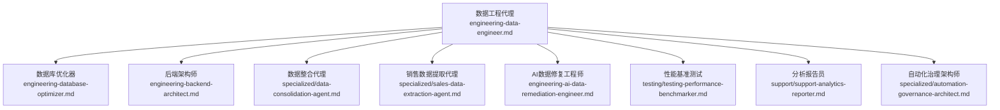

图表来源
- [engineering-data-engineer.md:1-307](file://engineering/engineering-data-engineer.md#L1-L307)
- [engineering-database-optimizer.md:1-177](file://engineering/engineering-database-optimizer.md#L1-L177)
- [engineering-backend-architect.md:1-235](file://engineering/engineering-backend-architect.md#L1-L235)
- [data-consolidation-agent.md:1-61](file://specialized/data-consolidation-agent.md#L1-L61)
- [sales-data-extraction-agent.md:1-68](file://specialized/sales-data-extraction-agent.md#L1-L68)
- [engineering-ai-data-remediation-engineer.md:1-212](file://engineering/engineering-ai-data-remediation-engineer.md#L1-L212)
- [testing-performance-benchmarker.md:1-268](file://testing/testing-performance-benchmarker.md#L1-L268)
- [support-analytics-reporter.md:1-365](file://support/support-analytics-reporter.md#L1-L365)
- [automation-governance-architect.md:1-217](file://specialized/automation-governance-architect.md#L1-L217)

章节来源
- [engineering-data-engineer.md:1-307](file://engineering/engineering-data-engineer.md#L1-L307)
- [engineering-database-optimizer.md:1-177](file://engineering/engineering-database-optimizer.md#L1-L177)
- [engineering-backend-architect.md:1-235](file://engineering/engineering-backend-architect.md#L1-L235)
- [data-consolidation-agent.md:1-61](file://specialized/data-consolidation-agent.md#L1-L61)
- [sales-data-extraction-agent.md:1-68](file://specialized/sales-data-extraction-agent.md#L1-L68)
- [engineering-ai-data-remediation-engineer.md:1-212](file://engineering/engineering-ai-data-remediation-engineer.md#L1-L212)
- [testing-performance-benchmarker.md:1-268](file://testing/testing-performance-benchmarker.md#L1-L268)
- [support-analytics-reporter.md:1-365](file://support/support-analytics-reporter.md#L1-L365)
- [automation-governance-architect.md:1-217](file://specialized/automation-governance-architect.md#L1-L217)

## 核心组件
- 数据工程代理：负责湖仓架构（Bronze/Silver/Gold）的端到端设计与实施，涵盖ETL/ELT、CDC、增量更新、数据质量契约、观测性与SLA保障。
- 数据库优化器：专注于模式设计、索引策略、查询计划分析、连接池与迁移安全，确保数据库在高负载下的稳定与高性能。
- 后端架构师：从系统架构角度定义数据层、API与事件驱动设计，强调安全性、可扩展性与可靠性。
- 数据整合代理：将分散的销售指标聚合为仪表盘视图，强调多维聚合、一致性与刷新频率。
- 销售数据提取代理：监控Excel目录，解析灵活列名，计算达成率，批量入库并保留审计轨迹。
- AI数据修复工程师：在异常数据拦截后，通过语义聚类与本地LLM生成确定性修复逻辑，实现零数据丢失与可审计回溯。
- 性能基准测试：提供系统级性能测试框架与报告模板，支撑数据库与应用层优化闭环。
- 分析报告员：将原始数据转化为可执行的业务洞察，建立KPI仪表盘与统计模型，推动数据驱动决策。
- 自动化治理架构师：以治理为先评估业务自动化，确保价值、风险与可维护性的平衡。

章节来源
- [engineering-data-engineer.md:11-307](file://engineering/engineering-data-engineer.md#L11-L307)
- [engineering-database-optimizer.md:9-177](file://engineering/engineering-database-optimizer.md#L9-L177)
- [engineering-backend-architect.md:9-235](file://engineering/engineering-backend-architect.md#L9-L235)
- [data-consolidation-agent.md:9-61](file://specialized/data-consolidation-agent.md#L9-L61)
- [sales-data-extraction-agent.md:9-68](file://specialized/sales-data-extraction-agent.md#L9-L68)
- [engineering-ai-data-remediation-engineer.md:9-212](file://engineering/engineering-ai-data-remediation-engineer.md#L9-L212)
- [testing-performance-benchmarker.md:9-268](file://testing/testing-performance-benchmarker.md#L9-L268)
- [support-analytics-reporter.md:9-365](file://support/support-analytics-reporter.md#L9-L365)
- [automation-governance-architect.md:9-217](file://specialized/automation-governance-architect.md#L9-L217)

## 架构总览
数据工程代理的全链路架构由“数据源接入—湖仓分层—质量与治理—实时/批处理—消费与可视化”构成。下图展示典型交互关系与职责边界：

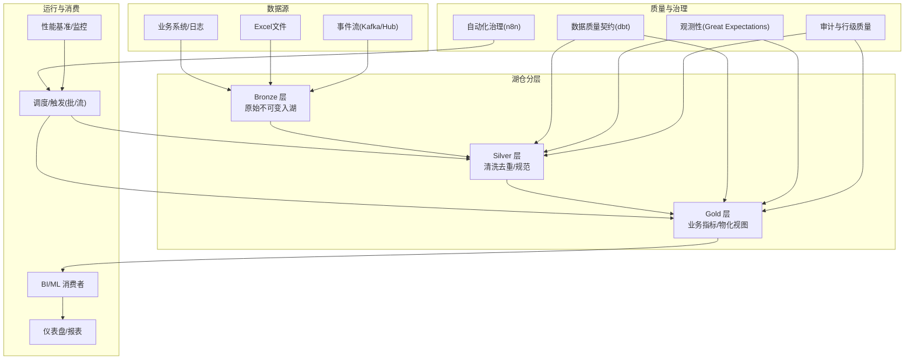

图表来源
- [engineering-data-engineer.md:21-281](file://engineering/engineering-data-engineer.md#L21-L281)
- [engineering-data-engineer.md:115-185](file://engineering/engineering-data-engineer.md#L115-L185)
- [sales-data-extraction-agent.md:35-68](file://specialized/sales-data-extraction-agent.md#L35-L68)
- [data-consolidation-agent.md:33-61](file://specialized/data-consolidation-agent.md#L33-L61)
- [automation-governance-architect.md:59-150](file://specialized/automation-governance-architect.md#L59-L150)
- [testing-performance-benchmarker.md:57-219](file://testing/testing-performance-benchmarker.md#L57-L219)

## 详细组件分析

### 数据工程代理：湖仓架构与数据管道
- 职责边界
  - 设计并实现Bronze/Silver/Gold三层架构，明确数据契约、分区与物化策略。
  - 实施CDC与增量更新，结合软删除与审计字段，确保可追溯性与一致性。
  - 建立数据质量契约（dbt）与观测性（Great Expectations），实现自动化的完整性与新鲜度监控。
- 关键交付
  - Spark + Delta Lake的分层流水线示例（入湖、去重合并、金表聚合）。
  - dbt数据契约定义与测试样例。
  - Kafka流式入湖与微批触发策略。
- 成功度量
  - 管道SLA达标率、金表质量通过率、静默失败告警时延、成本优化比例、MTTR、目录覆盖率、消费者满意度。

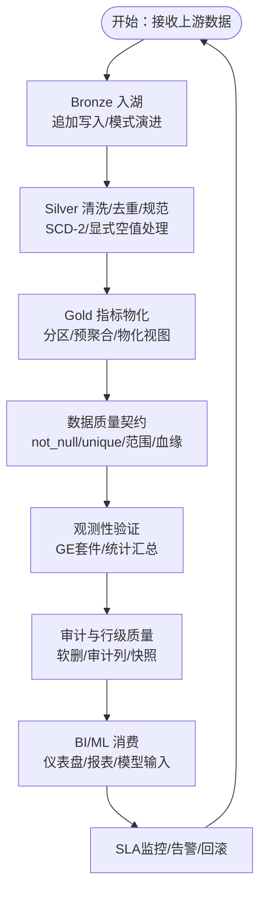

图表来源
- [engineering-data-engineer.md:62-113](file://engineering/engineering-data-engineer.md#L62-L113)
- [engineering-data-engineer.md:115-185](file://engineering/engineering-data-engineer.md#L115-L185)
- [engineering-data-engineer.md:222-281](file://engineering/engineering-data-engineer.md#L222-L281)

章节来源
- [engineering-data-engineer.md:11-307](file://engineering/engineering-data-engineer.md#L11-L307)

### 数据库优化器：模式设计与查询优化
- 职责边界
  - 针对PostgreSQL/MySQL/Supabase/PlanetScale进行模式设计、索引策略与查询计划分析。
  - 防止N+1问题，使用连接池与零停机迁移。
- 关键交付
  - 优化的表结构与索引组合示例。
  - EXPLAIN分析与查询优化流程。
  - 安全迁移与并发索引创建。
  - 连接池配置与事务端口替换。

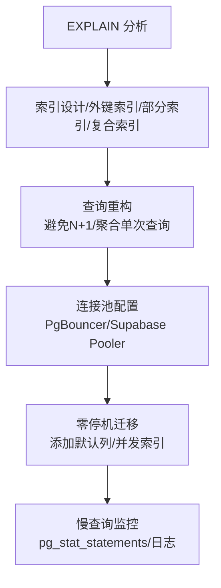

图表来源
- [engineering-database-optimizer.md:31-172](file://engineering/engineering-database-optimizer.md#L31-L172)

章节来源
- [engineering-database-optimizer.md:9-177](file://engineering/engineering-database-optimizer.md#L9-L177)

### 后端架构师：系统设计与数据层
- 职责边界
  - 微服务/事件驱动架构设计，强调安全、可扩展与可靠性。
  - 数据层优化（子20ms查询时间）、缓存策略与API版本化。
- 关键交付
  - 系统架构规格与服务分解示例。
  - 数据库架构设计与索引策略。
  - API设计与安全中间件集成。

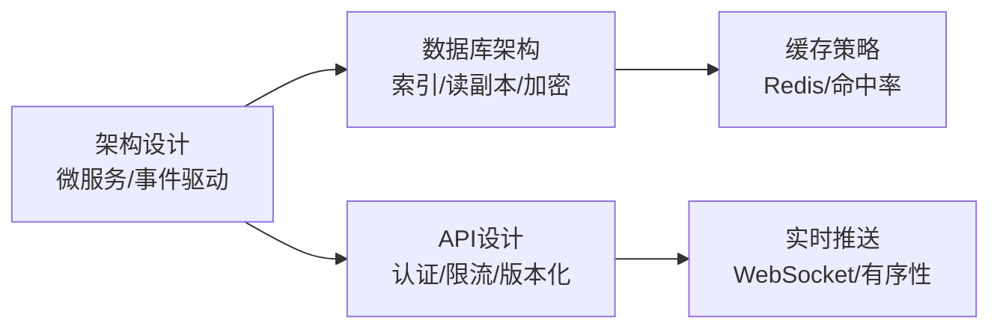

图表来源
- [engineering-backend-architect.md:64-186](file://engineering/engineering-backend-architect.md#L64-L186)

章节来源
- [engineering-backend-architect.md:9-235](file://engineering/engineering-backend-architect.md#L9-L235)

### 数据整合代理：销售指标仪表盘
- 职责边界
  - 将各区域/代表/阶段的销售指标整合为仪表盘视图，支持MTD/YTD/Year End。
- 关键交付
  - 综合报表维度与派生指标计算。
  - 区域深度视图与历史明细抽取。
- 成功度量
  - 仪表盘加载时延、自动刷新频率、区域/代表覆盖率、摘要与明细一致性。

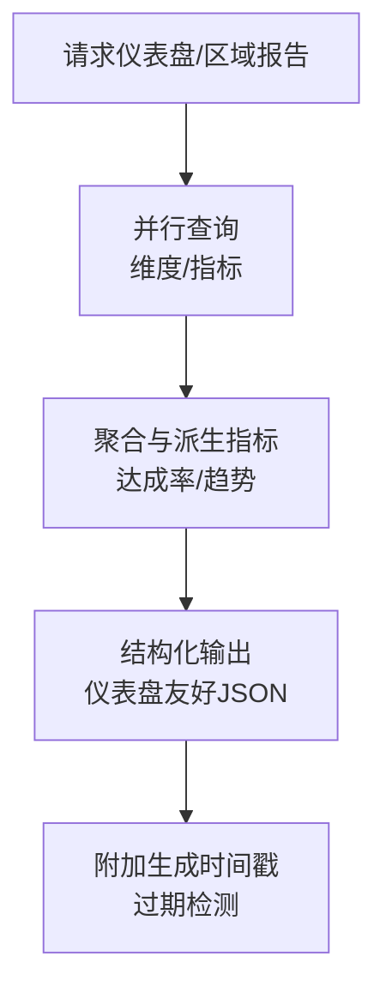

图表来源
- [data-consolidation-agent.md:47-61](file://specialized/data-consolidation-agent.md#L47-L61)

章节来源
- [data-consolidation-agent.md:9-61](file://specialized/data-consolidation-agent.md#L9-L61)

### 销售数据提取代理：Excel到数据库
- 职责边界
  - 监控Excel目录，解析灵活列名，计算达成率，批量入库并记录审计。
- 关键交付
  - 文件监控与写入完成等待。
  - 灵活列映射与货币格式处理。
  - 事务批量插入与源文件记录。
- 成功度量
  - 处理成功率、行级失败率、单文件处理时延、导入审计完整性。

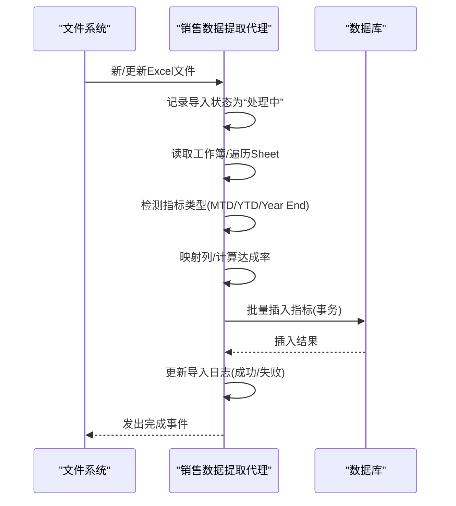

图表来源
- [sales-data-extraction-agent.md:51-68](file://specialized/sales-data-extraction-agent.md#L51-L68)

章节来源
- [sales-data-extraction-agent.md:9-68](file://specialized/sales-data-extraction-agent.md#L9-L68)

### AI数据修复工程师：异常数据自愈
- 职责边界
  - 在确定性验证之后拦截异常数据，通过向量嵌入与语义聚类压缩为少量修复模式，使用本地LLM生成确定性修复函数，零数据损失。
- 关键交付
  - 语义聚类与样本代表性选择。
  - 本地LLM生成修复逻辑的安全门禁。
  - 向量化批量应用与审计日志。
  - 对账校验与Sev-1告警。
- 成功度量
  - SLM调用减少率、零静默丢失、PII零外发、审计覆盖率、人工隔离率。

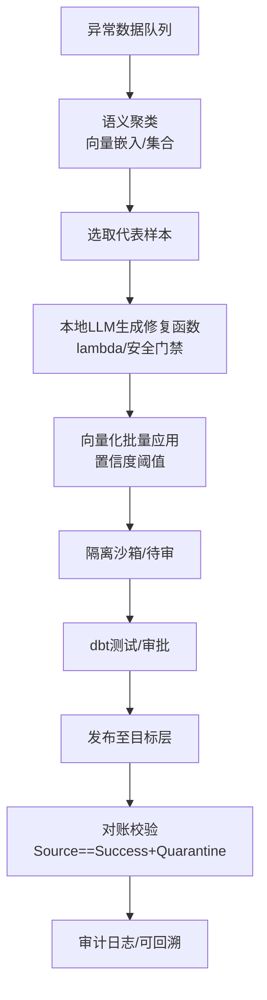

图表来源
- [engineering-ai-data-remediation-engineer.md:89-185](file://engineering/engineering-ai-data-remediation-engineer.md#L89-L185)

章节来源
- [engineering-ai-data-remediation-engineer.md:9-212](file://engineering/engineering-ai-data-remediation-engineer.md#L9-L212)

### 性能基准测试：系统级性能优化闭环
- 职责边界
  - 建立性能基线、负载/压力/耐力/扩展性测试，识别瓶颈并提供优化建议。
- 关键交付
  - k6综合测试脚本与阈值配置。
  - 报告模板与可视化输出。
- 成功度量
  - SLA达标率、核心Web Vital、回归预防率、成本收益比。

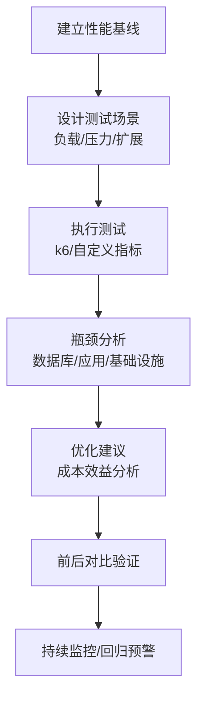

图表来源
- [testing-performance-benchmarker.md:153-219](file://testing/testing-performance-benchmarker.md#L153-L219)

章节来源
- [testing-performance-benchmarker.md:9-268](file://testing/testing-performance-benchmarker.md#L9-L268)

### 分析报告员：业务洞察与KPI仪表盘
- 职责边界
  - 将原始数据转化为可执行的业务洞察，建立KPI仪表盘与统计模型。
- 关键交付
  - 月度指标与增长分析SQL模板。
  - 客户RFM分群与洞察推荐。
  - 营销归因与ROI分析。
- 成功度量
  - 分析准确率、建议采纳率、仪表盘采用率、业务KPI改善幅度。

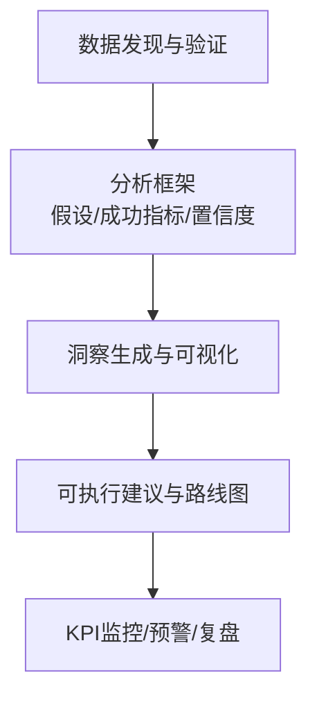

图表来源
- [support-analytics-reporter.md:222-310](file://support/support-analytics-reporter.md#L222-L310)

章节来源
- [support-analytics-reporter.md:9-365](file://support/support-analytics-reporter.md#L9-L365)

### 自动化治理架构师：业务自动化决策
- 职责边界
  - 以治理为先评估自动化提案，确保价值、风险与可维护性。
- 关键交付
  - 决策框架（时间节省、数据criticality、外部依赖风险、可扩展性）。
  - n8n工作流标准（触发/输入校验/数据规范化/业务逻辑/外部动作/结果校验/日志/错误分支/回退/完成）。
  - 命名与版本化、测试基线、集成治理清单。
- 成功度量
  - 低价值自动化阻断率、高价值自动化标准化率、生产事故下降率、交接质量提升率。

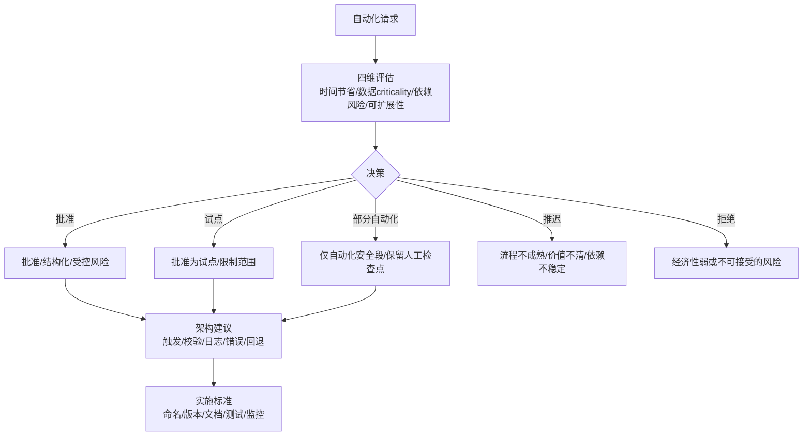

图表来源
- [automation-governance-architect.md:29-188](file://specialized/automation-governance-architect.md#L29-L188)

章节来源
- [automation-governance-architect.md:9-217](file://specialized/automation-governance-architect.md#L9-L217)

## 依赖关系分析
- 组件耦合
  - 数据工程代理是中枢，向上游数据源（业务系统、Excel、事件流）与治理/性能工具（自动化治理、性能基准）解耦，向下对接数据库优化器与后端架构师的基础设施。
  - 数据整合与销售提取代理作为“边缘代理”，负责特定场景的数据接入与初步聚合，随后进入湖仓分层。
  - AI数据修复工程师位于质量保障闭环末端，作为“自愈层”补充确定性修复。
- 可能的循环依赖
  - 通过“治理—自动化—执行—观测—优化”的反馈回路形成闭环，避免直接循环依赖。
- 外部依赖与集成点
  - 云平台（Fabric/Databricks/Azure Synapse/Snowflake等）与开源生态（Delta Lake、dbt、Great Expectations、Apache Kafka、n8n）。

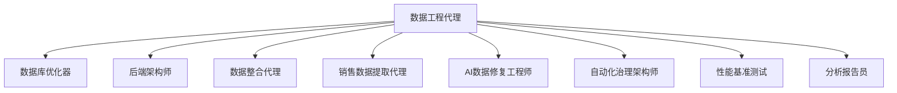

图表来源
- [engineering-data-engineer.md:21-281](file://engineering/engineering-data-engineer.md#L21-L281)
- [automation-governance-architect.md:59-150](file://specialized/automation-governance-architect.md#L59-L150)
- [testing-performance-benchmarker.md:57-219](file://testing/testing-performance-benchmarker.md#L57-L219)
- [support-analytics-reporter.md:222-310](file://support/support-analytics-reporter.md#L222-L310)

章节来源
- [engineering-data-engineer.md:11-307](file://engineering/engineering-data-engineer.md#L11-L307)
- [automation-governance-architect.md:9-217](file://specialized/automation-governance-architect.md#L9-L217)
- [testing-performance-benchmarker.md:9-268](file://testing/testing-performance-benchmarker.md#L9-L268)
- [support-analytics-reporter.md:9-365](file://support/support-analytics-reporter.md#L9-L365)

## 性能考量
- 查询性能
  - 使用索引策略（B-tree/GiST/GIN/部分索引/复合索引），避免N+1，利用连接池降低延迟。
- 存储与扫描
  - 湖仓分层与分区裁剪、Z-order/液态聚类、布隆过滤器跳过，减少全表扫描。
- 实时与批处理权衡
  - Kafka/事件中心+微批触发，平衡延迟与成本；CDC优先于全量拉取。
- 系统级性能
  - 基于k6的负载/压力/扩展性测试，建立阈值与回归预警，持续优化数据库与应用层。

章节来源
- [engineering-database-optimizer.md:31-172](file://engineering/engineering-database-optimizer.md#L31-L172)
- [engineering-data-engineer.md:285-296](file://engineering/engineering-data-engineer.md#L285-L296)
- [testing-performance-benchmarker.md:57-219](file://testing/testing-performance-benchmarker.md#L57-L219)

## 故障排查指南
- 管道失败
  - 快速定位：检查SLA告警、失败任务重试、Checkpoint位置、Schema变更。
  - 处理流程：回滚到上一稳定版本，修复契约或上游数据格式，重新触发增量。
- 数据质量异常
  - 使用Great Expectations套件进行批量验证，记录失败统计与失败项，触发修复流程。
  - 对于AI修复无法覆盖的异常，转入人工隔离与复核。
- 查询性能退化
  - EXPLAIN分析，确认索引使用情况与估算/实际差异，必要时重建索引或调整查询。
- 自动化风险
  - 依据治理框架进行回溯评估，完善错误分支、幂等保护、超时与通知机制。

章节来源
- [engineering-data-engineer.md:248-281](file://engineering/engineering-data-engineer.md#L248-L281)
- [engineering-ai-data-remediation-engineer.md:170-185](file://engineering/engineering-ai-data-remediation-engineer.md#L170-L185)
- [automation-governance-architect.md:94-150](file://specialized/automation-governance-architect.md#L94-L150)

## 结论
数据工程代理以湖仓架构为核心，贯穿数据采集、清洗、物化、观测与消费的全生命周期。通过严格的契约与质量控制、可观测性与SLA保障、实时与批处理的混合策略、以及治理与性能优化闭环，能够为企业提供可靠、可扩展、可审计的数据基础设施。配合数据库优化、后端架构、AI自愈与自动化治理，形成完整的数据工程能力体系。

## 附录
- 实际案例建议
  - 电商订单：Kafka流式入湖→Silver去重与SCD-2→Gold日指标物化，结合dbt契约与GE观测，支持营销实时看板。
  - 销售Excel：文件监控→灵活列映射→批量入库→仪表盘MTD/YTD/Year End，配套审计与异常追踪。
  - 数据修复：异常聚类→本地LLM生成修复→向量化应用→对账校验→审计日志，确保零静默丢失。
- 最佳实践清单
  - 管道：幂等、显式Schema契约、软删除与审计列、分区裁剪与物化视图。
  - 质量：数据契约强制、行级质量评分、Recency/Freshness监控、失败即告警。
  - 性能：AQE/分区/索引/布隆过滤器/液态聚类，k6回归测试与阈值。
  - 治理：自动化治理框架、命名版本化、测试与监控基线、回退路径。