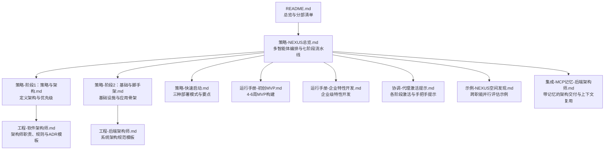
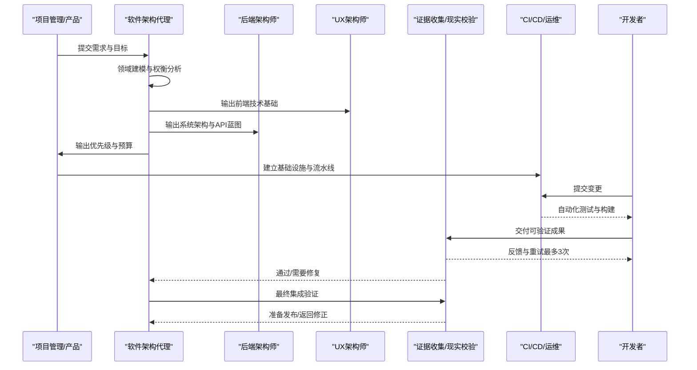
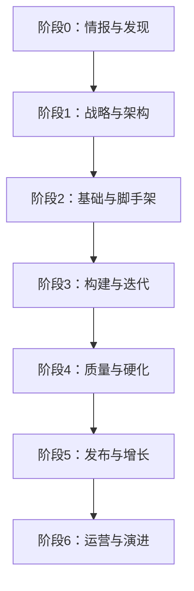
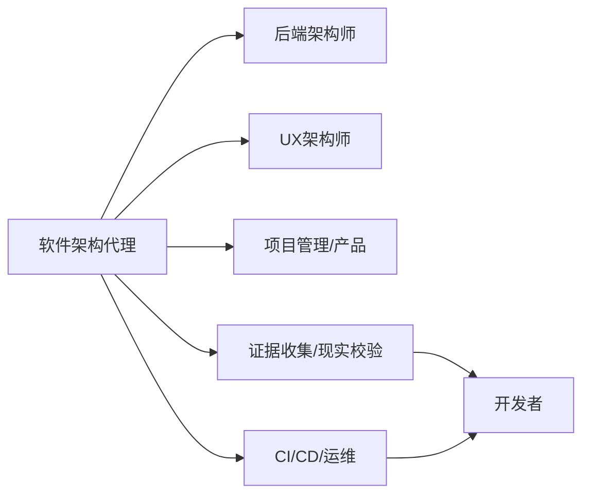

# 软件架构代理

<cite>
**本文引用的文件**
- [README.md](file://README.md)
- [工程-软件架构师.md](file://engineering/engineering-software-architect.md)
- [工程-后端架构师.md](file://engineering/engineering-backend-architect.md)
- [策略-NEXUS总览.md](file://strategy/nexus-strategy.md)
- [策略-快速启动.md](file://strategy/QUICKSTART.md)
- [策略-阶段1：策略与架构.md](file://strategy/playbooks/phase-1-strategy.md)
- [策略-阶段2：基础与脚手架.md](file://strategy/playbooks/phase-2-foundation.md)
- [运行手册-初创MVP.md](file://strategy/runbooks/scenario-startup-mvp.md)
- [运行手册-企业特性开发.md](file://strategy/runbooks/scenario-enterprise-feature.md)
- [协调-代理激活提示.md](file://strategy/coordination/agent-activation-prompts.md)
- [示例-NEXUS空间发现.md](file://examples/nexus-spatial-discovery.md)
- [集成-MCP记忆-后端架构师.md](file://integrations/mcp-memory/backend-architect-with-memory.md)
</cite>

## 目录
1. [简介](#简介)
2. [项目结构](#项目结构)
3. [核心组件](#核心组件)
4. [架构总览](#架构总览)
5. [详细组件分析](#详细组件分析)
6. [依赖关系分析](#依赖关系分析)
7. [性能考量](#性能考量)
8. [故障排查指南](#故障排查指南)
9. [结论](#结论)
10. [附录](#附录)

## 简介
本文件面向“软件架构代理”，系统化阐述该角色在复杂项目中的统筹职责与方法论，覆盖系统架构设计、技术选型、架构模式应用、质量门禁、跨职能协作、生命周期管理与持续演进等关键主题。通过 NEXUS 多智能体编排体系，软件架构代理负责：
- 将业务域转化为可落地的系统边界与交互模型（领域建模）
- 在多种架构模式间进行权衡取舍并形成可追溯的架构决策记录（ADR）
- 制定可执行的系统设计过程，确保可扩展性、可靠性、可维护性与可观测性
- 统筹跨团队交付，建立证据驱动的质量门禁与反馈闭环
- 平衡功能需求与技术约束，提供可操作的决策指导原则

## 项目结构
该仓库以“多智能体”组织方式呈现，软件架构代理作为“工程-软件架构师”角色，与其他工程、设计、测试、产品、项目管理、支持与空间计算等领域的代理协同工作，形成完整的端到端交付管线。下图概览了与软件架构代理直接相关的核心文件与它们之间的关系。

图表来源
- [README.md:1-886](file://README.md#L1-L886)
- [策略-NEXUS总览.md:1-1111](file://strategy/nexus-strategy.md#L1-L1111)
- [策略-阶段1：策略与架构.md:1-239](file://strategy/playbooks/phase-1-strategy.md#L1-L239)
- [策略-阶段2：基础与脚手架.md:1-279](file://strategy/playbooks/phase-2-foundation.md#L1-L279)
- [策略-快速启动.md:1-195](file://strategy/QUICKSTART.md#L1-L195)
- [工程-软件架构师.md:1-82](file://engineering/engineering-software-architect.md#L1-L82)
- [工程-后端架构师.md:62-90](file://engineering/engineering-backend-architect.md#L62-L90)
- [运行手册-初创MVP.md:1-155](file://strategy/runbooks/scenario-startup-mvp.md#L1-L155)
- [运行手册-企业特性开发.md:1-158](file://strategy/runbooks/scenario-enterprise-feature.md#L1-L158)
- [协调-代理激活提示.md:1-402](file://strategy/coordination/agent-activation-prompts.md#L1-L402)
- [示例-NEXUS空间发现.md:712-744](file://examples/nexus-spatial-discovery.md#L712-L744)
- [集成-MCP记忆-后端架构师.md:60-248](file://integrations/mcp-memory/backend-architect-with-memory.md#L60-L248)

章节来源
- [README.md:1-886](file://README.md#L1-L886)
- [策略-NEXUS总览.md:1-1111](file://strategy/nexus-strategy.md#L1-L1111)

## 核心组件
- 软件架构代理（工程-软件架构师）：负责系统设计、领域建模、架构模式选择、权衡分析与架构决策记录（ADR），强调“问题与约束优先”的沟通方式与“至少两个选项”的方案呈现。
- 后端架构师（工程-后端架构师）：提供系统架构规范模板，涵盖高层架构、服务分解、数据库与API设计等，支撑软件架构代理的架构输出。
- NEXUS 编排体系（策略-NEXUS总览）：定义七阶段流水线、命令结构、质量门禁、手把手协议与风险治理，确保跨职能协作的一致性与可验证性。
- 阶段化工作流（策略-阶段1/2）：明确“战略与架构”“基础与脚手架”阶段的产出物、并行工作流与验收标准。
- 场景化运行手册（运行手册-初创MVP/企业特性开发）：给出不同规模项目的执行节奏、关键决策点与成功度量，便于软件架构代理在实践中落地。
- 激活与手把手提示（协调-代理激活提示）：提供各阶段可用的激活模板与任务级提示，帮助软件架构代理在具体任务中高效协作。
- 记忆与上下文复用（集成-MCP记忆-后端架构师）：强调架构决策的记忆化与跨会话复用，减少重复论证，提升一致性与可追溯性。

章节来源
- [工程-软件架构师.md:1-82](file://engineering/engineering-software-architect.md#L1-L82)
- [工程-后端架构师.md:62-90](file://engineering/engineering-backend-architect.md#L62-L90)
- [策略-NEXUS总览.md:1-1111](file://strategy/nexus-strategy.md#L1-L1111)
- [策略-阶段1：策略与架构.md:1-239](file://strategy/playbooks/phase-1-strategy.md#L1-L239)
- [策略-阶段2：基础与脚手架.md:1-279](file://strategy/playbooks/phase-2-foundation.md#L1-L279)
- [运行手册-初创MVP.md:1-155](file://strategy/runbooks/scenario-startup-mvp.md#L1-L155)
- [运行手册-企业特性开发.md:1-158](file://strategy/runbooks/scenario-enterprise-feature.md#L1-L158)
- [协调-代理激活提示.md:1-402](file://strategy/coordination/agent-activation-prompts.md#L1-L402)
- [集成-MCP记忆-后端架构师.md:60-248](file://integrations/mcp-memory/backend-architect-with-memory.md#L60-L248)

## 架构总览
软件架构代理在 NEXUS 中承担“系统设计与架构决策”的中枢角色，贯穿以下关键路径：
- 发现与需求对齐：通过市场情报、用户研究与合规扫描，形成可验证的输入，避免“先实现再验证”的风险。
- 战略与架构：定义品牌、技术架构、数据与API蓝图、预算与优先级，形成可追溯的架构包。
- 基础与脚手架：推动CI/CD、基础设施、监控与应用骨架的落地，确保后续开发具备可验证的环境。
- 构建与迭代：以“开发者实现—证据收集—判定”的Dev↔QA循环推进，严格控制质量门槛。
- 硬化与发布：以“现实校验器”为主导的最终集成验证，确保端到端可用、跨设备一致、安全合规与规格符合。
- 运维与演进：持续改进循环，基于数据与反馈不断优化。

图表来源
- [策略-NEXUS总览.md:70-436](file://strategy/nexus-strategy.md#L70-L436)
- [策略-阶段1：策略与架构.md:17-239](file://strategy/playbooks/phase-1-strategy.md#L17-L239)
- [策略-阶段2：基础与脚手架.md:17-279](file://strategy/playbooks/phase-2-foundation.md#L17-L279)
- [协调-代理激活提示.md:36-59](file://strategy/coordination/agent-activation-prompts.md#L36-L59)

## 详细组件分析

### 软件架构代理：职责、规则与决策框架
- 职责聚焦于：领域建模、架构模式选择、权衡分析、技术决策与演化策略，并以架构决策记录（ADR）固化。
- 关键规则强调“无抽象即无价值”“权衡优于最佳实践”“领域优先于技术”“可逆性优先”“记录决策而非仅记录设计”。
- 决策流程包含：领域发现（事件风暴、聚合边界、上下文映射）、架构选择矩阵（模块化单体、微服务、事件驱动、CQRS）与质量属性分析（可扩展性、可靠性、可维护性、可观测性）。
- 沟通风格：以问题与约束开场，使用C4模型在合适抽象层级交流，至少提出两个选项并明确其代价。

章节来源
- [工程-软件架构师.md:1-82](file://engineering/engineering-software-architect.md#L1-L82)

### 系统架构规范模板：支撑软件架构代理的交付物
- 后端架构师提供系统架构规范模板，包含高层架构（架构/通信/数据/部署模式）、服务分解（用户、产品、订单等服务）与关键组件（数据库、缓存、消息队列、API）。
- 该模板直接服务于软件架构代理的“系统架构规范”产出，确保前后端、数据与基础设施的衔接清晰、可验证。

章节来源
- [工程-后端架构师.md:62-90](file://engineering/engineering-backend-architect.md#L62-L90)

### NEXUS 七阶段流水线：软件架构代理的统筹舞台
- 阶段0：情报与发现（市场、用户、合规、数据与技术可行性）
- 阶段1：战略与架构（品牌、技术架构、预算、优先级）
- 阶段2：基础与脚手架（CI/CD、基础设施、监控、应用骨架）
- 阶段3：构建与迭代（Dev↔QA循环、并行构建轨道）
- 阶段4：质量与硬化（最终集成验证、安全与合规、规格符合）
- 阶段5：发布与增长（多渠道协同、部署与监控）
- 阶段6：运营与演进（持续改进、指标与报告）

图表来源
- [策略-NEXUS总览.md:75-116](file://strategy/nexus-strategy.md#L75-L116)

章节来源
- [策略-NEXUS总览.md:1-1111](file://strategy/nexus-strategy.md#L1-L1111)

### 阶段1：战略与架构（软件架构代理的关键产出）
- 战略框架：由项目负责人对齐组织目标、资源与收益预期；品牌守护者定义视觉与声音；财务追踪者制定预算与ROI。
- 技术架构：UX架构师输出CSS设计系统与布局框架；后端架构师输出系统架构与API蓝图；AI工程师输出ML架构（如适用）；高级项目经理将规格转换为任务清单；冲刺优先级者进行RICE评分与Sprint规划。
- 质量门禁：双签发（项目负责人+现实校验器），确保架构覆盖所有需求、品牌完整、技术可行、预算批准、计划合理。

章节来源
- [策略-阶段1：策略与架构.md:1-239](file://strategy/playbooks/phase-1-strategy.md#L1-L239)

### 阶段2：基础与脚手架（为后续开发提供可验证环境）
- 基础设施：CI/CD流水线、基础设施即代码、环境配置与安全加固。
- 应用骨架：前端项目脚手架、组件库与设计系统实现；后端API骨架、认证与数据库迁移；UX架构师完成主题系统与布局。
- 验证检查：证据收集者以截图证据验证流水线、API健康检查、数据库可用性、监控仪表盘与组件库可用性。

章节来源
- [策略-阶段2：基础与脚手架.md:1-279](file://strategy/playbooks/phase-2-foundation.md#L1-L279)

### Dev↔QA 循环：软件架构代理的日常协作机制
- 任务级质量门禁：每个任务完成后由证据收集者进行可视化验证；API任务由API测试者验证；失败最多允许3次重试，超过则进入升级流程。
- 协调与跟踪：代理编排者负责任务分配、进度跟踪与瓶颈处理，确保跨轨道并行推进。

章节来源
- [策略-NEXUS总览.md:292-314](file://strategy/nexus-strategy.md#L292-L314)
- [协调-代理激活提示.md:36-59](file://strategy/coordination/agent-activation-prompts.md#L36-L59)

### 场景化案例：MVP与企业特性开发
- 初创MVP：4-6周从概念到上线，压缩发现与架构，强调快速验证与早期用户获取；Reality Checker作为最终质量权威。
- 企业特性：更严格的合规、安全与质量门禁，引入法律合规检查、性能基准与A/B测试；分阶段发布与回滚策略。

章节来源
- [运行手册-初创MVP.md:1-155](file://strategy/runbooks/scenario-startup-mvp.md#L1-L155)
- [运行手册-企业特性开发.md:1-158](file://strategy/runbooks/scenario-enterprise-feature.md#L1-L158)

### 记忆与上下文复用：提升架构一致性与可追溯性
- 架构决策记忆化：将API契约、数据库设计、认证策略等决策以标签形式保存，供后续会话与协作方检索，避免重复讨论。
- 上下文传递：交接时保留已完成内容、待办事项与已知约束，减少“从零开始”的沟通成本。

章节来源
- [集成-MCP记忆-后端架构师.md:60-248](file://integrations/mcp-memory/backend-architect-with-memory.md#L60-L248)

## 依赖关系分析
- 软件架构代理对后端架构师的依赖：系统架构规范模板是其产出的重要依据。
- 对UX架构师的依赖：设计系统与布局框架为前端实现提供统一基线。
- 对项目管理与产品团队的依赖：任务清单、优先级与预算直接影响架构取舍与范围。
- 对测试与质量门禁的依赖：证据收集与现实校验器确保交付质量与规格符合。
- 对CI/CD与运维的依赖：流水线与基础设施为可验证环境提供保障。

图表来源
- [策略-NEXUS总览.md:554-594](file://strategy/nexus-strategy.md#L554-L594)
- [工程-软件架构师.md:19-27](file://engineering/engineering-software-architect.md#L19-L27)

章节来源
- [策略-NEXUS总览.md:554-594](file://strategy/nexus-strategy.md#L554-L594)

## 性能考量
- 架构层面：通过可扩展性（水平/垂直、无状态）、可靠性（熔断、重试策略）、可观测性（测量与追踪）与可维护性（模块边界、依赖方向）的权衡，降低系统复杂度与技术债。
- 流水线层面：以证据驱动的质量门禁与Dev↔QA循环，将平均重试次数控制在较低水平，缩短周期时间并提高首次通过率。
- 运维层面：以监控、日志与告警为基础的生产就绪检查，确保发布后的稳定性与可恢复性。

[本节为通用指导，不直接分析具体文件]

## 故障排查指南
- 任务失败与重试：遵循QA反馈协议，明确问题类别、期望与实际差异、证据与修复指令；限制最大重试次数，超限进入升级流程。
- 质量门禁未通过：对照门禁清单逐项核查证据来源与阈值；必要时返回上一阶段或调整架构方案。
- 风险升级：根据风险等级（P0-P3）采取相应响应时间与决策权限，确保关键问题得到及时处理。

章节来源
- [策略-NEXUS总览.md:632-700](file://strategy/nexus-strategy.md#L632-L700)
- [策略-NEXUS总览.md:716-726](file://strategy/nexus-strategy.md#L716-L726)

## 结论
软件架构代理在 NEXUS 编排体系中扮演“系统设计中枢”与“跨职能协调者”的双重角色。通过严谨的领域建模、架构模式选择与权衡分析，结合可追溯的ADR与证据驱动的质量门禁，软件架构代理能够有效平衡功能需求与技术约束，推动复杂项目从概念到可运营系统的稳健交付，并在发布后持续演进。

[本节为总结性内容，不直接分析具体文件]

## 附录
- 快速启动：根据项目规模选择 NEXUS-Full、NEXUS-Sprint 或 NEXUS-Micro 模式，按阶段激活相应代理并遵循质量门禁。
- 关键概念：质量门禁、Dev↔QA循环、标准化交接、现实校验器权威、证据优于声明。
- 典型场景：初创MVP（4-6周）、企业特性开发（合规与质量门槛更高）、营销活动、合规审计与性能诊断等。

章节来源
- [策略-快速启动.md:1-195](file://strategy/QUICKSTART.md#L1-L195)
- [运行手册-初创MVP.md:126-155](file://strategy/runbooks/scenario-startup-mvp.md#L126-L155)
- [运行手册-企业特性开发.md:127-158](file://strategy/runbooks/scenario-enterprise-feature.md#L127-L158)