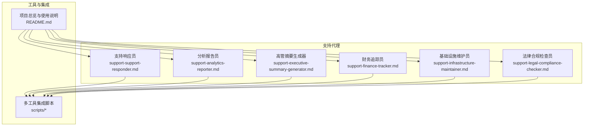
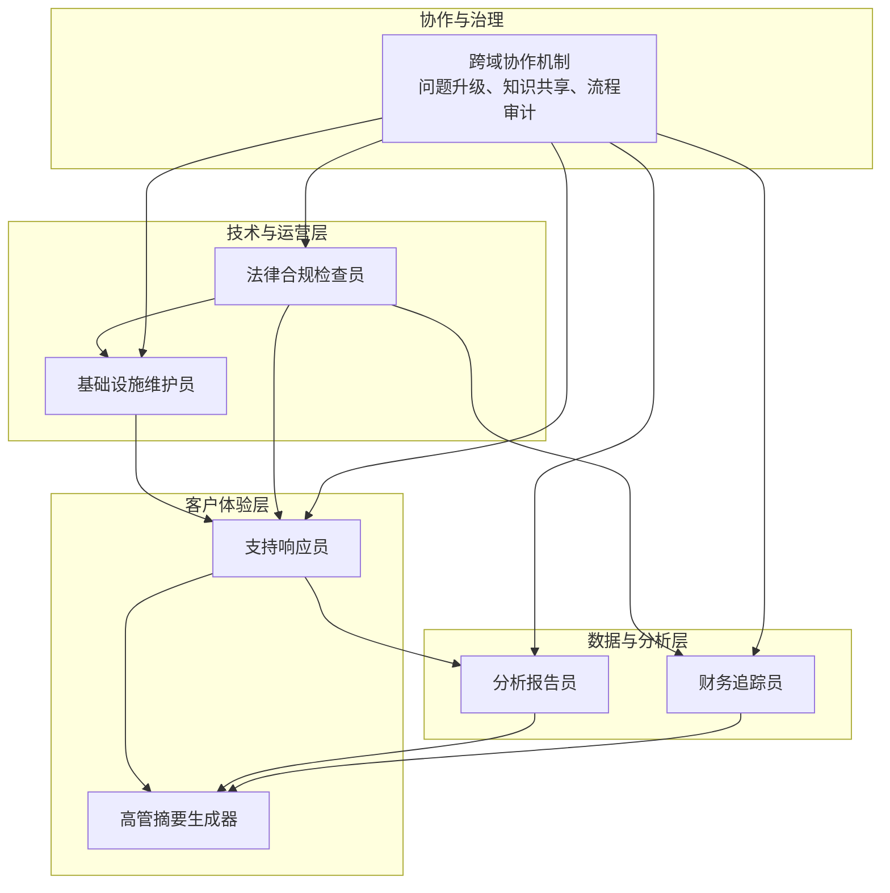
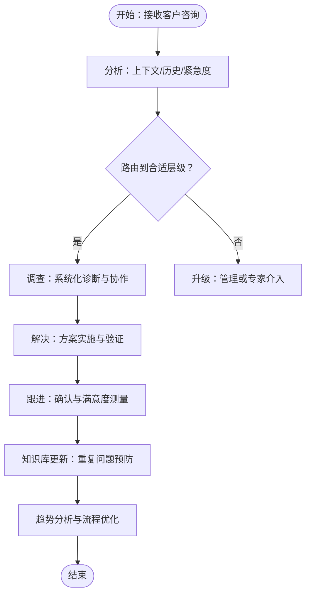
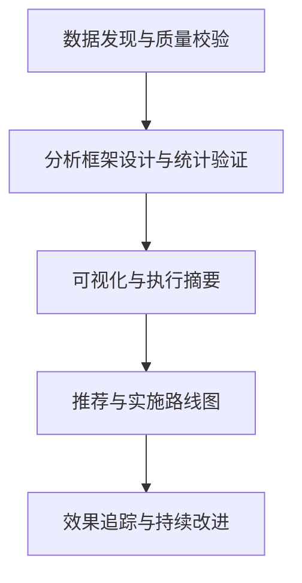
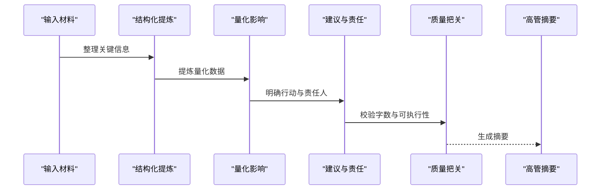
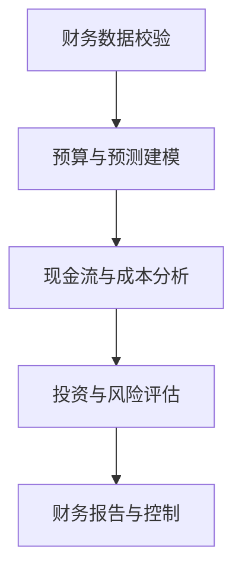
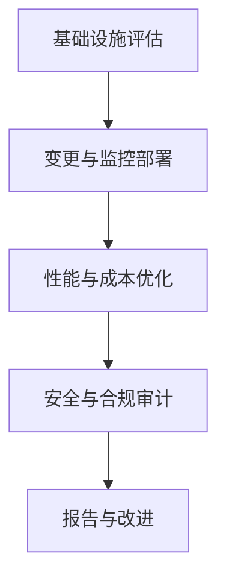
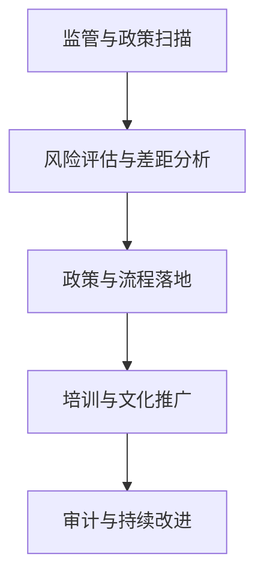
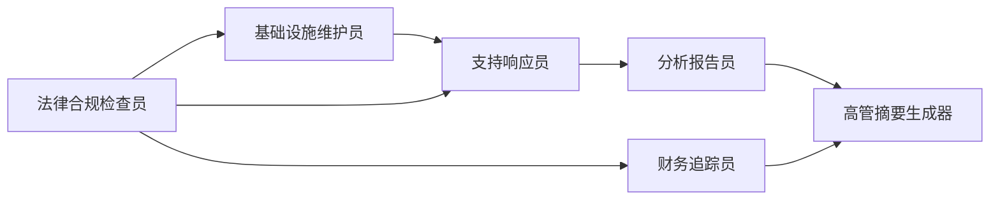

# 支持代理

<cite>
**本文引用的文件**
- [support-support-responder.md](file://support/support-support-responder.md)
- [support-analytics-reporter.md](file://support/support-analytics-reporter.md)
- [support-executive-summary-generator.md](file://support/support-executive-summary-generator.md)
- [support-finance-tracker.md](file://support/support-finance-tracker.md)
- [support-infrastructure-maintainer.md](file://support/support-infrastructure-maintainer.md)
- [support-legal-compliance-checker.md](file://support/support-legal-compliance-checker.md)
- [README.md](file://README.md)
</cite>

## 目录
1. [简介](#简介)
2. [项目结构](#项目结构)
3. [核心组件](#核心组件)
4. [架构总览](#架构总览)
5. [详细组件分析](#详细组件分析)
6. [依赖关系分析](#依赖关系分析)
7. [性能考量](#性能考量)
8. [故障排查指南](#故障排查指南)
9. [结论](#结论)
10. [附录](#附录)

## 简介
本文件系统化梳理“支持代理”六大专业化角色：支持响应员、分析报告员、高管摘要生成器、财务追踪员、基础设施维护员、法律合规检查员。围绕各代理的专业领域、服务流程、问题解决方法与持续改进策略展开，解释支持代理如何保障业务运营的稳定性与合规性，并提供客户服务管理方法（问题分类、优先级排序、解决方案制定、客户满意度提升）、运营数据分析与成本控制工具，以及支持代理在组织运营中的支撑作用。

## 项目结构
支持代理位于仓库 support 目录下，每个代理以独立 Markdown 文件呈现，包含身份设定、使命目标、关键规则、交付物示例、工作流程、成功度量与高级能力等模块。README 提供了完整的代理清单与使用方式，支持代理作为独立专家模块被集成到多工具链中。

图表来源
- [README.md](file://README.md)
- [support-support-responder.md](file://support/support-support-responder.md)
- [support-analytics-reporter.md](file://support/support-analytics-reporter.md)
- [support-executive-summary-generator.md](file://support/support-executive-summary-generator.md)
- [support-finance-tracker.md](file://support/support-finance-tracker.md)
- [support-infrastructure-maintainer.md](file://support/support-infrastructure-maintainer.md)
- [support-legal-compliance-checker.md](file://support/support-legal-compliance-checker.md)

章节来源
- [README.md](file://README.md)

## 核心组件
六大支持代理围绕“客户体验—数据洞察—决策支持—财务健康—系统稳定—合规风控”六个维度协同，形成闭环支撑体系：
- 支持响应员：多渠道客户支持、知识库与主动关怀、问题分类与优先级、满意度与持续改进
- 分析报告员：业务指标仪表盘、客户分群与生命周期价值、营销归因与ROI分析、可复现分析流程
- 高管摘要生成器：SCQA/金字塔原则的高层摘要模板、量化影响与行动建议、三分钟决策支持
- 财务追踪员：预算与预测、现金流管理、投资分析、财务建模与风险控制
- 基础设施维护员：监控告警、自动化运维、备份恢复、成本优化与安全加固
- 法律合规检查员：GDPR/CCPA/PCI-DSS等合规框架、隐私政策生成、合同审查与风险评估

章节来源
- [support-support-responder.md](file://support/support-support-responder.md)
- [support-analytics-reporter.md](file://support/support-analytics-reporter.md)
- [support-executive-summary-generator.md](file://support/support-executive-summary-generator.md)
- [support-finance-tracker.md](file://support/support-finance-tracker.md)
- [support-infrastructure-maintainer.md](file://support/support-infrastructure-maintainer.md)
- [support-legal-compliance-checker.md](file://support/support-legal-compliance-checker.md)

## 架构总览
支持代理通过统一的“身份—使命—规则—交付—流程—度量”框架实现专业化与可复用性，彼此之间通过共享的数据与流程接口协同：

图表来源
- [support-support-responder.md](file://support/support-support-responder.md)
- [support-analytics-reporter.md](file://support/support-analytics-reporter.md)
- [support-executive-summary-generator.md](file://support/support-executive-summary-generator.md)
- [support-finance-tracker.md](file://support/support-finance-tracker.md)
- [support-infrastructure-maintainer.md](file://support/support-infrastructure-maintainer.md)
- [support-legal-compliance-checker.md](file://support/support-legal-compliance-checker.md)

## 详细组件分析

### 支持响应员（Customer Support）
- 专长：多渠道支持（邮件/聊天/电话/社交/应用内消息）、主动客户成功、知识库与自服务能力、危机沟通与声誉保护
- 服务流程：询前分析与路由、问题调查与解决、客户跟进与成功度量、知识分享与流程改进
- 问题解决方法：分级工单（Tier1/2/3）、优先级路由（企业客户/账单问题/技术紧急）、上下文整合与历史回溯
- 持续改进策略：响应时间与首接率目标、满意度测量与反馈闭环、趋势识别与主动触达名单
- 客户服务管理方法：问题分类（技术/账单/账户/功能请求）、优先级排序（低/中/高/关键）、解决方案制定（步骤化诊断与验证）、满意度提升（教育与预防性建议）

图表来源
- [support-support-responder.md](file://support/support-support-responder.md)

章节来源
- [support-support-responder.md](file://support/support-support-responder.md)

### 分析报告员（Business Intelligence）
- 专长：仪表盘设计、统计分析、客户分群与生命周期价值、营销归因与ROI、预测模型
- 交付物：执行仪表盘SQL模板、客户RFM分群与洞察、营销多触点归因与ROI计算、分析报告模板
- 工作流程：数据发现与校验—分析框架—洞察可视化—业务影响度量
- 成功度量：分析准确率、建议采纳率、看板采用率、KPI改善幅度、干系人满意度

图表来源
- [support-analytics-reporter.md](file://support/support-analytics-reporter.md)

章节来源
- [support-analytics-reporter.md](file://support/support-analytics-reporter.md)

### 高管摘要生成器（Executive Summary）
- 专长：SCQA/金字塔原则的高层摘要、量化影响、明确行动与责任主体
- 输出：高层摘要模板（现状/关键发现/业务影响/建议/下一步），严格字数与数据要求
- 工作流程：输入整理—结构化提炼—量化影响—行动建议—质量把关
- 成功度量：阅读时长、关键发现量化率、建议可执行性、决策采纳率

图表来源
- [support-executive-summary-generator.md](file://support/support-executive-summary-generator.md)

章节来源
- [support-executive-summary-generator.md](file://support/support-executive-summary-generator.md)

### 财务追踪员（Financial Planning & Analysis）
- 专长：预算与预测、现金流管理、投资分析（NPV/IRR/回收期）、财务建模与风险控制
- 交付物：预算框架SQL、现金流预测与风险识别、投资分析报告模板
- 工作流程：数据校验—预算规划—绩效监控—战略财务规划
- 成功度量：预算准确率、现金流预测精度、成本优化效率、投资回报率、合规达标率

图表来源
- [support-finance-tracker.md](file://support/support-finance-tracker.md)

章节来源
- [support-finance-tracker.md](file://support/support-finance-tracker.md)

### 基础设施维护员（Infrastructure Operations）
- 专长：系统可靠性与性能、监控告警、自动化与备份恢复、成本优化与安全加固
- 交付物：Prometheus监控配置、基础设施即代码（Terraform）、备份与恢复脚本
- 工作流程：健康评估—变更实施—性能优化—安全与合规验证
- 成功度量：系统可用性、平均恢复时间、成本优化率、安全合规率、自动化一致性

图表来源
- [support-infrastructure-maintainer.md](file://support/support-infrastructure-maintainer.md)

章节来源
- [support-infrastructure-maintainer.md](file://support/support-infrastructure-maintainer.md)

### 法律合规检查员（Legal & Compliance）
- 专长：多司法辖区合规（GDPR/CCPA/PCI-DSS等）、隐私政策生成、合同审查与风险评估
- 交付物：GDPR合规框架、隐私政策生成器、合同审查自动化
- 工作流程：监管扫描—风险评估—政策与流程—培训与文化—审计与改进
- 成功度量：合规分数、违规事件数、培训完成率、审计零关键项、合规文化评分

图表来源
- [support-legal-compliance-checker.md](file://support/support-legal-compliance-checker.md)

章节来源
- [support-legal-compliance-checker.md](file://support/support-legal-compliance-checker.md)

## 依赖关系分析
支持代理之间的耦合与协作体现在：
- 支持响应员与分析报告员：支持响应员收集的客户问题与满意度数据驱动分析报告员的指标与趋势分析
- 分析报告员与高管摘要生成器：BI洞察转化为高层摘要，支撑快速决策
- 财务追踪员与基础设施维护员：财务建模与成本优化与基础设施资源规划与自动化运维相互印证
- 法律合规检查员与支持响应员/基础设施维护员：合规要求贯穿客户数据处理、系统访问与变更流程
- 高管摘要生成器对上述所有代理的输出进行整合与提炼，形成统一的高层视图

图表来源
- [support-support-responder.md](file://support/support-support-responder.md)
- [support-analytics-reporter.md](file://support/support-analytics-reporter.md)
- [support-executive-summary-generator.md](file://support/support-executive-summary-generator.md)
- [support-finance-tracker.md](file://support/support-finance-tracker.md)
- [support-infrastructure-maintainer.md](file://support/support-infrastructure-maintainer.md)
- [support-legal-compliance-checker.md](file://support/support-legal-compliance-checker.md)

章节来源
- [support-support-responder.md](file://support/support-support-responder.md)
- [support-analytics-reporter.md](file://support/support-analytics-reporter.md)
- [support-executive-summary-generator.md](file://support/support-executive-summary-generator.md)
- [support-finance-tracker.md](file://support/support-finance-tracker.md)
- [support-infrastructure-maintainer.md](file://support/support-infrastructure-maintainer.md)
- [support-legal-compliance-checker.md](file://support/support-legal-compliance-checker.md)

## 性能考量
- 响应与解决效率：通过SLA与分级路由、知识库与自助工具减少重复问题，提高首接率与首次解决率
- 数据与分析效率：标准化仪表盘与SQL模板、自动化数据管道与异常检测，降低分析延迟与错误率
- 财务与成本效率：预算与预测模型、现金流优化与成本分析、投资回报评估，提升资源配置效率
- 基础设施稳定性：监控告警与自动恢复、容量规划与成本优化、安全加固与合规自动化
- 合规与风险管理：多司法辖区合规框架、合同审查自动化、持续培训与审计，降低违规风险

## 故障排查指南
- 客户支持类
  - 常见问题：响应超时、首接率低、满意度波动
  - 排查要点：通道SLA执行、路由规则有效性、知识库覆盖度、客服培训与激励
  - 改进措施：优化聊天路由、增加高峰时段人员、完善FAQ与交互式排障器
- 分析报告类
  - 常见问题：数据质量差、指标口径不一致、洞察不可操作
  - 排查要点：数据源完整性、统计显著性、可视化误导、业务目标对齐
  - 改进措施：建立数据质量门禁、统一口径与标签、引入A/B测试验证
- 财务与成本类
  - 常见问题：预算偏差大、现金流紧张、投资回报不佳
  - 排查要点：预算编制合理性、成本中心效率、现金流预测模型、投资评估流程
  - 改进措施：加强预算校准、优化供应商与付款周期、引入敏感性分析
- 基础设施类
  - 常见问题：系统不稳定、性能瓶颈、安全漏洞
  - 排查要点：监控覆盖率、告警阈值设置、容量与弹性、补丁与权限
  - 改进措施：完善告警与自愈、弹性伸缩与缓存优化、最小权限与加密
- 合规类
  - 常见问题：隐私政策过期、合同条款风险、第三方合规缺失
  - 排查要点：法规更新跟踪、数据处理映射、合同风险关键词、供应商审计
  - 改进措施：自动化合规扫描、定期培训与演练、建立合规变更流程

章节来源
- [support-support-responder.md](file://support/support-support-responder.md)
- [support-analytics-reporter.md](file://support/support-analytics-reporter.md)
- [support-finance-tracker.md](file://support/support-finance-tracker.md)
- [support-infrastructure-maintainer.md](file://support/support-infrastructure-maintainer.md)
- [support-legal-compliance-checker.md](file://support/support-legal-compliance-checker.md)

## 结论
六大支持代理以专业化与可复用的交付框架，构建起从客户体验到数据洞察、从财务健康到系统稳定、再到合规风控的闭环支撑体系。通过标准化流程、量化指标与持续改进，支持代理能够有效提升运营稳定性与合规性，优化客户服务管理与运营效率，为组织在复杂环境中保持稳健增长提供坚实支撑。

## 附录
- 多工具集成：README 提供了将支持代理集成到 Claude Code、GitHub Copilot、Cursor、Aider、Windsurf、Gemini CLI、OpenCode、Kimi Code 等工具的安装与转换脚本，便于在不同开发与协作场景中使用。
- 使用建议：根据业务阶段与需求选择相应代理组合，如启动期侧重支持响应员与分析报告员，成长期叠加财务追踪员与基础设施维护员，成熟期强化法律合规检查员与高管摘要生成器。

章节来源
- [README.md](file://README.md)