# 测试代理

<cite>
**本文引用的文件**
- [testing-evidence-collector.md](file://testing/testing-evidence-collector.md)
- [testing-reality-checker.md](file://testing/testing-reality-checker.md)
- [testing-api-tester.md](file://testing/testing-api-tester.md)
- [testing-accessibility-auditor.md](file://testing/testing-accessibility-auditor.md)
- [testing-performance-benchmarker.md](file://testing/testing-performance-benchmarker.md)
- [testing-test-results-analyzer.md](file://testing/testing-test-results-analyzer.md)
- [testing-tool-evaluator.md](file://testing/testing-tool-evaluator.md)
- [testing-workflow-optimizer.md](file://testing/testing-workflow-optimizer.md)
- [README.md](file://README.md)
- [phase-2-foundation.md](file://strategy/playbooks/phase-2-foundation.md)
- [nexus-strategy.md](file://strategy/nexus-strategy.md)
- [agent-activation-prompts.md](file://strategy/coordination/agent-activation-prompts.md)
- [phase-4-hardening.md](file://strategy/playbooks/phase-4-hardening.md)
</cite>

## 目录
1. [简介](#简介)
2. [项目结构](#项目结构)
3. [核心组件](#核心组件)
4. [架构总览](#架构总览)
5. [详细组件分析](#详细组件分析)
6. [依赖关系分析](#依赖关系分析)
7. [性能与效率考量](#性能与效率考量)
8. [故障排查指南](#故障排查指南)
9. [结论](#结论)
10. [附录](#附录)

## 简介
本文件系统化梳理测试代理体系，围绕 8 个专业化测试代理：证据收集器、现实检查器、API 测试员、可访问性审计师、性能基准测试员、测试结果分析员、工具评估员、工作流优化器，阐述其测试专长、质量保证方法、缺陷检测技术与测试优化策略，并解释它们如何通过“证据优先”的质量门禁机制，确保产品在功能、性能、安全与可用性上的质量与用户体验。同时，结合测试金字塔（单元/集成/端到端）与自动化测试、持续集成（CI/CD）最佳实践，展示测试代理在软件开发生命周期中的质量保障作用。

## 项目结构
测试代理位于仓库 testing 目录下，每个代理文件均采用统一的“身份/使命/流程/交付物/成功度量”模板，强调可执行的质量门禁与可验证的产出。README 提供了跨部门协作与质量门禁的整体视图；策略与手册文件（如阶段手册、质量策略、激活提示）定义了测试代理在项目生命周期中的角色与协同方式。

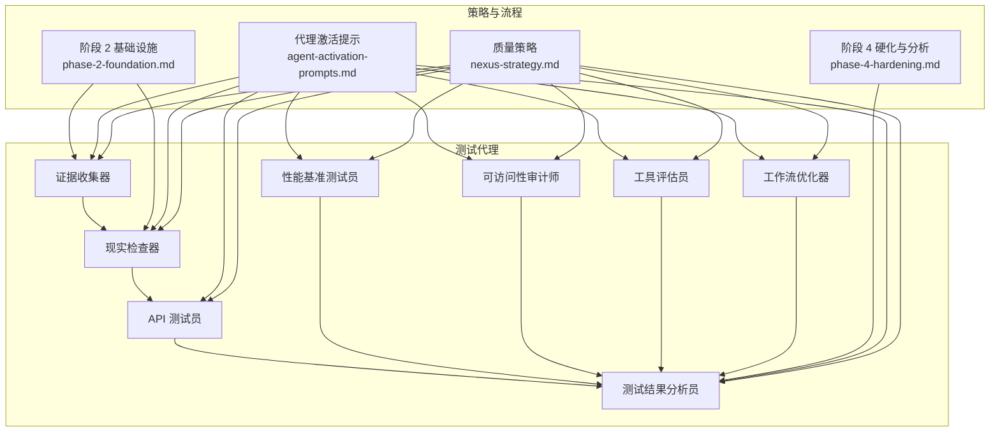

图表来源
- [testing-evidence-collector.md:1-211](file://testing/testing-evidence-collector.md#L1-L211)
- [testing-reality-checker.md:1-237](file://testing/testing-reality-checker.md#L1-L237)
- [testing-api-tester.md:1-306](file://testing/testing-api-tester.md#L1-L306)
- [testing-accessibility-auditor.md:1-317](file://testing/testing-accessibility-auditor.md#L1-L317)
- [testing-performance-benchmarker.md:1-268](file://testing/testing-performance-benchmarker.md#L1-L268)
- [testing-test-results-analyzer.md:1-305](file://testing/testing-test-results-analyzer.md#L1-L305)
- [testing-tool-evaluator.md:1-394](file://testing/testing-tool-evaluator.md#L1-L394)
- [testing-workflow-optimizer.md:1-450](file://testing/testing-workflow-optimizer.md#L1-L450)
- [nexus-strategy.md:703-728](file://strategy/nexus-strategy.md#L703-L728)
- [phase-2-foundation.md:1-50](file://strategy/playbooks/phase-2-foundation.md#L1-L50)
- [phase-4-hardening.md:141-185](file://strategy/playbooks/phase-4-hardening.md#L141-L185)
- [agent-activation-prompts.md:279-328](file://strategy/coordination/agent-activation-prompts.md#L279-L328)

章节来源
- [README.md:208-222](file://README.md#L208-L222)
- [nexus-strategy.md:703-728](file://strategy/nexus-strategy.md#L703-L728)

## 核心组件
- 证据收集器：以截图为证据的视觉 QA，强制要求“默认发现 3-5 个问题”，对规范与实现进行逐项比对，输出最小可接受质量等级与修复建议。
- 现实检查器：最终集成验证与生产就绪评估，要求“需要压倒性证据”才批准上线，对端到端用户旅程与跨设备一致性进行系统级验证。
- API 测试员：全栈 API 验证，覆盖功能、性能与安全，建立自动化测试套件并纳入 CI/CD，确保 SLA 与安全基线达标。
- 可访问性审计师：基于 WCAG 的可访问性审计，结合屏幕阅读器与键盘导航测试，识别自动化工具难以发现的可用性障碍。
- 性能基准测试员：Web 性能与核心 Web 指标优化，负载/压力/耐久性测试，容量规划与监控，提供量化改进与成本效益分析。
- 测试结果分析员：统计与机器学习驱动的质量洞察，生成发布风险评估、缺陷预测模型与 ROI 分析，支撑数据驱动的质量决策。
- 工具评估员：技术选型与工具评估，综合功能、性能、安全、集成、支持与成本，提供 TCO 与 ROI 分析及实施路线图。
- 工作流优化器：流程映射与瓶颈识别，设计未来状态流程，推动自动化与人机协作，建立可衡量的效率与质量指标。

章节来源
- [testing-evidence-collector.md:1-211](file://testing/testing-evidence-collector.md#L1-L211)
- [testing-reality-checker.md:1-237](file://testing/testing-reality-checker.md#L1-L237)
- [testing-api-tester.md:1-306](file://testing/testing-api-tester.md#L1-L306)
- [testing-accessibility-auditor.md:1-317](file://testing/testing-accessibility-auditor.md#L1-L317)
- [testing-performance-benchmarker.md:1-268](file://testing/testing-performance-benchmarker.md#L1-L268)
- [testing-test-results-analyzer.md:1-305](file://testing/testing-test-results-analyzer.md#L1-L305)
- [testing-tool-evaluator.md:1-394](file://testing/testing-tool-evaluator.md#L1-L394)
- [testing-workflow-optimizer.md:1-450](file://testing/testing-workflow-optimizer.md#L1-L450)

## 架构总览
测试代理遵循“证据优先”的质量门禁体系：证据收集器负责第一轮视觉与交互验证；现实检查器进行系统级端到端验证与规范一致性检查；API 测试员与性能基准测试员分别从接口与性能维度提供强约束；可访问性审计师确保包容性；测试结果分析员汇总质量趋势与风险；工具评估员与工作流优化器分别从工具选择与流程效率角度提供支撑。上述代理在阶段 2（基础设施与 CI/CD）与阶段 4（硬化与分析）中被激活，贯穿项目生命周期的质量门禁。

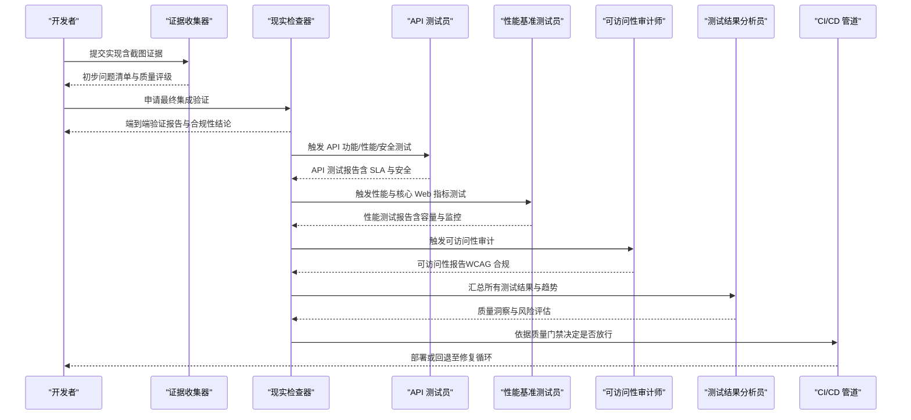

图表来源
- [agent-activation-prompts.md:279-328](file://strategy/coordination/agent-activation-prompts.md#L279-L328)
- [phase-2-foundation.md:1-50](file://strategy/playbooks/phase-2-foundation.md#L1-L50)
- [phase-4-hardening.md:141-185](file://strategy/playbooks/phase-4-hardening.md#L141-L185)
- [nexus-strategy.md:703-728](file://strategy/nexus-strategy.md#L703-L728)

## 详细组件分析

### 证据收集器
- 测试专长：以截图与自动化捕获为证据，验证布局、交互、响应式与主题切换等关键 UI 行为。
- 质量保证方法：强制“默认发现 3-5 个问题”，拒绝“零问题”与“完美分数”声明；要求对比规范文本与实际截图。
- 缺陷检测技术：交互元素测试（手风琴、表单、导航、移动端菜单）、跨设备一致性检查、暗色模式验证。
- 测试优化策略：建立最小可接受质量等级与修复优先级，要求重测与证据闭环。
- 与 CI/CD 的衔接：通过脚本生成专业截图与测试结果 JSON，作为后续验证的数据源。

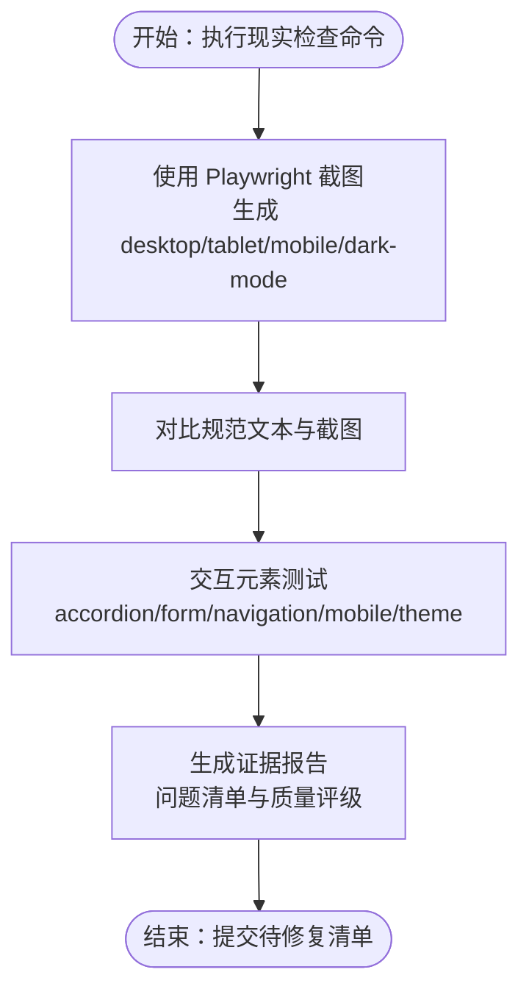

图表来源
- [testing-evidence-collector.md:41-118](file://testing/testing-evidence-collector.md#L41-L118)

章节来源
- [testing-evidence-collector.md:1-211](file://testing/testing-evidence-collector.md#L1-L211)

### 现实检查器
- 测试专长：系统级端到端验证，跨设备一致性与用户旅程完整性检查。
- 质量保证方法：要求“需要压倒性证据”才批准上线；对 QA 结果进行交叉验证；基于自动化证据进行评估。
- 缺陷检测技术：用户旅程 before/after 截图序列、性能数据（加载时间、错误率）、规范一致性差距分析。
- 测试优化策略：明确“需要工作”状态为默认，设定合理的迭代周期与修复计划。
- 与 CI/CD 的衔接：在阶段 2 基础设施完成后激活，作为质量门禁的最终裁决者。

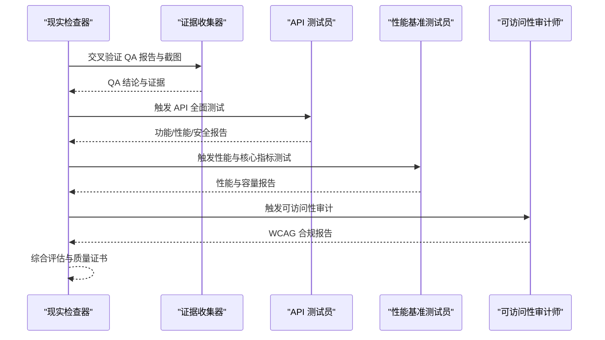

图表来源
- [testing-reality-checker.md:41-141](file://testing/testing-reality-checker.md#L41-L141)
- [agent-activation-prompts.md:279-328](file://strategy/coordination/agent-activation-prompts.md#L279-L328)

章节来源
- [testing-reality-checker.md:1-237](file://testing/testing-reality-checker.md#L1-L237)

### API 测试员
- 测试专长：全栈 API 验证，覆盖功能、性能、安全与第三方集成。
- 质量保证方法：安全优先（认证/授权/输入校验/速率限制/加密），性能卓越（P95 响应时间、负载能力、错误率）。
- 缺陷检测技术：端点覆盖、错误处理、边缘场景、失败恢复、微服务通信与契约一致性。
- 测试优化策略：自动化测试套件、CI/CD 质量门、监控与回归测试。
- 与 CI/CD 的衔接：在阶段 2 基础设施中集成 API 测试阶段，确保每次提交都通过 API 质量门。

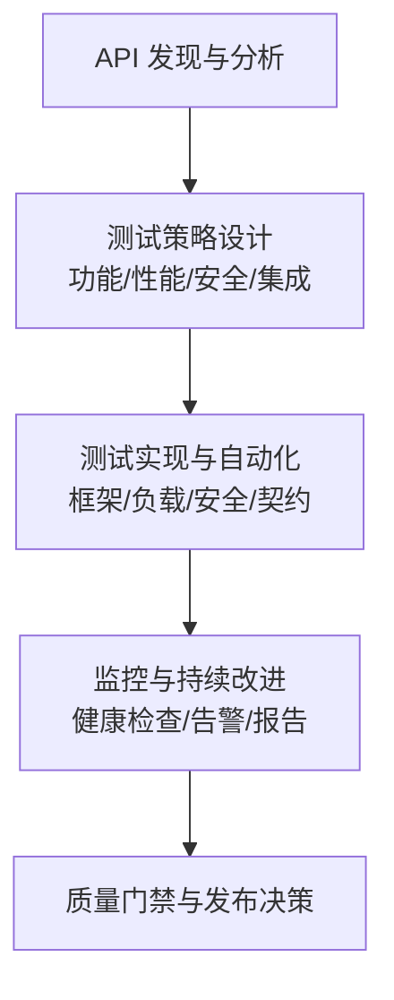

图表来源
- [testing-api-tester.md:199-222](file://testing/testing-api-tester.md#L199-L222)
- [phase-2-foundation.md:21-50](file://strategy/playbooks/phase-2-foundation.md#L21-L50)

章节来源
- [testing-api-tester.md:1-306](file://testing/testing-api-tester.md#L1-L306)

### 可访问性审计师
- 测试专长：WCAG 2.2 AA/AAA 审计，结合屏幕阅读器与键盘导航测试。
- 质量保证方法：标准引用（具体准则编号）、严重性分级、手动与自动化结合。
- 缺陷检测技术：焦点顺序、动态内容公告、自定义组件 ARIA、错误消息与状态更新。
- 测试优化策略：提供代码级修复示例、优先级排序、认知无障碍评估。
- 与 CI/CD 的衔接：在阶段 4 硬化阶段进行可访问性回归测试，形成质量门禁的一部分。

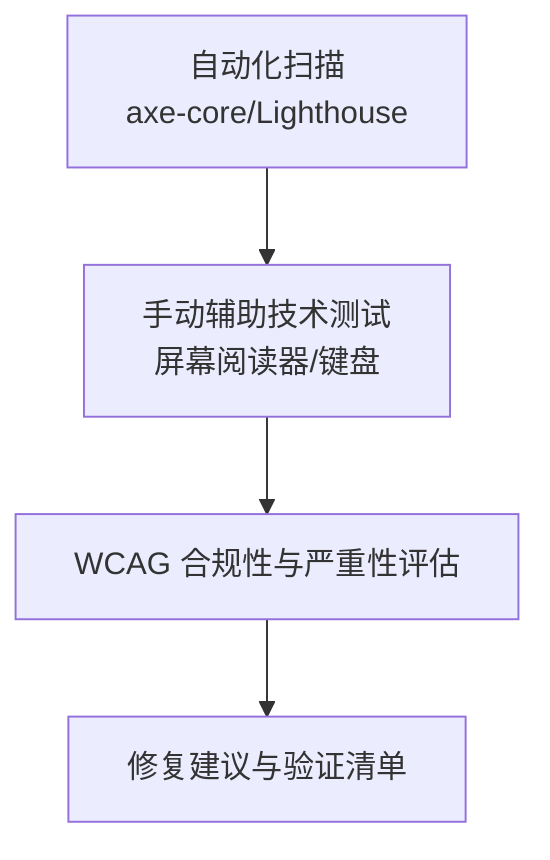

图表来源
- [testing-accessibility-auditor.md:21-68](file://testing/testing-accessibility-auditor.md#L21-L68)
- [phase-4-hardening.md:141-185](file://strategy/playbooks/phase-4-hardening.md#L141-L185)

章节来源
- [testing-accessibility-auditor.md:1-317](file://testing/testing-accessibility-auditor.md#L1-L317)

### 性能基准测试员
- 测试专长：Web 性能与核心 Web 指标优化，负载/压力/耐久性测试，容量规划与监控。
- 质量保证方法：用户感知性能优先，真实条件测试，性能预算与阈值控制。
- 缺陷检测技术：LCP/FID/CLS 等核心指标，数据库与缓存性能，CDN 与边缘优化。
- 测试优化策略：性能 ROI 分析、监控预警、持续回归测试。
- 与 CI/CD 的衔接：在阶段 2 基础设施中集成性能测试阶段，确保性能门禁达标。

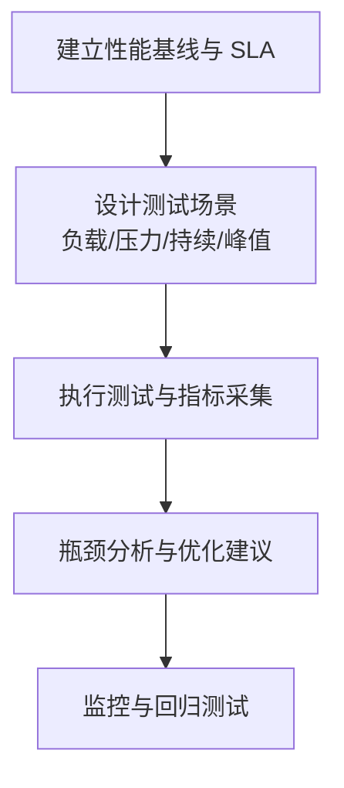

图表来源
- [testing-performance-benchmarker.md:155-178](file://testing/testing-performance-benchmarker.md#L155-L178)
- [phase-2-foundation.md:21-50](file://strategy/playbooks/phase-2-foundation.md#L21-L50)

章节来源
- [testing-performance-benchmarker.md:1-268](file://testing/testing-performance-benchmarker.md#L1-L268)

### 测试结果分析员
- 测试专长：测试结果统计分析与质量洞察，缺陷预测与发布风险评估。
- 质量保证方法：统计显著性、置信区间、多源数据交叉验证、预测模型与 ROI 分析。
- 缺陷检测技术：覆盖率缺口、失败模式聚类、缺陷密度与趋势、质量债务评估。
- 测试优化策略：自动化质量仪表盘、实时告警、持续改进建议。
- 与 CI/CD 的衔接：在阶段 4 硬化阶段聚合各测试结果，输出质量报告与风险评估。

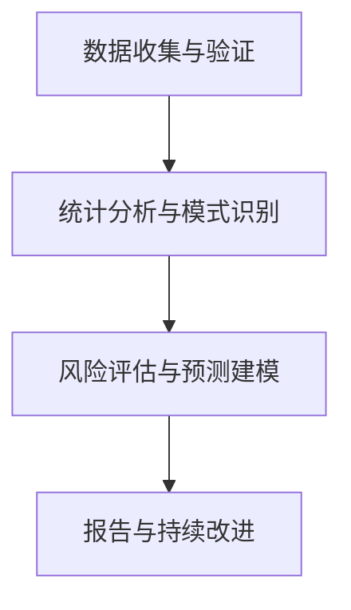

图表来源
- [testing-test-results-analyzer.md:192-215](file://testing/testing-test-results-analyzer.md#L192-L215)
- [phase-4-hardening.md:141-185](file://strategy/playbooks/phase-4-hardening.md#L141-L185)

章节来源
- [testing-test-results-analyzer.md:1-305](file://testing/testing-test-results-analyzer.md#L1-L305)

### 工具评估员
- 测试专长：技术选型与工具评估，综合功能、性能、安全、集成、支持与成本。
- 质量保证方法：量化评分、TCO/ROI 分析、供应商稳定性评估、变更管理。
- 缺陷检测技术：功能测试、性能测试、安全评估、集成测试、支持评估。
- 测试优化策略：分阶段实施、成功指标与监控、供应商关系管理。
- 与 CI/CD 的衔接：为基础设施与工具链选择提供数据支持，确保工具与流程匹配。

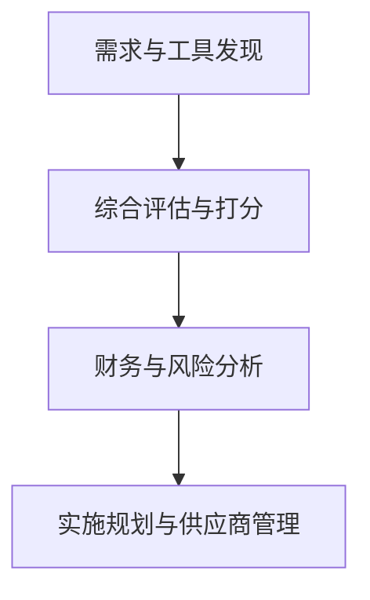

图表来源
- [testing-tool-evaluator.md:281-304](file://testing/testing-tool-evaluator.md#L281-L304)

章节来源
- [testing-tool-evaluator.md:1-394](file://testing/testing-tool-evaluator.md#L1-L394)

### 工作流优化器
- 测试专长：流程映射与瓶颈识别，设计未来状态流程，推动自动化与人机协作。
- 质量保证方法：数据驱动改进、用户满意度、错误率与吞吐量指标。
- 缺陷检测技术：瓶颈识别、自动化机会评估、用户体验设计。
- 测试优化策略：快速胜利、中期改进、战略自动化，建立监控与反馈闭环。
- 与 CI/CD 的衔接：优化开发-测试-部署流程，提升 Dev↔QA 循环效率。

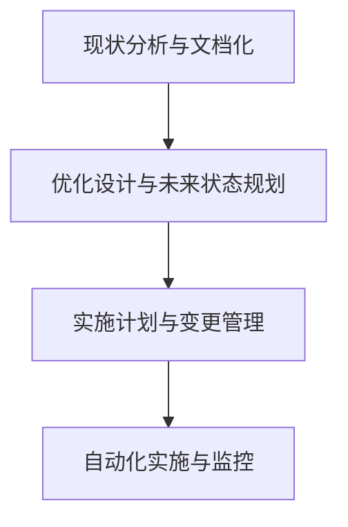

图表来源
- [testing-workflow-optimizer.md:337-360](file://testing/testing-workflow-optimizer.md#L337-L360)

章节来源
- [testing-workflow-optimizer.md:1-450](file://testing/testing-workflow-optimizer.md#L1-L450)

## 依赖关系分析
测试代理之间存在清晰的依赖与协作关系：
- 证据收集器 → 现实检查器：前者提供初步证据，后者进行系统级交叉验证与最终批准。
- 现实检查器 → API 测试员/性能基准测试员/可访问性审计师：现实检查器在系统级验证时，触发专项测试以满足质量门禁。
- 现实检查器 → 测试结果分析员：汇总各专项测试结果，形成质量洞察与风险评估。
- 工具评估员/工作流优化器 → CI/CD：为基础设施与流程优化提供决策依据，确保质量门禁与效率目标一致。

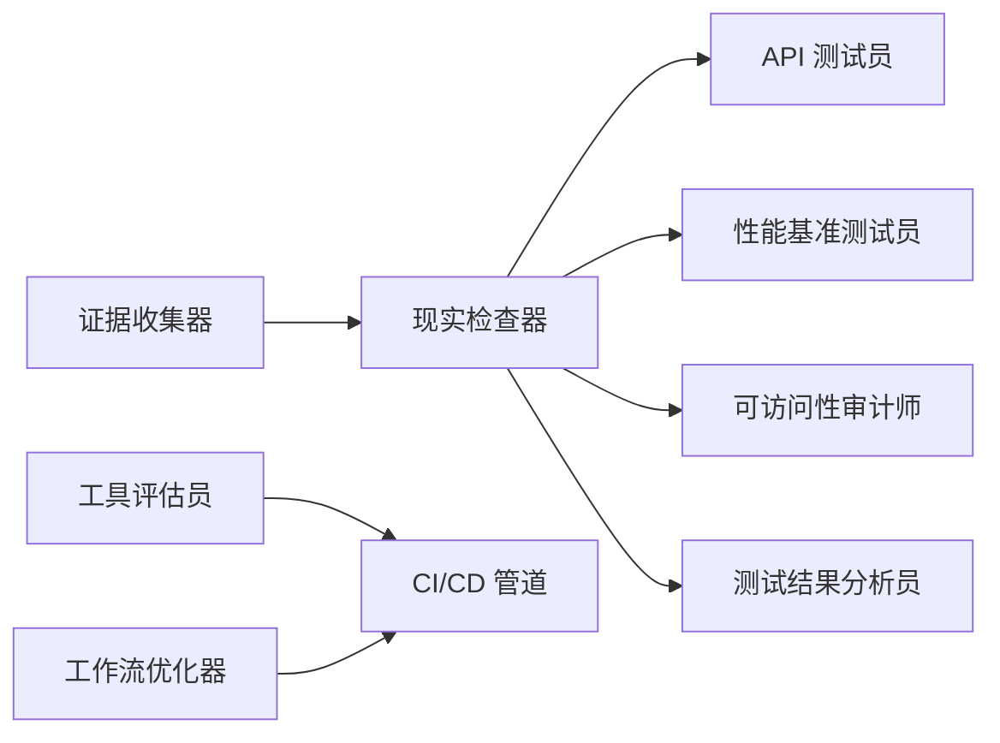

图表来源
- [testing-evidence-collector.md:1-211](file://testing/testing-evidence-collector.md#L1-L211)
- [testing-reality-checker.md:1-237](file://testing/testing-reality-checker.md#L1-L237)
- [testing-api-tester.md:1-306](file://testing/testing-api-tester.md#L1-L306)
- [testing-performance-benchmarker.md:1-268](file://testing/testing-performance-benchmarker.md#L1-L268)
- [testing-accessibility-auditor.md:1-317](file://testing/testing-accessibility-auditor.md#L1-L317)
- [testing-test-results-analyzer.md:1-305](file://testing/testing-test-results-analyzer.md#L1-L305)
- [testing-tool-evaluator.md:1-394](file://testing/testing-tool-evaluator.md#L1-L394)
- [testing-workflow-optimizer.md:1-450](file://testing/testing-workflow-optimizer.md#L1-L450)

章节来源
- [nexus-strategy.md:703-728](file://strategy/nexus-strategy.md#L703-L728)
- [phase-2-foundation.md:1-50](file://strategy/playbooks/phase-2-foundation.md#L1-L50)
- [phase-4-hardening.md:141-185](file://strategy/playbooks/phase-4-hardening.md#L141-L185)

## 性能与效率考量
- 自动化优先：证据收集器与现实检查器依赖 Playwright 截图与 test-results.json 数据，减少手工验证成本。
- 质量门禁：阶段 2 的基础设施与阶段 4 的硬化分析明确质量门禁与回退机制，避免低质量进入生产。
- 多维测试：API 测试员、性能基准测试员、可访问性审计师分别从功能、性能、安全与可用性维度提供强约束。
- 数据驱动：测试结果分析员通过统计与预测模型，为发布决策提供量化依据，降低缺陷逃逸风险。
- 流程优化：工作流优化器与工具评估员从流程与工具两方面提升效率，缩短交付周期并保持质量稳定。

[本节为通用指导，无需特定文件引用]

## 故障排查指南
- 证据不足：若证据收集器无法提供截图或截图与声明不符，现实检查器将自动判定为“需要工作”，需补充证据并重新测试。
- 规范不一致：当规范与实现存在差距，现实检查器会进行差距分析并要求修正，直至规范合规。
- 性能不达标：性能基准测试员若发现加载时间过长或核心指标不达标，需提供优化方案与回归测试结果。
- 可访问性问题：可访问性审计师发现的严重性问题需优先修复，修复后需重新验证并通过可访问性门禁。
- API 安全/性能缺陷：API 测试员发现的安全漏洞或性能问题需在 CI/CD 中通过质量门禁，方可进入下一阶段。
- 工具与流程问题：工具评估员与工作流优化器提供的建议需纳入实施计划，持续监控效果并迭代改进。

章节来源
- [testing-evidence-collector.md:100-141](file://testing/testing-evidence-collector.md#L100-L141)
- [testing-reality-checker.md:122-141](file://testing/testing-reality-checker.md#L122-L141)
- [testing-api-tester.md:42-56](file://testing/testing-api-tester.md#L42-L56)
- [testing-performance-benchmarker.md:42-56](file://testing/testing-performance-benchmarker.md#L42-L56)
- [testing-accessibility-auditor.md:48-68](file://testing/testing-accessibility-auditor.md#L48-L68)
- [phase-4-hardening.md:141-185](file://strategy/playbooks/phase-4-hardening.md#L141-L185)

## 结论
测试代理通过“证据优先”的质量门禁体系，将视觉验证、系统级集成、API 与性能、可访问性、测试结果分析、工具与流程优化有机串联，形成从单元到端到端的完整测试策略。配合 CI/CD 与质量门禁，测试代理有效降低了缺陷逃逸风险，提升了交付效率与用户体验，是软件开发生命周期中不可或缺的质量保障力量。

[本节为总结性内容，无需特定文件引用]

## 附录
- 测试金字塔应用：单元测试（API 测试员与性能基准测试员的细粒度验证）、集成测试（现实检查器的端到端验证与规范一致性）、端到端测试（证据收集器与现实检查器的用户旅程验证）。
- 自动化与持续集成：在阶段 2 基础设施中集成安全扫描、测试、构建与部署阶段；在阶段 4 硬化阶段聚合质量数据并输出风险评估与改进建议。
- 跨代理协作：证据收集器与现实检查器构成质量门禁的核心；API 测试员、性能基准测试员、可访问性审计师提供专项质量保障；测试结果分析员提供数据洞察；工具评估员与工作流优化器提供流程与工具支撑。

章节来源
- [agent-activation-prompts.md:279-328](file://strategy/coordination/agent-activation-prompts.md#L279-L328)
- [phase-2-foundation.md:1-50](file://strategy/playbooks/phase-2-foundation.md#L1-L50)
- [phase-4-hardening.md:141-185](file://strategy/playbooks/phase-4-hardening.md#L141-L185)
- [nexus-strategy.md:703-728](file://strategy/nexus-strategy.md#L703-L728)