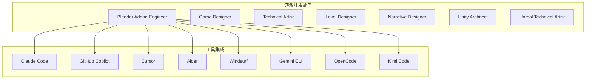
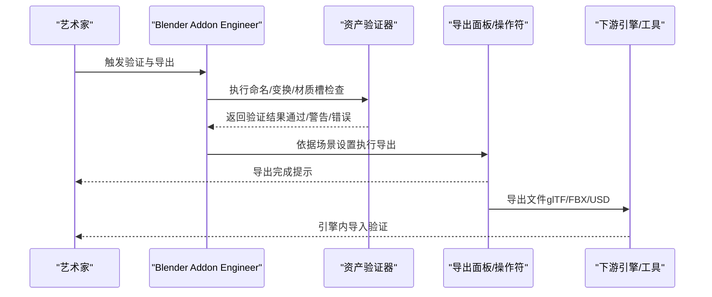
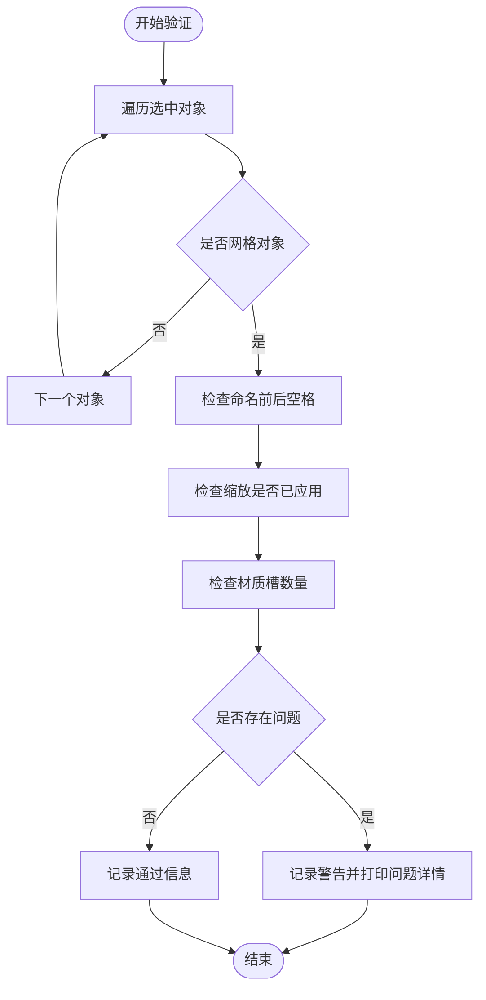
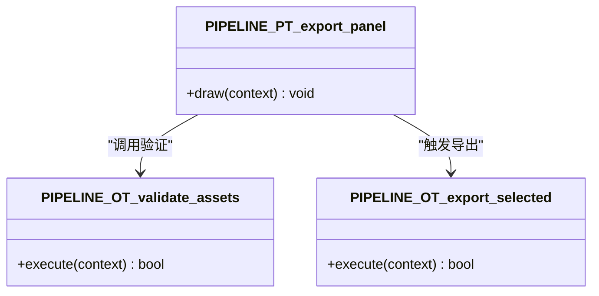
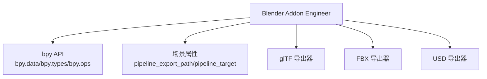

# Blender 游戏开发代理

<cite>
**本文档引用的文件**
- [blender-addon-engineer.md](file://game-development/blender/blender-addon-engineer.md)
- [README.md](file://README.md)
- [CONTRIBUTING.md](file://CONTRIBUTING.md)
- [CONTRIBUTING_zh-CN.md](file://CONTRIBUTING_zh-CN.md)
- [game-designer.md](file://game-development/game-designer.md)
- [technical-artist.md](file://game-development/technical-artist.md)
- [level-designer.md](file://game-development/level-designer.md)
- [narrative-designer.md](file://game-development/narrative-designer.md)
- [unity-architect.md](file://game-development/unity/unity-architect.md)
- [unreal-technical-artist.md](file://game-development/unreal-engine/unreal-technical-artist.md)
</cite>

## 目录
1. [简介](#简介)
2. [项目结构](#项目结构)
3. [核心组件](#核心组件)
4. [架构总览](#架构总览)
5. [详细组件分析](#详细组件分析)
6. [依赖关系分析](#依赖关系分析)
7. [性能考虑](#性能考虑)
8. [故障排除指南](#故障排除指南)
9. [结论](#结论)
10. [附录](#附录)

## 简介
本文件面向希望在 Blender 生态中构建专业游戏开发代理的团队与个人，系统阐述 Blender 插件工程师的专业能力边界、技术实现路径与在游戏开发流水线中的定位。文档基于 The Agency 项目中的 Blender Addon Engineer 代理文件，结合游戏开发领域的系统设计、技术美术、关卡设计与叙事设计等代理，形成从概念设计到最终资产交付的完整工作流蓝图。目标是帮助读者理解如何利用 Blender 的 Python API（bpy）与插件体系，构建可复用、可维护、可扩展的工具链，支撑跨引擎（Unity、Unreal 等）的高质量资产生产与管线自动化。

## 项目结构
The Agency 将代理按职能划分到多个部门，Blender Addon Engineer 归属游戏开发部门下的 Blender 专区。整体项目采用“多工具集成 + 代理模板”的设计，便于在 Claude Code、GitHub Copilot、Cursor、Aider、Windsurf、Gemini CLI、OpenCode、Kimi Code 等平台间复用同一套 agent 文件。

图表来源
- [README.md:324-337](file://README.md#L324-L337)
- [blender-addon-engineer.md:1-235](file://game-development/blender/blender-addon-engineer.md#L1-L235)

章节来源
- [README.md:324-337](file://README.md#L324-L337)
- [blender-addon-engineer.md:1-235](file://game-development/blender/blender-addon-engineer.md#L1-L235)

## 核心组件
Blender Addon Engineer 代理的核心由以下模块构成：
- 身份与记忆：以“管道优先、艺术家共情、自动化痴迷、可靠性导向”为原则，专注于将重复性 Blender 工作流转化为一键式工具。
- 核心使命：构建资产验证器、导出面板、命名审计报告与批量处理工具，标准化向下游引擎与工具的移交。
- 技术交付物：包含资产验证器 Operator、导出面板 Panel、命名审计函数与验证报告模板。
- 工作流程：从管线发现、工具范围定义、插件实现、验证与移交加固到采纳评审。
- 成功指标：重复性任务耗时减少 50%、验证捕获命名/变换/材质槽问题、批处理导出零设置漂移、工具无需阅读源码即可被艺术家使用。

章节来源
- [blender-addon-engineer.md:9-235](file://game-development/blender/blender-addon-engineer.md#L9-L235)

## 架构总览
Blender Addon Engineer 的工作流围绕“验证-导出-报告-复盘”闭环展开，贯穿从场景准备到引擎导入的全过程。下图展示了典型的一次资产准备与导出流程：

图表来源
- [blender-addon-engineer.md:56-124](file://game-development/blender/blender-addon-engineer.md#L56-L124)

章节来源
- [blender-addon-engineer.md:168-195](file://game-development/blender/blender-addon-engineer.md#L168-L195)

## 详细组件分析

### 资产验证器（Asset Validator）
- 目标：在导出前统一检查命名、变换与材质槽，减少手头错误与引擎侧问题。
- 实现要点：
  - 遍历选中对象，过滤网格类型。
  - 检查对象名前后空格、缩放未应用、缺少材质槽等常见问题。
  - 输出系统日志并返回取消状态，确保不会静默失败。
- 可扩展方向：增加层级结构检查、UV/法线完整性检查、纹理贴图缺失检测等。

图表来源
- [blender-addon-engineer.md:56-88](file://game-development/blender/blender-addon-engineer.md#L56-L88)

章节来源
- [blender-addon-engineer.md:56-88](file://game-development/blender/blender-addon-engineer.md#L56-L88)

### 导出面板与操作符（Export Panel & Operator）
- 目标：在 3D View UI 中提供一键导出入口，绑定预设参数与验证动作。
- 实现要点：
  - Panel 放置在正确的空间/区域/类别，确保艺术家能在工作区直接访问。
  - Operator 调用 glTF 导出，启用选择导出、应用变换、导出 UV/法线等关键选项。
  - 通过场景属性控制导出路径与目标，便于批量配置。
- 可扩展方向：支持 FBX/USD 等格式；增加导出前自动备份、增量导出、版本号生成等。

图表来源
- [blender-addon-engineer.md:90-124](file://game-development/blender/blender-addon-engineer.md#L90-L124)

章节来源
- [blender-addon-engineer.md:90-124](file://game-development/blender/blender-addon-engineer.md#L90-L124)

### 命名审计报告（Naming Audit）
- 目标：对对象列表进行命名合规性扫描，区分“问题”与“通过”，便于批量修复与报告生成。
- 实现要点：
  - 检测 Blender 重复后缀与空格，输出结构化报告。
  - 可作为验证器的前置或独立工具使用。
- 可扩展方向：支持正则匹配、命名模板校验、批量重命名建议等。

章节来源
- [blender-addon-engineer.md:126-138](file://game-development/blender/blender-addon-engineer.md#L126-L138)

### 验证报告模板（Validation Report Template）
- 目标：为验证结果提供结构化报告，便于跨团队沟通与追踪。
- 内容要素：摘要（扫描对象数、通过/警告/错误）、错误明细表、警告明细表、建议修复项。
- 应用场景：QA 审查、资产入库、引擎导入前的最终把关。

章节来源
- [blender-addon-engineer.md:145-166](file://game-development/blender/blender-addon-engineer.md#L145-L166)

### 工作流程（Pipeline Discovery → Tool Scope → Implementation → Validation → Adoption）
- 管线发现：梳理手工流程，识别重复性错误类别（命名漂移、未应用变换、集合放置错误、导出设置漂移）。
- 工具范围：确定最小可行切面（验证器/导出器/清理操作符/发布面板），明确可自动修复与需人工确认的边界。
- 插件实现：先定义属性组与偏好设置，再构建操作符与面板，UI 放置在艺术家常用区域。
- 验证与移交加固：在脏场景与边缘案例中测试，对比下游引擎/目标工具的结果，确保工具真正解决手头问题。
- 采纳评审：跟踪艺术家使用频率与反馈，简化 UI 摩擦，文档化每条规则及其存在原因。

章节来源
- [blender-addon-engineer.md:168-195](file://game-development/blender/blender-addon-engineer.md#L168-L195)

### 与游戏开发其他代理的协同
- 游戏设计师（Game Designer）：提供玩法循环与经济平衡的文档模板，指导资产在引擎中的表现与交互。
- 技术美术（Technical Artist）：制定资产预算与着色器/LOD/纹理管线标准，确保 Blender 出口符合引擎性能预算。
- 关卡设计师（Level Designer）：通过布局规范与可读性检查，确保资产在场景中的空间叙事与可玩性。
- 叙事设计师（Narrative Designer）：通过环境叙事简报与分支系统矩阵，指导资产在故事表达中的作用与一致性。
- Unity 架构师（Unity Architect）：提供数据驱动、事件通道与单职责组件的设计范式，便于将 Blender 资产与 Unity 系统解耦对接。
- Unreal 技术美术（Unreal Technical Artist）：提供材质函数、Niagara 性能规则与 PCG 标准，确保 Blender 资产在 UE5 环境中的可视化与性能达标。

章节来源
- [game-designer.md:45-101](file://game-development/game-designer.md#L45-L101)
- [technical-artist.md:52-160](file://game-development/technical-artist.md#L52-L160)
- [level-designer.md:51-137](file://game-development/level-designer.md#L51-L137)
- [narrative-designer.md:53-174](file://game-development/narrative-designer.md#L53-L174)
- [unity-architect.md:55-157](file://game-development/unity/unity-architect.md#L55-L157)
- [unreal-technical-artist.md:53-188](file://game-development/unreal-engine/unreal-technical-artist.md#L53-L188)

## 依赖关系分析
Blender Addon Engineer 的实现依赖于 Blender 的 Python API（bpy）与插件注册机制，同时与下游引擎/工具（glTF/FBX/USD）存在数据契约依赖。下图展示了代理与其外部依赖的关系：

图表来源
- [blender-addon-engineer.md:30-46](file://game-development/blender/blender-addon-engineer.md#L30-L46)
- [blender-addon-engineer.md:90-124](file://game-development/blender/blender-addon-engineer.md#L90-L124)

章节来源
- [blender-addon-engineer.md:30-46](file://game-development/blender/blender-addon-engineer.md#L30-L46)
- [blender-addon-engineer.md:90-124](file://game-development/blender/blender-addon-engineer.md#L90-L124)

## 性能考虑
- 验证与导出的可取消性：长运行批处理应提供进度与可中断能力，避免长时间占用资源。
- 数据 API 优先：优先使用数据 API 访问与修改属性，减少对上下文敏感的操作符调用，提高稳定性与可预测性。
- 状态保持：工具设置应持久化到 AddonPreferences/场景属性/显式配置文件，确保跨会话一致性。
- 导出前的非破坏性策略：除非用户明确选择，否则不应破坏源场景状态；提供“仅预览/干跑”模式以降低风险。

章节来源
- [blender-addon-engineer.md:48-53](file://game-development/blender/blender-addon-engineer.md#L48-L53)
- [blender-addon-engineer.md:36-41](file://game-development/blender/blender-addon-engineer.md#L36-L41)

## 故障排除指南
- 常见问题与处理：
  - 导出失败或文件损坏：检查导出路径权限、目标格式兼容性与导出设置；在验证阶段提前暴露问题。
  - 命名冲突或导入异常：使用命名审计报告与命名模板校验，确保无空格、无重复后缀。
  - 变换未应用导致引擎侧问题：在验证器中强制检查缩放/旋转/位置，必要时提供“一键修复”按钮。
  - 材质槽缺失：在验证器中检测并提示，提供默认材质分配建议。
- 日志与报告：
  - 使用系统控制台输出详细问题日志，便于排查。
  - 生成结构化验证报告，包含错误/警告统计与修复建议，便于跨团队沟通。

章节来源
- [blender-addon-engineer.md:56-88](file://game-development/blender/blender-addon-engineer.md#L56-L88)
- [blender-addon-engineer.md:145-166](file://game-development/blender/blender-addon-engineer.md#L145-L166)

## 结论
Blender Addon Engineer 代理以“管道优先”的理念，将 Blender 的强大建模与动画能力与自动化工具链相结合，显著降低手头错误率并提升资产准备效率。通过严格的 API 使用规范、非破坏性工作流与可复用的验证/导出工具，该代理能够无缝衔接 Unity、Unreal 等引擎的导入与生产流程。配合游戏开发其他代理（设计师、技术美术、关卡与叙事），可形成从概念到资产再到引擎集成的完整闭环，适用于中小型工作室与独立开发者快速搭建稳定、可扩展的 3D 资产管线。

## 附录

### 技术交付物清单
- 资产验证器 Operator：命名/变换/材质槽检查
- 导出面板与操作符：glTF/FBX/USD 导出入口
- 命名审计报告：结构化命名合规扫描
- 验证报告模板：错误/警告统计与修复建议

章节来源
- [blender-addon-engineer.md:56-166](file://game-development/blender/blender-addon-engineer.md#L56-L166)

### 工具集成与安装
- 支持多工具平台：Claude Code、GitHub Copilot、Cursor、Aider、Windsurf、Gemini CLI、OpenCode、Kimi Code。
- 安装脚本：提供 convert.sh 与 install.sh，支持并行安装与交互式选择工具。

章节来源
- [README.md:508-590](file://README.md#L508-L590)