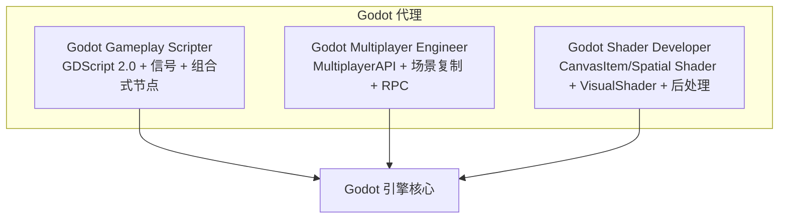
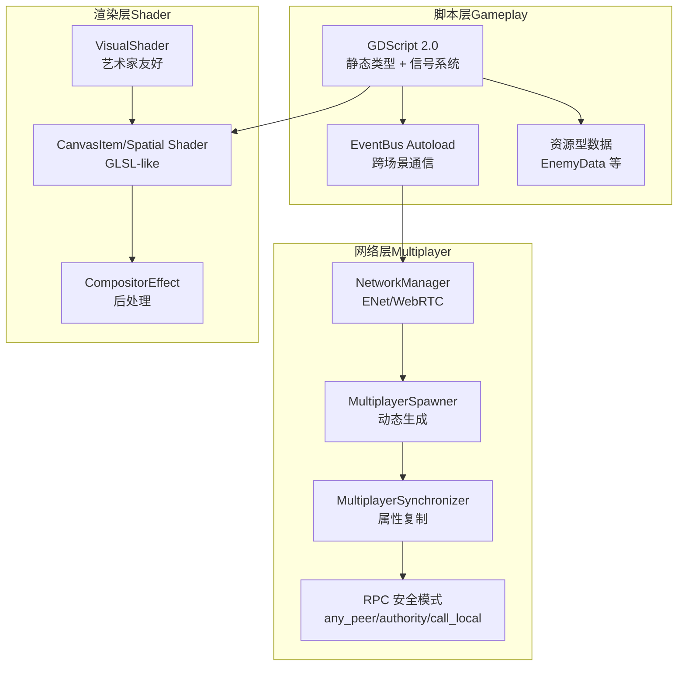
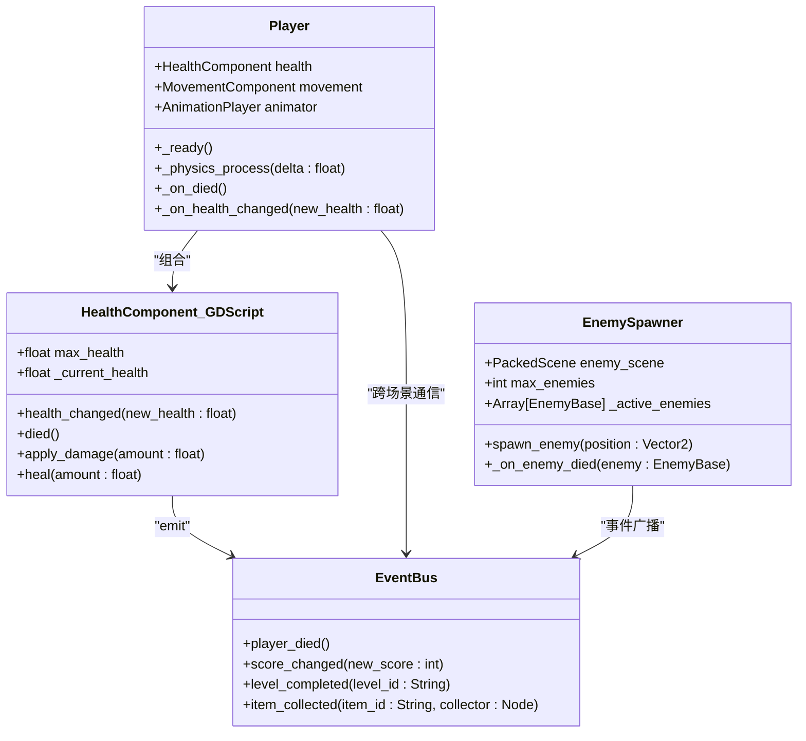
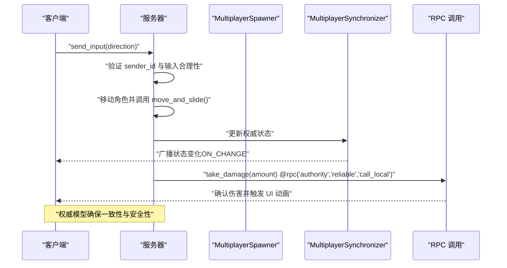
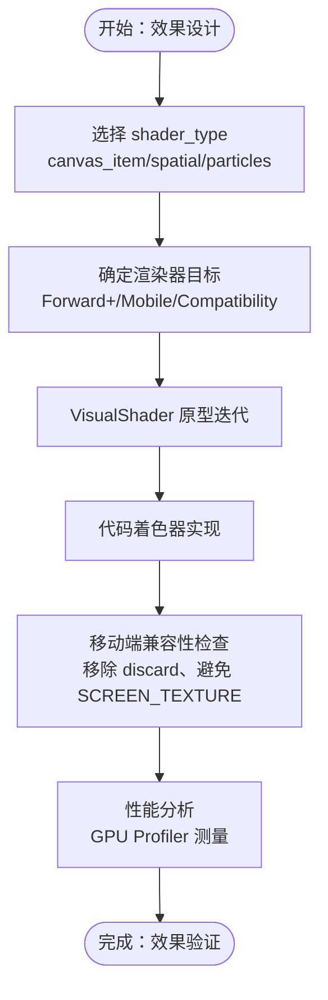
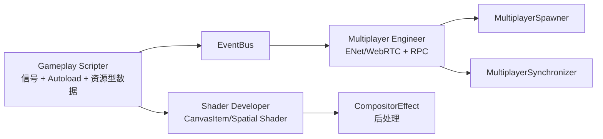

# Godot 游戏开发代理

<cite>
**本文档引用的文件**
- [godot-gameplay-scripter.md](file://game-development/godot/godot-gameplay-scripter.md)
- [godot-multiplayer-engineer.md](file://game-development/godot/godot-multiplayer-engineer.md)
- [godot-shader-developer.md](file://game-development/godot/godot-shader-developer.md)
- [README.md](file://README.md)
</cite>

## 目录
1. [简介](#简介)
2. [项目结构](#项目结构)
3. [核心组件](#核心组件)
4. [架构总览](#架构总览)
5. [详细组件分析](#详细组件分析)
6. [依赖关系分析](#依赖关系分析)
7. [性能考量](#性能考量)
8. [故障排除指南](#故障排除指南)
9. [结论](#结论)
10. [附录](#附录)

## 简介
本文件系统性梳理 Godot 游戏开发代理体系，聚焦三类专业代理：游戏玩法脚本师（Godot Gameplay Scripter）、多人游戏工程师（Godot Multiplayer Engineer）与着色器开发者（Godot Shader Developer）。文档从架构设计、数据流、处理逻辑、集成点与错误处理等维度，深入阐释 Godot 引擎在轻量级游戏架构、高效脚本逻辑与灵活渲染方面的技术优势，并提供从基础脚本编写到高级功能实现的完整路径，帮助读者理解 Godot 的独特优势与最佳实践，以及与其他引擎的差异化特点。

## 项目结构
Godot 代理位于仓库的 game-development/godot 目录下，分别对应三个专业领域：
- 游戏玩法脚本师：专注于 GDScript 2.0、信号系统、节点组合式架构与静态类型安全
- 多人游戏工程师：专注于 MultiplayerAPI、场景复制、ENet/WebRTC 传输、RPC 与权威模型
- 着色器开发者：专注于 Godot 着色语言（GLSL-like）、VisualShader、CanvasItem/Spatial Shader 与后处理管线

图表来源
- [godot-gameplay-scripter.md:1-335](file://game-development/godot/godot-gameplay-scripter.md#L1-L335)
- [godot-multiplayer-engineer.md:1-298](file://game-development/godot/godot-multiplayer-engineer.md#L1-L298)
- [godot-shader-developer.md:1-267](file://game-development/godot/godot-shader-developer.md#L1-L267)

章节来源
- [README.md:316-323](file://README.md#L316-L323)

## 核心组件
本节概述三大代理的核心职责与交付物，体现 Godot 在不同层面的工程化能力。

- 游戏玩法脚本师
  - 关键能力：GDScript 2.0 静态类型、信号驱动架构、Autoload 全局事件总线、资源型数据（类似 ScriptableObject）
  - 交付物：Typed Signal 声明、EventBus Autoload、Composition-Based Player、Typed Array 与安全节点访问模式、GDScript/C# 互操作信号连接
  - 成功指标：零未类型变量、信号参数显式类型、无运行时路径查找、零断开信号

- 多人游戏工程师
  - 关键能力：权威模型（set_multiplayer_authority）、RPC 模式（any_peer/authority/call_local）、MultiplayerSynchronizer 属性复制、MultiplayerSpawner 动态生成
  - 交付物：NetworkManager 服务器/客户端设置、服务端权威控制器、Synchronizer 配置、Spawner 设置、RPC 安全模式
  - 成功指标：权威不匹配为零、任意端调用均经服务端校验、属性路径有效、连接断开干净、延迟测试通过

- 着色器开发者
  - 关键能力：Godot 着色语言（非原生 GLSL）、CanvasItem/Spatial Shader、VisualShader 图形化管线、CompositorEffect 后处理
  - 交付物：2D 精灵描边、3D 溶解、3D 水面、全屏后处理（Forward+）、着色器性能审计清单
  - 成功指标：声明 shader_type 并标注渲染器要求、所有 Uniforms 有提示、兼容性渲染器模式下无错误、无不必要的 SCREEN_TEXTURE

章节来源
- [godot-gameplay-scripter.md:19-335](file://game-development/godot/godot-gameplay-scripter.md#L19-L335)
- [godot-multiplayer-engineer.md:19-298](file://game-development/godot/godot-multiplayer-engineer.md#L19-L298)
- [godot-shader-developer.md:19-267](file://game-development/godot/godot-shader-developer.md#L19-L267)

## 架构总览
三大代理围绕 Godot 引擎形成“脚本-网络-渲染”三层架构，彼此协作实现轻量级、可维护且高性能的游戏系统。

图表来源
- [godot-gameplay-scripter.md:102-112](file://game-development/godot/godot-gameplay-scripter.md#L102-L112)
- [godot-multiplayer-engineer.md:54-97](file://game-development/godot/godot-multiplayer-engineer.md#L54-L97)
- [godot-shader-developer.md:146-168](file://game-development/godot/godot-shader-developer.md#L146-L168)

## 详细组件分析

### 游戏玩法脚本师（Godot Gameplay Scripter）

该代理强调“一切皆节点”的组合式架构，通过信号解耦、静态类型与 Autoload 全局事件总线，构建可维护的玩法系统。

- 信号命名与类型约定
  - GDScript 使用 snake_case，C# 使用 PascalCase + EventHandler 后缀
  - 信号必须携带显式类型参数，避免 Variant
  - 脚本需继承 Object 或其子类以使用信号系统

- 静态类型在 GDScript 2.0
  - 变量、函数参数与返回值必须显式类型
  - Typed Arrays（如 Array[EnemyData]、Array[Node]）替代未类型数组
  - @export 显式类型暴露 Inspector 参数
  - 启用严格模式（@tool + typed GDScript）在解析期发现类型错误

- 节点组合架构
  - 优先组合而非继承：HealthComponent 等子节点优于 CharacterWithHealth 基类
  - 每个场景独立可实例化，避免对父节点或兄弟节点的假设
  - @onready 获取节点引用并显式类型化；通过导出 NodePath 访问兄弟/父节点

- Autoload 规则
  - Autoload 仅用于真正的全局状态：设置、存档、事件总线、输入映射
  - 不在 Autoload 中放置玩法逻辑
  - 推荐 EventBus Autoload（EventBus.gd）替代直接节点引用进行跨场景通信

- 场景树与生命周期纪律
  - _ready 初始化依赖节点树；_exit_tree 断开信号或使用 CONNECT_ONE_SHOT
  - 使用 queue_free 安全删除节点；独立运行场景（F6）验证无父上下文崩溃

- 技术交付物
  - Typed Signal 声明（GDScript/C#）
  - EventBus Autoload（EventBus.gd）
  - 组合式玩家（Composition-Based Player）
  - 资源型数据（EnemyData）
  - Typed Array 与安全节点访问模式
  - GDScript/C# 互操作信号连接

图表来源
- [godot-gameplay-scripter.md:73-100](file://game-development/godot/godot-gameplay-scripter.md#L73-L100)
- [godot-gameplay-scripter.md:102-112](file://game-development/godot/godot-gameplay-scripter.md#L102-L112)
- [godot-gameplay-scripter.md:148-174](file://game-development/godot/godot-gameplay-scripter.md#L148-L174)
- [godot-gameplay-scripter.md:176-190](file://game-development/godot/godot-gameplay-scripter.md#L176-L190)
- [godot-gameplay-scripter.md:192-219](file://game-development/godot/godot-gameplay-scripter.md#L192-L219)

章节来源
- [godot-gameplay-scripter.md:28-335](file://game-development/godot/godot-gameplay-scripter.md#L28-L335)

### 多人游戏工程师（Godot Multiplayer Engineer）

该代理专注于 MultiplayerAPI 的权威模型与场景复制，确保服务端权威、RPC 安全与稳定的网络拓扑。

- 权威模型
  - 服务器（peer ID 1）拥有所有游戏关键状态（位置、生命值、分数、物品状态）
  - 显式设置 set_multiplayer_authority；is_multiplayer_authority() 保护状态变更
  - 客户端通过 RPC 发送输入请求，服务器验证并更新权威状态

- RPC 规则
  - @rpc("any_peer")：允许任何端调用，仅用于客户端向服务器发送请求，需在服务器端验证
  - @rpc("authority")：仅权威端可调用，用于服务器向客户端确认
  - @rpc("call_local")：本地也会执行一次，用于调用者也体验效果

- MultiplayerSynchronizer 约束
  - 仅复制确实需要同步的状态，避免服务器私有状态泄露
  - 使用 ReplicationConfig 控制可见性（REPLICATION_MODE_ALWAYS/ON_CHANGE/NEVER）
  - 所有属性路径在节点进入场景树时有效，无效路径会导致静默失败

- 场景生成
  - 使用 MultiplayerSpawner 生成网络节点，避免手动 add_child 导致不同步
  - 在使用前注册所有将被生成的场景路径
  - 仅权威节点自动生成，非权威端由复制接收

图表来源
- [godot-multiplayer-engineer.md:100-142](file://game-development/godot/godot-multiplayer-engineer.md#L100-L142)
- [godot-multiplayer-engineer.md:144-162](file://game-development/godot/godot-multiplayer-engineer.md#L144-L162)
- [godot-multiplayer-engineer.md:164-192](file://game-development/godot/godot-multiplayer-engineer.md#L164-L192)
- [godot-multiplayer-engineer.md:194-225](file://game-development/godot/godot-multiplayer-engineer.md#L194-L225)

章节来源
- [godot-multiplayer-engineer.md:28-298](file://game-development/godot/godot-multiplayer-engineer.md#L28-L298)

### 着色器开发者（Godot Shader Developer）

该代理精通 Godot 着色语言与 VisualShader，兼顾创意效果与性能优化，覆盖 2D/3D 效果与后处理管线。

- Godot 着色语言特定规则
  - 必须声明 shader_type（canvas_item/spatial/particles/sky）
  - 使用 Godot 内建函数与变量（如 TEXTURE、UV、COLOR），而非 GLSL 语法
  - Spatial Shader 输出变量（如 ALBEDO、METALLIC、ROUGHNESS、NORMAL_MAP）不可作为输入

- 渲染器兼容性
  - Forward+（高端）、Mobile（中端）、Compatibility（最广支持，限制最多）
  - Compatibility 渲染器限制：无计算着色器、无法在 Canvas Shader 中采样 DEPTH_TEXTURE、不支持 HDR 纹理
  - Mobile 渲染器：避免在不透明 Spatial Shader 中使用 discard（建议 Alpha Scissor）

- 性能标准
  - 避免在移动设备上频繁采样 SCREEN_TEXTURE（会强制帧缓冲拷贝）
  - 片段着色器中纹理采样是主要成本，应统计采样次数
  - 所有艺术家参数使用 uniform 并设置提示（hint_range、hint_color、hint_normal 等）
  - 移动端避免动态循环（迭代次数可变的循环）

- VisualShader 标准
  - 使用 VisualShader 供美术扩展；复杂逻辑使用代码着色器
  - 使用 Comment 节点组织节点图；每个 uniform 设置提示

- 技术交付物
  - 2D CanvasItem Shader（精灵描边）
  - 3D Spatial Shader（溶解、水面）
  - 全屏后处理（CompositorEffect，Forward+）
  - 着色器性能审计清单

图表来源
- [godot-shader-developer.md:55-81](file://game-development/godot/godot-shader-developer.md#L55-L81)
- [godot-shader-developer.md:83-110](file://game-development/godot/godot-shader-developer.md#L83-L110)
- [godot-shader-developer.md:112-144](file://game-development/godot/godot-shader-developer.md#L112-L144)
- [godot-shader-developer.md:146-168](file://game-development/godot/godot-shader-developer.md#L146-L168)
- [godot-shader-developer.md:170-198](file://game-development/godot/godot-shader-developer.md#L170-L198)

章节来源
- [godot-shader-developer.md:28-267](file://game-development/godot/godot-shader-developer.md#L28-L267)

## 依赖关系分析
三大代理之间存在明确的依赖与协作关系：
- 脚本层（Gameplay）通过 EventBus 与网络层（Multiplayer）交互，保证跨场景通信与状态同步
- 网络层（Multiplayer）依赖 MultiplayerSpawner 与 MultiplayerSynchronizer 实现场景复制与权威状态传播
- 渲染层（Shader）与脚本层协作，通过材质与后处理增强视觉表现，同时遵循性能约束

图表来源
- [godot-gameplay-scripter.md:102-112](file://game-development/godot/godot-gameplay-scripter.md#L102-L112)
- [godot-multiplayer-engineer.md:54-97](file://game-development/godot/godot-multiplayer-engineer.md#L54-L97)
- [godot-shader-developer.md:146-168](file://game-development/godot/godot-shader-developer.md#L146-L168)

章节来源
- [godot-gameplay-scripter.md:1-335](file://game-development/godot/godot-gameplay-scripter.md#L1-L335)
- [godot-multiplayer-engineer.md:1-298](file://game-development/godot/godot-multiplayer-engineer.md#L1-L298)
- [godot-shader-developer.md:1-267](file://game-development/godot/godot-shader-developer.md#L1-L267)

## 性能考量
- 脚本层
  - 静态类型与 Typed Arrays 提升编辑器智能感知与运行时稳定性
  - 使用 @onready 替代运行时 get_node，减少路径查找开销
  - 避免在 _process 中轮询状态，改用信号驱动

- 网络层
  - 使用 MultiplayerSynchronizer 的 ON_CHANGE 模式减少带宽占用
  - 仅复制必要状态，避免服务器私有状态泄露
  - RPC 使用可靠模式（reliable）保障关键事件

- 渲染层
  - 控制纹理采样次数，避免在移动设备上频繁采样 SCREEN_TEXTURE
  - 在 Compatibility 渲染器下禁用不支持的功能（如 DEPTH_TEXTURE 采样）
  - 使用 CompositorEffect 进行多阶段后处理，按平台分级启用

[本节提供通用指导，无需特定文件来源]

## 故障排除指南
- 信号与类型问题
  - 症状：运行时类型不匹配或信号断开导致“Object not found”
  - 处理：统一信号命名规范（GDScript snake_case、C# PascalCase + EventHandler），确保信号参数显式类型，运行场景独立测试（F6）

- Autoload 滥用
  - 症状：全局状态难以追踪、内存泄漏、场景间状态污染
  - 处理：仅保留真正全局状态（设置、存档、事件总线），移除玩法逻辑；审计 Autoload 生命周期与清理责任

- 多人网络权威与 RPC
  - 症状：状态不同步、作弊风险、连接断开孤儿节点
  - 处理：显式设置 set_multiplayer_authority；@rpc("any_peer") 函数内进行 sender 校验与输入合理性检查；使用 MultiplayerSpawner 生成节点；测试延迟与重连场景

- 着色器兼容性
  - 症状：Compatibility 渲染器报错、移动设备掉帧严重
  - 处理：移除不支持的功能（如 Compatibility 下的 DEPTH_TEXTURE 采样），避免在不透明材质中使用 discard；评估 SCREEN_TEXTURE 使用是否合理

章节来源
- [godot-gameplay-scripter.md:286-335](file://game-development/godot/godot-gameplay-scripter.md#L286-L335)
- [godot-multiplayer-engineer.md:264-298](file://game-development/godot/godot-multiplayer-engineer.md#L264-L298)
- [godot-shader-developer.md:233-267](file://game-development/godot/godot-shader-developer.md#L233-L267)

## 结论
Godot 游戏开发代理体系以“轻量级、可组合、强类型、可视化工具链”为核心，通过 Gameplay Scripter 的信号与静态类型、Multiplayer Engineer 的权威模型与场景复制、Shader Developer 的着色语言与后处理，构建了从玩法逻辑到网络同步再到视觉表现的完整工程化路径。该体系强调：
- 节点组合式架构与信号解耦，降低耦合并提升可维护性
- 服务端权威与 RPC 安全，确保多人游戏一致性与安全性
- 渲染器兼容性与性能审计，平衡创意效果与平台适配

这些特性使 Godot 在中小型团队与独立工作室中具备独特的工程效率优势，同时保持与大型引擎的差异化竞争力。

[本节为总结性内容，无需特定文件来源]

## 附录
- 与其他引擎的差异化特点
  - 与 Unity：Godot 更强调“一切皆节点”的组合式架构与信号系统，而非 ScriptableObject 事件通道；GDScript 2.0 的静态类型在解析期捕获错误，减少运行时风险
  - 与 Unreal：Godot 的 MultiplayerAPI 更贴近场景复制与权威模型，适合中小规模多人游戏；着色器语言更接近 GLSL，VisualShader 提供艺术家友好的图形化管线
  - 与 Roblox：Godot 的节点系统与信号机制更适合复杂玩法与场景管理；Shader 开发更灵活，支持 CanvasItem/Spatial Shader 与 CompositorEffect

[本节为概念性内容，无需特定文件来源]