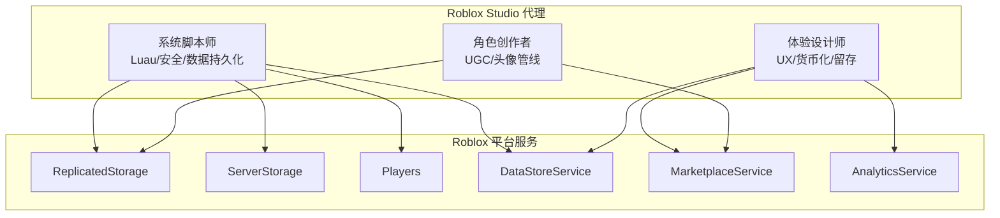
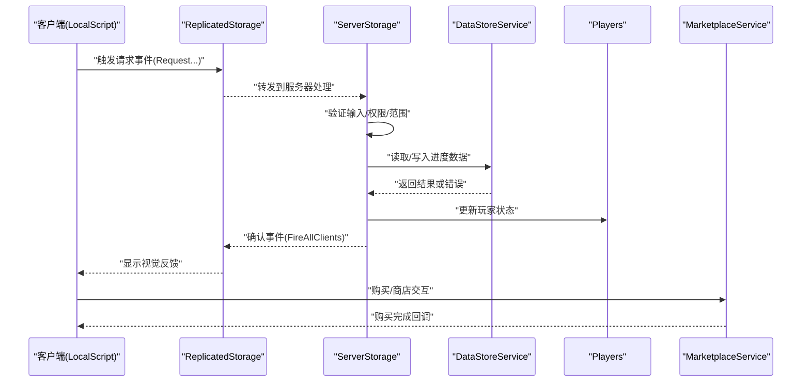
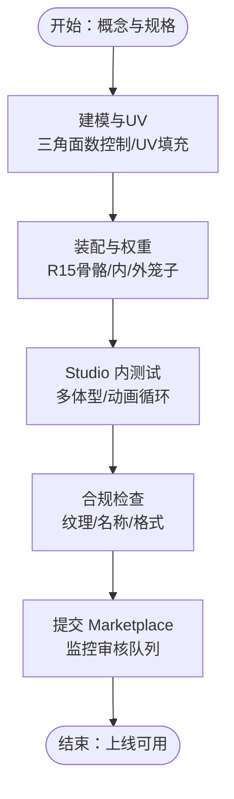
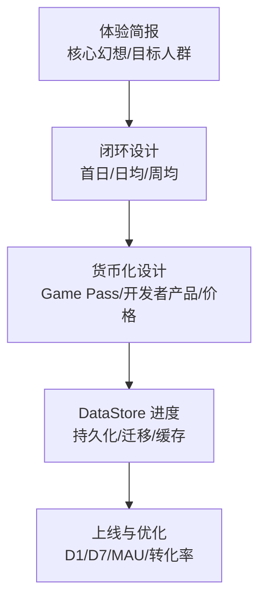
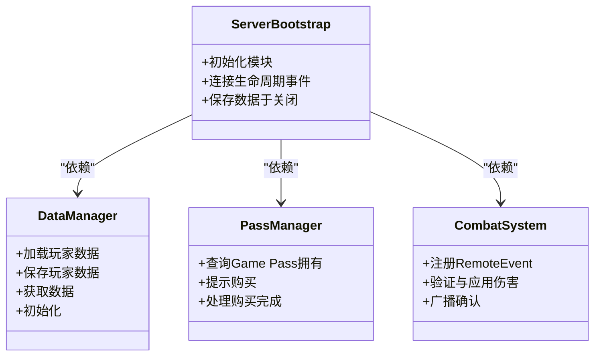
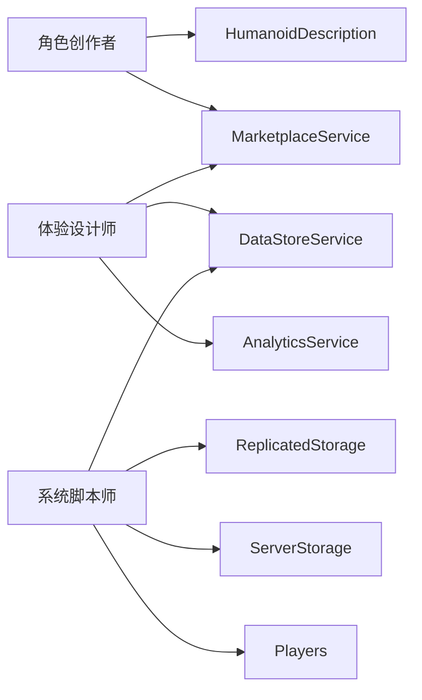

# Roblox Studio 游戏开发代理

<cite>
**本文档引用的文件**
- [roblox-avatar-creator.md](file://game-development/roblox-studio/roblox-avatar-creator.md)
- [roblox-experience-designer.md](file://game-development/roblox-studio/roblox-experience-designer.md)
- [roblox-systems-scripter.md](file://game-development/roblox-studio/roblox-systems-scripter.md)
- [README.md](file://README.md)
</cite>

## 目录
1. [简介](#简介)
2. [项目结构](#项目结构)
3. [核心组件](#核心组件)
4. [架构总览](#架构总览)
5. [详细组件分析](#详细组件分析)
6. [依赖关系分析](#依赖关系分析)
7. [性能考量](#性能考量)
8. [故障排除指南](#故障排除指南)
9. [结论](#结论)
10. [附录](#附录)

## 简介
本文件面向 Roblox Studio 游戏开发团队，系统化介绍三大专业代理：角色创作者（UGC 与头像管线）、体验设计师（平台 UX 与货币化）、系统脚本师（Luau 安全架构与数据持久化）。文档基于仓库中已有的代理文件，总结其职责边界、技术交付物、工作流程与成功指标，并结合 Roblox 平台特性给出可操作的开发指导与最佳实践，帮助构建可扩展的多人游戏体验、丰富的交互系统与稳定的服务器架构。

## 项目结构
Roblox Studio 代理位于游戏开发分部下的 Roblox Studio 子目录中，分别覆盖头像资产管线、体验设计与系统工程三个方面：
- 角色创作者：专注 UGC（用户生成内容）与头像系统，涵盖模型规格、纹理标准、附件绑定、Creator Marketplace 提交与体验内定制。
- 体验设计师：专注玩家留存与货币化，涵盖日奖励、Game Pass、开发者产品、DataStore 进度与伦理货币化。
- 系统脚本师：专注 Luau 脚本、客户端-服务器安全模型、RemoteEvent/RemoteFunction、DataStore 可靠性与模块化架构。

图表来源
- [roblox-avatar-creator.md:85-136](file://game-development/roblox-studio/roblox-avatar-creator.md#L85-L136)
- [roblox-experience-designer.md:54-120](file://game-development/roblox-studio/roblox-experience-designer.md#L54-L120)
- [roblox-systems-scripter.md:56-91](file://game-development/roblox-studio/roblox-systems-scripter.md#L56-L91)

章节来源
- [README.md:330-337](file://README.md#L330-L337)

## 核心组件
- 角色创作者：负责 UGC 配饰与服装的建模、UV、权重与笼子（cage）设置；遵循 Roblox 头像系统规范；实现 HumanoidDescription 的体验内定制；准备 Creator Marketplace 提交材料并通过审核。
- 体验设计师：设计玩家留存与货币化闭环，使用 Game Pass、开发者产品与 UGC 商店；通过 DataStore 实现进度持久化；利用 AnalyticsService 记录关键事件；确保符合平台政策与伦理。
- 系统脚本师：构建服务器权威的游戏逻辑，严格区分客户端与服务器职责；使用 RemoteEvent/RemoteFunction 建立安全通信；以模块化方式组织 Luau 代码；实现 DataStore 的重试与迁移策略。

章节来源
- [roblox-avatar-creator.md:19-27](file://game-development/roblox-studio/roblox-avatar-creator.md#L19-L27)
- [roblox-experience-designer.md:19-27](file://game-development/roblox-studio/roblox-experience-designer.md#L19-L27)
- [roblox-systems-scripter.md:19-27](file://game-development/roblox-studio/roblox-systems-scripter.md#L19-L27)

## 架构总览
三大代理围绕 Roblox Studio 的典型运行时环境协作：
- 客户端侧（LocalScript）：输入处理、UI 与视觉反馈、触发 RemoteEvent。
- 服务器侧（Script）：权威决策、状态变更、DataStore 持久化、事件广播。
- 共享层（ReplicatedStorage/ServerStorage）：远程事件引用、常量与模块化代码。
- 平台服务：Players、DataStoreService、MarketplaceService、AnalyticsService 等。

图表来源
- [roblox-systems-scripter.md:171-229](file://game-development/roblox-studio/roblox-systems-scripter.md#L171-L229)
- [roblox-experience-designer.md:54-120](file://game-development/roblox-studio/roblox-experience-designer.md#L54-L120)
- [roblox-avatar-creator.md:200-228](file://game-development/roblox-studio/roblox-avatar-creator.md#L200-L228)

## 详细组件分析

### 组件一：角色创作者（UGC 与头像管线）
职责与交付：
- UGC 配饰与服装建模与导出：满足三角面数限制、单 UV 通道、无重叠 UV、应用变换等规范；格式与命名约定。
- 附件绑定与兼容性：标准附件点名称、R15/Rthro 兼容测试、层叠服装的内/外笼子网格。
- Creator Marketplace 提交：元数据、图标、预提交校验清单、内容合规风险预检。
- 体验内定制：使用 HumanoidDescription 应用外观、保存与加载玩家装扮、商店购买流程与服务器应用。

图表来源
- [roblox-avatar-creator.md:230-257](file://game-development/roblox-studio/roblox-avatar-creator.md#L230-L257)
- [roblox-avatar-creator.md:170-199](file://game-development/roblox-studio/roblox-avatar-creator.md#L170-L199)

成功指标与沟通风格：
- 技术零拒绝（内容类除外）、多体测试无夹穿、定价与市场一致、HumanoidDescription 无视觉伪影、层叠服装稳定堆叠。

章节来源
- [roblox-avatar-creator.md:264-298](file://game-development/roblox-studio/roblox-avatar-creator.md#L264-L298)

### 组件二：体验设计师（UX/货币化/留存）
职责与交付：
- 留存闭环：日奖励阶梯、首购引导、社交分享与收藏提示。
- 货币化系统：Game Pass 权限缓存、开发者产品消费型商品、价格合规。
- 数据持久化：DataStore 进度安全、版本迁移、免费与付费统一存储。
- 分析与优化：自定义事件记录、漏斗分析、A/B 测试、软发布与限时活动。

图表来源
- [roblox-experience-designer.md:239-265](file://game-development/roblox-studio/roblox-experience-designer.md#L239-L265)
- [roblox-experience-designer.md:177-214](file://game-development/roblox-studio/roblox-experience-designer.md#L177-L214)

成功指标与沟通风格：
- D1/D7/MAU 指标达标、首购转化率、零政策违规。

章节来源
- [roblox-experience-designer.md:272-306](file://game-development/roblox-studio/roblox-experience-designer.md#L272-L306)

### 组件三：系统脚本师（Luau/安全/数据持久化）
职责与交付：
- 客户端-服务器信任边界：服务器权威、客户端仅接收确认；RemoteEvent/RemoteFunction 使用规范。
- 模块化架构：ServerStorage/ReplicatedStorage 分层、模块返回表/类、共享常量。
- DataStore 可靠性：pcall 包裹、指数回退重试、PlayerRemoving/BindToClose 双重保存、速率限制遵守。
- 高级能力：并行执行、内存管理、高级 DataStore 模式（UpdateAsync、版本化、有序查询）、服务注册表与功能开关。

图表来源
- [roblox-systems-scripter.md:56-91](file://game-development/roblox-studio/roblox-systems-scripter.md#L56-L91)
- [roblox-systems-scripter.md:93-169](file://game-development/roblox-studio/roblox-systems-scripter.md#L93-L169)
- [roblox-experience-designer.md:54-120](file://game-development/roblox-studio/roblox-experience-designer.md#L54-L120)

成功指标与沟通风格：
- 零可利用 RemoteEvent、数据保存无丢失、DataStore 保护与重试、模块化清晰。

章节来源
- [roblox-systems-scripter.md:292-326](file://game-development/roblox-studio/roblox-systems-scripter.md#L292-L326)

## 依赖关系分析
- 角色创作者依赖 HumanoidDescription 与 MarketplaceService 实现体验内定制与商店购买；依赖 Studio 内测试确保多体兼容。
- 体验设计师依赖 DataStore 与 AnalyticsService 实现进度持久化与行为分析；依赖 MarketplaceService 实现 Game Pass 与开发者产品。
- 系统脚本师依赖 ReplicatedStorage/ServerStorage 的模块化结构，通过 RemoteEvent/RemoteFunction 与平台服务交互；依赖 DataStoreService 实现可靠持久化。

图表来源
- [roblox-avatar-creator.md:85-136](file://game-development/roblox-studio/roblox-avatar-creator.md#L85-L136)
- [roblox-experience-designer.md:54-120](file://game-development/roblox-studio/roblox-experience-designer.md#L54-L120)
- [roblox-systems-scripter.md:56-91](file://game-development/roblox-studio/roblox-systems-scripter.md#L56-L91)

章节来源
- [roblox-avatar-creator.md:200-228](file://game-development/roblox-studio/roblox-avatar-creator.md#L200-L228)
- [roblox-experience-designer.md:215-238](file://game-development/roblox-studio/roblox-experience-designer.md#L215-L238)
- [roblox-systems-scripter.md:171-229](file://game-development/roblox-studio/roblox-systems-scripter.md#L171-L229)

## 性能考量
- 并行执行与 Actor 模型：使用并行化减少主线程压力，但需注意跨 Actor 数据同步与共享表使用。
- 内存管理：优先空间查询而非遍历所有后代；对象池复用；销毁实例时使用 Destroy 释放资源。
- DataStore 高级模式：优先 UpdateAsync 处理并发冲突；版本化字段与迁移处理器；有序查询支持排行榜场景。
- 服务器架构：事件发射器与服务注册表降低耦合；配置对象驱动的功能开关避免频繁部署。

章节来源
- [roblox-systems-scripter.md:303-326](file://game-development/roblox-studio/roblox-systems-scripter.md#L303-L326)

## 故障排除指南
- RemoteEvent 输入校验：对类型、范围与来源进行严格验证，避免客户端伪造。
- DataStore 异常处理：全部调用包裹 pcall，失败后指数回退重试；在 PlayerRemoving 与 BindToClose 同时保存，防止服务器关闭导致数据丢失。
- 服务器线程安全：避免在服务器端调用 InvokeClient，防止线程挂起；必要时为 RemoteFunction 增加超时处理。
- 体验内购买与商店：客户端触发购买后监听完成回调，再向服务器请求应用与持久化，确保一致性。

章节来源
- [roblox-systems-scripter.md:28-53](file://game-development/roblox-studio/roblox-systems-scripter.md#L28-L53)
- [roblox-systems-scripter.md:171-229](file://game-development/roblox-studio/roblox-systems-scripter.md#L171-L229)
- [roblox-avatar-creator.md:200-228](file://game-development/roblox-studio/roblox-avatar-creator.md#L200-L228)

## 结论
通过角色创作者、体验设计师与系统脚本师的协同，Roblox Studio 可以构建从资产管线到体验设计再到系统工程的完整开发流水线。三大代理分别聚焦 UGC 规范与头像定制、玩家留存与货币化闭环、以及 Luau 安全架构与数据持久化，配合平台服务与模块化架构，能够实现可扩展的多人游戏体验、丰富的交互系统与稳定的服务器架构。

## 附录
- 快速参考
  - 头像附件标准与测试清单：参见 UGC 规范与 Studio 内测试步骤。
  - 日奖励与 Game Pass 缓存：参见进度与购买流程示例。
  - 安全通信与数据持久化：参见 RemoteEvent 模式与 DataStore 重试策略。

章节来源
- [roblox-avatar-creator.md:230-257](file://game-development/roblox-studio/roblox-avatar-creator.md#L230-L257)
- [roblox-experience-designer.md:177-214](file://game-development/roblox-studio/roblox-experience-designer.md#L177-L214)
- [roblox-systems-scripter.md:56-91](file://game-development/roblox-studio/roblox-systems-scripter.md#L56-L91)