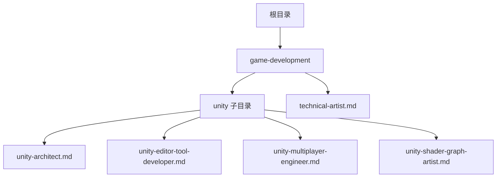
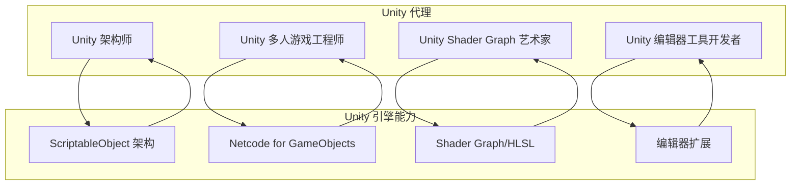
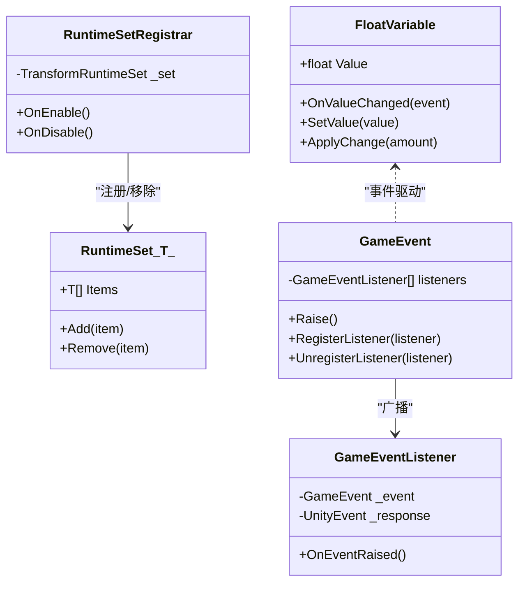
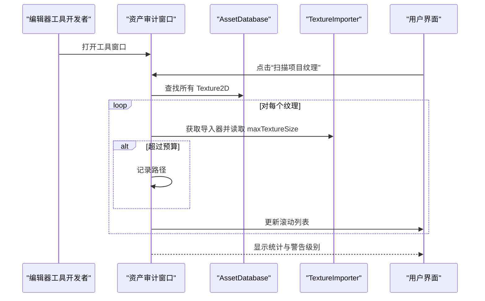
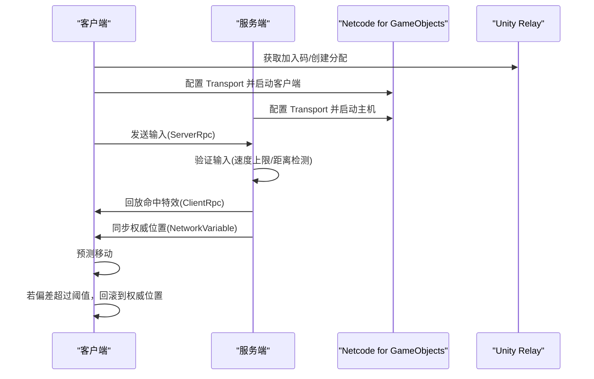
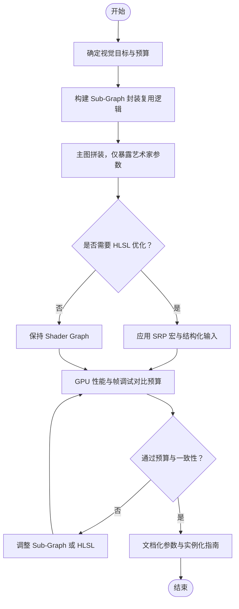
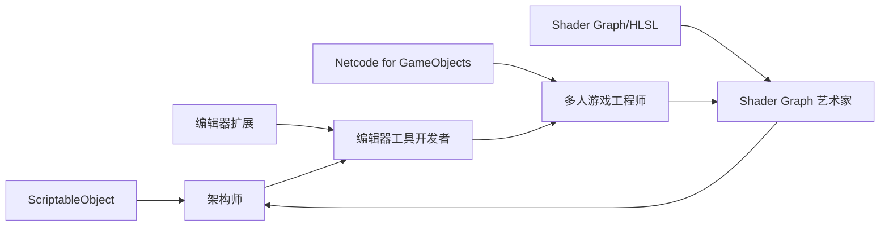

# Unity 游戏开发代理

<cite>
**本文档引用的文件**
- [unity-architect.md](file://game-development/unity/unity-architect.md)
- [unity-editor-tool-developer.md](file://game-development/unity/unity-editor-tool-developer.md)
- [unity-multiplayer-engineer.md](file://game-development/unity/unity-multiplayer-engineer.md)
- [unity-shader-graph-artist.md](file://game-development/unity/unity-shader-graph-artist.md)
- [technical-artist.md](file://game-development/technical-artist.md)
- [README.md](file://README.md)
</cite>

## 目录
1. [简介](#简介)
2. [项目结构](#项目结构)
3. [核心组件](#核心组件)
4. [架构总览](#架构总览)
5. [详细组件分析](#详细组件分析)
6. [依赖关系分析](#依赖关系分析)
7. [性能考量](#性能考量)
8. [故障排查指南](#故障排查指南)
9. [结论](#结论)
10. [附录](#附录)

## 简介
本文件面向 Unity 游戏开发团队，系统梳理四类专业代理：Unity 架构师、Unity 编辑器工具开发者、Unity 多人游戏工程师与 Unity Shader Graph 艺术家。围绕数据驱动架构设计、编辑器扩展开发、网络编程与图形渲染技术，阐述 Unity 代理如何实现模块化系统设计、ScriptableObject 架构模式、事件驱动通信与性能优化策略，并给出从架构设计到最终发布的完整工作流程与最佳实践。

## 项目结构
Unity 代理位于游戏开发子目录中，与跨引擎代理共同构成完整的“Agency”体系。Unity 代理聚焦于 Unity 引擎内的专业能力，覆盖架构、编辑器、网络与图形四大方向。

图表来源
- [README.md:298-305](file://README.md#L298-L305)

章节来源
- [README.md:298-305](file://README.md#L298-L305)

## 核心组件
- Unity 架构师：以 ScriptableObject 为核心的数据驱动架构专家，强调解耦、单一职责与可编辑性，构建可扩展的模块化系统。
- Unity 编辑器工具开发者：以 Editor 扩展为核心的自动化专家，通过 EditorWindow、PropertyDrawer、AssetPostprocessor 等提升团队效率与质量。
- Unity 多人游戏工程师：以 Netcode for GameObjects 与 Unity Gaming Services 为核心的网络专家，专注权威模型、预测与抗作弊。
- Unity Shader Graph 艺术家：以 Shader Graph 与 HLSL 为核心的视觉效果专家，兼顾艺术可用性与性能预算。

章节来源
- [unity-architect.md:1-272](file://game-development/unity/unity-architect.md#L1-L272)
- [unity-editor-tool-developer.md:1-311](file://game-development/unity/unity-editor-tool-developer.md#L1-L311)
- [unity-multiplayer-engineer.md:1-322](file://game-development/unity/unity-multiplayer-engineer.md#L1-L322)
- [unity-shader-graph-artist.md:1-270](file://game-development/unity/unity-shader-graph-artist.md#L1-L270)

## 架构总览
Unity 代理体系采用“代理即角色”的方法论：每个代理拥有明确身份、使命、规则、交付物与成功度量。它们协同工作，形成从架构设计、编辑器工具、网络实现到图形渲染的完整闭环。

图表来源
- [unity-architect.md:29-54](file://game-development/unity/unity-architect.md#L29-L54)
- [unity-editor-tool-developer.md:28-51](file://game-development/unity/unity-editor-tool-developer.md#L28-L51)
- [unity-multiplayer-engineer.md:28-54](file://game-development/unity/unity-multiplayer-engineer.md#L28-L54)
- [unity-shader-graph-artist.md:28-53](file://game-development/unity/unity-shader-graph-artist.md#L28-L53)

## 详细组件分析

### Unity 架构师（数据驱动与模块化）
- 专长领域
  - 数据驱动架构：以 ScriptableObject 作为共享状态与配置载体，消除硬编码与场景耦合。
  - 解耦通信：通过事件通道（GameEvent）与运行时集合（RuntimeSet）替代直接组件引用。
  - 单一职责：每个 MonoBehaviour 只解决一个核心问题；Prefab 自包含，不依赖场景层级。
  - 设计师赋能：通过 CreateAssetMenu 与自定义 PropertyDrawer，让非程序员也能编辑数据。
- 关键模式与实现
  - FloatVariable：封装可观察数值，支持事件通知与增量更新。
  - RuntimeSet：无单例追踪全局实体，降低耦合与内存泄漏风险。
  - GameEvent：集中式事件分发，避免跨对象直接调用。
  - 模块化 MonoBehaviour：以 SO 引用装配组件，保证可测试与可替换。
- 工作流
  - 架构审计：识别硬引用、单例与“上帝类”，绘制数据流向。
  - SO 资产设计：变量、事件、运行时集合按域组织，路径清晰。
  - 组件分解：拆分大类，按职责装配，验证空场景可实例化。
  - 编辑器工具：添加自定义 Drawer 与菜单项，构建构建期校验。
  - 场景架构：轻量化场景，使用 Addressables 或 SO 配置驱动加载。
- 成功指标
  - 零 Find/Singleton 使用；组件规模可控；Prefab 可独立运行。
  - 设计师可直接编辑资产；事件驱动零 GC 波动；序列化变更持久化正确。

图表来源
- [unity-architect.md:57-109](file://game-development/unity/unity-architect.md#L57-L109)
- [unity-architect.md:111-137](file://game-development/unity/unity-architect.md#L111-L137)
- [unity-architect.md:139-157](file://game-development/unity/unity-architect.md#L139-L157)

章节来源
- [unity-architect.md:13-272](file://game-development/unity/unity-architect.md#L13-L272)

### Unity 编辑器工具开发者（编辑器扩展与自动化）
- 专长领域
  - EditorWindow：构建资产审计、纹理预算检查等可视化工具。
  - PropertyDrawer/CustomEditor：改善 Inspector 的可读性与安全性。
  - AssetPostprocessor：导入期强制命名规范、压缩设置与平台适配。
  - 构建前校验：集成 IPreprocessBuildWithReport，提前拦截错误。
- 关键实现
  - 资产审计窗口：扫描项目纹理，筛选超预算资源并提供一键选择。
  - 纹理导入强制器：基于命名约定与路径规则自动设置导入参数。
  - 自定义范围滑条：提供更直观的数值区间编辑体验。
  - 构建校验器：扫描 Resources 中未压缩纹理等违规项并抛出异常。
- 工作流
  - 规格先行：与团队沟通，确定“每周节省 X 分钟”的目标。
  - 原型优先：快速验证可用性，收集反馈迭代。
  - 生产就绪：统一 Undo、进度条与日志；导入规则全部迁移至 AssetPostprocessor。
  - 文档与集成：工具内嵌帮助、菜单入口与 CI 集成。
- 成功指标
  - 工具具备“节省时间”度量；导入错误 100% 被捕获；100% 支持 Prefab 覆盖；构建前校验 100% 拦截违规。

图表来源
- [unity-editor-tool-developer.md:53-109](file://game-development/unity/unity-editor-tool-developer.md#L53-L109)
- [unity-editor-tool-developer.md:111-157](file://game-development/unity/unity-editor-tool-developer.md#L111-L157)

章节来源
- [unity-editor-tool-developer.md:9-311](file://game-development/unity/unity-editor-tool-developer.md#L9-L311)

### Unity 多人游戏工程师（权威模型与预测）
- 专长领域
  - 权威模型：服务端拥有真相，客户端仅发送输入，移动预测与回滚校正。
  - Netcode for GameObjects：合理使用 NetworkVariable、ServerRpc、ClientRpc 与 NetworkObject 注册。
  - Unity Gaming Services：Relay 用于 NAT 穿透，Lobby 用于元数据与心跳。
  - 带宽管理：差分序列化、节流高频状态、位置同步与预测。
- 关键实现
  - 网络初始化：配置 Unity Transport，支持直连或 Relay。
  - 客户端预测：本地即时移动，服务器验证与回滚。
  - Lobby 管理：公开/私有字段可见性控制，心跳维持。
  - RPC/变量设计参考：明确持久状态与一次性事件的边界。
- 工作流
  - 架构设计：选择权威模型，分类复制状态与输入事件，估算带宽。
  - UGS 设置：初始化服务、Relay 与 Lobby 配置。
  - 核心实现：NetworkManager、预测移动、服务端权威。
  - 延迟与可靠性测试：模拟高延迟、并发输入与反作弊校验。
- 成功指标
  - 200ms 延迟下无状态漂移；所有输入均经服务端校验；带宽稳定；Relay 连接成功率高；语音与心跳持续。

图表来源
- [unity-multiplayer-engineer.md:56-99](file://game-development/unity/unity-multiplayer-engineer.md#L56-L99)
- [unity-multiplayer-engineer.md:101-167](file://game-development/unity/unity-multiplayer-engineer.md#L101-L167)
- [unity-multiplayer-engineer.md:169-220](file://game-development/unity/unity-multiplayer-engineer.md#L169-L220)

章节来源
- [unity-multiplayer-engineer.md:9-322](file://game-development/unity/unity-multiplayer-engineer.md#L9-L322)

### Unity Shader Graph 艺术家（材质与后处理）
- 专长领域
  - Shader Graph：以 Sub-Graph 封装复用逻辑，暴露艺术家参数，文档化节点分组。
  - URP/HDRP：Renderer Feature 实现自定义后处理，确保管线兼容与性能预算。
  - HLSL：在需要时转写优化，遵循 SRP 宏与 CBUFFER 命名规范。
  - 性能标准：纹理采样、ALU 指令、透明度与深度写入限制。
- 关键实现
  - 溶解 Shader Graph：噪声图驱动裁剪阈值与边缘发光，封装为 Sub-Graph。
  - URP 自定义渲染通道：轮廓/后处理等全屏效果，使用 ScriptableRendererFeature。
  - 优化 HLSL：PBR 输入数据结构化，减少冗余计算。
  - 复杂度审计：纹理采样、ALU、混合模式、双面渲染与 Sub-Graph 数量。
- 工作流
  - 设计→规格：视觉目标、平台与预算先行。
  - 图形作者：先做 Sub-Graph，再拼装主图，锁定内部细节。
  - HLSL 转换：利用编译产物作为参考，应用 SRP 宏。
  - 性能验证：Frame Debugger 与 GPU Profiler 对比预算。
  - 艺术交接：参数文档化、实例化指南与源文件版本控制。
- 成功指标
  - 全部 Shader 符合平台预算；100% 使用 Sub-Graph；参数均有 Tooltip；移动端回退变体齐全；源文件受控。

图表来源
- [unity-shader-graph-artist.md:203-229](file://game-development/unity/unity-shader-graph-artist.md#L203-L229)
- [unity-shader-graph-artist.md:74-121](file://game-development/unity/unity-shader-graph-artist.md#L74-L121)
- [unity-shader-graph-artist.md:123-177](file://game-development/unity/unity-shader-graph-artist.md#L123-L177)

章节来源
- [unity-shader-graph-artist.md:9-270](file://game-development/unity/unity-shader-graph-artist.md#L9-L270)

### 技术艺术家（跨引擎桥接与性能预算）
- 专长领域
  - 跨引擎桥接：在 Unity、Unreal、Godot 间制定统一的渲染管线与性能标准。
  - 资产预算：多维度（三角面、贴图分辨率、Draw Call、粒子数）预算表。
  - LOD 与纹理管线：强制 LOD 链、纹理压缩与 Mip 规则。
  - VFX 审核：粒子数、Overdraw、Shader 复杂度与 GPU 成本。
- 与 Unity 代理的关系
  - 与 Shader Graph 艺术家互补：前者专注 Unity 内部 Shader Graph/HLSL，后者提供跨引擎视角与通用性能标准。
  - 与编辑器工具开发者协作：通过预算与管线规范，减少美术导入返工。

章节来源
- [technical-artist.md:1-230](file://game-development/technical-artist.md#L1-L230)

## 依赖关系分析
- 组件内聚与耦合
  - 架构师通过 ScriptableObject 与事件通道降低系统耦合，MonoBehaviour 保持单一职责。
  - 编辑器工具开发者将导入期规则固化到 AssetPostprocessor，避免运行时散落的检查逻辑。
  - 多人游戏工程师严格区分 RPC 与 NetworkVariable，避免带宽浪费与状态漂移。
  - Shader Graph 艺术家以 Sub-Graph 与 Renderer Feature 提升可维护性与性能。
- 外部依赖与集成点
  - Unity 引擎 API：ScriptableObject、Netcode、Shader Graph、URP/HDRP。
  - Unity Gaming Services：Relay 与 Lobby。
  - Editor 扩展：EditorWindow、PropertyDrawer、AssetPostprocessor、IPreprocessBuildWithReport。
- 循环依赖规避
  - 通过 SO 事件与接口契约避免组件间直接引用；通过 Addressables 与 SO 配置解耦场景加载。

图表来源
- [unity-architect.md:29-54](file://game-development/unity/unity-architect.md#L29-L54)
- [unity-editor-tool-developer.md:28-51](file://game-development/unity/unity-editor-tool-developer.md#L28-L51)
- [unity-multiplayer-engineer.md:28-54](file://game-development/unity/unity-multiplayer-engineer.md#L28-L54)
- [unity-shader-graph-artist.md:28-53](file://game-development/unity/unity-shader-graph-artist.md#L28-L53)

章节来源
- [unity-architect.md:29-54](file://game-development/unity/unity-architect.md#L29-L54)
- [unity-editor-tool-developer.md:28-51](file://game-development/unity/unity-editor-tool-developer.md#L28-L51)
- [unity-multiplayer-engineer.md:28-54](file://game-development/unity/unity-multiplayer-engineer.md#L28-L54)
- [unity-shader-graph-artist.md:28-53](file://game-development/unity/unity-shader-graph-artist.md#L28-L53)

## 性能考量
- 事件驱动优于轮询：通过 ScriptableObject 事件与 NetworkVariable 变更，避免 Update 中的频繁判断。
- 资源管理：以 Addressables 替代 Resources.Load，支持异步加载与依赖图优化。
- 网络带宽：差分序列化、节流高频状态、RPC 与 NetworkVariable 边界清晰。
- 图形预算：纹理采样、ALU 指令、透明度与深度写入严格控制，Sub-Graph 与 HLSL 优化。
- 编辑器自动化：导入期强制规则，减少 QA 前返工成本。

## 故障排查指南
- 常见反模式与规避
  - “上帝类”与单例滥用：以 ScriptableObject 与事件通道替代静态引用。
  - 直接查找 GameObject：使用 Inspector 绑定的 SO 引用。
  - Update 中的逻辑：改用事件驱动或定时节流。
  - 未持久化序列化变更：修改 SO 后调用持久化 API。
- 网络常见问题
  - 客户端状态漂移：确认服务端权威与回滚阈值设置。
  - 带宽过高：检查 NetworkVariable 是否每帧重复赋值，使用差分或节流。
  - Relay 连接失败：检查 NAT 类型与分配参数。
- 图形常见问题
  - 移动端掉帧：核查纹理采样与 ALU 指令，启用移动回退变体。
  - 过度透明叠加：优先 Alpha Clipping，减少 Overdraw。
  - Shader Graph 节点重复：统一封装为 Sub-Graph。

章节来源
- [unity-architect.md:48-54](file://game-development/unity/unity-architect.md#L48-L54)
- [unity-multiplayer-engineer.md:28-54](file://game-development/unity/unity-multiplayer-engineer.md#L28-L54)
- [unity-shader-graph-artist.md:28-53](file://game-development/unity/unity-shader-graph-artist.md#L28-L53)

## 结论
Unity 代理体系通过“角色化”的方法论，将复杂的游戏开发任务拆分为可执行、可度量的专业能力。架构师负责数据驱动与模块化，编辑器工具开发者负责自动化与质量门禁，多人游戏工程师负责权威模型与预测，Shader Graph 艺术家负责视觉与性能平衡。四者协同，形成从设计到发布的完整闭环，并通过严格的规则、交付物与成功指标保障质量与效率。

## 附录
- 最佳实践清单
  - 架构：以 ScriptableObject 为中心，事件驱动通信，单一职责组件，空场景可运行。
  - 编辑器：导入期强制规则，Undo 支持，进度反馈，构建前校验。
  - 网络：服务端权威，RPC/变量边界清晰，带宽节流，延迟与反作弊测试。
  - 图形：预算先行，Sub-Graph 封装，移动回退变体，GPU 性能验证。
- 创新解决方案
  - 混合 DOTS/MonoBehaviour 架构：ECS 驱动仿真，MonoBehaviours 处理表现层。
  - UI Toolkit Editor 工具：响应式、主题化与数据绑定，提升 DX。
  - 客户端预测+回滚：适用于高延迟与竞技类游戏。
  - 计算着色器与 GPU 驱动渲染：大规模实例化与实时生成。