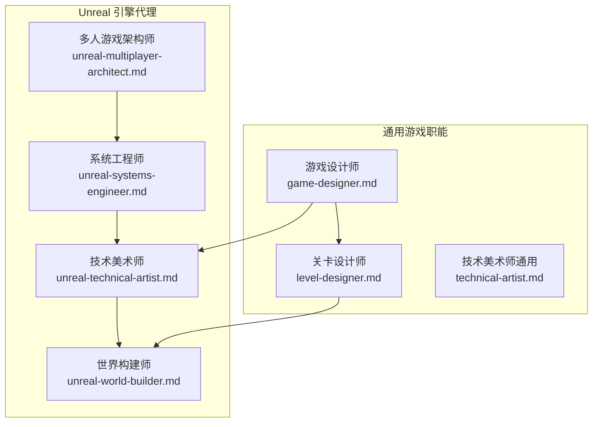
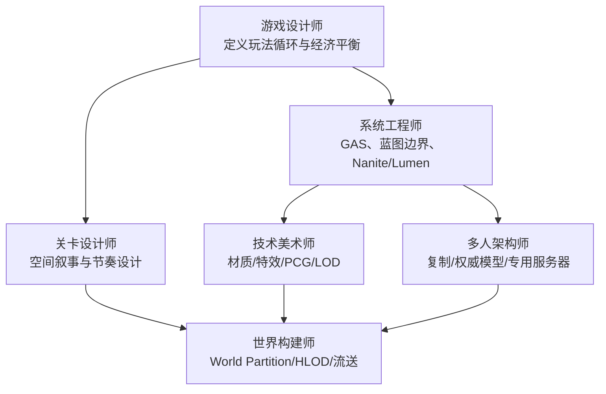
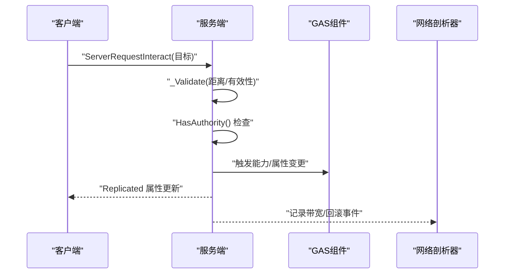
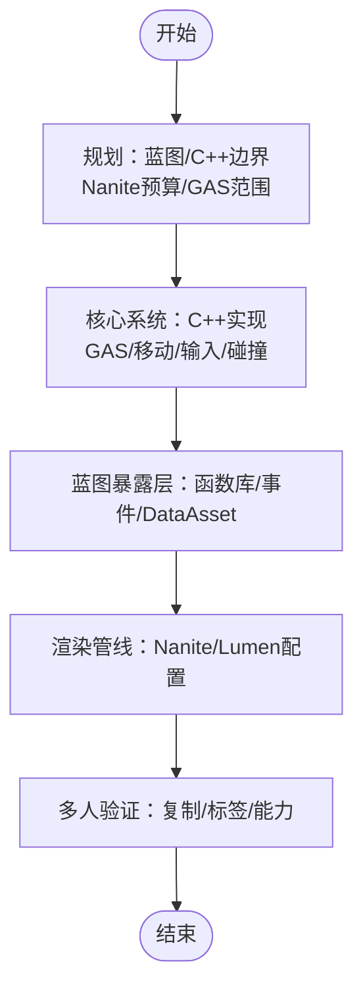
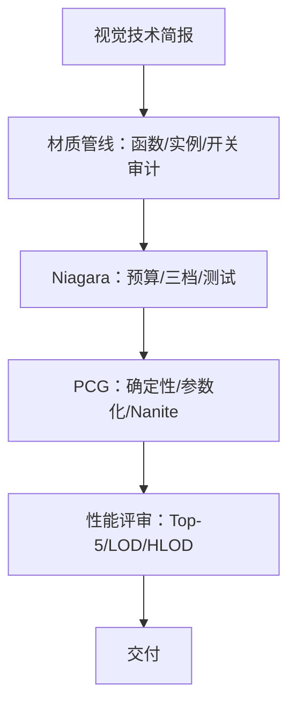
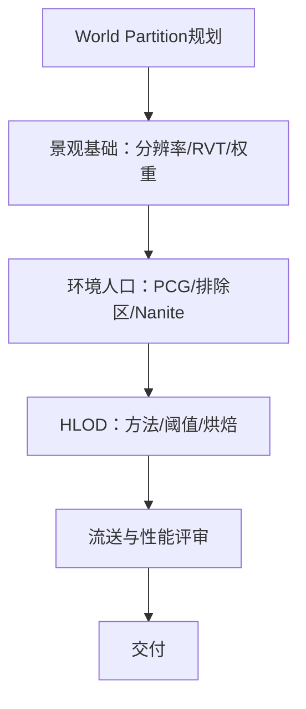
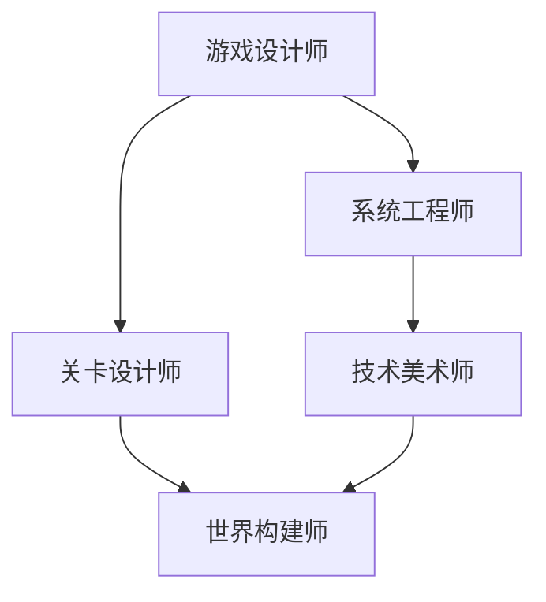
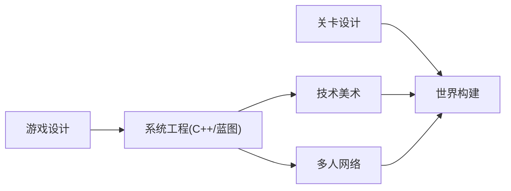

# Unreal 引擎游戏开发代理

<cite>
**本文档引用的文件**
- [unreal-multiplayer-architect.md](file://game-development/unreal-engine/unreal-multiplayer-architect.md)
- [unreal-systems-engineer.md](file://game-development/unreal-engine/unreal-systems-engineer.md)
- [unreal-technical-artist.md](file://game-development/unreal-engine/unreal-technical-artist.md)
- [unreal-world-builder.md](file://game-development/unreal-engine/unreal-world-builder.md)
- [README.md](file://README.md)
- [game-designer.md](file://game-development/game-designer.md)
- [level-designer.md](file://game-development/level-designer.md)
- [technical-artist.md](file://game-development/technical-artist.md)
</cite>

## 目录
1. [简介](#简介)
2. [项目结构](#项目结构)
3. [核心组件](#核心组件)
4. [架构总览](#架构总览)
5. [详细组件分析](#详细组件分析)
6. [依赖关系分析](#依赖关系分析)
7. [性能考量](#性能考量)
8. [故障排查指南](#故障排查指南)
9. [结论](#结论)
10. [附录](#附录)

## 简介
本文件面向使用 Unreal Engine 的游戏开发团队，系统化介绍四类专业代理：多人游戏架构师、系统工程师、技术美术师与世界构建师。文档基于仓库中已有的 Unreal 引擎代理文件，结合游戏设计与关卡设计等跨职能内容，阐述如何在 Unreal 中实现高性能的多人网络架构、复杂的渲染管线与沉浸式的世界构建，并提供从概念设计到技术实现的完整工作流程与最佳实践。

## 项目结构
Unreal 引擎代理位于 game-development/unreal-engine 目录下，分别覆盖多端网络、系统工程、技术美术与世界构建四大方向；同时，仓库还包含通用的游戏设计、关卡设计与技术美术代理，用于支撑跨职能协作与统一的设计语言。

图表来源
- [README.md](file://README.md)
- [unreal-multiplayer-architect.md](file://game-development/unreal-engine/unreal-multiplayer-architect.md)
- [unreal-systems-engineer.md](file://game-development/unreal-engine/unreal-systems-engineer.md)
- [unreal-technical-artist.md](file://game-development/unreal-engine/unreal-technical-artist.md)
- [unreal-world-builder.md](file://game-development/unreal-engine/unreal-world-builder.md)
- [game-designer.md](file://game-development/game-designer.md)
- [level-designer.md](file://game-development/level-designer.md)
- [technical-artist.md](file://game-development/technical-artist.md)

章节来源
- [README.md](file://README.md)
- [unreal-multiplayer-architect.md](file://game-development/unreal-engine/unreal-multiplayer-architect.md)
- [unreal-systems-engineer.md](file://game-development/unreal-engine/unreal-systems-engineer.md)
- [unreal-technical-artist.md](file://game-development/unreal-engine/unreal-technical-artist.md)
- [unreal-world-builder.md](file://game-development/unreal-engine/unreal-world-builder.md)
- [game-designer.md](file://game-development/game-designer.md)
- [level-designer.md](file://game-development/level-designer.md)
- [technical-artist.md](file://game-development/technical-artist.md)

## 核心组件
- 多人游戏架构师：负责服务器权威模型、Actor 复制、GameMode/GameState 层级、GAS 复制、专用服务器配置与网络效率优化。
- 系统工程师：负责 C++/蓝图边界、GAS 网络就绪实现、Nanite/Lumen 使用约束、内存管理与垃圾回收、模块依赖与构建系统。
- 技术美术师：负责材质函数库、Niagara VFX 性能预算、PCG 可扩展环境生成、LOD 与剔除标准、渲染管线优化与性能分析。
- 世界构建师：负责 World Partition 流送网格、景观材质与运行时虚拟纹理、HLOD 分层、大规模环境人口与流媒体性能验证。

章节来源
- [unreal-multiplayer-architect.md](file://game-development/unreal-engine/unreal-multiplayer-architect.md)
- [unreal-systems-engineer.md](file://game-development/unreal-engine/unreal-systems-engineer.md)
- [unreal-technical-artist.md](file://game-development/unreal-engine/unreal-technical-artist.md)
- [unreal-world-builder.md](file://game-development/unreal-engine/unreal-world-builder.md)

## 架构总览
Unreal 引擎代理体系以“设计—系统—美术—世界”为主线，贯穿从玩法设计到技术实现再到世界构建的全流程。系统工程师奠定 C++/蓝图边界与核心系统（如 GAS），技术美术师保障视觉质量与性能预算，世界构建师确保大规模世界的流送与渲染稳定，多人架构师则保证网络层面的权威性与低延迟体验。

图表来源
- [README.md](file://README.md)
- [game-designer.md](file://game-development/game-designer.md)
- [level-designer.md](file://game-development/level-designer.md)
- [unreal-systems-engineer.md](file://game-development/unreal-engine/unreal-systems-engineer.md)
- [unreal-technical-artist.md](file://game-development/unreal-engine/unreal-technical-artist.md)
- [unreal-world-builder.md](file://game-development/unreal-engine/unreal-world-builder.md)
- [unreal-multiplayer-architect.md](file://game-development/unreal-engine/unreal-multiplayer-architect.md)

## 详细组件分析

### 多人游戏架构师
职责与能力
- 服务器权威模型：服务端模拟，客户端预测与回滚；所有游戏状态变更在服务端执行，客户端通过 RPC 提交请求并由服务端校验。
- 复制效率：合理使用 UPROPERTY(Replicated)/ReplicatedUsing、GetNetPriority/SetNetUpdateFrequency、条件复制（OwnerOnly/SimulatedOnly）降低带宽。
- 网络层级：GameMode（仅服务端）、GameState（全局共享）、PlayerState（玩家公开数据）、PlayerController（拥有者独占）严格分离。
- RPC 可靠性：可靠 RPC 保证顺序但增加带宽，不可靠 RPC 适合高频视觉效果；避免每帧合并可靠 RPC。
- GAS 复制：角色拥有 AbilitySystemComponent，服务端/客户端双路径初始化，属性复制正确性验证。
- 专用服务器：配置默认地图、网络带宽、打包脚本，进行峰值压力下的 CPU/带宽/反作弊审计。

工作流程
- 设计网络架构：确定权威模型、分层复制与 RPC 预算。
- 实现核心复制：Actor 的 GetLifetimeReplicatedProps、DOREPLIFETIME_CONDITION、Server RPC 校验。
- 集成 GAS：Dual init（PossessedBy/OnRep_PlayerState），调试命令验证属性复制。
- 网络剖析：stat net/Network Profiler、可视化回滚、峰值硬件压力测试。
- 反作弊加固：逐条审计 Server RPC 输入合法性，杜绝绕过权威检查的漏洞。

图表来源
- [unreal-multiplayer-architect.md](file://game-development/unreal-engine/unreal-multiplayer-architect.md)

章节来源
- [unreal-multiplayer-architect.md](file://game-development/unreal-engine/unreal-multiplayer-architect.md)

### 系统工程师
职责与能力
- C++/蓝图边界：每帧逻辑必须在 C++ 实现；蓝图适用于高层流程、UI 与序列器驱动事件。
- Nanite 使用约束：单场景最多约 1600 万实例；不兼容骨骼网格体、复杂遮罩、样条网格与程序网格；启用 r.Nanite.Visualize 提前发现异常。
- 内存管理：UObject 指针必须用 UPROPERTY 声明；非拥有引用使用 TWeakObjectPtr；始终用 IsValid() 检查对象有效性。
- GAS 要求：在 .Build.cs 显式声明 GameplayAbilities/GameplayTags/GameplayTasks；属性集使用 GAMEPLAYATTRIBUTE_REPNOTIFY 宏；标签系统优先于字符串标识。
- 构建系统：修改 .Build.cs 或 .uproject 后运行 GenerateProjectFiles；模块依赖显式、无环依赖。

工作流程
- 项目架构规划：明确 C++/蓝图分工、GAS 范围、Nanite 预算与模块结构。
- 核心系统在 C++：AttributeSet/Ability/AbilitySystemComponent 子类化；自定义移动/输入/碰撞在 C++ 实现。
- 蓝图暴露层：蓝图函数库、可实现事件、DataAsset；编辑器内联测验证。
- 渲染管线设置：启用 Nanite/Lumen；stat Nanite/Unreal Insights；内容锁定前完成性能基线。
- 多人验证：打包后验证属性复制、标签复制与能力激活。

图表来源
- [unreal-systems-engineer.md](file://game-development/unreal-engine/unreal-systems-engineer.md)

章节来源
- [unreal-systems-engineer.md](file://game-development/unreal-engine/unreal-systems-engineer.md)

### 技术美术师
职责与能力
- 材质编辑：复用逻辑放入材质函数；材质实例用于艺术家可调参数；限制 Static Switch 数量；使用 Quality Switch 制作移动端/主机/PC 等级。
- Niagara 性能：CPU 模拟适合 <1000 粒子；GPU 模拟适合 >1000；设置 Max Particle Count；Niagara Scalability 三档预设；避免 GPU 粒子碰撞，采用深度缓冲碰撞。
- PCG 标准：确定性生成；密度/尺度/排除区参数化；Nanite 优先；文档化参数接口。
- LOD 与剔除：Nanite 不适用的网格需手动 LOD；按资产类别设置剔除距离体积；开放世界启用 HLOD。

工作流程
- 视觉技术简报：目标平台/质量等级/Perf 预算；现有材质函数库审计；LOD/Nanite 策略。
- 材质管线：Master 材料+材质实例；材质函数库；静态开关数量审计。
- Niagara 生产：先预算再构建；随系统同步建立 Scalability；入游戏最大并发测试。
- PCG 图开发：测试级别原型；目标硬件验证；World Partition 流送行为分析。
- 性能评审：Unreal Insights 识别 Top-5 成本；距离 LOD 视图器验证；HLOD 全距离视觉校验。

图表来源
- [unreal-technical-artist.md](file://game-development/unreal-engine/unreal-technical-artist.md)

章节来源
- [unreal-technical-artist.md](file://game-development/unreal-engine/unreal-technical-artist.md)

### 世界构建师
职责与能力
- World Partition：单元格尺寸依据流送预算选择（城市64m，地形128m，沙漠/海洋256m+）；关键内容不得放置在单元边界；Always Loaded 数据层集中管理。
- 景观标准：分辨率遵循 (n×ComponentSize)+1；单区域最多4层；启用 RVT；洞口使用可见层而非删除组件。
- HLOD：对 >500m 距离可见区域强制生成；Mesh Merge 方法；屏幕阈值≤0.01；烘焙材质；重建触发条件明确。
- 环境人口与 PCG：Foliage Tool 仅用于英雄放置；大规模使用 PCG 或 Procedural Foliage；Nanite 优先；排除区明确；大区域预烘焙。

工作流程
- 世界规模与网格规划：确定世界尺寸/生物群落/兴趣点；选择各层网格单元格；锁定 Always Loaded 内容。
- 景观基础：正确分辨率；多层材质+RVT；先画生物群落权重再放道具。
- 环境人口：PCG 图生成；排除区配置；确认 Nanite 可用性。
- HLOD 生成：稳定几何后生成；远距离视觉验证；里程碑后重建。
- 流送与性能评审：玩家遍历压力测试；检查流送/渲染/内存预算。

图表来源
- [unreal-world-builder.md](file://game-development/unreal-engine/unreal-world-builder.md)

章节来源
- [unreal-world-builder.md](file://game-development/unreal-engine/unreal-world-builder.md)

### 概念总览
- 游戏设计师：以玩家动机为中心，设计可落地的玩法循环、经济平衡与新手引导，产出可执行的设计文档。
- 关卡设计师：以空间叙事为核心，控制节奏、教学与战斗可读性，输出布局规范与可玩性验证。
- 技术美术师（通用）：在不同引擎间保持艺术与工程的桥梁，制定预算与管线标准，确保视觉质量与性能平衡。

图表来源
- [game-designer.md](file://game-development/game-designer.md)
- [level-designer.md](file://game-development/level-designer.md)
- [technical-artist.md](file://game-development/technical-artist.md)
- [unreal-systems-engineer.md](file://game-development/unreal-engine/unreal-systems-engineer.md)
- [unreal-technical-artist.md](file://game-development/unreal-engine/unreal-technical-artist.md)
- [unreal-world-builder.md](file://game-development/unreal-engine/unreal-world-builder.md)

章节来源
- [game-designer.md](file://game-development/game-designer.md)
- [level-designer.md](file://game-development/level-designer.md)
- [technical-artist.md](file://game-development/technical-artist.md)

## 依赖关系分析
- 蓝图与 C++ 边界：蓝图用于高层流程与 UI，每帧逻辑必须在 C++；蓝图暴露层通过 UFUNCTION 暴露给非程序员。
- 渲染管线依赖：Nanite/Lumen 需要严格的网格与材质约束；PCG 与 HLOD 依赖 World Partition 的网格与数据层。
- 多人系统依赖：GAS 属性复制与 RPC 校验是网络稳定性的基石；专用服务器配置影响带宽与 CPU 占用。
- 设计与实现协同：游戏/关卡设计文档指导美术与世界构建，技术美术与世界构建师提供性能约束反馈。

图表来源
- [README.md](file://README.md)
- [game-designer.md](file://game-development/game-designer.md)
- [level-designer.md](file://game-development/level-designer.md)
- [unreal-systems-engineer.md](file://game-development/unreal-engine/unreal-systems-engineer.md)
- [unreal-technical-artist.md](file://game-development/unreal-engine/unreal-technical-artist.md)
- [unreal-world-builder.md](file://game-development/unreal-engine/unreal-world-builder.md)
- [unreal-multiplayer-architect.md](file://game-development/unreal-engine/unreal-multiplayer-architect.md)

章节来源
- [README.md](file://README.md)
- [game-designer.md](file://game-development/game-designer.md)
- [level-designer.md](file://game-development/level-designer.md)
- [unreal-systems-engineer.md](file://game-development/unreal-engine/unreal-systems-engineer.md)
- [unreal-technical-artist.md](file://game-development/unreal-engine/unreal-technical-artist.md)
- [unreal-world-builder.md](file://game-development/unreal-engine/unreal-world-builder.md)
- [unreal-multiplayer-architect.md](file://game-development/unreal-engine/unreal-multiplayer-architect.md)

## 性能考量
- 复制频率与带宽：根据 Actor 类型设置 NetUpdateFrequency，私有状态 OwnerOnly，Cosmetic 效果 Multicast。
- 渲染预算：材质指令数、纹理采样、Static Switch 数量与 Quality Tier；Niagara 最大粒子数与 Overdraw 层级；PCG 密度与 HLOD 阈值。
- 流送与内存：World Partition 单元格大小与加载范围；Always Loaded 层；RVT 缓存预热；峰值区域内存与绘制开销。
- 多人稳定性：RPC 校验覆盖率、回滚事件频次、CPU 占用与带宽；反作弊审计与日志记录。

## 故障排查指南
- 多人网络
  - 验证所有 Server RPC 是否具备 _Validate；缺失校验是作弊向量。
  - 检查 HasAuthority() 保护；避免客户端直接修改游戏状态。
  - 使用 Network Profiler 与 p.NetShowCorrections 观察回滚。
- 系统工程
  - 检查 .Build.cs 模块依赖是否环形；GenerateProjectFiles 是否执行。
  - 确认 UObject 指针均被 UPROPERTY 管理；使用 IsValid()。
- 技术美术
  - 材质函数重复逻辑审计；Static Switch 数量与 Quality Tier。
  - Niagara Scalability 三档测试；GPU 模拟成本评估。
- 世界构建
  - World Partition 单元格边界关键内容迁移；Always Loaded 层完整性。
  - HLOD 重建触发与远距离视觉验证；RVT 层级与缓存预热。

章节来源
- [unreal-multiplayer-architect.md](file://game-development/unreal-engine/unreal-multiplayer-architect.md)
- [unreal-systems-engineer.md](file://game-development/unreal-engine/unreal-systems-engineer.md)
- [unreal-technical-artist.md](file://game-development/unreal-engine/unreal-technical-artist.md)
- [unreal-world-builder.md](file://game-development/unreal-engine/unreal-world-builder.md)

## 结论
Unreal 引擎代理体系通过明确的职责划分与严谨的工作流程，将玩法设计、系统工程、视觉实现与世界构建有机整合。多人架构师确保网络权威与低延迟，系统工程师奠定 C++/蓝图边界与核心系统，技术美术师把控视觉质量与性能预算，世界构建师保障大规模世界的流送与渲染稳定。配合游戏/关卡设计与技术美术的跨职能协作，可高效产出高质量的 Unreal 游戏产品。

## 附录
- 快速参考
  - 多人：Server RPC 必须 WithValidation；复制频率按 Actor 类型设定；GameMode/GameState/PlayerState 层级清晰。
  - 系统：蓝图每帧逻辑移至 C++；Nanite 16M 实例上限；GAS 属性复制使用 ReplicatedUsing。
  - 美术：材质函数复用；Niagara Scalability 三档；PCG 参数化与排除区；HLOD 阈值与烘焙。
  - 世界：World Partition 单元格与 Always Loaded；景观 RVT；大规模 PCG 预烘焙。