# 游戏开发代理

<cite>
**本文档引用的文件**
- [game-designer.md](file://game-development/game-designer.md)
- [level-designer.md](file://game-development/level-designer.md)
- [narrative-designer.md](file://game-development/narrative-designer.md)
- [technical-artist.md](file://game-development/technical-artist.md)
- [game-audio-engineer.md](file://game-development/game-audio-engineer.md)
- [unity-architect.md](file://game-development/unity/unity-architect.md)
- [unity-editor-tool-developer.md](file://game-development/unity/unity-editor-tool-developer.md)
- [unity-multiplayer-engineer.md](file://game-development/unity/unity-multiplayer-engineer.md)
- [unity-shader-graph-artist.md](file://game-development/unity/unity-shader-graph-artist.md)
- [unreal-multiplayer-architect.md](file://game-development/unreal-engine/unreal-multiplayer-architect.md)
- [unreal-systems-engineer.md](file://game-development/unreal-engine/unreal-systems-engineer.md)
- [unreal-technical-artist.md](file://game-development/unreal-engine/unreal-technical-artist.md)
- [unreal-world-builder.md](file://game-development/unreal-engine/unreal-world-builder.md)
- [godot-gameplay-scripter.md](file://game-development/godot/godot-gameplay-scripter.md)
- [godot-multiplayer-engineer.md](file://game-development/godot/godot-multiplayer-engineer.md)
- [godot-shader-developer.md](file://game-development/godot/godot-shader-developer.md)
- [blender-addon-engineer.md](file://game-development/blender/blender-addon-engineer.md)
</cite>

## 目录
1. [简介](#简介)
2. [项目结构](#项目结构)
3. [核心组件](#核心组件)
4. [架构总览](#架构总览)
5. [详细组件分析](#详细组件分析)
6. [依赖关系分析](#依赖关系分析)
7. [性能考量](#性能考量)
8. [故障排查指南](#故障排查指南)
9. [结论](#结论)
10. [附录](#附录)

## 简介
本文件系统化梳理了游戏开发代理体系，覆盖从创意设计到最终发布的关键环节与技术实现。文档以“代理即角色”的方式呈现：每个代理代表一个专业领域（如游戏设计、关卡设计、叙事设计、技术美术、音频工程、多引擎架构与工具链），并给出其在Unity、Unreal、Godot、Blender等引擎与工具链中的职责边界、交付物、工作流与最佳实践。通过可视化图示与分层讲解，帮助非技术读者理解复杂的游戏开发流程，同时为技术读者提供可落地的实现参考。

## 项目结构
游戏开发代理分布在 game-development 目录下，按引擎与职能划分：
- 设计类：game-designer、level-designer、narrative-designer
- 技术美术类：technical-artist、unreal-technical-artist、godot-shader-developer
- 音频类：game-audio-engineer
- Unity 专项：unity-architect、unity-editor-tool-developer、unity-multiplayer-engineer、unity-shader-graph-artist
- Unreal 专项：unreal-multiplayer-architect、unreal-systems-engineer、unreal-world-builder
- Godot 专项：godot-gameplay-scripter、godot-multiplayer-engineer、godot-shader-developer
- Blender 工具：blender-addon-engineer

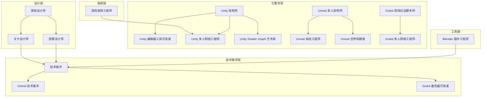

图表来源
- [game-designer.md:1-168](file://game-development/game-designer.md#L1-L168)
- [level-designer.md:1-209](file://game-development/level-designer.md#L1-L209)
- [narrative-designer.md:1-244](file://game-development/narrative-designer.md#L1-L244)
- [technical-artist.md:1-230](file://game-development/technical-artist.md#L1-L230)
- [unreal-technical-artist.md:1-257](file://game-development/unreal-engine/unreal-technical-artist.md#L1-L257)
- [godot-shader-developer.md:1-267](file://game-development/godot/godot-shader-developer.md#L1-L267)
- [game-audio-engineer.md:1-265](file://game-development/game-audio-engineer.md#L1-L265)
- [unity-architect.md:1-272](file://game-development/unity/unity-architect.md#L1-L272)
- [unity-editor-tool-developer.md:1-311](file://game-development/unity/unity-editor-tool-developer.md#L1-L311)
- [unity-multiplayer-engineer.md:1-322](file://game-development/unity/unity-multiplayer-engineer.md#L1-L322)
- [unity-shader-graph-artist.md:1-270](file://game-development/unity/unity-shader-graph-artist.md#L1-L270)
- [unreal-multiplayer-architect.md:1-314](file://game-development/unreal-engine/unreal-multiplayer-architect.md#L1-L314)
- [unreal-systems-engineer.md:1-311](file://game-development/unreal-engine/unreal-systems-engineer.md#L1-L311)
- [unreal-world-builder.md:1-274](file://game-development/unreal-engine/unreal-world-builder.md#L1-L274)
- [godot-gameplay-scripter.md:1-335](file://game-development/godot/godot-gameplay-scripter.md#L1-L335)
- [godot-multiplayer-engineer.md:1-298](file://game-development/godot/godot-multiplayer-engineer.md#L1-L298)
- [blender-addon-engineer.md:1-235](file://game-development/blender/blender-addon-engineer.md#L1-L235)

章节来源
- [game-designer.md:1-168](file://game-development/game-designer.md#L1-L168)
- [level-designer.md:1-209](file://game-development/level-designer.md#L1-L209)
- [narrative-designer.md:1-244](file://game-development/narrative-designer.md#L1-L244)
- [technical-artist.md:1-230](file://game-development/technical-artist.md#L1-L230)
- [game-audio-engineer.md:1-265](file://game-development/game-audio-engineer.md#L1-L265)
- [unity-architect.md:1-272](file://game-development/unity/unity-architect.md#L1-L272)
- [unity-editor-tool-developer.md:1-311](file://game-development/unity/unity-editor-tool-developer.md#L1-L311)
- [unity-multiplayer-engineer.md:1-322](file://game-development/unity/unity-multiplayer-engineer.md#L1-L322)
- [unity-shader-graph-artist.md:1-270](file://game-development/unity/unity-shader-graph-artist.md#L1-L270)
- [unreal-multiplayer-architect.md:1-314](file://game-development/unreal-engine/unreal-multiplayer-architect.md#L1-L314)
- [unreal-systems-engineer.md:1-311](file://game-development/unreal-engine/unreal-systems-engineer.md#L1-L311)
- [unreal-technical-artist.md:1-257](file://game-development/unreal-engine/unreal-technical-artist.md#L1-L257)
- [unreal-world-builder.md:1-274](file://game-development/unreal-engine/unreal-world-builder.md#L1-L274)
- [godot-gameplay-scripter.md:1-335](file://game-development/godot/godot-gameplay-scripter.md#L1-L335)
- [godot-multiplayer-engineer.md:1-298](file://game-development/godot/godot-multiplayer-engineer.md#L1-L298)
- [godot-shader-developer.md:1-267](file://game-development/godot/godot-shader-developer.md#L1-L267)
- [blender-addon-engineer.md:1-235](file://game-development/blender/blender-addon-engineer.md#L1-L235)

## 核心组件
本节对关键代理进行深入解析，涵盖职责、交付物、工作流与最佳实践。

- 游戏设计师（Game Designer）
  - 职责：系统与机制架构师，负责GDD撰写、玩家动机与反馈系统、经济平衡与进度曲线、新手引导流程。
  - 关键交付：核心循环文档、经济平衡表、新手引导清单、机制规范模板。
  - 工作流：从概念到设计支柱 → 纸质原型 → GDD → 平衡迭代 → 可玩性测试。
  - 成功指标：机制文档无歧义、平衡可验证、上手完成率高、核心循环独立可玩。
  
  章节来源
  - [game-designer.md:1-168](file://game-development/game-designer.md#L1-L168)

- 关卡设计师（Level Designer）
  - 职责：空间叙事与节奏专家，负责布局理论、节奏架构、遭遇设计、环境叙事。
  - 关键交付：关卡设计文档、节奏表、区块规格、导航可读性检查表。
  - 工作流：意图定义 → 纸面布局 → 灰盒（Grey Box） → 遭遇调优 → 艺术交接 → 最终润色。
  - 成功指标：导航无歧义、节奏与实测一致、遭遇至少两种可行战术、环境叙事可被正确解读。
  
  章节来源
  - [level-designer.md:1-209](file://game-development/level-designer.md#L1-L209)

- 叙事设计师（Narrative Designer）
  - 职责：故事系统与对话架构师，负责对话写作、分支系统、世界设定、环境叙事无缝融入玩法。
  - 关键交付：对话节点格式、角色声音支柱、世界设定地图、叙事-玩法对齐矩阵、环境叙事简报。
  - 工作流：叙事框架 → 故事结构与节点映射 → 角色发展 → 对话撰写 → 集成与测试。
  - 成功指标：角色声音一致性高、分支收敛无死胡同、主线可不依赖隐藏内容、环境叙事可被正确推断。
  
  章节来源
  - [narrative-designer.md:1-244](file://game-development/narrative-designer.md#L1-L244)

- 技术美术（Technical Artist）
  - 职责：艺术到引擎管线桥梁，负责着色器、VFX系统、LOD管线、性能预算与跨引擎资产优化。
  - 关键交付：资产技术预算表、自定义着色器（示例）、VFX性能审计清单、LOD校验脚本。
  - 工作流：预生产标准 → 着色器开发 → 资产评审 → VFX生产 → 性能三振出局。
  - 成功指标：零超预算资产、渲染帧时间达标、移动平台着色器安全、VFX过绘不超过预算。
  
  章节来源
  - [technical-artist.md:1-230](file://game-development/technical-artist.md#L1-L230)

- 游戏音频工程师（Game Audio Engineer）
  - 职责：交互音频专家，负责FMOD/Wwise集成、自适应音乐系统、空间音频与音频性能预算。
  - 关键交付：事件命名约定、Unity/FMOD集成示例、自适应音乐参数架构、音频预算规范、空间音频配置。
  - 工作流：音频设计文档 → 项目设置 → SFX实现 → 音乐集成 → 性能评测。
  - 成功指标：无音频掉帧、事件语音上限配置齐全、音乐过渡无缝、空间音频全场景启用。
  
  章节来源
  - [game-audio-engineer.md:1-265](file://game-development/game-audio-engineer.md#L1-L265)

- Unity 架构师（Unity Architect）
  - 职责：数据驱动模块化专家，使用ScriptableObject与组合模式构建可扩展的Unity架构。
  - 关键交付：FloatVariable、RuntimeSet、GameEvent通道、单一起责组件示例、自定义PropertyDrawer。
  - 工作流：架构审计 → SO资产设计 → 组件分解 → 编辑器工具 → 场景架构。
  - 成功指标：无GameObject.Find、单起责组件、预制可独立实例化、SO驱动状态。
  
  章节来源
  - [unity-architect.md:1-272](file://game-development/unity/unity-architect.md#L1-L272)

- Unity 编辑器工具开发者（Unity Editor Tool Developer）
  - 职责：Unity编辑器自动化专家，构建自定义EditorWindow、PropertyDrawers、AssetPostprocessors、流水线自动化。
  - 关键交付：资产审计窗口、纹理导入强制器、MinMax滑条绘制器、构建前校验。
  - 工作流：工具需求 → 原型 → 生产构建 → 文档 → 构建集成。
  - 成功指标：零漏检资产导入、PropertyDrawer支持Prefab覆盖、构建前校验拦截违规。
  
  章节来源
  - [unity-editor-tool-developer.md:1-311](file://game-development/unity/unity-editor-tool-developer.md#L1-L311)

- Unity 多人网络工程师（Unity Multiplayer Engineer）
  - 职责：网络化游戏专家，使用Netcode for GameObjects、UGS（Relay/Lobby）、权威模型、延迟补偿与状态同步。
  - 关键交付：NGO项目设置、服务端权威控制器、大厅匹配集成、NetworkVariable设计参考。
  - 工作流：架构设计 → UGS设置 → 核心网络实现 → 延迟与可靠性测试 → 反作弊加固。
  - 成功指标：无状态漂移、服务器端输入验证、带宽控制、Relay稳定连接。
  
  章节来源
  - [unity-multiplayer-engineer.md:1-322](file://game-development/unity/unity-multiplayer-engineer.md#L1-L322)

- Unity Shader Graph 艺术家（Unity Shader Graph Artist）
  - 职责：视觉特效与材质专家，使用Shader Graph与HLSL在URP/HDRP管线中创作实时视觉效果。
  - 关键交付：溶解Shader Graph布局、自定义URP渲染器特性、优化HLSL示例、着色器复杂度审计。
  - 工作流：设计简报 → Shader Graph → HLSL转换（必要时） → 基准测试 → 艺术交接。
  - 成功指标：着色器通过预算、Sub-Graph复用、参数文档齐全、移动端回退变体存在。
  
  章节来源
  - [unity-shader-graph-artist.md:1-270](file://game-development/unity/unity-shader-graph-artist.md#L1-L270)

- Unreal 多人架构师（Unreal Multiplayer Architect）
  - 职责：UE5多人网络专家，Actor复制、GameMode/GameState架构、权威模型、网络预测与专用服务器配置。
  - 关键交付：复制Actor设置、GameMode/GameState架构、GAS复制设置、网络频率优化、专用服务器配置。
  - 工作流：网络架构设计 → 核心复制实现 → GAS网络集成 → 网络剖析 → 反作弊加固。
  - 成功指标：无验证缺失的Server RPC、带宽控制、反校正极少、反作弊无漏洞。
  
  章节来源
  - [unreal-multiplayer-architect.md:1-314](file://game-development/unreal-engine/unreal-multiplayer-architect.md#L1-L314)

- Unreal 系统工程师（Unreal Systems Engineer）
  - 职责：性能与混合架构专家，掌握C++/蓝图连续体、Nanite几何、Lumen GI与GAS网络就绪系统。
  - 关键交付：GAS项目配置、属性集、游戏能力、优化Tick架构、Nanite静态网格设置、智能指针模式。
  - 工作流：项目架构规划 → 核心系统（C++） → 蓝图暴露层 → 渲染管线设置 → 多人验证。
  - 成功指标：蓝图Tick禁用、Nanite实例预算受控、GC安全弱引用、帧预算达成。
  
  章节来源
  - [unreal-systems-engineer.md:1-311](file://game-development/unreal-engine/unreal-systems-engineer.md#L1-L311)

- Unreal 技术美术（Unreal Technical Artist）
  - 职责：UE5视觉管线专家，Material Editor、Niagara VFX、程序化内容生成与渲染优化。
  - 关键交付：Triplanar映射函数、地面冲击爆炸Niagara系统、森林PCG图、材质复杂度审计、Niagara可扩展性配置。
  - 工作流：视觉技术简报 → 材质管线 → Niagara VFX生产 → PCG图开发 → 性能评审。
  - 成功指标：材质指令数达标、Niagara可扩展性通过预算、PCG生成低延迟、Nanite合规。
  
  章节来源
  - [unreal-technical-artist.md:1-257](file://game-development/unreal-engine/unreal-technical-artist.md#L1-L257)

- Unreal 世界构建者（Unreal World Builder）
  - 职责：开放世界与环境专家，掌握UE5 World Partition、Landscape、程序化植被、HLOD与大规模关卡流送。
  - 关键交付：World Partition设置参考、Landscape材质架构、HLOD层级配置、PCG森林人口图、开放世界性能评测清单。
  - 工作流：世界规模与网格规划 → 地形基础 → 环境人口 → HLOD生成 → 流送与性能评测。
  - 成功指标：无流送抖动、PCG区域预烘焙、HLOD覆盖距离达标、地形层数限制内。
  
  章节来源
  - [unreal-world-builder.md:1-274](file://game-development/unreal-engine/unreal-world-builder.md#L1-L274)

- Godot 游戏玩法脚本师（Godot Gameplay Scripter）
  - 职责：组合与信号完整性专家，使用GDScript 2.0、C#集成、基于节点的架构与类型安全信号设计。
  - 关键交付：类型化信号声明（GDScript/C#）、组合式玩家、资源化数据、Typed Array与安全节点访问、GDScript/C#互操作连接。
  - 工作流：场景架构设计 → 信号架构 → 组件分解 → 静态类型审计 → Autoload治理 → 独立场景测试。
  - 成功指标：无未类型变量、信号参数类型化、零断连信号、组件单一职责。
  
  章节来源
  - [godot-gameplay-scripter.md:1-335](file://game-development/godot/godot-gameplay-scripter.md#L1-L335)

- Godot 多人网络工程师（Godot Multiplayer Engineer）
  - 职责：Godot 4多人网络专家，使用MultiplayerAPI、场景复制、ENet/WebRTC传输、RPC与权威模型。
  - 关键交付：服务器设置（ENet）、服务端权威玩家控制器、MultiplayerSynchronizer配置、MultiplayerSpawner设置、RPC安全模式。
  - 工作流：架构规划 → 网络管理器设置 → 场景复制 → 权威设置 → RPC安全审计 → 延迟测试。
  - 成功指标：无权威错配、RPC发送方验证、同步属性路径有效、重连处理干净。
  
  章节来源
  - [godot-multiplayer-engineer.md:1-298](file://game-development/godot/godot-multiplayer-engineer.md#L1-L298)

- Godot 着色器开发者（Godot Shader Developer）
  - 职责：Godot 4视觉特效专家，使用Godot着色语言与VisualShader在2D/3D上下文实现高性能效果。
  - 关键交付：2D精灵描边、3D溶解、3D水面、全屏后处理（CompositorEffect）、着色器性能审计。
  - 工作流：效果设计 → VisualShader原型 → 代码着色器实现 → 移动兼容性审查 → 基准测试。
  - 成功指标：声明shader_type且标注渲染器要求、统一参数提示齐全、移动端兼容、无FRAMEBUFFER COPY滥用。
  
  章节来源
  - [godot-shader-developer.md:1-267](file://game-development/godot/godot-shader-developer.md#L1-L267)

- Blender 插件工程师（Blender Add-on Engineer）
  - 职责：Blender工具链专家，构建Python插件、资产验证器、导出器与流水线自动化。
  - 关键交付：资产验证器Operator、导出面板、命名审计报告、验证报告模板。
  - 工作流：管线发现 → 工具范围定义 → 插件实现 → 验证与交由硬化 → 采用度回顾。
  - 成功指标：重复任务耗时降低、验证捕获常见问题、批量导出无设置漂移、工具无需额外指导即可使用。
  
  章节来源
  - [blender-addon-engineer.md:1-235](file://game-development/blender/blender-addon-engineer.md#L1-L235)

## 架构总览
下图展示了从创意到实现的跨引擎协作架构：设计层产出GDD/关卡/叙事蓝图，技术美术与音频工程师将其转化为引擎可用的资产与系统，各引擎专项代理负责具体实现与优化，并通过工具链代理保障资产管线稳定可靠。

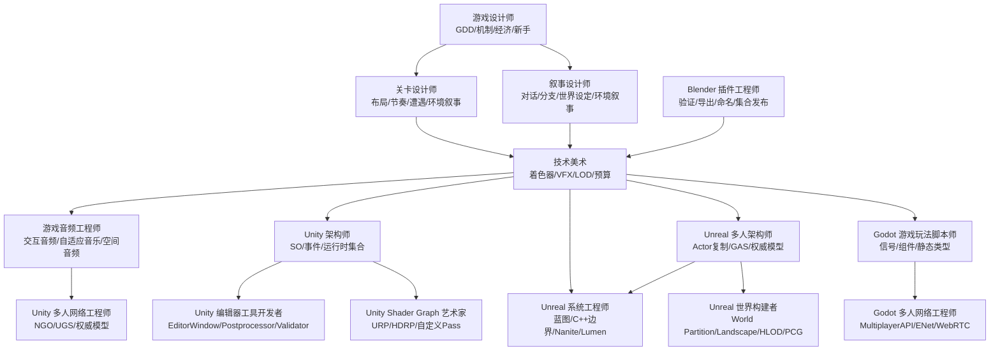

图表来源
- [game-designer.md:1-168](file://game-development/game-designer.md#L1-L168)
- [level-designer.md:1-209](file://game-development/level-designer.md#L1-L209)
- [narrative-designer.md:1-244](file://game-development/narrative-designer.md#L1-L244)
- [technical-artist.md:1-230](file://game-development/technical-artist.md#L1-L230)
- [game-audio-engineer.md:1-265](file://game-development/game-audio-engineer.md#L1-L265)
- [unity-architect.md:1-272](file://game-development/unity/unity-architect.md#L1-L272)
- [unity-editor-tool-developer.md:1-311](file://game-development/unity/unity-editor-tool-developer.md#L1-L311)
- [unity-multiplayer-engineer.md:1-322](file://game-development/unity/unity-multiplayer-engineer.md#L1-L322)
- [unity-shader-graph-artist.md:1-270](file://game-development/unity/unity-shader-graph-artist.md#L1-L270)
- [unreal-multiplayer-architect.md:1-314](file://game-development/unreal-engine/unreal-multiplayer-architect.md#L1-L314)
- [unreal-systems-engineer.md:1-311](file://game-development/unreal-engine/unreal-systems-engineer.md#L1-L311)
- [unreal-world-builder.md:1-274](file://game-development/unreal-engine/unreal-world-builder.md#L1-L274)
- [godot-gameplay-scripter.md:1-335](file://game-development/godot/godot-gameplay-scripter.md#L1-L335)
- [godot-multiplayer-engineer.md:1-298](file://game-development/godot/godot-multiplayer-engineer.md#L1-L298)
- [blender-addon-engineer.md:1-235](file://game-development/blender/blender-addon-engineer.md#L1-L235)

## 详细组件分析

### 游戏设计师工作流（序列图）
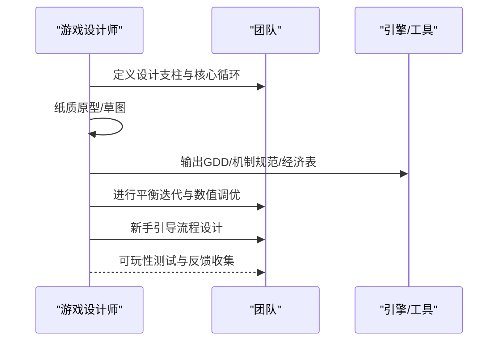

图表来源
- [game-designer.md:103-142](file://game-development/game-designer.md#L103-L142)

章节来源
- [game-designer.md:103-142](file://game-development/game-designer.md#L103-L142)

### 关卡设计师工作流（流程图）
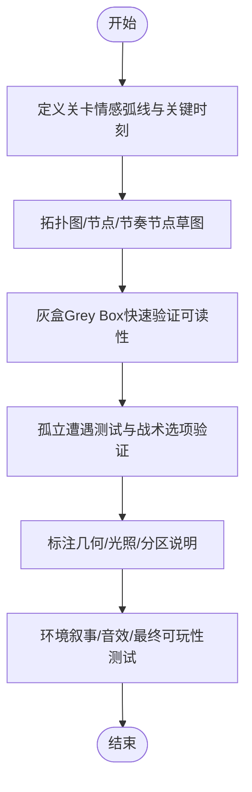

图表来源
- [level-designer.md:139-168](file://game-development/level-designer.md#L139-L168)

章节来源
- [level-designer.md:139-168](file://game-development/level-designer.md#L139-L168)

### 叙事设计师工作流（序列图）
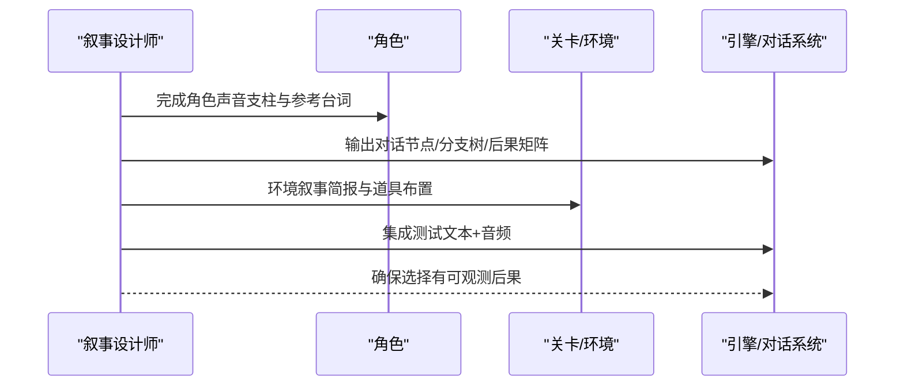

图表来源
- [narrative-designer.md:176-209](file://game-development/narrative-designer.md#L176-L209)

章节来源
- [narrative-designer.md:176-209](file://game-development/narrative-designer.md#L176-L209)

### 技术美术工作流（序列图）
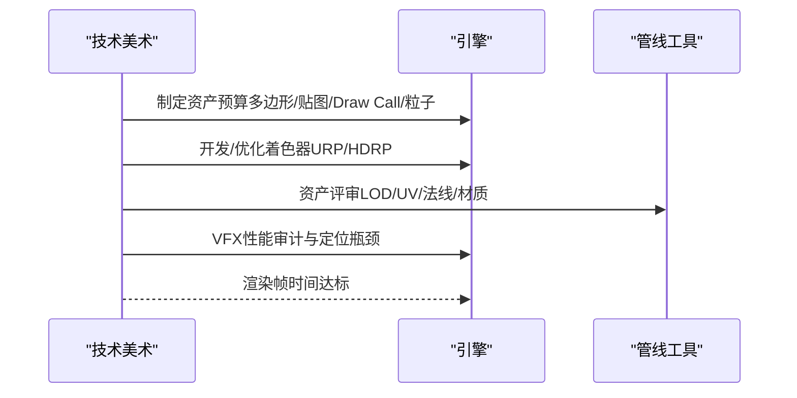

图表来源
- [technical-artist.md:162-189](file://game-development/technical-artist.md#L162-L189)

章节来源
- [technical-artist.md:162-189](file://game-development/technical-artist.md#L162-L189)

### Unity 多人网络工作流（序列图）
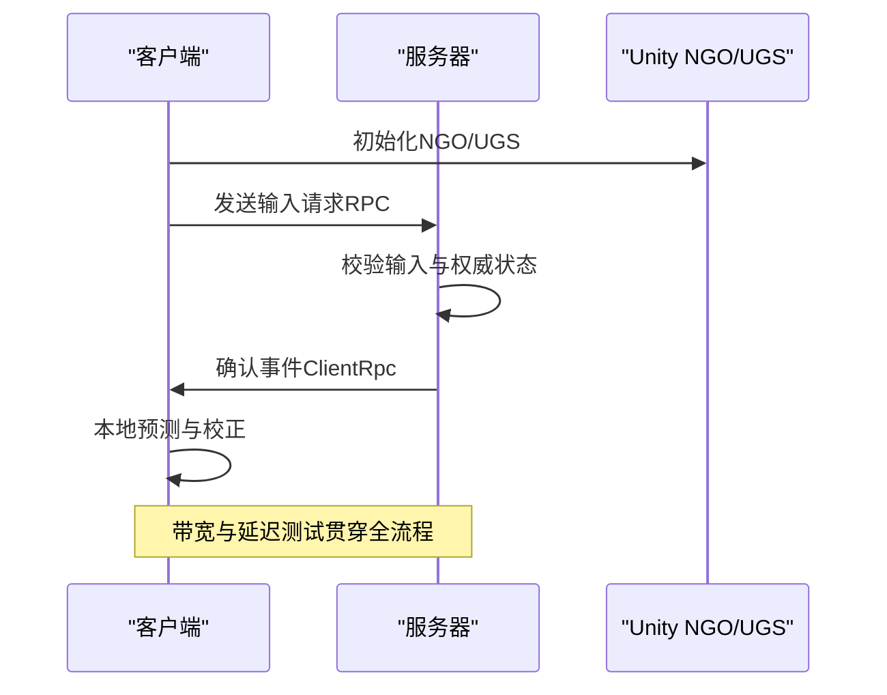

图表来源
- [unity-multiplayer-engineer.md:255-281](file://game-development/unity/unity-multiplayer-engineer.md#L255-L281)

章节来源
- [unity-multiplayer-engineer.md:255-281](file://game-development/unity/unity-multiplayer-engineer.md#L255-L281)

### Unreal 多人网络工作流（序列图）
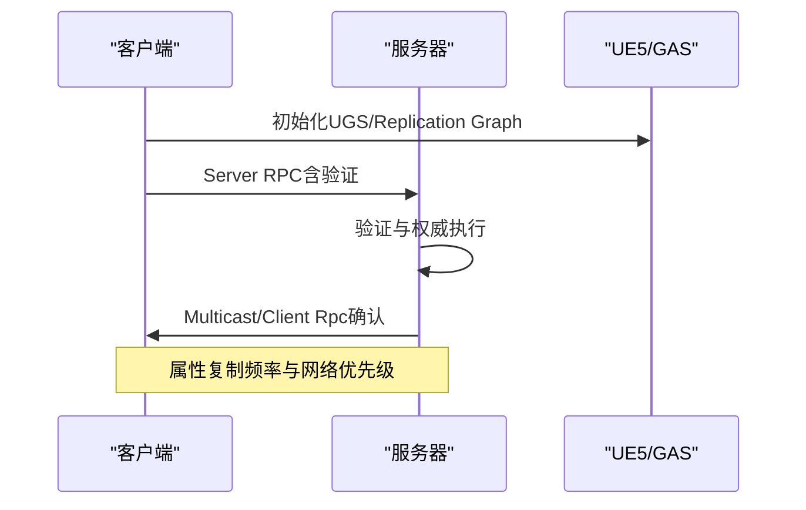

图表来源
- [unreal-multiplayer-architect.md:247-273](file://game-development/unreal-engine/unreal-multiplayer-architect.md#L247-L273)

章节来源
- [unreal-multiplayer-architect.md:247-273](file://game-development/unreal-engine/unreal-multiplayer-architect.md#L247-L273)

### Godot 多人网络工作流（序列图）
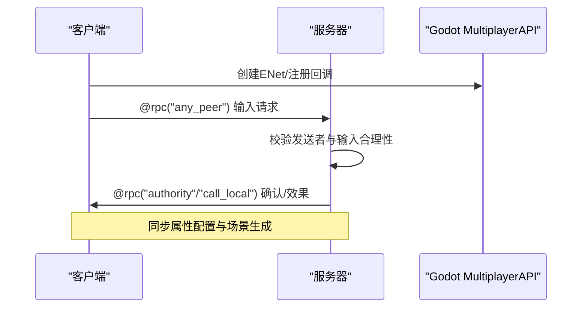

图表来源
- [godot-multiplayer-engineer.md:227-257](file://game-development/godot/godot-multiplayer-engineer.md#L227-L257)

章节来源
- [godot-multiplayer-engineer.md:227-257](file://game-development/godot/godot-multiplayer-engineer.md#L227-L257)

### Blender 工具链工作流（流程图）
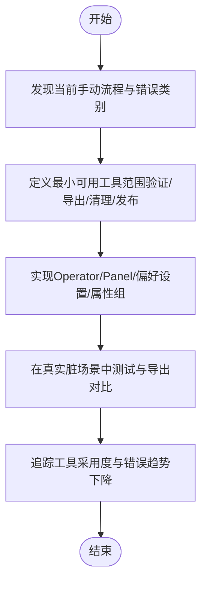

图表来源
- [blender-addon-engineer.md:168-195](file://game-development/blender/blender-addon-engineer.md#L168-L195)

章节来源
- [blender-addon-engineer.md:168-195](file://game-development/blender/blender-addon-engineer.md#L168-L195)

## 依赖关系分析
- 设计层依赖：游戏设计师产出的GDD是关卡与叙事设计的唯一事实来源；关卡与叙事必须与技术美术的预算与实现约束保持一致。
- 技术美术依赖：着色器与VFX需遵循引擎管线限制（URP/HDRP、Forward+/Mobile/Compatibility）；音频需通过中间件事件系统与引擎解耦。
- 多人网络依赖：权威模型与RPC模式必须与引擎网络API契合（NGO/UE5 MultiplayerAPI/Godot MultiplayerAPI）。
- 工具链依赖：Blender插件需与下游引擎/工具的命名、坐标系、缩放假设保持一致。

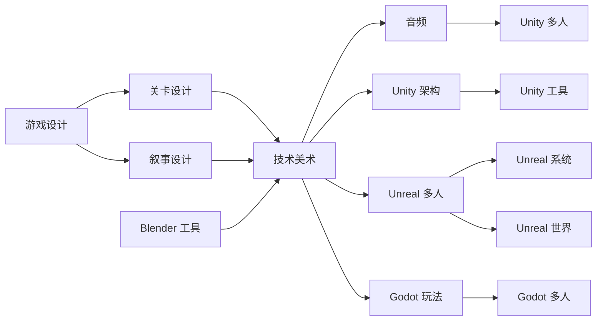

图表来源
- [game-designer.md:1-168](file://game-development/game-designer.md#L1-L168)
- [level-designer.md:1-209](file://game-development/level-designer.md#L1-L209)
- [narrative-designer.md:1-244](file://game-development/narrative-designer.md#L1-L244)
- [technical-artist.md:1-230](file://game-development/technical-artist.md#L1-L230)
- [game-audio-engineer.md:1-265](file://game-development/game-audio-engineer.md#L1-L265)
- [unity-architect.md:1-272](file://game-development/unity/unity-architect.md#L1-L272)
- [unity-editor-tool-developer.md:1-311](file://game-development/unity/unity-editor-tool-developer.md#L1-L311)
- [unity-multiplayer-engineer.md:1-322](file://game-development/unity/unity-multiplayer-engineer.md#L1-L322)
- [unreal-multiplayer-architect.md:1-314](file://game-development/unreal-engine/unreal-multiplayer-architect.md#L1-L314)
- [unreal-systems-engineer.md:1-311](file://game-development/unreal-engine/unreal-systems-engineer.md#L1-L311)
- [unreal-world-builder.md:1-274](file://game-development/unreal-engine/unreal-world-builder.md#L1-L274)
- [godot-gameplay-scripter.md:1-335](file://game-development/godot/godot-gameplay-scripter.md#L1-L335)
- [godot-multiplayer-engineer.md:1-298](file://game-development/godot/godot-multiplayer-engineer.md#L1-L298)
- [blender-addon-engineer.md:1-235](file://game-development/blender/blender-addon-engineer.md#L1-L235)

章节来源
- [game-designer.md:1-168](file://game-development/game-designer.md#L1-L168)
- [level-designer.md:1-209](file://game-development/level-designer.md#L1-L209)
- [narrative-designer.md:1-244](file://game-development/narrative-designer.md#L1-L244)
- [technical-artist.md:1-230](file://game-development/technical-artist.md#L1-L230)
- [game-audio-engineer.md:1-265](file://game-development/game-audio-engineer.md#L1-L265)
- [unity-architect.md:1-272](file://game-development/unity/unity-architect.md#L1-L272)
- [unity-editor-tool-developer.md:1-311](file://game-development/unity/unity-editor-tool-developer.md#L1-L311)
- [unity-multiplayer-engineer.md:1-322](file://game-development/unity/unity-multiplayer-engineer.md#L1-L322)
- [unreal-multiplayer-architect.md:1-314](file://game-development/unreal-engine/unreal-multiplayer-architect.md#L1-L314)
- [unreal-systems-engineer.md:1-311](file://game-development/unreal-engine/unreal-systems-engineer.md#L1-L311)
- [unreal-world-builder.md:1-274](file://game-development/unreal-engine/unreal-world-builder.md#L1-L274)
- [godot-gameplay-scripter.md:1-335](file://game-development/godot/godot-gameplay-scripter.md#L1-L335)
- [godot-multiplayer-engineer.md:1-298](file://game-development/godot/godot-multiplayer-engineer.md#L1-L298)
- [blender-addon-engineer.md:1-235](file://game-development/blender/blender-addon-engineer.md#L1-L235)

## 性能考量
- 渲染性能
  - Unity：着色器复杂度与纹理采样预算、移动平台回退变体、Sub-Graph复用、URP/HDRP API差异。
  - Unreal：材质指令数与纹理采样预算、Nanite实例上限、HLOD层级与重建、RVT缓存预热。
  - Godot：着色器类型声明与渲染器要求、Uniform提示、SCREEN_TEXTURE使用成本、移动兼容性。
- 音频性能
  - 事件语音上限与优先级、内存/CPU预算、空间音频射线检测次数限制、参数驱动而非硬编码。
- 多人网络
  - NGO/UE5 RPC模式与可靠性、带宽预算与差分压缩、权威模型与输入验证、延迟模拟与重连处理。
- 工具链
  - Blender批处理进度与可取消、导出设置一致性、命名与变换验证、集合发布与版本化。

章节来源
- [unity-shader-graph-artist.md:180-201](file://game-development/unity/unity-shader-graph-artist.md#L180-L201)
- [unreal-technical-artist.md:141-163](file://game-development/unreal-engine/unreal-technical-artist.md#L141-L163)
- [godot-shader-developer.md:170-198](file://game-development/godot/godot-shader-developer.md#L170-L198)
- [game-audio-engineer.md:142-172](file://game-development/game-audio-engineer.md#L142-L172)
- [unity-multiplayer-engineer.md:255-281](file://game-development/unity/unity-multiplayer-engineer.md#L255-L281)
- [unreal-multiplayer-architect.md:247-273](file://game-development/unreal-engine/unreal-multiplayer-architect.md#L247-L273)
- [blender-addon-engineer.md:168-195](file://game-development/blender/blender-addon-engineer.md#L168-L195)

## 故障排查指南
- 设计与叙事
  - 机制歧义：确保每个机制都有目的、输入、输出、边缘情况与失败状态；经济变量需有理由。
  - 分支收敛：所有分支必须收敛，避免死胡同；后果应在2场景内可见。
- 关卡
  - 可读性：主路径必须清晰可见；敌人出现前必须可见；难度优先由空间决定。
  - 灰盒验收：零例外的灰盒可玩性评审。
- 技术美术
  - 预算审计：资产必须通过LOD预算、纹理预算、Overdraw限制；着色器复杂度与纹理采样符合平台预算。
  - 移动端回退：移动端着色器必须有安全变体或明确标注。
- 音频
  - 事件命名与参数：事件路径结构清晰；参数驱动音乐响应；语音上限与优先级配置齐全。
- Unity
  - SO与单起责：禁止GameObject.Find；MonoBehaviour单起责；Prefab可独立实例化。
  - NGO：Server RPC必须验证；NetworkVariable变更需去抖；Relay/Lobby配置正确。
- Unreal
  - 权威模型：所有状态修改在服务器执行；RPC可靠性与顺序；Replication Graph优化。
  - GAS：双初始化路径、属性复制、标签复制验证。
- Godot
  - 权威模型：is_multiplayer_authority保护状态；@rpc("any_peer")必须验证发送者；MultiplayerSynchronizer属性路径有效。
- Blender
  - 导出一致性：批量导出无设置漂移；命名与变换验证；集合发布与清单生成。

章节来源
- [game-designer.md:28-52](file://game-development/game-designer.md#L28-L52)
- [narrative-designer.md:28-52](file://game-development/narrative-designer.md#L28-L52)
- [level-designer.md:28-51](file://game-development/level-designer.md#L28-L51)
- [technical-artist.md:28-51](file://game-development/technical-artist.md#L28-L51)
- [game-audio-engineer.md:28-52](file://game-development/game-audio-engineer.md#L28-L52)
- [unity-architect.md:28-54](file://game-development/unity/unity-architect.md#L28-L54)
- [unity-multiplayer-engineer.md:28-54](file://game-development/unity/unity-multiplayer-engineer.md#L28-L54)
- [unreal-multiplayer-architect.md:28-54](file://game-development/unreal-engine/unreal-multiplayer-architect.md#L28-L54)
- [unreal-systems-engineer.md:28-61](file://game-development/unreal-engine/unreal-systems-engineer.md#L28-L61)
- [godot-multiplayer-engineer.md:28-52](file://game-development/godot/godot-multiplayer-engineer.md#L28-L52)
- [blender-addon-engineer.md:28-53](file://game-development/blender/blender-addon-engineer.md#L28-L53)

## 结论
本代理体系以“设计—技术美术—引擎实现—工具链保障”的闭环组织，覆盖从创意愿景到最终发布的全链路。每个代理在各自引擎与工具链中承担明确职责，通过标准化交付物、严格规则与工作流，确保创意在技术约束内高效落地。建议在项目启动阶段即明确代理边界与协作接口，持续进行性能与稳定性评审，以获得高质量、可维护、可扩展的游戏产品。

## 附录
- 引擎与工具链最佳实践速查
  - Unity：ScriptableObject驱动、事件解耦、编辑器工具自动化、NGO权威模型、URP/HDRP管线差异。
  - Unreal：蓝图/C++边界、Nanite/Lumen、Replication Graph、GAS网络复制、World Partition。
  - Godot：信号完整性、静态类型、MultiplayerAPI权威模型、VisualShader与代码Shader取舍。
  - Blender：命名/变换/材质槽验证、导出预设、集合发布、批处理与进度。