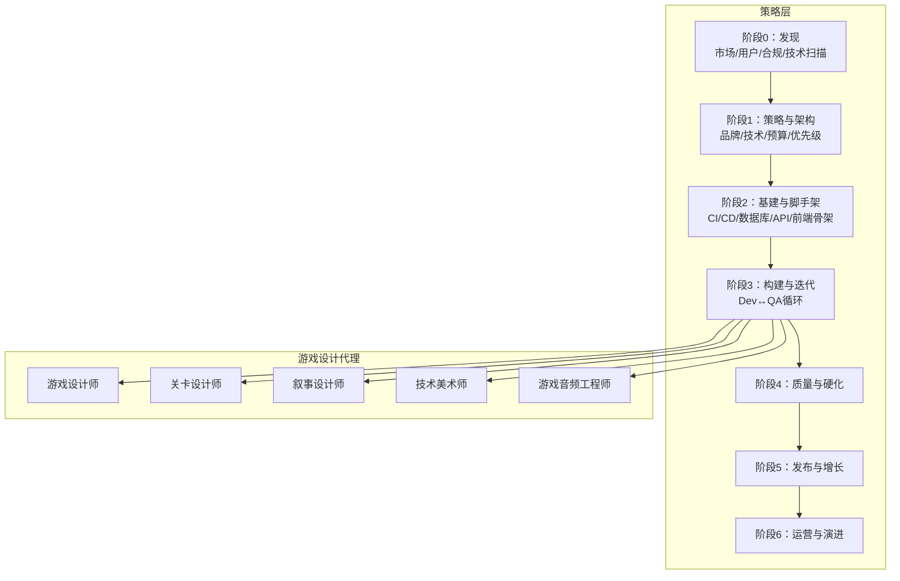
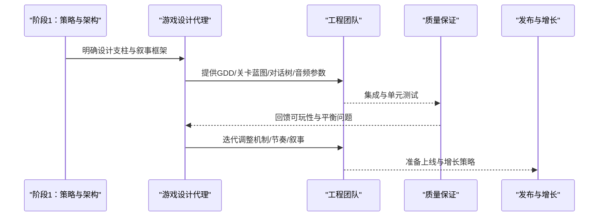
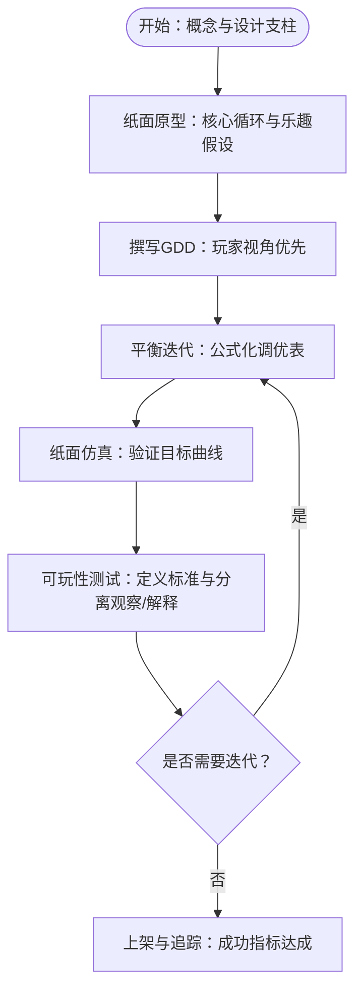
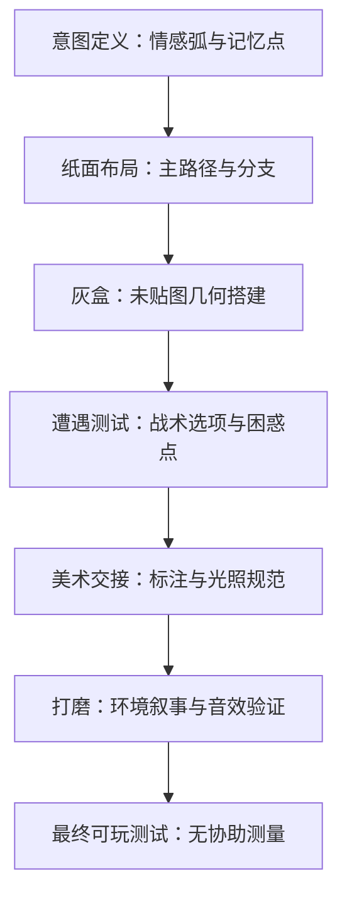
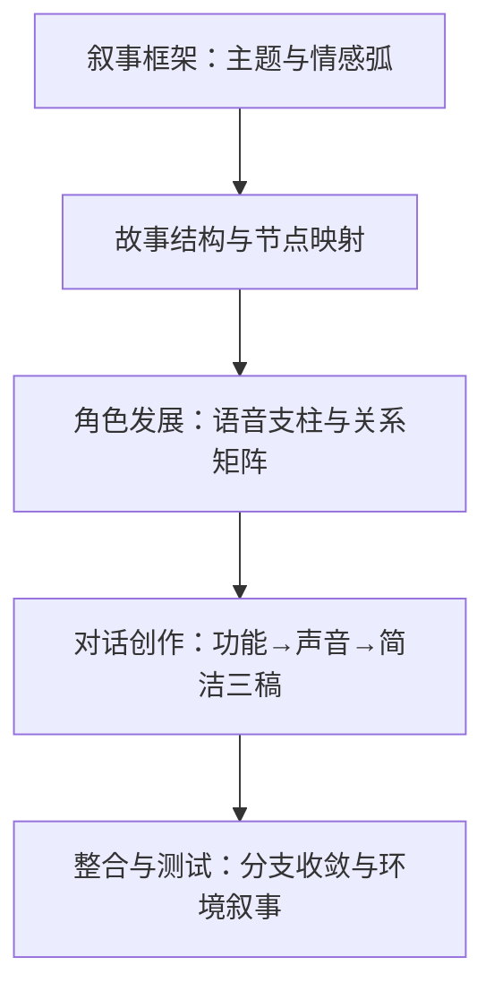
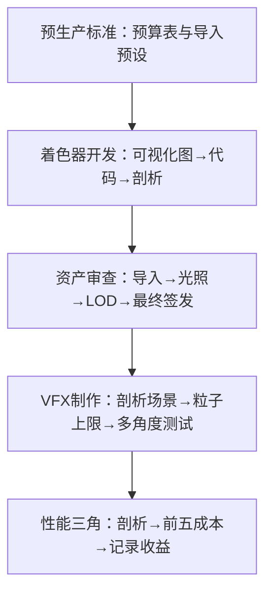
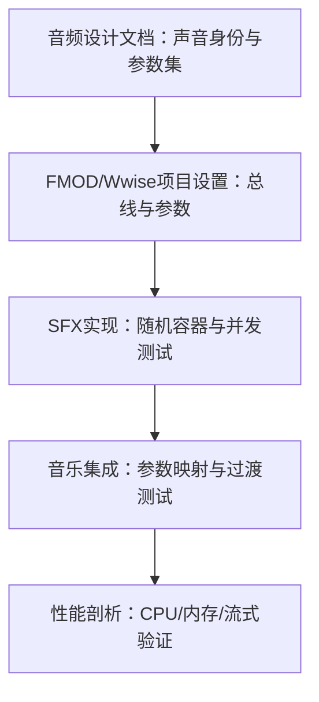
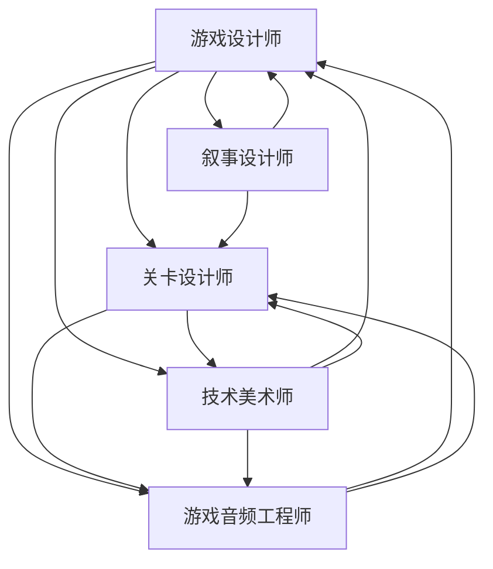

# 游戏设计代理

<cite>
**本文档引用的文件**
- [game-designer.md](file://game-development/game-designer.md)
- [level-designer.md](file://game-development/level-designer.md)
- [narrative-designer.md](file://game-development/narrative-designer.md)
- [technical-artist.md](file://game-development/technical-artist.md)
- [game-audio-engineer.md](file://game-development/game-audio-engineer.md)
- [README.md](file://README.md)
- [phase-0-discovery.md](file://strategy/playbooks/phase-0-discovery.md)
- [phase-1-strategy.md](file://strategy/playbooks/phase-1-strategy.md)
- [phase-2-foundation.md](file://strategy/playbooks/phase-2-foundation.md)
- [scenario-startup-mvp.md](file://strategy/runbooks/scenario-startup-mvp.md)
- [EXECUTIVE-BRIEF.md](file://strategy/EXECUTIVE-BRIEF.md)
- [QUICKSTART.md](file://strategy/QUICKSTART.md)
</cite>

## 目录
1. [引言](#引言)
2. [项目结构](#项目结构)
3. [核心组件](#核心组件)
4. [架构总览](#架构总览)
5. [详细组件分析](#详细组件分析)
6. [依赖关系分析](#依赖关系分析)
7. [性能考量](#性能考量)
8. [故障排除指南](#故障排除指南)
9. [结论](#结论)
10. [附录](#附录)

## 引言
本文件系统性阐述“游戏设计代理”的专业能力与协作模式，覆盖五类关键角色：游戏设计师、关卡设计师、叙事设计师、技术美术师、游戏音频工程师。我们将从创意职责、技术支撑、玩家体验优化、沉浸式环境营造与多感官娱乐体验等维度，结合仓库中已有的代理定义与策略文档，给出可操作的工作流程与最佳实践，帮助团队在不同阶段（从概念到产品）高效协同。

## 项目结构
该仓库以“代理”为核心组织单元，按职能划分为工程、设计、营销、产品、项目管理、测试、支持、空间计算与专业化等十二个部门。游戏开发代理位于“game-development”目录下，同时配合“strategy”目录中的分阶段工作流与运行手册，形成从发现、策略、基建到构建、硬化的完整流水线。

图表来源
- [phase-0-discovery.md:1-179](file://strategy/playbooks/phase-0-discovery.md#L1-L179)
- [phase-1-strategy.md:1-239](file://strategy/playbooks/phase-1-strategy.md#L1-L239)
- [phase-2-foundation.md:1-279](file://strategy/playbooks/phase-2-foundation.md#L1-L279)
- [scenario-startup-mvp.md:1-155](file://strategy/runbooks/scenario-startup-mvp.md#L1-L155)

章节来源
- [README.md:284-337](file://README.md#L284-L337)

## 核心组件
本节概述五类游戏设计代理的核心职责与交付物，强调以玩家体验为中心的设计方法论与跨学科协作。

- 游戏设计师：系统与机制架构师，负责GDD撰写、玩家心理、经济平衡与玩法循环设计，强调“从玩家动机出发”的设计原则与数据驱动的平衡迭代。
- 关卡设计师：空间叙事与节奏专家，负责布局理论、节奏架构、遭遇设计与环境叙事，强调“空间即故事”的设计理念与可读性标准。
- 叙事设计师：故事系统与对话架构师，负责GDD对齐的叙事设计、分支对话、世界架构与环境叙事，强调“叙事与玩法不可分割”的系统化思维。
- 技术美术师：艺术到引擎管线专家，负责着色器、VFX系统、LOD管线、性能预算与跨引擎资产优化，强调“视觉品质与运行时预算”的平衡。
- 游戏音频工程师：交互音频专家，负责FMOD/Wwise集成、自适应音乐系统、空间音频与音频性能预算，强调“声音即反馈”的动态响应架构。

章节来源
- [game-designer.md:1-168](file://game-development/game-designer.md#L1-L168)
- [level-designer.md:1-209](file://game-development/level-designer.md#L1-L209)
- [narrative-designer.md:1-244](file://game-development/narrative-designer.md#L1-L244)
- [technical-artist.md:1-230](file://game-development/technical-artist.md#L1-L230)
- [game-audio-engineer.md:1-265](file://game-development/game-audio-engineer.md#L1-L265)

## 架构总览
游戏设计代理在整体NEXUS流水线中承担“创意与实现”的桥梁角色，贯穿从发现到发布的各阶段。以下序列图展示典型“从概念到产品”的协作路径。

图表来源
- [phase-1-strategy.md:1-239](file://strategy/playbooks/phase-1-strategy.md#L1-L239)
- [scenario-startup-mvp.md:1-155](file://strategy/runbooks/scenario-startup-mvp.md#L1-L155)

## 详细组件分析

### 游戏设计师（Systems and Mechanics Architect）
- 身份与使命：以“循环、杠杆、玩家动机”思考系统与机制，将创意愿景转化为可执行、无歧义的设计文档。
- 关键规则：
  - 设计文档标准：每个机制需明确目的、玩家体验目标、输入输出、边界情况与失败状态；数值变量必须有理由，避免“魔法数字”。
  - 玩家优先：从玩家动机出发，而非功能清单；每项系统必须回答“玩家会感受到什么？他们在做什么决定？”
  - 平衡流程：所有数值以假设形式标注，边做边调，预先定义“崩盘”标准，先建调优表格再写代码。
- 技术交付物：
  - 核心玩法循环文档（即时、会话、长期）
  - 经济平衡表模板
  - 玩家入门流程检查清单
  - 机制规格说明（目的、幻想、输入、输出、成功条件、失败状态、边缘情况、调优杠杆、依赖）
- 工作流程：
  1) 概念→设计支柱：确立不可妥协的玩家体验，作为后续决策标尺。
  2) 纸面原型：在纸上或电子表格中绘制核心循环，识别“乐趣假设”。
  3) GDD撰写：从玩家视角先写机制，再写实现注释，复杂系统附带标注的线框或流程图。
  4) 平衡迭代：建立公式化调优表，数学化定义目标曲线（经验曲线、伤害衰减、经济流），先做纸面仿真再接入工程。
  5) 可玩性测试与迭代：每次测试前设定成功标准，区分观察与解释，早期优先解决“感觉问题”。
- 成功指标：每项上架机制均有无歧义的GDD；可玩性测试产生可操作的调优建议；经济在所有模拟路径中保持健康；入门完成率>90%；核心循环在加入次要系统前已足够有趣。
- 高阶能力：行为经济学在游戏设计中的应用、跨流派机制移植、高级经济设计、系统性设计与涌现。

图表来源
- [game-designer.md:103-127](file://game-development/game-designer.md#L103-L127)

章节来源
- [game-designer.md:1-168](file://game-development/game-designer.md#L1-L168)

### 关卡设计师（Spatial Storytelling and Flow Specialist）
- 身份与使命：将每一关视为“作者化体验”，用空间讲述故事，通过节奏、教学、挑战与环境叙事引导玩家。
- 关键规则：
  - 流与可读性：主路径必须始终清晰可见；使用光照、色彩与几何引导注意力；每个交叉口提供明确主路径与可选奖励路径；门、出口与目标必须与环境形成对比。
  - 遭遇设计：每场战斗必须具备入口可读时间、多种战术选择与后备位置；除非有意为之，否则不得放置玩家进入交战范围才可见的敌人；难度应优先由空间决定。
  - 环境叙事：每个区域通过道具布置、光照与几何讲出故事；破坏、磨损与细节需与世界历史一致；玩家无需文字即可推断发生了什么。
  - 灰盒规范：关卡以三阶段交付：灰盒（体块）、着装（美术）、打磨（FX+音频）——灰盒决策即最终决策。
- 技术交付物：
  - 关卡设计文档（情感弧、节奏、新机制引入、叙事节点）
  - 节奏表（活动类型、紧张度、备注）
  - 灰盒规格（房间尺寸、主要功能、掩体、光照、入口/出口、环境叙事节点）
  - 导航可读性检查清单
- 工作流程：
  1) 意图定义：在进入编辑器前写出关卡情感弧与“玩家必须记住的时刻”。
  2) 纸面布局：绘制俯视流程图，确定主路径与所有可选分支。
  3) 灰盒：仅用未贴图几何搭建，立即可玩测试；若灰盒不可读，美术无法修复。
  4) 遭遇调优：单独放置遭遇并进行隔离测试，测量死亡时间、成功战术与困惑时刻；直到三种战术均可行。
  5) 美术交接：为美术团队标注所有灰盒决策；标记哪些几何为玩法关键（不可重塑）与可着装；记录每区预期光照方向与色温。
  6) 打磨：添加环境叙事道具；验证音效是否契合节奏；最终可玩测试，不借助协助测量。
- 成功指标：100%的可玩者能在不问路的情况下导航主路径；节奏表与实际可玩时间误差在±20%内；每场遭遇至少两种被观察到的成功战术；环境叙事被>70%的可玩者正确推断；灰盒签字放行后方可进行任何美术工作。
- 高阶能力：空间心理学与感知、程序化关卡设计系统、速通与高玩设计、多人与社交空间设计。

图表来源
- [level-designer.md:139-168](file://game-development/level-designer.md#L139-L168)

章节来源
- [level-designer.md:1-209](file://game-development/level-designer.md#L1-L209)

### 叙事设计师（Story Systems and Dialogue Architect）
- 身份与使命：将“故事系统”作为玩家所生活的世界，写作“像人一样说话”的对话，设计“有意义的选择”，构建“奖励探索的世界观”。
- 关键规则：
  - 对话写作标准：每句必须通过“真实的人会这么说”的测试；角色语音支柱一致，避免“你都知道”式对话；每个节点必须有明确戏剧功能。
  - 分支设计标准：选择必须在“种类”上不同，而非程度差异；所有分支必须收敛且无死胡同；分支复杂度以节点图记录，避免结构性死胡同；后果设计让玩家能感受到结果。
  - 世界观架构：世界设定总是可选的；关键路径无需收集品即可理解；三层世界设定：表面（所有人）、参与（探索者）、深度（考据者）；维护“世界圣经”，确保一致性。
  - 叙事与玩法整合：每个重大剧情必须连接到玩法后果或机制变化；教程与入门内容必须有叙事动机；叙事选择与玩法选择相匹配。
- 技术交付物：
  - 对话节点格式（Ink/Yarn/通用）
  - 角色语音支柱模板
  - 世界设定层级地图
  - 叙事-玩法对齐矩阵
  - 环境叙事简报
- 工作流程：
  1) 叙事框架：确定中心主题问题、情感弧与叙事支柱与设计支柱对齐。
  2) 故事结构与节点映射：先构建宏观故事结构与转折点，再映射所有分支节点与后果树。
  3) 角色发展：完成角色语音支柱文档与参考台词集，建立角色关系矩阵。
  4) 对话创作：从第一天起就以引擎就绪格式（Ink/Yarn/自定义）写作；三遍稿：功能→声音→简洁。
  5) 整合与测试：先离线音频测试对话情绪传达；测试所有分支收敛；环境叙事评审：可玩者能否正确推断设计空间的故事。
- 成功指标：>90%的可玩者能从对话中正确识别每个主要角色个性；所有分支在2场景内产生可观测后果；关键路径无需Tier 2/3即可理解；零“你都知道”式对话；环境叙事被>70%的可玩者正确推断。
- 高阶能力：生成式与系统化叙事、选择架构与自由度设计、跨媒体与活世界叙事、对话工具链与实现。

图表来源
- [narrative-designer.md:176-203](file://game-development/narrative-designer.md#L176-L203)

章节来源
- [narrative-designer.md:1-244](file://game-development/narrative-designer.md#L1-L244)

### 技术美术师（Art-to-Engine Pipeline Specialist）
- 身份与使命：艺术与工程之间的桥梁，用“双语”能力（艺术+代码）确保视觉质量在运行时预算内稳定交付。
- 关键规则：
  - 性能预算执行：每种资产类型都有明确预算（面数、纹理、Draw Call、粒子数），艺术家必须在生产前被告知限制。
  - 透明/加法粒子的过绘是移动端的“沉默杀手”，必须审计并限制。
  - 所有英雄网格必须通过LOD管线（至少LOD0-3）。
  - 着色器标准：所有自定义着色器必须包含移动端安全变体或明确“仅PC/主机”标识；在签发前使用着色器复杂度可视化器进行剖析。
  - 纹理管线：始终以源分辨率导入，平台特定覆盖降采样；UI与小环境细节使用纹理图集；默认压缩方案按平台设定。
  - 资产交接协议：艺术家收到资产类型规格表；所有资产在目标光照下于引擎内审查；UV错误、错误枢轴、非流形几何在导入时拦截。
- 技术交付物：
  - 资产技术预算表（角色、英雄道具、环境、VFX粒子、纹理压缩）
  - 自定义着色器示例（如溶解效果）
  - VFX性能审计清单
  - LOD链验证脚本（Python）
- 工作流程：
  1) 预生产标准：在艺术生产开始前发布资产预算表；与所有艺术家举行管线启动会议；为每类资产设置引擎导入预设。
  2) 着色器开发：在引擎可视化着色器图中原型，再转为代码优化；在目标硬件上剖析；为每个暴露参数编写工具提示与有效范围。
  3) 资产审查管线：首次导入审查（枢轴、缩放、UV、面数对比预算）；光照审查（在生产光照下审查）；LOD审查（飞越所有LOD级别，验证过渡距离）；最终签发（在最大密度场景下进行GPU剖析）。
  4) VFX制作：在带GPU计时器的剖析场景中构建；在开始阶段就限制粒子数量；在60°相机角度与拉远距离测试。
  5) 性能三角：在每个里程碑后运行GPU剖析；识别前五项渲染成本并优先处理；以前后对比记录所有性能收益。
- 成功指标：零资产超预算；渲染GPU帧时间在最低目标硬件上符合预算；所有自定义着色器具有移动端安全变体或明确平台限制；VFX过绘在最坏情况下不超过平台预算；艺术团队因清晰前置规格导致的返工少于1次/资产。
- 高阶能力：实时光线追踪与路径追踪、机器学习辅助美术管线、高级后处理系统、面向艺术家的工具开发。

图表来源
- [technical-artist.md:162-189](file://game-development/technical-artist.md#L162-L189)

章节来源
- [technical-artist.md:1-230](file://game-development/technical-artist.md#L1-L230)

### 游戏音频工程师（Interactive Audio Specialist）
- 身份与使命：交互音频专家，理解“声音不是被动的”，它沟通游戏状态、构建情感与创造存在感，设计自适应音乐系统、空间音景与响应式架构。
- 关键规则：
  - 集成标准：所有游戏音频必须通过中间件事件系统（FMOD/Wwise）；每个SFX通过命名事件字符串或事件引用触发；音频参数（强度、湿声、遮挡）由游戏系统通过参数API设置。
  - 内存与语音预算：在音频生产开始前定义语音数量限制；每条事件必须配置语音上限、优先级与抢占模式；按资产类型采用压缩格式策略；长音乐与环境音始终流式；短SFX在2秒以下一律解压到内存。
  - 自适应音乐规则：音乐过渡必须节拍同步；定义紧张度参数（0–1），由AI威胁聚合脚本驱动；始终保留中立/探索层；优先使用基于音轨的水平重编排而非垂直叠加。
  - 空间音频：所有世界空间SFX必须使用3D空间化；遮挡与受阻必须通过射线驱动参数实现；混响区必须与视觉环境匹配。
- 技术交付物：
  - FMOD事件命名约定
  - Unity/FMOD集成示例（C#）
  - 自适应音乐参数架构
  - 音频性能预算
  - 空间音频配置规范
- 工作流程：
  1) 音频设计文档：定义声音身份（三个形容词）、所有需要独特音频响应的游戏状态、自适应音乐参数集。
  2) FMOD/Wwise项目设置：建立事件层次、总线结构与VCA分配；配置平台特定采样率、语音数与压缩覆盖；设置参数自动化总线效果。
  3) SFX实现：将所有SFX实现为随机容器（音高、音量变化、多声片），测试最大并发下的事件；验证语音抢占行为。
  4) 音乐集成：将所有音乐状态映射到游戏系统并通过参数流图；测试所有过渡点（进入/退出战斗、死亡、胜利、场景切换）；节拍锁定所有过渡。
  5) 性能剖析：在最低目标硬件上剖析音频CPU与内存；进行语音数压力测试；测量目标存储介质上的流式卡顿。
- 成功指标：零音频导致的帧抖动；所有事件都配置了语音上限与抢占模式；音乐过渡在所有测试的玩法状态变化中无缝；音频内存预算在最高内容密度下得到满足；所有世界空间听觉效果均启用遮挡与混响。
- 高阶能力：程序化与生成式音频、Ambisonics与空间音频渲染、高级中间件架构、控制台与平台认证。

图表来源
- [game-audio-engineer.md:198-224](file://game-development/game-audio-engineer.md#L198-L224)

章节来源
- [game-audio-engineer.md:1-265](file://game-development/game-audio-engineer.md#L1-L265)

## 依赖关系分析
游戏设计代理之间存在紧密的依赖与协作关系，形成“创意—实现—验证”的闭环。

图表来源
- [game-designer.md:1-168](file://game-development/game-designer.md#L1-L168)
- [level-designer.md:1-209](file://game-development/level-designer.md#L1-L209)
- [narrative-designer.md:1-244](file://game-development/narrative-designer.md#L1-L244)
- [technical-artist.md:1-230](file://game-development/technical-artist.md#L1-L230)
- [game-audio-engineer.md:1-265](file://game-development/game-audio-engineer.md#L1-L265)

章节来源
- [README.md:284-337](file://README.md#L284-L337)

## 性能考量
- 游戏设计师：通过“纸面仿真+公式化调优表”减少工程试错成本，优先解决“感觉问题”，降低后期返工。
- 关卡设计师：灰盒先行、遭遇隔离测试、明确战术选项，避免美术阶段的可读性问题。
- 叙事设计师：分支收敛测试、环境叙事评审，确保叙事连贯与可理解。
- 技术美术师：严格的预算表、LOD链验证、GPU剖析，确保视觉质量与性能平衡。
- 游戏音频工程师：中间件事件系统、语音预算与抢占、空间音频射线限制，保障音频稳定性与沉浸感。

[本节提供一般性指导，无需具体文件来源]

## 故障排除指南
- 设计文档不完整：检查是否包含目的、玩家体验目标、输入输出、边界情况与失败状态；对数值变量标注假设并预留调优空间。
- 关卡可读性差：确认主路径是否清晰可见、交叉口是否有明确主路径与可选奖励路径、门/出口/目标是否与环境形成对比。
- 分支死胡同：在节点图中标注所有分支，确保收敛且无结构性死胡同；后果应在2场景内可见。
- 资产超预算：核对LOD链、纹理压缩与Draw Call；在目标光照下进行引擎内审查；必要时回退到可视化着色器复杂度与GPU剖析。
- 音频卡顿：检查语音抢占、混响DSP成本与流式策略；在最低目标硬件上进行压力测试与剖析。

章节来源
- [game-designer.md:30-44](file://game-development/game-designer.md#L30-L44)
- [level-designer.md:30-50](file://game-development/level-designer.md#L30-L50)
- [narrative-designer.md:36-52](file://game-development/narrative-designer.md#L36-L52)
- [technical-artist.md:28-51](file://game-development/technical-artist.md#L28-L51)
- [game-audio-engineer.md:28-51](file://game-development/game-audio-engineer.md#L28-L51)

## 结论
游戏设计代理以“玩家体验”为核心，通过系统化的设计方法、严格的交付物与跨学科协作，实现从创意概念到最终产品的高效转化。结合NEXUS分阶段工作流，团队可在保证质量的前提下快速迭代、持续优化，最终交付具有沉浸感与多感官体验的优质游戏产品。

[本节为总结性内容，无需具体文件来源]

## 附录

### 专业工作流程（从创意到产品）
- 阶段0：发现与情报（市场/用户/合规/技术扫描）
- 阶段1：策略与架构（品牌/技术/预算/优先级）
- 阶段2：基建与脚手架（CI/CD/数据库/API/前端骨架）
- 阶段3：构建与迭代（Dev↔QA循环）
- 阶段4：质量与硬化
- 阶段5：发布与增长
- 阶段6：运营与演进

章节来源
- [phase-0-discovery.md:1-179](file://strategy/playbooks/phase-0-discovery.md#L1-L179)
- [phase-1-strategy.md:1-239](file://strategy/playbooks/phase-1-strategy.md#L1-L239)
- [phase-2-foundation.md:1-279](file://strategy/playbooks/phase-2-foundation.md#L1-L279)
- [scenario-startup-mvp.md:1-155](file://strategy/runbooks/scenario-startup-mvp.md#L1-L155)
- [EXECUTIVE-BRIEF.md:1-96](file://strategy/EXECUTIVE-BRIEF.md#L1-L96)
- [QUICKSTART.md:1-195](file://strategy/QUICKSTART.md#L1-L195)