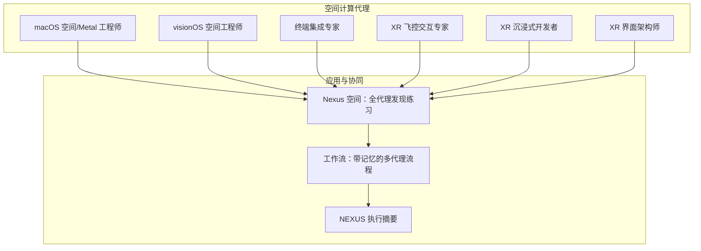
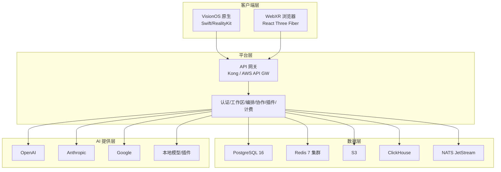
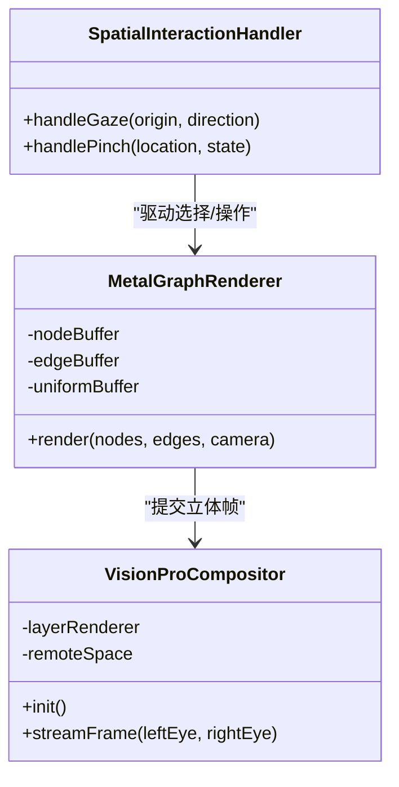
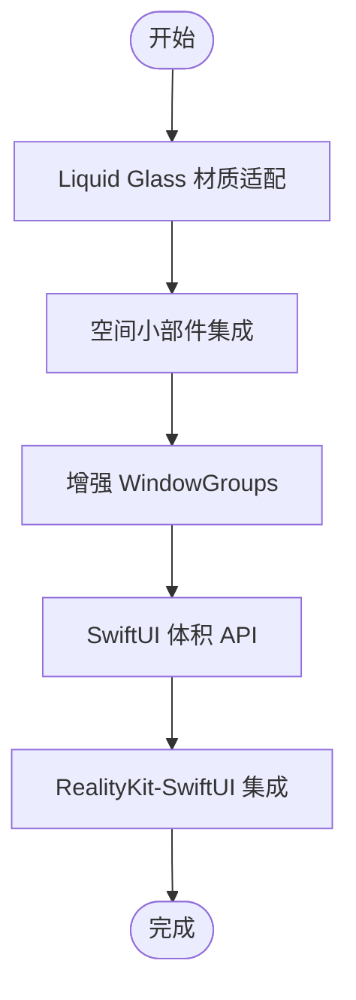
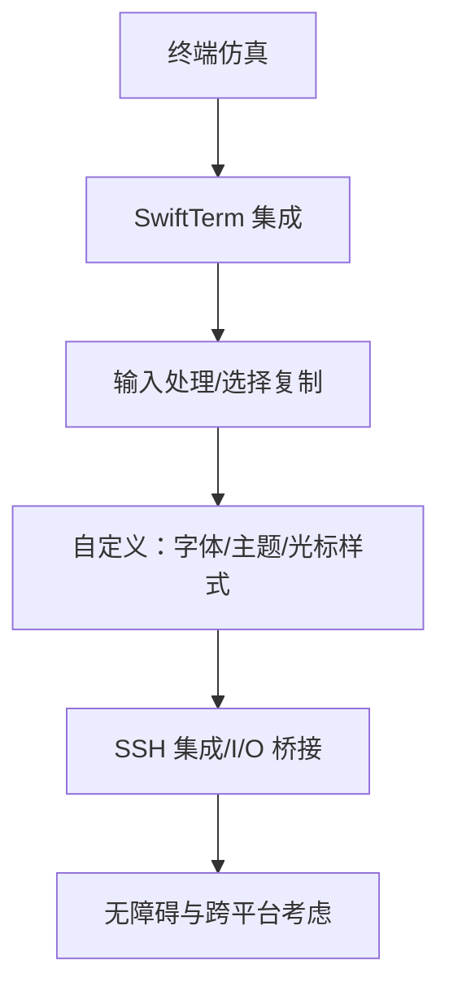
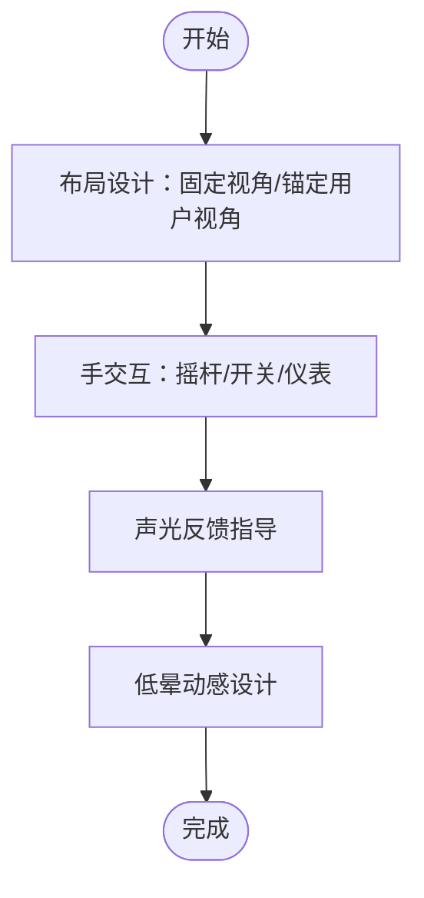
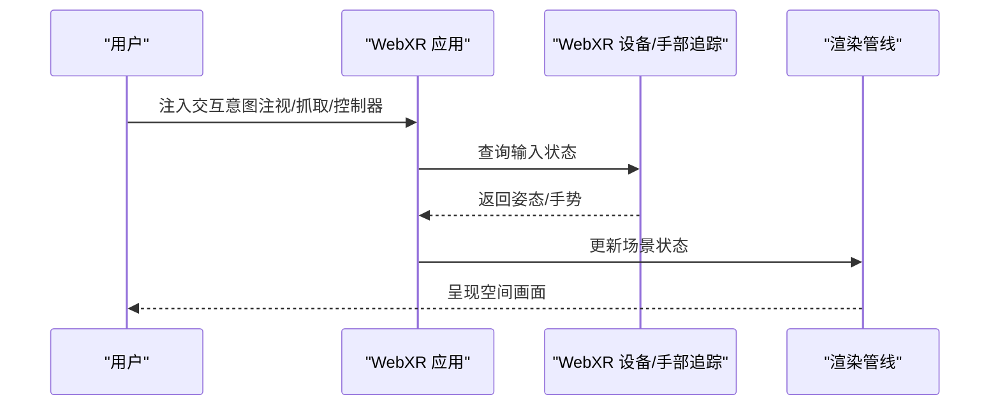
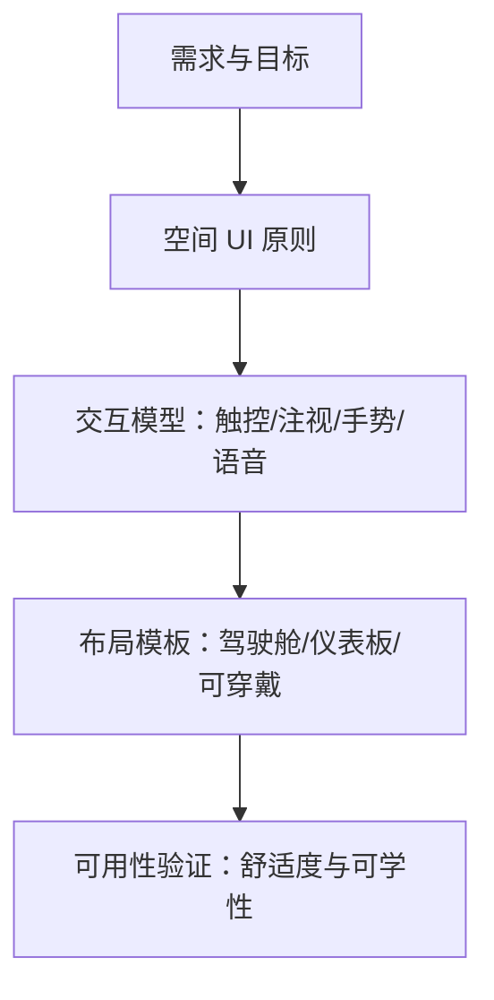
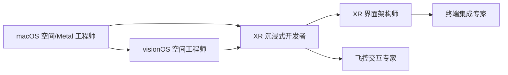

# 空间计算代理

<cite>
**本文引用的文件**
- [macOS 空间/Metal 工程师](file://spatial-computing/macos-spatial-metal-engineer.md)
- [visionOS 空间工程师](file://spatial-computing/visionos-spatial-engineer.md)
- [终端集成专家](file://spatial-computing/terminal-integration-specialist.md)
- [XR 飞控交互专家](file://spatial-computing/xr-cockpit-interaction-specialist.md)
- [XR 沉浸式开发者](file://spatial-computing/xr-immersive-developer.md)
- [XR 界面架构师](file://spatial-computing/xr-interface-architect.md)
- [Nexus 空间：全代理发现练习](file://examples/nexus-spatial-discovery.md)
- [README（项目总览）](file://README.md)
- [工作流：带记忆的多代理流程](file://examples/workflow-with-memory.md)
- [NEXUS 执行摘要](file://strategy/EXECUTIVE-BRIEF.md)
</cite>

## 目录
1. [简介](#简介)
2. [项目结构](#项目结构)
3. [核心组件](#核心组件)
4. [架构总览](#架构总览)
5. [详细组件分析](#详细组件分析)
6. [依赖关系分析](#依赖关系分析)
7. [性能考量](#性能考量)
8. [故障排查指南](#故障排查指南)
9. [结论](#结论)
10. [附录](#附录)

## 简介
本文件系统化梳理“空间计算代理”体系，聚焦六大专业化代理：macOS 空间/Metal 工程师、visionOS 空间工程师、终端集成专家、XR 飞控交互专家、XR 沉浸式开发者、XR 界面架构师。围绕它们的空间计算专长、技术栈与工具链、应用场景、沉浸式体验构建方式、最佳实践、跨设备一致性集成策略以及在下一代计算界面中的前沿角色进行深入阐述，并结合项目中的 Nexus 空间案例展示从机会识别到产品落地的完整空间计算应用路径。

## 项目结构
空间计算代理位于仓库的 spatial-computing 目录下，配套有示例与策略文档，形成“代理能力—应用案例—执行框架”的闭环：
- 代理层：六大空间计算代理，覆盖渲染管线、平台工程、终端集成、交互设计与沉浸式开发
- 应用层：以 Nexus 空间为例，展示跨平台（WebXR + VisionOS）的空间命令中心产品蓝图
- 协同层：通过多代理协同与记忆服务实现高质量交付与可追溯迭代

图表来源
- [macOS 空间/Metal 工程师](file://spatial-computing/macos-spatial-metal-engineer.md)
- [visionOS 空间工程师](file://spatial-computing/visionos-spatial-engineer.md)
- [终端集成专家](file://spatial-computing/terminal-integration-specialist.md)
- [XR 飞控交互专家](file://spatial-computing/xr-cockpit-interaction-specialist.md)
- [XR 沉浸式开发者](file://spatial-computing/xr-immersive-developer.md)
- [XR 界面架构师](file://spatial-computing/xr-interface-architect.md)
- [Nexus 空间：全代理发现练习](file://examples/nexus-spatial-discovery.md)
- [工作流：带记忆的多代理流程](file://examples/workflow-with-memory.md)
- [NEXUS 执行摘要](file://strategy/EXECUTIVE-BRIEF.md)

章节来源
- [README（项目总览）](file://README.md)
- [Nexus 空间：全代理发现练习](file://examples/nexus-spatial-discovery.md)

## 核心组件
六大空间计算代理分别承担以下职责：
- macOS 空间/Metal 工程师：负责高性能 3D 渲染与空间计算，实现 macOS 与 Vision Pro 的无缝桥接
- visionOS 空间工程师：专注 visionOS 原生空间计算与 Liquid Glass 设计体系
- 终端集成专家：提供终端仿真、文本渲染优化与 SwiftTerm 集成
- XR 飞控交互专家：设计沉浸式固定视角控制台与交互系统
- XR 沉浸式开发者：基于 WebXR 构建浏览器与头显兼容的沉浸式体验
- XR 界面架构师：定义空间交互与界面设计原则，降低晕动症、提升可用性

章节来源
- [macOS 空间/Metal 工程师](file://spatial-computing/macos-spatial-metal-engineer.md)
- [visionOS 空间工程师](file://spatial-computing/visionos-spatial-engineer.md)
- [终端集成专家](file://spatial-computing/terminal-integration-specialist.md)
- [XR 飞控交互专家](file://spatial-computing/xr-cockpit-interaction-specialist.md)
- [XR 沉浸式开发者](file://spatial-computing/xr-immersive-developer.md)
- [XR 界面架构师](file://spatial-computing/xr-interface-architect.md)

## 架构总览
空间计算代理在 Nexus 空间中的应用架构如下：
- 客户端层：VisionOS 原生应用（Swift/RealityKit）与 WebXR 浏览器应用（React Three Fiber）
- 平台层：API 网关、服务层（认证、工作区、编排、协作、插件、计费）、消息中间件（NATS）
- 数据层：PostgreSQL、Redis 集群、S3、ClickHouse、NATS
- AI 提供层：OpenAI、Anthropic、Google、本地模型与自定义插件
- 空间计算层：Metal 渲染管线、Compositor Services、RealityKit/ARKit、WebXR Device API

图表来源
- [Nexus 空间：全代理发现练习](file://examples/nexus-spatial-discovery.md)

章节来源
- [Nexus 空间：全代理发现练习](file://examples/nexus-spatial-discovery.md)

## 详细组件分析

### macOS 空间/Metal 工程师
- 专长与使命
  - 实现大规模节点（10k–100k）的实例化 Metal 渲染，保持立体渲染 90fps
  - 通过 Compositor Services 将立体帧流式传输至 Vision Pro
  - 使用 GPU 基础物理与几何着色器实现高效边渲染
- 技术栈与工具
  - Swift/Metal、MetalKit、CompositorServices、RealityKit
  - Instruments、Metal System Trace 性能分析
- 关键实现要点
  - 实例化绘制、三缓冲、剔除与细节层次（LOD）
  - GPU 加速射线投射、手部跟踪与手势识别
  - 远程沉浸空间（RemoteImmersiveSpace）集成
- 应用场景
  - 大规模图可视化、代码图谱的空间化呈现、跨设备协作可视化

图表来源
- [macOS 空间/Metal 工程师](file://spatial-computing/macos-spatial-metal-engineer.md)

章节来源
- [macOS 空间/Metal 工程师](file://spatial-computing/macos-spatial-metal-engineer.md)

### visionOS 空间工程师
- 专长与使命
  - 原生 visionOS 空间计算、SwiftUI 体积界面与 Liquid Glass 设计体系
  - 多窗口架构、空间小部件、增强的 WindowGroups、SwiftUI 体积 API
- 技术栈与工具
  - SwiftUI、RealityKit、ARKit（visionOS 26）
- 应用场景
  - 空间小部件、玻璃背景效果、体积内 3D 内容集成、空间场景管理

图表来源
- [visionOS 空间工程师](file://spatial-computing/visionos-spatial-engineer.md)

章节来源
- [visionOS 空间工程师](file://spatial-computing/visionos-spatial-engineer.md)

### 终端集成专家
- 专长与使命
  - VT100/xterm 标准、字符编码、滚动缓冲、SwiftTerm 集成
  - 文本渲染优化、内存管理、SSH 集成、无障碍支持
- 技术栈与工具
  - SwiftTerm（MIT 许可）、Core Graphics/Core Text、UIKit/AppKit、SSH 库（SwiftNIO SSH、NMSSH）
- 应用场景
  - 在 Apple 平台（iOS/macOS/visionOS）上提供原生终端体验，支持现代终端特性（超链接、内联图片）

图表来源
- [终端集成专家](file://spatial-computing/terminal-integration-specialist.md)

章节来源
- [终端集成专家](file://spatial-computing/terminal-integration-specialist.md)

### XR 飞控交互专家
- 专长与使命
  - 固定视角沉浸式控制台设计，结合真实感与用户舒适度
  - 手交互摇杆、操纵杆、油门与仪表盘 UI，约束驱动的控制机制
- 应用场景
  - 模拟指挥舱、飞行器/舰船控制台、训练模拟器

图表来源
- [XR 飞控交互专家](file://spatial-computing/xr-cockpit-interaction-specialist.md)

章节来源
- [XR 飞控交互专家](file://spatial-computing/xr-cockpit-interaction-specialist.md)

### XR 沉浸式开发者
- 专长与使命
  - 基于 WebXR 的跨平台 3D 应用，集成手部追踪、抓取、注视与控制器输入
  - 性能优化（遮挡剔除、着色器调优、LOD）、兼容性与降级策略
- 技术栈与工具
  - A-Frame、Three.js、Babylon.js、WebXR Device API
- 应用场景
  - 浏览器与头显兼容的 AR/VR/XR 体验、空间 UI 与交互

图表来源
- [XR 沉浸式开发者](file://spatial-computing/xr-immersive-developer.md)

章节来源
- [XR 沉浸式开发者](file://spatial-computing/xr-immersive-developer.md)

### XR 界面架构师
- 专长与使命
  - 空间 UI/UX 设计，减少晕动感、增强存在感、对齐人类行为模式
  - 支持直接触摸、注视+抓取、控制器与手势输入模型
- 应用场景
  - 全息仪表板、沉浸式训练控制、注视优先的空间布局

图表来源
- [XR 界面架构师](file://spatial-computing/xr-interface-architect.md)

章节来源
- [XR 界面架构师](file://spatial-computing/xr-interface-architect.md)

## 依赖关系分析
六大代理在 Nexus 空间中的协同关系：
- macOS 空间/Metal 工程师与 visionOS 空间工程师共同负责视觉呈现与空间交互
- XR 沉浸式开发者与 XR 界面架构师负责 WebXR 与空间 UI 设计
- 终端集成专家为开发者工具链提供一致的终端体验
- XR 飞控交互专家为特定沉浸式控制场景提供专业交互设计

图表来源
- [macOS 空间/Metal 工程师](file://spatial-computing/macos-spatial-metal-engineer.md)
- [visionOS 空间工程师](file://spatial-computing/visionos-spatial-engineer.md)
- [XR 沉浸式开发者](file://spatial-computing/xr-immersive-developer.md)
- [XR 界面架构师](file://spatial-computing/xr-interface-architect.md)
- [终端集成专家](file://spatial-computing/terminal-integration-specialist.md)
- [XR 飞控交互专家](file://spatial-computing/xr-cockpit-interaction-specialist.md)

章节来源
- [Nexus 空间：全代理发现练习](file://examples/nexus-spatial-discovery.md)

## 性能考量
- 渲染性能
  - 实例化绘制、三缓冲、剔除与 LOD，目标单帧绘制调用 <100 次
  - GPU 加速射线投射、几何着色器、变量率着色（VRS）等
- 交互延迟
  - 眼动/手部追踪与手势识别的低延迟路径，保证 50ms 以内选择延迟
- 能耗与热管理
  - GPU 利用率控制在 80% 以内，避免热节流
- 跨平台一致性
  - WebXR 设备兼容矩阵、自动降级策略与渐进式功能启用
- 可靠性
  - 多用户同步采用 CRDT（Yjs），冲突解决与离线重连

章节来源
- [macOS 空间/Metal 工程师](file://spatial-computing/macos-spatial-metal-engineer.md)
- [Nexus 空间：全代理发现练习](file://examples/nexus-spatial-discovery.md)

## 故障排查指南
- 性能问题
  - 使用 Instruments 与 Metal System Trace 分析瓶颈；检查剔除、LOD、批处理与纹理内存占用
- 交互问题
  - 校验手部/注视追踪输入状态，确认射线投射命中与选择反馈
- 兼容性问题
  - 验证不同浏览器/头显的 WebXR 支持情况，提供降级路径与回退行为
- 协同与上下文丢失
  - 使用记忆服务（MCP）实现跨代理上下文存储与召回，必要时回滚到已知良好状态

章节来源
- [工作流：带记忆的多代理流程](file://examples/workflow-with-memory.md)
- [Nexus 空间：全代理发现练习](file://examples/nexus-spatial-discovery.md)

## 结论
六大空间计算代理覆盖了从底层渲染到上层交互与设计的关键能力，配合 Nexus 空间的跨平台架构与多代理协同机制，能够构建面向未来的沉浸式体验与空间界面。通过性能优化、交互设计与内容创作的最佳实践，以及跨设备一致性与平台集成策略，空间计算代理将在下一代计算界面中扮演关键角色。

## 附录
- 项目总览与代理清单参见 [README（项目总览）](file://README.md)
- Nexus 空间产品蓝图与执行摘要参见 [Nexus 空间：全代理发现练习](file://examples/nexus-spatial-discovery.md) 与 [NEXUS 执行摘要](file://strategy/EXECUTIVE-BRIEF.md)