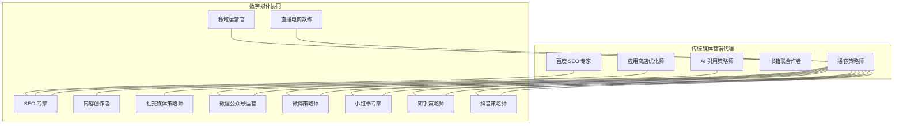
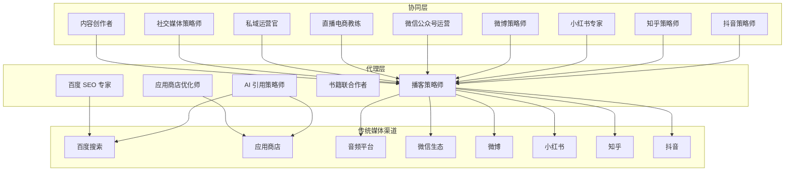
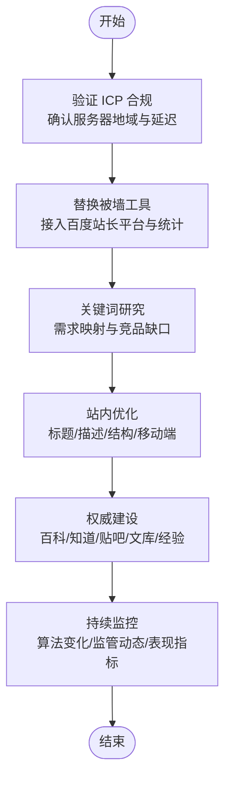
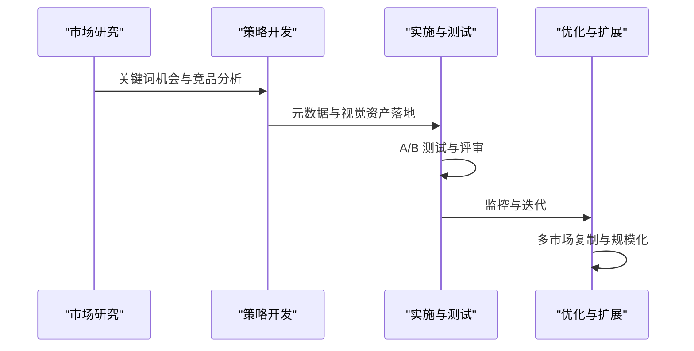
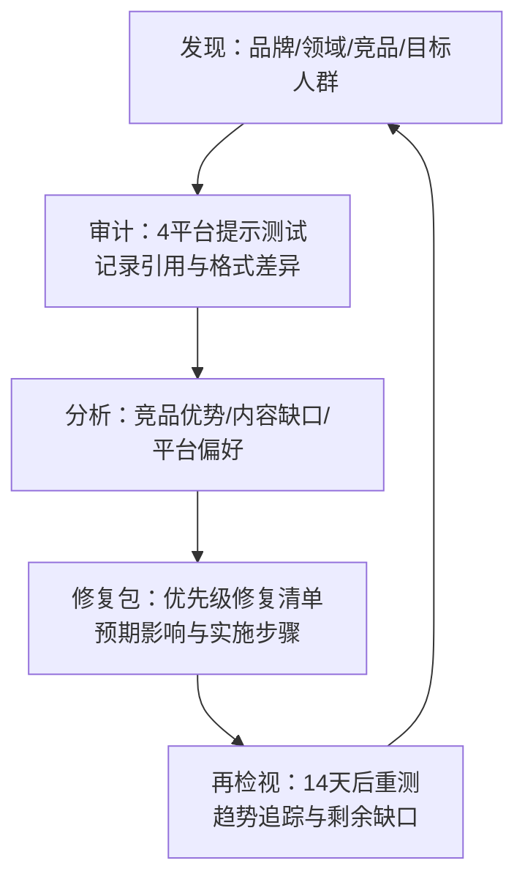
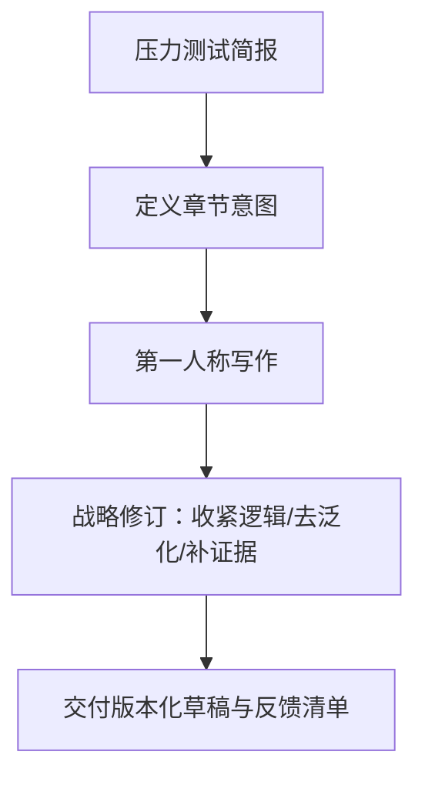
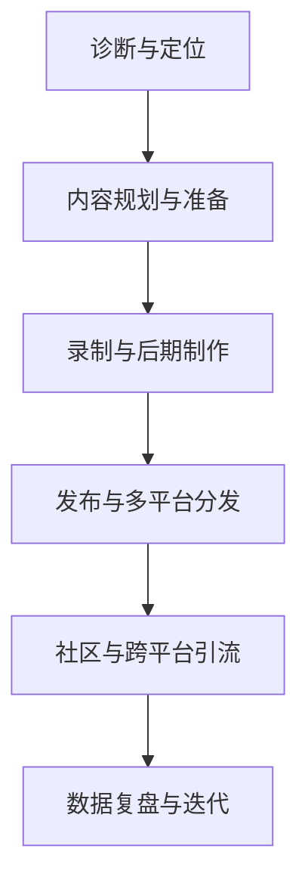
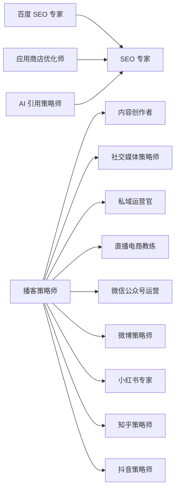

# 传统媒体营销代理

<cite>
**本文引用的文件**
- [marketing-baidu-seo-specialist.md](file://marketing/marketing-baidu-seo-specialist.md)
- [marketing-app-store-optimizer.md](file://marketing/marketing-app-store-optimizer.md)
- [marketing-ai-citation-strategist.md](file://marketing/marketing-ai-citation-strategist.md)
- [marketing-book-co-author.md](file://marketing/marketing-book-co-author.md)
- [marketing-podcast-strategist.md](file://marketing/marketing-podcast-strategist.md)
- [marketing-seo-specialist.md](file://marketing/marketing-seo-specialist.md)
- [marketing-content-creator.md](file://marketing/marketing-content-creator.md)
- [marketing-social-media-strategist.md](file://marketing/marketing-social-media-strategist.md)
- [marketing-private-domain-operator.md](file://marketing/marketing-private-domain-operator.md)
- [marketing-livestream-commerce-coach.md](file://marketing/marketing-livestream-commerce-coach.md)
- [marketing-wechat-official-account.md](file://marketing/marketing-wechat-official-account.md)
- [marketing-weibo-strategist.md](file://marketing/marketing-weibo-strategist.md)
- [marketing-xiaohongshu-specialist.md](file://marketing/marketing-xiaohongshu-specialist.md)
- [marketing-zhihu-strategist.md](file://marketing/marketing-zhihu-strategist.md)
- [marketing-douyin-strategist.md](file://marketing/marketing-douyin-strategist.md)
</cite>

## 目录
1. [引言](#引言)
2. [项目结构](#项目结构)
3. [核心组件](#核心组件)
4. [架构总览](#架构总览)
5. [详细组件分析](#详细组件分析)
6. [依赖关系分析](#依赖关系分析)
7. [性能考量](#性能考量)
8. [故障排查指南](#故障排查指南)
9. [结论](#结论)
10. [附录](#附录)

## 引言
本文件面向“传统媒体营销代理”的系统化知识体系，聚焦于百度 SEO 专家、应用商店优化师、AI 引用策略师、书籍联合作者、播客策略师等专业角色在传统媒体渠道中的定位与方法论。文档从架构、流程、数据流、处理逻辑、集成点、错误处理与性能特征等方面进行深入剖析，并结合传统媒体与数字媒体的融合策略，帮助读者理解如何借助传统媒体的权威性与覆盖面扩大品牌影响力，同时通过可衡量的指标与持续迭代实现营销投入的有效性（ROI）。

## 项目结构
该仓库以“职能域”组织营销类代理，每个代理以独立 Markdown 文件定义身份、使命、规则、交付物、工作流、成功度量与高级能力。营销域包含以下关键代理：
- 百度 SEO 专家：专注中国搜索引擎生态、合规与技术 SEO、内容策略与生态系统整合
- 应用商店优化师：专注 App Store 排名、元数据优化、视觉资产与转化率优化
- AI 引用策略师：专注多平台 AI 引擎引用可见性，AEO/GEO 的审计与修复
- 书籍联合作者：专注思想型著作的内容结构、叙事架构与权威定位
- 播客策略师：专注中国音频平台生态、节目定位、生产与增长、商业化与数据分析

图表来源
- [marketing-baidu-seo-specialist.md:1-227](file://marketing/marketing-baidu-seo-specialist.md#L1-L227)
- [marketing-app-store-optimizer.md:1-321](file://marketing/marketing-app-store-optimizer.md#L1-L321)
- [marketing-ai-citation-strategist.md:1-171](file://marketing/marketing-ai-citation-strategist.md#L1-L171)
- [marketing-book-co-author.md:1-111](file://marketing/marketing-book-co-author.md#L1-L111)
- [marketing-podcast-strategist.md:1-278](file://marketing/marketing-podcast-strategist.md#L1-L278)
- [marketing-seo-specialist.md:1-280](file://marketing/marketing-seo-specialist.md#L1-L280)
- [marketing-content-creator.md:1-54](file://marketing/marketing-content-creator.md#L1-L54)
- [marketing-social-media-strategist.md:1-126](file://marketing/marketing-social-media-strategist.md#L1-L126)
- [marketing-private-domain-operator.md:1-309](file://marketing/marketing-private-domain-operator.md#L1-L309)
- [marketing-livestream-commerce-coach.md:1-306](file://marketing/marketing-livestream-commerce-coach.md#L1-L306)
- [marketing-wechat-official-account.md:1-146](file://marketing/marketing-wechat-official-account.md#L1-L146)
- [marketing-weibo-strategist.md:1-241](file://marketing/marketing-weibo-strategist.md#L1-L241)
- [marketing-xiaohongshu-specialist.md:1-139](file://marketing/marketing-xiaohongshu-specialist.md#L1-L139)
- [marketing-zhihu-strategist.md:1-163](file://marketing/marketing-zhihu-strategist.md#L1-L163)
- [marketing-douyin-strategist.md:1-150](file://marketing/marketing-douyin-strategist.md#L1-L150)

章节来源
- [marketing-baidu-seo-specialist.md:1-227](file://marketing/marketing-baidu-seo-specialist.md#L1-L227)
- [marketing-app-store-optimizer.md:1-321](file://marketing/marketing-app-store-optimizer.md#L1-L321)
- [marketing-ai-citation-strategist.md:1-171](file://marketing/marketing-ai-citation-strategist.md#L1-L171)
- [marketing-book-co-author.md:1-111](file://marketing/marketing-book-co-author.md#L1-L111)
- [marketing-podcast-strategist.md:1-278](file://marketing/marketing-podcast-strategist.md#L1-L278)

## 核心组件
- 百度 SEO 专家：以“合规—技术—内容—生态”四步法构建搜索可见性；强调 ICP 合规、移动端优先、生态系统整合与算法更新应对
- 应用商店优化师：以“关键词—元数据—视觉资产—转化”为主线，系统化提升商店可见性与下载转化
- AI 引用策略师：以“多平台审计—竞品映射—修复优先级—再检视”的闭环，提升品牌在 AI 引擎中的引用概率
- 书籍联合作者：以“章节蓝图—版本化草稿—编辑意见—反馈闭环”保障思想型作品的权威性与可读性
- 播客策略师：以“定位—平台运营—内容—生产—分发—增长—商业化—数据”全链路方法论，打造音频品牌

章节来源
- [marketing-baidu-seo-specialist.md:14-227](file://marketing/marketing-baidu-seo-specialist.md#L14-L227)
- [marketing-app-store-optimizer.md:13-321](file://marketing/marketing-app-store-optimizer.md#L13-L321)
- [marketing-ai-citation-strategist.md:1-171](file://marketing/marketing-ai-citation-strategist.md#L1-L171)
- [marketing-book-co-author.md:1-111](file://marketing/marketing-book-co-author.md#L1-L111)
- [marketing-podcast-strategist.md:1-278](file://marketing/marketing-podcast-strategist.md#L1-L278)

## 架构总览
传统媒体营销代理的“系统架构”由以下层次构成：
- 渠道层：搜索引擎（百度、Google）、应用商店（App Store、Google Play）、音频平台（喜马拉雅、小宇宙、网易云音乐、Apple Podcasts）、社交媒体（微博、小红书、知乎、抖音）
- 代理层：百度 SEO 专家、应用商店优化师、AI 引用策略师、书籍联合作者、播客策略师
- 协同层：内容创作者、社交媒体策略师、私域运营官、直播电商教练、微信公众号运营、微博策略师、小红书专家、知乎策略师、抖音策略师
- 数据与度量层：技术 SEO 审计、关键词研究、转化率、粉丝增长、播放完成率、GMV、ROI

图表来源
- [marketing-baidu-seo-specialist.md:1-227](file://marketing/marketing-baidu-seo-specialist.md#L1-L227)
- [marketing-app-store-optimizer.md:1-321](file://marketing/marketing-app-store-optimizer.md#L1-L321)
- [marketing-ai-citation-strategist.md:1-171](file://marketing/marketing-ai-citation-strategist.md#L1-L171)
- [marketing-book-co-author.md:1-111](file://marketing/marketing-book-co-author.md#L1-L111)
- [marketing-podcast-strategist.md:1-278](file://marketing/marketing-podcast-strategist.md#L1-L278)
- [marketing-content-creator.md:1-54](file://marketing/marketing-content-creator.md#L1-L54)
- [marketing-social-media-strategist.md:1-126](file://marketing/marketing-social-media-strategist.md#L1-L126)
- [marketing-private-domain-operator.md:1-309](file://marketing/marketing-private-domain-operator.md#L1-L309)
- [marketing-livestream-commerce-coach.md:1-306](file://marketing/marketing-livestream-commerce-coach.md#L1-L306)
- [marketing-wechat-official-account.md:1-146](file://marketing/marketing-wechat-official-account.md#L1-L146)
- [marketing-weibo-strategist.md:1-241](file://marketing/marketing-weibo-strategist.md#L1-L241)
- [marketing-xiaohongshu-specialist.md:1-139](file://marketing/marketing-xiaohongshu-specialist.md#L1-L139)
- [marketing-zhihu-strategist.md:1-163](file://marketing/marketing-zhihu-strategist.md#L1-L163)
- [marketing-douyin-strategist.md:1-150](file://marketing/marketing-douyin-strategist.md#L1-L150)

## 详细组件分析

### 百度 SEO 专家
- 身份与使命：深耕中国搜索生态，确保合规、技术与内容质量，构建权威与覆盖
- 关键规则：ICP 合规为先、服务器地域化、禁用被墙服务、简体中文内容
- 工作流：合规基础—关键词研究—站内优化—权威建设—持续迭代
- 成功度量：收录覆盖率、关键词排名、有机流量增长、移动端加载速度、生态贡献占比

图表来源
- [marketing-baidu-seo-specialist.md:144-194](file://marketing/marketing-baidu-seo-specialist.md#L144-L194)

章节来源
- [marketing-baidu-seo-specialist.md:17-227](file://marketing/marketing-baidu-seo-specialist.md#L17-L227)

### 应用商店优化师
- 身份与使命：最大化商店可见性与下载转化，优化元数据与视觉资产，驱动可持续用户获取
- 关键规则：数据驱动、转化优先、A/B 测试、竞品监测
- 工作流：市场研究—策略制定—执行测试—优化扩展
- 成功度量：有机下载增长、关键词排名、转化率、评分与评论、国际扩张

图表来源
- [marketing-app-store-optimizer.md:175-198](file://marketing/marketing-app-store-optimizer.md#L175-L198)

章节来源
- [marketing-app-store-optimizer.md:19-321](file://marketing/marketing-app-store-optimizer.md#L19-L321)

### AI 引用策略师
- 身份与使命：审计多平台 AI 引擎引用，识别竞品优势，生成修复优先级清单，持续再检视
- 关键规则：多平台审计、不承诺结果、区分 AEO/SEO、基准测量、按影响排序
- 工作流：发现—审计—分析—修复包—再检视与迭代
- 成功度量：引用率提升、丢失提示恢复、平台覆盖、竞品差距收窄、修复实施率

图表来源
- [marketing-ai-citation-strategist.md:102-132](file://marketing/marketing-ai-citation-strategist.md#L102-L132)

章节来源
- [marketing-ai-citation-strategist.md:1-171](file://marketing/marketing-ai-citation-strategist.md#L1-L171)

### 书籍联合作者
- 身份与使命：将口述与碎片转化为第一人称、有结构的章节，强化作者声音与权威定位
- 关键规则：作者可见、无空洞灵感、可溯源、每节聚焦、具体胜抽象、版本化、明确编辑缺口
- 工作流：压力测试简报—定义章节意图—第一人称写作—战略修订—交付修订包
- 成功度量：声音保真度、叙事连贯性、论证强度、编辑效率、定位影响力

图表来源
- [marketing-book-co-author.md:83-103](file://marketing/marketing-book-co-author.md#L83-L103)

章节来源
- [marketing-book-co-author.md:1-111](file://marketing/marketing-book-co-author.md#L1-L111)

### 播客策略师
- 身份与使命：在中国音频生态中建立陪伴式品牌，从概念到忠实听众
- 关键规则：慢媒体思维、音频质量是门槛、稳定发布节奏、以“人”为核心护城河、完成率优于播放量
- 工作流：诊断与定位—内容规划—生产与发布—推广与增长—数据复盘
- 成功度量：播放量与完成率、评论互动、订阅增长、留存、品牌合作满意度、榜单排名

图表来源
- [marketing-podcast-strategist.md:228-261](file://marketing/marketing-podcast-strategist.md#L228-L261)

章节来源
- [marketing-podcast-strategist.md:1-278](file://marketing/marketing-podcast-strategist.md#L1-L278)

## 依赖关系分析
- 百度 SEO 专家与 SEO 专家：前者聚焦中国生态与合规，后者覆盖通用蓝筹引擎；二者互补，避免“SEO 成功但 AI 不被引用”的错配
- 应用商店优化师与 SEO 专家：两者均强调关键词与技术基础，但商店优化更关注元数据与视觉资产
- 播客策略师与内容创作者、社交媒体策略师、私域运营官、直播电商教练、微信公众号运营、微博策略师、小红书专家、知乎策略师、抖音策略师：播客作为“音频媒体运营”的代表，与多平台内容矩阵形成协同，共同构建品牌声量与信任

图表来源
- [marketing-baidu-seo-specialist.md:1-227](file://marketing/marketing-baidu-seo-specialist.md#L1-L227)
- [marketing-app-store-optimizer.md:1-321](file://marketing/marketing-app-store-optimizer.md#L1-L321)
- [marketing-ai-citation-strategist.md:1-171](file://marketing/marketing-ai-citation-strategist.md#L1-L171)
- [marketing-book-co-author.md:1-111](file://marketing/marketing-book-co-author.md#L1-L111)
- [marketing-podcast-strategist.md:1-278](file://marketing/marketing-podcast-strategist.md#L1-L278)
- [marketing-content-creator.md:1-54](file://marketing/marketing-content-creator.md#L1-L54)
- [marketing-social-media-strategist.md:1-126](file://marketing/marketing-social-media-strategist.md#L1-L126)
- [marketing-private-domain-operator.md:1-309](file://marketing/marketing-private-domain-operator.md#L1-L309)
- [marketing-livestream-commerce-coach.md:1-306](file://marketing/marketing-livestream-commerce-coach.md#L1-L306)
- [marketing-wechat-official-account.md:1-146](file://marketing/marketing-wechat-official-account.md#L1-L146)
- [marketing-weibo-strategist.md:1-241](file://marketing/marketing-weibo-strategist.md#L1-L241)
- [marketing-xiaohongshu-specialist.md:1-139](file://marketing/marketing-xiaohongshu-specialist.md#L1-L139)
- [marketing-zhihu-strategist.md:1-163](file://marketing/marketing-zhihu-strategist.md#L1-L163)
- [marketing-douyin-strategist.md:1-150](file://marketing/marketing-douyin-strategist.md#L1-L150)

章节来源
- [marketing-seo-specialist.md:1-280](file://marketing/marketing-seo-specialist.md#L1-L280)

## 性能考量
- 传统媒体渠道的性能取决于“权威性、覆盖面、合规性与持续性”。例如：
  - 百度 SEO：收录覆盖率、关键词排名、移动端加载速度、生态贡献占比
  - 应用商店：有机下载增长、关键词排名、转化率、评分与评论、国际扩张
  - AI 引用：平台覆盖、引用率、丢失提示恢复、修复实施率
  - 播客：播放完成率、评论互动、订阅增长、榜单排名
- 数字媒体协同可放大传统媒体效果，如播客内容在微信公众号、小红书、微博、抖音的再生产与跨平台引流，形成“音频—图文—短视频—社交”的传播闭环

## 故障排查指南
- 百度 SEO 合规问题：优先核查 ICP、服务器地域、被墙工具使用、简体中文内容与内容审查合规
- 应用商店技术问题：检查元数据完整性、截图与视频质量、A/B 测试基线、竞品覆盖缺口
- AI 引用波动：核对修复清单实施进度、平台算法更新、提示模式匹配度
- 播客表现异常：检查音频质量、发布节奏、评论区管理、跨平台引流与转化追踪
- 私域转化低：审视获客入口、欢迎 SOP、内容日历、生命周期自动化与风控合规

章节来源
- [marketing-baidu-seo-specialist.md:37-50](file://marketing/marketing-baidu-seo-specialist.md#L37-L50)
- [marketing-app-store-optimizer.md:42-55](file://marketing/marketing-app-store-optimizer.md#L42-L55)
- [marketing-ai-citation-strategist.md:27-35](file://marketing/marketing-ai-citation-strategist.md#L27-L35)
- [marketing-podcast-strategist.md:121-145](file://marketing/marketing-podcast-strategist.md#L121-L145)
- [marketing-private-domain-operator.md:59-76](file://marketing/marketing-private-domain-operator.md#L59-L76)

## 结论
传统媒体营销代理以“渠道特性—方法论—协同—度量”为核心，既尊重传统媒体的权威性与覆盖面，又通过系统化流程与数据驱动实现投入产出优化。在实践中，应优先解决合规与技术基础，再以内容与生态建设扩大可见性，并通过多平台协同与持续迭代提升整体营销效能。

## 附录
- 传统媒体与数字媒体融合建议
  - 搜索引擎：以 SEO/AI 引用双轨策略，既保证传统 SERP 排名，也提升 AI 引擎引用
  - 应用商店：以 ASO 为基础，结合私域与直播电商闭环，提升下载与留存
  - 音频媒体：以播客为核心，联动微信公众号、小红书、微博、抖音与知乎，形成内容矩阵
  - 社交与内容：以内容创作者与社交媒体策略师为枢纽，统一品牌声音与传播节奏
  - 私域与直播：以私域运营官与直播电商教练为抓手，将公域流量转化为私域资产与销售转化