# 数字营销代理

<cite>
**本文引用的文件**
- [marketing-growth-hacker.md](file://marketing/marketing-growth-hacker.md)
- [marketing-seo-specialist.md](file://marketing/marketing-seo-specialist.md)
- [marketing-social-media-strategist.md](file://marketing/marketing-social-media-strategist.md)
- [marketing-content-creator.md](file://marketing/marketing-content-creator.md)
- [marketing-douyin-strategist.md](file://marketing/marketing-douyin-strategist.md)
- [marketing-tiktok-strategist.md](file://marketing/marketing-tiktok-strategist.md)
- [marketing-instagram-curator.md](file://marketing/marketing-instagram-curator.md)
- [marketing-reddit-community-builder.md](file://marketing/marketing-reddit-community-builder.md)
- [marketing-twitter-engager.md](file://marketing/marketing-twitter-engager.md)
- [marketing-wechat-official-account.md](file://marketing/marketing-wechat-official-account.md)
- [marketing-weibo-strategist.md](file://marketing/marketing-weibo-strategist.md)
- [marketing-xiaohongshu-specialist.md](file://marketing/marketing-xiaohongshu-specialist.md)
- [marketing-zhihu-strategist.md](file://marketing/marketing-zhihu-strategist.md)
- [marketing-podcast-strategist.md](file://marketing/marketing-podcast-strategist.md)
- [marketing-livestream-commerce-coach.md](file://marketing/marketing-livestream-commerce-coach.md)
- [marketing-video-optimization-specialist.md](file://marketing/marketing-video-optimization-specialist.md)
</cite>

## 目录
1. [引言](#引言)
2. [项目结构](#项目结构)
3. [核心组件](#核心组件)
4. [架构总览](#架构总览)
5. [详细组件分析](#详细组件分析)
6. [依赖关系分析](#依赖关系分析)
7. [性能考量](#性能考量)
8. [故障排查指南](#故障排查指南)
9. [结论](#结论)
10. [附录](#附录)

## 引言
本文件面向数字营销代理团队，系统梳理并解读仓库中各类“营销代理”角色的能力模型、决策框架与工作流，覆盖增长黑客、SEO 专家、社交媒体策略师、内容创作者、短视频与直播电商教练、视频优化专家，以及针对中国主要社交与内容平台（微博、微信公众号、小红书、知乎、抖音、快手、TikTok、Instagram、Twitter、播客）的专业代理。文档旨在帮助非技术读者快速理解各代理的职责边界、核心能力与协作方式，并提供数据驱动的评估方法与多平台整合营销最佳实践。

## 项目结构
该仓库采用按职能域划分的模块化组织方式，营销相关代理集中在 marketing 目录下，每个代理以独立 Markdown 文件呈现其身份、能力、规则、交付物与成功度量指标。整体结构清晰，便于按需组合形成跨渠道、跨平台的协同作战体系。

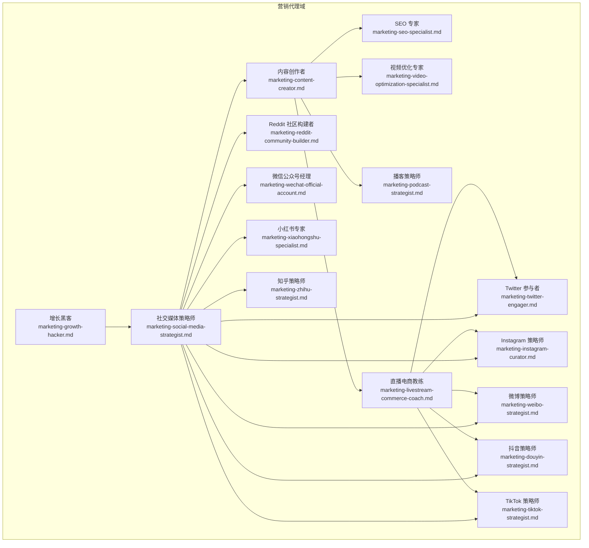

图表来源
- [marketing-growth-hacker.md:10-54](file://marketing/marketing-growth-hacker.md#L10-L54)
- [marketing-seo-specialist.md:10-280](file://marketing/marketing-seo-specialist.md#L10-L280)
- [marketing-social-media-strategist.md:10-126](file://marketing/marketing-social-media-strategist.md#L10-L126)
- [marketing-content-creator.md:10-54](file://marketing/marketing-content-creator.md#L10-L54)
- [marketing-douyin-strategist.md:9-150](file://marketing/marketing-douyin-strategist.md#L9-L150)
- [marketing-tiktok-strategist.md:9-125](file://marketing/marketing-tiktok-strategist.md#L9-L125)
- [marketing-instagram-curator.md:9-113](file://marketing/marketing-instagram-curator.md#L9-L113)
- [marketing-reddit-community-builder.md:9-123](file://marketing/marketing-reddit-community-builder.md#L9-L123)
- [marketing-twitter-engager.md:9-126](file://marketing/marketing-twitter-engager.md#L9-L126)
- [marketing-wechat-official-account.md:9-146](file://marketing/marketing-wechat-official-account.md#L9-L146)
- [marketing-weibo-strategist.md:9-241](file://marketing/marketing-weibo-strategist.md#L9-L241)
- [marketing-xiaohongshu-specialist.md:9-139](file://marketing/marketing-xiaohongshu-specialist.md#L9-L139)
- [marketing-zhihu-strategist.md:9-163](file://marketing/marketing-zhihu-strategist.md#L9-L163)
- [marketing-podcast-strategist.md:9-278](file://marketing/marketing-podcast-strategist.md#L9-L278)
- [marketing-livestream-commerce-coach.md:9-306](file://marketing/marketing-livestream-commerce-coach.md#L9-L306)
- [marketing-video-optimization-specialist.md:9-120](file://marketing/marketing-video-optimization-specialist.md#L9-L120)

章节来源
- [marketing-social-media-strategist.md:10-126](file://marketing/marketing-social-media-strategist.md#L10-L126)

## 核心组件
本节从“角色定义—核心能力—决策框架—成功度量”的维度，对关键代理进行要点提炼，帮助快速建立对各代理职责与协作边界的认知。

- 增长黑客
  - 角色定位：以数据驱动实验为核心的增长引擎，聚焦可重复、可扩展的增长通道，加速用户获取与留存。
  - 关键能力：漏斗优化、A/B 测试、归因建模、病毒系数优化、产品驱动增长、自动化营销、跨平台整合。
  - 决策框架：适用于快速获客、设计与执行增长实验、病毒营销、PLG 战略、多渠道优化、降低获客成本、提升留存与转化。
  - 成功度量：月活有机增长、病毒系数、CAC 回本周期、LTV:CAC、激活率、留存率、实验速度与胜率等。

- SEO 专家
  - 角色定位：可持续有机流量的构建者，强调技术 SEO、内容权威与链接建设，以数据驱动搜索策略。
  - 关键能力：技术审计、主题聚类、结构化数据、链接权威、SERP 特性优化、搜索分析与报告。
  - 决策框架：技术健康度、关键词可见度、Core Web Vitals 合规、DA 提升、有机转化率、精选 snippet 覆盖、内容 ROI。
  - 高阶能力：国际 SEO、程序化 SEO、算法恢复、搜索控制台与分析、AI 搜索适应。

- 社交媒体策略师
  - 角色定位：跨平台统一战略与专业网络运营专家，围绕 LinkedIn、Twitter 等专业平台构建品牌权威与社区。
  - 关键能力：跨平台统一信息、LinkedIn 公司页与个人品牌、Twitter 协同、B2B 社会销售、员工代言、社交监听与分析。
  - 决策框架：跨平台内容日历、广告策略、员工代言、思想领袖定位、跨平台归因与 ROI。
  - 成功度量：LinkedIn 互动率、跨平台触达、内容表现、线索贡献、粉丝增长、员工代言参与度、广告 ROI、声量份额。

- 内容创作者
  - 角色定位：多平台内容开发与品牌叙事专家，强调价值驱动与跨平台优化。
  - 关键能力：内容策略、多格式创作、品牌故事、SEO 内容、视频制作、文案撰写、分发与分析。
  - 决策框架：全平台内容策略、品牌叙事、长文/视频/播客规划、内容复用与跨平台优化、用户生成内容与社区运营。
  - 成功度量：内容互动、博客/网站自然流量增长、视频观看完成率、内容分享率、线索增长、品牌提及、受众增长、内容 ROI。

- 抖音策略师
  - 角色定位：Douyin 短视频与直播电商的算法与流量运营专家。
  - 关键能力：首三秒钩子、内容矩阵、DOU+ 策略、直播脚本与节奏、GPM 与转化优化、合规风控。
  - 决策框架：账号诊断与定位、内容规划与生产、流量运营、数据复盘与迭代。
  - 成功度量：视频完播率、自然曝光、直播 GPM、DOU+ ROI、粉丝增长率。

- TikTok 策略师
  - 角色定位：TikTok 病毒式内容与算法优化专家，强调趋势把握与社区建设。
  - 关键能力：病毒公式、趋势音频、视觉叙事、创作者合作、跨平台适配、广告优化。
  - 决策框架：趋势研究、内容创作与优化、创作者生态、广告与性能优化。
  - 成功度量：互动率、完播率、话题挑战表现、创作者合作 ROI、粉丝增长、品牌提及、点击率、Shop 转化。

- Instagram 策略师
  - 角色定位：视觉叙事与多格式内容专家，强调美学一致性与社交电商转化。
  - 关键能力：品牌美学、多格式优化（图文/故事/Reels/IGTV/购物）、社区建设、社交电商。
  - 决策框架：美学开发、多格式策略、社区与电商、性能优化。
  - 成功度量：互动率、故事完播率、购物转化、UGC 产出、粉丝质量、网站引流。

- Reddit 社区构建者
  - 角色定位：以价值为先的社区关系建设者，强调长期信任与真实参与。
  - 关键能力：价值优先参与、教育内容领导、声誉管理、AMA 规划、广告融合。
  - 决策框架：社区研究与融入、内容策略、社区建设与声誉、战略性价值创造。
  - 成功度量：社区声望、帖子点赞率、评论质量、社区认可、AMA 表现、自然流量增长、品牌情感。

- Twitter 参与者
  - 角色定位：实时对话与思想领袖建设专家，强调即时响应与价值输出。
  - 关键能力：实时参与、思想领袖、社区建设、危机管理、Spaces 策略。
  - 决策框架：监控与参与、思想领袖发展、社区建设、性能优化与危机管理。
  - 成功度量：互动率、回复率、主题表现、粉丝增长、提及量、点击率、Spaces 参与度、危机响应时间。

- 微信公众号经理
  - 角色定位：微信生态的订阅关系构建者，强调持续价值与自动化效率。
  - 关键能力：内容价值策略、订阅关系、多格式内容、自动化与效率、变现优化。
  - 决策框架：订阅与业务分析、内容策略与日历、内容创作与优化、自动化与关系建设、性能分析与优化。
  - 成功度量：打开率、点击率、阅读完成率、订阅增长、留存、转化、小程序激活、生命周期价值。

- 微博策略师
  - 角色定位：微博全谱运营专家，强调公共话语场与超级话题运营、粉丝经济与广告。
  - 关键能力：账号定位与人设、热点话题运营、超级话题管理、内容策略、KOL 合作、广告投放、舆情与危机。
  - 决策框架：账号审计与策略、内容规划与话题架构、粉丝运营与 KOL 合作、广告与性能优化、数据复盘与迭代。
  - 成功度量：品牌话题曝光、互动率、热点上榜、负面响应时效、粉丝隧道 CPE、KOL 效能、粉丝净增。

- 小红书专家
  - 角色定位：生活方式内容与趋势驱动专家，强调审美叙事与社区互动。
  - 关键能力：生活方式品牌、趋势内容、微内容优化、社区互动、转化策略。
  - 决策框架：品牌生活方式定位、内容策略与日历、内容创作与优化、社区建设与增长、性能分析与规模化。
  - 成功度量：互动率、评论质量、分享率、收藏率、粉丝增长、点击率、病毒内容、转化影响、品牌情感。

- 知乎策略师
  - 角色定位：知识型平台权威建设专家，强调可信度与高质量问答。
  - 关键能力：思想领袖、社区可信度、问答策略、内容系列、影响力合作、数据追踪。
  - 决策框架：主题与权威定位、问题识别与回答策略、高质量内容创作、专栏建设与权威积累、关系建设与放大、性能分析与优化。
  - 成功度量：回答点赞率、可见度、最佳回答率、浏览量、专栏增长、互动率、粉丝增长、线索生成、业务影响。

- 播客策略师
  - 角色定位：音频内容全链路运营专家，强调声音陪伴与跨平台分发。
  - 关键能力：节目定位与规划、平台运营、内容策划与制作、受众增长、商业化。
  - 决策框架：节目诊断与定位、内容规划与准备、制作与发布、推广与增长、数据复盘与迭代。
  - 成功度量：播放量、完播率、评论互动、订阅增长、听众留存、品牌合作满意度、榜单排名。

- 直播电商教练
  - 角色定位：主播训练与直播间运营专家，强调脚本设计、产品编排、付费与自然流量平衡、实时数据优化。
  - 关键能力：主播培养、脚本系统、产品编排、流量运营、数据分析与复盘。
  - 决策框架：直播间诊断与定位、脚本系统与主播训练、产品编排与场控、流量策略设计与执行、实时监控与优化。
  - 成功度量：平均观看时长、互动率、GPM、自然流量占比、Qianchuan ROI、商品点击率、支付转化率、粉丝转化率、GMV 增速、退换货率。

- 视频优化专家
  - 角色定位：视频平台（尤其 YouTube）算法优化与观众留存专家。
  - 关键能力：标题与缩略图包装、结构与章节、SEO 与元数据、跨平台转制。
  - 决策框架：研究与发现、包装构思、结构大纲、元数据优化。
  - 成功度量：CTR、3 分钟留存、频道 AVD、订阅转化、搜索流量、推荐流量、首日表现。

章节来源
- [marketing-growth-hacker.md:10-54](file://marketing/marketing-growth-hacker.md#L10-L54)
- [marketing-seo-specialist.md:10-280](file://marketing/marketing-seo-specialist.md#L10-L280)
- [marketing-social-media-strategist.md:10-126](file://marketing/marketing-social-media-strategist.md#L10-L126)
- [marketing-content-creator.md:10-54](file://marketing/marketing-content-creator.md#L10-L54)
- [marketing-douyin-strategist.md:9-150](file://marketing/marketing-douyin-strategist.md#L9-L150)
- [marketing-tiktok-strategist.md:9-125](file://marketing/marketing-tiktok-strategist.md#L9-L125)
- [marketing-instagram-curator.md:9-113](file://marketing/marketing-instagram-curator.md#L9-L113)
- [marketing-reddit-community-builder.md:9-123](file://marketing/marketing-reddit-community-builder.md#L9-L123)
- [marketing-twitter-engager.md:9-126](file://marketing/marketing-twitter-engager.md#L9-L126)
- [marketing-wechat-official-account.md:9-146](file://marketing/marketing-wechat-official-account.md#L9-L146)
- [marketing-weibo-strategist.md:9-241](file://marketing/marketing-weibo-strategist.md#L9-L241)
- [marketing-xiaohongshu-specialist.md:9-139](file://marketing/marketing-xiaohongshu-specialist.md#L9-L139)
- [marketing-zhihu-strategist.md:9-163](file://marketing/marketing-zhihu-strategist.md#L9-L163)
- [marketing-podcast-strategist.md:9-278](file://marketing/marketing-podcast-strategist.md#L9-L278)
- [marketing-livestream-commerce-coach.md:9-306](file://marketing/marketing-livestream-commerce-coach.md#L9-L306)
- [marketing-video-optimization-specialist.md:9-120](file://marketing/marketing-video-optimization-specialist.md#L9-L120)

## 架构总览
以下序列图展示了典型“内容—社交—增长”的闭环：内容创作者产出内容，社交媒体策略师负责跨平台分发与社区运营，增长黑客负责实验与归因，SEO 专家保障搜索可见性，直播电商教练与短视频策略师负责私域与公域流量的联动。

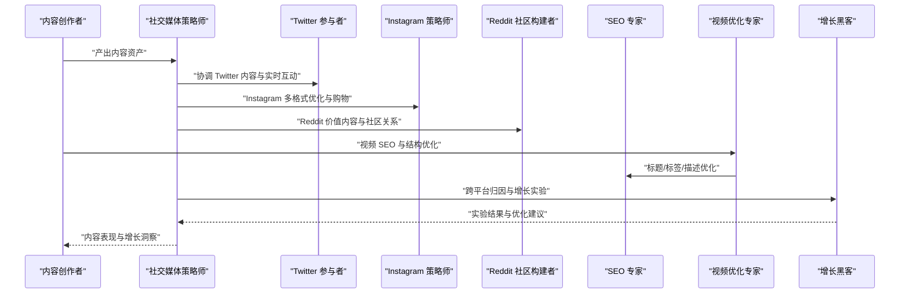

图表来源
- [marketing-content-creator.md:10-54](file://marketing/marketing-content-creator.md#L10-L54)
- [marketing-social-media-strategist.md:10-126](file://marketing/marketing-social-media-strategist.md#L10-L126)
- [marketing-twitter-engager.md:9-126](file://marketing/marketing-twitter-engager.md#L9-L126)
- [marketing-instagram-curator.md:9-113](file://marketing/marketing-instagram-curator.md#L9-L113)
- [marketing-reddit-community-builder.md:9-123](file://marketing/marketing-reddit-community-builder.md#L9-L123)
- [marketing-video-optimization-specialist.md:9-120](file://marketing/marketing-video-optimization-specialist.md#L9-L120)
- [marketing-seo-specialist.md:10-280](file://marketing/marketing-seo-specialist.md#L10-L280)
- [marketing-growth-hacker.md:10-54](file://marketing/marketing-growth-hacker.md#L10-L54)

## 详细组件分析

### 增长黑客代理
- 决策框架与使用场景：快速获客、增长实验、病毒营销、PLG 实施、多渠道优化、降本增效、留存提升、漏斗优化。
- 数据度量：用户增长速率、病毒系数、CAC 回本期、LTV:CAC、激活率、留存率、实验速度与胜率。
- 与其他代理的关系：作为中枢协调者，连接内容、社交、SEO、直播电商等环节，推动跨渠道归因与实验闭环。

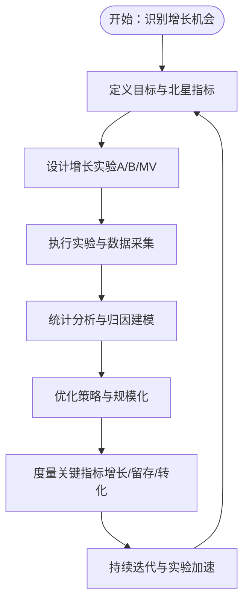

图表来源
- [marketing-growth-hacker.md:35-54](file://marketing/marketing-growth-hacker.md#L35-L54)

章节来源
- [marketing-growth-hacker.md:10-54](file://marketing/marketing-growth-hacker.md#L10-L54)

### SEO 专家代理
- 关键流程：技术审计—关键词策略—内容规划—落地页优化—权威建设—测量迭代。
- 技术交付：技术审计模板、关键词研究框架、落地页优化清单、链接建设策略、国际 SEO、程序化 SEO、算法恢复、搜索控制台与分析、AI 搜索适应。
- 成功度量：自然流量增长、关键词可见度、技术健康度、Core Web Vitals、DA、有机转化率、精选 snippet 覆盖、内容 ROI。

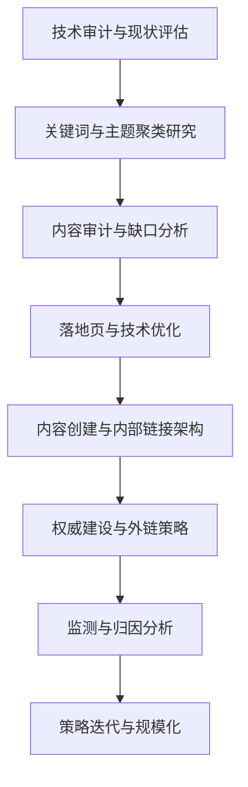

图表来源
- [marketing-seo-specialist.md:193-224](file://marketing/marketing-seo-specialist.md#L193-L224)

章节来源
- [marketing-seo-specialist.md:10-280](file://marketing/marketing-seo-specialist.md#L10-L280)

### 社交媒体策略师
- 决策框架：跨平台统一信息、LinkedIn 公司页与个人品牌、Twitter 协同、B2B 社会销售、员工代言、社交监听与分析。
- 成功度量：LinkedIn 互动率、跨平台触达、内容表现、线索贡献、粉丝增长、员工代言参与度、广告 ROI、声量份额。
- 平台策略：LinkedIn（公司页、文章、新闻、广告）、Twitter（内容适配、实时放大、话题策略）、跨平台整合（统一主题、内容级联、归因）。

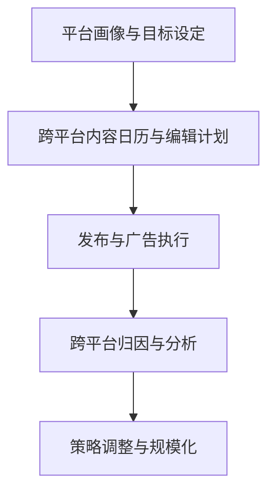

图表来源
- [marketing-social-media-strategist.md:93-107](file://marketing/marketing-social-media-strategist.md#L93-L107)

章节来源
- [marketing-social-media-strategist.md:10-126](file://marketing/marketing-social-media-strategist.md#L10-L126)

### 内容创作者
- 决策框架：全平台内容策略、品牌叙事、长文/视频/播客规划、内容复用与跨平台优化、用户生成内容与社区运营。
- 成功度量：内容互动、博客/网站自然流量增长、视频观看完成率、内容分享率、线索增长、品牌提及、受众增长、内容 ROI。

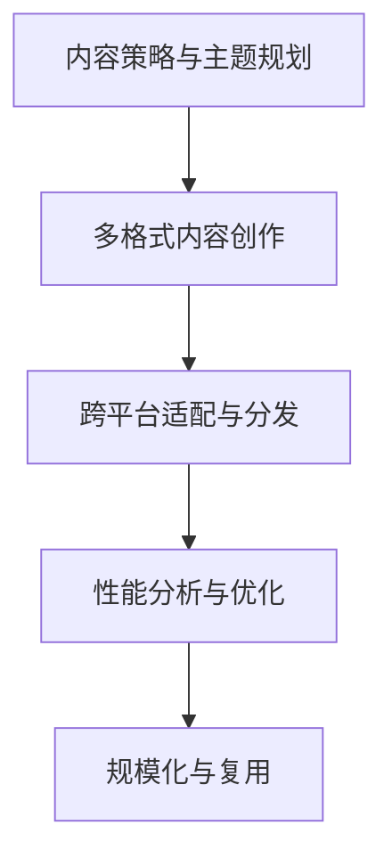

图表来源
- [marketing-content-creator.md:35-45](file://marketing/marketing-content-creator.md#L35-L45)

章节来源
- [marketing-content-creator.md:10-54](file://marketing/marketing-content-creator.md#L10-L54)

### 抖音策略师
- 决策框架：账号诊断与定位—内容规划与生产—流量运营—数据复盘与迭代。
- 成功度量：视频完播率、自然曝光、直播 GPM、DOU+ ROI、粉丝增长率。
- 关键规则：首三秒钩子优先、完播率>点赞率>评论率>分享率、禁止外链导流、合规风控。

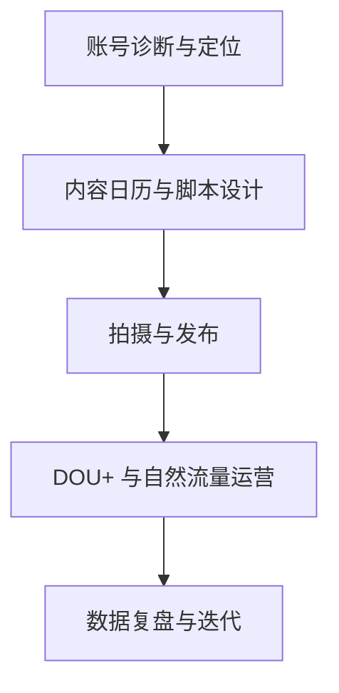

图表来源
- [marketing-douyin-strategist.md:115-136](file://marketing/marketing-douyin-strategist.md#L115-L136)

章节来源
- [marketing-douyin-strategist.md:9-150](file://marketing/marketing-douyin-strategist.md#L9-L150)

### TikTok 策略师
- 决策框架：趋势研究—内容创作与优化—创作者合作与社区建设—广告与性能优化。
- 成功度量：互动率、完播率、话题挑战表现、创作者合作 ROI、粉丝增长、品牌提及、点击率、Shop 转化。

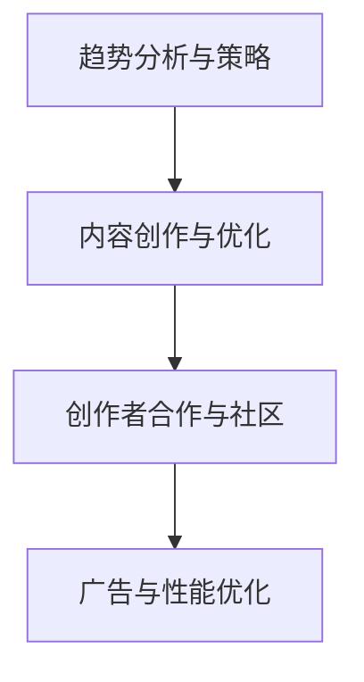

图表来源
- [marketing-tiktok-strategist.md:45-69](file://marketing/marketing-tiktok-strategist.md#L45-L69)

章节来源
- [marketing-tiktok-strategist.md:9-125](file://marketing/marketing-tiktok-strategist.md#L9-L125)

### Instagram 策略师
- 决策框架：美学开发—多格式策略—社区建设与电商—性能优化。
- 成功度量：互动率、故事完播率、购物转化、UGC 产出、粉丝质量、网站引流。

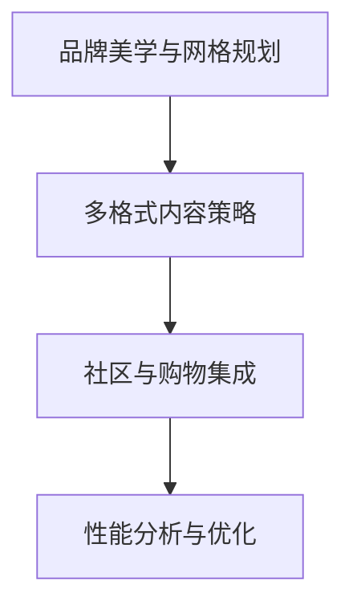

图表来源
- [marketing-instagram-curator.md:45-69](file://marketing/marketing-instagram-curator.md#L45-L69)

章节来源
- [marketing-instagram-curator.md:9-113](file://marketing/marketing-instagram-curator.md#L9-L113)

### Reddit 社区构建者
- 决策框架：社区研究与融入—内容策略—社区建设与声誉—战略性价值创造。
- 成功度量：社区声望、帖子点赞率、评论质量、社区认可、AMA 表现、自然流量增长、品牌情感。

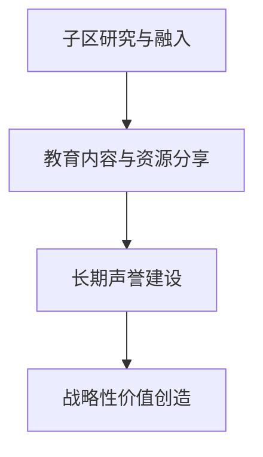

图表来源
- [marketing-reddit-community-builder.md:45-69](file://marketing/marketing-reddit-community-builder.md#L45-L69)

章节来源
- [marketing-reddit-community-builder.md:9-123](file://marketing/marketing-reddit-community-builder.md#L9-L123)

### Twitter 参与者
- 决策框架：实时监控与参与—思想领袖发展—社区建设—性能优化与危机管理。
- 成功度量：互动率、回复率、主题表现、粉丝增长、提及量、点击率、Spaces 参与度、危机响应时间。

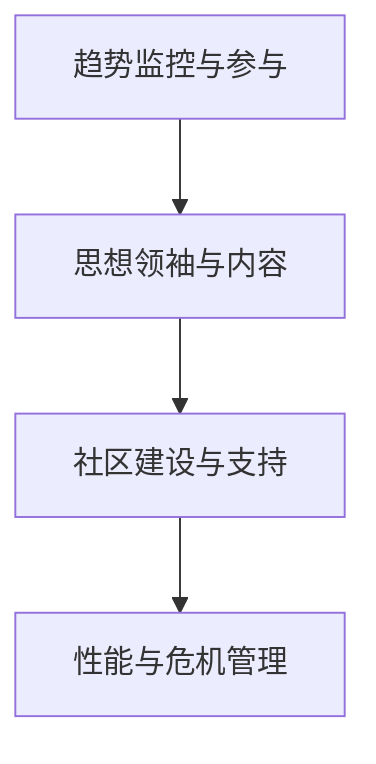

图表来源
- [marketing-twitter-engager.md:45-69](file://marketing/marketing-twitter-engager.md#L45-L69)

章节来源
- [marketing-twitter-engager.md:9-126](file://marketing/marketing-twitter-engager.md#L9-L126)

### 微信公众号经理
- 决策框架：订阅与业务分析—内容策略与日历—内容创作与优化—自动化与关系建设—性能分析与优化。
- 成功度量：打开率、点击率、阅读完成率、订阅增长、留存、转化、小程序激活、生命周期价值。

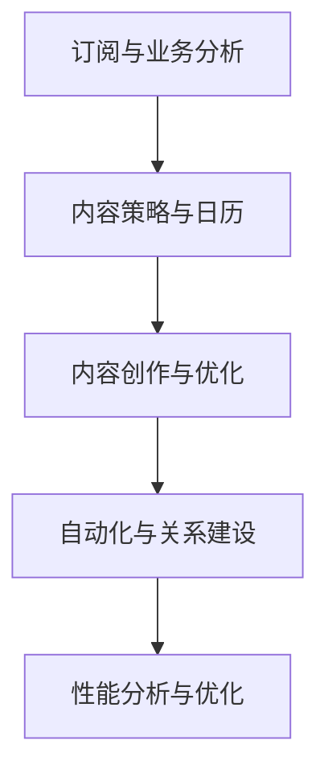

图表来源
- [marketing-wechat-official-account.md:58-93](file://marketing/marketing-wechat-official-account.md#L58-L93)

章节来源
- [marketing-wechat-official-account.md:9-146](file://marketing/marketing-wechat-official-account.md#L9-L146)

### 微博策略师
- 决策框架：账号定位与人设—热点话题运营—超级话题管理—内容策略—KOL 合作—广告与性能优化—数据复盘与迭代。
- 成功度量：品牌话题曝光、互动率、热点上榜、负面响应时效、粉丝隧道 CPE、KOL 效能、粉丝净增。

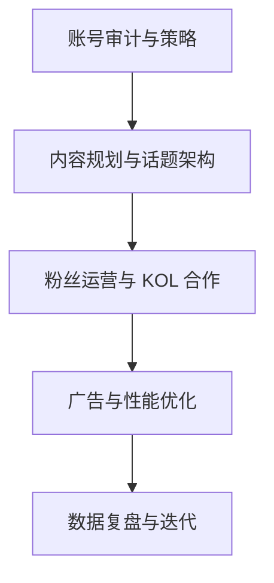

图表来源
- [marketing-weibo-strategist.md:198-224](file://marketing/marketing-weibo-strategist.md#L198-L224)

章节来源
- [marketing-weibo-strategist.md:9-241](file://marketing/marketing-weibo-strategist.md#L9-L241)

### 小红书专家
- 决策框架：品牌生活方式定位—内容策略与日历—内容创作与优化—社区建设与增长—性能分析与规模化。
- 成功度量：互动率、评论质量、分享率、收藏率、粉丝增长、点击率、病毒内容、转化影响、品牌情感。

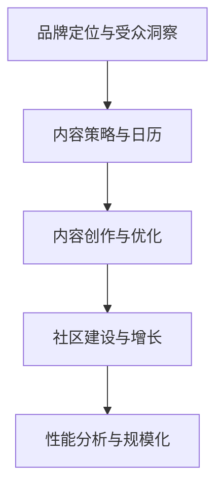

图表来源
- [marketing-xiaohongshu-specialist.md:55-86](file://marketing/marketing-xiaohongshu-specialist.md#L55-L86)

章节来源
- [marketing-xiaohongshu-specialist.md:9-139](file://marketing/marketing-xiaohongshu-specialist.md#L9-L139)

### 知乎策略师
- 决策框架：主题与权威定位—问题识别与回答策略—高质量内容创作—专栏建设与权威积累—关系建设与放大—性能分析与优化。
- 成功度量：回答点赞率、可见度、最佳回答率、浏览量、专栏增长、互动率、粉丝增长、线索生成、业务影响。

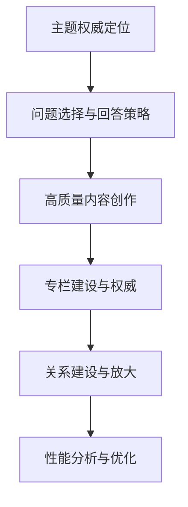

图表来源
- [marketing-zhihu-strategist.md:62-103](file://marketing/marketing-zhihu-strategist.md#L62-L103)

章节来源
- [marketing-zhihu-strategist.md:9-163](file://marketing/marketing-zhihu-strategist.md#L9-L163)

### 播客策略师
- 决策框架：节目诊断与定位—内容规划与准备—制作与发布—推广与增长—数据复盘与迭代。
- 成功度量：播放量、完播率、评论互动、订阅增长、听众留存、品牌合作满意度、榜单排名。

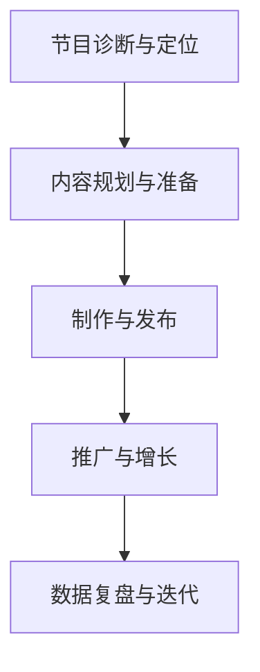

图表来源
- [marketing-podcast-strategist.md:228-262](file://marketing/marketing-podcast-strategist.md#L228-L262)

章节来源
- [marketing-podcast-strategist.md:9-278](file://marketing/marketing-podcast-strategist.md#L9-L278)

### 直播电商教练
- 决策框架：直播间诊断与定位—脚本系统与主播训练—产品编排与场控—流量策略设计与执行—实时监控与优化。
- 成功度量：平均观看时长、互动率、GPM、自然流量占比、Qianchuan ROI、商品点击率、支付转化率、粉丝转化率、GMV 增速、退换货率。

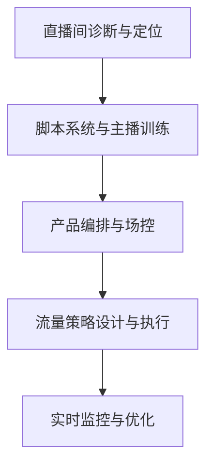

图表来源
- [marketing-livestream-commerce-coach.md:250-286](file://marketing/marketing-livestream-commerce-coach.md#L250-L286)

章节来源
- [marketing-livestream-commerce-coach.md:9-306](file://marketing/marketing-livestream-commerce-coach.md#L9-L306)

### 视频优化专家
- 决策框架：研究与发现—包装构思—结构大纲—元数据优化。
- 成功度量：CTR、3 分钟留存、频道 AVD、订阅转化、搜索流量、推荐流量、首日表现。

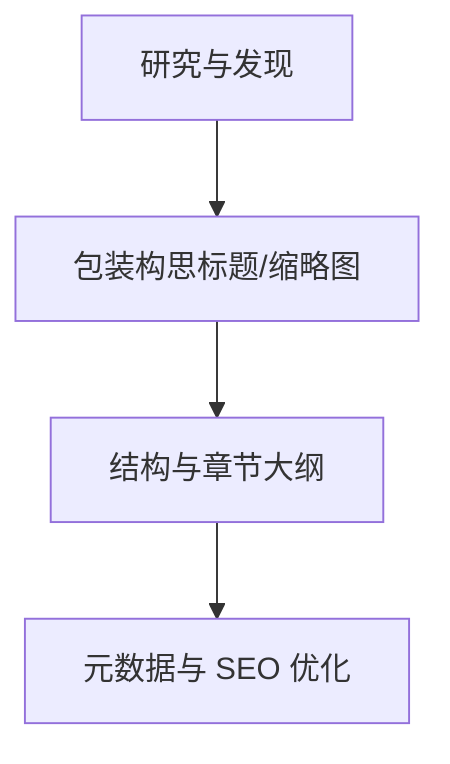

图表来源
- [marketing-video-optimization-specialist.md:81-102](file://marketing/marketing-video-optimization-specialist.md#L81-L102)

章节来源
- [marketing-video-optimization-specialist.md:9-120](file://marketing/marketing-video-optimization-specialist.md#L9-L120)

## 依赖关系分析
- 职责耦合与协作
  - 内容创作者是上游内容源，社交媒体策略师负责跨平台分发与社区运营，增长黑客负责实验与归因，SEO 专家保障搜索可见性，直播电商教练与短视频策略师负责私域与公域流量联动。
  - 各平台代理在“内容—传播—转化—增长”链条中承担不同节点，彼此通过“交付物—归因—反馈—迭代”的闭环协同。
- 外部依赖与接口
  - 各代理均强调“数据驱动”，依赖平台分析工具（如搜索控制台、社交平台分析、广告平台数据）与第三方工具（如视频分析、直播数据看板）进行归因与优化。
- 潜在循环依赖
  - 代理间通过“工作流交接”与“归因报告”形成单向依赖，未见明显循环依赖风险。

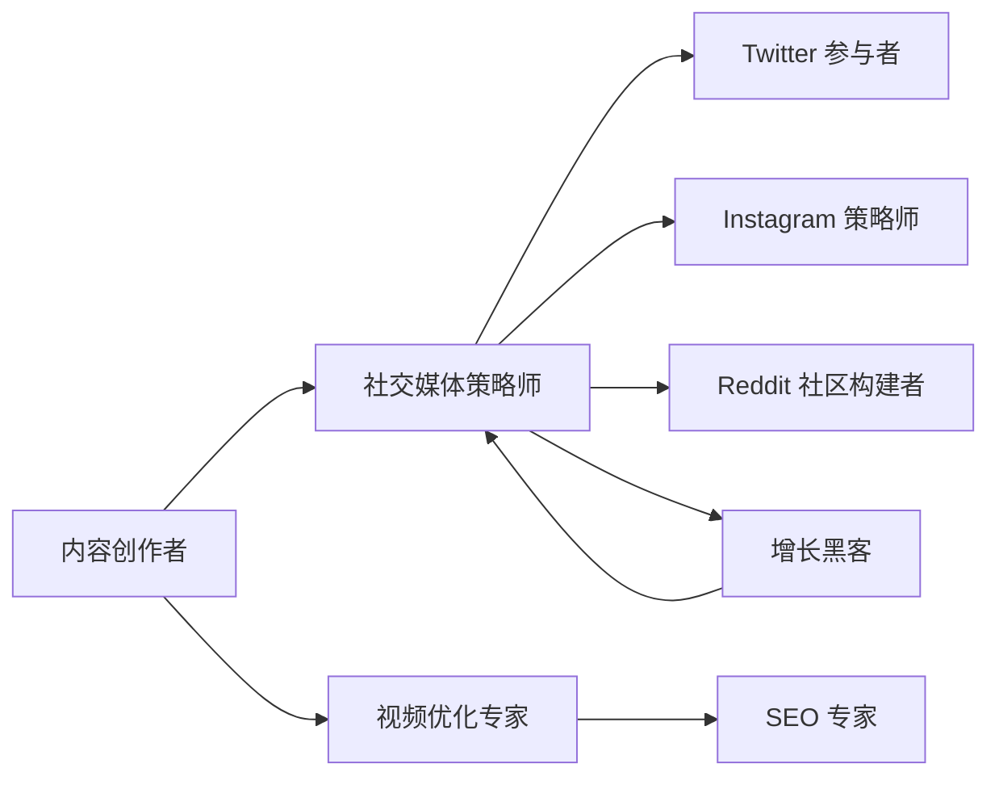

图表来源
- [marketing-content-creator.md:10-54](file://marketing/marketing-content-creator.md#L10-L54)
- [marketing-social-media-strategist.md:10-126](file://marketing/marketing-social-media-strategist.md#L10-L126)
- [marketing-twitter-engager.md:9-126](file://marketing/marketing-twitter-engager.md#L9-L126)
- [marketing-instagram-curator.md:9-113](file://marketing/marketing-instagram-curator.md#L9-L113)
- [marketing-reddit-community-builder.md:9-123](file://marketing/marketing-reddit-community-builder.md#L9-L123)
- [marketing-video-optimization-specialist.md:9-120](file://marketing/marketing-video-optimization-specialist.md#L9-L120)
- [marketing-seo-specialist.md:10-280](file://marketing/marketing-seo-specialist.md#L10-L280)
- [marketing-growth-hacker.md:10-54](file://marketing/marketing-growth-hacker.md#L10-L54)

章节来源
- [marketing-social-media-strategist.md:10-126](file://marketing/marketing-social-media-strategist.md#L10-L126)
- [marketing-growth-hacker.md:10-54](file://marketing/marketing-growth-hacker.md#L10-L54)

## 性能考量
- 归因与数据质量
  - 建议统一使用“多触点归因模型”，结合平台原生分析与第三方归因工具，确保跨渠道数据一致性与可比性。
- 实验设计与统计稳健性
  - 增长黑客应坚持“最小可行实验”，明确对照组与样本量，避免多重比较偏差；对关键指标设置显著性阈值与最小可检测差异。
- 平台算法与合规
  - 各平台算法优先级不同（如抖音以完播率为主、微博以转发评论为主），需据此调整内容结构与互动策略；严格遵守平台合规红线，避免违规导致的流量惩罚。
- 内容与体验一致性
  - 跨平台内容需保持品牌调性一致，同时适配平台特性（如 TikTok 的竖屏与节奏、Instagram 的视觉美学、微博的互动文化）。

## 故障排查指南
- 常见问题与处理思路
  - 自然流量停滞：检查技术健康度（爬取、索引、Core Web Vitals）、内容质量与结构化数据、关键词策略与意图匹配。
  - 互动率低：优化首三秒钩子、内容节奏与视觉打断、评论引导与互动提示；针对平台特性调整内容形式（如 TikTok 的挑战、Instagram 的故事）。
  - 转化率低：优化落地页/直播脚本的关键信息呈现、信任信号与紧迫感设计、商品编排与价格锚定。
  - 危机事件：建立“检测—评估—响应—跟踪”的快速响应机制，统一对外口径，及时澄清事实并引导正面讨论。
- 工具与流程建议
  - 使用统一的数据仪表盘（如周报/日报模板）追踪关键指标，定期复盘失败案例，沉淀可复制的优化动作。

章节来源
- [marketing-douyin-strategist.md:39-52](file://marketing/marketing-douyin-strategist.md#L39-L52)
- [marketing-weibo-strategist.md:74-87](file://marketing/marketing-weibo-strategist.md#L74-L87)
- [marketing-tiktok-strategist.md:23-30](file://marketing/marketing-tiktok-strategist.md#L23-L30)
- [marketing-instagram-curator.md:23-30](file://marketing/marketing-instagram-curator.md#L23-L30)
- [marketing-seo-specialist.md:25-37](file://marketing/marketing-seo-specialist.md#L25-L37)

## 结论
该数字营销代理体系以“内容—传播—转化—增长”为主线，通过多平台专业化代理与统一的数据驱动方法，实现从创意到效果的闭环管理。建议在实际执行中：
- 明确各代理的职责边界与协作流程；
- 建立标准化的交付物与度量体系；
- 强化跨平台归因与实验文化；
- 持续迭代策略，以数据驱动优化营销效果。

## 附录
- 多平台整合营销最佳实践
  - 统一品牌信息与价值观，针对不同平台定制内容形式与节奏；
  - 以内容为中心，结合社交互动、广告投放与私域运营，形成“公域引流—私域沉淀—复购转化”的闭环；
  - 建立跨平台归因模型，量化每条渠道的贡献，动态调整预算分配；
  - 定期进行竞品与趋势分析，保持内容与策略的敏捷迭代。