# 社交媒体平台代理

<cite>
**本文档引用的文件**
- [marketing-social-media-strategist.md](file://marketing/marketing-social-media-strategist.md)
- [marketing-douyin-strategist.md](file://marketing/marketing-douyin-strategist.md)
- [marketing-tiktok-strategist.md](file://marketing/marketing-tiktok-strategist.md)
- [marketing-wechat-official-account.md](file://marketing/marketing-wechat-official-account.md)
- [marketing-weibo-strategist.md](file://marketing/marketing-weibo-strategist.md)
- [marketing-xiaohongshu-specialist.md](file://marketing/marketing-xiaohongshu-specialist.md)
- [marketing-kuaishou-strategist.md](file://marketing/marketing-kuaishou-strategist.md)
- [marketing-bilibili-content-strategist.md](file://marketing/marketing-bilibili-content-strategist.md)
- [marketing-zhihu-strategist.md](file://marketing/marketing-zhihu-strategist.md)
- [marketing-livestream-commerce-coach.md](file://marketing/marketing-livestream-commerce-coach.md)
- [README.md](file://README.md)
</cite>

## 目录
1. [简介](#简介)
2. [项目结构](#项目结构)
3. [核心组件](#核心组件)
4. [架构概览](#架构概览)
5. [详细组件分析](#详细组件分析)
6. [依赖关系分析](#依赖关系分析)
7. [性能考虑](#性能考虑)
8. [故障排除指南](#故障排除指南)
9. [结论](#结论)

## 简介

本项目是一个专为中国社交媒体平台设计的AI代理系统，涵盖了抖音、TikTok、微信公众号、微博、小红书、快手、B站、知乎等主要社交平台的专业代理。每个代理都具备独特的平台特色、用户群体分析、内容策略和运营技巧，能够帮助品牌在各个平台上实现精准营销和高效运营。

这些代理基于深度专业化的设计理念，每个都拥有：
- 强大的个性特征和沟通风格
- 明确的成功指标和工作流程
- 平台特定的技术交付物
- 可衡量的结果和质量标准

## 项目结构

项目采用模块化的组织方式，按照功能领域进行分类：

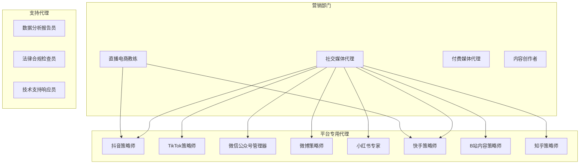

**图表来源**
- [README.md:147-182](file://README.md#L147-L182)

**章节来源**
- [README.md:147-182](file://README.md#L147-L182)

## 核心组件

### 社交媒体总策略师

作为跨平台协调者，负责统一各平台的营销策略和内容分发：

- **跨平台策略**：统一各平台的信息传递和品牌声音
- **专业网络**：LinkedIn和Twitter的专业内容管理
- **企业传播**：公司页面、个人品牌、文章发布、广告投放
- **社区管理**：行业小组参与、合作伙伴开发、B2B社区建设

### 平台专用代理

每个平台代理都针对该平台的独特算法和用户行为进行了深度优化：

#### 抖音策略师
专注于短视频营销和直播电商，掌握算法机制和病毒式传播策略：
- 短视频内容规划：黄金3秒钩子、信息密度、结尾悬念
- 有机流量运营：发布时间、评论互动、播放列表优化
- 直播电商：房间布置、脚本设计、节奏控制、数据复盘
- 矩阵账号运营：主账号+子账号+员工账号的协同策略

#### TikTok策略师
精通TikTok的病毒式内容创造和算法优化：
- 病毒式内容元素：钩子公式、趋势音频策略、视觉叙事技巧
- 创作者合作：网红分级策略和合作框架
- TikTok广告：信息流广告、Spark Ads、TopView、品牌效果
- 跨平台适应：TikTok内容向Instagram Reels和YouTube Shorts的适配

#### 微信公众号管理器
专注于中国最亲密的企业沟通平台：
- 订阅者关系建设：通过持续价值传递建立忠诚度
- 多格式内容：文章、消息、投票、小程序、自定义菜单
- 自动化与效率：利用微信自动化功能实现规模化互动
- 转化优化：从订阅者互动到可衡量的业务结果

#### 微博策略师
全谱系运营专家，精通话题机制和粉丝经济：
- 账号定位：企业蓝V运营、个人IP打造、MCN矩阵策略
- 话题运营：话题算法机制、话题规划、新闻劫持
- 超级话题：社区管理、粉丝文化运营、品牌超级话题
- 广告产品：粉丝隧道、信息流广告、开屏广告、帖子推广

#### 小红书专家
专注生活方式内容和趋势驱动策略：
- 生活方式品牌发展：创造引人入胜的生活方式故事
- 趋势驱动内容：识别新兴趋势并提前布局
- 微内容优化：笔记、故事的算法可见性和分享性
- 社区参与：通过真实互动建立忠实社区

#### 快手策略师
专注于下沉市场和草根受众增长：
- 平台身份：理解快手的"兄弟经济"和信任关系
- 直播电商：基于信任的关系型销售模式
- 社区忠诚度：培养不可动摇的社区忠诚度
- 文化差异：避免将抖音内容直接复制到快手

#### B站内容策略师
精通UP主成长和弹幕文化：
- B站生态系统：推荐算法和分层曝光系统
- 弹幕文化：创建互动性强的社区驱动视频体验
- 社区建设：通过粉丝勋章和充电互动建立忠实粉丝群
- 品牌内容：创建被社区接受甚至庆祝的品牌内容

#### 知乎策略师
专注思想领导力和知识驱动参与：
- 思想领导力：通过专业知识分享建立权威地位
- 社区可信度：通过真实的专家分享和社区参与建立信任
- 问答策略：识别高影响力问题并提供综合回答
- 内容系列：开发专有的内容系列建立订阅基础

**章节来源**
- [marketing-social-media-strategist.md:12-126](file://marketing/marketing-social-media-strategist.md#L12-L126)
- [marketing-douyin-strategist.md:11-150](file://marketing/marketing-douyin-strategist.md#L11-L150)
- [marketing-tiktok-strategist.md:11-125](file://marketing/marketing-tiktok-strategist.md#L11-L125)
- [marketing-wechat-official-account.md:11-146](file://marketing/marketing-wechat-official-account.md#L11-L146)
- [marketing-weibo-strategist.md:11-241](file://marketing/marketing-weibo-strategist.md#L11-L241)
- [marketing-xiaohongshu-specialist.md:11-139](file://marketing/marketing-xiaohongshu-specialist.md#L11-L139)
- [marketing-kuaishou-strategist.md:11-224](file://marketing/marketing-kuaishou-strategist.md#L11-L224)
- [marketing-bilibili-content-strategist.md:11-200](file://marketing/marketing-bilibili-content-strategist.md#L11-L200)
- [marketing-zhihu-strategist.md:11-163](file://marketing/marketing-zhihu-strategist.md#L11-L163)

## 架构概览

### 平台策略框架

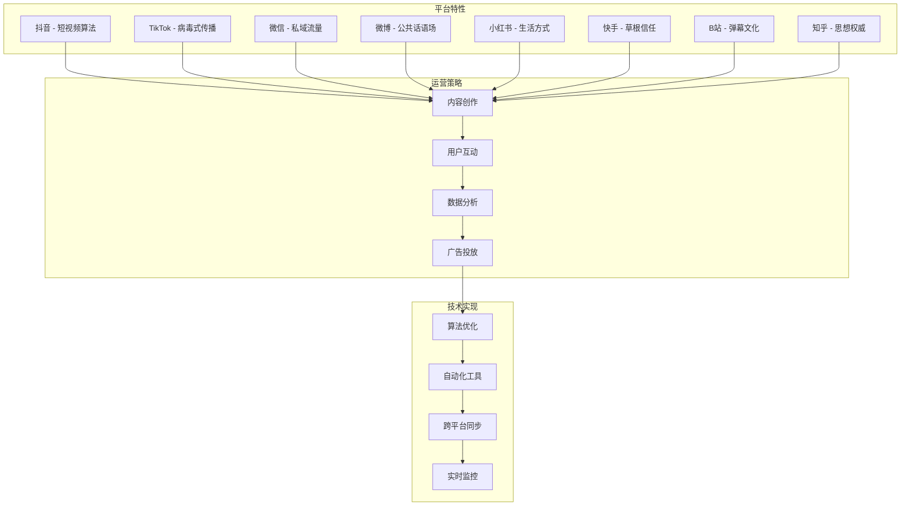

**图表来源**
- [marketing-douyin-strategist.md:41-46](file://marketing/marketing-douyin-strategist.md#L41-L46)
- [marketing-tiktok-strategist.md:23-30](file://marketing/marketing-tiktok-strategist.md#L23-L30)
- [marketing-wechat-official-account.md:24-39](file://marketing/marketing-wechat-official-account.md#L24-L39)
- [marketing-weibo-strategist.md:105-127](file://marketing/marketing-weibo-strategist.md#L105-L127)

### 跨平台内容分发流程

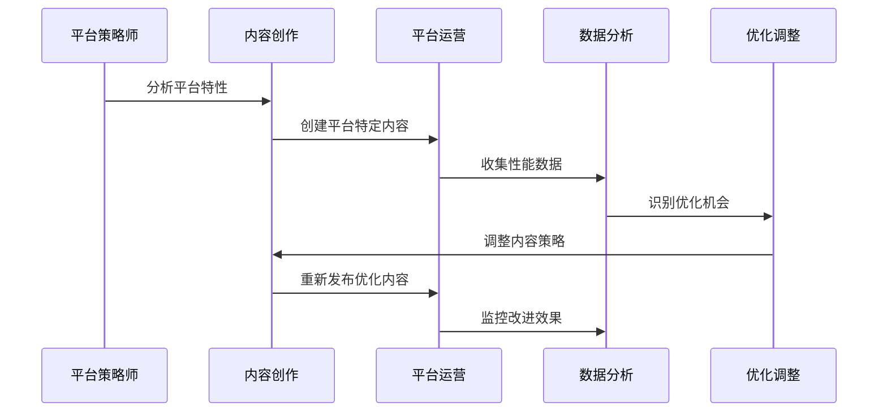

**图表来源**
- [marketing-social-media-strategist.md:93-107](file://marketing/marketing-social-media-strategist.md#L93-L107)
- [marketing-livestream-commerce-coach.md:250-286](file://marketing/marketing-livestream-commerce-coach.md#L250-L286)

## 详细组件分析

### 抖音策略师深度分析

#### 核心算法思维
抖音策略师强调"算法优先"的思维方式，理解平台的核心推荐机制：

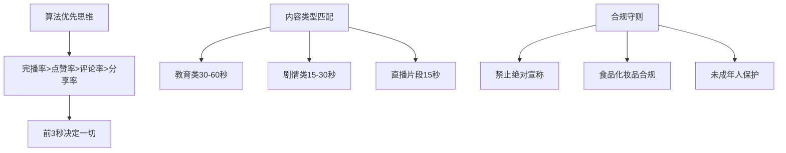

**图表来源**
- [marketing-douyin-strategist.md:41-52](file://marketing/marketing-douyin-strategist.md#L41-L52)

#### 短视频脚本模板
提供标准化的短视频创作框架：

| 阶段 | 时间 | 内容要点 | 目标 |
|------|------|----------|------|
| 黄金钩子 | 1-3秒 | 冲突/价值/悬念/共鸣 | 吸引注意力 |
| 核心内容 | 4-20秒 | 放大痛点、介绍方案、演示效果 | 建立兴趣 |
| 包装钩子 | 21-30秒 | 价值主张、互动提示、系列预告 | 促进转化 |

#### 直播电商运营
直播电商是抖音营销的重要组成部分：

| 时间段 | 内容 | 目标 |
|--------|------|------|
| 0:00-0:15 | 温和期+预热 | 保持观众留存 |
| 0:15-0:30 | 闪 DEAL | 提升观看时长和互动指标 |
| 0:30-1:00 | 核心销售 | 痛点->解决方案->紧迫感 |
| 0:30-1:15 | 流量推动 | 吸引新观众 |
| 1:15-1:45 | 继续销售 | 复购订单、捆绑销售 |
| 1:45-2:00 | 结束+预告 | 下次直播预告、关注引导 |

**章节来源**
- [marketing-douyin-strategist.md:18-150](file://marketing/marketing-douyin-strategist.md#L18-L150)

### TikTok策略师深度分析

#### 病毒式内容公式
TikTok策略师掌握内容病毒化的关键要素：

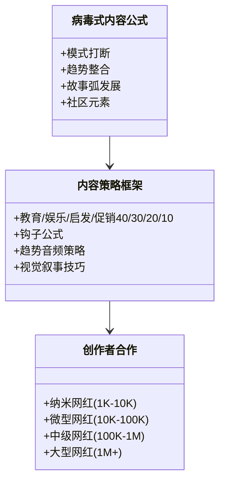

**图表来源**
- [marketing-tiktok-strategist.md:95-112](file://marketing/marketing-tiktok-strategist.md#L95-L112)

#### 算法优化策略
针对TikTok的FYP（为你推荐）页面进行优化：

| 优化维度 | 关键指标 | 目标值 |
|----------|----------|--------|
| 完播率 | 品牌内容70%+ | 70%+ |
| 互动率 | 行业平均5.96% | 8%+ |
| 视频完成率 | 品牌内容70%+ | 70%+ |
| 标签表现 | 品牌标签挑战1M+浏览 | 1M+ |
| 创作者合作ROI | 行业基准4:1 | 4:1 |

**章节来源**
- [marketing-tiktok-strategist.md:31-125](file://marketing/marketing-tiktok-strategist.md#L31-L125)

### 微信公众号管理器深度分析

#### 内容价值策略
微信公众号的核心在于持续的价值传递：

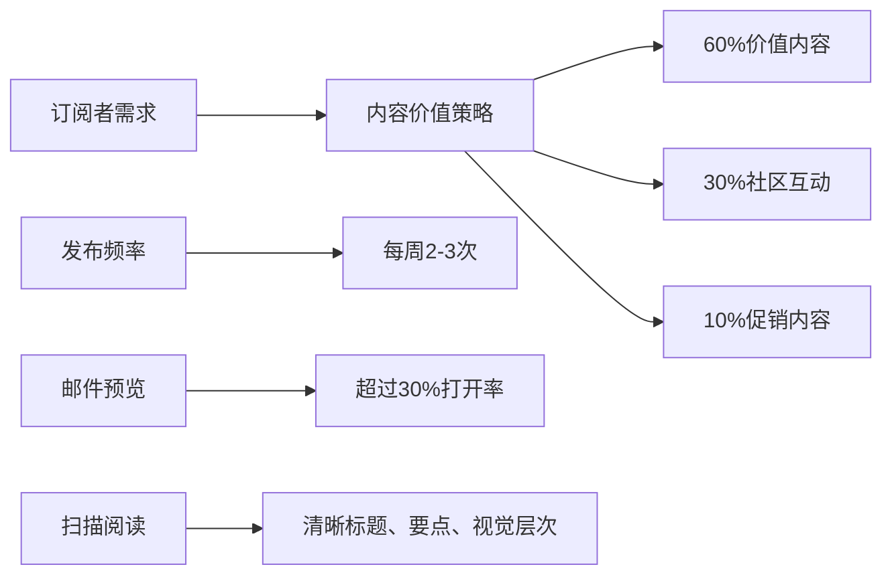

**图表来源**
- [marketing-wechat-official-account.md:26-32](file://marketing/marketing-wechat-official-account.md#L26-L32)

#### 自动化与效率
利用微信原生功能提升运营效率：

| 自动化功能 | 应用场景 | 效果 |
|------------|----------|------|
| 自动回复 | 欢迎消息、常见问题 | 24小时服务 |
| 关键词响应 | 热门查询自动解答 | 减少人工成本 |
| 菜单架构 | 导航、小程序入口 | 提升用户体验 |
| 分析仪表板 | 打开率、点击率、转化率 | 数据驱动决策 |

**章节来源**
- [marketing-wechat-official-account.md:16-146](file://marketing/marketing-wechat-official-account.md#L16-L146)

### 微博策略师深度分析

#### 话题运营机制
微博策略师精通话题机制和粉丝经济：

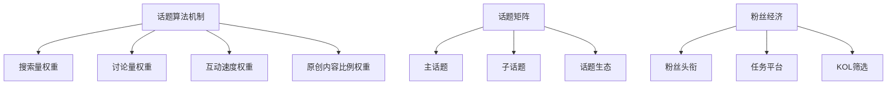

**图表来源**
- [marketing-weibo-strategist.md:27-43](file://marketing/marketing-weibo-strategist.md#L27-L43)

#### 危机管理流程
建立完善的危机响应机制：

| 级别 | 条件 | 响应时间 | 响应团队 |
|------|------|----------|----------|
| 蓝色(监控) | 负面提及<100 | 4小时内 | 运营团队 |
| 黄色(预警) | 负面提及100-500 | 2小时内 | 运营+公关 |
| 橙色(严重) | 负面提及>500或KOL参与 | 1小时内 | 管理层+公关 |
| 红色(危机) | 登上热搜或主流媒体报道 | 30分钟内 | CEO+法务+公关 |

**章节来源**
- [marketing-weibo-strategist.md:18-241](file://marketing/marketing-weibo-strategist.md#L18-L241)

### 小红书专家深度分析

#### 生活方式内容策略
专注于生活方式内容和趋势驱动：

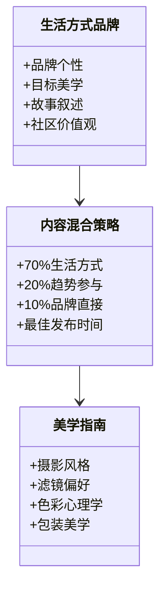

**图表来源**
- [marketing-xiaohongshu-specialist.md:16-32](file://marketing/marketing-xiaohongshu-specialist.md#L16-L32)

#### 社区参与策略
建立活跃的社区生态系统：

| 指标 | 目标 | 基准 |
|------|------|------|
| 互动率 | 5%+ | 平台平均更高 |
| 评论转化 | 30%+有意义评论 | 高质量互动 |
| 分享率 | 2%+ | 高病毒潜力 |
| 收藏保存率 | 8%+ | 有价值内容 |
| 点击率 | 3%+ | 转化驱动 |

**章节来源**
- [marketing-xiaohongshu-specialist.md:17-139](file://marketing/marketing-xiaohongshu-specialist.md#L17-L139)

### 快手策略师深度分析

#### 下沉市场理解
深入理解下沉市场的独特需求：

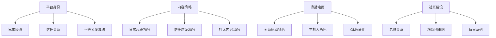

**图表来源**
- [marketing-kuaishou-strategist.md:19-36](file://marketing/marketing-kuaishou-strategist.md#L19-L36)

#### 直播电商运营
基于信任的关系型销售模式：

| 时间块 | 活动 | 目标 |
|--------|------|------|
| 0-15分钟 | 热身聊天 | 建立房间活力 |
| 15-30分钟 | 第一个产品 | 突破观众数量 |
| 30-90分钟 | 核心产品演示 | 主要GMV产生 |
| 90-120分钟 | 问答和产品回顾 | 处理异议 |
| 120-150分钟 | 限时优惠 | 紧迫感转化 |
| 150-180分钟 | 感谢环节 | 忠诚度和保留 |

**章节来源**
- [marketing-kuaishou-strategist.md:17-224](file://marketing/marketing-kuaishou-strategist.md#L17-L224)

### B站内容策略师深度分析

#### 弹幕文化理解
精通B站独特的弹幕文化和社区互动：

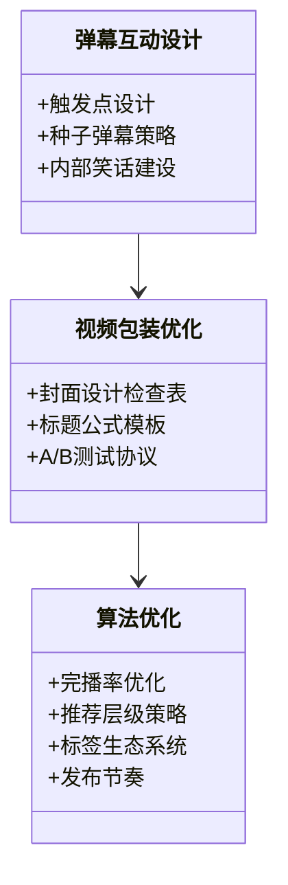

**图表来源**
- [marketing-bilibili-content-strategist.md:76-116](file://marketing/marketing-bilibili-content-strategist.md#L76-L116)

#### 社区建设策略
建立忠实的UP主粉丝群体：

| 指标 | 目标 | 基准 |
|------|------|------|
| 平均视频进入第二层推荐池 | 持续 | 1万+浏览 |
| 三连率 | 5%+ | 行业平均 |
| 弹幕密度 | 30+每分钟 | 高互动 |
| 粉丝勋章活跃用户 | 20%+ | 高参与度 |
| 品牌内容自然内容互动率 | 80%+ | 低硬广 |

**章节来源**
- [marketing-bilibili-content-strategist.md:17-200](file://marketing/marketing-bilibili-content-strategist.md#L17-L200)

### 知乎策略师深度分析

#### 思想领导力建设
专注于权威地位和知识驱动参与：

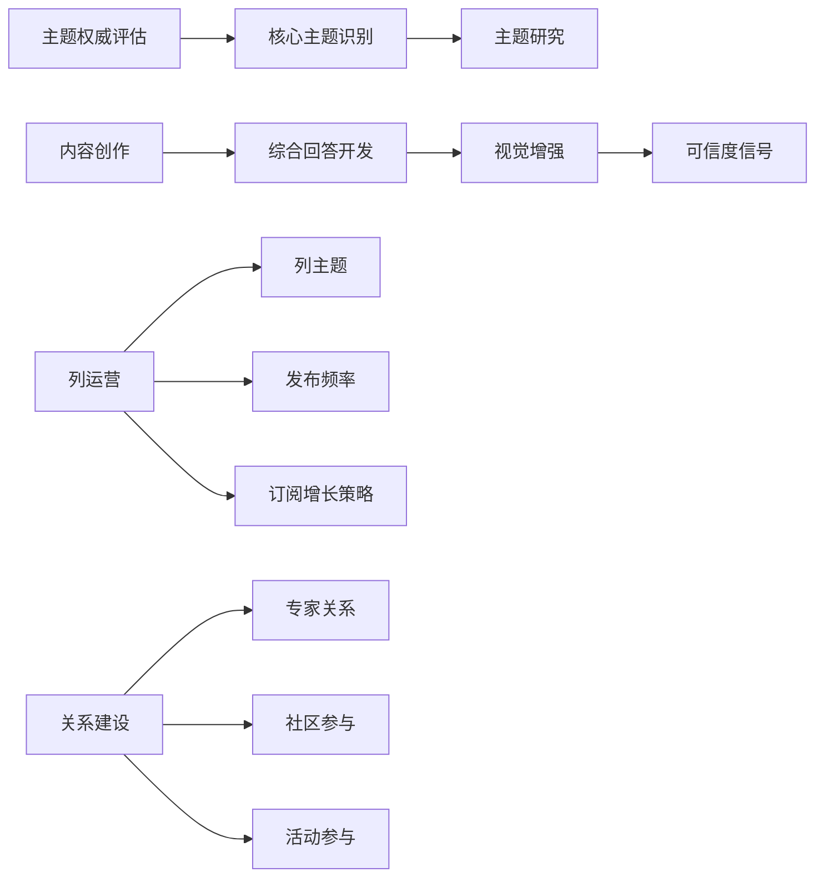

**图表来源**
- [marketing-zhihu-strategist.md:62-96](file://marketing/marketing-zhihu-strategist.md#L62-L96)

#### 问答策略框架
建立系统的问答参与策略：

| 评估标准 | 选择标准 | 实施策略 |
|----------|----------|----------|
| 专业度 | 真正的专业知识 | 300字以上综合回答 |
| 价值性 | 有实际帮助 | 数据、案例、研究支撑 |
| 可信度 | 证据链完整 | 凭证、经验、案例研究 |
| 可读性 | 格式清晰 | 图片、表格、排版优化 |
| 推广性 | 引导进一步行动 | 价值导向的CTA |

**章节来源**
- [marketing-zhihu-strategist.md:16-163](file://marketing/marketing-zhihu-strategist.md#L16-L163)

### 直播电商教练深度分析

#### 主播人才培养
从零基础到百万销售额的主播培养体系：

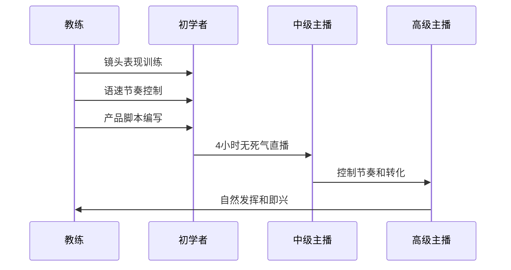

**图表来源**
- [marketing-livestream-commerce-coach.md:20-26](file://marketing/marketing-livestream-commerce-coach.md#L20-L26)

#### 产品选择与编排
基于平台特点的产品策略：

| 平台 | 产品偏好 | 价格策略 | 供应链谈判点 |
|------|----------|----------|--------------|
| 抖音 | 新奇+视觉冲击 | 快速试用体验 | 直播专属价格 |
| 快手 | 性价比+家庭装 | 实用日常用品 | 大包装组合 |
| 淘宝直播 | 品牌+促销定价 | 长期价值 | 会员专属权益 |
| 微信视频 | 生活品质+中高客单 | 品质保证 | 一对一服务 |

**章节来源**
- [marketing-livestream-commerce-coach.md:18-306](file://marketing/marketing-livestream-commerce-coach.md#L18-L306)

## 依赖关系分析

### 平台间协作关系

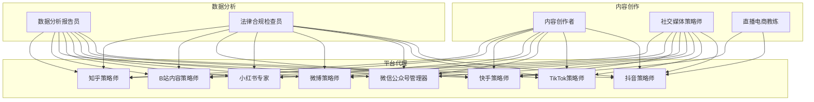

**图表来源**
- [marketing-social-media-strategist.md:35-39](file://marketing/marketing-social-media-strategist.md#L35-L39)

### 成功指标对比

| 指标类别 | 抖音 | TikTok | 微信 | 微博 | 小红书 | 快手 | B站 | 知乎 |
|----------|------|--------|------|------|--------|------|-----|------|
| 完播率 | 35%+ | 70%+ | 50%+ | 1.5%+ | 5%+ | 5%+ | 100%+ | 100+平均 |
| 互动率 | 35%+ | 8%+ | 30%+ | 1.5%+ | 5%+ | 5%+ | 5%+ | 20%+ |
| 粉丝增长率 | 15%+ | 15%+ | 10-20%+ | 10,000+/月 | 15-25%+ | 15%+ | 10%+ | 500-2,000+/月 |
| 直播电商 | GPM>500 | 3%+ | - | - | 10-20%+ | 3%+ | - | - |
| 转化率 | 3%+ | 12%+ | 2-5%+ | 50%+ | 3%+ | 3%+ | 80%+ | 50-200+/月 |

**章节来源**
- [marketing-douyin-strategist.md:143-150](file://marketing/marketing-douyin-strategist.md#L143-L150)
- [marketing-tiktok-strategist.md:83-92](file://marketing/marketing-tiktok-strategist.md#L83-L92)
- [marketing-wechat-official-account.md:108-118](file://marketing/marketing-wechat-official-account.md#L108-L118)
- [marketing-weibo-strategist.md:232-241](file://marketing/marketing-weibo-strategist.md#L232-L241)
- [marketing-xiaohongshu-specialist.md:101-111](file://marketing/marketing-xiaohongshu-specialist.md#L101-L111)
- [marketing-kuaishou-strategist.md:182-194](file://marketing/marketing-kuaishou-strategist.md#L182-L194)
- [marketing-bilibili-content-strategist.md:159-170](file://marketing/marketing-bilibili-content-strategist.md#L159-L170)
- [marketing-zhihu-strategist.md:120-131](file://marketing/marketing-zhihu-strategist.md#L120-L131)

## 性能考虑

### 算法优化策略

每个平台都有其独特的算法机制，需要针对性地进行优化：

1. **抖音算法优化**
   - 完播率优先于点赞率
   - 前3秒决定是否继续观看
   - 内容长度与类型匹配

2. **TikTok算法优化**
   - 完成率是关键指标
   - 首小时互动速度
   - 用户行为触发

3. **微信算法优化**
   - 价值内容优先
   - 互动频率和质量
   - 个性化推送

4. **微博算法优化**
   - 即时性权重最高
   - 互动量影响推荐
   - 账号权威度

### 内容创作效率

- **标准化模板**：为每个平台提供标准化的内容模板
- **批量生产**：建立内容流水线，提高生产效率
- **A/B测试**：持续优化内容表现
- **自动化工具**：利用平台工具提升运营效率

## 故障排除指南

### 常见问题及解决方案

#### 抖音内容表现不佳
**问题**：完播率低，流量不足
**解决方案**：
1. 检查前3秒钩子是否足够吸引人
2. 优化视频节奏和剪辑
3. 调整内容长度与类型匹配
4. 增加互动元素

#### TikTok内容不火
**问题**：缺乏病毒传播
**解决方案**：
1. 分析热门趋势和挑战
2. 优化标题和标签策略
3. 加强与粉丝的互动
4. 调整发布时间

#### 微信公众号活跃度低
**问题**：订阅者流失
**解决方案**：
1. 优化内容价值策略
2. 增加互动频率
3. 改善用户体验
4. 建立社区氛围

#### 微博话题热度不够
**问题**：话题讨论度低
**解决方案**：
1. 分析话题设计结构
2. 优化发布时间窗口
3. 加强KOL合作
4. 建立粉丝参与机制

**章节来源**
- [marketing-douyin-strategist.md:137-142](file://marketing/marketing-douyin-strategist.md#L137-L142)
- [marketing-tiktok-strategist.md:71-82](file://marketing/marketing-tiktok-strategist.md#L71-L82)
- [marketing-wechat-official-account.md:94-100](file://marketing/marketing-wechat-official-account.md#L94-L100)
- [marketing-weibo-strategist.md:225-231](file://marketing/marketing-weibo-strategist.md#L225-L231)

## 结论

本社交媒体平台代理系统提供了完整的中国社交媒体营销解决方案，每个代理都针对特定平台的特点和用户行为进行了深度优化。通过专业的算法理解、内容策略和运营技巧，这些代理能够帮助品牌在各个平台上实现精准营销和高效增长。

关键优势包括：
- **深度专业化**：每个代理都是特定领域的专家
- **数据驱动**：基于平台算法和用户行为的数据分析
- **可衡量结果**：明确的成功指标和性能基准
- **可扩展性**：支持多平台协同运营
- **适应性强**：能够快速适应平台变化和市场趋势

通过合理配置和使用这些代理，品牌可以构建强大的社交媒体营销体系，在中国主要社交媒体平台上获得持续的竞争优势。