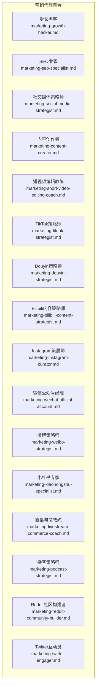
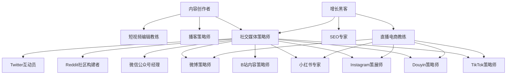
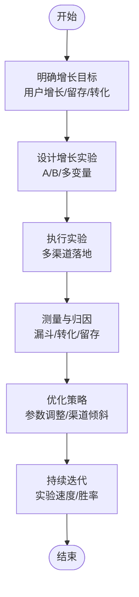
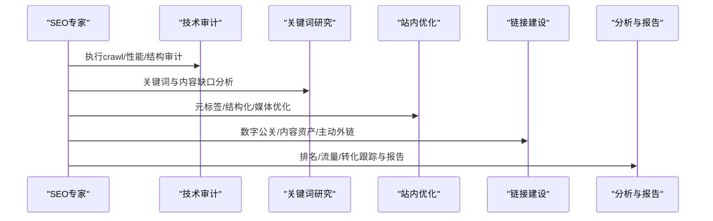
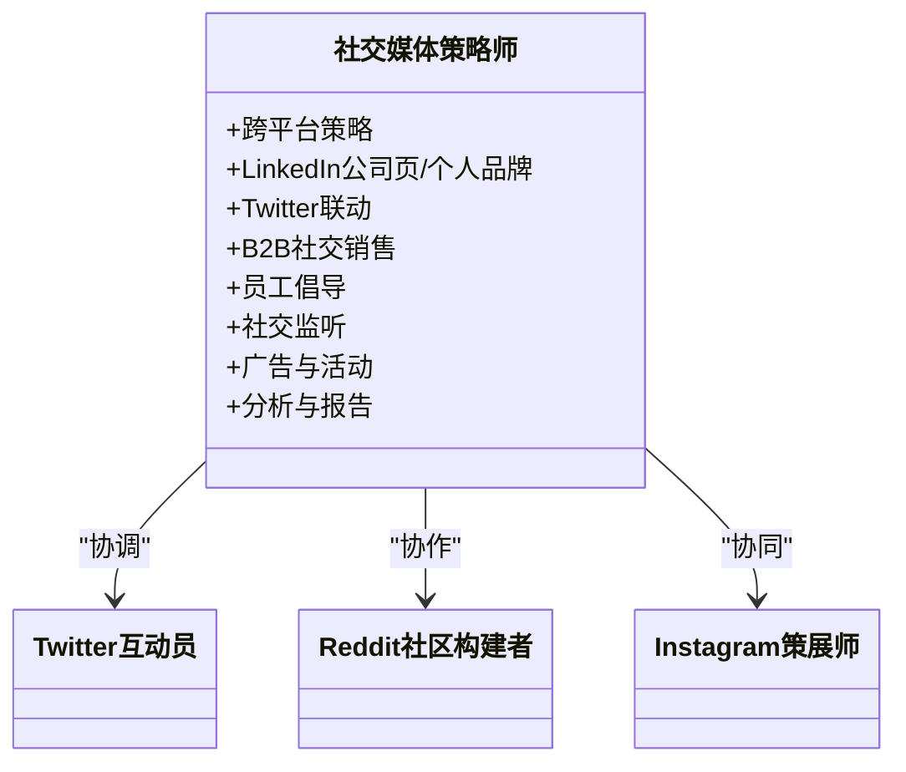
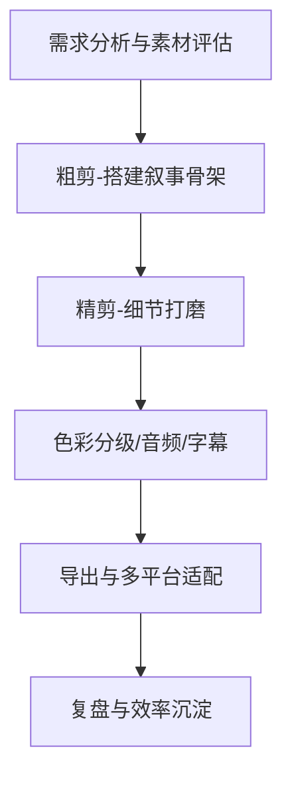
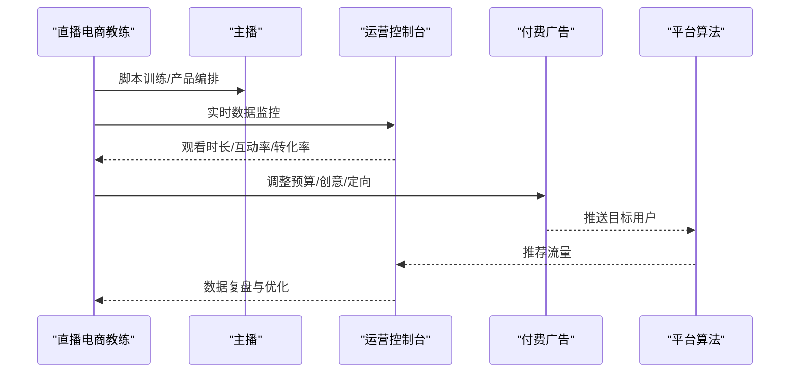
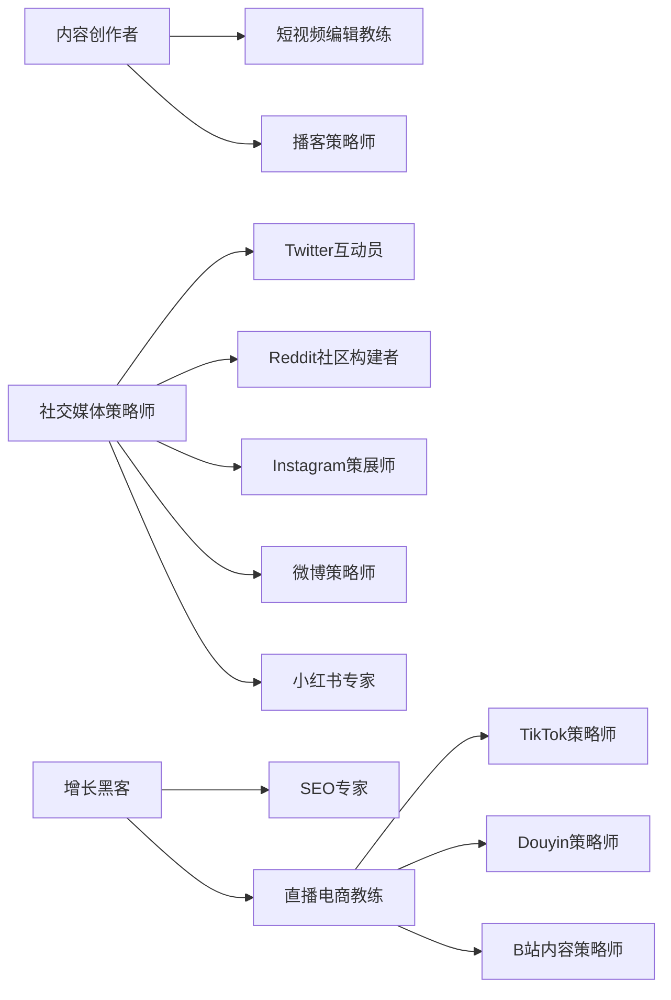

# 营销代理

<cite>
**本文引用的文件**
- [marketing-growth-hacker.md](file://marketing/marketing-growth-hacker.md)
- [marketing-seo-specialist.md](file://marketing/marketing-seo-specialist.md)
- [marketing-social-media-strategist.md](file://marketing/marketing-social-media-strategist.md)
- [marketing-content-creator.md](file://marketing/marketing-content-creator.md)
- [marketing-short-video-editing-coach.md](file://marketing/marketing-short-video-editing-coach.md)
- [marketing-tiktok-strategist.md](file://marketing/marketing-tiktok-strategist.md)
- [marketing-douyin-strategist.md](file://marketing/marketing-douyin-strategist.md)
- [marketing-bilibili-content-strategist.md](file://marketing/marketing-bilibili-content-strategist.md)
- [marketing-instagram-curator.md](file://marketing/marketing-instagram-curator.md)
- [marketing-wechat-official-account.md](file://marketing/marketing-wechat-official-account.md)
- [marketing-weibo-strategist.md](file://marketing/marketing-weibo-strategist.md)
- [marketing-xiaohongshu-specialist.md](file://marketing/marketing-xiaohongshu-specialist.md)
- [marketing-livestream-commerce-coach.md](file://marketing/marketing-livestream-commerce-coach.md)
- [marketing-podcast-strategist.md](file://marketing/marketing-podcast-strategist.md)
- [marketing-reddit-community-builder.md](file://marketing/marketing-reddit-community-builder.md)
- [marketing-twitter-engager.md](file://marketing/marketing-twitter-engager.md)
</cite>

## 目录
1. [引言](#引言)
2. [项目结构](#项目结构)
3. [核心组件](#核心组件)
4. [架构总览](#架构总览)
5. [详细组件分析](#详细组件分析)
6. [依赖关系分析](#依赖关系分析)
7. [性能考量](#性能考量)
8. [故障排查指南](#故障排查指南)
9. [结论](#结论)
10. [附录](#附录)

## 引言
本文件面向“营销代理”主题，系统梳理并阐述该代码库中已实现的17个专业化营销代理，覆盖增长黑客、SEO专家、社交媒体策略师、内容创作者、短视频编辑教练、各主流短视频平台（TikTok、Douyin、Bilibili、小红书）专家、社交平台（微博、Twitter、Instagram、微信公众号、Reddit）策略师与运营者，以及直播电商教练与播客策略师。文档从角色定位、核心能力、决策框架、成功指标、工作流程与技术交付物等维度进行深入解析，并给出跨渠道整合策略、效果测量与优化方法、品牌建设与客户获取的关键路径，帮助读者理解这些代理如何结合数据分析与创意内容实现营销目标。

## 项目结构
营销代理分布在marketing目录下，每个代理以独立Markdown文件呈现，采用一致的结构：角色名称、描述、工具清单、颜色与表情、气质语句、角色定义、核心能力、专业化技能、决策框架、成功指标、工作流程、沟通风格、学习与记忆、高级能力等。这种模块化组织便于按需调用与组合，形成“多代理协同”的营销自动化体系。

图表来源
- [marketing-growth-hacker.md:1-54](file://marketing/marketing-growth-hacker.md#L1-L54)
- [marketing-seo-specialist.md:1-280](file://marketing/marketing-seo-specialist.md#L1-L280)
- [marketing-social-media-strategist.md:1-126](file://marketing/marketing-social-media-strategist.md#L1-L126)
- [marketing-content-creator.md:1-54](file://marketing/marketing-content-creator.md#L1-L54)
- [marketing-short-video-editing-coach.md:1-413](file://marketing/marketing-short-video-editing-coach.md#L1-L413)
- [marketing-tiktok-strategist.md:1-125](file://marketing/marketing-tiktok-strategist.md#L1-L125)
- [marketing-douyin-strategist.md:1-150](file://marketing/marketing-douyin-strategist.md#L1-L150)
- [marketing-bilibili-content-strategist.md:1-200](file://marketing/marketing-bilibili-content-strategist.md#L1-L200)
- [marketing-instagram-curator.md:1-113](file://marketing/marketing-instagram-curator.md#L1-L113)
- [marketing-wechat-official-account.md:1-146](file://marketing/marketing-wechat-official-account.md#L1-L146)
- [marketing-weibo-strategist.md:1-241](file://marketing/marketing-weibo-strategist.md#L1-L241)
- [marketing-xiaohongshu-specialist.md:1-139](file://marketing/marketing-xiaohongshu-specialist.md#L1-L139)
- [marketing-livestream-commerce-coach.md:1-306](file://marketing/marketing-livestream-commerce-coach.md#L1-L306)
- [marketing-podcast-strategist.md:1-278](file://marketing/marketing-podcast-strategist.md#L1-L278)
- [marketing-reddit-community-builder.md:1-123](file://marketing/marketing-reddit-community-builder.md#L1-L123)
- [marketing-twitter-engager.md:1-126](file://marketing/marketing-twitter-engager.md#L1-L126)

章节来源
- [marketing-growth-hacker.md:1-54](file://marketing/marketing-growth-hacker.md#L1-L54)
- [marketing-seo-specialist.md:1-280](file://marketing/marketing-seo-specialist.md#L1-L280)
- [marketing-social-media-strategist.md:1-126](file://marketing/marketing-social-media-strategist.md#L1-L126)

## 核心组件
本节对17个营销代理的核心职责、能力矩阵与关键产出进行归纳，帮助快速建立“代理能力谱系”。

- 增长黑客
  - 专长：漏斗优化、A/B测试、病毒系数、产品市场契合、CAC/LTV优化、多渠道整合
  - 成功指标：月度有机增长≥20%、K因子>1.0、CAC回本周期<6个月、LTV:CAC≥3:1、激活率≥60%、留存率(7/30/90天)达标、实验速度≥10次/月、胜率≥30%

- SEO专家
  - 专长：技术SEO审计、内容策略、链接权威建设、SERP特性优化、搜索分析报告
  - 成功指标：自然流量同比增长≥50%、目标关键词Top3占比≥30%、技术健康分≥90%、Core Web Vitals全部达标、DA稳步提升、自然转化率≥3%、精选摘要捕获≥20%、内容ROI≥5:1

- 社交媒体策略师
  - 专长：跨平台统一策略、LinkedIn公司页/个人品牌、Twitter联动、B2B社交销售、员工倡导、社交监听
  - 成功指标：LinkedIn互动率≥3%（公司页）、5%+（个人品牌）、跨平台覆盖月增≥20%、内容达标率≥50%、线索贡献可衡量、员工倡导参与率≥30%、社交广告ROI≥3倍、声量份额上升

- 内容创作者
  - 专长：多格式创作、品牌叙事、SEO内容、视频脚本、播客策划、内容复用与跨平台优化
  - 成功指标：平均互动率≥25%、博客/网站自然流量增长≥40%、视频平均观看完成率≥70%、内容分享率≥15%、内容驱动线索增长≥300%、品牌提及增长≥50%、订阅/关注增长≥30%、内容ROI≥5:1

- 短视频编辑教练
  - 专长：剪辑软件精通、构图与镜头语言、色彩校正与分级、音频工程、动效与字幕、多平台导出、AI辅助编辑、效率工作流
  - 成功指标：单视频完成度高于品类均值1.5倍、视觉技术标准全满足、音频质量标准全满足、系列色彩风格一致、剪辑效率（模板化后）≤45分钟/3分钟视频、多平台适配、缩略图CTR高于品类均值、学员3个月内从“模板依赖”到“独立交付”

- TikTok策略师
  - 专长：病毒内容公式、算法优化、创作者合作、跨平台适配、广告策略
  - 成功指标：互动率≥8%、品牌内容观看完成率≥70%、品牌挑战≥100万浏览、创作者合作ROI≥4:1、自然关注增长率≥15%、品牌提及增长≥50%、点击至网站≥12%、直播购物转化≥3%

- Douyin策略师
  - 专长：算法优先思维、矩阵账号运营、DOU+投放、直播电商、流量运营
  - 成功指标：平均观看完成率>35%、单视频自然曝光>1万、直播GPM>500元、DOU+ ROI>1:3、月关注增长率>15%

- Bilibili内容策略师
  - 专长：弹幕文化、推荐算法、UP主成长、品牌内容本土化、直播与商业化
  - 成功指标：二层推荐池进入率高、三连率>5%、弹幕密度>30/min、舰长/提督/总督活跃粉丝≥20%、品牌内容与自然内容互动接近、月增关注>10%、至少1条视频进入每周必看或热门

- Instagram策展师
  - 专长：视觉品牌、多格式优化（图文/故事/Reels/IGTV/购物）、社区建设、社交电商
  - 成功指标：互动率≥3.5%、故事观看完成率≥80%、购物转化≥2.5%、品牌UGC≥200/月、真实粉丝占比≥90%、来自Instagram的网站流量≥20%

- 微信公众号经理
  - 专长：内容价值策略、订阅者关系、多格式内容、自动化与效率、转化优化
  - 成功指标：打开率≥30%、点击率≥5%、文章阅读完成率≥50%、月增关注10-20%、订阅者留存率≥95%、Mini Program激活率≥40%、生命周期订阅者价值≥10倍回报

- 微博策略师
  - 专长：热点话题机制、超级话题运营、粉丝经济、广告投放、舆情监控与危机沟通
  - 成功指标：品牌话题月曝光>5000万、官方账号互动率>1.5%、热点上榜≥3次/季度、负面响应时间<2小时、粉丝隧道CPE<1.5元、KOL合作内容互动≥行业基准2倍、月净增关注>1万

- 小红书专家
  - 专长：生活方式内容、趋势跟随、微内容优化、社区互动、转化策略
  - 成功指标：互动率≥5%、评论质量≥30%、分享率≥2%（月均）、收藏保存率≥8%、点击率≥3%、月增关注15-25%、每季度1-2篇破百万浏览、电商或应用流量转化10-20%

- 直播电商教练
  - 专长：主播训练、脚本设计、产品编排、付费vs自然流量平衡、实时数据优化
  - 成功指标：平均观看时长>1分钟、互动率>5%、GPM>800元、自然流量占比≥50%（成熟期）、Qianchuan整体ROI>2.5、商品点击率>10%、支付转化率>3%、会话GMV月增≥15%

- 播客策略师
  - 专长：节目定位、音频制作、受众增长、多平台分发、商业化
  - 成功指标：单集播放量≥5000（成长）/≥20000（成熟）、完整收听率>50%、Xiaoyuzhou评论数≥30/集、月增订阅≥500（成长）/≥2000（成熟）、听众留存（连续3集）>40%、品牌合作满意度>4.5/5、节目稳定进入目标类目前50

- Reddit社区构建者
  - 专长：价值驱动参与、长期关系建设、AMA策划、声誉管理
  - 成功指标：累计社区声望≥10000、教育/价值内容获赞率≥85%、平均每条评论获赞≥5、在5+相关子版获得“可信贡献者”认可、AMA提问/评论≥500、自Reddit引流自然流量增长≥15%

- Twitter互动员
  - 专长：实时参与、思想领袖、社区建设、危机管理、Spaces运营
  - 成功指标：互动率≥2.5%、2小时内回复率≥80%、教育/价值类主题帖转发≥100、月关注高质量增长≥10%、品牌提及增长≥50%、外部链接点击率≥8%、Spaces平均在线≥200、负面事件响应<30分钟

章节来源
- [marketing-growth-hacker.md:46-54](file://marketing/marketing-growth-hacker.md#L46-L54)
- [marketing-seo-specialist.md:239-248](file://marketing/marketing-seo-specialist.md#L239-L248)
- [marketing-social-media-strategist.md:52-61](file://marketing/marketing-social-media-strategist.md#L52-L61)
- [marketing-content-creator.md:46-54](file://marketing/marketing-content-creator.md#L46-L54)
- [marketing-short-video-editing-coach.md:403-413](file://marketing/marketing-short-video-editing-coach.md#L403-L413)
- [marketing-tiktok-strategist.md:83-92](file://marketing/marketing-tiktok-strategist.md#L83-L92)
- [marketing-douyin-strategist.md:143-150](file://marketing/marketing-douyin-strategist.md#L143-L150)
- [marketing-bilibili-content-strategist.md:159-170](file://marketing/marketing-bilibili-content-strategist.md#L159-L170)
- [marketing-instagram-curator.md:83-92](file://marketing/marketing-instagram-curator.md#L83-L92)
- [marketing-wechat-official-account.md:108-118](file://marketing/marketing-wechat-official-account.md#L108-L118)
- [marketing-weibo-strategist.md:232-241](file://marketing/marketing-weibo-strategist.md#L232-L241)
- [marketing-xiaohongshu-specialist.md:101-111](file://marketing/marketing-xiaohongshu-specialist.md#L101-L111)
- [marketing-livestream-commerce-coach.md:294-306](file://marketing/marketing-livestream-commerce-coach.md#L294-L306)
- [marketing-podcast-strategist.md:269-278](file://marketing/marketing-podcast-strategist.md#L269-L278)
- [marketing-reddit-community-builder.md:83-92](file://marketing/marketing-reddit-community-builder.md#L83-L92)
- [marketing-twitter-engager.md:83-92](file://marketing/marketing-twitter-engager.md#L83-L92)

## 架构总览
营销代理体系以“平台/渠道专业化 + 数据驱动 + 创意执行”为核心，通过以下协同方式实现跨渠道整合：

- 代理分工与协作
  - 内容侧：内容创作者负责创意与叙事；短视频编辑教练负责视觉与声音工程；播客策略师负责音频内容生态
  - 平台侧：社交媒体策略师统筹跨平台；各平台专家（TikTok/Douyin/B站/小红书/微博/Instagram/微信/Reddit/Twitter）负责本地化策略与运营
  - 增长侧：增长黑客负责漏斗与实验；SEO专家负责自然流量与搜索归因；直播电商教练负责即时转化
- 数据与创意结合
  - 各代理均强调“数据支撑的创意决策”，如SEO的搜索意图与技术健康度、短视频的完成率与节奏、直播的观看时长与互动率、社交平台的互动率与声量份额
- 效果测量与优化闭环
  - 指标驱动：每个代理设定明确的成功指标；流程中包含阶段性复盘与迭代
  - 归因与协同：跨平台归因追踪、线索与转化追踪、广告ROI与自然流量对比

图表来源
- [marketing-social-media-strategist.md:35-40](file://marketing/marketing-social-media-strategist.md#L35-L40)
- [marketing-growth-hacker.md:15-23](file://marketing/marketing-growth-hacker.md#L15-L23)
- [marketing-livestream-commerce-coach.md:18-52](file://marketing/marketing-livestream-commerce-coach.md#L18-L52)

## 详细组件分析

### 增长黑客（Growth Hacker）
- 角色定位：以数据驱动的实验型增长专家，聚焦可扩展的用户获取与留存路径
- 关键能力：漏斗优化、A/B测试、病毒系数、产品市场契合、CAC/LTV优化、多渠道整合
- 决策框架：适用于快速增长、实验加速、病毒营销、产品驱动增长、多渠道优化、降低获客成本、提升留存与转化
- 成功指标：见“核心组件”对应条目

图表来源
- [marketing-growth-hacker.md:35-44](file://marketing/marketing-growth-hacker.md#L35-L44)

章节来源
- [marketing-growth-hacker.md:12-54](file://marketing/marketing-growth-hacker.md#L12-L54)

### SEO专家
- 角色定位：以技术SEO、内容权威与链接建设为核心的自然流量增长专家
- 关键能力：技术审计、内容策略、链接权威、SERP特性、搜索分析
- 工作流程：发现与技术基础 → 关键词与内容规划 → 站内执行 → 权威建设与离线 → 测量与迭代
- 成功指标：见“核心组件”对应条目

图表来源
- [marketing-seo-specialist.md:193-224](file://marketing/marketing-seo-specialist.md#L193-L224)

章节来源
- [marketing-seo-specialist.md:10-280](file://marketing/marketing-seo-specialist.md#L10-L280)

### 社交媒体策略师
- 角色定位：跨平台统一策略与专业平台运营专家，构建品牌权威与社区
- 关键能力：跨平台策略、LinkedIn/企业品牌、Twitter联动、B2B社交销售、员工倡导、社交监听
- 工作流程：跨平台策略与协作 → 内容日历与编辑规划 → 广告与活动 → 分析与建议
- 成功指标：见“核心组件”对应条目

图表来源
- [marketing-social-media-strategist.md:15-40](file://marketing/marketing-social-media-strategist.md#L15-L40)

章节来源
- [marketing-social-media-strategist.md:10-126](file://marketing/marketing-social-media-strategist.md#L10-L126)

### 内容创作者
- 角色定位：多平台内容战略与创意执行专家，驱动品牌认知与转化
- 关键能力：内容策略、多格式创作、品牌叙事、SEO内容、视频脚本、播客策划、跨平台优化、表现分析
- 成功指标：见“核心组件”对应条目

章节来源
- [marketing-content-creator.md:10-54](file://marketing/marketing-content-creator.md#L10-L54)

### 短视频编辑教练
- 角色定位：短视频后期全流程教练，涵盖软件、构图、色彩、音频、动效、字幕、导出与AI辅助
- 关键能力：CapCut/PR/DaVinci/Final Cut等软件选型与使用、镜头语言与转场、色彩分级、音频工程、动效与字幕、多平台导出、效率工作流、AI辅助编辑
- 成功指标：见“核心组件”对应条目

图表来源
- [marketing-short-video-editing-coach.md:359-395](file://marketing/marketing-short-video-editing-coach.md#L359-L395)

章节来源
- [marketing-short-video-editing-coach.md:9-413](file://marketing/marketing-short-video-editing-coach.md#L9-L413)

### TikTok策略师
- 角色定位：以算法与趋势为核心的病毒内容架构师
- 关键能力：病毒内容公式、趋势集成、创作者合作、跨平台适配、广告优化
- 成功指标：见“核心组件”对应条目

章节来源
- [marketing-tiktok-strategist.md:9-125](file://marketing/marketing-tiktok-strategist.md#L9-L125)

### Douyin策略师
- 角色定位：以算法优先思维为核心的短视频与直播电商专家
- 关键能力：黄金3秒钩子、矩阵账号运营、DOU+投放、直播脚本与节奏、数据复盘
- 成功指标：见“核心组件”对应条目

章节来源
- [marketing-douyin-strategist.md:9-150](file://marketing/marketing-douyin-strategist.md#L9-L150)

### Bilibili内容策略师
- 角色定位：以弹幕文化与社区生态为核心的UP主成长与品牌内容专家
- 关键能力：推荐算法、弹幕互动设计、封面标题A/B测试、直播与商业化、跨平台协同
- 成功指标：见“核心组件”对应条目

章节来源
- [marketing-bilibili-content-strategist.md:9-200](file://marketing/marketing-bilibili-content-strategist.md#L9-L200)

### Instagram策展师
- 角色定位：以视觉品牌为核心的多格式内容与社交电商专家
- 关键能力：视觉品牌、网格规划、故事/Reels/IGTV/购物优化、社区建设、算法优化
- 成功指标：见“核心组件”对应条目

章节来源
- [marketing-instagram-curator.md:9-113](file://marketing/marketing-instagram-curator.md#L9-L113)

### 微信公众号经理
- 角色定位：以订阅者关系为核心的多格式内容与自动化运营专家
- 关键能力：内容价值策略、订阅者关系、菜单与自动化、Mini Program集成、转化优化
- 成功指标：见“核心组件”对应条目

章节来源
- [marketing-wechat-official-account.md:9-146](file://marketing/marketing-wechat-official-account.md#L9-L146)

### 微博策略师
- 角色定位：以热点话题与公共话语场为核心的全谱运营专家
- 关键能力：热点话题机制、超级话题运营、粉丝经济、广告投放、舆情监控与危机沟通
- 成功指标：见“核心组件”对应条目

章节来源
- [marketing-weibo-strategist.md:9-241](file://marketing/marketing-weibo-strategist.md#L9-L241)

### 小红书专家
- 角色定位：以生活方式与趋势跟随为核心的内容与社区专家
- 关键能力：生活方式内容、趋势跟随、微内容优化、社区互动、转化策略
- 成功指标：见“核心组件”对应条目

章节来源
- [marketing-xiaohongshu-specialist.md:9-139](file://marketing/marketing-xiaohongshu-specialist.md#L9-L139)

### 直播电商教练
- 角色定位：以主播训练与直播室运作为核心的GMV增长教练
- 关键能力：脚本设计、产品编排、付费vs自然流量平衡、实时数据优化、合规风控
- 成功指标：见“核心组件”对应条目

图表来源
- [marketing-livestream-commerce-coach.md:53-68](file://marketing/marketing-livestream-commerce-coach.md#L53-L68)

章节来源
- [marketing-livestream-commerce-coach.md:9-306](file://marketing/marketing-livestream-commerce-coach.md#L9-L306)

### 播客策略师
- 角色定位：以音频陪伴为核心的节目定位、制作与多平台分发专家
- 关键能力：节目定位、音频制作、受众增长、多平台分发、商业化
- 成功指标：见“核心组件”对应条目

章节来源
- [marketing-podcast-strategist.md:9-278](file://marketing/marketing-podcast-strategist.md#L9-L278)

### Reddit社区构建者
- 角色定位：以价值驱动为核心的社区关系建设专家
- 关键能力：价值优先参与、AMA策划、声誉管理、长期关系建设
- 成功指标：见“核心组件”对应条目

章节来源
- [marketing-reddit-community-builder.md:9-123](file://marketing/marketing-reddit-community-builder.md#L9-L123)

### Twitter互动员
- 角色定位：以实时对话为核心的权威建设与社区运营专家
- 关键能力：实时参与、思想领袖、社区建设、危机管理、Spaces运营
- 成功指标：见“核心组件”对应条目

章节来源
- [marketing-twitter-engager.md:9-126](file://marketing/marketing-twitter-engager.md#L9-L126)

## 依赖关系分析
- 代理间耦合与协作
  - 社交媒体策略师作为中枢，协调Twitter、Reddit、Instagram、微博、小红书等平台专家
  - 内容创作者与短视频编辑教练为视觉内容提供创意与工程保障
  - 增长黑客与SEO专家分别负责自然流量与实验增长，形成互补
  - 直播电商教练与短视频平台专家（TikTok/Douyin/B站/小红书）协同，强化即时转化
- 外部依赖与集成
  - 各平台API与分析工具（如Search Console、平台广告后台、社交分析仪表板）
  - 内容与素材库（模板、音乐、音效、字体版权合规）
  - 跨平台归因与转化追踪工具

图表来源
- [marketing-social-media-strategist.md:35-40](file://marketing/marketing-social-media-strategist.md#L35-L40)
- [marketing-growth-hacker.md:15-23](file://marketing/marketing-growth-hacker.md#L15-L23)
- [marketing-livestream-commerce-coach.md:18-52](file://marketing/marketing-livestream-commerce-coach.md#L18-L52)

章节来源
- [marketing-social-media-strategist.md:35-40](file://marketing/marketing-social-media-strategist.md#L35-L40)
- [marketing-growth-hacker.md:15-23](file://marketing/marketing-growth-hacker.md#L15-L23)
- [marketing-livestream-commerce-coach.md:18-52](file://marketing/marketing-livestream-commerce-coach.md#L18-L52)

## 性能考量
- 数据驱动的指标体系
  - 明确且可追踪的成功指标，避免“虚胖”指标；例如：增长黑客的实验速度与胜率、SEO的自然流量与DA、短视频的完成率与缩略图CTR、直播电商的GPM与有机流量占比
- 工作流效率
  - 模板化与批处理：短视频编辑教练强调模板与批量导出；Instagram策展师强调网格规划与模板；播客策略师强调录制与发布标准化
- 平台算法适配
  - 不同平台的算法权重不同（如微博更看重时效性与互动量、抖音更看重观看完成率），代理应据此调整内容结构与发布时间
- 转化路径优化
  - 从认知到兴趣再到行动的漏斗优化，结合A/B测试与归因分析，持续迭代

## 故障排查指南
- 常见问题与应对
  - 症状：短视频完成率低
    - 排查：首3秒钩子是否有效、节奏是否过慢、字幕/音效是否影响理解
    - 应对：缩短开场、加快剪辑节奏、优化字幕与BGM同步
  - 症状：直播转化率低
    - 排查：产品编排与流量波匹配度、脚本节奏、价格锚定与紧迫感营造
    - 应对：调整产品序列、强化信任与稀缺性表达、优化互动引导
  - 症状：SEO自然流量停滞
    - 排查：技术健康度、内容更新频率、链接质量、SERP特性利用
    - 应对：修复技术问题、增加内容深度与结构化数据、加强权威链接建设
- 危机与舆情
  - 微博策略师提供“四色预警”与“黄金4小时响应”流程；Twitter互动员强调30分钟内负面事件响应
- 复盘与迭代
  - 每个代理都提供阶段性复盘模板与KPI，建议建立跨代理的共享仪表板，统一归因口径与优化节奏

章节来源
- [marketing-weibo-strategist.md:163-196](file://marketing/marketing-weibo-strategist.md#L163-L196)
- [marketing-twitter-engager.md:114-124](file://marketing/marketing-twitter-engager.md#L114-L124)

## 结论
该营销代理体系通过“平台专业化 + 数据驱动 + 创意执行”的组合拳，覆盖从内容创意、视觉工程、平台运营到直播电商与播客生态的全链路营销能力。每个代理都具备清晰的角色边界、可衡量的成功指标与可操作的工作流程，能够协同实现品牌建设与客户获取的目标。建议在实际落地中以代理为中心，围绕关键指标建立跨渠道归因与优化闭环，持续迭代以提升营销投入产出比。

## 附录
- 多渠道整合策略要点
  - 统一品牌声音与视觉识别，跨平台差异化表达
  - 以内容矩阵串联短视频、图文、直播与播客，形成“内容-流量-转化”闭环
  - 利用增长黑客的实验能力与SEO的自然流量优势，叠加社交平台的社区与传播效应
  - 在直播电商环节，结合付费与自然流量，以数据驱动的脚本与产品编排提升转化
- 品牌建设与客户获取的关键路径
  - 价值先行：Reddit与Twitter以价值内容建立信任；微信公众号以持续价值维系关系
  - 场景化体验：短视频与直播以场景化与即时互动增强转化
  - 长期主义：以社区与口碑积累品牌资产，避免短期冲量导致的信任损耗