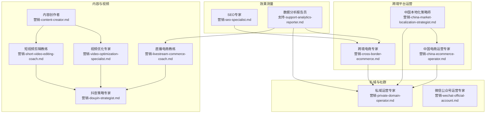
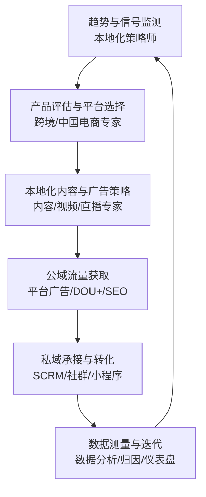
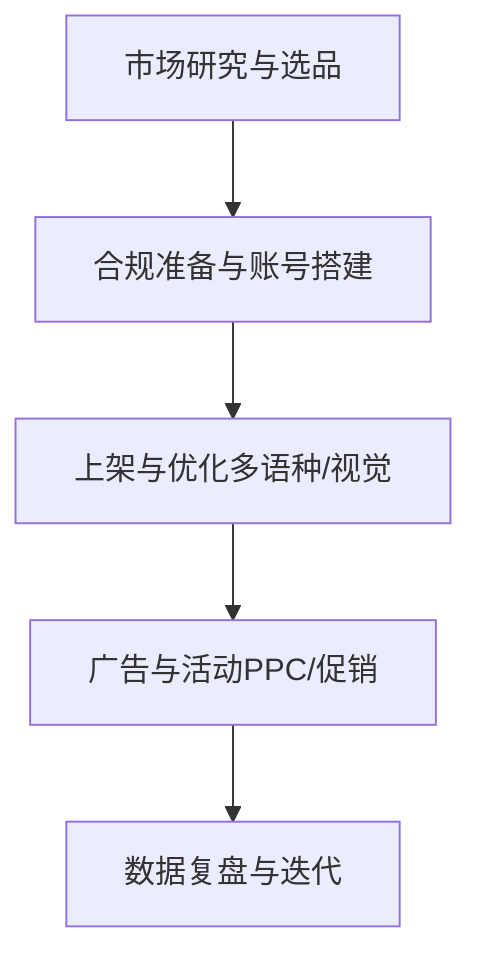
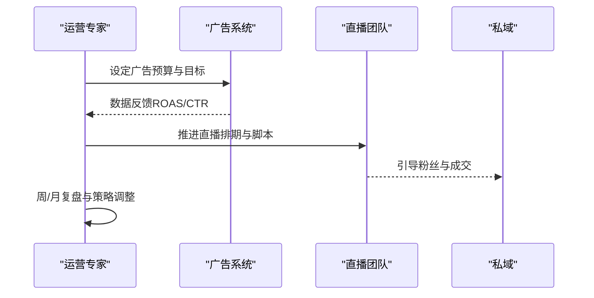
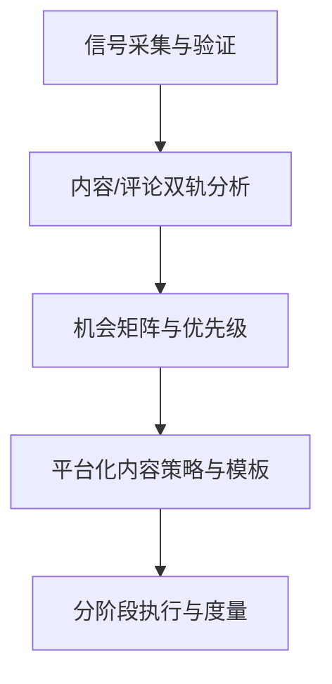
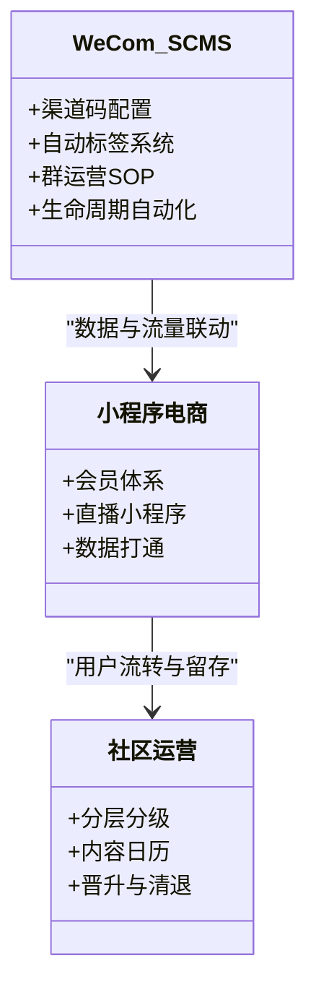
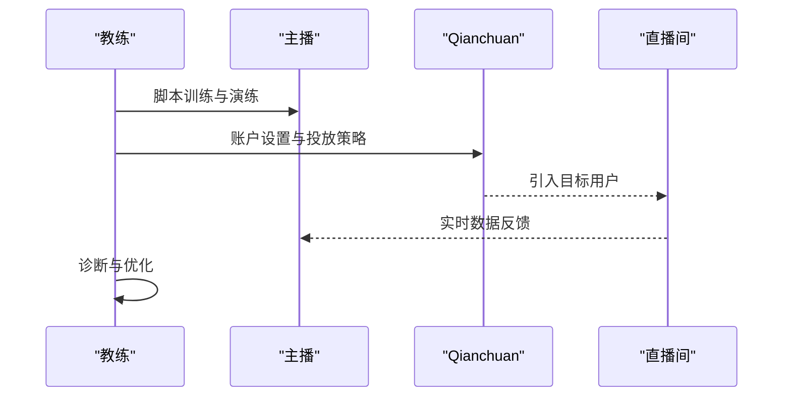
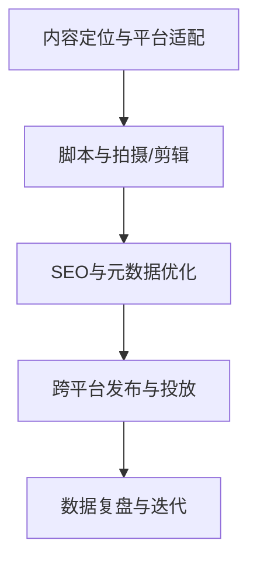
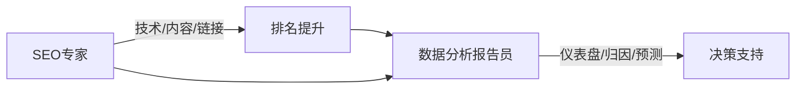
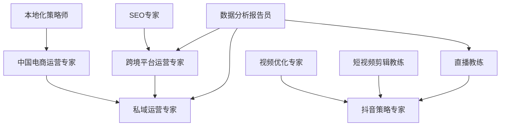

# 跨境电商营销代理

<cite>
**本文引用的文件**
- [marketing-cross-border-ecommerce.md](file://marketing/marketing-cross-border-ecommerce.md)
- [marketing-china-ecommerce-operator.md](file://marketing/marketing-china-ecommerce-operator.md)
- [marketing-china-market-localization-strategist.md](file://marketing/marketing-china-market-localization-strategist.md)
- [marketing-private-domain-operator.md](file://marketing/marketing-private-domain-operator.md)
- [marketing-livestream-commerce-coach.md](file://marketing/marketing-livestream-commerce-coach.md)
- [marketing-video-optimization-specialist.md](file://marketing/marketing-video-optimization-specialist.md)
- [marketing-short-video-editing-coach.md](file://marketing/marketing-short-video-editing-coach.md)
- [marketing-content-creator.md](file://marketing/marketing-content-creator.md)
- [marketing-wechat-official-account.md](file://marketing/marketing-wechat-official-account.md)
- [marketing-douyin-strategist.md](file://marketing/marketing-douyin-strategist.md)
- [marketing-seo-specialist.md](file://marketing/marketing-seo-specialist.md)
- [support-analytics-reporter.md](file://support/support-analytics-reporter.md)
</cite>

## 目录
1. [引言](#引言)
2. [项目结构](#项目结构)
3. [核心组件](#核心组件)
4. [架构总览](#架构总览)
5. [详细组件分析](#详细组件分析)
6. [依赖分析](#依赖分析)
7. [性能考虑](#性能考虑)
8. [故障排查指南](#故障排查指南)
9. [结论](#结论)
10. [附录](#附录)

## 引言
本文件面向跨境电商营销代理，系统化梳理中国电商市场运营、本地化策略制定、私域流量建设与运营、内容与视频优化、直播带货实战、以及效果测量与持续优化的方法论与工具。文档以“平台规则+合规红线+数据驱动+本地化落地”为核心原则，结合多平台（Amazon、Shopee、Lazada、Temu、TikTok Shop、Douyin、Xiaohongshu、WeChat）实战经验，帮助代理方构建从选品到转化、从公域引流到私域沉淀的全链路增长体系。

## 项目结构
该仓库按职能域划分营销能力模块，涵盖跨境平台运营、中国本土电商生态、私域SCRM、短视频与直播、内容创作与SEO、数据分析与报表等。整体采用“角色化Agent”的知识卡片式文档，便于快速检索与组合应用。

图表来源
- [marketing-cross-border-ecommerce.md:1-260](file://marketing/marketing-cross-border-ecommerce.md#L1-L260)
- [marketing-china-ecommerce-operator.md:1-284](file://marketing/marketing-china-ecommerce-operator.md#L1-L284)
- [marketing-china-market-localization-strategist.md:1-284](file://marketing/marketing-china-market-localization-strategist.md#L1-L284)
- [marketing-private-domain-operator.md:1-309](file://marketing/marketing-private-domain-operator.md#L1-L309)
- [marketing-livestream-commerce-coach.md:1-306](file://marketing/marketing-livestream-commerce-coach.md#L1-L306)
- [marketing-video-optimization-specialist.md:1-120](file://marketing/marketing-video-optimization-specialist.md#L1-L120)
- [marketing-short-video-editing-coach.md:1-413](file://marketing/marketing-short-video-editing-coach.md#L1-L413)
- [marketing-douyin-strategist.md:1-150](file://marketing/marketing-douyin-strategist.md#L1-L150)
- [marketing-content-creator.md:1-54](file://marketing/marketing-content-creator.md#L1-L54)
- [marketing-wechat-official-account.md:1-146](file://marketing/marketing-wechat-official-account.md#L1-L146)
- [marketing-seo-specialist.md:1-280](file://marketing/marketing-seo-specialist.md#L1-L280)
- [support-analytics-reporter.md:1-365](file://support/support-analytics-reporter.md#L1-L365)

章节来源
- [marketing-cross-border-ecommerce.md:1-260](file://marketing/marketing-cross-border-ecommerce.md#L1-L260)
- [marketing-china-ecommerce-operator.md:1-284](file://marketing/marketing-china-ecommerce-operator.md#L1-L284)
- [marketing-china-market-localization-strategist.md:1-284](file://marketing/marketing-china-market-localization-strategist.md#L1-L284)
- [marketing-private-domain-operator.md:1-309](file://marketing/marketing-private-domain-operator.md#L1-L309)
- [marketing-livestream-commerce-coach.md:1-306](file://marketing/marketing-livestream-commerce-coach.md#L1-L306)
- [marketing-video-optimization-specialist.md:1-120](file://marketing/marketing-video-optimization-specialist.md#L1-L120)
- [marketing-short-video-editing-coach.md:1-413](file://marketing/marketing-short-video-editing-coach.md#L1-L413)
- [marketing-content-creator.md:1-54](file://marketing/marketing-content-creator.md#L1-L54)
- [marketing-wechat-official-account.md:1-146](file://marketing/marketing-wechat-official-account.md#L1-L146)
- [marketing-douyin-strategist.md:1-150](file://marketing/marketing-douyin-strategist.md#L1-L150)
- [marketing-seo-specialist.md:1-280](file://marketing/marketing-seo-specialist.md#L1-L280)
- [support-analytics-reporter.md:1-365](file://support/support-analytics-reporter.md#L1-L365)

## 核心组件
- 跨境平台运营专家：覆盖Amazon、Shopee、Lazada、AliExpress、Temu、TikTok Shop全平台运营、广告、物流、合规、品牌全球化、客户服务等。
- 中国电商运营专家：覆盖Taobao、Tmall、Pinduoduo、JD及Douyin Shop，强调节日大促、直播带货、广告ROI优化、跨平台差异化运营。
- 中国本地化策略师：基于实时热榜信号，进行趋势洞察、机会提取、跨平台本地化策略设计与执行。
- 私域运营专家：WeCom组织架构、SCRM配置、社区分层运营、小程序电商、用户生命周期管理与转化漏斗。
- 内容与视频专家：短视频结构、算法优化、剪辑技术、直播脚本与流量策略、内容矩阵与复用。
- SEO与数据分析：技术SEO审计、关键词研究、链接建设、归因与ROI分析、仪表盘与报告模板。

章节来源
- [marketing-cross-border-ecommerce.md:1-260](file://marketing/marketing-cross-border-ecommerce.md#L1-L260)
- [marketing-china-ecommerce-operator.md:1-284](file://marketing/marketing-china-ecommerce-operator.md#L1-L284)
- [marketing-china-market-localization-strategist.md:1-284](file://marketing/marketing-china-market-localization-strategist.md#L1-L284)
- [marketing-private-domain-operator.md:1-309](file://marketing/marketing-private-domain-operator.md#L1-L309)
- [marketing-livestream-commerce-coach.md:1-306](file://marketing/marketing-livestream-commerce-coach.md#L1-L306)
- [marketing-video-optimization-specialist.md:1-120](file://marketing/marketing-video-optimization-specialist.md#L1-L120)
- [marketing-short-video-editing-coach.md:1-413](file://marketing/marketing-short-video-editing-coach.md#L1-L413)
- [marketing-content-creator.md:1-54](file://marketing/marketing-content-creator.md#L1-L54)
- [marketing-wechat-official-account.md:1-146](file://marketing/marketing-wechat-official-account.md#L1-L146)
- [marketing-douyin-strategist.md:1-150](file://marketing/marketing-douyin-strategist.md#L1-L150)
- [marketing-seo-specialist.md:1-280](file://marketing/marketing-seo-specialist.md#L1-L280)
- [support-analytics-reporter.md:1-365](file://support/support-analytics-reporter.md#L1-L365)

## 架构总览
以下架构图展示从“趋势洞察—产品与平台选择—本地化落地—公域引流—私域沉淀—效果测量”的闭环流程，强调合规、数据与本地化三要素。

图表来源
- [marketing-china-market-localization-strategist.md:1-284](file://marketing/marketing-china-market-localization-strategist.md#L1-L284)
- [marketing-china-ecommerce-operator.md:1-284](file://marketing/marketing-china-ecommerce-operator.md#L1-L284)
- [marketing-cross-border-ecommerce.md:1-260](file://marketing/marketing-cross-border-ecommerce.md#L1-L260)
- [marketing-douyin-strategist.md:1-150](file://marketing/marketing-douyin-strategist.md#L1-L150)
- [marketing-private-domain-operator.md:1-309](file://marketing/marketing-private-domain-operator.md#L1-L309)
- [support-analytics-reporter.md:1-365](file://support/support-analytics-reporter.md#L1-L365)

## 详细组件分析

### 组件A：跨境平台运营专家
- 覆盖平台：Amazon、Shopee、Lazada、AliExpress、Temu、TikTok Shop；强调平台规则、合规、广告、物流、品牌全球化、客户服务。
- 关键交付：产品评估评分卡、多市场对比、Amazon PPC框架、全链路工作流。
- 本地化与合规：多语种listing、视觉本地化、认证与税务、平台政策与风控。

图表来源
- [marketing-cross-border-ecommerce.md:206-260](file://marketing/marketing-cross-border-ecommerce.md#L206-L260)

章节来源
- [marketing-cross-border-ecommerce.md:1-260](file://marketing/marketing-cross-border-ecommerce.md#L1-L260)

### 组件B：中国电商运营专家
- 覆盖平台：Taobao、Tmall、Pinduoduo、JD、Douyin Shop；强调节日大促、直播带货、广告ROI、跨平台差异化。
- 关键交付：多平台运营看板、listing优化框架、618/双11战役计划、广告ROI优化循环。
- 私域整合：WeChat CRM、会员体系、社区电商、客户生命周期管理。

图表来源
- [marketing-china-ecommerce-operator.md:119-225](file://marketing/marketing-china-ecommerce-operator.md#L119-L225)

章节来源
- [marketing-china-ecommerce-operator.md:1-284](file://marketing/marketing-china-ecommerce-operator.md#L1-L284)

### 组件C：中国本地化策略师
- 能力：实时热榜监测、信号检测、三角验证、反直觉思维、MECE拆解；输出产品优先级、卖点假设、内容模板、风险词与FAQ、可执行清单。
- 落地：分阶段GTM门禁、跨平台内容策略、直播电商集成、危机与舆情管理、中西桥接策略。

图表来源
- [marketing-china-market-localization-strategist.md:88-220](file://marketing/marketing-china-market-localization-strategist.md#L88-L220)

章节来源
- [marketing-china-market-localization-strategist.md:1-284](file://marketing/marketing-china-market-localization-strategist.md#L1-L284)

### 组件D：私域运营专家
- 能力：WeCom组织架构、渠道二维码、自动标签、群运营SOP、小程序电商、生命周期自动化、转化漏斗。
- 合规与体验：好友添加频率控制、内容价值比例、PIPL合规、敏感行业内容审核。

图表来源
- [marketing-private-domain-operator.md:77-217](file://marketing/marketing-private-domain-operator.md#L77-L217)

章节来源
- [marketing-private-domain-operator.md:1-309](file://marketing/marketing-private-domain-operator.md#L1-L309)

### 组件E：直播电商教练
- 能力：主播培养、脚本五段式、产品编排、付费/自然流量协同、实时数据复盘、有机流量放大法。
- 规则：平台流量分配逻辑、合规红线、主机管理原则。

图表来源
- [marketing-livestream-commerce-coach.md:250-286](file://marketing/marketing-livestream-commerce-coach.md#L250-L286)

章节来源
- [marketing-livestream-commerce-coach.md:1-306](file://marketing/marketing-livestream-commerce-coach.md#L1-L306)

### 组件F：内容与视频专家
- 视频优化专家：标题/缩略图策略、章节化、SEO元数据、跨平台转发。
- 短视频剪辑教练：软件选型、构图语言、色彩校正、音频工程、字幕与导出、AI辅助剪辑。
- 抖音策略专家：短视频结构、DOU+投放、直播产品编排、算法优先级。

图表来源
- [marketing-video-optimization-specialist.md:49-102](file://marketing/marketing-video-optimization-specialist.md#L49-L102)
- [marketing-short-video-editing-coach.md:359-395](file://marketing/marketing-short-video-editing-coach.md#L359-L395)
- [marketing-douyin-strategist.md:53-136](file://marketing/marketing-douyin-strategist.md#L53-L136)

章节来源
- [marketing-video-optimization-specialist.md:1-120](file://marketing/marketing-video-optimization-specialist.md#L1-L120)
- [marketing-short-video-editing-coach.md:1-413](file://marketing/marketing-short-video-editing-coach.md#L1-L413)
- [marketing-douyin-strategist.md:1-150](file://marketing/marketing-douyin-strategist.md#L1-L150)

### 组件G：SEO与数据分析
- SEO专家：技术审计、关键词研究、内容优化、链接建设、SERP特性优化、搜索分析与报告。
- 数据分析报告员：仪表盘模板、客户分群与RFM、归因模型与ROI计算、预测与可视化。

图表来源
- [marketing-seo-specialist.md:39-224](file://marketing/marketing-seo-specialist.md#L39-L224)
- [support-analytics-reporter.md:54-220](file://support/support-analytics-reporter.md#L54-L220)

章节来源
- [marketing-seo-specialist.md:1-280](file://marketing/marketing-seo-specialist.md#L1-L280)
- [support-analytics-reporter.md:1-365](file://support/support-analytics-reporter.md#L1-L365)

## 依赖分析
- 跨境平台运营专家与本地化策略师存在强耦合：前者负责平台落地，后者负责信号与机会提取，二者通过“产品评估—平台选择—本地化策略”闭环协作。
- 中国电商运营专家与私域运营专家耦合紧密：前者负责公域流量与GMV，后者负责承接与留存，形成“公域—私域”流量闭环。
- 内容/视频/直播专家为“触达—转化—留存”的前端引擎，与SEO、数据分析共同构成“发现—转化—留存—复购”的全链路。
- 数据分析报告员贯穿各环节，提供归因、仪表盘与预测，确保决策可追踪、可量化。

图表来源
- [marketing-china-market-localization-strategist.md:1-284](file://marketing/marketing-china-market-localization-strategist.md#L1-L284)
- [marketing-china-ecommerce-operator.md:1-284](file://marketing/marketing-china-ecommerce-operator.md#L1-L284)
- [marketing-private-domain-operator.md:1-309](file://marketing/marketing-private-domain-operator.md#L1-L309)
- [marketing-douyin-strategist.md:1-150](file://marketing/marketing-douyin-strategist.md#L1-L150)
- [marketing-video-optimization-specialist.md:1-120](file://marketing/marketing-video-optimization-specialist.md#L1-L120)
- [marketing-short-video-editing-coach.md:1-413](file://marketing/marketing-short-video-editing-coach.md#L1-L413)
- [marketing-livestream-commerce-coach.md:1-306](file://marketing/marketing-livestream-commerce-coach.md#L1-L306)
- [marketing-seo-specialist.md:1-280](file://marketing/marketing-seo-specialist.md#L1-L280)
- [support-analytics-reporter.md:1-365](file://support/support-analytics-reporter.md#L1-L365)

章节来源
- [marketing-china-market-localization-strategist.md:1-284](file://marketing/marketing-china-market-localization-strategist.md#L1-L284)
- [marketing-china-ecommerce-operator.md:1-284](file://marketing/marketing-china-ecommerce-operator.md#L1-L284)
- [marketing-private-domain-operator.md:1-309](file://marketing/marketing-private-domain-operator.md#L1-L309)
- [marketing-douyin-strategist.md:1-150](file://marketing/marketing-douyin-strategist.md#L1-L150)
- [marketing-video-optimization-specialist.md:1-120](file://marketing/marketing-video-optimization-specialist.md#L1-L120)
- [marketing-short-video-editing-coach.md:1-413](file://marketing/marketing-short-video-editing-coach.md#L1-L413)
- [marketing-livestream-commerce-coach.md:1-306](file://marketing/marketing-livestream-commerce-coach.md#L1-L306)
- [marketing-seo-specialist.md:1-280](file://marketing/marketing-seo-specialist.md#L1-L280)
- [support-analytics-reporter.md:1-365](file://support/support-analytics-reporter.md#L1-L365)

## 性能考虑
- 平台合规前置：在任何流量动作前完成认证、税务与平台政策核验，避免账户风险与供应链中断。
- 本地化质量门槛：机器翻译不可替代，必须由母语审校；视觉风格与文案需符合目标市场审美与禁忌。
- 数据驱动的预算与节奏：按阶段设定广告预算与目标，以ACOS/TACOS、转化率、库存周转为核心KPI动态调整。
- 私域资产化：以SCRM为支点，建立标签、SOP与自动化，降低获客成本并提升LTV。
- 算法优先级：公域流量以完播率、互动率、转化率决定分配权重，需围绕这些指标优化内容与脚本。

## 故障排查指南
- 平台违规与封禁
  - 症状：广告被拒、商品下架、账号受限
  - 处置：核查认证/标签/描述合规性；对照平台违禁清单逐项整改；建立合规检查表
  - 参考：跨境平台运营专家的合规红灯与平台规则
- 供应链与物流波动
  - 症状：缺货、延迟、退货率上升
  - 处置：提前规划FBA/海外仓/空运/海运组合；建立安全库存与转运方案
  - 参考：跨境平台运营专家的物流与仓储策略
- 私域冷启动与高流失
  - 症状：加好友转化低、群活跃度差、复购率低
  - 处置：优化欢迎SOP、内容价值比例、分层运营与晋升机制；引入激励与限时活动
  - 参考：私域运营专家的SCRM配置与生命周期自动化
- 直播流量与转化异常
  - 症状：有机流量占比低、转化率不升反降
  - 处置：优化脚本节奏、产品编排与紧迫感设计；调整Qianchuan投放与创意轮换
  - 参考：直播电商教练的流量策略与数据复盘
- SEO表现不佳
  - 症状：排名停滞、完播率低、外链增长缓慢
  - 处置：技术审计与结构化数据修复；关键词意图匹配与内容深度提升；链接建设与PR
  - 参考：SEO专家的技术审计与链接策略

章节来源
- [marketing-cross-border-ecommerce.md:99-128](file://marketing/marketing-cross-border-ecommerce.md#L99-L128)
- [marketing-private-domain-operator.md:59-76](file://marketing/marketing-private-domain-operator.md#L59-L76)
- [marketing-livestream-commerce-coach.md:60-83](file://marketing/marketing-livestream-commerce-coach.md#L60-L83)
- [marketing-seo-specialist.md:25-38](file://marketing/marketing-seo-specialist.md#L25-L38)

## 结论
本代理体系以“本地化+合规+数据驱动”为核心，结合中国电商生态与跨境平台规则，构建从趋势捕捉、产品与平台选择、内容与直播落地、公域引流到私域沉淀的全链路增长闭环。通过标准化交付物（评估模型、运营看板、脚本模板、仪表盘）与持续的数据测量与迭代，实现稳定、可持续的增长。

## 附录
- 快速参考清单
  - 选品与合规：认证、税务、侵权风险、HS编码与进口税
  - 平台运营：广告预算与目标、活动报名、A+页面与多语种listing
  - 私域建设：SCRM配置、标签体系、群运营SOP、生命周期自动化
  - 内容与视频：短视频结构、算法优先级、剪辑与导出规范、跨平台复用
  - 数据测量：仪表盘模板、归因模型、ROI与KPI追踪