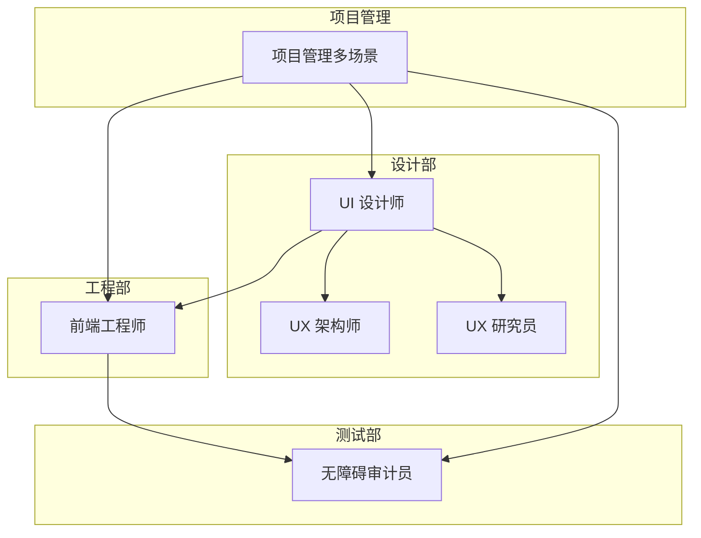
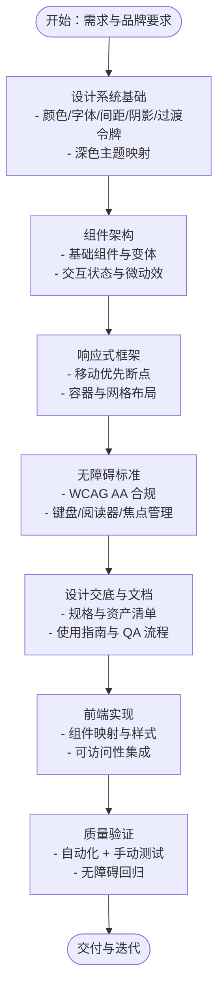
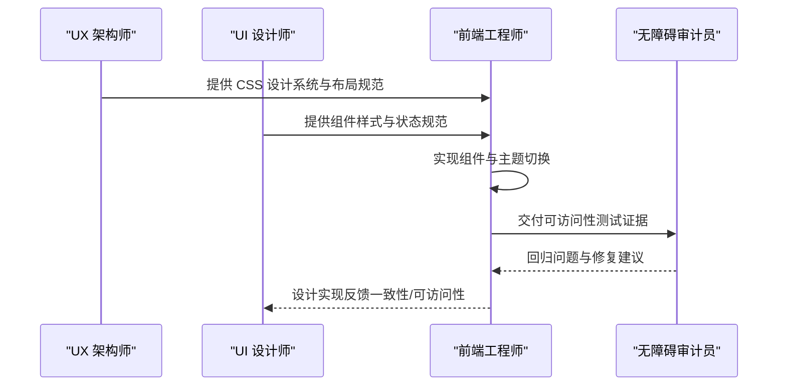

# UI 设计师

<cite>
**本文引用的文件**
- [design-ui-designer.md](file://design/design-ui-designer.md)
- [design-ux-architect.md](file://design/design-ux-architect.md)
- [design-ux-researcher.md](file://design/design-ux-researcher.md)
- [engineering-frontend-developer.md](file://engineering/engineering-frontend-developer.md)
- [testing-accessibility-auditor.md](file://testing/testing-accessibility-auditor.md)
- [handoff-templates.md](file://strategy/coordination/handoff-templates.md)
- [nexus-strategy.md](file://strategy/nexus-strategy.md)
- [README.md](file://README.md)
</cite>

## 目录
1. [简介](#简介)
2. [项目结构](#项目结构)
3. [核心职责与能力](#核心职责与能力)
4. [架构总览](#架构总览)
5. [组件库与设计系统详解](#组件库与设计系统详解)
6. [依赖关系与协作机制](#依赖关系与协作机制)
7. [性能与可用性考量](#性能与可用性考量)
8. [交付模板与工作流程](#交付模板与工作流程)
9. [质量标准与成功指标](#质量标准与成功指标)
10. [故障排查指南](#故障排查指南)
11. [结论](#结论)

## 简介
本文件面向“UI 设计师”代理角色，系统化阐述其在设计系统、组件库、像素级界面创建方面的专业职责与方法论；解释设计系统基础架构（设计令牌、响应式框架、无障碍标准）；梳理与工程团队协作流程（设计到实现的可执行性与技术可行性）；给出组件库架构示例（按钮、表单、导航、反馈等）；展示设计交付模板与端到端工作流；并提供可量化的成功指标与质量标准，确保设计方案既满足用户体验又达成商业目标。

## 项目结构
该仓库采用“多代理分部”的组织方式，UI 设计师属于“设计部”，并与“工程部”“测试部”“项目管理部”形成跨职能协作闭环。UI 设计师的职责边界与协作路径在各代理文件中明确，便于在实际项目中进行端到端交付与质量保障。

图表来源
- [README.md](file://README.md)
- [design-ui-designer.md](file://design/design-ui-designer.md)
- [design-ux-architect.md](file://design/design-ux-architect.md)
- [design-ux-researcher.md](file://design/design-ux-researcher.md)
- [engineering-frontend-developer.md](file://engineering/engineering-frontend-developer.md)
- [testing-accessibility-auditor.md](file://testing/testing-accessibility-auditor.md)

章节来源
- [README.md](file://README.md)

## 核心职责与能力
- 设计系统优先：先建立组件基础，再扩展到页面；强调一致性与可扩展性，避免设计债务。
- 视觉设计系统：色彩、排版、间距、阴影、过渡等设计令牌体系；深色模式与主题切换。
- 组件库构建：按钮、输入框、卡片、导航、反馈、数据展示等基础组件及状态变体。
- 响应式设计：移动端优先策略，断点与网格布局，容器宽度与组件自适应行为。
- 无障碍设计：WCAG AA 最低标准，键盘导航、屏幕阅读器支持、焦点管理、触达目标尺寸等。
- 开发者协作：清晰的设计交底（规格、资产）、组件文档、设计 QA 流程、可复用模式库。
- 性能意识：图片与图标优化、CSS 渲染效率、加载态与渐进增强。

章节来源
- [design-ui-designer.md](file://design/design-ui-designer.md)

## 架构总览
UI 设计师的设计系统由“设计令牌系统 + 组件样式 + 响应式框架 + 无障碍标准”构成，并通过“工作流 + 交付模板 + 协作协议”确保可落地与可验证。

图表来源
- [design-ui-designer.md](file://design/design-ui-designer.md)
- [testing-accessibility-auditor.md](file://testing/testing-accessibility-auditor.md)
- [engineering-frontend-developer.md](file://engineering/engineering-frontend-developer.md)

## 组件库与设计系统详解
以下为 UI 设计师可参考的组件库架构要点与示例维度（不直接展示代码片段，详见源文件路径）：

- 设计令牌系统
  - 颜色令牌：主色、辅色、语义色（成功/警告/错误/信息）、中性灰阶；深色主题映射。
  - 字体令牌：主字体、副字体、字号刻度、字重、行高。
  - 间距令牌：基于统一基值的数学比例刻度。
  - 阴影与过渡：统一的阴影与过渡时序，确保动效一致性。
  - 示例参考：[设计令牌系统](file://design/design-ui-designer.md)

- 基础组件样式
  - 按钮：主/次/禁用/悬停/聚焦等状态；过渡与阴影。
  - 表单元素：输入框聚焦边框、阴影、禁用态。
  - 卡片：背景、边框、阴影、悬停位移。
  - 示例参考：[基础组件样式](file://design/design-ui-designer.md)

- 响应式设计框架
  - 移动优先容器、断点与网格列数映射。
  - 示例参考：[响应式设计框架](file://design/design-ui-designer.md)

- 深色主题与系统偏好
  - 主题切换与系统主题偏好处理。
  - 示例参考：[深色主题令牌](file://design/design-ui-designer.md)

- 与前端协作的 CSS 架构
  - 设计令牌变量、主题切换、基础排版与布局组件。
  - 示例参考：[CSS 设计系统基础](file://design/design-ux-architect.md)

章节来源
- [design-ui-designer.md](file://design/design-ui-designer.md)
- [design-ux-architect.md](file://design/design-ux-architect.md)

## 依赖关系与协作机制
UI 设计师与工程团队的协作遵循“设计系统优先 + 明确交底 + 可验证交付”的闭环：

- 与 UX 架构师协作
  - 由 UX 架构师提供 CSS 架构与布局框架，UI 设计师在此基础上完成视觉与交互细节。
  - 示例参考：[UX 架构师交付物](file://design/design-ux-architect.md)

- 与前端工程师协作
  - 前端负责将设计系统转化为可维护的组件与样式，关注性能与可访问性。
  - 示例参考：[前端实现要点](file://engineering/engineering-frontend-developer.md)

- 与无障碍审计员协作
  - 在设计阶段即纳入无障碍考虑，前端实现后由审计员进行自动化与手动测试验证。
  - 示例参考：[无障碍审计流程](file://testing/testing-accessibility-auditor.md)

- 跨职能协作模板
  - 使用标准化的“NEXUS 手工交接模板”确保上下文不丢失。
  - 示例参考：[标准交接模板](file://strategy/coordination/handoff-templates.md)

- 关键协作对与协议
  - 典型交接对包括：UX 架构师 → 前端工程师、UI 设计师 → 前端工程师、前端工程师 → 无障碍审计员。
  - 示例参考：[关键交接对与协议](file://strategy/nexus-strategy.md)

图表来源
- [design-ux-architect.md](file://design/design-ux-architect.md)
- [design-ui-designer.md](file://design/design-ui-designer.md)
- [engineering-frontend-developer.md](file://engineering/engineering-frontend-developer.md)
- [testing-accessibility-auditor.md](file://testing/testing-accessibility-auditor.md)

章节来源
- [design-ux-architect.md](file://design/design-ux-architect.md)
- [design-ui-designer.md](file://design/design-ui-designer.md)
- [engineering-frontend-developer.md](file://engineering/engineering-frontend-developer.md)
- [testing-accessibility-auditor.md](file://testing/testing-accessibility-auditor.md)
- [handoff-templates.md](file://strategy/coordination/handoff-templates.md)
- [nexus-strategy.md](file://strategy/nexus-strategy.md)

## 性能与可用性考量
- 性能意识设计
  - 图片与图标优化、CSS 渲染效率、加载态与渐进增强。
  - 示例参考：[UI 设计师性能规则](file://design/design-ui-designer.md)

- 前端性能优化实践
  - Core Web Vitals 优先、代码分割、懒加载、缓存策略。
  - 示例参考：[前端性能优化](file://engineering/engineering-frontend-developer.md)

- 无障碍优先
  - WCAG AA 合规、键盘导航、屏幕阅读器支持、焦点管理、触达目标尺寸。
  - 示例参考：[无障碍审计标准](file://testing/testing-accessibility-auditor.md)

章节来源
- [design-ui-designer.md](file://design/design-ui-designer.md)
- [engineering-frontend-developer.md](file://engineering/engineering-frontend-developer.md)
- [testing-accessibility-auditor.md](file://testing/testing-accessibility-auditor.md)

## 交付模板与工作流程
- 设计系统交付模板
  - 包含设计基础（颜色/排版/间距）、组件库（基础组件与状态）、响应式策略、无障碍标准。
  - 示例参考：[设计系统交付模板](file://design/design-ui-designer.md)

- 工作流程步骤
  - 设计系统基础 → 组件架构 → 视觉层级 → 开发者交底。
  - 示例参考：[UI 设计师工作流程](file://design/design-ui-designer.md)

- 标准交接模板
  - 用于跨代理交接，确保上下文、依赖、约束、验收标准清晰。
  - 示例参考：[标准交接模板](file://strategy/coordination/handoff-templates.md)

- 关键交接对与协议
  - 明确“谁向谁交接、交接什么、如何验收、后续流向谁”。
  - 示例参考：[关键交接对与协议](file://strategy/nexus-strategy.md)

章节来源
- [design-ui-designer.md](file://design/design-ui-designer.md)
- [handoff-templates.md](file://strategy/coordination/handoff-templates.md)
- [nexus-strategy.md](file://strategy/nexus-strategy.md)

## 质量标准与成功指标
- 设计系统一致性：跨界面元素的一致性达到较高水平。
- 无障碍达标：满足 WCAG AA 标准，键盘与屏幕阅读器可用。
- 开发者交底准确率：设计到实现的偏差最小化。
- 组件复用率：组件被有效复用，减少设计债务。
- 响应式覆盖：在目标断点下无明显布局问题。

章节来源
- [design-ui-designer.md](file://design/design-ui-designer.md)

## 故障排查指南
- 常见问题与定位
  - 无障碍问题：使用自动化工具与手动测试结合，重点检查焦点顺序、标签与状态公告。
  - 组件一致性：核对设计令牌是否一致、状态变体是否齐全。
  - 响应式异常：检查断点与容器宽度、网格列数映射。
  - 性能问题：检查渲染开销、资源体积与加载策略。

- 复查清单
  - 无障碍：键盘可达性、焦点可见性、语义标签、动态内容通知。
  - 可访问性：对比 WCAG 标准逐项核查，记录证据与修复建议。
  - 一致性：对照设计系统令牌与组件变体，确认实现与设计稿一致。
  - 响应式：在目标断点下验证布局与交互。

章节来源
- [testing-accessibility-auditor.md](file://testing/testing-accessibility-auditor.md)
- [design-ui-designer.md](file://design/design-ui-designer.md)

## 结论
UI 设计师代理以“设计系统优先”为核心，通过设计令牌、组件库、响应式与无障碍标准构建可扩展、可维护的视觉语言；通过标准化工作流程与交接模板，确保与工程团队的顺畅协作与高质量交付；最终以可量化的成功指标与质量标准，持续提升用户体验与业务价值。