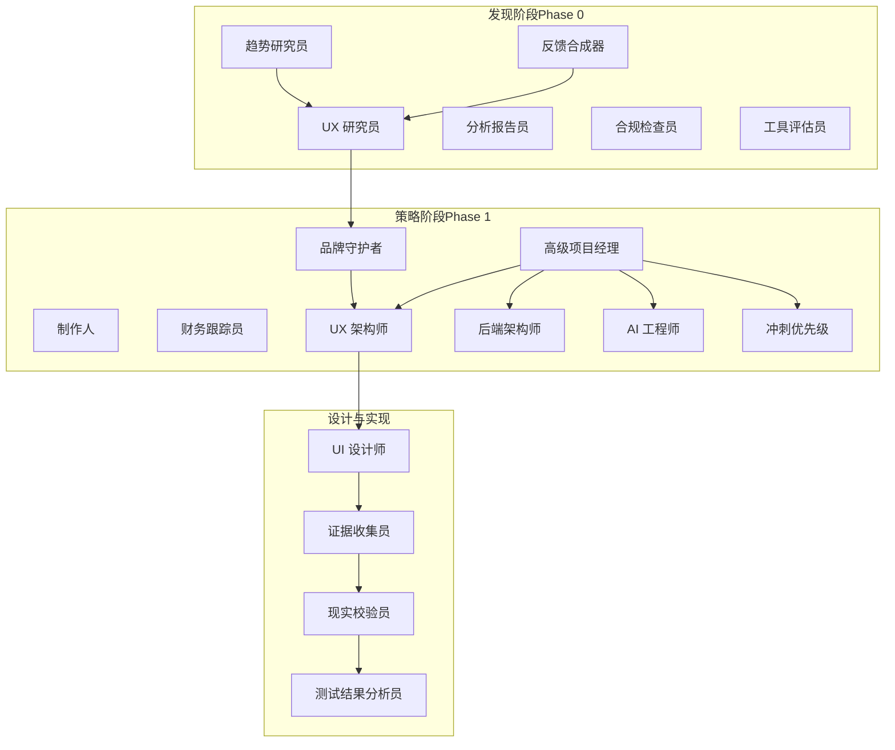
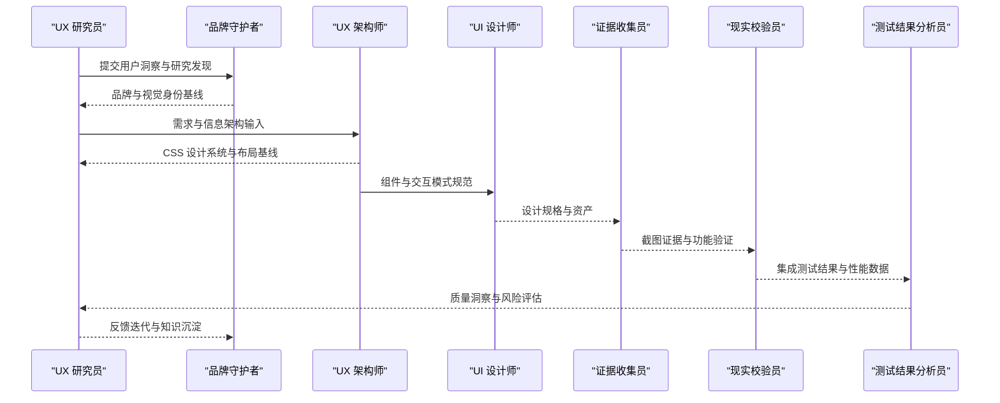
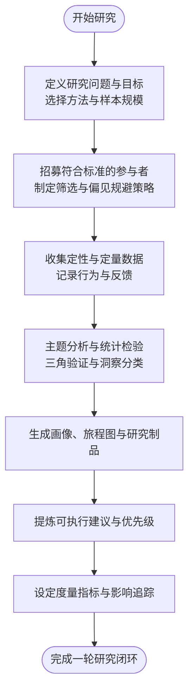
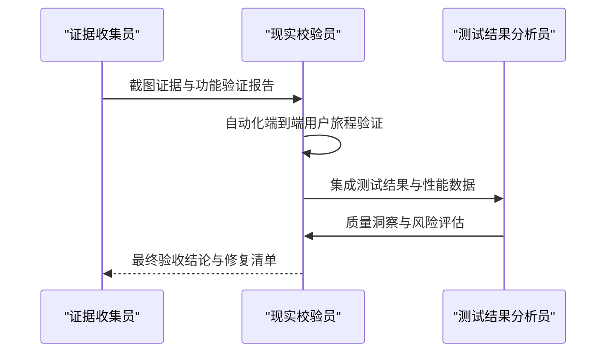
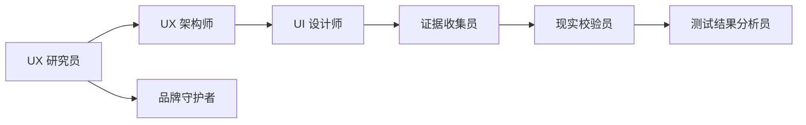

# UX 研究员

<cite>
**本文引用的文件**
- [design-ux-researcher.md](file://design/design-ux-researcher.md)
- [design-ux-architect.md](file://design/design-ux-architect.md)
- [design-ui-designer.md](file://design/design-ui-designer.md)
- [testing-evidence-collector.md](file://testing/testing-evidence-collector.md)
- [testing-reality-checker.md](file://testing/testing-reality-checker.md)
- [testing-test-results-analyzer.md](file://testing/testing-test-results-analyzer.md)
- [phase-0-discovery.md](file://strategy/playbooks/phase-0-discovery.md)
- [phase-1-strategy.md](file://strategy/playbooks/phase-1-strategy.md)
- [nexus-strategy.md](file://strategy/nexus-strategy.md)
- [support-executive-summary-generator.md](file://support/support-executive-summary-generator.md)
</cite>

## 目录
1. [简介](#简介)
2. [项目结构](#项目结构)
3. [核心组件](#核心组件)
4. [架构总览](#架构总览)
5. [详细组件分析](#详细组件分析)
6. [依赖关系分析](#依赖关系分析)
7. [性能与效率考量](#性能与效率考量)
8. [故障排查指南](#故障排查指南)
9. [结论](#结论)
10. [附录](#附录)

## 简介
本文件面向 UX 研究员代理，系统化阐述其专业能力、研究方法与工作流程，并结合仓库中的设计与测试体系，构建从“发现—策略—落地—验证”的完整用户体验研究闭环。内容覆盖用户行为分析、交互模式设计、可用性测试、竞品分析、信息架构设计、研究质量与有效性评估等主题，帮助读者在不深入代码的前提下理解 UX 研究员如何通过严谨的方法论与可执行的交付物，驱动产品设计决策并提升用户体验。

## 项目结构
该仓库采用“多代理协同”的工作流组织方式，围绕“发现—策略—构建—硬化—运营”六个阶段展开。UX 研究员在“发现阶段”承担用户行为与需求洞察的关键角色，在“策略阶段”与 UX 架构师、UI 设计师协作，形成可落地的设计基线与设计系统；在“硬化阶段”接受证据收集与现实校验的最终把关，确保研究成果与实际实现一致。

图表来源
- [phase-0-discovery.md:1-179](file://strategy/playbooks/phase-0-discovery.md#L1-L179)
- [phase-1-strategy.md:1-239](file://strategy/playbooks/phase-1-strategy.md#L1-L239)
- [design-ux-researcher.md:1-329](file://design/design-ux-researcher.md#L1-L329)
- [design-ux-architect.md:1-469](file://design/design-ux-architect.md#L1-L469)
- [design-ui-designer.md:1-383](file://design/design-ui-designer.md#L1-L383)
- [testing-evidence-collector.md:1-211](file://testing/testing-evidence-collector.md#L1-L211)
- [testing-reality-checker.md:1-237](file://testing/testing-reality-checker.md#L1-L237)
- [testing-test-results-analyzer.md:1-305](file://testing/testing-test-results-analyzer.md#L1-L305)

章节来源
- [phase-0-discovery.md:1-179](file://strategy/playbooks/phase-0-discovery.md#L1-L179)
- [phase-1-strategy.md:1-239](file://strategy/playbooks/phase-1-strategy.md#L1-L239)

## 核心组件
- UX 研究员：负责用户行为分析、需求挖掘、竞品分析、信息架构设计、可用性测试与研究交付物产出。强调以实证数据验证设计决策，建立研究过程与知识库，推动持续改进。
- UX 架构师：提供 CSS 设计系统、布局框架、组件架构与可访问性基线，确保开发者有清晰的实现路径与一致性体验。
- UI 设计师：构建设计系统、组件库与响应式框架，保证视觉一致性与可访问性，提供精确的设计规格与资产。
- 测试与验证链路：证据收集员（截图证据）、现实校验员（端到端集成验证）、测试结果分析员（统计分析与风险评估），三者共同构成研究与实现之间的质量守门。

章节来源
- [design-ux-researcher.md:1-329](file://design/design-ux-researcher.md#L1-L329)
- [design-ux-architect.md:1-469](file://design/design-ux-architect.md#L1-L469)
- [design-ui-designer.md:1-383](file://design/design-ui-designer.md#L1-L383)
- [testing-evidence-collector.md:1-211](file://testing/testing-evidence-collector.md#L1-L211)
- [testing-reality-checker.md:1-237](file://testing/testing-reality-checker.md#L1-L237)
- [testing-test-results-analyzer.md:1-305](file://testing/testing-test-results-analyzer.md#L1-L305)

## 架构总览
UX 研究员在多代理体系中的定位是“用户声音与证据的桥梁”。其工作贯穿发现与策略阶段，产出的研究成果直接驱动后续设计与工程实现，并在硬化阶段接受严格的证据与现实校验，确保研究发现能转化为真实的产品体验。

图表来源
- [design-ux-researcher.md:1-329](file://design/design-ux-researcher.md#L1-L329)
- [design-ux-architect.md:1-469](file://design/design-ux-architect.md#L1-L469)
- [design-ui-designer.md:1-383](file://design/design-ui-designer.md#L1-L383)
- [testing-evidence-collector.md:1-211](file://testing/testing-evidence-collector.md#L1-L211)
- [testing-reality-checker.md:1-237](file://testing/testing-reality-checker.md#L1-L237)
- [testing-test-results-analyzer.md:1-305](file://testing/testing-test-results-analyzer.md#L1-L305)

## 详细组件分析

### UX 研究员：专业能力与研究方法
- 用户行为分析与需求挖掘
  - 使用定性与定量方法，结合用户访谈、调查、可用性测试与行为数据分析，提炼关键痛点与动机。
  - 建立用户画像与旅程地图，标注触点、摩擦点与情感曲线，识别优化机会。
- 交互模式设计与信息架构
  - 基于研究发现提出交互建议，配合 UX 架构师与 UI 设计师形成一致的交互与信息层级。
- 可用性测试与验证
  - 制定测试协议，明确任务场景、成功指标与观察要点；通过前后对比截图与系统指标验证改进效果。
- 研究交付与过程管理
  - 提供研究计划、用户画像、可用性测试协议与研究报告模板，确保可复现、可追踪、可度量。
- 研究伦理与包容性
  - 强调知情同意、隐私保护、样本代表性与无障碍测试，确保研究结果的广泛适用性。

图表来源
- [design-ux-researcher.md:166-191](file://design/design-ux-researcher.md#L166-L191)

章节来源
- [design-ux-researcher.md:1-329](file://design/design-ux-researcher.md#L1-L329)

### UX 架构师：技术基线与可访问性
- CSS 设计系统与布局框架
  - 建立变量系统、排版比例、间距体系与网格/弹性布局模式，提供移动端优先的响应式策略。
- 主题系统与可访问性基线
  - 实现明暗/系统主题切换，满足 WCAG 2.1 AA 的颜色对比与键盘导航要求。
- 开发者交接文档
  - 明确优先级、文件结构与实现注意事项，降低架构决策疲劳与技术债。

章节来源
- [design-ux-architect.md:1-469](file://design/design-ux-architect.md#L1-L469)

### UI 设计师：设计系统与响应式框架
- 设计令牌与组件库
  - 定义色彩、字体、间距与阴影令牌，建立按钮、表单、导航等基础组件及其状态与微交互。
- 响应式策略
  - 基于断点与容器宽度的网格系统，确保跨设备一致体验。
- 可访问性与包容性
  - 满足 WCAG AA 的对比度、键盘可达性与屏幕阅读器支持。

章节来源
- [design-ui-designer.md:1-383](file://design/design-ui-designer.md#L1-L383)

### 测试与验证：证据收集与现实校验
- 证据收集员
  - 使用自动化截图捕获工具生成桌面/平板/手机全页面截图，交叉核对规格与实现，强制“可视化证据”。
- 现实校验员
  - 对端到端用户旅程进行自动化验证，基于截图与测试结果进行系统性评估，拒绝“幻想式”评级。
- 测试结果分析员
  - 进行覆盖率、失败模式、缺陷密度与风险预测的统计分析，输出可操作的质量洞察与发布建议。

图表来源
- [testing-evidence-collector.md:41-56](file://testing/testing-evidence-collector.md#L41-L56)
- [testing-reality-checker.md:41-56](file://testing/testing-reality-checker.md#L41-L56)
- [testing-test-results-analyzer.md:190-214](file://testing/testing-test-results-analyzer.md#L190-L214)

章节来源
- [testing-evidence-collector.md:1-211](file://testing/testing-evidence-collector.md#L1-L211)
- [testing-reality-checker.md:1-237](file://testing/testing-reality-checker.md#L1-L237)
- [testing-test-results-analyzer.md:1-305](file://testing/testing-test-results-analyzer.md#L1-L305)

### 协作模式与研究闭环
- 发现阶段：UX 研究员与趋势研究员、反馈合成器、合规检查员、工具评估员并行工作，形成市场、用户与技术可行性三重验证。
- 策略阶段：UX 研究员与品牌守护者、UX 架构师、UI 设计师协作，输出设计系统与架构基线，确保设计与工程的一致性。
- 硬化阶段：证据收集员与现实校验员对实现进行端到端验证，测试结果分析员提供统计化的质量洞察，最终由现实校验员给出“是否具备上线条件”的权威判断。

章节来源
- [phase-0-discovery.md:1-179](file://strategy/playbooks/phase-0-discovery.md#L1-L179)
- [phase-1-strategy.md:1-239](file://strategy/playbooks/phase-1-strategy.md#L1-L239)
- [nexus-strategy.md:395-429](file://strategy/nexus-strategy.md#L395-L429)

## 依赖关系分析
- 研究依赖设计与工程基线
  - UX 研究员的建议需与 UX 架构师提供的布局与组件基线、UI 设计师提供的设计系统保持一致，避免“研究可行但实现不可行”的落差。
- 设计依赖测试与验证
  - UI 设计师的规格与资产需经证据收集员与现实校验员的端到端验证，确保实现与设计一致。
- 质量依赖统计分析
  - 现实校验员的结论与测试结果分析员的统计洞察共同决定发布时机与风险等级。

图表来源
- [design-ux-researcher.md:1-329](file://design/design-ux-researcher.md#L1-L329)
- [design-ux-architect.md:1-469](file://design/design-ux-architect.md#L1-L469)
- [design-ui-designer.md:1-383](file://design/design-ui-designer.md#L1-L383)
- [testing-evidence-collector.md:1-211](file://testing/testing-evidence-collector.md#L1-L211)
- [testing-reality-checker.md:1-237](file://testing/testing-reality-checker.md#L1-L237)
- [testing-test-results-analyzer.md:1-305](file://testing/testing-test-results-analyzer.md#L1-L305)

章节来源
- [design-ux-researcher.md:1-329](file://design/design-ux-researcher.md#L1-L329)
- [design-ux-architect.md:1-469](file://design/design-ux-architect.md#L1-L469)
- [design-ui-designer.md:1-383](file://design/design-ui-designer.md#L1-L383)
- [testing-evidence-collector.md:1-211](file://testing/testing-evidence-collector.md#L1-L211)
- [testing-reality-checker.md:1-237](file://testing/testing-reality-checker.md#L1-L237)
- [testing-test-results-analyzer.md:1-305](file://testing/testing-test-results-analyzer.md#L1-L305)

## 性能与效率考量
- 研究效率
  - 在发现阶段并行启动多个代理，缩短市场与用户洞察周期；通过统一的报告模板与交付物清单，减少沟通成本。
- 设计与工程一致性
  - 通过 CSS 设计系统与组件库，减少反复返工；明确断点与交互模式，降低实现偏差。
- 验证效率
  - 自动化截图与端到端验证减少人工回归成本；测试结果分析员提供量化质量指标，辅助快速决策。

## 故障排查指南
- 常见问题与应对
  - “研究建议未被采纳”：检查研究交付物是否包含可执行的建议、优先级与度量指标；与产品/设计团队对齐业务目标。
  - “设计实现与研究不符”：确认设计系统与组件库是否与研究发现一致；要求证据收集员提供可视化证据。
  - “上线前仍存在关键问题”：现实校验员默认“需要改进”，需列出具体截图证据与修复清单；测试结果分析员提供风险评估与发布建议。
- 关键检查点
  - 是否有端到端用户旅程的截图证据？
  - 是否满足跨设备一致性与性能门槛？
  - 是否完成合规与安全验证？

章节来源
- [testing-evidence-collector.md:100-141](file://testing/testing-evidence-collector.md#L100-L141)
- [testing-reality-checker.md:122-141](file://testing/testing-reality-checker.md#L122-L141)
- [testing-test-results-analyzer.md:143-162](file://testing/testing-test-results-analyzer.md#L143-L162)

## 结论
UX 研究员在该多代理体系中扮演“用户声音与证据桥梁”的关键角色。通过严谨的研究方法、可执行的交付物与跨职能协作，研究发现得以转化为设计基线与工程实现，并在硬化阶段接受严格的证据与现实校验。这一闭环确保了研究成果的可靠性与实用性，为产品设计决策提供坚实支撑。

## 附录

### 研究报告模板与交付标准
- 研究计划模板
  - 包含研究目标、方法学、参与者标准、时间线与材料准备、数据收集与分析计划。
- 用户画像模板
  - 包含人口统计、行为模式、目标需求、使用情境与研究证据来源。
- 可用性测试协议模板
  - 包含测试环境与设备、材料、会话结构（介绍、基线问题、任务场景、后测访谈）与数据收集维度。
- 研究报告模板
  - 包含研究概述、用户洞察、可用性结果、推荐与优先级、成功度量与追踪计划。

章节来源
- [design-ux-researcher.md:56-162](file://design/design-ux-researcher.md#L56-L162)
- [design-ux-researcher.md:192-274](file://design/design-ux-researcher.md#L192-L274)

### 研究质量与有效性评估标准
- 方法学质量
  - 研究问题明确、方法适配、样本合理、偏见控制与三角验证。
- 伦理与包容性
  - 同意书、隐私保护、多样样本与无障碍测试。
- 交付物质量
  - 可执行建议、优先级排序、度量指标与追踪计划。
- 验证与闭环
  - 截图证据、端到端用户旅程验证、性能与合规达标、统计化的质量洞察与发布建议。

章节来源
- [design-ux-researcher.md:40-54](file://design/design-ux-researcher.md#L40-L54)
- [testing-evidence-collector.md:197-206](file://testing/testing-evidence-collector.md#L197-L206)
- [testing-reality-checker.md:225-234](file://testing/testing-reality-checker.md#L225-L234)
- [testing-test-results-analyzer.md:274-282](file://testing/testing-test-results-analyzer.md#L274-L282)