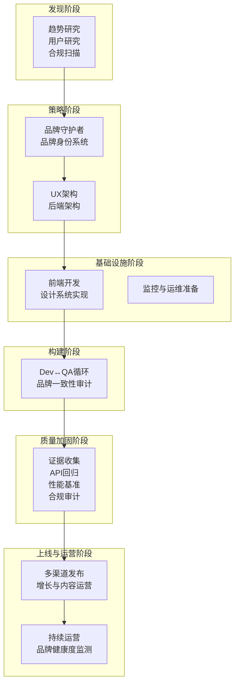
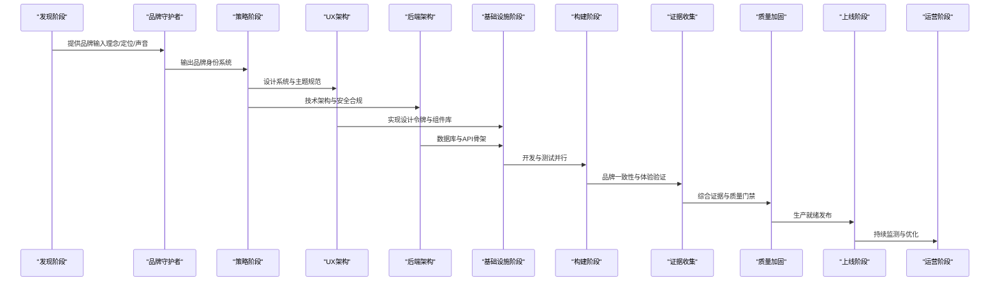
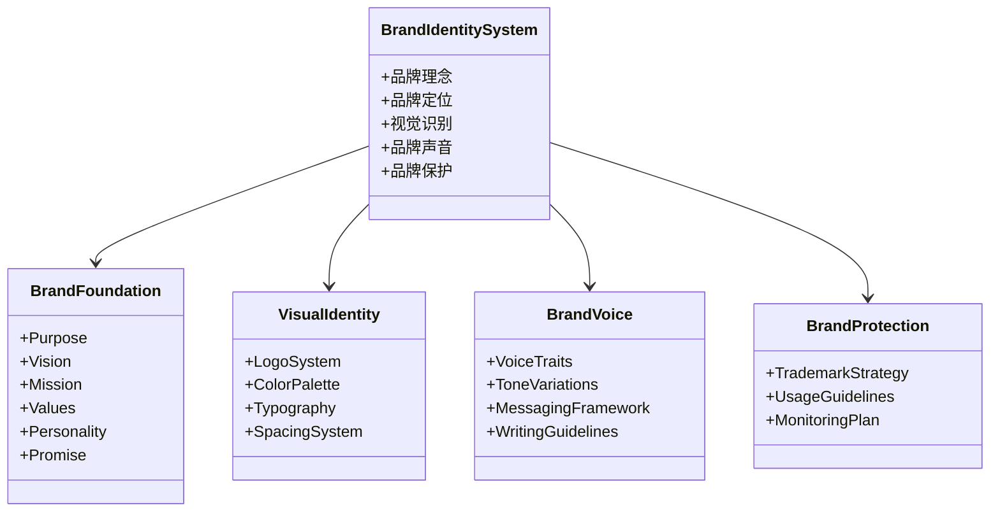
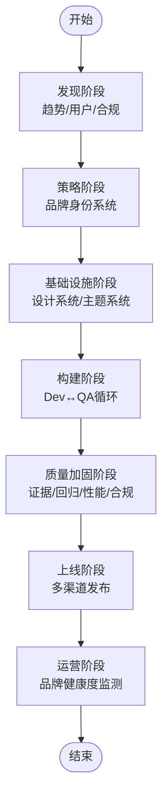
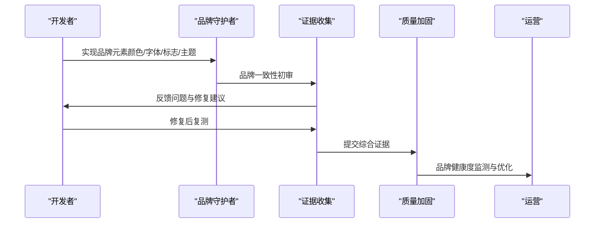
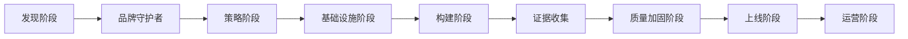

# 品牌守护者

<cite>
**本文引用的文件**
- [design-brand-guardian.md](file://design/design-brand-guardian.md)
- [phase-0-discovery.md](file://strategy/playbooks/phase-0-discovery.md)
- [phase-1-strategy.md](file://strategy/playbooks/phase-1-strategy.md)
- [phase-2-foundation.md](file://strategy/playbooks/phase-2-foundation.md)
- [phase-3-build.md](file://strategy/playbooks/phase-3-build.md)
- [phase-4-hardening.md](file://strategy/playbooks/phase-4-hardening.md)
- [phase-5-launch.md](file://strategy/playbooks/phase-5-launch.md)
- [phase-6-operate.md](file://strategy/playbooks/phase-6-operate.md)
- [social-media-strategist.md](file://marketing/marketing-social-media-strategist.md)
- [evidence-collector.md](file://testing/testing-evidence-collector.md)
</cite>

## 目录
1. [简介](#简介)
2. [项目结构](#项目结构)
3. [核心组件](#核心组件)
4. [架构总览](#架构总览)
5. [详细组件分析](#详细组件分析)
6. [依赖关系分析](#依赖关系分析)
7. [性能与质量保障](#性能与质量保障)
8. [故障排查指南](#故障排查指南)
9. [结论](#结论)
10. [附录](#附录)

## 简介
本文件面向“品牌守护者”代理，系统化阐述其在品牌战略、视觉识别、品牌一致性与保护方面的专业职责与工作方法。文档基于仓库中的品牌守护者角色定义与多阶段策略流程，结合测试与运营实践，给出可落地的品牌体系构建与执行路径，帮助客户建立完整、可扩展且可持续的品牌资产与传播体系。

## 项目结构
品牌守护者作为“设计类”角色，贯穿于多阶段策略流程中，与其他角色协同完成从发现到运营的全生命周期品牌建设：
- 发现阶段：与趋势研究、用户研究、合规扫描等并行，形成品牌基础输入
- 策略阶段：输出品牌身份系统（理念、视觉、声音），并与技术架构对接
- 基础设施阶段：与前端/UX团队协作，实现设计系统与主题系统
- 构建阶段：通过Dev↔QA循环，持续验证品牌一致性与体验质量
- 质量加固阶段：以证据驱动的质量门禁，确保上线前品牌一致性与合规性
- 上线与运营阶段：持续监测品牌健康度，迭代优化

图表来源
- [phase-0-discovery.md:1-179](file://strategy/playbooks/phase-0-discovery.md#L1-L179)
- [phase-1-strategy.md:1-239](file://strategy/playbooks/phase-1-strategy.md#L1-L239)
- [phase-2-foundation.md:1-279](file://strategy/playbooks/phase-2-foundation.md#L1-L279)
- [phase-3-build.md:1-287](file://strategy/playbooks/phase-3-build.md#L1-L287)
- [phase-4-hardening.md:1-333](file://strategy/playbooks/phase-4-hardening.md#L1-L333)
- [phase-5-launch.md:1-278](file://strategy/playbooks/phase-5-launch.md#L1-L278)
- [phase-6-operate.md:1-319](file://strategy/playbooks/phase-6-operate.md#L1-L319)

章节来源
- [phase-0-discovery.md:1-179](file://strategy/playbooks/phase-0-discovery.md#L1-L179)
- [phase-1-strategy.md:1-239](file://strategy/playbooks/phase-1-strategy.md#L1-L239)
- [phase-2-foundation.md:1-279](file://strategy/playbooks/phase-2-foundation.md#L1-L279)
- [phase-3-build.md:1-287](file://strategy/playbooks/phase-3-build.md#L1-L287)
- [phase-4-hardening.md:1-333](file://strategy/playbooks/phase-4-hardening.md#L1-L333)
- [phase-5-launch.md:1-278](file://strategy/playbooks/phase-5-launch.md#L1-L278)
- [phase-6-operate.md:1-319](file://strategy/playbooks/phase-6-operate.md#L1-L319)

## 核心组件
- 品牌身份系统：包含品牌理念（目的、愿景、使命、价值观、个性）、定位（目标受众、差异化、定位语）与视觉语言（标志系统、色彩系统、字体系统）
- 品牌声音与传播：品牌声音特征、语气变体、消息架构（标语、价值主张、关键信息）与写作规范
- 品牌保护与监控：商标策略、使用规范、一致性监测计划
- 设计系统与实现：CSS变量、主题系统、布局与组件体系
- 品牌一致性审计：在构建与运营阶段持续验证品牌元素的一致性与合规性

章节来源
- [design-brand-guardian.md:19-39](file://design/design-brand-guardian.md#L19-L39)
- [design-brand-guardian.md:55-267](file://design/design-brand-guardian.md#L55-L267)

## 架构总览
品牌守护者在多阶段流程中的职责边界与协作关系如下：
- 发现阶段：提供品牌输入（理念、定位、声音），支撑后续架构决策
- 策略阶段：输出品牌身份系统，与UX/后端架构对接，形成可实施的设计与技术方案
- 基础设施阶段：与前端/UX团队协作，落地设计系统与主题系统
- 构建阶段：通过Dev↔QA循环，持续进行品牌一致性审计与修复
- 质量加固阶段：以证据驱动的质量门禁，确保品牌一致性与合规性
- 运营阶段：建立品牌健康度监测与优化机制，持续提升品牌影响力

图表来源
- [phase-1-strategy.md:38-52](file://strategy/playbooks/phase-1-strategy.md#L38-L52)
- [phase-2-foundation.md:107-137](file://strategy/playbooks/phase-2-foundation.md#L107-L137)
- [phase-3-build.md:191-232](file://strategy/playbooks/phase-3-build.md#L191-L232)
- [phase-4-hardening.md:32-60](file://strategy/playbooks/phase-4-hardening.md#L32-L60)
- [phase-5-launch.md:18-104](file://strategy/playbooks/phase-5-launch.md#L18-L104)
- [phase-6-operate.md:73-95](file://strategy/playbooks/phase-6-operate.md#L73-L95)

## 详细组件分析

### 品牌身份系统与视觉传达
- 品牌理念与定位：明确品牌存在的意义、未来愿景、具体使命、核心价值观与人格化表达，并形成清晰的定位语与受众画像
- 视觉识别系统：提供标志系统（主标、横版、叠放、图标等）、最小尺寸与留白要求、使用规范；色彩系统（主色、辅色、中性灰）与可访问性组合；字体层级与网页实现要点
- 品牌声音与传播：定义声音特征（如专业、亲和、智慧等）、语气变体（正式、随性、支持性等）、消息架构（标语、价值主张、关键信息）与写作规范（词汇偏好、语法风格、文化包容）

图表来源
- [design-brand-guardian.md:57-168](file://design/design-brand-guardian.md#L57-L168)
- [design-brand-guardian.md:197-267](file://design/design-brand-guardian.md#L197-L267)

章节来源
- [design-brand-guardian.md:57-168](file://design/design-brand-guardian.md#L57-L168)
- [design-brand-guardian.md:197-267](file://design/design-brand-guardian.md#L197-L267)

### 品牌策略制定与执行流程
- 发现阶段：并行开展趋势研究、用户研究、合规扫描，形成机会验证与约束清单
- 策略阶段：由品牌守护者输出品牌身份系统，与UX/后端架构对接，产出可实施的前端设计系统与后端技术方案
- 基础设施阶段：前端实现设计令牌、主题系统与组件库，后端完成数据库与API骨架
- 构建阶段：Dev↔QA循环中嵌入品牌一致性审计，确保每项功能符合品牌规范
- 质量加固阶段：证据收集、API回归、性能基准与合规审计共同构成最终质量门禁
- 上线与运营：多渠道发布与增长运营，持续监测品牌健康度并迭代优化

图表来源
- [phase-0-discovery.md:17-132](file://strategy/playbooks/phase-0-discovery.md#L17-L132)
- [phase-1-strategy.md:19-182](file://strategy/playbooks/phase-1-strategy.md#L19-L182)
- [phase-2-foundation.md:19-222](file://strategy/playbooks/phase-2-foundation.md#L19-L222)
- [phase-3-build.md:19-43](file://strategy/playbooks/phase-3-build.md#L19-L43)
- [phase-4-hardening.md:32-255](file://strategy/playbooks/phase-4-hardening.md#L32-L255)
- [phase-5-launch.md:18-277](file://strategy/playbooks/phase-5-launch.md#L18-L277)
- [phase-6-operate.md:18-319](file://strategy/playbooks/phase-6-operate.md#L18-L319)

章节来源
- [phase-0-discovery.md:17-132](file://strategy/playbooks/phase-0-discovery.md#L17-L132)
- [phase-1-strategy.md:19-182](file://strategy/playbooks/phase-1-strategy.md#L19-L182)
- [phase-2-foundation.md:19-222](file://strategy/playbooks/phase-2-foundation.md#L19-L222)
- [phase-3-build.md:19-43](file://strategy/playbooks/phase-3-build.md#L19-L43)
- [phase-4-hardening.md:32-255](file://strategy/playbooks/phase-4-hardening.md#L32-L255)
- [phase-5-launch.md:18-277](file://strategy/playbooks/phase-5-launch.md#L18-L277)
- [phase-6-operate.md:18-319](file://strategy/playbooks/phase-6-operate.md#L18-L319)

### 品牌一致性与质量保障
- 在构建阶段，证据收集者负责以截图与交互测试为基础的质量验证，确保品牌元素（颜色、字体、标志、主题切换等）按规范呈现
- 在质量加固阶段，证据收集、API测试、性能基准与合规审计共同组成最终质量门禁，确保品牌一致性与系统稳定性
- 在运营阶段，品牌健康度监测与A/B测试、增长复盘等机制持续优化品牌表现

图表来源
- [phase-3-build.md:24-43](file://strategy/playbooks/phase-3-build.md#L24-L43)
- [evidence-collector.md:41-69](file://testing/testing-evidence-collector.md#L41-L69)
- [phase-4-hardening.md:32-60](file://strategy/playbooks/phase-4-hardening.md#L32-L60)
- [phase-6-operate.md:73-95](file://strategy/playbooks/phase-6-operate.md#L73-L95)

章节来源
- [phase-3-build.md:24-43](file://strategy/playbooks/phase-3-build.md#L24-L43)
- [evidence-collector.md:41-69](file://testing/testing-evidence-collector.md#L41-L69)
- [phase-4-hardening.md:32-60](file://strategy/playbooks/phase-4-hardening.md#L32-L60)
- [phase-6-operate.md:73-95](file://strategy/playbooks/phase-6-operate.md#L73-L95)

### 品牌保护与合规
- 商标策略：明确注册与保护计划，覆盖主要市场与类别
- 使用规范：建立品牌使用清单与违规处理流程
- 监控计划：定期检查品牌一致性，识别潜在风险并预警
- 合规审计：在质量加固阶段进行隐私、安全与可访问性合规验证

章节来源
- [design-brand-guardian.md:251-261](file://design/design-brand-guardian.md#L251-L261)
- [phase-4-hardening.md:113-139](file://strategy/playbooks/phase-4-hardening.md#L113-L139)

### 品牌指南模板与资产标准
- 品牌身份系统模板：包含品牌理念、定位、视觉识别、声音与保护计划的标准格式
- 设计系统变量：提供CSS变量命名约定与主题系统实现要点
- 品牌声音指南：定义声音特征、语气变体与写作规范
- 品牌保护清单：商标策略、使用规范与监控计划

章节来源
- [design-brand-guardian.md:57-168](file://design/design-brand-guardian.md#L57-L168)
- [design-brand-guardian.md:197-267](file://design/design-brand-guardian.md#L197-L267)

### 应用案例与跨渠道传播
- 社交媒体策略：与品牌守护者协作，确保跨平台（LinkedIn、Twitter等）传播的一致性与专业性
- 多渠道发布：在上线阶段协调内容、增长与技术资源，确保品牌在各渠道的统一表达

章节来源
- [social-media-strategist.md:35-39](file://marketing/marketing-social-media-strategist.md#L35-L39)
- [phase-5-launch.md:18-104](file://strategy/playbooks/phase-5-launch.md#L18-L104)

## 依赖关系分析
品牌守护者在多阶段流程中的依赖关系如下：
- 发现阶段：依赖趋势研究、用户研究与合规扫描结果
- 策略阶段：依赖发现阶段输入与架构团队输出
- 基础设施阶段：依赖UX/后端架构规范
- 构建阶段：依赖证据收集与QA反馈
- 质量加固阶段：依赖证据收集、API测试、性能基准与合规审计
- 运营阶段：依赖持续监测与增长运营

图表来源
- [phase-0-discovery.md:17-132](file://strategy/playbooks/phase-0-discovery.md#L17-L132)
- [phase-1-strategy.md:19-182](file://strategy/playbooks/phase-1-strategy.md#L19-L182)
- [phase-2-foundation.md:19-222](file://strategy/playbooks/phase-2-foundation.md#L19-L222)
- [phase-3-build.md:19-43](file://strategy/playbooks/phase-3-build.md#L19-L43)
- [phase-4-hardening.md:32-255](file://strategy/playbooks/phase-4-hardening.md#L32-L255)
- [phase-5-launch.md:18-277](file://strategy/playbooks/phase-5-launch.md#L18-L277)
- [phase-6-operate.md:18-319](file://strategy/playbooks/phase-6-operate.md#L18-L319)

章节来源
- [phase-0-discovery.md:17-132](file://strategy/playbooks/phase-0-discovery.md#L17-L132)
- [phase-1-strategy.md:19-182](file://strategy/playbooks/phase-1-strategy.md#L19-L182)
- [phase-2-foundation.md:19-222](file://strategy/playbooks/phase-2-foundation.md#L19-L222)
- [phase-3-build.md:19-43](file://strategy/playbooks/phase-3-build.md#L19-L43)
- [phase-4-hardening.md:32-255](file://strategy/playbooks/phase-4-hardening.md#L32-L255)
- [phase-5-launch.md:18-277](file://strategy/playbooks/phase-5-launch.md#L18-L277)
- [phase-6-operate.md:18-319](file://strategy/playbooks/phase-6-operate.md#L18-L319)

## 性能与质量保障
- 品牌一致性门槛：在构建与运营阶段设定品牌一致性达标率（如95%以上）
- 质量门禁指标：证据收集、API回归、性能基准与合规审计的综合通过
- 品牌健康度监测：在运营阶段持续跟踪品牌感知、一致性与合规性指标

章节来源
- [phase-3-build.md:234-245](file://strategy/playbooks/phase-3-build.md#L234-L245)
- [phase-4-hardening.md:257-268](file://strategy/playbooks/phase-4-hardening.md#L257-L268)
- [phase-6-operate.md:298-315](file://strategy/playbooks/phase-6-operate.md#L298-L315)

## 故障排查指南
- 品牌元素不一致：通过证据收集的截图与交互测试定位问题，回溯至设计系统或实现细节
- 品牌声音偏差：依据品牌声音指南核对文案，确保语气与特征符合规范
- 合规问题：在质量加固阶段进行隐私、安全与可访问性专项审计，识别并修复问题
- 运营期品牌健康度下降：通过品牌健康度监测与A/B测试，快速定位影响因素并迭代优化

章节来源
- [evidence-collector.md:41-69](file://testing/testing-evidence-collector.md#L41-L69)
- [phase-4-hardening.md:113-139](file://strategy/playbooks/phase-4-hardening.md#L113-L139)
- [phase-6-operate.md:73-95](file://strategy/playbooks/phase-6-operate.md#L73-L95)

## 结论
品牌守护者通过系统化的品牌身份体系与严格的执行流程，确保品牌在理念、视觉与声音层面的一致性，并在技术实现与运营过程中持续监测与优化。依托证据驱动的质量门禁与跨阶段协作机制，品牌守护者能够帮助客户建立可扩展、可持续的品牌资产，提升市场竞争力与品牌影响力。

## 附录
- 品牌指南模板与资产标准可参考品牌守护者提供的品牌身份系统模板与设计系统变量规范
- 品牌保护与合规建议可参考商标策略、使用规范与监控计划

章节来源
- [design-brand-guardian.md:57-168](file://design/design-brand-guardian.md#L57-L168)
- [design-brand-guardian.md:197-267](file://design/design-brand-guardian.md#L197-L267)