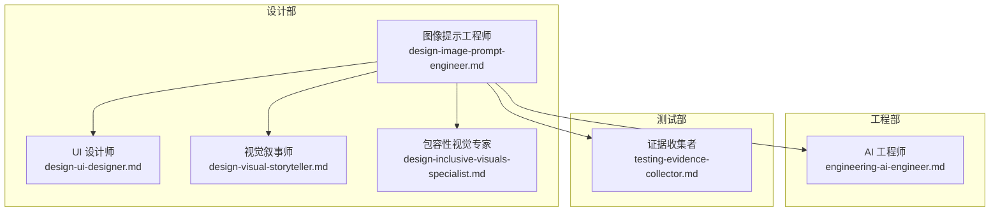
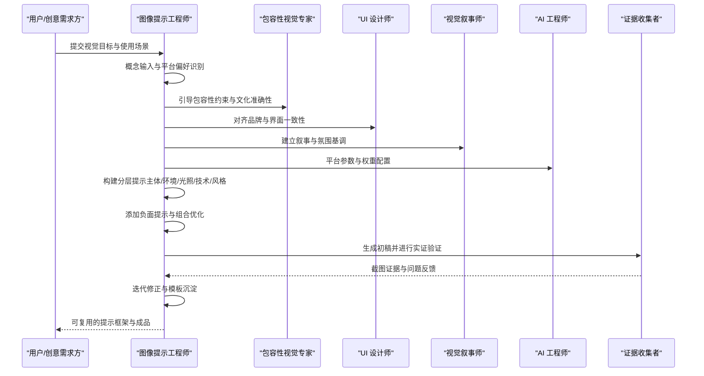
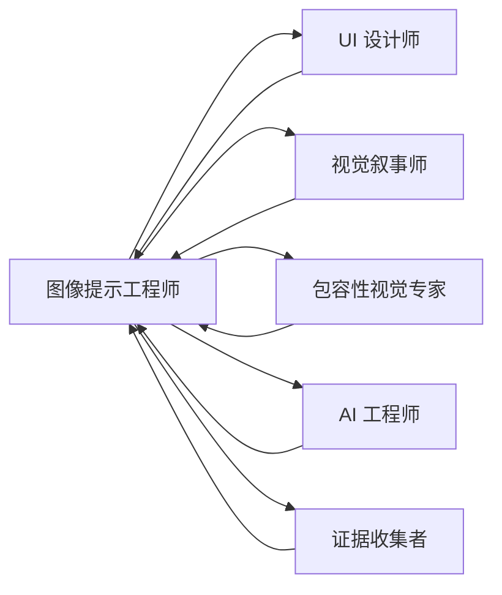

# 图像提示工程师

<cite>
**本文引用的文件**
- [design-image-prompt-engineer.md](file://design/design-image-prompt-engineer.md)
- [README.md](file://README.md)
- [design-ui-designer.md](file://design/design-ui-designer.md)
- [design-visual-storyteller.md](file://design/design-visual-storyteller.md)
- [design-inclusive-visuals-specialist.md](file://design/design-inclusive-visuals-specialist.md)
- [engineering-ai-engineer.md](file://engineering/engineering-ai-engineer.md)
- [testing-evidence-collector.md](file://testing/testing-evidence-collector.md)
</cite>

## 目录
1. [简介](#简介)
2. [项目结构](#项目结构)
3. [核心组件](#核心组件)
4. [架构总览](#架构总览)
5. [详细组件分析](#详细组件分析)
6. [依赖关系分析](#依赖关系分析)
7. [性能考量](#性能考量)
8. [故障排查指南](#故障排查指南)
9. [结论](#结论)
10. [附录](#附录)

## 简介
本文件面向“图像提示工程师”角色，系统化阐述其专业技能与创意能力，涵盖 AI 图像生成、提示词优化、视觉内容创作等核心专长。文档基于仓库中的 agent 定义与工作流，总结提示词设计与优化策略（技术参数设置、风格控制、细节描述等），并提供图像生成工作流程与质量控制标准，确保输出内容符合设计要求与创意目标。同时展示该角色在不同应用场景下的技术实践（产品设计、概念艺术、装饰图案等），并给出图像质量评估与迭代优化方法，帮助持续提升生成效果与创意表现力。

## 项目结构
本仓库是一个多职能的 AI 专家代理集合，图像提示工程师属于“设计部”。其核心文件位于 design 目录下，配套有 UI 设计、视觉叙事、包容性视觉等角色，以及工程与测试领域的支撑角色，形成完整的创意—技术—验证闭环。

图表来源
- [design-image-prompt-engineer.md:1-237](file://design/design-image-prompt-engineer.md#L1-L237)
- [design-ui-designer.md:1-383](file://design/design-ui-designer.md#L1-L383)
- [design-visual-storyteller.md:1-149](file://design/design-visual-storyteller.md#L1-L149)
- [design-inclusive-visuals-specialist.md:1-72](file://design/design-inclusive-visuals-specialist.md#L1-L72)
- [engineering-ai-engineer.md:1-146](file://engineering/engineering-ai-engineer.md#L1-L146)
- [testing-evidence-collector.md:1-211](file://testing/testing-evidence-collector.md#L1-L211)

章节来源
- [README.md:103-117](file://README.md#L103-L117)

## 核心组件
- 图像提示工程师：专注于将视觉概念转化为精确、可执行的提示语言，适配多种 AI 平台（Midjourney、DALL-E、Stable Diffusion、Flux 等），平衡技术规格与艺术方向，产出专业级摄影风格的 AI 图像。
- UI 设计师：负责设计系统、组件库与像素级界面构建，强调一致性、可访问性与开发者友好交付。
- 视觉叙事师：擅长将复杂信息转化为引人入胜的视觉故事，覆盖视频、动画、交互媒体与数据可视化。
- 包容性视觉专家：专门对抗 AI 模型偏见，确保生成内容在文化、身份与物理现实层面的真实与尊重。
- AI 工程师：提供模型开发、部署与伦理安全的工程能力，保障生成系统的稳定性与可扩展性。
- 证据收集者：以截图与实证为依据的质量把关者，确保最终成果与规范一致、功能可用。

章节来源
- [design-image-prompt-engineer.md:11-38](file://design/design-image-prompt-engineer.md#L11-L38)
- [design-ui-designer.md:11-39](file://design/design-ui-designer.md#L11-L39)
- [design-visual-storyteller.md:11-38](file://design/design-visual-storyteller.md#L11-L38)
- [design-inclusive-visuals-specialist.md:11-22](file://design/design-inclusive-visuals-specialist.md#L11-L22)
- [engineering-ai-engineer.md:11-38](file://engineering/engineering-ai-engineer.md#L11-L38)
- [testing-evidence-collector.md:11-38](file://testing/testing-evidence-collector.md#L11-L38)

## 架构总览
图像提示工程师的工作流贯穿“概念输入—参考分析—提示构造—优化迭代—平台适配—质量验证”的闭环，与 UI 设计、视觉叙事、包容性视觉及工程测试形成跨职能协作。

图表来源
- [design-image-prompt-engineer.md:139-162](file://design/design-image-prompt-engineer.md#L139-L162)
- [design-inclusive-visuals-specialist.md:48-53](file://design/design-inclusive-visuals-specialist.md#L48-L53)
- [design-ui-designer.md:228-254](file://design/design-ui-designer.md#L228-L254)
- [design-visual-storyteller.md:77-107](file://design/design-visual-storyteller.md#L77-L107)
- [engineering-ai-engineer.md:74-104](file://engineering/engineering-ai-engineer.md#L74-L104)
- [testing-evidence-collector.md:41-55](file://testing/testing-evidence-collector.md#L41-L55)

## 详细组件分析

### 组件一：提示结构框架与优化策略
- 主体描述层：明确主焦点、属性、姿态、材质与比例关系。
- 环境与场景层：地点类型、环境细节、背景处理、大气条件。
- 光照规范层：光源类型、方向、质量与色温。
- 技术摄影层：视角、焦距效应、景深与曝光风格。
- 风格与美学层：摄影类型、时代/时期风格、后期与参考摄影师。

提示优化要点：
- 结构化分层：按“主体—环境—光照—技术—风格”顺序组织，避免歧义。
- 使用具体术语：以摄影专业术语替代模糊描述。
- 负面提示：在支持的平台上加入负面约束，排除不想要的元素。
- 平台适配：针对 Midjourney、DALL-E、SD、Flux 等平台语法与权重进行调整。
- 可重复性：记录成功模式，便于后续复用与快速迭代。

章节来源
- [design-image-prompt-engineer.md:56-87](file://design/design-image-prompt-engineer.md#L56-L87)
- [design-image-prompt-engineer.md:41-53](file://design/design-image-prompt-engineer.md#L41-L53)
- [design-image-prompt-engineer.md:183-188](file://design/design-image-prompt-engineer.md#L183-L188)

### 组件二：工作流程与质量控制
- 步骤一：概念输入（目标、用途、平台偏好、风格参考、品牌要求、技术指标）。
- 步骤二：参考分析（提取灯光、构图、风格元素；注意色彩、纹理与氛围）。
- 步骤三：提示构造（遵循结构框架，加入平台语法与权重，补充风格修饰与质量增强）。
- 步骤四：提示优化（审查歧义、添加负面提示、变体测试、记录成功模式）。
- 质量度量：概念匹配率、结果一致性、技术摄影元素准确呈现、风格与品牌契合度、最小迭代次数、可复现性、商业可用性。

章节来源
- [design-image-prompt-engineer.md:137-179](file://design/design-image-prompt-engineer.md#L137-L179)

### 组件三：平台特定优化与高级技巧
- Midjourney：参数使用（如宽高比、版本、风格、混沌）、多提示加权。
- DALL-E：自然语言优化、风格混合技巧。
- Stable Diffusion：令牌加权、嵌入引用、LoRA 集成。
- Flux：强调自然语言描述与写实性。
- 高级提示模式：迭代精炼、风格迁移、混合风格、情境化叙事。

章节来源
- [design-image-prompt-engineer.md:181-200](file://design/design-image-prompt-engineer.md#L181-L200)

### 组件四：跨职能协作与交付
- 与 UI 设计师协作：确保生成物与设计系统、品牌一致性、可复用组件风格一致。
- 与视觉叙事师协作：建立叙事弧线、情感旅程与跨平台适应策略。
- 与包容性视觉专家协作：消除刻板印象、地理与文化错位、克隆面孔、伪文字与符号等偏见。
- 与 AI 工程师协作：模型部署、推理延迟、监控与成本控制。
- 与证据收集者协作：以截图与实证为依据的质量把关，确保功能与规范一致。

章节来源
- [design-ui-designer.md:228-254](file://design/design-ui-designer.md#L228-L254)
- [design-visual-storyteller.md:77-107](file://design/design-visual-storyteller.md#L77-L107)
- [design-inclusive-visuals-specialist.md:48-53](file://design/design-inclusive-visuals-specialist.md#L48-L53)
- [engineering-ai-engineer.md:74-104](file://engineering/engineering-ai-engineer.md#L74-L104)
- [testing-evidence-collector.md:41-55](file://testing/testing-evidence-collector.md#L41-L55)

### 组件五：应用示例与模板
- 人物肖像：强调主体、姿态、背景、灯光、相机与风格，结合色彩与摄影参考。
- 产品摄影：突出材质与细节、表面与背景、灯光布置、相机角度与景深、品牌风格与后处理。
- 环境人像：自然光线、时间与天气、前景中景背景层次、镜头与光圈、构图与色彩、摄影参考与真实感。

章节来源
- [design-image-prompt-engineer.md:201-233](file://design/design-image-prompt-engineer.md#L201-L233)

## 依赖关系分析
图像提示工程师在实际工作中依赖以下角色与能力：
- 设计系统与品牌一致性：UI 设计师提供的设计令牌、组件库与响应式框架。
- 视觉叙事与跨平台策略：视觉叙事师的故事弧、情感节奏与平台适配。
- 包容性与真实性：包容性视觉专家对文化、身份与物理现实的约束。
- 模型与平台工程：AI 工程师的模型训练、部署与监控。
- 实证质量把关：证据收集者的截图证据与规范对比。

图表来源
- [design-image-prompt-engineer.md:13-38](file://design/design-image-prompt-engineer.md#L13-L38)
- [design-ui-designer.md:228-254](file://design/design-ui-designer.md#L228-L254)
- [design-visual-storyteller.md:77-107](file://design/design-visual-storyteller.md#L77-L107)
- [design-inclusive-visuals-specialist.md:48-53](file://design/design-inclusive-visuals-specialist.md#L48-L53)
- [engineering-ai-engineer.md:74-104](file://engineering/engineering-ai-engineer.md#L74-L104)
- [testing-evidence-collector.md:41-55](file://testing/testing-evidence-collector.md#L41-L55)

## 性能考量
- 提示效率：通过结构化分层与平台语法优化，减少迭代次数，提高成功率。
- 成本控制：在工程侧通过模型压缩、推理优化与监控告警，降低生成成本与延迟。
- 可靠性：建立负面提示库与模板沉淀，提升一致性与可复现性。
- 可扩展性：跨平台适配与模板化流程，便于规模化生成与品牌资产沉淀。

## 故障排查指南
- 常见问题与症状
  - 概念偏差：主体与背景不符、灯光与阴影不一致、风格与品牌不匹配。
  - 技术错误：景深、焦距、曝光风格与摄影原理相悖。
  - 平台差异：提示语法不兼容或权重未生效。
  - 偏见与失真：刻板印象、地理/文化错位、伪文字与符号、克隆面孔。
- 排查步骤
  - 复核提示结构：确认主体、环境、光照、技术、风格分层是否完整。
  - 加入负面提示：屏蔽不想要的元素与风格。
  - 变体测试：对关键参数进行小步快跑的 A/B 测试。
  - 截图验证：使用证据收集者的流程，对比规范与实证。
  - 回归模板：检查是否沿用了已验证的成功模式。
- 改进措施
  - 沉淀失败案例与修复路径，形成知识库。
  - 与包容性视觉专家共同完善负面提示库。
  - 与 AI 工程师协作优化模型与部署策略。

章节来源
- [design-image-prompt-engineer.md:157-162](file://design/design-image-prompt-engineer.md#L157-L162)
- [testing-evidence-collector.md:100-118](file://testing/testing-evidence-collector.md#L100-L118)
- [design-inclusive-visuals-specialist.md:23-28](file://design/design-inclusive-visuals-specialist.md#L23-L28)

## 结论
图像提示工程师通过系统化的提示结构、平台适配与质量控制，将抽象视觉概念转化为高质量、可复用的 AI 图像资产。在设计系统、视觉叙事、包容性与工程测试的协同下，能够稳定地满足产品设计、概念艺术与装饰图案等多样化场景的需求，并持续优化生成效果与创意表现力。

## 附录
- 关键术语速查
  - 主体/环境/光照/技术/风格：提示分层的五大维度。
  - 负面提示：用于排除不期望元素的约束。
  - 平台语法：针对 Midjourney、DALL-E、SD、Flux 的参数与权重用法。
  - 模板沉淀：将成功模式固化为可复用的提示模板。
- 推荐阅读
  - [design-image-prompt-engineer.md:1-237](file://design/design-image-prompt-engineer.md#L1-L237)
  - [design-ui-designer.md:228-328](file://design/design-ui-designer.md#L228-L328)
  - [design-visual-storyteller.md:77-146](file://design/design-visual-storyteller.md#L77-L146)
  - [design-inclusive-visuals-specialist.md:48-72](file://design/design-inclusive-visuals-specialist.md#L48-L72)
  - [engineering-ai-engineer.md:74-143](file://engineering/engineering-ai-engineer.md#L74-L143)
  - [testing-evidence-collector.md:119-174](file://testing/testing-evidence-collector.md#L119-L174)