# 视觉故事讲述者

<cite>
**本文引用的文件**
- [视觉故事讲述者.md](file://design/design-visual-storyteller.md)
- [图像提示工程师.md](file://design/design-image-prompt-engineer.md)
- [包容性视觉专家.md](file://design/design-inclusive-visuals-specialist.md)
- [UI 设计师.md](file://design/design-ui-designer.md)
- [叙事设计师.md](file://game-development/narrative-designer.md)
- [阶段 0：情报与发现.md](file://strategy/playbooks/phase-0-discovery.md)
- [阶段 1：战略与架构.md](file://strategy/playbooks/phase-1-strategy.md)
- [示例工作流：书籍章节.md](file://examples/workflow-book-chapter.md)
- [示例工作流：落地页冲刺.md](file://examples/workflow-landing-page.md)
</cite>

## 目录
1. [简介](#简介)
2. [项目结构](#项目结构)
3. [核心组件](#核心组件)
4. [架构总览](#架构总览)
5. [组件详解](#组件详解)
6. [依赖关系分析](#依赖关系分析)
7. [性能考量](#性能考量)
8. [故障排除指南](#故障排除指南)
9. [结论](#结论)
10. [附录](#附录)

## 简介
本文件面向“视觉故事讲述者”代理，系统化梳理其在视觉叙事设计、情感表达、故事板制作、多媒体内容创作与跨平台适配等方面的专长，并结合仓库内其他设计与叙事相关代理（如图像提示工程师、包容性视觉专家、UI 设计师、叙事设计师）形成协同能力矩阵。文档同时给出可复用的视觉故事创作模板与标准化流程，覆盖从策略制定到生产优化的全链路方法论，并提供效果评估与受众反馈分析建议，帮助团队构建稳定高效的视觉故事体系。

## 项目结构
本仓库以“代理类型”为维度组织，视觉故事讲述者位于设计域（design），并与以下相关代理存在协作关系：
- 图像提示工程师：负责将视觉概念转化为可执行的 AI 提示词，支撑视觉素材生成与风格一致性
- 包容性视觉专家：确保生成内容在文化、身份与物理现实层面真实、尊重且无偏见
- UI 设计师：提供设计系统与交互规范，保障视觉叙事在界面中的落地与可访问性
- 叙事设计师：提供成熟的故事系统与分支设计方法论，可迁移至视频/动画/互动媒体的叙事结构

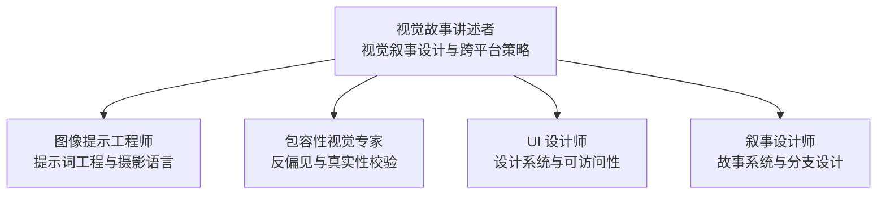

图表来源
- [视觉故事讲述者.md:1-149](file://design/design-visual-storyteller.md#L1-L149)
- [图像提示工程师.md:1-237](file://design/design-image-prompt-engineer.md#L1-L237)
- [包容性视觉专家.md:1-72](file://design/design-inclusive-visuals-specialist.md#L1-L72)
- [UI 设计师.md:1-383](file://design/design-ui-designer.md#L1-L383)
- [叙事设计师.md:1-244](file://game-development/narrative-designer.md#L1-L244)

章节来源
- [视觉故事讲述者.md:1-149](file://design/design-visual-storyteller.md#L1-L149)

## 核心组件
- 视觉叙事开发：故事弧、角色塑造、冲突识别、解决方案设计、情感旅程与视觉节奏
- 多媒体内容创作：视频脚本与分镜、动画与动效、摄影指导、交互媒体
- 信息设计与数据可视化：数据叙事、信息架构、渐进式披露
- 跨平台适应：针对 Instagram Stories、YouTube、TikTok、LinkedIn、Pinterest、网站等平台的格式与算法优化

章节来源
- [视觉故事讲述者.md:47-76](file://design/design-visual-storyteller.md#L47-L76)

## 架构总览
下图展示了视觉故事讲述者从“策略—规划—创作—生产—优化”的闭环流程，以及与图像提示工程师、包容性视觉专家、UI 设计师、叙事设计师的协作关系。

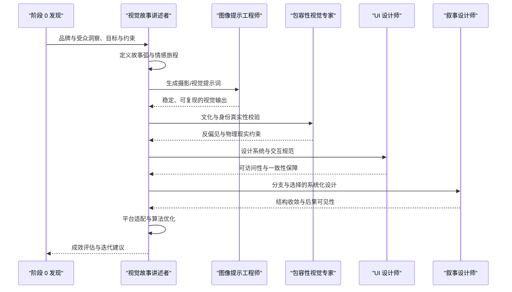

图表来源
- [阶段 0：情报与发现.md:1-179](file://strategy/playbooks/phase-0-discovery.md#L1-L179)
- [视觉故事讲述者.md:77-107](file://design/design-visual-storyteller.md#L77-L107)
- [图像提示工程师.md:137-162](file://design/design-image-prompt-engineer.md#L137-L162)
- [包容性视觉专家.md:48-53](file://design/design-inclusive-visuals-specialist.md#L48-L53)
- [UI 设计师.md:228-254](file://design/design-ui-designer.md#L228-L254)
- [叙事设计师.md:176-203](file://game-development/narrative-designer.md#L176-L203)

## 组件详解

### 视觉叙事开发
- 故事弧：起承转合的结构化设计，明确“问题—冲突—解决”的路径
- 角色塑造：以用户/客户为主角，建立情感共鸣与代入感
- 冲突识别：聚焦痛点或挑战，驱动故事前进
- 解决方案：品牌/产品作为“解决方案”，自然融入叙事
- 情感旅程：标注情绪高峰与低谷，配合视觉节奏强化记忆点
- 视觉节奏：通过镜头语言、转场与留白控制观看体验

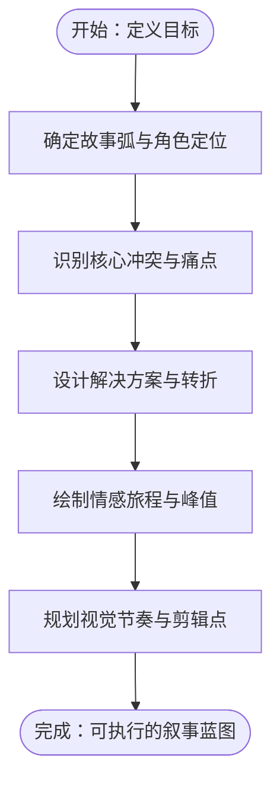

图表来源
- [视觉故事讲述者.md:49-56](file://design/design-visual-storyteller.md#L49-L56)

章节来源
- [视觉故事讲述者.md:49-56](file://design/design-visual-storyteller.md#L49-L56)

### 多媒体内容创作
- 视频脚本与分镜：基于故事弧拆解关键帧，标注拍摄要点与情绪节点
- 动画与动效：原则动画、微交互与解释型动画，提升理解效率
- 摄影指导：概念开发、氛围板与风格化方向
- 交互媒体：滚动叙事、交互式信息图与网页体验

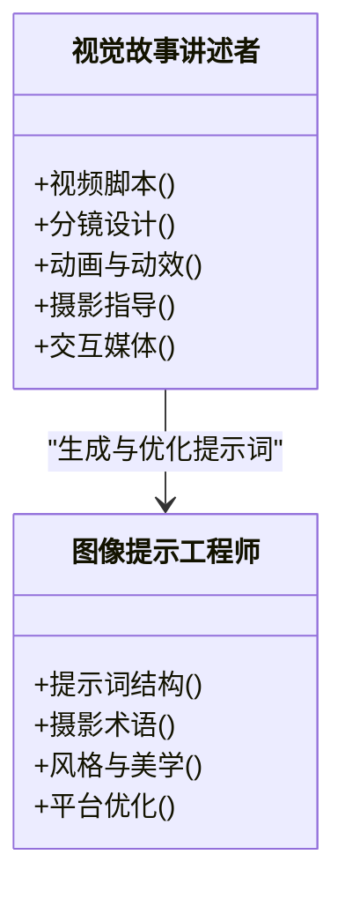

图表来源
- [视觉故事讲述者.md:57-62](file://design/design-visual-storyteller.md#L57-L62)
- [图像提示工程师.md:54-87](file://design/design-image-prompt-engineer.md#L54-L87)

章节来源
- [视觉故事讲述者.md:57-62](file://design/design-visual-storyteller.md#L57-L62)
- [图像提示工程师.md:54-87](file://design/design-image-prompt-engineer.md#L54-L87)

### 信息设计与数据可视化
- 数据叙事：从复杂信息中提炼主线，建立视觉层级与叙述逻辑
- 图表与图形：按数据类型选择合适可视化形式
- 渐进式披露：分层呈现信息，降低认知负荷

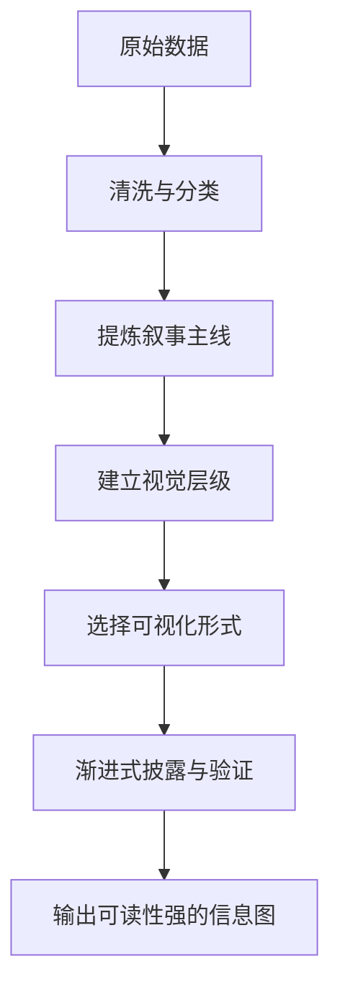

图表来源
- [视觉故事讲述者.md:63-68](file://design/design-visual-storyteller.md#L63-L68)

章节来源
- [视觉故事讲述者.md:63-68](file://design/design-visual-storyteller.md#L63-L68)

### 跨平台适应
- 平台特性：垂直/水平格式、算法偏好、时长限制、互动方式差异
- 品牌一致性：统一视觉语言与声音，确保多触点连贯
- 本地化与文化敏感：在不同市场调整符号、色彩与叙事角度

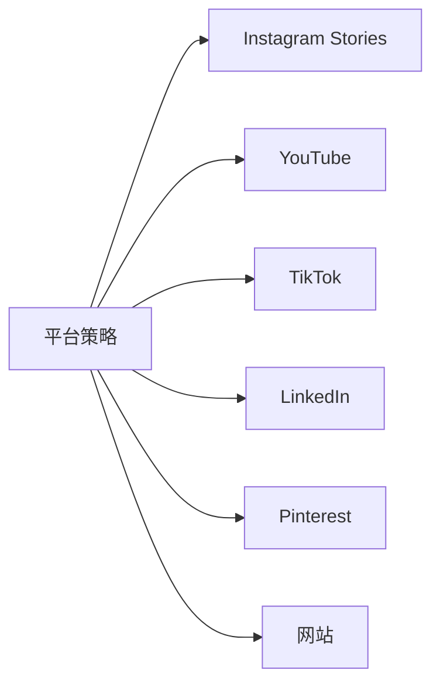

图表来源
- [视觉故事讲述者.md:69-76](file://design/design-visual-storyteller.md#L69-L76)

章节来源
- [视觉故事讲述者.md:69-76](file://design/design-visual-storyteller.md#L69-L76)

### 与 UI 设计师的协作
- 设计系统：颜色、字体、间距、阴影与过渡的系统化落地
- 可访问性：对比度、键盘导航、焦点管理与屏幕阅读器支持
- 响应式：移动端优先，断点与布局自适应
- 开发交接：精确规格、组件文档与资产准备

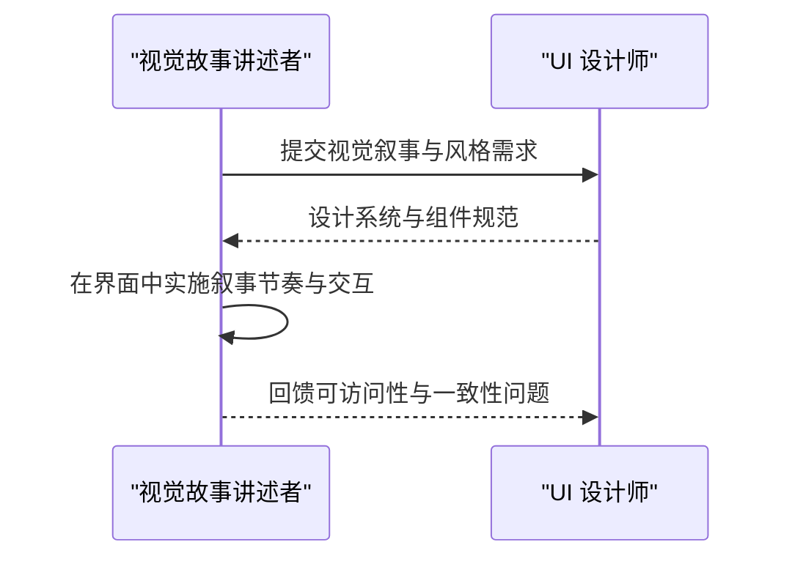

图表来源
- [UI 设计师.md:228-254](file://design/design-ui-designer.md#L228-L254)
- [视觉故事讲述者.md:102-106](file://design/design-visual-storyteller.md#L102-L106)

章节来源
- [UI 设计师.md:228-254](file://design/design-ui-designer.md#L228-L254)
- [视觉故事讲述者.md:102-106](file://design/design-visual-storyteller.md#L102-L106)

### 与图像提示工程师的协作
- 提示词结构：主体、环境、光照、技术参数、风格与美学
- 平台优化：针对 Midjourney、DALL·E、Stable Diffusion、Flux 的语法与权重
- 摄影术语：光位、景深、曝光风格与后处理
- 风格参考：摄影师与摄影运动的风格迁移

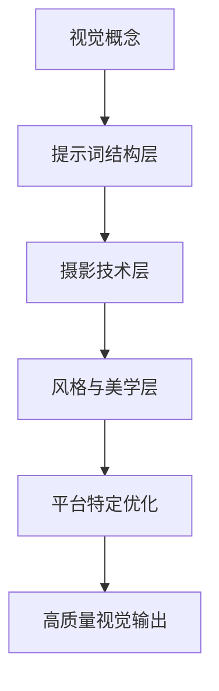

图表来源
- [图像提示工程师.md:137-162](file://design/design-image-prompt-engineer.md#L137-L162)
- [图像提示工程师.md:54-87](file://design/design-image-prompt-engineer.md#L54-L87)

章节来源
- [图像提示工程师.md:137-162](file://design/design-image-prompt-engineer.md#L137-L162)
- [图像提示工程师.md:54-87](file://design/design-image-prompt-engineer.md#L54-L87)

### 与包容性视觉专家的协作
- 反偏见约束：避免克隆面孔、虚构文本与刻板印象
- 物理现实：视频生成中对服装、头发与辅具的物理一致性
- 社会学准确性：确保生成内容符合被描绘群体的真实经验

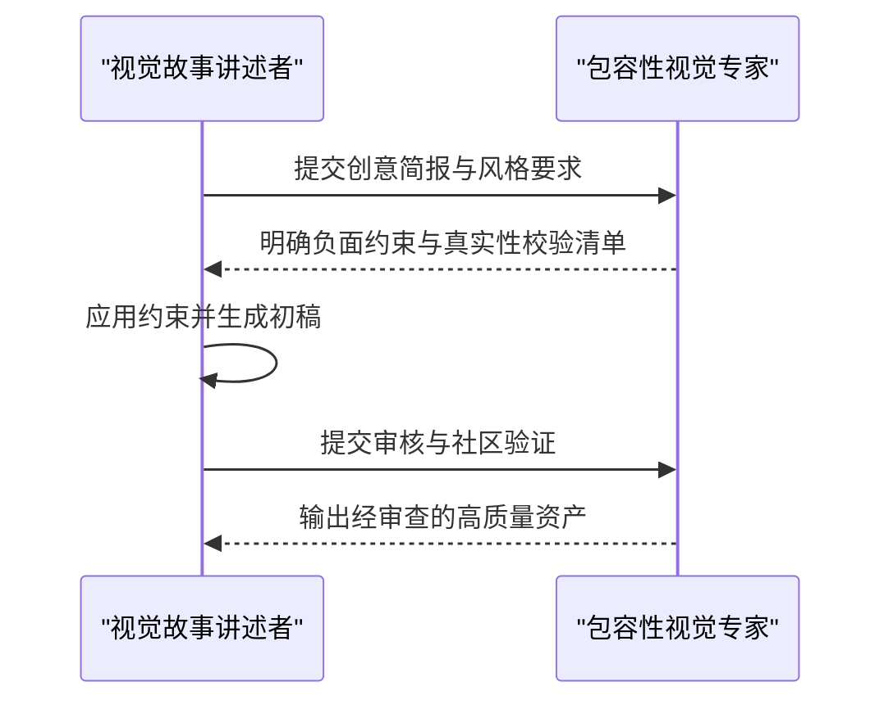

图表来源
- [包容性视觉专家.md:48-53](file://design/design-inclusive-visuals-specialist.md#L48-L53)
- [包容性视觉专家.md:23-28](file://design/design-inclusive-visuals-specialist.md#L23-L28)

章节来源
- [包容性视觉专家.md:48-53](file://design/design-inclusive-visuals-specialist.md#L48-L53)
- [包容性视觉专家.md:23-28](file://design/design-inclusive-visuals-specialist.md#L23-L28)

### 与叙事设计师的协作
- 故事系统：将“有意义的选择”与“可感知的后果”嵌入交互叙事
- 环境叙事：通过道具、光影与音效传达背景故事
- 世界构建：层级化（表面/探索者/深度）的叙事层次

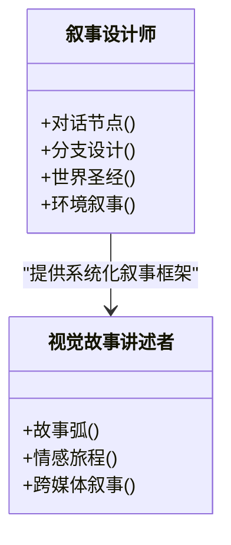

图表来源
- [叙事设计师.md:176-203](file://game-development/narrative-designer.md#L176-L203)
- [视觉故事讲述者.md:49-56](file://design/design-visual-storyteller.md#L49-L56)

章节来源
- [叙事设计师.md:176-203](file://game-development/narrative-designer.md#L176-L203)
- [视觉故事讲述者.md:49-56](file://design/design-visual-storyteller.md#L49-L56)

## 依赖关系分析
- 与阶段 0 发现的耦合：在启动阶段即整合市场、用户与合规情报，确保视觉叙事目标与资源约束一致
- 与阶段 1 战略的耦合：在架构与设计系统层面，确保视觉叙事与品牌、技术与预算相匹配
- 与落地页/书籍章节工作流的耦合：可借鉴其“并行启动—合并点—反馈循环—交付”的模式，用于视觉内容的快速迭代

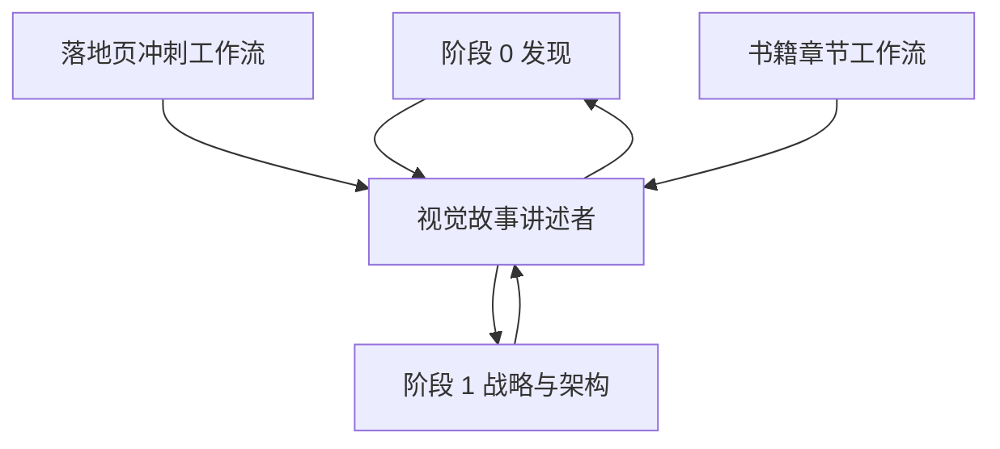

图表来源
- [阶段 0：情报与发现.md:1-179](file://strategy/playbooks/phase-0-discovery.md#L1-L179)
- [阶段 1：战略与架构.md:1-239](file://strategy/playbooks/phase-1-strategy.md#L1-L239)
- [示例工作流：落地页冲刺.md:1-120](file://examples/workflow-landing-page.md#L1-L120)
- [示例工作流：书籍章节.md:1-56](file://examples/workflow-book-chapter.md#L1-L56)

章节来源
- [阶段 0：情报与发现.md:1-179](file://strategy/playbooks/phase-0-discovery.md#L1-L179)
- [阶段 1：战略与架构.md:1-239](file://strategy/playbooks/phase-1-strategy.md#L1-L239)
- [示例工作流：落地页冲刺.md:1-120](file://examples/workflow-landing-page.md#L1-L120)
- [示例工作流：书籍章节.md:1-56](file://examples/workflow-book-chapter.md#L1-L56)

## 性能考量
- 制作效率：通过系统化的提示词模板与设计系统，减少反复修改与返工
- 质量稳定性：建立负面约束库与风格参考库，确保跨平台一致性
- 可访问性：在设计与生成阶段即纳入可访问性标准，降低后期修正成本
- 数据驱动：以成功案例与失败教训沉淀为记忆库，持续优化提示词与叙事结构

## 故障排除指南
- 视觉内容不符合品牌调性
  - 检查设计系统与品牌指南是否在创作初期被严格执行
  - 引入 UI 设计师进行一致性复核
- 文化或身份表达不当
  - 使用包容性视觉专家的负面约束清单与审查流程
- 信息过载或理解困难
  - 回归数据叙事主线，采用渐进式披露与清晰的视觉层级
- 跨平台表现不佳
  - 对照各平台的格式、时长与算法偏好进行针对性优化

章节来源
- [视觉故事讲述者.md:39-46](file://design/design-visual-storyteller.md#L39-L46)
- [包容性视觉专家.md:23-28](file://design/design-inclusive-visuals-specialist.md#L23-L28)
- [UI 设计师.md:40-53](file://design/design-ui-designer.md#L40-L53)

## 结论
视觉故事讲述者的核心价值在于将“故事结构”与“视觉语言”深度融合，并通过与图像提示工程师、包容性视觉专家、UI 设计师、叙事设计师的协同，形成从策略到落地的一体化能力。依托阶段 0/1 的方法论与工作流模板，团队可在保证质量与可访问性的前提下，高效产出跨平台、有感染力的视觉故事内容，并通过数据与反馈持续优化叙事效果。

## 附录

### 视觉故事创作模板与流程
- 策略阶段
  - 明确品牌目标、受众画像与传播目标
  - 收集现有视觉资产与品牌叙事资料
- 规划阶段
  - 定义故事弧、角色与冲突
  - 识别关键视觉隐喻与象征元素
  - 制定跨平台内容适配策略
- 创作阶段
  - 产出故事板与视觉概念
  - 生成多媒体内容规格与信息架构
  - 设计交互与动画元素
- 生产与优化阶段
  - 确保可访问性合规
  - 针对平台算法进行优化
  - 进行设备与平台测试
  - 实施文化敏感性与包容性审查

章节来源
- [视觉故事讲述者.md:77-107](file://design/design-visual-storyteller.md#L77-L107)

### 成功指标参考
- 视觉内容参与度提升 50%+
- 视觉叙事内容完成率达 80%+
- 品牌识别度提升 35%+
- 视觉内容相较纯文本内容表现提升 3 倍
- 跨 5+ 平台部署成功
- 100% 视觉内容满足可访问性标准
- 视觉内容创作时间缩短 40%
- 首轮批准率 95%

章节来源
- [视觉故事讲述者.md:115-126](file://design/design-visual-storyteller.md#L115-L126)