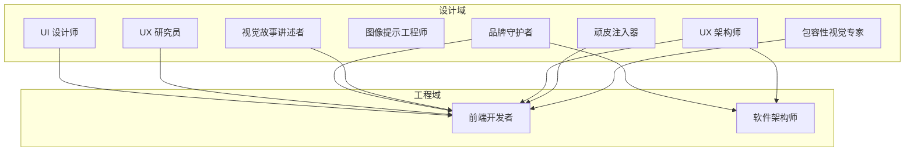
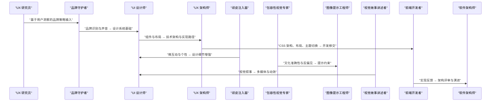
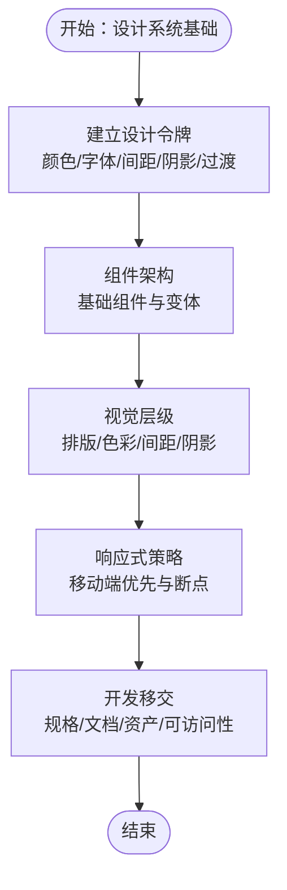
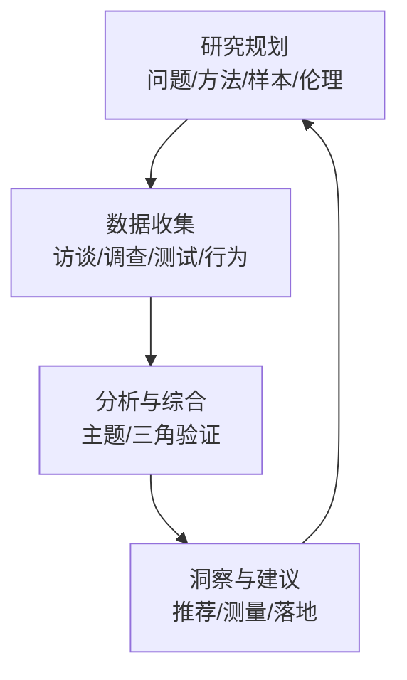
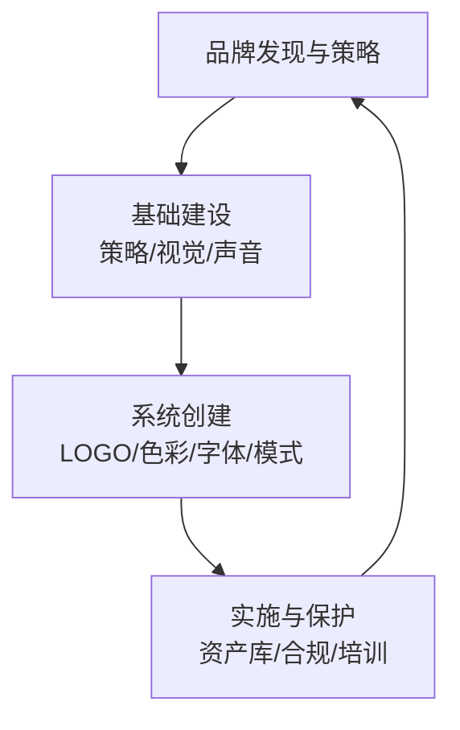
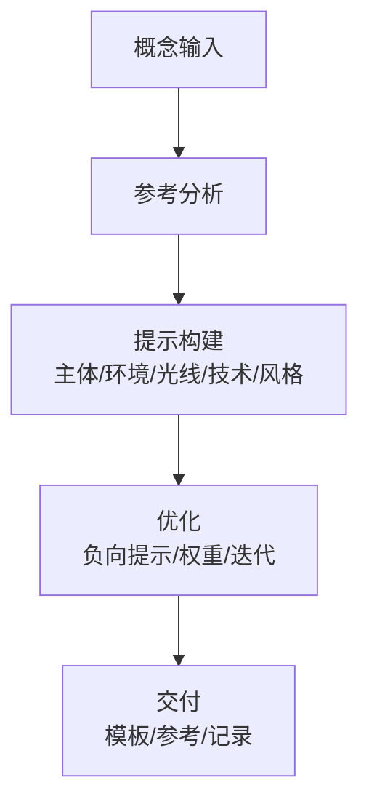
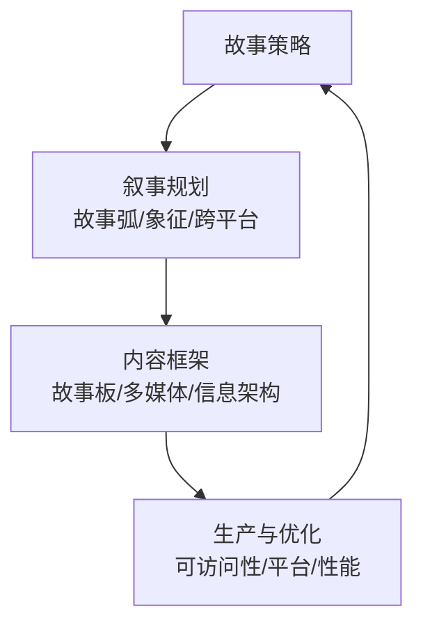
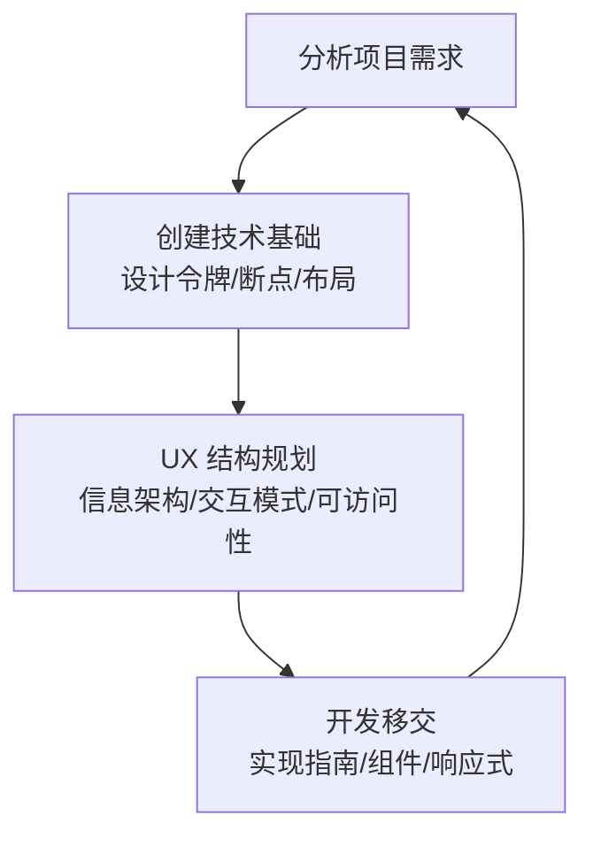
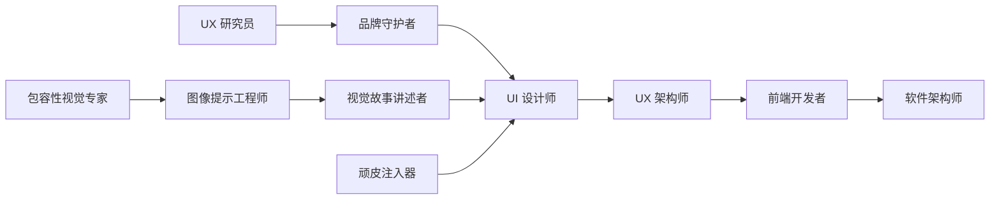

# 设计代理

<cite>
**本文引用的文件**
- [design-ui-designer.md](file://design/design-ui-designer.md)
- [design-ux-researcher.md](file://design/design-ux-researcher.md)
- [design-brand-guardian.md](file://design/design-brand-guardian.md)
- [design-image-prompt-engineer.md](file://design/design-image-prompt-engineer.md)
- [design-visual-storyteller.md](file://design/design-visual-storyteller.md)
- [design-ux-architect.md](file://design/design-ux-architect.md)
- [design-whimsy-injector.md](file://design/design-whimsy-injector.md)
- [design-inclusive-visuals-specialist.md](file://design/design-inclusive-visuals-specialist.md)
- [README.md](file://README.md)
- [engineering-frontend-developer.md](file://engineering/engineering-frontend-developer.md)
- [engineering-software-architect.md](file://engineering/engineering-software-architect.md)
</cite>

## 目录
1. [简介](#简介)
2. [项目结构](#项目结构)
3. [核心组件](#核心组件)
4. [架构总览](#架构总览)
5. [详细组件分析](#详细组件分析)
6. [依赖关系分析](#依赖关系分析)
7. [性能考量](#性能考量)
8. [故障排查指南](#故障排查指南)
9. [结论](#结论)
10. [附录](#附录)

## 简介
本文件系统化梳理“设计代理”体系，围绕五个专业化设计代理（UI 设计师、UX 研究员、品牌守护者、图像提示工程师、视觉故事讲述者）进行深入解析，覆盖设计专长、创作流程、工具使用与交付标准；阐述设计代理与工程代理的协作机制，确保设计的可实现性与技术可行性；提供设计系统的构建指南（设计原则、组件库管理、一致性保障）；给出设计验证与测试方法，以确保方案满足用户体验与商业目标；最后展示设计代理在产品全生命周期中的价值与定位。

## 项目结构
该仓库采用按职能划分的模块化组织方式：设计、工程、营销、销售、产品、项目管理、测试、支持、空间计算、游戏开发、学术等多领域代理。设计域包含多个专业代理，每个代理均以 Markdown 文件形式呈现，包含身份设定、使命、规则、工作流、交付模板与成功度量等要素。

图表来源
- [design-ui-designer.md:1-383](file://design/design-ui-designer.md#L1-L383)
- [design-ux-researcher.md:1-329](file://design/design-ux-researcher.md#L1-L329)
- [design-brand-guardian.md:1-322](file://design/design-brand-guardian.md#L1-L322)
- [design-image-prompt-engineer.md:1-237](file://design/design-image-prompt-engineer.md#L1-L237)
- [design-visual-storyteller.md:1-149](file://design/design-visual-storyteller.md#L1-L149)
- [design-ux-architect.md:1-469](file://design/design-ux-architect.md#L1-L469)
- [design-whimsy-injector.md:1-438](file://design/design-whimsy-injector.md#L1-L438)
- [design-inclusive-visuals-specialist.md:1-72](file://design/design-inclusive-visuals-specialist.md#L1-L72)
- [engineering-frontend-developer.md:1-225](file://engineering/engineering-frontend-developer.md#L1-L225)
- [engineering-software-architect.md:1-82](file://engineering/engineering-software-architect.md#L1-L82)

章节来源
- [README.md:103-117](file://README.md#L103-L117)

## 核心组件
本节对五个设计代理进行要点提炼与对比，帮助快速把握各自职责边界与协同方式。

- UI 设计师
  - 专长：视觉设计系统、组件库、像素级界面、暗色主题与可访问性
  - 流程：设计系统基础 → 组件架构 → 视觉层级 → 开发移交
  - 工具：CSS 变量、网格/响应式框架、可访问性规范
  - 交付：设计令牌、组件库、响应式设计、可访问性报告
- UX 研究员
  - 专长：用户行为分析、可用性测试、数据驱动洞察
  - 流程：研究规划 → 数据收集 → 分析与综合 → 洞察与建议
  - 工具：研究框架、人物画像、可用性测试协议
  - 交付：研究计划、人物画像、可用性结果、推荐清单
- 品牌守护者
  - 专长：品牌策略、视觉识别、声音与信息架构、品牌保护
  - 流程：品牌发现与策略 → 基础建设 → 系统创建 → 实施与保护
  - 工具：品牌设计系统变量、品牌指南、商标策略
  - 交付：品牌策略、视觉识别、声音与信息、品牌保护计划
- 图像提示工程师
  - 专长：AI 图像生成提示工程、摄影术语翻译、风格与技术规格
  - 流程：概念输入 → 参考分析 → 提示构建 → 优化
  - 工具：分层提示结构、平台特定语法、负向提示
  - 交付：提示模板、风格参考、跨平台优化
- 视觉故事讲述者
  - 专长：视觉叙事、多媒体内容、数据可视化、跨平台适应
  - 流程：故事策略 → 视觉叙事规划 → 内容创作框架 → 生产与优化
  - 工具：故事板、动画与动效、摄影指导、交互媒体
  - 交付：视觉故事弧、多媒体内容、信息架构、平台适配

章节来源
- [design-ui-designer.md:11-383](file://design/design-ui-designer.md#L11-L383)
- [design-ux-researcher.md:11-329](file://design/design-ux-researcher.md#L11-L329)
- [design-brand-guardian.md:11-322](file://design/design-brand-guardian.md#L11-L322)
- [design-image-prompt-engineer.md:11-237](file://design/design-image-prompt-engineer.md#L11-L237)
- [design-visual-storyteller.md:11-149](file://design/design-visual-storyteller.md#L11-L149)

## 架构总览
设计代理与工程代理的协作遵循“设计系统先行、工程可实现”的原则。设计代理输出可复用的设计令牌、组件与规范，工程代理据此实现为可维护的前端代码与架构。品牌与 UX 研究贯穿全链路，确保一致性与可用性。

图表来源
- [design-ux-researcher.md:19-329](file://design/design-ux-researcher.md#L19-L329)
- [design-brand-guardian.md:19-322](file://design/design-brand-guardian.md#L19-L322)
- [design-ui-designer.md:228-383](file://design/design-ui-designer.md#L228-L383)
- [design-ux-architect.md:297-469](file://design/design-ux-architect.md#L297-L469)
- [design-whimsy-injector.md:358-438](file://design/design-whimsy-injector.md#L358-L438)
- [design-inclusive-visuals-specialist.md:48-72](file://design/design-inclusive-visuals-specialist.md#L48-L72)
- [design-image-prompt-engineer.md:137-237](file://design/design-image-prompt-engineer.md#L137-L237)
- [design-visual-storyteller.md:77-149](file://design/design-visual-storyteller.md#L77-L149)
- [engineering-frontend-developer.md:122-225](file://engineering/engineering-frontend-developer.md#L122-L225)
- [engineering-software-architect.md:55-82](file://engineering/engineering-software-architect.md#L55-L82)

## 详细组件分析

### UI 设计师
- 设计专长
  - 视觉设计系统与组件库
  - 设计令牌（颜色、字体、间距、阴影、过渡）
  - 响应式框架与移动端优先
  - 暗色主题与系统偏好
  - 可访问性（WCAG AA）
- 创作流程
  - 步骤一：设计系统基础（品牌与需求、模式与可访问性）
  - 步骤二：组件架构（基础组件、状态与变体、交互与微动效）
  - 步骤三：视觉层级（排版、色彩、间距、阴影）
  - 步骤四：开发移交（规格、文档、资产、QA）
- 工具使用
  - CSS 变量与自定义属性
  - Grid/Flexbox 布局
  - 主题切换与系统偏好
  - 可访问性与语义化
- 交付标准
  - 设计系统文档
  - 组件库与状态矩阵
  - 响应式断点与布局
  - 可访问性合规报告

图表来源
- [design-ui-designer.md:228-328](file://design/design-ui-designer.md#L228-L328)

章节来源
- [design-ui-designer.md:19-383](file://design/design-ui-designer.md#L19-L383)

### UX 研究员
- 设计专长
  - 用户行为与任务分析
  - 定性与定量研究方法
  - 人物画像与旅程地图
  - 可用性测试与 A/B 测试
  - 包容性设计与无障碍研究
- 创作流程
  - 步骤一：研究规划（问题定义、方法选择、样本与伦理）
  - 步骤二：数据收集（访谈/调查/测试/行为数据）
  - 步骤三：分析与综合（主题分析、三角验证）
  - 步骤四：洞察与建议（推荐清单、测量指标）
- 工具使用
  - 研究框架与模板
  - 人物画像与旅程图
  - 可用性测试协议
  - 统计分析与影响评估
- 交付标准
  - 研究计划与方法论
  - 人物画像与旅程
  - 可用性结果与满意度
  - 推荐清单与成功指标

图表来源
- [design-ux-researcher.md:164-274](file://design/design-ux-researcher.md#L164-L274)

章节来源
- [design-ux-researcher.md:19-329](file://design/design-ux-researcher.md#L19-L329)

### 品牌守护者
- 设计专长
  - 品牌策略与定位
  - 视觉识别系统（LOGO/色彩/字体/间距）
  - 品牌声音与信息架构
  - 品牌保护与合规
- 创作流程
  - 步骤一：品牌发现与策略（业务/市场/受众）
  - 步骤二：基础建设（策略/视觉/声音）
  - 步骤三：系统创建（LOGO/色彩/字体/模式库）
  - 步骤四：实施与保护（资产库/合规/培训）
- 工具使用
  - 品牌设计系统变量
  - LOGO 变体与使用规范
  - 品牌声音与信息架构
  - 商标与法律保护
- 交付标准
  - 品牌策略文档
  - 视觉识别系统
  - 品牌声音与信息
  - 品牌保护与监控

图表来源
- [design-brand-guardian.md:170-267](file://design/design-brand-guardian.md#L170-L267)

章节来源
- [design-brand-guardian.md:19-322](file://design/design-brand-guardian.md#L19-L322)

### 图像提示工程师
- 设计专长
  - AI 图像生成提示工程
  - 摄影术语与技术规格翻译
  - 风格与氛围描述
  - 平台特定语法与权重
- 创作流程
  - 步骤一：概念输入（用途/平台/风格/品牌）
  - 步骤二：参考分析（摄影风格/色调/环境）
  - 步骤三：提示构建（主体/环境/光线/技术/风格）
  - 步骤四：优化（负向提示/迭代/记录）
- 工具使用
  - 分层提示结构（主体/环境/光线/技术/风格）
  - 平台语法（Midjourney/DALL-E/Stable Diffusion/Flux）
  - 负向提示与风格参考
- 交付标准
  - 提示模板与平台优化
  - 风格参考与品牌一致性
  - 可复现的生成结果

图表来源
- [design-image-prompt-engineer.md:137-237](file://design/design-image-prompt-engineer.md#L137-L237)

章节来源
- [design-image-prompt-engineer.md:19-237](file://design/design-image-prompt-engineer.md#L19-L237)

### 视觉故事讲述者
- 设计专长
  - 视觉叙事与情感旅程
  - 多媒体内容与动效
  - 数据可视化与复杂信息简化
  - 跨平台内容策略
- 创作流程
  - 步骤一：故事策略（品牌/受众/目标）
  - 步骤二：叙事规划（故事弧/象征元素/跨平台）
  - 步骤三：内容框架（故事板/多媒体/信息架构）
  - 步骤四：生产与优化（可访问性/平台适配/性能）
- 工具使用
  - 故事板与叙事结构
  - 动画与动效（原则动画/微交互/解释性动画）
  - 摄影指导与视觉概念
  - 交互媒体与网页体验
- 交付标准
  - 视觉故事弧与多媒体内容
  - 信息架构与可扫描布局
  - 跨平台部署与可访问性

图表来源
- [design-visual-storyteller.md:77-149](file://design/design-visual-storyteller.md#L77-L149)

章节来源
- [design-visual-storyteller.md:19-149](file://design/design-visual-storyteller.md#L19-L149)

### UX 架构师（工程侧衔接）
- 设计专长
  - CSS 架构与设计令牌
  - 布局框架与响应式策略
  - 主题切换与系统偏好
  - 信息架构与交互模式
- 工具使用
  - CSS 变量与主题系统
  - Grid/Flexbox 与容器系统
  - 主题切换 JavaScript 规范
  - 可访问性与键盘导航
- 交付标准
  - CSS 架构与布局文件
  - 主题切换组件与文档
  - 信息架构与交互模式
  - 开发移交清单与优先级

图表来源
- [design-ux-architect.md:297-414](file://design/design-ux-architect.md#L297-L414)

章节来源
- [design-ux-architect.md:19-469](file://design/design-ux-architect.md#L19-L469)

### 顽皮注入器（品牌个性与愉悦体验）
- 设计专长
  - 品牌个性与微互动
  - 微表情与加载动画
  - 形象化微文案与隐藏彩蛋
  - 游戏化与进度庆祝
- 工具使用
  - 微交互 CSS 动画
  - 微文案库与情境标签
  - 成就系统与彩蛋触发
- 交付标准
  - 品牌个性框架
  - 微交互设计系统
  - 微文案库与游戏化
  - 可访问性与性能优化

章节来源
- [design-whimsy-injector.md:19-438](file://design/design-whimsy-injector.md#L19-L438)

### 包容性视觉专家（反偏见与真实性）
- 设计专长
  - 文化准确性与非刻板印象
  - 反对 AI 幻觉与克隆脸
  - 物理真实与动作一致性
- 工具使用
  - 注释化提示架构（主体/动作/上下文/相机/风格）
  - 显式负向提示库
  - 后生成审查清单
- 交付标准
  - 注释化提示模板
  - 负向提示库
  - 社区验证与物理现实检查

章节来源
- [design-inclusive-visuals-specialist.md:17-72](file://design/design-inclusive-visuals-specialist.md#L17-L72)

## 依赖关系分析
设计代理与工程代理之间存在明确的依赖与协作关系：
- 设计代理输出设计系统与规范（UI 设计师、品牌守护者、视觉故事讲述者、图像提示工程师、包容性视觉专家），为工程实现提供可复用的组件与令牌。
- UX 架构师承接设计意图，形成可执行的 CSS 架构与布局框架，降低开发决策成本。
- 前端开发者依据设计与架构实现组件与页面，确保可访问性与性能达标。
- 软件架构师从整体视角审视系统演进与技术债务，确保设计与工程的长期一致性。

图表来源
- [design-ux-researcher.md:19-329](file://design/design-ux-researcher.md#L19-L329)
- [design-brand-guardian.md:19-322](file://design/design-brand-guardian.md#L19-L322)
- [design-ui-designer.md:228-383](file://design/design-ui-designer.md#L228-L383)
- [design-visual-storyteller.md:77-149](file://design/design-visual-storyteller.md#L77-L149)
- [design-image-prompt-engineer.md:137-237](file://design/design-image-prompt-engineer.md#L137-L237)
- [design-inclusive-visuals-specialist.md:48-72](file://design/design-inclusive-visuals-specialist.md#L48-L72)
- [design-whimsy-injector.md:358-438](file://design/design-whimsy-injector.md#L358-L438)
- [design-ux-architect.md:297-469](file://design/design-ux-architect.md#L297-L469)
- [engineering-frontend-developer.md:122-225](file://engineering/engineering-frontend-developer.md#L122-L225)
- [engineering-software-architect.md:55-82](file://engineering/engineering-software-architect.md#L55-L82)

章节来源
- [README.md:103-117](file://README.md#L103-L117)

## 性能考量
- 设计层面
  - 使用设计令牌统一颜色、字体、间距，减少重复与冲突
  - 移动端优先与渐进增强，平衡视觉丰富度与性能
  - 暗色主题与系统偏好，提升可访问性与用户体验
- 工程层面
  - CSS 架构与变量系统，避免样式冲突与重绘
  - 主题切换与系统偏好检测，减少运行时计算
  - 可访问性与性能指标（如 Core Web Vitals）作为验收标准

章节来源
- [design-ui-designer.md:48-53](file://design/design-ui-designer.md#L48-L53)
- [design-ux-architect.md:56-61](file://design/design-ux-architect.md#L56-L61)
- [engineering-frontend-developer.md:50-63](file://engineering/engineering-frontend-developer.md#L50-L63)

## 故障排查指南
- 设计系统不一致
  - 检查设计令牌命名与值是否统一
  - 对照组件库与状态矩阵，确认变体与状态
- 可访问性问题
  - 核对颜色对比度、键盘导航与屏幕阅读器支持
  - 使用可访问性审计工具进行验证
- 实现偏差
  - 对照设计移交文档与实现清单
  - 关注响应式断点与主题切换逻辑
- 品牌一致性缺失
  - 回溯品牌指南与视觉识别系统
  - 核对品牌声音与信息架构的一致性

章节来源
- [design-ui-designer.md:346-383](file://design/design-ui-designer.md#L346-L383)
- [design-brand-guardian.md:276-322](file://design/design-brand-guardian.md#L276-L322)
- [design-ux-architect.md:423-469](file://design/design-ux-architect.md#L423-L469)
- [engineering-frontend-developer.md:185-225](file://engineering/engineering-frontend-developer.md#L185-L225)

## 结论
设计代理通过系统化的工作流与可复用的交付物，为产品提供一致、可访问且富有表现力的视觉与交互体验。与工程代理的紧密协作确保设计的可实现性与长期可维护性。借助设计系统与品牌体系，设计代理在产品全生命周期中持续创造价值，从探索阶段的用户洞察，到构建阶段的组件实现，再到运营阶段的体验优化与品牌传播。

## 附录
- 设计系统构建指南
  - 设计原则：一致性、可访问性、可扩展性、性能导向
  - 组件库管理：命名规范、状态矩阵、文档与示例
  - 一致性保障：设计令牌、品牌指南、可访问性标准
- 设计验证与测试
  - 可用性测试与用户反馈
  - 可访问性审计与辅助技术兼容
  - A/B 测试与关键指标追踪
- 全生命周期角色定位
  - 发现阶段：UX 研究员与品牌守护者
  - 设计阶段：UI 设计师与视觉故事讲述者
  - 构建阶段：UX 架构师与前端开发者
  - 运营阶段：顽皮注入器与包容性视觉专家

章节来源
- [design-ui-designer.md:21-53](file://design/design-ui-designer.md#L21-L53)
- [design-brand-guardian.md:41-54](file://design/design-brand-guardian.md#L41-L54)
- [design-ux-researcher.md:40-53](file://design/design-ux-researcher.md#L40-L53)
- [design-visual-storyteller.md:39-46](file://design/design-visual-storyteller.md#L39-L46)
- [design-whimsy-injector.md:40-53](file://design/design-whimsy-injector.md#L40-L53)
- [design-inclusive-visuals-specialist.md:23-28](file://design/design-inclusive-visuals-specialist.md#L23-L28)
- [design-ux-architect.md:48-61](file://design/design-ux-architect.md#L48-L61)
- [engineering-frontend-developer.md:50-63](file://engineering/engineering-frontend-developer.md#L50-L63)