# 销售代理

<cite>
**本文引用的文件**
- [README.md](file://README.md)
- [sales-engineer.md](file://sales/sales-engineer.md)
- [sales-account-strategist.md](file://sales/sales-account-strategist.md)
- [sales-coach.md](file://sales/sales-coach.md)
- [sales-deal-strategist.md](file://sales/sales-deal-strategist.md)
- [sales-discovery-coach.md](file://sales/sales-discovery-coach.md)
- [sales-outbound-strategist.md](file://sales/sales-outbound-strategist.md)
- [sales-pipeline-analyst.md](file://sales/sales-pipeline-analyst.md)
- [sales-proposal-strategist.md](file://sales/sales-proposal-strategist.md)
</cite>

## 目录
1. [简介](#简介)
2. [项目结构](#项目结构)
3. [核心组件](#核心组件)
4. [架构总览](#架构总览)
5. [详细组件分析](#详细组件分析)
6. [依赖分析](#依赖分析)
7. [性能考虑](#性能考虑)
8. [故障排查指南](#故障排查指南)
9. [结论](#结论)
10. [附录](#附录)

## 简介
本文件面向销售团队与管理者，系统化梳理销售代理体系中的8个专业化角色：销售工程师、账户策略师、销售教练、交易策略师（即“交易策略师”）、发现教练、外呼策略师、销售管道分析师、提案策略师。我们将从销售专长、客户开发方法、成交技巧、关系维护策略四个维度展开，并解释这些代理如何结合技术理解与商业洞察创造销售价值；同时给出销售漏斗管理方法、销售数据分析与绩效评估工具，以及在客户成功与收入增长中的关键作用。

## 项目结构
销售代理位于仓库的 sales 目录下，每个代理均以独立 Markdown 文件呈现，包含身份设定、使命目标、核心能力、工作流、交付物模板与成功度量标准。README 提供了完整的代理清单与使用方式，便于快速定位与集成。

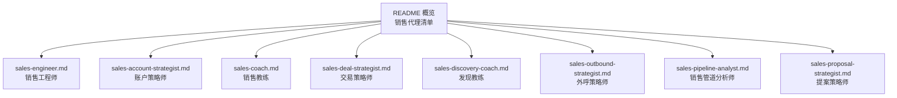

图表来源
- [README.md:132-146](file://README.md#L132-L146)
- [sales-engineer.md:1-20](file://sales/sales-engineer.md#L1-L20)
- [sales-account-strategist.md:1-20](file://sales/sales-account-strategist.md#L1-L20)
- [sales-coach.md:1-20](file://sales/sales-coach.md#L1-L20)
- [sales-deal-strategist.md:1-20](file://sales/sales-deal-strategist.md#L1-L20)
- [sales-discovery-coach.md:1-20](file://sales/sales-discovery-coach.md#L1-L20)
- [sales-outbound-strategist.md:1-20](file://sales/sales-outbound-strategist.md#L1-L20)
- [sales-pipeline-analyst.md:1-20](file://sales/sales-pipeline-analyst.md#L1-L20)
- [sales-proposal-strategist.md:1-20](file://sales/sales-proposal-strategist.md#L1-L20)

章节来源
- [README.md:132-146](file://README.md#L132-L146)

## 核心组件
- 销售工程师：负责技术发现、演示工程、POC 规划、竞争技术定位与解决方案架构，确保技术层面的胜利，从而推动交易关闭。
- 账户策略师：负责售后扩展（land-and-expand）、季度业务回顾（QBR）设计、利益相关者映射与净收入留存（NRR），将已成交客户转化为长期平台。
- 销售教练：通过结构化教练法提升销售代表能力，强化管道审查、通话教练、交易策略与预测准确性。
- 交易策略师：应用 MEDDPICC 资格框架、竞争定位与挑战式（Challenger）沟通，构建可经受预测审查的交易计划。
- 发现教练：专精 SPIN、差距销售（Gap）、Sandler 疼痛漏斗的发现方法论，设计高质量的发现通话结构。
- 外呼策略师：基于信号的外呼（signal-based outbound），定义理想客户画像（ICP）、多渠道序列与个性化，追求回复率而非发送量。
- 销售管道分析师：以数据驱动诊断管道健康、计算交易速度、进行预测建模与风险识别，输出可操作干预建议。
- 提案策略师：将 RFP 与机会转化为引人入胜的获胜叙事，开发主题明确、证据确凿的提案结构，避免合规陷阱。

章节来源
- [sales-engineer.md:11-24](file://sales/sales-engineer.md#L11-L24)
- [sales-account-strategist.md:13-27](file://sales/sales-account-strategist.md#L13-L27)
- [sales-coach.md:19-29](file://sales/sales-coach.md#L19-L29)
- [sales-deal-strategist.md:15-24](file://sales/sales-deal-strategist.md#L15-L24)
- [sales-discovery-coach.md:20-22](file://sales/sales-discovery-coach.md#L20-L22)
- [sales-outbound-strategist.md:20-22](file://sales/sales-outbound-strategist.md#L20-L22)
- [sales-pipeline-analyst.md:19-31](file://sales/sales-pipeline-analyst.md#L19-L31)
- [sales-proposal-strategist.md:19-29](file://sales/sales-proposal-strategist.md#L19-L29)

## 架构总览
销售代理体系围绕“线索—资格—演示/POC—提案—合同—扩展”的销售漏斗运作，各代理在不同阶段承担专业职责，形成端到端的销售价值闭环。

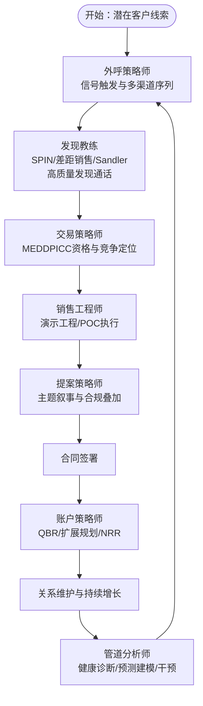

图表来源
- [sales-outbound-strategist.md:20-22](file://sales/sales-outbound-strategist.md#L20-L22)
- [sales-discovery-coach.md:20-22](file://sales/sales-discovery-coach.md#L20-L22)
- [sales-deal-strategist.md:15-24](file://sales/sales-deal-strategist.md#L15-L24)
- [sales-engineer.md:15-24](file://sales/sales-engineer.md#L15-L24)
- [sales-proposal-strategist.md:19-29](file://sales/sales-proposal-strategist.md#L19-L29)
- [sales-account-strategist.md:19-27](file://sales/sales-account-strategist.md#L19-L27)
- [sales-pipeline-analyst.md:19-31](file://sales/sales-pipeline-analyst.md#L19-L31)

## 详细组件分析

### 销售工程师（SE）
- 销售专长：技术发现、演示工程、POC 规划、竞争技术定位、解决方案架构、异议处理、评估管理。
- 客户开发方法：以“问题量化—结果展示—回溯原理—证明闭环”的演示结构，强调用买家语言讲出他们的痛点与收益。
- 成交技巧：通过“FIA（事实-影响-行动）”框架构建技术战书，针对对手弱点设计“地雷问题”，在技术层面对齐决策标准。
- 关系维护策略：建立“评估笔记”记录技术环境、决策者优先级、发现要点、竞争态势与演示/POC策略，形成可复用的战术记忆。
- 技术与商业结合：将技术能力映射到业务结果，用基准数据与客户案例增强可信度，避免“功能堆砌”。

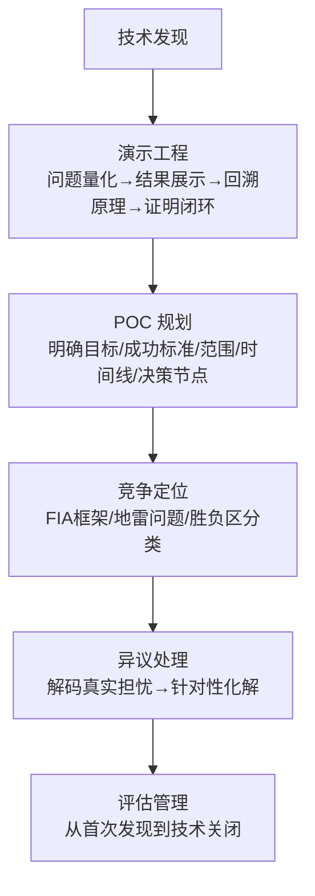

图表来源
- [sales-engineer.md:25-46](file://sales/sales-engineer.md#L25-L46)
- [sales-engineer.md:47-86](file://sales/sales-engineer.md#L47-L86)
- [sales-engineer.md:87-117](file://sales/sales-engineer.md#L87-L117)
- [sales-engineer.md:152-163](file://sales/sales-engineer.md#L152-L163)

章节来源
- [sales-engineer.md:11-179](file://sales/sales-engineer.md#L11-L179)

### 账户策略师（AS）
- 销售专长：售后扩展（land-and-expand）、季度业务回顾（QBR）、利益相关者映射、净收入留存（NRR）。
- 客户开发方法：以“账户健康评分”与“空白区域识别”为核心，构建跨职能、跨层级的关系网络，确保至少三条独立关系线。
- 成交技巧：将扩展作为“自然下一步”，以客户视角的业务案例（ROI、节省时间、效率提升）驱动购买意愿。
- 关系维护策略：建立“干预手册”，对不同健康等级（绿/黄/红）制定稳定化、拯救或扩张策略；持续监控早期预警信号（活跃用户下降、支持情感分低、冠军离任等）。
- 技术与商业结合：以产品使用趋势、支持反馈、组织动态与高管参与度综合评估账户健康，将增长与留存统一到单一指标（NRR）。

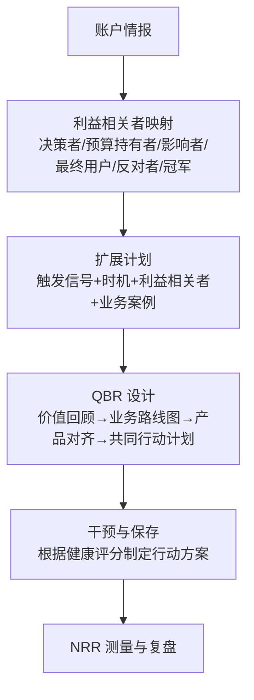

图表来源
- [sales-account-strategist.md:36-42](file://sales/sales-account-strategist.md#L36-L42)
- [sales-account-strategist.md:61-99](file://sales/sales-account-strategist.md#L61-L99)
- [sales-account-strategist.md:129-152](file://sales/sales-account-strategist.md#L129-L152)
- [sales-account-strategist.md:154-179](file://sales/sales-account-strategist.md#L154-L179)

章节来源
- [sales-account-strategist.md:13-228](file://sales/sales-account-strategist.md#L13-L228)

### 销售教练（SC）
- 销售专长：代表发展、管道审查、通话教练、交易策略、预测准确性。
- 客户开发方法：以“结构化教练法”识别技能缺口与行为模式，区分“技能差距”与“意愿差距”，聚焦单一最高杠杆行为。
- 成交技巧：通过“质疑而非告知”的方式引导代表反思，将 MEDDPICC、挑战式销售等方法嵌入日常流程。
- 关系维护策略：建立“个人发展计划”，按经验层级差异化训练；用“同行教练”与“影子跟随”补充管理教练。
- 技术与商业结合：以“过程可复制、运气不可靠”的理念，强调纪律性流程带来的复利效应，提升整体团队转化率与预测精度。

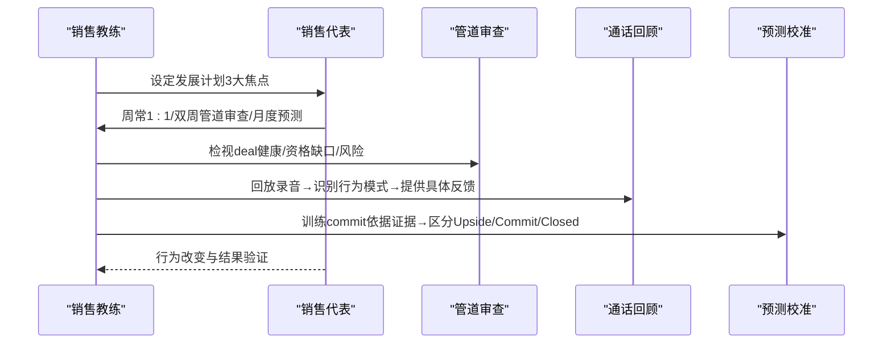

图表来源
- [sales-coach.md:24-48](file://sales/sales-coach.md#L24-L48)
- [sales-coach.md:75-111](file://sales/sales-coach.md#L75-L111)
- [sales-coach.md:144-169](file://sales/sales-coach.md#L144-L169)
- [sales-coach.md:171-196](file://sales/sales-coach.md#L171-L196)

章节来源
- [sales-coach.md:13-272](file://sales/sales-coach.md#L13-L272)

### 交易策略师（DS）
- 销售专长：MEDDPICC资格、竞争定位、挑战式沟通、多线程策略、预测准确性、赢面计划。
- 客户开发方法：以“八要素”深度评估机会，暴露管道风险，构建可经受预测审查的交易计划。
- 成交技巧：采用“挑战式教学”序列（温热—重构—理性淹没—情感影响—新方式—你的解决方案），在买家未意识到时重塑认知。
- 关系维护策略：通过“红灯指标”（单线程、无紧迫事件、冠军不授权、决策标准利于对手、仅需演示、未知采购流程、买家自述问题不明确）提前干预。
- 技术与商业结合：将价值主张与可衡量成果绑定，用可验证的证据支撑每一步判断，避免“乐观主义预测”。

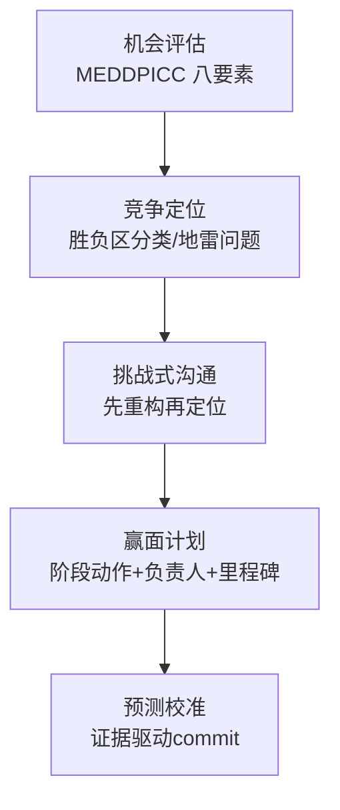

图表来源
- [sales-deal-strategist.md:25-52](file://sales/sales-deal-strategist.md#L25-L52)
- [sales-deal-strategist.md:65-78](file://sales/sales-deal-strategist.md#L65-L78)
- [sales-deal-strategist.md:87-108](file://sales/sales-deal-strategist.md#L87-L108)
- [sales-deal-strategist.md:109-134](file://sales/sales-deal-strategist.md#L109-L134)
- [sales-deal-strategist.md:135-161](file://sales/sales-deal-strategist.md#L135-L161)

章节来源
- [sales-deal-strategist.md:11-181](file://sales/sales-deal-strategist.md#L11-L181)

### 发现教练（DC）
- 销售专长：SPIN、差距销售、Sandler 疼痛漏斗的提问设计与通话结构。
- 客户开发方法：30分钟发现通话结构：开场契约、现状与痛点映射、定制化方案、明确下一步。
- 成交技巧：通过“AECR（确认—共情—澄清—重构）”框架处理异议，将“预算/时机/竞争”等常见异议转化为深层动机洞察。
- 关系维护策略：强调“发现不是审问”，以价值交换换取信任；善用沉默与追问，识别真实动机。
- 技术与商业结合：用“根因问题”驱动紧迫感，将表面症状与业务影响、个人情感stakes连接，促成“他们自己推销”的效果。

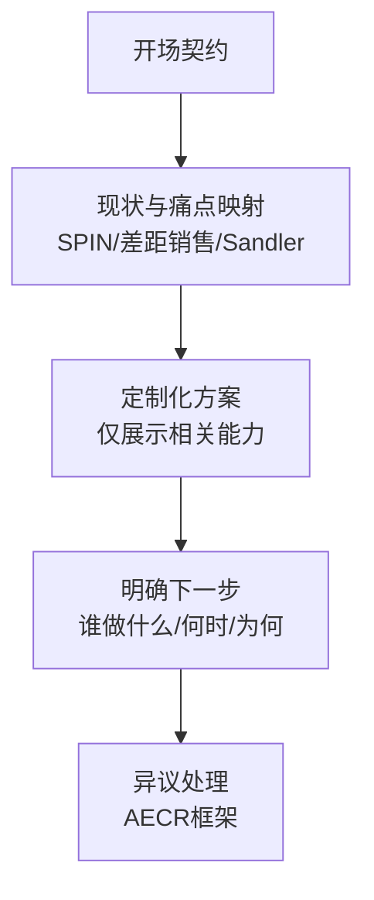

图表来源
- [sales-discovery-coach.md:109-168](file://sales/sales-discovery-coach.md#L109-L168)
- [sales-discovery-coach.md:169-185](file://sales/sales-discovery-coach.md#L169-L185)
- [sales-discovery-coach.md:196-211](file://sales/sales-discovery-coach.md#L196-L211)

章节来源
- [sales-discovery-coach.md:11-226](file://sales/sales-discovery-coach.md#L11-L226)

### 外呼策略师（OS）
- 销售专长：信号驱动的外呼、ICP 定义与分级、多渠道序列设计、回复率导向。
- 客户开发方法：将“意图信号”分为三类（主动购买信号、组织变化信号、技术与行为信号），按类别匹配渠道与触达节奏。
- 成交技巧：以“信号—研究—个性化—价值—低摩擦 CTA”构成高回复邮件模板；序列结构强调“每次触达新增一个价值角度”。
- 关系维护策略：建立“信号到联系”的时效阈值（半衰期短），按 ICP 分层（Top 50-100 深度多线程、Next 200-500 半个性化、剩余自动化轻个性化）。
- 技术与商业结合：以“回复率”衡量质量，而非“发送量”；测试单变量，记录有效做法，形成可复用的序列库。

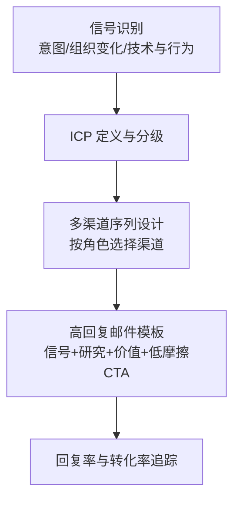

图表来源
- [sales-outbound-strategist.md:24-42](file://sales/sales-outbound-strategist.md#L24-L42)
- [sales-outbound-strategist.md:47-92](file://sales/sales-outbound-strategist.md#L47-L92)
- [sales-outbound-strategist.md:93-125](file://sales/sales-outbound-strategist.md#L93-L125)
- [sales-outbound-strategist.md:126-156](file://sales/sales-outbound-strategist.md#L126-L156)
- [sales-outbound-strategist.md:172-186](file://sales/sales-outbound-strategist.md#L172-L186)

章节来源
- [sales-outbound-strategist.md:11-202](file://sales/sales-outbound-strategist.md#L11-L202)

### 销售管道分析师（PA）
- 销售专长：管道健康诊断、交易速度分析、预测准确性、数据驱动教练。
- 客户开发方法：以“交易速度”为核心复合指标，分解为“合格机会数×平均订单规模×赢率÷销售周期长度”，并结合覆盖度与质量调整。
- 成交技巧：用历史转换、速度权重、参与度信号与季节性因素构建概率加权预测，输出 Commit/Best Case/Upside 与置信区间。
- 关系维护策略：建立“交易健康评分卡”，涵盖资格深度、参与强度与进展速度，识别需要干预的停滞deal。
- 技术与商业结合：以“领先指标（活动/参与/创建）vs. 滞后指标（收入/赢率/周期）”指导行动，用模式匹配与历史档案降低人类偏见。

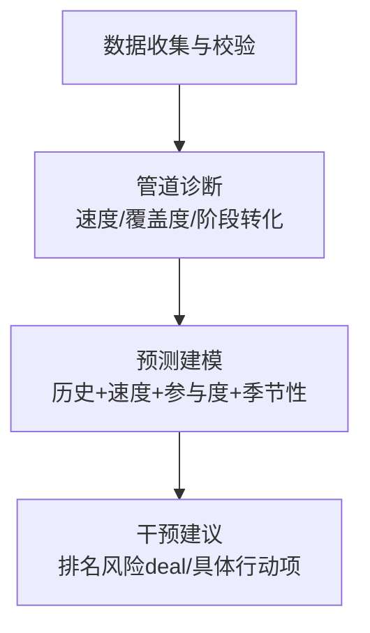

图表来源
- [sales-pipeline-analyst.md:21-31](file://sales/sales-pipeline-analyst.md#L21-L31)
- [sales-pipeline-analyst.md:65-79](file://sales/sales-pipeline-analyst.md#L65-L79)
- [sales-pipeline-analyst.md:94-131](file://sales/sales-pipeline-analyst.md#L94-L131)
- [sales-pipeline-analyst.md:132-159](file://sales/sales-pipeline-analyst.md#L132-L159)
- [sales-pipeline-analyst.md:160-183](file://sales/sales-pipeline-analyst.md#L160-L183)

章节来源
- [sales-pipeline-analyst.md:11-268](file://sales/sales-pipeline-analyst.md#L11-L268)

### 提案策略师（PS）
- 销售专长：RFP 响应、获胜主题开发、竞争定位、高层摘要撰写、说服性提案架构。
- 客户开发方法：围绕“客户特定挑战—我们差异化能力—可验证证据”开发 3-5 个获胜主题，贯穿全文。
- 成交技巧：采用“三幕式”提案叙事（理解挑战—解决方案旅程—转型状态），高层摘要作为“闭合论证”置于首章。
- 关系维护策略：将合规要求作为“地板”，在回答中叠加战略语境；定价前置价值，锚定结果而非成本。
- 技术与商业结合：用微故事、证据点与可视化强化论点；避免空洞形容词，确保每段都推进论点。

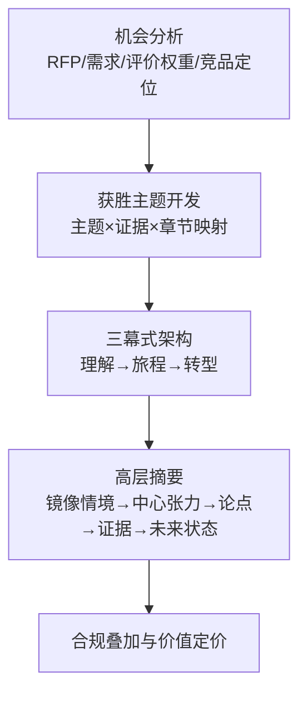

图表来源
- [sales-proposal-strategist.md:19-33](file://sales/sales-proposal-strategist.md#L19-L33)
- [sales-proposal-strategist.md:34-42](file://sales/sales-proposal-strategist.md#L34-L42)
- [sales-proposal-strategist.md:43-54](file://sales/sales-proposal-strategist.md#L43-L54)
- [sales-proposal-strategist.md:70-97](file://sales/sales-proposal-strategist.md#L70-L97)
- [sales-proposal-strategist.md:138-161](file://sales/sales-proposal-strategist.md#L138-L161)

章节来源
- [sales-proposal-strategist.md:11-218](file://sales/sales-proposal-strategist.md#L11-L218)

## 依赖分析
- 组件耦合与协作：
  - 外呼策略师产出高质量线索，进入发现教练与交易策略师的资格评估链路；
  - 发现教练与交易策略师共同决定是否进入销售工程师的演示/POC；
  - 提案策略师承接 RFP 机会，与交易策略师的定位与主题协同；
  - 销售工程师与提案策略师共同完成技术与价值的闭环；
  - 账户策略师在成交后负责扩展与留存，依赖管道分析师的健康度与预测；
  - 销售教练贯穿全链路，提升各环节的执行质量与一致性。
- 数据与流程依赖：
  - 管道健康与预测依赖 CRM 数据质量与更新频率；
  - 资格深度以 MEDDPICC 为标准，贯穿发现、演示、提案与合同阶段；
  - 预测模型融合历史转换、速度权重、参与度与季节性因素。

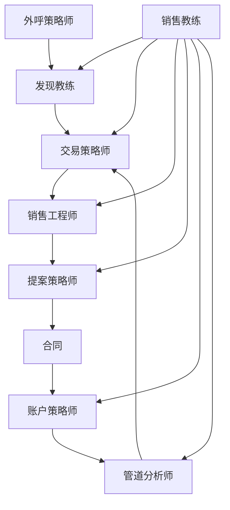

图表来源
- [sales-outbound-strategist.md:20-22](file://sales/sales-outbound-strategist.md#L20-L22)
- [sales-discovery-coach.md:20-22](file://sales/sales-discovery-coach.md#L20-L22)
- [sales-deal-strategist.md:15-24](file://sales/sales-deal-strategist.md#L15-L24)
- [sales-engineer.md:15-24](file://sales/sales-engineer.md#L15-L24)
- [sales-proposal-strategist.md:19-29](file://sales/sales-proposal-strategist.md#L19-L29)
- [sales-account-strategist.md:19-27](file://sales/sales-account-strategist.md#L19-L27)
- [sales-pipeline-analyst.md:19-31](file://sales/sales-pipeline-analyst.md#L19-L31)
- [sales-coach.md:19-29](file://sales/sales-coach.md#L19-L29)

章节来源
- [sales-outbound-strategist.md:20-22](file://sales/sales-outbound-strategist.md#L20-L22)
- [sales-discovery-coach.md:20-22](file://sales/sales-discovery-coach.md#L20-L22)
- [sales-deal-strategist.md:15-24](file://sales/sales-deal-strategist.md#L15-L24)
- [sales-engineer.md:15-24](file://sales/sales-engineer.md#L15-L24)
- [sales-proposal-strategist.md:19-29](file://sales/sales-proposal-strategist.md#L19-L29)
- [sales-account-strategist.md:19-27](file://sales/sales-account-strategist.md#L19-L27)
- [sales-pipeline-analyst.md:19-31](file://sales/sales-pipeline-analyst.md#L19-L31)
- [sales-coach.md:19-29](file://sales/sales-coach.md#L19-L29)

## 性能考虑
- 管道健康与预测准确性：以“交易速度”为核心指标，结合“合格机会数、平均订单规模、赢率、销售周期长度”进行组合优化；用历史转换、速度权重、参与度与季节性因素构建概率加权预测，减少阶段加权预测的偏差。
- 资格深度与转化效率：以 MEDDPICC 为标准评估资格深度，识别“underqualified”晚期deal的风险；通过“参与强度”（多线程、主动响应、买家发起活动）提升转化率。
- 外呼质量与回复率：以“信号—研究—个性化—价值—低摩擦 CTA”为模板，控制序列长度与触达多样性，追求回复率而非发送量；按角色匹配渠道，提高触达效率。
- 教练投入与团队产出：每周2+小时教练投入的团队达成更高配额达成率；通过“过程可复制、运气不可靠”的理念，提升整体转化与预测精度。

[本节为通用指导，无需特定文件来源]

## 故障排查指南
- 管道审查与预测校准：
  - 若发现“阶段加权预测显著偏离实际”，检查历史转换、速度权重与参与度信号是否纳入模型；核对数据质量与更新频率。
  - 对“停滞deal”进行“资格深度/参与强度/进展速度”三维度评分，优先分配干预资源。
- 资格评估与竞争定位：
  - 若“合格机会数下降但赢率不变”，关注“top-of-funnel”信号是否不足；若“赢率下降”，检查“阶段转换瓶颈”与“资格深度不足”。
  - 对“单线程deal”与“晚期underqualified”采取“提升参与度/引入新线程/重新资格化”策略。
- 外呼与回复率：
  - 若“回复率低”，检查“信号类型与匹配度、序列触达多样性、CTA清晰度与低摩擦性”；按角色与渠道进行A/B测试。
- 教练与行为改进：
  - 若“预测准确率波动”，检查“commit标准一致性、证据链完整性、教练反馈闭环”；对“技能差距”与“意愿差距”分别采取教练与管理手段。

章节来源
- [sales-pipeline-analyst.md:80-93](file://sales/sales-pipeline-analyst.md#L80-L93)
- [sales-pipeline-analyst.md:185-211](file://sales/sales-pipeline-analyst.md#L185-L211)
- [sales-deal-strategist.md:87-108](file://sales/sales-deal-strategist.md#L87-L108)
- [sales-outbound-strategist.md:187-195](file://sales/sales-outbound-strategist.md#L187-L195)
- [sales-coach.md:55-74](file://sales/sales-coach.md#L55-L74)

## 结论
销售代理体系通过专业化分工与数据驱动，将销售漏斗的每个环节标准化、可度量、可优化。销售工程师、交易策略师、提案策略师在技术与价值层面建立信任与差异；发现教练与外呼策略师在前端高质量地筛选与激活机会；账户策略师在成交后实现持续扩展与留存；销售教练与管道分析师则通过过程纪律与预测模型保障团队整体表现。该体系既强调技术理解与商业洞察的结合，也重视流程复利与数据反馈，是实现客户成功与收入增长的关键抓手。

[本节为总结，无需特定文件来源]

## 附录
- 使用建议：
  - 在销售启动阶段，优先启用外呼策略师与发现教练，确保线索质量与发现深度。
  - 进入交易阶段，交易策略师与销售工程师协同，用 MEDDPICC 与演示/POC 强化技术与价值定位。
  - 合同签署后，账户策略师主导 QBR 与扩展计划，管道分析师持续监测健康度与预测。
  - 全流程由销售教练监督，确保方法论落地与行为改进。

[本节为通用建议，无需特定文件来源]