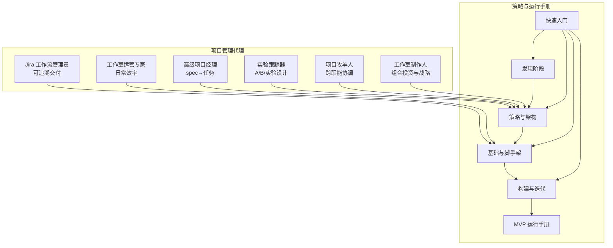
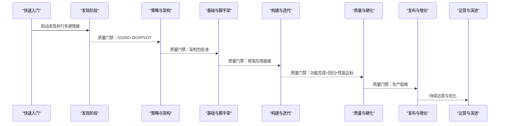
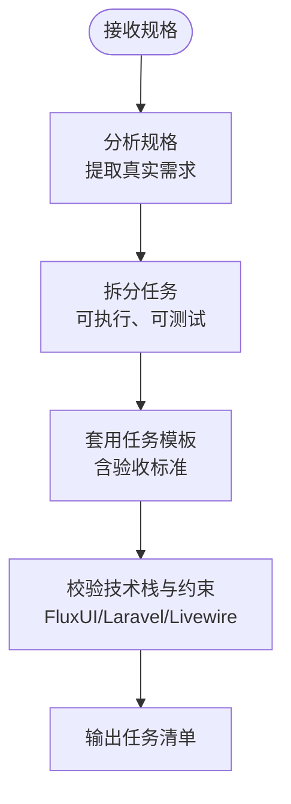
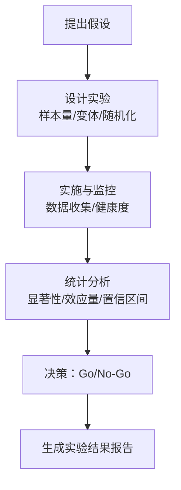
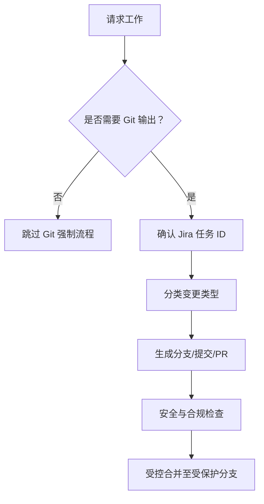
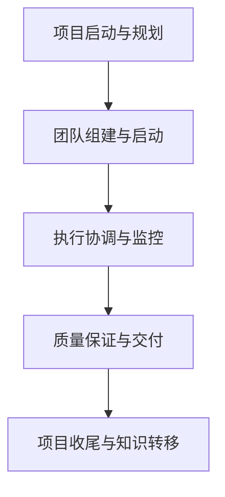
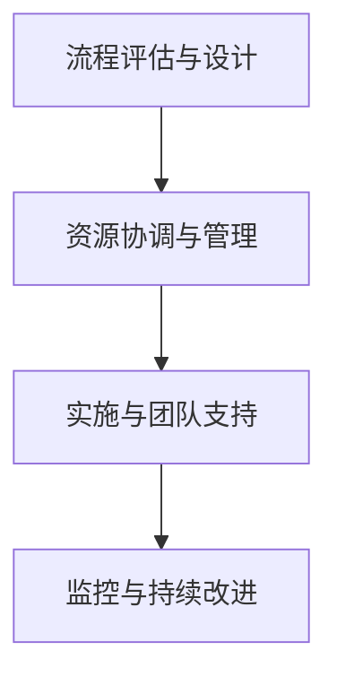
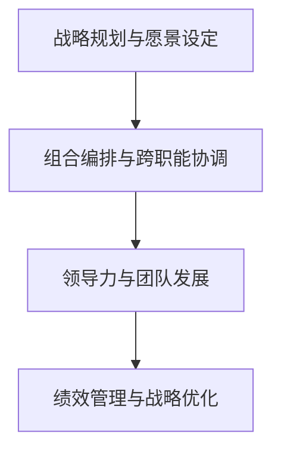
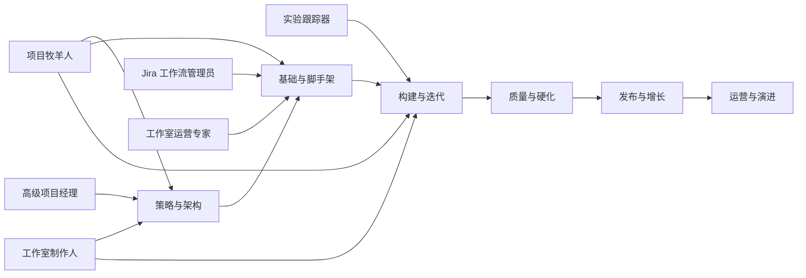

# 项目管理代理

<cite>
**本文引用的文件**
- [project-manager-senior.md](file://project-management/project-manager-senior.md)
- [project-management-experiment-tracker.md](file://project-management/project-management-experiment-tracker.md)
- [project-management-jira-workflow-steward.md](file://project-management/project-management-jira-workflow-steward.md)
- [project-management-project-shepherd.md](file://project-management/project-management-project-shepherd.md)
- [project-management-studio-operations.md](file://project-management/project-management-studio-operations.md)
- [project-management-studio-producer.md](file://project-management/project-management-studio-producer.md)
- [QUICKSTART.md](file://strategy/QUICKSTART.md)
- [phase-0-discovery.md](file://strategy/playbooks/phase-0-discovery.md)
- [phase-1-strategy.md](file://strategy/playbooks/phase-1-strategy.md)
- [phase-2-foundation.md](file://strategy/playbooks/phase-2-foundation.md)
- [phase-3-build.md](file://strategy/playbooks/phase-3-build.md)
- [scenario-startup-mvp.md](file://strategy/runbooks/scenario-startup-mvp.md)
- [product-manager.md](file://product/product-manager.md)
</cite>

## 目录
1. [简介](#简介)
2. [项目结构](#项目结构)
3. [核心组件](#核心组件)
4. [架构总览](#架构总览)
5. [详细组件分析](#详细组件分析)
6. [依赖关系分析](#依赖关系分析)
7. [性能与效率考量](#性能与效率考量)
8. [故障排查指南](#故障排查指南)
9. [结论](#结论)
10. [附录](#附录)

## 简介
本文件系统化梳理并文档化六类项目管理代理：高级项目经理、实验跟踪器、Jira 工作流管理员、项目牧羊人、工作室运营专家、工作室制作人。它们共同构成面向复杂项目的“代理式项目管理”体系，覆盖从发现、策略、基础建设、迭代构建到发布运营的全生命周期，并通过标准化流程、质量门禁与跨职能协作机制，确保项目按时、按预算、高质量交付。

## 项目结构
项目管理代理位于独立目录下，每类代理均以“项目管理-领域名”的命名规范呈现，职责边界清晰，配合策略与运行手册形成“方法论—流程—模板—度量”的闭环。

图表来源
- [project-manager-senior.md:1-136](file://project-management/project-manager-senior.md#L1-L136)
- [project-management-experiment-tracker.md:1-198](file://project-management/project-management-experiment-tracker.md#L1-L198)
- [project-management-jira-workflow-steward.md:1-231](file://project-management/project-management-jira-workflow-steward.md#L1-L231)
- [project-management-project-shepherd.md:1-194](file://project-management/project-management-project-shepherd.md#L1-L194)
- [project-management-studio-operations.md:1-200](file://project-management/project-management-studio-operations.md#L1-L200)
- [project-management-studio-producer.md:1-203](file://project-management/project-management-studio-producer.md#L1-L203)
- [QUICKSTART.md:1-195](file://strategy/QUICKSTART.md#L1-L195)
- [phase-0-discovery.md:1-179](file://strategy/playbooks/phase-0-discovery.md#L1-L179)
- [phase-1-strategy.md:1-239](file://strategy/playbooks/phase-1-strategy.md#L1-L239)
- [phase-2-foundation.md:1-279](file://strategy/playbooks/phase-2-foundation.md#L1-L279)
- [phase-3-build.md:1-287](file://strategy/playbooks/phase-3-build.md#L1-L287)
- [scenario-startup-mvp.md:1-155](file://strategy/runbooks/scenario-startup-mvp.md#L1-L155)

章节来源
- [QUICKSTART.md:1-195](file://strategy/QUICKSTART.md#L1-L195)
- [phase-0-discovery.md:1-179](file://strategy/playbooks/phase-0-discovery.md#L1-L179)
- [phase-1-strategy.md:1-239](file://strategy/playbooks/phase-1-strategy.md#L1-L239)
- [phase-2-foundation.md:1-279](file://strategy/playbooks/phase-2-foundation.md#L1-L279)
- [phase-3-build.md:1-287](file://strategy/playbooks/phase-3-build.md#L1-L287)
- [scenario-startup-mvp.md:1-155](file://strategy/runbooks/scenario-startup-mvp.md#L1-L155)

## 核心组件
- 高级项目经理：将规格转化为可执行开发任务，强调真实范围、可测试验收标准与开发者可直接落地的任务粒度。
- 实验跟踪器：以科学实验方法设计与执行 A/B 测试，强调统计显著性、样本量计算、安全监控与伦理合规。
- Jira 工作流管理员：强制可追溯的分支、提交与 PR 策略，确保从需求到代码的全程可审计与可回溯。
- 项目牧羊人：跨职能项目协调、资源与时间线管理、干系人对齐与风险管理，确保高质量交付。
- 工作室运营专家：日常运营效率优化、流程标准化、资源与成本管理，保障团队稳定产出。
- 工作室制作人：高层创意与技术项目编排、多项目组合管理、财务与风险控制、市场与增长驱动。

章节来源
- [project-manager-senior.md:1-136](file://project-management/project-manager-senior.md#L1-L136)
- [project-management-experiment-tracker.md:1-198](file://project-management/project-management-experiment-tracker.md#L1-L198)
- [project-management-jira-workflow-steward.md:1-231](file://project-management/project-management-jira-workflow-steward.md#L1-L231)
- [project-management-project-shepherd.md:1-194](file://project-management/project-management-project-shepherd.md#L1-L194)
- [project-management-studio-operations.md:1-200](file://project-management/project-management-studio-operations.md#L1-L200)
- [project-management-studio-producer.md:1-203](file://project-management/project-management-studio-producer.md#L1-L203)

## 架构总览
项目管理代理与策略流程协同工作，形成“发现—策略—基础—构建—硬化工—发布—运营”的完整生命周期。每个阶段设有质量门禁与证据要求，确保可验证、可复现、可改进。

图表来源
- [QUICKSTART.md:1-195](file://strategy/QUICKSTART.md#L1-L195)
- [phase-0-discovery.md:1-179](file://strategy/playbooks/phase-0-discovery.md#L1-L179)
- [phase-1-strategy.md:1-239](file://strategy/playbooks/phase-1-strategy.md#L1-L239)
- [phase-2-foundation.md:1-279](file://strategy/playbooks/phase-2-foundation.md#L1-L279)
- [phase-3-build.md:1-287](file://strategy/playbooks/phase-3-build.md#L1-L287)

## 详细组件分析

### 高级项目经理（Spec→任务）
- 专长：将规格转化为可执行任务；强调真实范围、无金丝雀式过度设计；任务可由开发者在 30-60 分钟内实现。
- 工具使用：记忆与模式库；任务清单模板；FluxUI 组件约束；Laravel/Livewire 技术栈要求。
- 风险控制：避免范围蔓延；记录过往项目经验；明确验收标准；禁止后台进程与服务器启动命令。
- 团队协调：沟通风格具体、引用规格、开发者优先；成功指标为任务清晰、无范围蔓延、技术准确。
- 生命周期适配：在策略阶段将架构与规格映射为任务清单；在构建阶段作为任务分配与验收标准的权威来源。

图表来源
- [project-manager-senior.md:1-136](file://project-management/project-manager-senior.md#L1-L136)
- [phase-1-strategy.md:135-157](file://strategy/playbooks/phase-1-strategy.md#L135-L157)

章节来源
- [project-manager-senior.md:1-136](file://project-management/project-manager-senior.md#L1-L136)
- [phase-1-strategy.md:135-157](file://strategy/playbooks/phase-1-strategy.md#L135-L157)

### 实验跟踪器（A/B/实验设计与数据驱动决策）
- 专长：科学实验设计、统计显著性、样本量计算、多变体与多臂试验、贝叶斯与因果推断。
- 工具使用：实验设计文档模板、结果报告模板、风险评估与缓解、安全监控与回滚。
- 风险控制：随机化、多重比较校正、早停规则、伦理与隐私合规、用户同意与透明度。
- 团队协调：系统化流程：假设→设计→实施→执行→分析→决策；向业务与工程传递可操作洞察。
- 生命周期适配：在构建阶段对已验证特性进行 A/B 测试；在发布阶段根据实验结果决定上线或回滚。

图表来源
- [project-management-experiment-tracker.md:1-198](file://project-management/project-management-experiment-tracker.md#L1-L198)
- [phase-3-build.md:111-118](file://strategy/playbooks/phase-3-build.md#L111-L118)

章节来源
- [project-management-experiment-tracker.md:1-198](file://project-management/project-management-experiment-tracker.md#L1-L198)
- [phase-3-build.md:111-118](file://strategy/playbooks/phase-3-build.md#L111-L118)

### Jira 工作流管理员（可追溯交付）
- 专长：强制 Jira 锚定的分支、提交与 PR 策略；Gitmoji 规范；热修复与发布分支策略；安全与合规。
- 工具使用：分支与提交决策矩阵；提交与分支校验钩子；PR 模板；交付计划模板。
- 风险控制：无 Jira 任务不生成任何 Git 输出；禁止密钥与敏感信息；热修复必须原子且可回溯。
- 团队协调：明确变更类型与分支路径；提升审查速度与审计可追溯性；保护仓库结构与审查质量。
- 生命周期适配：在基础阶段建立 CI/CD 与 Git 工作流；在构建阶段严格执行可追溯交付。

图表来源
- [project-management-jira-workflow-steward.md:1-231](file://project-management/project-management-jira-workflow-steward.md#L1-L231)
- [phase-2-foundation.md:79-103](file://strategy/playbooks/phase-2-foundation.md#L79-L103)

章节来源
- [project-management-jira-workflow-steward.md:1-231](file://project-management/project-management-jira-workflow-steward.md#L1-L231)
- [phase-2-foundation.md:79-103](file://strategy/playbooks/phase-2-foundation.md#L79-L103)

### 项目牧羊人（跨职能协调与干系人管理）
- 专长：大型跨职能项目规划与执行；时间线与资源管理；干系人沟通与对齐；质量门与风险控制。
- 工具使用：项目章程模板；状态报告模板；沟通策略；风险登记册。
- 风险控制：定期沟通、透明报告、及时升级、文档化决策；缓冲时间与资源平衡。
- 团队协调：项目启动与团队组建；执行监控与问题解决；质量保证与收尾；知识转移。
- 生命周期适配：在策略阶段制定项目章程与资源计划；在构建阶段推进里程碑与变更控制；在发布阶段组织验收与移交。

图表来源
- [project-management-project-shepherd.md:1-194](file://project-management/project-management-project-shepherd.md#L1-L194)
- [phase-1-strategy.md:86-111](file://strategy/playbooks/phase-1-strategy.md#L86-L111)

章节来源
- [project-management-project-shepherd.md:1-194](file://project-management/project-management-project-shepherd.md#L1-L194)
- [phase-1-strategy.md:86-111](file://strategy/playbooks/phase-1-strategy.md#L86-L111)

### 工作室运营专家（日常效率与流程优化）
- 专长：日常运营效率、流程优化、资源与成本管理、质量控制与合规监控。
- 工具使用：标准作业程序模板；效率报告模板；供应商关系与资产管理系统。
- 风险控制：流程文档化与培训；资源利用率监控；成本优化与服务等级协议。
- 团队协调：行政支持、设施与技术协调、帮助台与系统维护。
- 生命周期适配：在基础阶段建立流程与工具；在构建阶段提供持续支持；在发布后推动持续改进。

图表来源
- [project-management-studio-operations.md:1-200](file://project-management/project-management-studio-operations.md#L1-L200)
- [phase-2-foundation.md:79-103](file://strategy/playbooks/phase-2-foundation.md#L79-L103)

章节来源
- [project-management-studio-operations.md:1-200](file://project-management/project-management-studio-operations.md#L1-L200)
- [phase-2-foundation.md:79-103](file://strategy/playbooks/phase-2-foundation.md#L79-L103)

### 工作室制作人（组合投资与战略领导）
- 专长：多项目组合管理、创意与业务目标对齐、资源分配与团队能力建设、财务与风险控制。
- 工具使用：组合计划模板；组合评审模板；市场机会与竞争定位；创新管线管理。
- 风险控制：投资组合风险评估与对冲；ROI 跟踪；战略一致性与高层沟通。
- 团队协调：跨职能团队领导、外部合作伙伴关系、组织变革与文化演进。
- 生命周期适配：在策略阶段制定组合计划与资源分配；在构建阶段协调多项目；在发布阶段评估组合绩效。

图表来源
- [project-management-studio-producer.md:1-203](file://project-management/project-management-studio-producer.md#L1-L203)
- [phase-1-strategy.md:94-118](file://strategy/playbooks/phase-1-strategy.md#L94-L118)

章节来源
- [project-management-studio-producer.md:1-203](file://project-management/project-management-studio-producer.md#L1-L203)
- [phase-1-strategy.md:94-118](file://strategy/playbooks/phase-1-strategy.md#L94-L118)

## 依赖关系分析
- 代理间耦合与协作：
  - 高级项目经理与策略阶段的架构文档强耦合，确保任务与架构一致。
  - 实验跟踪器与构建阶段的质量门禁协作，以实验结果指导上线与回滚。
  - Jira 工作流管理员贯穿基础与构建阶段，保障交付可追溯性。
  - 项目牧羊人协调各阶段质量门禁与干系人沟通。
  - 工作室运营专家为各阶段提供流程与工具支撑。
  - 工作室制作人负责组合层面的战略一致性与资源平衡。
- 外部依赖与集成点：
  - CI/CD 与基础设施由 DevOps 自动化与基础设施维护提供。
  - 品牌与体验由品牌守护者与 UI 设计师协作保障。
  - 数据与分析由分析报告员与实验跟踪器共同驱动。

图表来源
- [phase-1-strategy.md:1-239](file://strategy/playbooks/phase-1-strategy.md#L1-L239)
- [phase-2-foundation.md:1-279](file://strategy/playbooks/phase-2-foundation.md#L1-L279)
- [phase-3-build.md:1-287](file://strategy/playbooks/phase-3-build.md#L1-L287)

章节来源
- [phase-1-strategy.md:1-239](file://strategy/playbooks/phase-1-strategy.md#L1-L239)
- [phase-2-foundation.md:1-279](file://strategy/playbooks/phase-2-foundation.md#L1-L279)
- [phase-3-build.md:1-287](file://strategy/playbooks/phase-3-build.md#L1-L287)

## 性能与效率考量
- 任务粒度与并行：高级项目经理将任务拆分为 30-60 分钟可完成单元，便于并行与快速反馈。
- Dev↔QA 循环：构建阶段采用“开发→测试→反馈→修复→再测试”的循环，最多三次失败即进入协调决策，降低返工成本。
- 可追溯交付：Jira 工作流管理员通过分支、提交与 PR 的强制规范，减少混合作用域与审查摩擦。
- 组合与资源：工作室制作人通过组合计划与资源分配，平衡风险与回报，提升整体 ROI。
- 日常效率：工作室运营专家通过 SOP 与自动化，维持高效率与低响应时间。

## 故障排查指南
- 任务未通过 QA
  - 检查是否达到最大重试次数（3 次）；若超过则进入协调决策，考虑重新分配、分解或接受已知限制。
  - 关注验收标准与截图证据，确保视觉与功能符合预期。
- 缺少 Jira 任务锚定
  - 在生成任何 Git 输出前必须提供有效的 Jira 任务 ID；否则流程应停止并提示补充。
- 提交或分支不符合规范
  - 使用官方 Gitmoji 与分支命名约定；提交主题需包含变更类型与 Jira ID。
- 实验未达统计显著性
  - 检查样本量计算、随机化与早停规则；必要时扩大样本或延长实验周期。
- 组合风险上升
  - 通过组合评审与风险登记册识别与缓解；调整资源分配与优先级。

章节来源
- [phase-3-build.md:191-232](file://strategy/playbooks/phase-3-build.md#L191-L232)
- [project-management-jira-workflow-steward.md:39-62](file://project-management/project-management-jira-workflow-steward.md#L39-L62)
- [project-management-experiment-tracker.md:42-56](file://project-management/project-management-experiment-tracker.md#L42-L56)
- [project-management-studio-producer.md:42-54](file://project-management/project-management-studio-producer.md#L42-L54)

## 结论
这六类项目管理代理分别承担“任务定义、实验设计、交付可追溯性、跨职能协调、日常运营、组合战略”六大关键职责，配合策略与运行手册，形成从发现到运营的完整闭环。通过质量门禁、证据驱动与跨职能协作，项目代理能够在复杂环境中领导项目按时、按预算、高质量地完成，并持续优化流程与结果。

## 附录
- 项目生命周期管理方法
  - 发现阶段：并行多源情报收集与质量门禁决策。
  - 策略阶段：架构与预算审批、组合计划与资源分配。
  - 基础阶段：CI/CD、基础设施、设计系统与 Git 工作流。
  - 构建阶段：Dev↔QA 循环、并行任务管理与冲刺评审。
  - 硬化阶段：回归测试、性能基准、合规与安全审计。
  - 发布阶段：上线准备、监控与增长活动。
  - 运营阶段：持续监控、优化与知识沉淀。
- 风险管理与变更管理
  - 风险识别与缓解：在策略与构建阶段持续进行；组合层面进行风险对冲。
  - 变更控制：严格的变更请求流程与影响评估；通过质量门禁与证据验证。
- 利益相关者沟通
  - 定期状态报告与透明沟通；明确期望与决策依据；在关键节点进行高层汇报与共识达成。

章节来源
- [phase-0-discovery.md:1-179](file://strategy/playbooks/phase-0-discovery.md#L1-L179)
- [phase-1-strategy.md:1-239](file://strategy/playbooks/phase-1-strategy.md#L1-L239)
- [phase-2-foundation.md:1-279](file://strategy/playbooks/phase-2-foundation.md#L1-L279)
- [phase-3-build.md:1-287](file://strategy/playbooks/phase-3-build.md#L1-L287)
- [scenario-startup-mvp.md:1-155](file://strategy/runbooks/scenario-startup-mvp.md#L1-L155)
- [product-manager.md:1-470](file://product/product-manager.md#L1-L470)