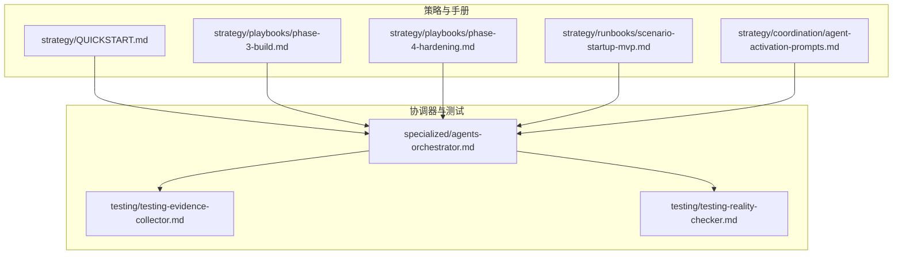
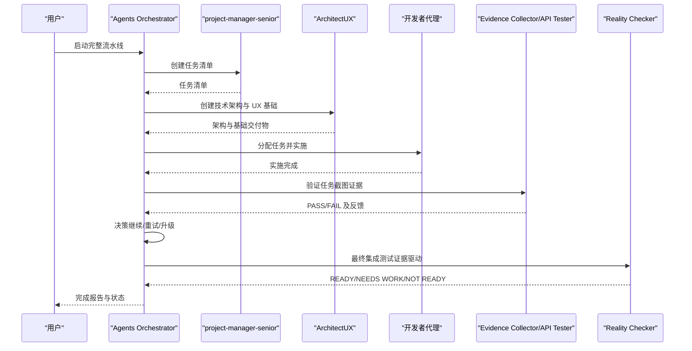
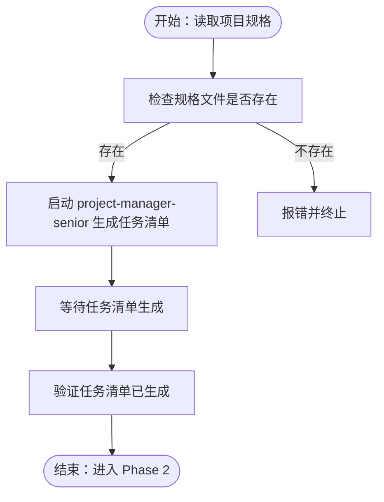
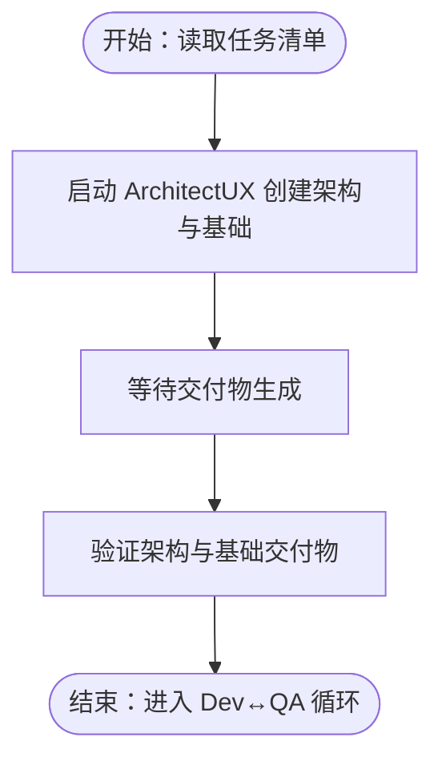
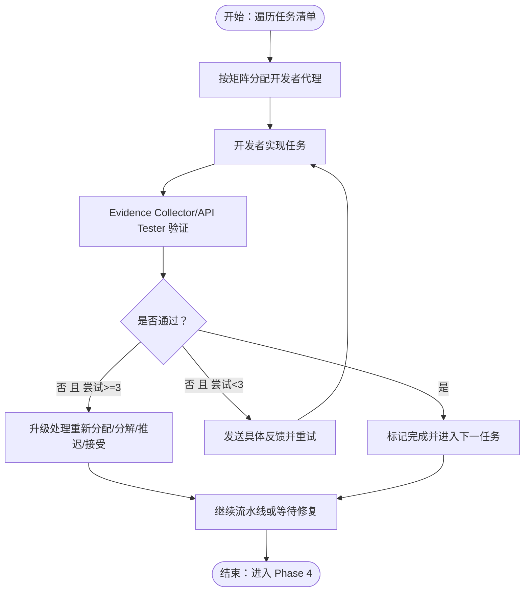
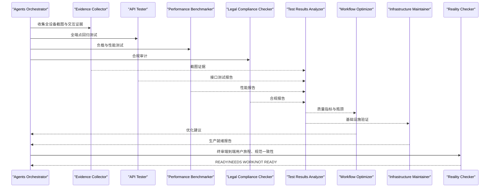
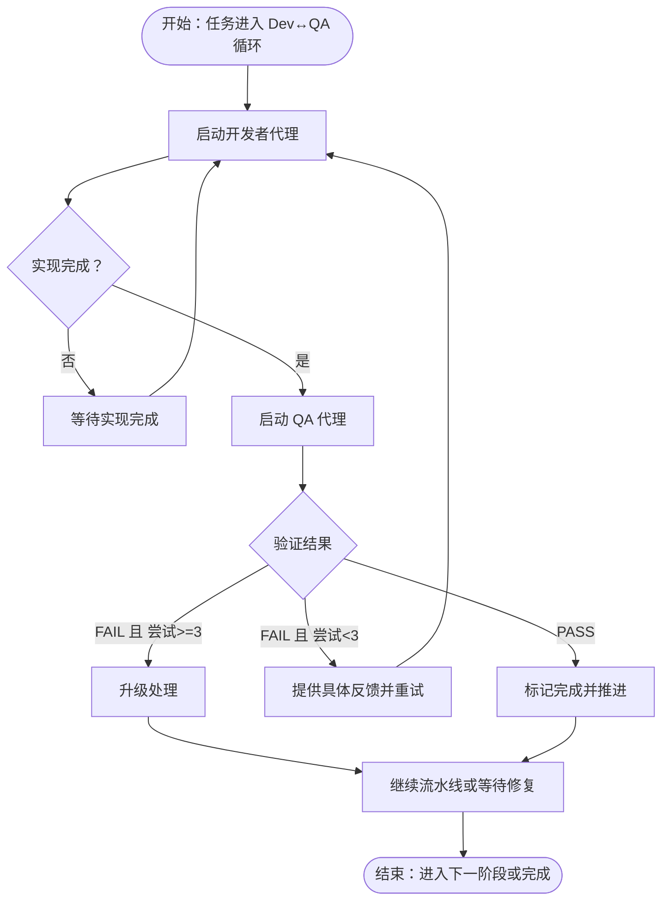
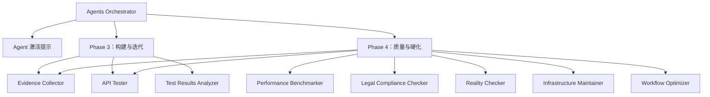

# Agents Orchestrator 协调器

<cite>
**本文引用的文件**
- [agents-orchestrator.md](file://specialized/agents-orchestrator.md)
- [QUICKSTART.md](file://strategy/QUICKSTART.md)
- [README.md](file://README.md)
- [phase-3-build.md](file://strategy/playbooks/phase-3-build.md)
- [phase-4-hardening.md](file://strategy/playbooks/phase-4-hardening.md)
- [scenario-startup-mvp.md](file://strategy/runbooks/scenario-startup-mvp.md)
- [agent-activation-prompts.md](file://strategy/coordination/agent-activation-prompts.md)
- [evidence-collector.md](file://testing/testing-evidence-collector.md)
- [reality-checker.md](file://testing/testing-reality-checker.md)
</cite>

## 目录
1. [简介](#简介)
2. [项目结构](#项目结构)
3. [核心组件](#核心组件)
4. [架构总览](#架构总览)
5. [详细组件分析](#详细组件分析)
6. [依赖关系分析](#依赖关系分析)
7. [性能考量](#性能考量)
8. [故障排查指南](#故障排查指南)
9. [结论](#结论)
10. [附录](#附录)

## 简介
Agents Orchestrator 是一个自主的多代理工作流编排器，负责从需求到交付的完整开发流水线。它通过严格的“开发-质量验证”循环、明确的质量门禁、可追踪的状态管理和自动重试机制，确保每个任务在进入下一阶段前都经过充分验证，并在最终集成阶段由 Reality Checker 进行证据驱动的最终认证。该协调器支持多种模式（Full、Sprint、Micro），并提供标准化的激活提示、交接模板与状态报告格式，便于在不同场景下快速启动和稳定运行。

## 项目结构
本仓库包含大量专用 Agent 的人格化文档与策略手册，其中与协调器直接相关的关键文件如下：
- specialized/agents-orchestrator.md：协调器的人格、职责、工作流阶段、决策逻辑、错误处理与状态报告模板
- strategy/QUICKSTART.md：NEXUS 模式与快速启动指南
- strategy/playbooks/phase-3-build.md：构建与迭代阶段的 Dev↔QA 循环与并行轨道
- strategy/playbooks/phase-4-hardening.md：质量与硬化阶段的证据收集、交叉验证与最终判定
- strategy/runbooks/scenario-startup-mvp.md：MVP 构建的周执行计划与关键决策点
- strategy/coordination/agent-activation-prompts.md：各阶段 Agent 的激活提示与交接模板
- testing/testing-evidence-collector.md：证据型 QA 的方法论与报告模板
- testing/testing-reality-checker.md：最终集成测试与现实校验的流程与模板

图表来源
- [agents-orchestrator.md:53-108](file://specialized/agents-orchestrator.md#L53-L108)
- [phase-3-build.md:19-44](file://strategy/playbooks/phase-3-build.md#L19-L44)
- [phase-4-hardening.md:30-255](file://strategy/playbooks/phase-4-hardening.md#L30-L255)
- [agent-activation-prompts.md:9-59](file://strategy/coordination/agent-activation-prompts.md#L9-L59)
- [evidence-collector.md:39-56](file://testing/testing-evidence-collector.md#L39-L56)
- [reality-checker.md:39-70](file://testing/testing-reality-checker.md#L39-L70)

章节来源
- [agents-orchestrator.md:53-108](file://specialized/agents-orchestrator.md#L53-L108)
- [phase-3-build.md:19-44](file://strategy/playbooks/phase-3-build.md#L19-L44)
- [phase-4-hardening.md:30-255](file://strategy/playbooks/phase-4-hardening.md#L30-L255)
- [agent-activation-prompts.md:9-59](file://strategy/coordination/agent-activation-prompts.md#L9-L59)
- [evidence-collector.md:39-56](file://testing/testing-evidence-collector.md#L39-L56)
- [reality-checker.md:39-70](file://testing/testing-reality-checker.md#L39-L70)

## 核心组件
- 协调器（Agents Orchestrator）：负责全生命周期编排，包括项目分析与规划、技术架构、开发-质量验证循环、最终集成与验证。
- 开发者代理：根据任务类型选择合适的开发者代理（前端、后端、移动端、AI 工程师、DevOps 等）。
- 质量验证代理：Evidence Collector（截图证据型 QA）、API Tester、Performance Benchmarker、Test Results Analyzer 等。
- 最终集成代理：Reality Checker（默认“需要改进”，要求压倒性证据才批准上线）。
- 支持与运营代理：Analytics Reporter、Infrastructure Maintainer、Legal Compliance Checker、Workflow Optimizer 等。

章节来源
- [agents-orchestrator.md:295-360](file://specialized/agents-orchestrator.md#L295-L360)
- [phase-3-build.md:45-76](file://strategy/playbooks/phase-3-build.md#L45-L76)
- [phase-4-hardening.md:30-214](file://strategy/playbooks/phase-4-hardening.md#L30-L214)
- [agent-activation-prompts.md:246-326](file://strategy/coordination/agent-activation-prompts.md#L246-L326)

## 架构总览
协调器以“阶段化 + 质量门禁”的方式组织流水线，每个阶段必须通过质量门禁才能进入下一阶段。Dev↔QA 循环贯穿构建阶段，Reality Checker 在硬化阶段进行最终认证。

图表来源
- [agents-orchestrator.md:55-108](file://specialized/agents-orchestrator.md#L55-L108)
- [phase-3-build.md:19-44](file://strategy/playbooks/phase-3-build.md#L19-L44)
- [phase-4-hardening.md:216-255](file://strategy/playbooks/phase-4-hardening.md#L216-L255)
- [agent-activation-prompts.md:36-59](file://strategy/coordination/agent-activation-prompts.md#L36-L59)

## 详细组件分析

### 1) 项目分析与规划阶段（Phase 1）
- 输入：项目规格文件（project-specs/[project]-setup.md）
- 输出：任务清单（project-tasks/[project]-tasklist.md）
- 关键动作：
  - 验证规格文件存在
  - 启动 project-manager-senior 生成任务清单
  - 等待并验证任务清单生成成功

图表来源
- [agents-orchestrator.md:55-65](file://specialized/agents-orchestrator.md#L55-L65)

章节来源
- [agents-orchestrator.md:55-65](file://specialized/agents-orchestrator.md#L55-L65)

### 2) 技术架构设计阶段（Phase 2）
- 输入：任务清单
- 输出：CSS 设计系统、技术架构文档、UX 基础
- 关键动作：
  - 读取任务清单
  - 启动 ArchitectUX 创建技术架构与 UX 基础
  - 验证交付物（css/、project-docs/*-architecture.md）

图表来源
- [agents-orchestrator.md:67-77](file://specialized/agents-orchestrator.md#L67-L77)

章节来源
- [agents-orchestrator.md:67-77](file://specialized/agents-orchestrator.md#L67-L77)

### 3) 开发-质量验证持续循环（Phase 3）
- 核心机制：每个任务在进入下一任务前必须通过 Evidence Collector 的验证；最多 3 次重试；失败则升级处理。
- 任务分配矩阵：根据任务类别选择合适的开发者代理与 QA 代理。
- 并行轨道：核心产品开发、增长与营销准备、质量与运营、品牌与体验打磨四条轨道并行推进。

图表来源
- [phase-3-build.md:19-44](file://strategy/playbooks/phase-3-build.md#L19-L44)
- [phase-3-build.md:45-76](file://strategy/playbooks/phase-3-build.md#L45-L76)
- [phase-3-build.md:191-232](file://strategy/playbooks/phase-3-build.md#L191-L232)

章节来源
- [phase-3-build.md:19-44](file://strategy/playbooks/phase-3-build.md#L19-L44)
- [phase-3-build.md:45-76](file://strategy/playbooks/phase-3-build.md#L45-L76)
- [phase-3-build.md:191-232](file://strategy/playbooks/phase-3-build.md#L191-L232)

### 4) 最终集成与验证（Phase 4）
- 多代理并行收集证据：Evidence Collector（全设备截图）、API Tester（全端点回归）、Performance Benchmarker（负载测试）、Legal Compliance Checker（合规审计）。
- 分析与评估：Test Results Analyzer 聚合质量指标；Workflow Optimizer 提出流程优化建议；Infrastructure Maintainer 进行生产就绪性检查。
- 最终判定：Reality Checker 默认“需要改进”，只有在压倒性证据下才签发“可上线”。

图表来源
- [phase-4-hardening.md:30-214](file://strategy/playbooks/phase-4-hardening.md#L30-L214)
- [phase-4-hardening.md:216-255](file://strategy/playbooks/phase-4-hardening.md#L216-L255)

章节来源
- [phase-4-hardening.md:30-214](file://strategy/playbooks/phase-4-hardening.md#L30-L214)
- [phase-4-hardening.md:216-255](file://strategy/playbooks/phase-4-hardening.md#L216-L255)

### 5) 决策逻辑与状态管理
- 任务级决策：Evidence Collector 必须提供截图证据；Reality Checker 默认“需要改进”，要求压倒性证据。
- 自动重试：单任务最多 3 次重试；QA 失败时提供具体反馈；若 QA 代理失败则重试启动。
- 上下文传递：每次交接携带完整上下文与特定指令；任务完成后标记完成并推进。
- 文档记录：状态报告与完成总结模板用于记录进度、问题与最终结果。

图表来源
- [agents-orchestrator.md:110-147](file://specialized/agents-orchestrator.md#L110-L147)
- [agents-orchestrator.md:149-168](file://specialized/agents-orchestrator.md#L149-L168)
- [phase-3-build.md:191-217](file://strategy/playbooks/phase-3-build.md#L191-L217)

章节来源
- [agents-orchestrator.md:110-147](file://specialized/agents-orchestrator.md#L110-L147)
- [agents-orchestrator.md:149-168](file://specialized/agents-orchestrator.md#L149-L168)
- [phase-3-build.md:191-217](file://strategy/playbooks/phase-3-build.md#L191-L217)

### 6) 质量门禁机制
- 证据驱动：所有质量评估必须基于实际输出与证据（截图、测试报告、性能数据、合规报告）。
- 门禁标准：
  - Phase 3：所有任务通过 QA、API 端点验证、性能基线达标、无关键缺陷。
  - Phase 4：端到端用户旅程通过、跨设备一致性、性能与安全合规、规范一致性、基础设施就绪。
- Reality Checker 权威：最终决定权在 Reality Checker，仅在压倒性证据下签发“可上线”。

章节来源
- [phase-3-build.md:234-253](file://strategy/playbooks/phase-3-build.md#L234-L253)
- [phase-4-hardening.md:257-268](file://strategy/playbooks/phase-4-hardening.md#L257-L268)
- [reality-checker.md:19-38](file://testing/testing-reality-checker.md#L19-L38)

### 7) 多代理协作与上下文传递
- 代理选择算法：依据任务类型与复杂度选择合适开发者代理与 QA 代理，参考任务分配矩阵。
- 上下文传递：交接模板标准化，确保每轮任务都有完整的背景信息、验收标准与前置交付物。
- 并行轨道：四条轨道并行推进，协调器统一调度与状态追踪。

章节来源
- [phase-3-build.md:45-76](file://strategy/playbooks/phase-3-build.md#L45-L76)
- [agent-activation-prompts.md:36-59](file://strategy/coordination/agent-activation-prompts.md#L36-L59)

### 8) 使用示例与最佳实践
- 启动完整流水线：使用单命令提示激活 Agents Orchestrator，自动执行从 PM 到 ArchitectUX，再到 Dev↔QA 循环，最后由 Reality Checker 进行最终认证。
- MVP 场景：在 4-6 周内完成从发现、架构、核心构建到质量硬化与上线的完整路径，每周进行评审与回顾。
- 快速启动：参考 QUICKSTART 中的三种模式（Full、Sprint、Micro），按需选择团队与流程。

章节来源
- [agents-orchestrator.md:362-367](file://specialized/agents-orchestrator.md#L362-L367)
- [scenario-startup-mvp.md:43-124](file://strategy/runbooks/scenario-startup-mvp.md#L43-L124)
- [QUICKSTART.md:21-67](file://strategy/QUICKSTART.md#L21-L67)

## 依赖关系分析
- 协调器依赖于各阶段的 Agent 激活提示与交接模板，确保任务分配与上下文传递的一致性。
- Evidence Collector 与 Reality Checker 对截图证据有严格要求，形成闭环的质量门禁。
- Phase 3 的 Dev↔QA 循环与 Phase 4 的最终集成测试相互补充，前者保证任务级质量，后者保证系统级质量。

图表来源
- [agent-activation-prompts.md:9-59](file://strategy/coordination/agent-activation-prompts.md#L9-L59)
- [phase-3-build.md:45-76](file://strategy/playbooks/phase-3-build.md#L45-L76)
- [phase-4-hardening.md:30-214](file://strategy/playbooks/phase-4-hardening.md#L30-L214)

章节来源
- [agent-activation-prompts.md:9-59](file://strategy/coordination/agent-activation-prompts.md#L9-L59)
- [phase-3-build.md:45-76](file://strategy/playbooks/phase-3-build.md#L45-L76)
- [phase-4-hardening.md:30-214](file://strategy/playbooks/phase-4-hardening.md#L30-L214)

## 性能考量
- Dev↔QA 循环效率：通过合理的任务拆分与并行轨道，减少串行阻塞；首通过率与平均重试次数是关键指标。
- 质量门禁成本：高质量的证据收集与交叉验证会增加时间成本，但能显著降低后期返工风险。
- 基础设施就绪：在 Phase 4 前完成生产环境验证与监控配置，避免上线后的性能与稳定性问题。

## 故障排查指南
- 代理启动失败：最多重试 2 次；若持续失败，记录并升级，同时采用手动回退流程。
- 任务实现失败：单任务最多 3 次重试；第 3 次失败后标记为阻塞，继续流水线并在最终集成阶段集中处理。
- QA 代理失败：重试启动 QA；若截图捕获失败，请求手动证据；证据不明确时默认“失败”。
- Reality Checker 不批准：根据其报告中的具体问题清单逐项修复，重新进入 Dev↔QA 循环直至满足其“压倒性证据”要求。

章节来源
- [agents-orchestrator.md:149-168](file://specialized/agents-orchestrator.md#L149-L168)
- [evidence-collector.md:100-118](file://testing/testing-evidence-collector.md#L100-L118)
- [reality-checker.md:122-141](file://testing/testing-reality-checker.md#L122-L141)

## 结论
Agents Orchestrator 通过阶段化的流水线、严格的证据驱动质量门禁与自动化的 Dev↔QA 循环，实现了从需求到生产的稳定交付。其标准化的激活提示、交接模板与状态报告，使得多代理协作更加高效、可追踪与可复用。在 MVP 与企业级功能开发中，该协调器均可提供可靠的工程化保障与质量控制。

## 附录
- 快速启动模式与团队配置参考：QUICKSTART 中的 Full、Sprint、Micro 三种模式与对应 Agent 组合。
- MVP 执行计划：Scenario Startup MVP 提供了 4-6 周的周执行计划与关键决策点。
- Agent 激活提示与交接模板：覆盖从全流水线到 Dev↔QA 循环的各类场景。

章节来源
- [QUICKSTART.md:21-67](file://strategy/QUICKSTART.md#L21-L67)
- [scenario-startup-mvp.md:43-124](file://strategy/runbooks/scenario-startup-mvp.md#L43-L124)
- [agent-activation-prompts.md:36-59](file://strategy/coordination/agent-activation-prompts.md#L36-L59)