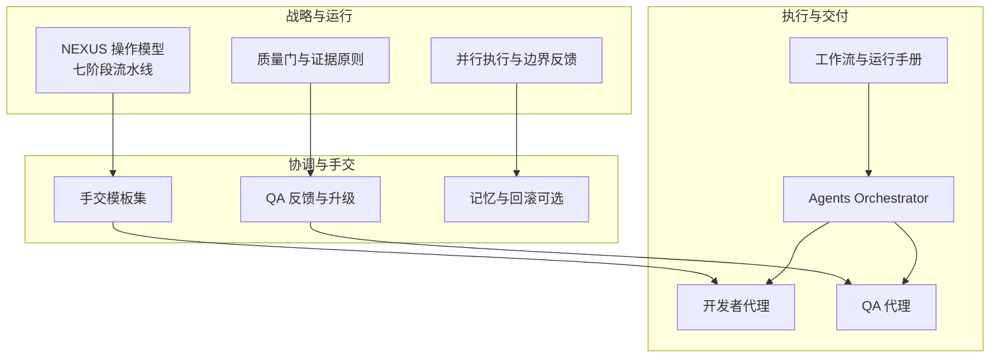
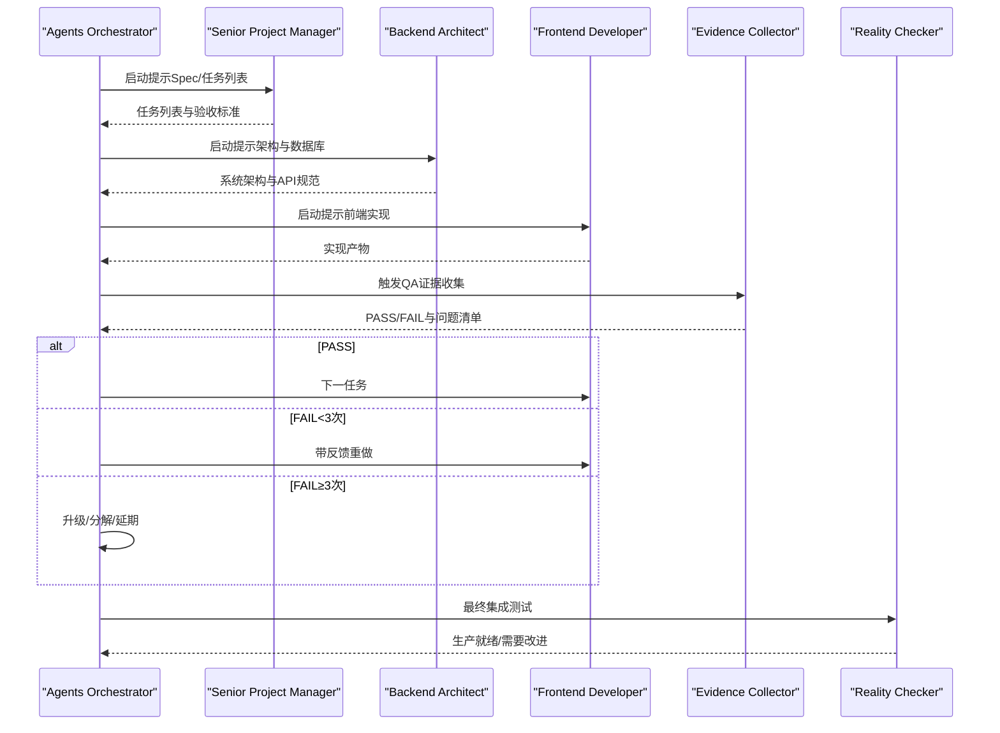
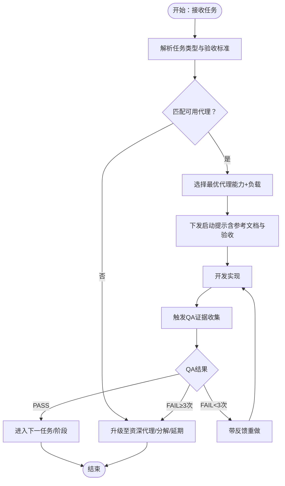
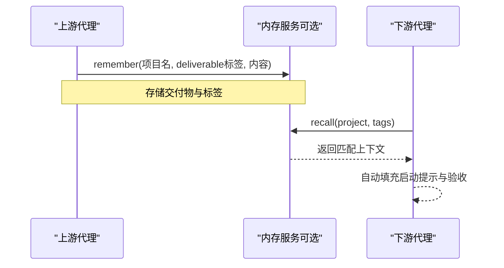
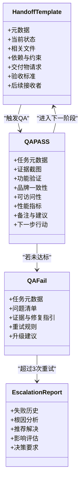
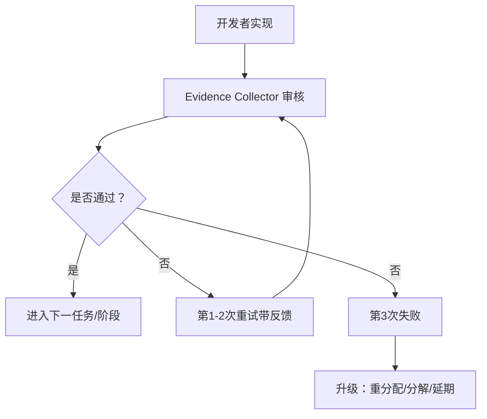
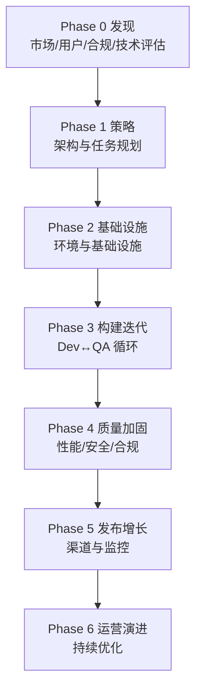
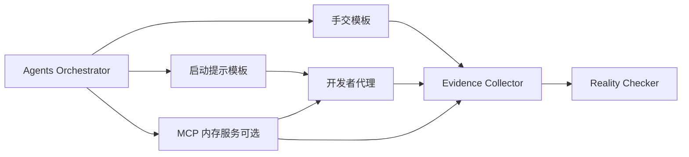

# 代理选择与上下文传递

<cite>
**本文引用的文件**
- [README.md](file://README.md)
- [QUICKSTART.md](file://strategy/QUICKSTART.md)
- [nexus-strategy.md](file://strategy/nexus-strategy.md)
- [phase-0-discovery.md](file://strategy/playbooks/phase-0-discovery.md)
- [phase-1-strategy.md](file://strategy/playbooks/phase-1-strategy.md)
- [agent-activation-prompts.md](file://strategy/coordination/agent-activation-prompts.md)
- [handoff-templates.md](file://strategy/coordination/handoff-templates.md)
- [scenario-startup-mvp.md](file://strategy/runbooks/scenario-startup-mvp.md)
- [workflow-startup-mvp.md](file://examples/workflow-startup-mvp.md)
- [workflow-with-memory.md](file://examples/workflow-with-memory.md)
- [agents-orchestrator.md](file://specialized/agents-orchestrator.md)
- [testing-evidence-collector.md](file://testing/testing-evidence-collector.md)
- [product-manager.md](file://product/product-manager.md)
- [engineering-backend-architect.md](file://engineering/engineering-backend-architect.md)
</cite>

## 目录
1. [简介](#简介)
2. [项目结构](#项目结构)
3. [核心组件](#核心组件)
4. [架构总览](#架构总览)
5. [详细组件分析](#详细组件分析)
6. [依赖分析](#依赖分析)
7. [性能考虑](#性能考虑)
8. [故障排除指南](#故障排除指南)
9. [结论](#结论)
10. [附录](#附录)

## 简介
本文件聚焦于“代理选择与上下文传递”主题，系统阐述 The Agency 多智能体编排体系中的两大关键能力：智能代理选择机制（基于任务类型与能力的匹配、评估与负载均衡）与上下文传递系统（跨代理的项目信息、任务详情、历史记录与反馈的无缝衔接）。文档同时给出代理协作模式（手交流程、指令格式、输出标准、依赖管理）、最佳实践（能力矩阵、性能对比、成本效益与可靠性评估），以及可操作的配置示例、调试方法、优化策略与故障排除清单。

## 项目结构
The Agency 将 144 个专业化代理按职能划分到工程、设计、营销、产品、项目管理、测试、支持、空间计算与专门化等十二个部门，并通过 NEXUS 协作框架将这些独立代理整合为统一的流水线。其核心由三大支柱构成：
- 战略与运行模型：NEXUS 七阶段流水线、质量门、并行执行与证据驱动决策
- 协调与手交：标准化的手交模板、QA 反馈闭环、升级与回滚机制
- 执行与交付：从发现到运营的全生命周期工作流与可复用运行手册

图示来源
- [nexus-strategy.md: 73-127:73-127](file://strategy/nexus-strategy.md#L73-L127)
- [handoff-templates.md: 1-358:1-358](file://strategy/coordination/handoff-templates.md#L1-L358)
- [agent-activation-prompts.md: 1-402:1-402](file://strategy/coordination/agent-activation-prompts.md#L1-L402)
- [QUICKSTART.md: 11-42:11-42](file://strategy/QUICKSTART.md#L11-L42)

章节来源
- [README.md: 68-282:68-282](file://README.md#L68-L282)
- [nexus-strategy.md: 29-71:29-71](file://strategy/nexus-strategy.md#L29-L71)

## 核心组件
- 代理选择与编排
  - Agents Orchestrator：作为管道控制器，负责任务级质量循环、失败处理与状态跟踪；根据任务类型自动选择合适开发者代理，并确保上下文连续性与证据要求。
  - 启动提示与角色定义：各代理启动提示明确任务范围、参考文档、验收标准与质量期望，形成“输入-执行-验证”的闭环。
- 上下文传递
  - 标准化手交模板：涵盖元数据、当前状态、相关文件、依赖约束、交付物请求、验收标准与后续接收者。
  - 记忆与回滚（可选）：通过 MCP 内存服务器实现跨会话的状态持久化与自动召回，减少手写粘贴带来的上下文丢失。
- 质量与协作
  - Evidence Collector：强制视觉证据与现实校验，建立“默认失败、需要压倒性证据才批准”的质量门槛。
  - Reality Checker：最终集成测试与里程碑审批，要求全面截图、端到端流程与规范一致性检查。
  - 并行与串行：阶段内并行推进，阶段间严格质量门，避免冷启动与断层。

章节来源
- [agents-orchestrator.md: 11-147:11-147](file://specialized/agents-orchestrator.md#L11-L147)
- [agent-activation-prompts.md: 36-59:36-59](file://strategy/coordination/agent-activation-prompts.md#L36-L59)
- [handoff-templates.md: 7-46:7-46](file://strategy/coordination/handoff-templates.md#L7-L46)
- [testing-evidence-collector.md: 19-38:19-38](file://testing/testing-evidence-collector.md#L19-L38)
- [testing-evidence-collector.md: 247-253:247-253](file://testing/testing-evidence-collector.md#L247-L253)

## 架构总览
NEXUS 将多智能体系统抽象为“阶段化流水线 + 质量门 + 标准化手交”的统一架构。每个阶段由一组专家代理并行产出，随后进入质量门进行证据审查，合格后进入下一阶段或进入 Dev↔QA 循环。

图示来源
- [agents-orchestrator.md: 110-147:110-147](file://specialized/agents-orchestrator.md#L110-L147)
- [agent-activation-prompts.md: 36-59:36-59](file://strategy/coordination/agent-activation-prompts.md#L36-L59)
- [testing-evidence-collector.md: 247-253:247-253](file://testing/testing-evidence-collector.md#L247-L253)

## 详细组件分析

### 组件A：智能代理选择机制
- 任务类型识别与代理映射
  - 依据任务描述与验收标准，自动匹配最适合的开发者代理（如前端、后端、移动端、AI 工程师、DevOps 等）。
  - 匹配依据包括：技术栈要求、模块职责、依赖关系与历史成功率。
- 能力评估与负载均衡
  - 评估维度：响应时间、首次通过率、平均重试次数、错误分类分布。
  - 负载策略：轮询、优先级队列、容量预留与动态扩容；对高复杂度任务采用资深代理或拆分。
- 决策逻辑与学习
  - 基于历史 QA 结果调整指令与反馈，提升重试效率；对持续阻塞的任务进行分解或重新分配。
- 输出标准化
  - 统一交付物命名、目录结构与验收清单，便于下游 QA 自动化与回溯。

图示来源
- [agents-orchestrator.md: 110-147:110-147](file://specialized/agents-orchestrator.md#L110-L147)
- [agent-activation-prompts.md: 65-88:65-88](file://strategy/coordination/agent-activation-prompts.md#L65-L88)

章节来源
- [agents-orchestrator.md: 280-294:280-294](file://specialized/agents-orchestrator.md#L280-L294)
- [agent-activation-prompts.md: 65-185:65-185](file://strategy/coordination/agent-activation-prompts.md#L65-L185)

### 组件B：上下文传递系统
- 手交模板与证据链
  - 标准手交模板包含元数据、项目状态、相关文件、依赖与约束、交付物请求、验收标准与后续接收者。
  - QA 反馈模板区分 PASS/FAIL，列出具体问题、证据与修复指引；失败超过三次生成升级报告。
- 记忆与回滚（可选）
  - 通过 MCP 内存服务器实现“记住/召回/回滚/搜索”，代理可自动检索项目上下文与交付物标签，减少手写粘贴。
  - 支持跨会话恢复与快速回滚，缩短 QA 失败后的修复周期。
- 运行手册与场景
  - Startup MVP、企业特性开发、营销活动、应急响应等场景均提供可复用的启动提示、手交模板与里程碑检查点。

图示来源
- [handoff-templates.md: 11-46:11-46](file://strategy/coordination/handoff-templates.md#L11-L46)
- [workflow-with-memory.md: 39-59:39-59](file://examples/workflow-with-memory.md#L39-L59)

章节来源
- [handoff-templates.md: 1-358:1-358](file://strategy/coordination/handoff-templates.md#L1-L358)
- [workflow-with-memory.md: 1-239:1-239](file://examples/workflow-with-memory.md#L1-L239)

### 组件C：代理协作模式
- 手交程序设计
  - 标准化手交文档、QA 反馈与升级报告，确保每次交接都有可追溯的证据链。
- 指令格式规范
  - 启动提示包含：项目名称、阶段、任务、验收标准、参考文档路径、实现要求与质量期望。
- 输出格式标准化
  - 统一交付物命名、目录结构与验收清单，便于自动化 QA 与回溯。
- 依赖关系管理
  - 在手交模板中明确“依赖已完成功能”与“约束条件”，避免跨代理断层。

图示来源
- [handoff-templates.md: 11-144:11-144](file://strategy/coordination/handoff-templates.md#L11-L144)
- [agent-activation-prompts.md: 248-304:248-304](file://strategy/coordination/agent-activation-prompts.md#L248-L304)

章节来源
- [agent-activation-prompts.md: 248-325:248-325](file://strategy/coordination/agent-activation-prompts.md#L248-L325)
- [handoff-templates.md: 207-249:207-249](file://strategy/coordination/handoff-templates.md#L207-L249)

### 组件D：质量门与证据驱动
- Evidence Collector 的强制证据原则
  - 默认寻找 3-5 个问题，要求可视化证据；拒绝“无证据声明”与“完美第一版”幻想。
- Reality Checker 的最终审批
  - 需要压倒性证据才批准生产就绪；要求端到端截图、用户旅程与规范一致性检查。
- Dev↔QA 循环
  - 每个任务必须通过 QA 才能进入下一阶段；最多 3 次重试，之后升级处理。

图示来源
- [testing-evidence-collector.md: 19-38:19-38](file://testing/testing-evidence-collector.md#L19-L38)
- [testing-evidence-collector.md: 247-253:247-253](file://testing/testing-evidence-collector.md#L247-L253)
- [agents-orchestrator.md: 149-168:149-168](file://specialized/agents-orchestrator.md#L149-L168)

章节来源
- [testing-evidence-collector.md: 197-200:197-200](file://testing/testing-evidence-collector.md#L197-L200)
- [agents-orchestrator.md: 149-168:149-168](file://specialized/agents-orchestrator.md#L149-L168)

### 组件E：阶段化流水线与运行手册
- 阶段划分与质量门
  - 发现（Phase 0）→ 策略（Phase 1）→ 基础设施（Phase 2）→ 构建迭代（Phase 3）→ 质量加固（Phase 4）→ 发布增长（Phase 5）→ 运营演进（Phase 6）
- 运行手册与场景
  - Startup MVP、企业特性开发、营销活动、应急响应等场景提供可复用的启动提示、手交模板与里程碑检查点。

图示来源
- [nexus-strategy.md: 75-93:75-93](file://strategy/nexus-strategy.md#L75-L93)
- [phase-0-discovery.md: 1-179:1-179](file://strategy/playbooks/phase-0-discovery.md#L1-L179)
- [phase-1-strategy.md: 1-239:1-239](file://strategy/playbooks/phase-1-strategy.md#L1-L239)
- [scenario-startup-mvp.md: 1-155:1-155](file://strategy/runbooks/scenario-startup-mvp.md#L1-L155)

章节来源
- [nexus-strategy.md: 130-239:130-239](file://strategy/nexus-strategy.md#L130-L239)
- [scenario-startup-mvp.md: 1-155:1-155](file://strategy/runbooks/scenario-startup-mvp.md#L1-L155)

## 依赖分析
- 组件耦合与内聚
  - Orchestrator 对各代理的耦合以“启动提示”和“手交模板”为契约，内聚于任务与证据；代理间通过标准化文档解耦。
- 直接与间接依赖
  - 开发代理依赖架构与设计系统；QA 代理依赖证据收集工具与规范；上层决策依赖质量门与历史趋势。
- 外部依赖与集成点
  - MCP 内存服务（可选）用于上下文持久化；各工具集成脚本（Claude Code、Cursor、Aider 等）用于部署与激活。

图示来源
- [agents-orchestrator.md: 285-289:285-289](file://specialized/agents-orchestrator.md#L285-L289)
- [agent-activation-prompts.md: 1-402:1-402](file://strategy/coordination/agent-activation-prompts.md#L1-L402)
- [handoff-templates.md: 1-358:1-358](file://strategy/coordination/handoff-templates.md#L1-L358)
- [workflow-with-memory.md: 39-59:39-59](file://examples/workflow-with-memory.md#L39-L59)

章节来源
- [agent-activation-prompts.md: 1-402:1-402](file://strategy/coordination/agent-activation-prompts.md#L1-L402)
- [handoff-templates.md: 1-358:1-358](file://strategy/coordination/handoff-templates.md#L1-L358)
- [workflow-with-memory.md: 39-59:39-59](file://examples/workflow-with-memory.md#L39-L59)

## 性能考虑
- 任务级并行与阶段内并行
  - 阶段内并行推进以压缩周期，阶段间严格质量门防止返工放大。
- 证据驱动的 QA 与自动化
  - 使用截图与端到端验证减少主观判断误差；对重复问题建立模式识别以降低平均重试次数。
- 记忆与回滚的权衡
  - 记忆服务可显著减少上下文丢失与重做成本，但需关注存储与检索延迟；建议按项目规模与风险等级启用。

## 故障排除指南
- 常见问题与处置
  - 上下文丢失：使用标准手交模板与记忆服务；必要时回滚至上一个已知良好版本。
  - QA 失败循环：检查验收标准与证据链，确保问题可重现且有明确修复路径。
  - 超过 3 次重试：生成升级报告，评估重分配、分解或延期。
- 调试方法
  - 启动提示最小化：仅包含必要参考文档与验收标准，避免歧义。
  - QA 截图与日志：确保可复现的截图与命令行输出。
  - 回归检查：在升级后进行回归验证，确认问题已解决且未引入新问题。

章节来源
- [handoff-templates.md: 148-203:148-203](file://strategy/coordination/handoff-templates.md#L148-L203)
- [testing-evidence-collector.md: 100-118:100-118](file://testing/testing-evidence-collector.md#L100-L118)
- [agents-orchestrator.md: 149-168:149-168](file://specialized/agents-orchestrator.md#L149-L168)

## 结论
The Agency 的“代理选择与上下文传递”体系通过标准化的启动提示、手交模板与质量门，实现了从任务到交付的端到端可控与可复用。结合记忆与回滚机制，可在长周期与多会话场景中保持上下文连续性与可追溯性。建议在实践中以证据驱动的质量门为核心，以任务级并行为抓手，逐步引入记忆服务与自动化 QA，持续优化代理选择与协作效率。

## 附录
- 快速启动与模式
  - NEXUS-Full、NEXUS-Sprint、NEXUS-Micro 三种部署模式，分别面向完整产品生命周期、特性/MVP 与单任务场景。
- 场景化运行手册
  - Startup MVP、企业特性开发、营销活动、应急响应等场景提供可直接使用的启动提示与手交模板。
- 配置示例与调试要点
  - 启动提示模板与手交模板路径：strategy/coordination/agent-activation-prompts.md、strategy/coordination/handoff-templates.md
  - 运行手册与场景：strategy/runbooks/、examples/

章节来源
- [QUICKSTART.md: 11-195:11-195](file://strategy/QUICKSTART.md#L11-L195)
- [scenario-startup-mvp.md: 1-155:1-155](file://strategy/runbooks/scenario-startup-mvp.md#L1-L155)
- [workflow-startup-mvp.md: 1-156:1-156](file://examples/workflow-startup-mvp.md#L1-L156)
- [workflow-with-memory.md: 1-239:1-239](file://examples/workflow-with-memory.md#L1-L239)