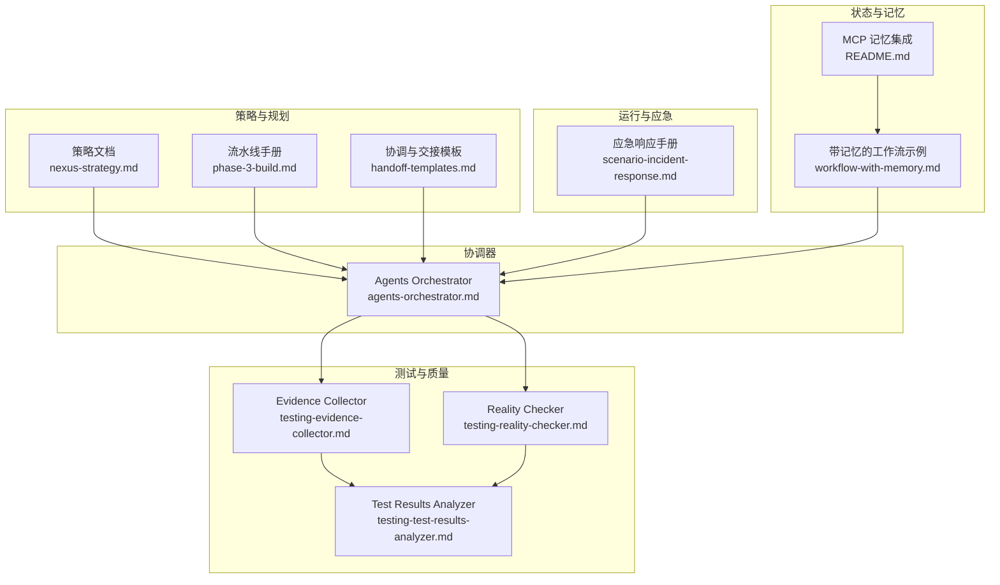
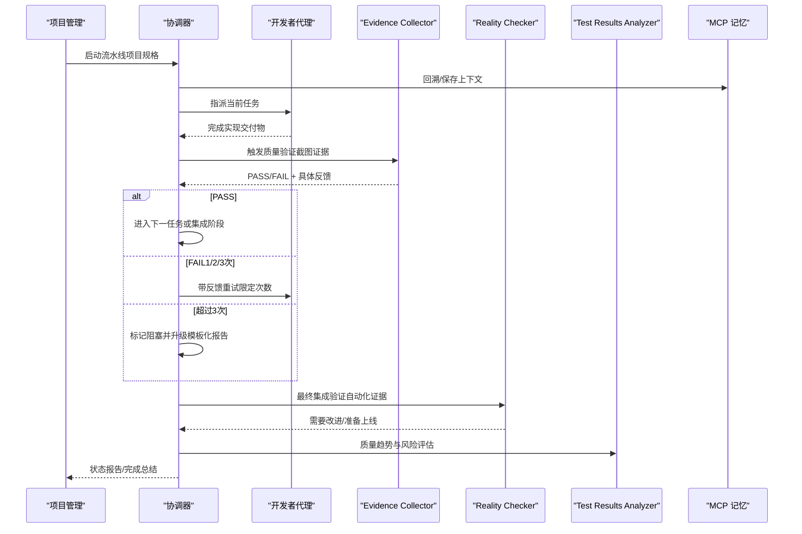
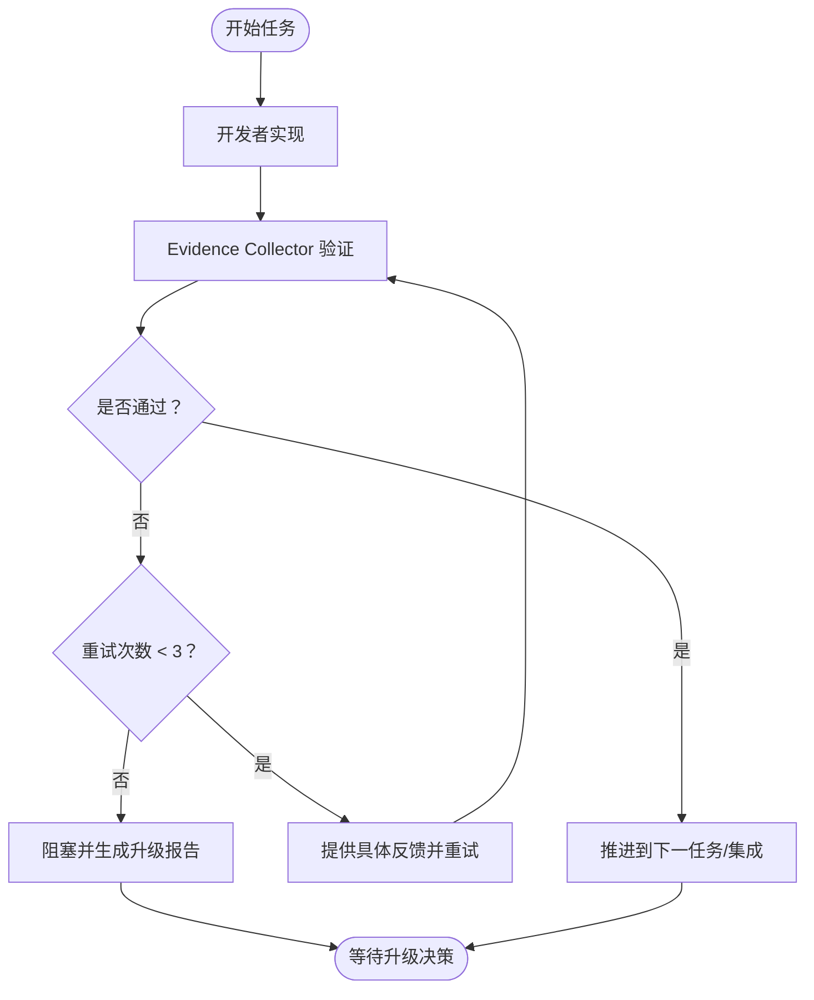
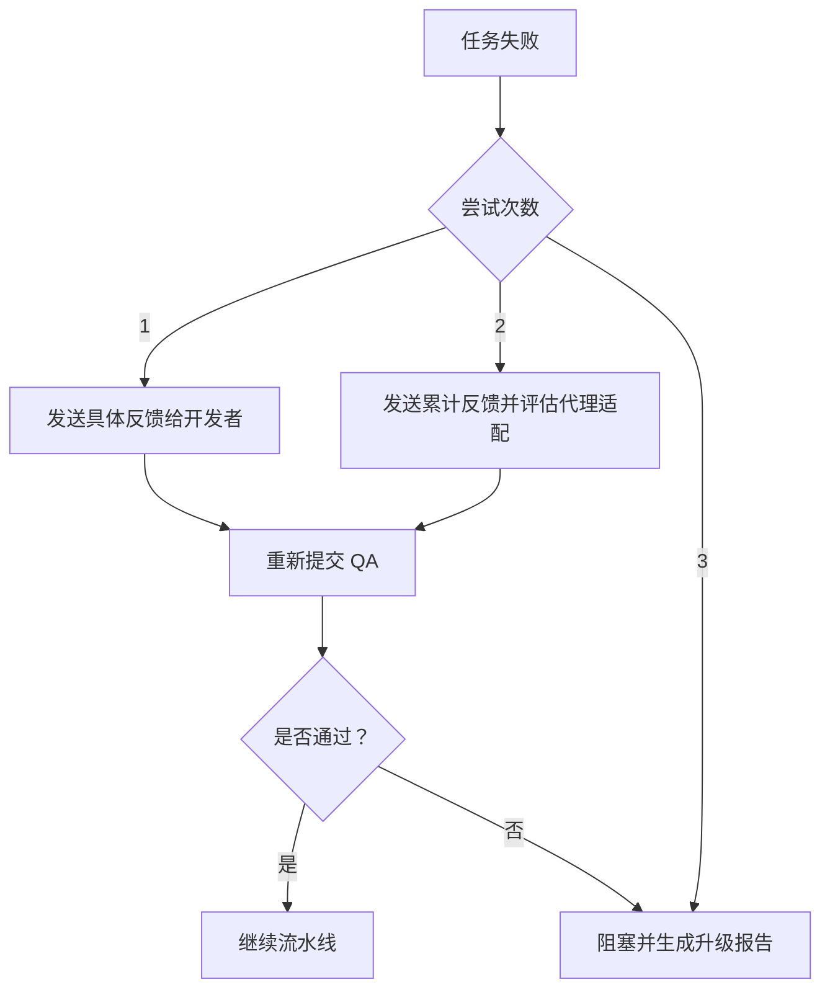
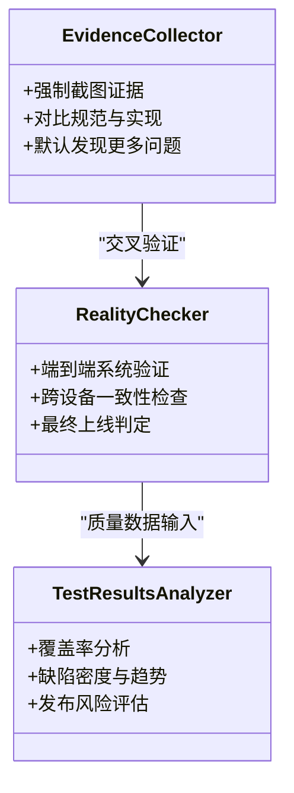
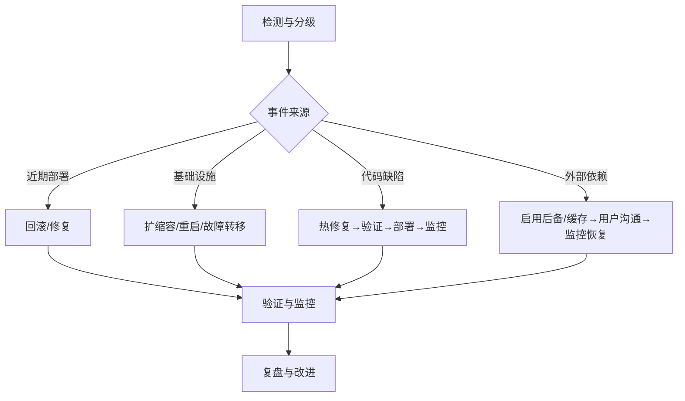
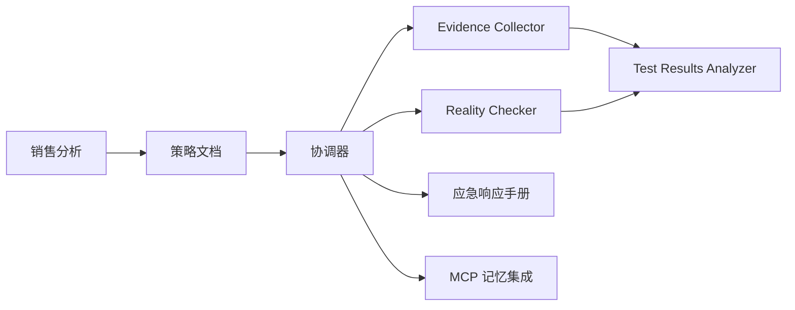

# 决策逻辑与状态管理

<cite>
**本文引用的文件**
- [agents-orchestrator.md](file://specialized/agents-orchestrator.md)
- [handoff-templates.md](file://strategy/coordination/handoff-templates.md)
- [nexus-strategy.md](file://strategy/nexus-strategy.md)
- [phase-3-build.md](file://strategy/playbooks/phase-3-build.md)
- [scenario-incident-response.md](file://strategy/runbooks/scenario-incident-response.md)
- [workflow-with-memory.md](file://examples/workflow-with-memory.md)
- [README.md](file://integrations/mcp-memory/README.md)
- [testing-evidence-collector.md](file://testing/testing-evidence-collector.md)
- [testing-reality-checker.md](file://testing/testing-reality-checker.md)
- [testing-test-results-analyzer.md](file://testing/testing-test-results-analyzer.md)
- [sales-pipeline-analyst.md](file://sales/sales-pipeline-analyst.md)
</cite>

## 目录
1. [引言](#引言)
2. [项目结构](#项目结构)
3. [核心组件](#核心组件)
4. [架构总览](#架构总览)
5. [详细组件分析](#详细组件分析)
6. [依赖关系分析](#依赖关系分析)
7. [性能考量](#性能考量)
8. [故障排查指南](#故障排查指南)
9. [结论](#结论)
10. [附录](#附录)

## 引言
本文件聚焦于“决策逻辑与状态管理”，围绕协调器的智能决策机制展开，涵盖任务级验证流程、重试策略、升级程序、状态跟踪与恢复、上下文保存、决策记录等关键能力，并结合实际工作流模板与运行手册，给出可操作的状态报告与完成总结模板，以及异常情况处理、系统监控与故障诊断方法。

## 项目结构
该仓库以“多智能体工作流”为核心组织方式，围绕“策略（Strategy）—运行手册（Runbooks）—测试（Testing）—专业化代理（Specialized Agents）—示例（Examples）—集成（Integrations）”等维度构建。其中，协调器代理负责端到端的流水线编排与质量门禁；测试代理提供证据驱动的质量评估；运行手册定义应急与常态流程；记忆集成支持跨会话状态与回滚。

图示来源
- [nexus-strategy.md](file://strategy/nexus-strategy.md)
- [phase-3-build.md](file://strategy/playbooks/phase-3-build.md)
- [handoff-templates.md](file://strategy/coordination/handoff-templates.md)
- [agents-orchestrator.md](file://specialized/agents-orchestrator.md)
- [testing-evidence-collector.md](file://testing/testing-evidence-collector.md)
- [testing-reality-checker.md](file://testing/testing-reality-checker.md)
- [testing-test-results-analyzer.md](file://testing/testing-test-results-analyzer.md)
- [scenario-incident-response.md](file://strategy/runbooks/scenario-incident-response.md)
- [README.md](file://integrations/mcp-memory/README.md)
- [workflow-with-memory.md](file://examples/workflow-with-memory.md)

章节来源
- [agents-orchestrator.md](file://specialized/agents-orchestrator.md)
- [nexus-strategy.md](file://strategy/nexus-strategy.md)
- [phase-3-build.md](file://strategy/playbooks/phase-3-build.md)
- [handoff-templates.md](file://strategy/coordination/handoff-templates.md)
- [scenario-incident-response.md](file://strategy/runbooks/scenario-incident-response.md)
- [testing-evidence-collector.md](file://testing/testing-evidence-collector.md)
- [testing-reality-checker.md](file://testing/testing-reality-checker.md)
- [testing-test-results-analyzer.md](file://testing/testing-test-results-analyzer.md)
- [workflow-with-memory.md](file://examples/workflow-with-memory.md)
- [README.md](file://integrations/mcp-memory/README.md)

## 核心组件
- 协调器（Agents Orchestrator）
  - 负责端到端流水线编排：从项目分析、技术架构、开发-质量循环到最终集成验证。
  - 实施严格的质量门禁与重试策略，确保每个任务在进入下一阶段前通过验证。
  - 维护进度、上下文与决策记录，提供状态报告与完成总结模板。
- 测试代理
  - Evidence Collector：要求可视化证据，对交互元素进行系统性验证，形成可追溯的证据链。
  - Reality Checker：最终集成验证，要求压倒性证据才判定“可上线”，默认“需要改进”。
  - Test Results Analyzer：基于统计分析生成质量洞察、风险评估与发布建议。
- 运行与应急
  - 应急响应手册定义严重级别、响应团队、决策树与升级矩阵，支撑快速恢复。
- 状态与记忆
  - MCP 记忆集成提供跨会话状态、自动交接与回滚能力，减少手工交接成本与上下文丢失风险。

章节来源
- [agents-orchestrator.md](file://specialized/agents-orchestrator.md)
- [testing-evidence-collector.md](file://testing/testing-evidence-collector.md)
- [testing-reality-checker.md](file://testing/testing-reality-checker.md)
- [testing-test-results-analyzer.md](file://testing/testing-test-results-analyzer.md)
- [scenario-incident-response.md](file://strategy/runbooks/scenario-incident-response.md)
- [README.md](file://integrations/mcp-memory/README.md)

## 架构总览
下图展示协调器如何在流水线中进行决策与状态管理，以及与测试代理、应急流程、记忆系统的交互。

图示来源
- [agents-orchestrator.md](file://specialized/agents-orchestrator.md)
- [testing-evidence-collector.md](file://testing/testing-evidence-collector.md)
- [testing-reality-checker.md](file://testing/testing-reality-checker.md)
- [testing-test-results-analyzer.md](file://testing/testing-test-results-analyzer.md)
- [handoff-templates.md](file://strategy/coordination/handoff-templates.md)
- [workflow-with-memory.md](file://examples/workflow-with-memory.md)
- [README.md](file://integrations/mcp-memory/README.md)

## 详细组件分析

### 协调器：智能决策机制与状态管理
- 任务级验证流程
  - 开发实现 → 质量验证（截图证据）→ 明确 PASS/FAIL → 循环或推进。
  - 每个任务必须通过 Evidence Collector 的证据驱动验证，Reality Checker 进行最终集成确认。
- 重试策略
  - 每任务最多3次重试；第1/2次重试提供累计反馈；第3次触发阻塞与升级。
  - 若 QA 失败或证据不充分，默认 FAIL 并要求补充证据。
- 升级程序
  - 使用标准化“升级报告”模板，记录失败历史、根因分析、影响评估与推荐方案。
  - 支持重新指派、子任务分解、架构调整、接受现状或延期等选项。
- 状态管理
  - 维护当前阶段、任务进度、QA 状态、重试计数、证据数量、重大问题清单。
  - 提供“管道进度模板”与“完成总结模板”，用于持续汇报与归档。
- 上下文保存与回滚
  - 通过 MCP 记忆集成实现跨会话状态、自动交接与回滚，避免手工交接导致的上下文丢失。

图示来源
- [agents-orchestrator.md](file://specialized/agents-orchestrator.md)
- [testing-evidence-collector.md](file://testing/testing-evidence-collector.md)
- [handoff-templates.md](file://strategy/coordination/handoff-templates.md)

章节来源
- [agents-orchestrator.md](file://specialized/agents-orchestrator.md)
- [handoff-templates.md](file://strategy/coordination/handoff-templates.md)
- [nexus-strategy.md](file://strategy/nexus-strategy.md)
- [phase-3-build.md](file://strategy/playbooks/phase-3-build.md)
- [workflow-with-memory.md](file://examples/workflow-with-memory.md)
- [README.md](file://integrations/mcp-memory/README.md)

### 决策树逻辑：PASS/FAIL、重试控制、阻塞与升级
- 决策树
  - 当 QA FAIL 时，按尝试次数执行不同动作：1次→反馈修复；2次→综合反馈并评估代理适配；3次→阻塞并升级。
  - 并行任务管理：无依赖时并行分配，有依赖时等待前置任务通过后再分配。
- 阻塞任务处理
  - 标记为阻塞后继续流水线，最终集成阶段统一收敛。
- 紧急升级程序
  - 使用“NEXUS 升级报告”模板，包含任务信息、失败历史、根因分析、影响评估与可选解决方案。

图示来源
- [phase-3-build.md](file://strategy/playbooks/phase-3-build.md)
- [handoff-templates.md](file://strategy/coordination/handoff-templates.md)

章节来源
- [phase-3-build.md](file://strategy/playbooks/phase-3-build.md)
- [handoff-templates.md](file://strategy/coordination/handoff-templates.md)

### 测试代理：证据驱动的质量评估
- Evidence Collector
  - 强制可视化证据，对比规范与实现，识别规范不匹配与常见交互缺陷。
  - 默认倾向发现更多问题，避免“完美幻觉”式报告。
- Reality Checker
  - 最终集成验证，要求压倒性证据才判定“可上线”，默认“需要改进”。
  - 对端到端用户旅程、跨设备一致性与性能进行系统性评估。
- Test Results Analyzer
  - 基于统计与机器学习进行覆盖率、缺陷密度、趋势与风险预测，输出发布建议与质量洞察。

图示来源
- [testing-evidence-collector.md](file://testing/testing-evidence-collector.md)
- [testing-reality-checker.md](file://testing/testing-reality-checker.md)
- [testing-test-results-analyzer.md](file://testing/testing-test-results-analyzer.md)

章节来源
- [testing-evidence-collector.md](file://testing/testing-evidence-collector.md)
- [testing-reality-checker.md](file://testing/testing-reality-checker.md)
- [testing-test-results-analyzer.md](file://testing/testing-test-results-analyzer.md)

### 应急响应：严重事件的决策与恢复
- 严重级别与响应团队
  - P0（立即）→ 命令官、回滚、根因调查、沟通与高管简报。
  - P1/P2/P3 分级响应，明确处置时限与责任人。
- 决策树
  - 根据事件来源（部署、基础设施、代码、外部依赖）采取不同缓解措施。
  - 持续更新状态页与高管简报，设置升级矩阵与通知规则。
- 验证与复盘
  - 修复后验证、监控与回归测试；48小时内进行复盘，形成预防措施与行动项。

图示来源
- [scenario-incident-response.md](file://strategy/runbooks/scenario-incident-response.md)

章节来源
- [scenario-incident-response.md](file://strategy/runbooks/scenario-incident-response.md)

### 状态报告与完成总结模板
- 管道进度模板
  - 包含当前阶段、项目、开始时间、任务完成状态、QA 状态、重试次数、质量指标、下一步行动与健康状态。
- 完成总结模板
  - 包含项目名称、总耗时、最终状态、任务结果、QA 循环次数、截图证据、关键问题解决、最终集成状态、团队表现、上线准备度与剩余工作。

章节来源
- [agents-orchestrator.md](file://specialized/agents-orchestrator.md)
- [nexus-strategy.md](file://strategy/nexus-strategy.md)

### 系统监控与故障诊断
- 监控要点
  - 关键质量指标（首过 QA 通过率、平均重试次数、截图证据数量、关键问题数）。
  - 产品与业务指标（响应时间、可用性、转化率、留存、NPS、ROI）。
- 故障诊断
  - 优先检查证据链完整性与一致性；若证据缺失或不一致，按 FAIL 处理。
  - 结合 Test Results Analyzer 的趋势与风险模型定位高风险区域。
  - 应急响应手册提供严重事件的快速决策路径与升级流程。

章节来源
- [nexus-strategy.md](file://strategy/nexus-strategy.md)
- [testing-test-results-analyzer.md](file://testing/testing-test-results-analyzer.md)
- [scenario-incident-response.md](file://strategy/runbooks/scenario-incident-response.md)

## 依赖关系分析
- 协调器依赖测试代理与运行手册，以确保质量门禁与应急处置。
- 测试代理之间存在交叉验证关系，Reality Checker 对 Evidence Collector 的结果进行最终确认。
- 记忆集成贯穿整个流水线，提升跨会话一致性与回滚效率。
- 成功指标与仪表板由策略文档与销售分析工具共同支撑。

图示来源
- [agents-orchestrator.md](file://specialized/agents-orchestrator.md)
- [testing-evidence-collector.md](file://testing/testing-evidence-collector.md)
- [testing-reality-checker.md](file://testing/testing-reality-checker.md)
- [testing-test-results-analyzer.md](file://testing/testing-test-results-analyzer.md)
- [scenario-incident-response.md](file://strategy/runbooks/scenario-incident-response.md)
- [nexus-strategy.md](file://strategy/nexus-strategy.md)
- [sales-pipeline-analyst.md](file://sales/sales-pipeline-analyst.md)
- [README.md](file://integrations/mcp-memory/README.md)

章节来源
- [agents-orchestrator.md](file://specialized/agents-orchestrator.md)
- [testing-evidence-collector.md](file://testing/testing-evidence-collector.md)
- [testing-reality-checker.md](file://testing/testing-reality-checker.md)
- [testing-test-results-analyzer.md](file://testing/testing-test-results-analyzer.md)
- [scenario-incident-response.md](file://strategy/runbooks/scenario-incident-response.md)
- [nexus-strategy.md](file://strategy/nexus-strategy.md)
- [sales-pipeline-analyst.md](file://sales/sales-pipeline-analyst.md)
- [README.md](file://integrations/mcp-memory/README.md)

## 性能考量
- 重试上限与并行化
  - 控制每任务最大重试次数，避免资源浪费；在无依赖前提下并行推进多个任务。
- 质量与速度平衡
  - 通过 Test Results Analyzer 的趋势与风险模型指导资源分配与优先级。
- 可观测性与自动化
  - 强制证据采集与自动化验证，降低人工干预与返工成本。

## 故障排查指南
- QA 证据不足
  - 要求补充截图与自动化测试结果；若仍不充分，默认 FAIL。
- 重复失败
  - 检查反馈是否具体、代理是否合适、任务是否过大；必要时分解为子任务或调整架构。
- 上线前阻塞
  - 使用升级报告模板进行根因分析与影响评估，选择重新指派、分解、修订或接受现状。
- 生产事件
  - 按应急响应手册分级与决策树处理；持续更新状态页与高管简报；48小时内完成复盘。

章节来源
- [testing-evidence-collector.md](file://testing/testing-evidence-collector.md)
- [testing-reality-checker.md](file://testing/testing-reality-checker.md)
- [phase-3-build.md](file://strategy/playbooks/phase-3-build.md)
- [handoff-templates.md](file://strategy/coordination/handoff-templates.md)
- [scenario-incident-response.md](file://strategy/runbooks/scenario-incident-response.md)

## 结论
该体系通过“证据驱动的测试代理 + 协调器的智能决策 + 记忆集成的状态持久化 + 应急响应的升级流程”，实现了从任务级验证到最终上线的闭环管理。配合标准化报告模板与成功指标，既保障质量，又提升效率与可预测性。

## 附录
- 决策示例
  - 任务1 QA FAIL（第1次）：发送具体反馈并重试。
  - 任务1 QA FAIL（第2次）：发送累计反馈并评估代理适配。
  - 任务1 QA FAIL（第3次）：阻塞并生成升级报告，选择重新指派/分解/修订/接受/延期。
- 异常情况处理
  - 证据缺失：默认 FAIL，要求补充证据。
  - 代理_spawn 失败：最多重试2次，持续失败则记录并升级。
  - 重大阻塞：在最终集成阶段统一收敛，避免阻塞扩散。
- 系统监控方法
  - 关注首过 QA 通过率、平均重试次数、关键问题数、上线前阻塞数与发布风险评分。
- 故障诊断技巧
  - 优先核验证据链与一致性；利用趋势与风险模型定位高风险模块；按应急响应手册快速分级与处置。