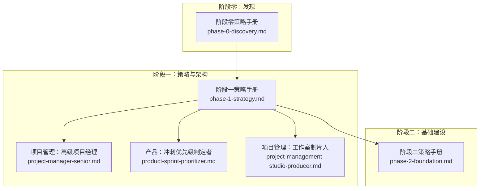
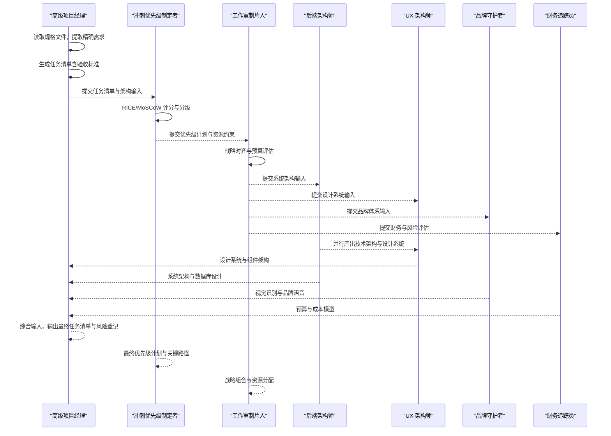
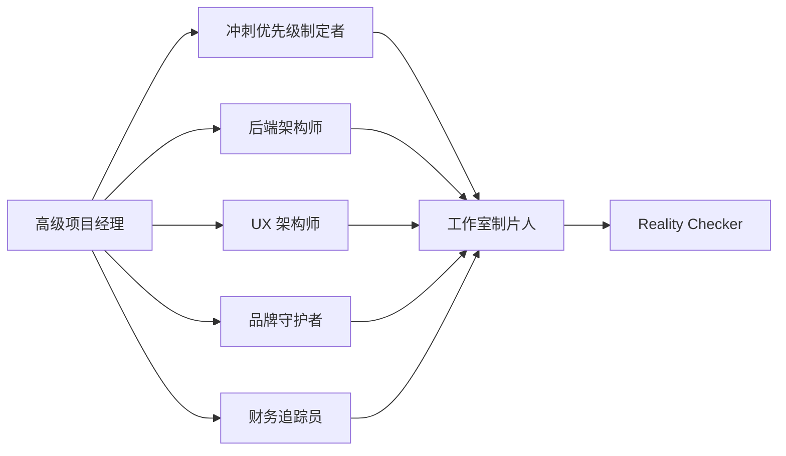

# 阶段一：项目分析与规划

<cite>
**本文引用的文件**
- [project-manager-senior.md](file://project-management/project-manager-senior.md)
- [phase-1-strategy.md](file://strategy/playbooks/phase-1-strategy.md)
- [QUICKSTART.md](file://strategy/QUICKSTART.md)
- [scenario-startup-mvp.md](file://strategy/runbooks/scenario-startup-mvp.md)
- [phase-0-discovery.md](file://strategy/playbooks/phase-0-discovery.md)
- [phase-2-foundation.md](file://strategy/playbooks/phase-2-foundation.md)
- [project-management-studio-producer.md](file://project-management/project-management-studio-producer.md)
- [product-sprint-prioritizer.md](file://product/product-sprint-prioritizer.md)
- [testing-reality-checker.md](file://testing/testing-reality-checker.md)
- [README.md](file://README.md)
</cite>

## 目录
1. [简介](#简介)
2. [项目结构](#项目结构)
3. [核心组件](#核心组件)
4. [架构总览](#架构总览)
5. [详细组件分析](#详细组件分析)
6. [依赖关系分析](#依赖关系分析)
7. [性能考量](#性能考量)
8. [故障排查指南](#故障排查指南)
9. [结论](#结论)
10. [附录](#附录)

## 简介
本阶段聚焦“项目分析与规划”，目标是在不写一行代码的前提下，定义要构建的产品形态、整体架构与成功标准，并产出可执行的任务清单与优先级计划。该阶段强调：
- 基于真实规格文件进行需求验证与任务拆解，避免奢侈品功能与过度设计
- 以证据驱动的质量门禁，确保架构覆盖所有规格要求
- 通过多职能并行与质量门控，形成可交付的架构包与任务清单

## 项目结构
阶段一由多个策略与运行手册构成，围绕“发现—策略—架构—任务—优先级”闭环展开。下图展示了阶段一在整体 NEXUS 流程中的位置与关键参与者。

图表来源
- [phase-1-strategy.md:1-239](file://strategy/playbooks/phase-1-strategy.md#L1-L239)
- [phase-0-discovery.md:1-179](file://strategy/playbooks/phase-0-discovery.md#L1-L179)
- [phase-2-foundation.md:1-279](file://strategy/playbooks/phase-2-foundation.md#L1-L279)
- [project-manager-senior.md:1-136](file://project-management/project-manager-senior.md#L1-L136)
- [product-sprint-prioritizer.md:1-154](file://product/product-sprint-prioritizer.md#L1-L154)
- [project-management-studio-producer.md:1-203](file://project-management/project-management-studio-producer.md#L1-L203)

章节来源
- [phase-1-strategy.md:1-239](file://strategy/playbooks/phase-1-strategy.md#L1-L239)
- [phase-0-discovery.md:1-179](file://strategy/playbooks/phase-0-discovery.md#L1-L179)
- [phase-2-foundation.md:1-279](file://strategy/playbooks/phase-2-foundation.md#L1-L279)

## 核心组件
- 高级项目经理（Spec-to-Task 转换）
  - 责任：从规格文件中提取精确需求，避免奢侈品功能，生成完整且可执行的任务清单
  - 关键规则：不添加规格外功能；引用规格原文；任务可由开发者在 30-60 分钟内完成
  - 输出：带验收标准的任务清单、工作分解结构、关键路径与风险登记册
- 冲刺优先级制定者（特征优先级）
  - 责任：基于架构与预算，用 RICE/MoSCoW 等框架对任务进行评分与分级
  - 关键规则：速度导向、数据驱动、依赖可视化、风险登记
  - 输出：按优先级排列的冲刺计划、发布里程碑映射
- 工作室制片人（战略对齐）
  - 责任：将创意愿景与业务目标对齐，进行资源分配与组合拳式协同
  - 关键规则：财务与风险控制、ROI 导向、跨团队协调
  - 输出：战略组合计划、资源分配策略、风险与收益评估

章节来源
- [project-manager-senior.md:1-136](file://project-management/project-manager-senior.md#L1-L136)
- [product-sprint-prioritizer.md:1-154](file://product/product-sprint-prioritizer.md#L1-L154)
- [project-management-studio-producer.md:1-203](file://project-management/project-management-studio-producer.md#L1-L203)

## 架构总览
阶段一的执行采用“并行探索 + 质量门禁”的模式，确保在进入实现前完成架构与任务的闭环验证。

图表来源
- [phase-1-strategy.md:135-157](file://strategy/playbooks/phase-1-strategy.md#L135-L157)
- [project-manager-senior.md:13-136](file://project-management/project-manager-senior.md#L13-L136)
- [product-sprint-prioritizer.md:1-154](file://product/product-sprint-prioritizer.md#L1-L154)
- [project-management-studio-producer.md:1-203](file://project-management/project-management-studio-producer.md#L1-L203)

## 详细组件分析

### 高级项目经理：Spec-to-Task 转换
职责与流程
- 规格分析：严格依据规格文件，引用原文，识别缺口与模糊点
- 任务创建：将规格分解为可执行任务，每项任务应在 30-60 分钟内完成
- 技术栈提取：从规格底部提取开发栈、CSS 框架、动画偏好、FluxUI 组件与 Laravel/Livewire 集成需求
- 质量要求：禁止后台进程命令、禁止服务器启动命令、移动端响应式、表单可用性、图片来源合规、Playwright 截图测试

任务清单格式规范
- 规格摘要：原始需求、技术栈、目标时间线
- 开发任务：每个任务包含描述、验收标准、文件清单、参考来源
- 质量要求：FluxUI 组件仅使用受支持属性、移动端响应式、表单功能、图片来源合规、截图测试
- 技术备注：开发栈、特殊说明、时间预期

优先级排序原则
- 由冲刺优先级制定者基于 RICE/MoSCoW 等框架统一排序
- 高价值低努力优先，关键路径上的任务优先，依赖先行任务优先

技术债务评估方法
- 在任务清单中记录潜在技术债与权衡点
- 结合架构输入与历史经验，评估对后续迭代的影响
- 通过验收标准量化可接受范围

使用示例
- 正确配置项目规格文件：确保技术栈、页面结构、交互行为、品牌风格等信息明确
- 解读任务清单输出：关注验收标准是否可测试、任务粒度是否适中、文件清单是否完整
- 处理需求变更与冲突：通过工作室制片人进行战略对齐，必要时回退到阶段零重新验证

章节来源
- [project-manager-senior.md:19-136](file://project-management/project-manager-senior.md#L19-L136)

### 冲刺优先级制定者：特征优先级
职责与流程
- 使用 RICE 框架（触达、影响、信心、努力）与 MoSCoW 分类进行评分与分级
- 基于团队容量与历史速度预测可交付内容
- 识别跨团队依赖与瓶颈，建立关键路径与风险登记

优先级排序原则
- 快速收益优先（高价值低努力）
- 战略投资优先（高价值高努力，分阶段实施）
- 容量平衡（低价值低努力用于填充）

技术债务评估方法
- 将技术债纳入“努力”与“影响”维度，降低或延后高债任务
- 通过 A/B 测试与用户反馈持续验证优先级

使用示例
- 输入：高级项目经理的任务清单、系统架构、UX 架构、预算框架、战略计划
- 输出：RICE 评分、冲刺分配、依赖图、MoSCoW 分类、发布计划

章节来源
- [product-sprint-prioritizer.md:1-154](file://product/product-sprint-prioritizer.md#L1-L154)

### 工作室制片人：战略对齐与资源分配
职责与流程
- 将创意愿景与业务目标对齐，制定组合计划与资源分配策略
- 进行财务与风险评估，确保 ROI 与交付能力匹配
- 协调跨职能团队，推动阶段一质量门禁

质量门禁清单
- 架构覆盖 100% 规格要求
- 品牌体系完整（Logo、色彩、字体、声音）
- 技术组件具备实现路径
- 预算获批且在约束内
- 冲刺计划基于速度与现实
- 安全架构定义清晰
- 合规要求融入架构

使用示例
- 输入：各职能产出（架构、品牌、财务、预算）
- 输出：双签批准的架构包与优先级计划

章节来源
- [project-management-studio-producer.md:1-203](file://project-management/project-management-studio-producer.md#L1-L203)
- [phase-1-strategy.md:184-203](file://strategy/playbooks/phase-1-strategy.md#L184-L203)

### 质量门禁：Reality Checker 的证据驱动评审
职责与流程
- 默认“需要改进”，要求压倒性证据才可判定“可上线”
- 执行命令检查、自动化截图捕获、端到端用户旅程验证
- 对比规格与实现，输出综合问题评估与生产就绪建议

证据要求
- 全面的设备截图（桌面、平板、移动）
- 交互序列截图（导航点击、表单填写、手风琴等）
- 性能数据（加载时间、错误、指标）
- 规格对比与差距分析

使用示例
- 输入：自动化截图与测试结果
- 输出：集成报告、问题清单、修复建议、就绪状态

章节来源
- [testing-reality-checker.md:1-237](file://testing/testing-reality-checker.md#L1-L237)

## 依赖关系分析
阶段一内部各角色相互依赖，形成闭环：
- 高级项目经理依赖阶段零的市场、用户与合规洞察
- 冲刺优先级制定者依赖架构与预算输入
- 工作室制片人依赖各职能产出进行战略对齐与资源分配
- Reality Checker 作为最终质量权威，贯穿阶段一与后续阶段

图表来源
- [phase-1-strategy.md:135-157](file://strategy/playbooks/phase-1-strategy.md#L135-L157)
- [project-manager-senior.md:13-136](file://project-management/project-manager-senior.md#L13-L136)
- [product-sprint-prioritizer.md:1-154](file://product/product-sprint-prioritizer.md#L1-L154)
- [project-management-studio-producer.md:1-203](file://project-management/project-management-studio-producer.md#L1-L203)
- [testing-reality-checker.md:1-237](file://testing/testing-reality-checker.md#L1-L237)

章节来源
- [phase-1-strategy.md:1-239](file://strategy/playbooks/phase-1-strategy.md#L1-L239)

## 性能考量
- 任务粒度控制：每项任务应能在 30-60 分钟内完成，减少上下文切换与阻塞
- 并行探索：阶段零与阶段一的并行工作流缩短总周期
- 质量门禁前置：Reality Checker 的证据驱动评审避免后期返工
- 速度预测：冲刺优先级制定者基于历史速度与缓冲因子进行更准确的估算

## 故障排查指南
常见问题与解决思路
- 规格不清晰或存在歧义
  - 行动：回退至阶段零，补充用户研究与竞品分析，明确边界与优先级
- 任务过大或过碎
  - 行动：按 30-60 分钟粒度重拆分，确保可测试与可交付
- 未考虑技术债与依赖
  - 行动：在任务清单中标注技术债，结合关键路径与依赖进行优先级调整
- 预算超支或资源不足
  - 行动：工作室制片人重新评估 ROI 与资源分配，必要时调整范围
- 首次实现质量不达标
  - 行动：Reality Checker 要求压倒性证据，按问题清单逐项修复并复测

章节来源
- [phase-0-discovery.md:114-179](file://strategy/playbooks/phase-0-discovery.md#L114-L179)
- [phase-1-strategy.md:184-203](file://strategy/playbooks/phase-1-strategy.md#L184-L203)
- [testing-reality-checker.md:122-202](file://testing/testing-reality-checker.md#L122-L202)

## 结论
阶段一通过“发现—策略—架构—任务—优先级”的闭环，确保在进入实现前完成需求验证、架构覆盖与质量门禁。高级项目经理负责将规格转化为可执行任务，冲刺优先级制定者用数据驱动的方法确定交付顺序，工作室制片人确保战略与资源一致，Reality Checker 以证据为准绳把关质量。遵循本阶段流程与规范，可显著降低范围蔓延、技术债累积与交付失败的风险。

## 附录
- 快速开始模式
  - NEXUS-Sprint：面向 MVP 或特性快速交付，直接从阶段一进入架构与冲刺规划
  - NEXUS-Full：完整项目生命周期，涵盖阶段零到运营阶段
- 参考文档
  - 阶段零：发现与情报收集
  - 阶段二：基础设施与应用骨架
  - 阶段五：上线与增长
  - 阶段六：运营与演进

章节来源
- [QUICKSTART.md:46-112](file://strategy/QUICKSTART.md#L46-L112)
- [scenario-startup-mvp.md:1-155](file://strategy/runbooks/scenario-startup-mvp.md#L1-L155)
- [README.md:352-416](file://README.md#L352-L416)