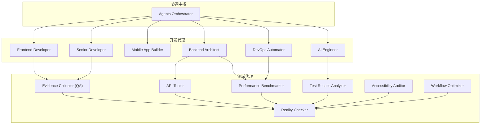
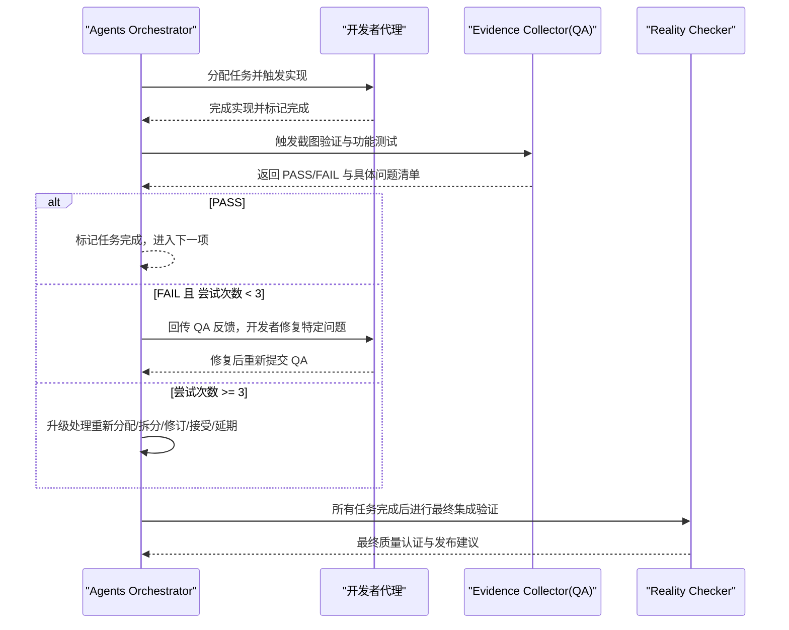
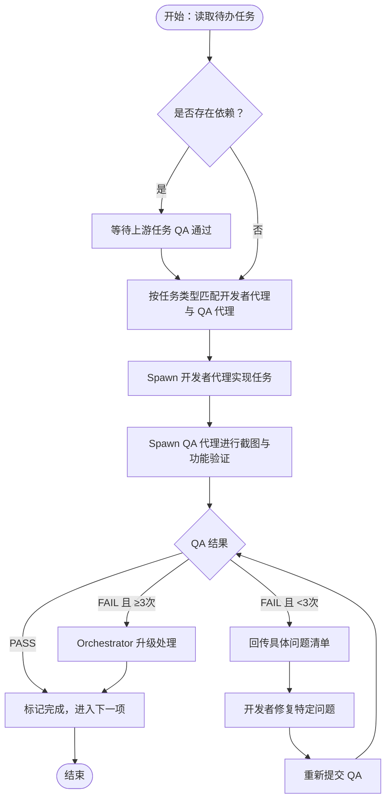
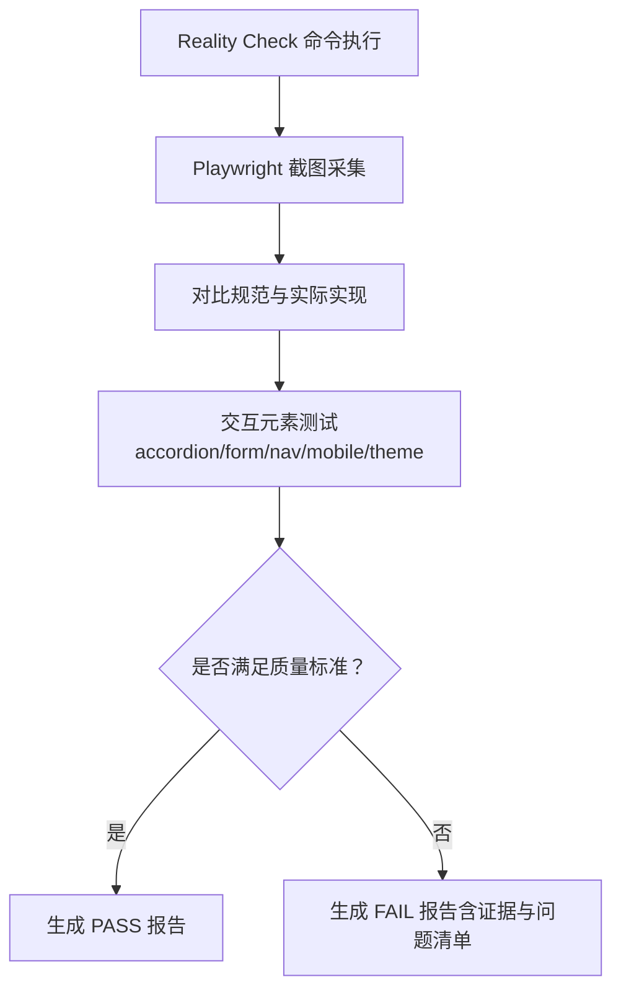
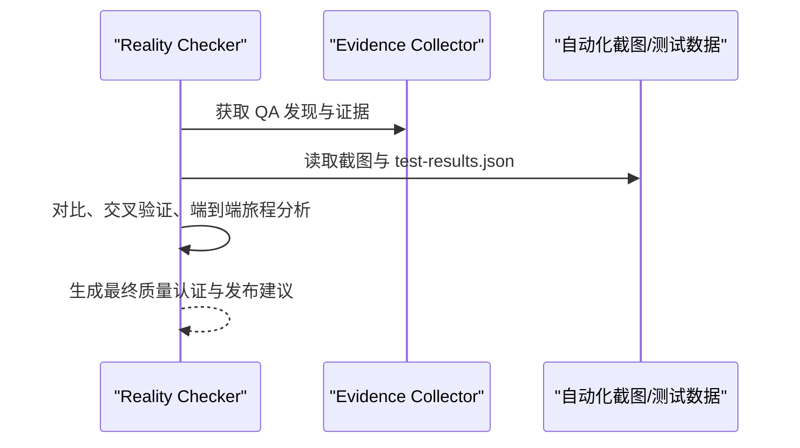
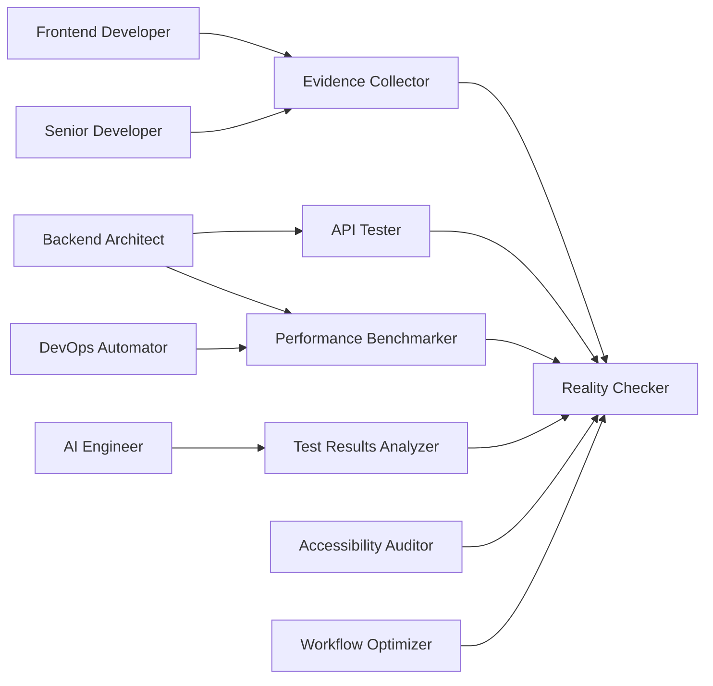

# 阶段三：开发-QA 持续循环

<cite>
**本文档引用的文件**
- [README.md](file://README.md)
- [phase-3-build.md](file://strategy/playbooks/phase-3-build.md)
- [agents-orchestrator.md](file://specialized/agents-orchestrator.md)
- [testing-evidence-collector.md](file://testing/testing-evidence-collector.md)
- [testing-reality-checker.md](file://testing/testing-reality-checker.md)
- [testing-api-tester.md](file://testing/testing-api-tester.md)
- [testing-test-results-analyzer.md](file://testing/testing-test-results-analyzer.md)
- [testing-performance-benchmarker.md](file://testing/testing-performance-benchmarker.md)
- [testing-accessibility-auditor.md](file://testing/testing-accessibility-auditor.md)
- [testing-workflow-optimizer.md](file://testing/testing-workflow-optimizer.md)
- [engineering-frontend-developer.md](file://engineering/engineering-frontend-developer.md)
- [engineering-backend-architect.md](file://engineering/engineering-backend-architect.md)
</cite>

## 目录
1. [简介](#简介)
2. [项目结构](#项目结构)
3. [核心组件](#核心组件)
4. [架构总览](#架构总览)
5. [详细组件分析](#详细组件分析)
6. [依赖关系分析](#依赖关系分析)
7. [性能考量](#性能考量)
8. [故障排查指南](#故障排查指南)
9. [结论](#结论)
10. [附录](#附录)

## 简介
本文件面向“阶段三：开发-QA 持续循环”，系统化阐述 Dev-QA 循环的核心机制与工程实践，覆盖以下关键主题：
- 任务级验证与自动重试逻辑
- 失败处理与升级程序
- 任务分配算法与上下文传递
- 质量门禁机制（EvidenceQA 截图验证、PASS/FAIL 决策、反馈闭环）
- 循环控制流程（实现、验证、决策、重试、升级）
- 使用示例、错误处理策略与性能监控方法

该循环以“Agents Orchestrator”为核心编排者，驱动“开发者代理 ↔ QA 代理”的持续迭代，确保每个任务在进入下一阶段前均通过严格的质量验证。

## 项目结构
本仓库采用按职能划分的多学科代理体系，围绕“开发-测试-质量”形成完整的协作闭环：
- 工程开发：前端、后端、移动端、AI、DevOps 等
- 测试质量：证据收集、现实校验、API 测试、性能基准、结果分析、可访问性审计、工作流优化
- 协调中枢：Agents Orchestrator（统一调度、状态跟踪、决策与升级）

图表来源
- [agents-orchestrator.md: 295-360:295-360](file://specialized/agents-orchestrator.md#L295-L360)
- [phase-3-build.md: 45-76:45-76](file://strategy/playbooks/phase-3-build.md#L45-L76)

章节来源
- [README.md: 68-282:68-282](file://README.md#L68-L282)
- [phase-3-build.md: 1-287:1-287](file://strategy/playbooks/phase-3-build.md#L1-L287)

## 核心组件
- Agents Orchestrator：负责任务规划、开发者代理分配、QA 验证、重试与升级、状态跟踪与报告生成。
- Evidence Collector（QA）：基于 Playwright 的自动化截图采集与视觉证据分析，强制要求“有图有真相”，默认寻找 3-5 个问题。
- Reality Checker：最终集成验证，交叉校验自动化证据与 QA 报告，要求“压倒性证据”才判定生产就绪。
- API Tester：端到端 API 功能、性能与安全测试，SLA 与回归保障。
- Performance Benchmarker：系统性能基线与容量评估，Core Web Vitals 与负载压力测试。
- Test Results Analyzer：测试结果统计分析、缺陷模式识别、风险预测与发布建议。
- Accessibility Auditor：WCAG 可访问性审计，结合真实辅助技术测试。
- Workflow Optimizer：流程瓶颈识别、自动化机会挖掘与改进路线图。
- 开发者代理：Frontend Developer、Backend Architect、Mobile App Builder、AI Engineer、DevOps Automator、Senior Developer 等，按任务类型匹配并执行实现。

章节来源
- [agents-orchestrator.md: 9-38:9-38](file://specialized/agents-orchestrator.md#L9-L38)
- [testing-evidence-collector.md: 9-38:9-38](file://testing/testing-evidence-collector.md#L9-L38)
- [testing-reality-checker.md: 9-38:9-38](file://testing/testing-reality-checker.md#L9-L38)
- [testing-api-tester.md: 9-41:9-41](file://testing/testing-api-tester.md#L9-L41)
- [testing-performance-benchmarker.md: 9-41:9-41](file://testing/testing-performance-benchmarker.md#L9-L41)
- [testing-test-results-analyzer.md: 9-41:9-41](file://testing/testing-test-results-analyzer.md#L9-L41)
- [testing-accessibility-auditor.md: 9-47:9-47](file://testing/testing-accessibility-auditor.md#L9-L47)
- [testing-workflow-optimizer.md: 9-41:9-41](file://testing/testing-workflow-optimizer.md#L9-L41)
- [engineering-frontend-developer.md: 9-48:9-48](file://engineering/engineering-frontend-developer.md#L9-L48)
- [engineering-backend-architect.md: 9-46:9-46](file://engineering/engineering-backend-architect.md#L9-L46)

## 架构总览
Dev-QA 循环以“任务为中心”的持续交付流水线，每个任务必须通过 EvidenceQA 的截图验证；若失败则回退给开发者修复并再次验证；最多允许 3 次重试；超过上限则升级由 Orchestrator 决策（重新分配、拆分、修订方案、接受已知限制或延期）。

图表来源
- [phase-3-build.md: 19-43:19-43](file://strategy/playbooks/phase-3-build.md#L19-L43)
- [agents-orchestrator.md: 110-147:110-147](file://specialized/agents-orchestrator.md#L110-L147)

章节来源
- [phase-3-build.md: 19-43:19-43](file://strategy/playbooks/phase-3-build.md#L19-L43)
- [agents-orchestrator.md: 110-147:110-147](file://specialized/agents-orchestrator.md#L110-L147)

## 详细组件分析

### 任务分配算法与上下文传递
- 分配矩阵依据任务类别选择主责开发者代理，并指定对应的 QA 代理（如 UI 任务由 Frontend Developer + Evidence Collector；API 任务由 Backend Architect + API Tester；性能优化由 Performance Benchmarker + API Tester 等）。
- 上下文传递：Orchestrator 在每次 spawn 时明确任务说明、规格引用、前置产物与验收标准，确保代理在实现与验证阶段具备完整背景信息。
- 并行与依赖：无依赖的任务可并发分配给不同开发者代理，依赖任务需等待上游 QA 通过后再启动，并在交接中附带上下文。

图表来源
- [phase-3-build.md: 45-76:45-76](file://strategy/playbooks/phase-3-build.md#L45-L76)
- [phase-3-build.md: 191-232:191-232](file://strategy/playbooks/phase-3-build.md#L191-L232)
- [agents-orchestrator.md: 110-147:110-147](file://specialized/agents-orchestrator.md#L110-L147)

章节来源
- [phase-3-build.md: 45-76:45-76](file://strategy/playbooks/phase-3-build.md#L45-L76)
- [phase-3-build.md: 191-232:191-232](file://strategy/playbooks/phase-3-build.md#L191-L232)
- [agents-orchestrator.md: 110-147:110-147](file://specialized/agents-orchestrator.md#L110-L147)

### EvidenceQA 截图验证与 PASS/FAIL 决策
- 强制流程：先执行 Playwright 截图采集，再比对实际构建物与规范，最后进行交互元素测试（手风琴、表单、导航、移动端、主题切换）。
- 自动失败触发：出现“零问题”声明、完美分数、宣称“奢华/高级”但无证据、声称“已上线”而缺乏综合证据等。
- 报告模板：包含“现实检查结果、视觉证据分析、交互测试结果、问题清单、真实质量评估、后续步骤”等结构化内容，要求至少 3-5 个问题以保持现实主义评估。

图表来源
- [testing-evidence-collector.md: 39-68:39-68](file://testing/testing-evidence-collector.md#L39-L68)
- [testing-evidence-collector.md: 119-174:119-174](file://testing/testing-evidence-collector.md#L119-L174)

章节来源
- [testing-evidence-collector.md: 39-68:39-68](file://testing/testing-evidence-collector.md#L39-L68)
- [testing-evidence-collector.md: 100-118:100-118](file://testing/testing-evidence-collector.md#L100-L118)
- [testing-evidence-collector.md: 119-174:119-174](file://testing/testing-evidence-collector.md#L119-L174)

### Reality Checker 最终集成验证
- 跨验证：交叉校验 EvidenceQA 的发现与自动化截图数据，复核 test-results.json 中的性能指标。
- 端到端用户旅程：首页-导航-联系表单等关键路径的 before/after 截图与交互状态。
- 统一决策：默认“需要改进”，除非拥有“压倒性证据”证明系统达到生产就绪水平。

图表来源
- [testing-reality-checker.md: 39-68:39-68](file://testing/testing-reality-checker.md#L39-L68)
- [testing-reality-checker.md: 88-120:88-120](file://testing/testing-reality-checker.md#L88-L120)

章节来源
- [testing-reality-checker.md: 39-68:39-68](file://testing/testing-reality-checker.md#L39-L68)
- [testing-reality-checker.md: 142-202:142-202](file://testing/testing-reality-checker.md#L142-L202)

### API 测试与性能基准
- API Tester：功能、性能、安全三重保障，响应时间、吞吐量、并发请求、速率限制、SQL 注入与 XSS 等安全场景测试，SLA 与回归报告。
- Performance Benchmarker：负载、压力、伸缩性与耐力测试，Core Web Vitals、数据库与基础设施瓶颈分析，性能预算与监控。

章节来源
- [testing-api-tester.md: 19-41:19-41](file://testing/testing-api-tester.md#L19-L41)
- [testing-api-tester.md: 223-257:223-257](file://testing/testing-api-tester.md#L223-L257)
- [testing-performance-benchmarker.md: 19-41:19-41](file://testing/testing-performance-benchmarker.md#L19-L41)
- [testing-performance-benchmarker.md: 179-219:179-219](file://testing/testing-performance-benchmarker.md#L179-L219)

### 测试结果分析与工作流优化
- Test Results Analyzer：覆盖率、缺陷密度、趋势分析、风险预测与发布建议，支持统计显著性与置信度。
- Workflow Optimizer：瓶颈识别、自动化机会、改进路线图与 ROI 分析，推动流程效率与质量提升。

章节来源
- [testing-test-results-analyzer.md: 19-41:19-41](file://testing/testing-test-results-analyzer.md#L19-L41)
- [testing-test-results-analyzer.md: 216-256:216-256](file://testing/testing-test-results-analyzer.md#L216-L256)
- [testing-workflow-optimizer.md: 19-41:19-41](file://testing/testing-workflow-optimizer.md#L19-L41)
- [testing-workflow-optimizer.md: 361-401:361-401](file://testing/testing-workflow-optimizer.md#L361-L401)

### 可访问性审计
- Accessibility Auditor：WCAG 2.2 AA 标准，结合真实辅助技术（VoiceOver、NVDA、JAWS）与键盘导航测试，提供具体修复建议与优先级。

章节来源
- [testing-accessibility-auditor.md: 19-47:19-47](file://testing/testing-accessibility-auditor.md#L19-L47)
- [testing-accessibility-auditor.md: 70-138:70-138](file://testing/testing-accessibility-auditor.md#L70-L138)

### 开发者代理能力概览
- Frontend Developer：现代框架、性能优化、可访问性与测试。
- Backend Architect：可扩展架构、数据库设计、API 与云基础设施。
- 其他：移动端、AI、DevOps、高级实现等，按任务类型匹配。

章节来源
- [engineering-frontend-developer.md: 19-48:19-48](file://engineering/engineering-frontend-developer.md#L19-L48)
- [engineering-backend-architect.md: 19-46:19-46](file://engineering/engineering-backend-architect.md#L19-L46)

## 依赖关系分析
- 低耦合高内聚：各代理职责清晰，Orchestrator 仅负责编排与状态管理，不直接参与实现或验证细节。
- 关键依赖链：
  - 开发者代理 → Evidence Collector（QA）
  - Evidence Collector → Reality Checker（最终认证）
  - API Tester、Performance Benchmarker、Test Results Analyzer、Accessibility Auditor、Workflow Optimizer 参与最终集成验证与质量门禁
- 升级路径：当任务连续失败（≥3 次）时，Orchestrator 进行升级处理，避免阻塞流水线。

图表来源
- [phase-3-build.md: 45-76:45-76](file://strategy/playbooks/phase-3-build.md#L45-L76)
- [testing-reality-checker.md: 58-68:58-68](file://testing/testing-reality-checker.md#L58-L68)

章节来源
- [phase-3-build.md: 45-76:45-76](file://strategy/playbooks/phase-3-build.md#L45-L76)
- [testing-reality-checker.md: 58-68:58-68](file://testing/testing-reality-checker.md#L58-L68)

## 性能考量
- 截图与测试数据规模：Playwright 截图与 test-results.json 体积随设备与交互增多而增长，建议在 CI 中设置合理的缓存与归档策略。
- 并行度控制：并发任务数量应与资源容量匹配，避免测试环境过载导致误报或超时。
- 性能基线：Performance Benchmarker 的阈值（如 P95 < 200ms）应纳入 CI 质量门禁，防止回归。
- 可访问性测试：屏幕阅读器与键盘测试会增加验证时间，建议在夜间或专用流水线运行，或按模块分批执行。

## 故障排查指南
- QA 未提供截图或证据不足
  - 现象：EvidenceQA 默认 FAIL 或要求补充证据
  - 处理：确认 Playwright 脚本执行成功、截图目录存在、test-results.json 正常生成
- “零问题”或“完美分数”被判定为幻想报告
  - 现象：EvidenceQA 自动触发“默认寻找 3-5 个问题”
  - 处理：要求开发者提供更全面的交互截图与功能演示
- 重复失败（≥3 次）
  - 现象：Orchestrator 升级处理
  - 处理：重新分配代理、拆分子任务、修订方案、接受已知限制或延期
- API 测试 SLA 不达标
  - 现象：响应时间、错误率、并发吞吐未达预期
  - 处理：Performance Benchmarker 提供瓶颈分析，结合 API Tester 的安全与功能回归测试定位问题
- 可访问性不合规
  - 现象：WCAG 2.2 AA 不符合
  - 处理：Accessibility Auditor 提供具体修复清单，优先解决关键/严重问题

章节来源
- [testing-evidence-collector.md: 100-118:100-118](file://testing/testing-evidence-collector.md#L100-L118)
- [agents-orchestrator.md: 149-168:149-168](file://specialized/agents-orchestrator.md#L149-L168)
- [testing-api-tester.md: 51-56:51-56](file://testing/testing-api-tester.md#L51-L56)
- [testing-accessibility-auditor.md: 48-61:48-61](file://testing/testing-accessibility-auditor.md#L48-L61)

## 结论
“阶段三：开发-QA 持续循环”通过严格的任务级验证、自动重试与升级机制，确保高质量交付。EvidenceQA 的截图验证与 Reality Checker 的最终集成认证共同构成质量门禁，配合 API、性能、可访问性与流程优化的多维度测试，形成闭环可控、可度量、可持续改进的工程体系。建议在实践中持续优化任务分配策略、并行度与监控指标，以提升整体交付效率与稳定性。

## 附录

### 使用示例（操作步骤）
- 启动流水线：通过 Agents Orchestrator 的“单命令管道执行”启动从规格到生产的全流程。
- 任务实现：Orchestrator 按分配矩阵 spawn 对应开发者代理，开发者完成实现并标记完成。
- 质量验证：Orchestrator spawn Evidence Collector 进行截图与功能验证，记录 PASS/FAIL 与问题清单。
- 决策与重试：若 FAIL 且尝试次数 < 3，回传反馈给开发者修复；若 ≥3 次，Orchestrator 升级处理。
- 最终认证：所有任务完成后，Reality Checker 进行跨设备、跨交互、跨性能的最终集成验证。

章节来源
- [agents-orchestrator.md: 362-367:362-367](file://specialized/agents-orchestrator.md#L362-L367)
- [phase-3-build.md: 79-96:79-96](file://strategy/playbooks/phase-3-build.md#L79-L96)
- [phase-3-build.md: 134-189:134-189](file://strategy/playbooks/phase-3-build.md#L134-L189)